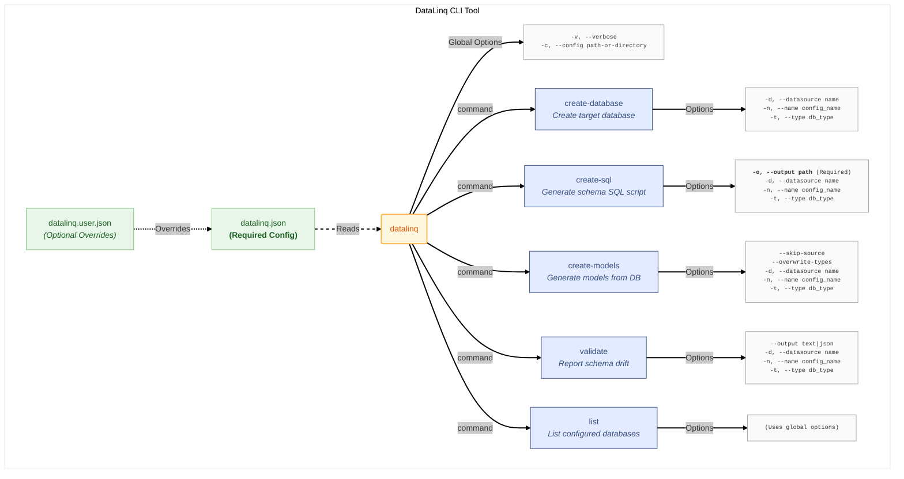

# DataLinq CLI Documentation

The DataLinq CLI tool lets you inspect configuration, generate models, generate SQL, create databases, and validate model metadata against a live database from the command line. It is installed as the global `datalinq` tool.

## Overview



---

## General Options

All commands accept the following general options:

- **-v, --verbose**  
  Enable verbose output for more detailed logging.

- **-c, --config**  
  Specify either the path to `datalinq.json` or a directory containing it.  
  *(Optional)*

## Selection Rules

The CLI resolves a target database from the config before it can do any work.

- If the config contains more than one database, you must pass `-n` or `--name`.
- If the selected database contains more than one connection type, you must pass `-t` or `--type`.
- `datalinq.user.json` is discovered by replacing `.json` with `.user.json` next to the main config file, then merged on top.

In the CLI entry point, the built-in registered providers are:

- `MySQL`
- `MariaDB`
- `SQLite`

---

## Commands

### 1. create-database

**Purpose:**  
Creates the target database using the model metadata and configuration settings.

**Usage:**  
```bash
datalinq create-database [options]
```

**Options:**

- **-d, --datasource**  
  *Description:* Name of the database instance on the server or the file on disk (depending on the connection type).  
  *Optional*

- **-n, --name**  
  *Description:* The name as defined in the DataLinq configuration file.  
  *Optional*

- **-t, --type**  
  *Description:* Specifies the database connection type to create the database for (e.g., MySQL, SQLite).  
  *Optional*

---

### 2. create-sql

**Purpose:**  
Generates SQL scripts for creating the database schema based on the model definitions.

**Usage:**  
```bash
datalinq create-sql -o <output-file> [other options]
```

**Options:**

- **-o, --output**  
  *Description:* Path to the output file where the generated SQL script will be saved.  
  *Required*

- **-d, --datasource**  
  *Description:* Name of the database instance on the server or the file on disk.  
  *Optional*

- **-n, --name**  
  *Description:* The name as defined in the DataLinq configuration file.  
  *Optional*

- **-t, --type**  
  *Description:* Specifies the database connection type (e.g., MySQL, SQLite).  
  *Optional*

- Additionally, the general options (`-v, --verbose` and `-c, --config`) can also be used.

---

### 3. create-models

**Purpose:**  
Generates data model classes directly from your database schema.

**Usage:**  
```bash
datalinq create-models [options]
```

**Options:**

- **--skip-source**  
  *Description:* Skip reading from source models during generation.
  *Optional*

- **--overwrite-types**  
  *Description:* Force C# property types in your model files to be overwritten with the types inferred from the database. By default, existing C# types (especially enums) are preserved.
  *Optional*

- **-d, --datasource**  
  *Description:* Name of the database instance on the server or the file on disk.  
  *Optional*

- **-n, --name**  
  *Description:* The name as defined in the DataLinq configuration file.  
  *Optional*

- **-t, --type**  
  *Description:* Specifies the database connection type (e.g., MySQL, SQLite).  
  *Optional*

- General options (`-v, --verbose` and `-c, --config`) are also available.

**Important:**  
`create-models` is not a dry-run command. It writes generated files to the configured destination directory and is intended to refresh generated model output.

---

### 4. validate

**Purpose:**  
Loads the configured C# model metadata, reads live database metadata through the selected provider, and reports schema drift without applying changes.

**Usage:**  
```bash
datalinq validate [options]
```

**Options:**

- **--output**  
  *Description:* Output format. Supported values are `text` and `json`.  
  *Default:* `text`

- **-d, --datasource**  
  *Description:* Name of the database instance on the server or the file on disk.  
  *Optional*

- **-n, --name**  
  *Description:* The name as defined in the DataLinq configuration file.  
  *Optional*

- **-t, --type**  
  *Description:* Specifies the database connection type (e.g., MySQL, MariaDB, SQLite).  
  *Optional*

- General options (`-v, --verbose` and `-c, --config`) are also available.

**Exit codes:**

- `0`: validation completed and no schema drift was detected
- `1`: validation completed and schema drift was detected
- `2`: command, configuration, connection, model parsing, or metadata loading failed

**Important:**  
`validate` is read-only. It reports drift; it does not generate migration scripts or apply schema changes.

---

### 5. list

**Purpose:**  
Lists all databases defined in your DataLinq configuration file.

**Usage:**  
```bash
datalinq list [options]
```

**Options:**

- **-v, --verbose**  
  *Description:* Enable verbose output for detailed listing.  
  *Optional*

- **-c, --config**  
  *Description:* Path to the configuration file (e.g., `datalinq.json`).  
  *Optional*

---

## Example Usages

- **Creating a Database:**
  ```bash
  datalinq create-database -n MyDatabase -t MySQL
  ```

- **Generating SQL Script:**
  ```bash
  datalinq create-sql -o schema.sql -n MyDatabase -t SQLite
  ```

- **Generating Models:**
  ```bash
  datalinq create-models -n MyDatabase
  ```

- **Generating Models and Forcing Type Overwrite:**
  ```bash
  datalinq create-models -n MyDatabase --overwrite-types
  ```

- **Validating Models Against a Live Database:**
  ```bash
  datalinq validate -n MyDatabase -t SQLite
  ```

- **Validating with JSON Output:**
  ```bash
  datalinq validate -n MyDatabase --output json
  ```

- **Listing Databases from Config:**
  ```bash
  datalinq list -c ./datalinq.json -v
  ```

- **Using a directory instead of a file for config discovery:**
  ```bash
  datalinq create-models -c . -n MyDatabase
  ```

## Common Failure Cases

- **More than one database in config and no `-n`:**  
  The command cannot choose a database automatically and fails until you specify `--name`.

- **More than one connection type on the selected database and no `-t`:**  
  The command cannot choose a provider automatically and fails until you specify `--type`.

- **Using `datalinq.user.json` for overrides:**  
  The CLI does not scan for arbitrary override files. It only looks for the file created by replacing `.json` with `.user.json` next to the main config file.

- **Running `create-models`:**  
  This command writes generated output directly to the configured destination directory. Treat it as a refresh of generated code, not as a preview command.

- **Running `validate`:**  
  This command reads live database metadata and can return exit code `1` for real schema drift even when the command itself succeeds. Treat exit code `1` as a validation result, not a CLI crash.
