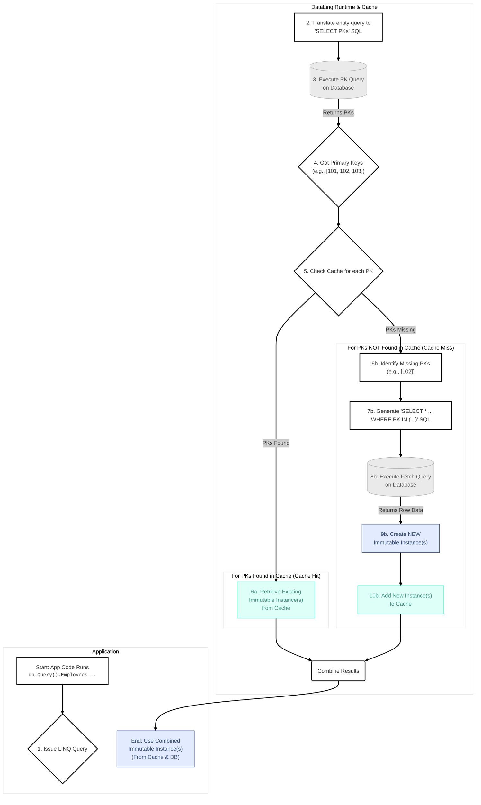
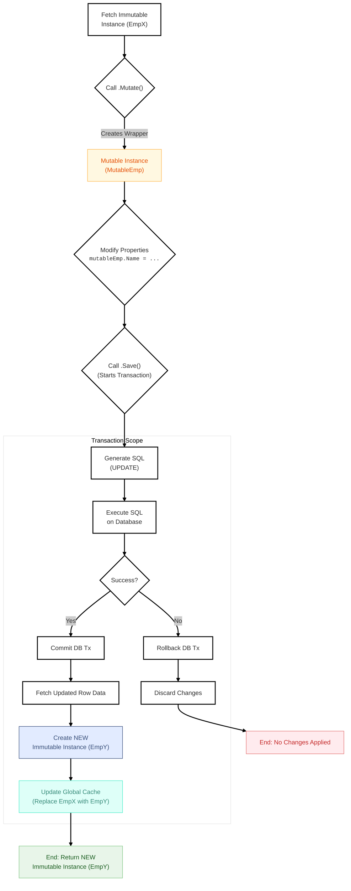

# Caching & Mutation Strategies

DataLinq is opinionated here:

- reads want immutable instances and aggressive reuse
- writes happen through mutable wrappers and transactions
- caches are part of the core behavior, not an optional garnish

For explicit transaction APIs and lifecycle rules, see [Transactions](Transactions.md).

## Entity Read Path and Cache Layers

The entity read path is primary-key-first:

1. translate the supported query shape
2. fetch matching primary keys
3. reuse cached rows where possible
4. bulk-fetch only missing rows
5. return immutable instances

That matters because it keeps entity reads cheap while preserving object identity for cached rows.

Do not overgeneralize that diagram. SQL-backed scalar results, scalar member projections, direct source-slot projection rows, grouped aggregate rows, and supported joined projection rows can read aliased SQL values directly. Those results do not become table-cache entries unless the query returns generated entity rows or takes a row-local projection path that materializes entities first.



## Relation Cache Mechanics

Relations are backed by index caches that map foreign-key values to related primary keys. Once that mapping exists, subsequent relation access can skip a lot of work.

The useful consequence is simple: relation traversal gets cheaper after the first lookup, and relation-aware writes can update what the in-memory graph sees.

If you need to inspect what the cache subsystem is actually doing at runtime, see [Diagnostics and Metrics](Diagnostics%20and%20Metrics.md). That page documents the shipped `DataLinqMetrics` API, including row-cache, relation, invalidation, and cache-notification metrics.

## Cache Limits and Memory Pressure

`[UseCache]`, `[CacheLimit(...)]`, and `[CacheCleanup(...)]` are the model-level knobs for ordinary cache retention. Put them on the database or table shape you want to tune; do not scatter them around just because a property exists.

The important byte rule is blunt: byte-based limits now use estimated cache footprint, not just row payload.

That means these limit types:

- `CacheLimitType.Bytes`
- `CacheLimitType.Kilobytes`
- `CacheLimitType.Megabytes`
- `CacheLimitType.Gigabytes`

compare against `EstimatedCacheBytes`. The legacy `Bytes` and `TotalBytes` diagnostic names still mean row-payload bytes for compatibility. If a cache starts cleaning sooner than an older build did, that is usually not a bug. The newer estimate includes row-store overhead, transaction-local rows, index caches, relation subscription state, notification queues, and cache snapshots.

Use `DataLinqMetrics.Snapshot()` when you need to see the split:

```csharp
using DataLinq.Diagnostics;

var occupancy = DataLinqMetrics.Snapshot().Occupancy;

Console.WriteLine($"Rows: {occupancy.Rows}");
Console.WriteLine($"Row payload bytes: {occupancy.RowPayloadBytes}");
Console.WriteLine($"Estimated cache bytes: {occupancy.EstimatedCacheBytes}");
Console.WriteLine($"Index bytes: {occupancy.IndexPayloadBytes + occupancy.IndexOverheadBytes}");
Console.WriteLine($"Notification bytes: {occupancy.NotificationBytes}");
```

The estimate is not a heap profiler. It is an operational cleanup signal. Treat it as stable and directionally honest, not byte-for-byte CLR object accounting.

### Configure memory-pressure cleanup

Scheduled cleanup follows `[CacheCleanup(...)]`. Memory-pressure cleanup is runtime policy because process memory pressure depends on the host process, not the database model.

Configure it on the provider cache:

```csharp
using DataLinq.Cache;

database.Provider.State.Cache.ConfigureMemoryPressureCleanup(
    CacheMemoryPressureCleanupPolicy.Conservative with
    {
        HighMemoryLoadThresholdPercent = 90,
        MinimumCacheBytes = 16 * 1024 * 1024,
        TargetReductionPercent = 25,
        Cooldown = TimeSpan.FromMinutes(1),
        CheckInterval = TimeSpan.FromSeconds(10),
        MaxRowsPerPass = 1024,
        MaxBytesPerPass = 64 * 1024 * 1024
    });
```

Use `CacheMemoryPressureCleanupPolicy.Disabled` to turn it off.

Pressure cleanup is bounded. A single pass has row and estimated-byte budgets, and repeated pressure checks respect the cooldown/check interval. That is intentional; an ORM cache should not enter an unbounded cleanup loop just because the process is under sustained pressure.

Browser/WebAssembly runtimes do not start memory-pressure cleanup. The runtime reports that pressure cleanup is unsupported there.

## Explicit Cache Invalidation

Applications can explicitly invalidate DataLinq caches through `database.Cache`.

The shipped scopes are deliberately simple:

- `database.Cache.Clear()` clears all table caches for the database.
- `database.Cache.ClearTable<TModel>()` and `database.Cache.ClearTable(table)` clear one table cache.
- `database.Cache.Invalidate<TModel, TKey>(key)` invalidates one provider primary key.
- `database.Cache.InvalidateMany<TModel>(keys)` invalidates several provider primary keys.
- `database.Cache.Invalidate(CacheInvalidationEvent)` applies a normalized database, table, row, or rows invalidation envelope.

Row and rows invalidation is provider-key precise when the event has enough key and relation/index detail. Table and database invalidation are conservative by definition. Row invalidation also falls back conservatively when changed columns imply relation/index state may have moved but the event does not include the old and new relation key values needed for precise cleanup.

`CacheInvalidationEvent` is the integration boundary for work that happens outside the current `Database` instance. It is not an automatic distributed cache system. DataLinq does not ship Kafka, Debezium, trigger, or database CDC clients in this phase. If your application receives an external change signal, map it to an explicit event and call `database.Cache.Invalidate(...)`.

Invalidation results report:

- rows removed
- tables cleared
- whether a conservative fallback was used
- freshness state, currently `ExternallyInvalidated` for event-driven invalidation
- optional freshness token echoed from the event

That last distinction matters. Invalidation says "drop what may be wrong." It does not prove the next row is fresh until a later read actually queries the provider.

## Mutation Model

Rows are immutable by default. To change one, you move through a mutable wrapper.

Typical flow:

1. read an immutable instance
2. call `Mutate()` or `Mutate(Action<...>)`
3. change properties on the mutable instance
4. call `Update()`, `Insert()`, or `Save()`
5. get a fresh immutable instance back

`Save()` is just the honest convenience method:

- if the mutable instance is new, it inserts
- otherwise, it updates

There is also generator-backed `MutateOrNew(...)` support for the common "edit existing or create missing" case.



## Important Write Behaviors

### No-op updates are intentional

If you call `Update()` on a mutable instance with no tracked changes, DataLinq does not force a pointless write. It returns the cached immutable row directly.

That is the right behavior. An ORM that writes unchanged rows just to look busy is wasting your database.

### Auto-increment keys are hydrated

After inserts into auto-increment tables, the resulting immutable instance contains the generated primary key. The tests cover this.

### Reset and change tracking exist

Generated mutable types support lifecycle helpers such as:

- `HasChanges()`
- `Reset()`
- `IsNew()`

Those are not decoration. They are part of how the mutation flow avoids accidental garbage writes.

### Relation caches update with writes

When inserts, updates, or deletes affect a relation, DataLinq updates the relation-aware cache state as part of the transaction flow. That is why relation reads inside a transaction can reflect transaction-local changes.

## Diagnostics for Cache Behavior

When cache behavior looks wrong in production, the first thing to do is stop guessing and read the metrics.

DataLinq now exposes cache and relation telemetry through `DataLinqMetrics.Snapshot()`, with:

- runtime totals
- per-provider-instance drilldown
- per-table drilldown

That matters because cache churn is almost never evenly distributed. One provider or one table is usually doing the damage.

For example:

- row cache hits and misses tell you whether you are actually reusing rows
- relation metrics show whether relation traversal is repeatedly reloading instead of hitting cache
- cache-notification metrics show whether subscriber queues are growing, draining, or getting compacted
- cache-invalidation metrics show explicit invalidation source, scope, precise versus fallback path, rows removed, tables cleared, and approximate work

The detailed semantics and migration notes are documented in [Diagnostics and Metrics](Diagnostics%20and%20Metrics.md).

## Practical Code Examples

### Update an existing row

```csharp
var user = usersDb.Query().Users.Single(u => u.Id == 1);
var mutableUser = user.Mutate(u => u.Name = "Updated Name");
var updatedUser = mutableUser.Save();
```

### Insert a new row

```csharp
var newUser = new MutableUser(requiredProperty1, requiredProperty2);
newUser.Name = "New User";
newUser.Email = "new.user@example.com";
var insertedUser = newUser.Insert();
```

### Use `MutateOrNew(...)`

```csharp
var existingOrNew = maybeUser.MutateOrNew(requiredProperty1, requiredProperty2);
existingOrNew.Email = "user@example.com";
var saved = existingOrNew.Save();
```

### Group several writes in one transaction

```csharp
using var transaction = usersDb.Transaction();

var user = usersDb.Query().Users.Single(u => u.Id == 1);
var updatedUser = user.Mutate(u => u.Name = "Transactional Name");
transaction.Update(updatedUser);

var newUser = new MutableUser(requiredProperty1, requiredProperty2)
{
    Name = "New Transaction User",
    Email = "txn.user@example.com"
};

transaction.Insert(newUser);
transaction.Commit();
```

## Identity Caveat

There is one sharp edge worth stating plainly:

after a save, you should treat the returned immutable instance as the authoritative one.

If you stash mutable or pre-save immutable instances inside hash-based collections and then expect identity semantics to stay intuitive forever, you are going to have a bad time. The test suite has explicit equality and hash-code coverage around this.

## Summary

DataLinq's cache and mutation story is coherent when you follow its rules:

- read immutable rows
- mutate through generated wrappers
- let `Save()` choose insert versus update
- use transactions when several steps belong together
- treat the returned immutable instance after a write as the new truth
