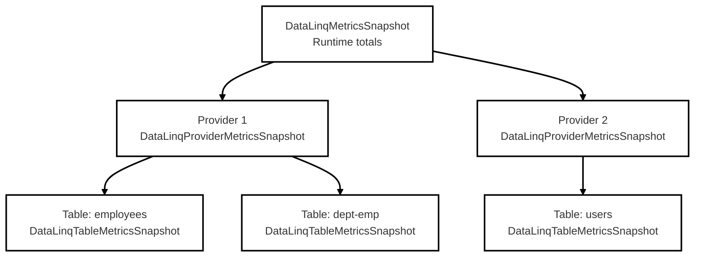

# Diagnostics and Metrics

DataLinq now exposes runtime metrics through a hierarchical snapshot API:

- runtime totals at the top
- one metrics node per loaded provider instance
- one metrics node per table within each provider

That shape is deliberate. A flat runtime snapshot would be easy to read but too easy to misread. It would blur together values that are really owned by different providers and tables, and it would make it harder to reason about production behavior when several providers were loaded at once.

## Entry Points

Use the static `DataLinqMetrics` API:

```csharp
using DataLinq.Diagnostics;

var snapshot = DataLinqMetrics.Snapshot();
```

The snapshot type is `DataLinqMetricsSnapshot`.

For benchmarks or controlled test runs, you can also reset the collected metrics:

```csharp
DataLinqMetrics.Reset();
```

Do not blindly call `Reset()` in a live multi-consumer production process. That is fine for tests and benchmarks, but it is a blunt tool for shared diagnostics.

## Hierarchy



Each provider node is keyed by a stable provider-instance id for the current process lifetime. That matters because several loaded providers may share the same logical database name or the same metadata model and still need to be tracked independently.

## Ownership Rules

The ownership model is what keeps the sums honest.

- `QueryMetricsSnapshot` is provider-owned.
- `CommandMetricsSnapshot` is provider-owned.
- `TransactionMetricsSnapshot` is provider-owned.
- `MutationMetricsSnapshot` is table-owned, then summed upward at provider and runtime level.
- `CacheOccupancyMetricsSnapshot` is table-owned, then summed upward.
- `CacheCleanupMetricsSnapshot` is table-owned, then summed upward.
- `CacheInvalidationMetricsSnapshot` is table-owned, then summed upward.
- `RelationMetricsSnapshot` is table-owned.
- `RowCacheMetricsSnapshot` is table-owned.
- `CacheNotificationMetricsSnapshot` is table-owned.

So:

- runtime `Queries` is the sum of provider `Queries`
- runtime `Commands` and `Transactions` are sums of provider-owned values
- provider `Mutations`, `Occupancy`, `Cleanup`, `CacheInvalidations`, `Relations`, `RowCache`, and `CacheNotifications` are sums of that provider's tables
- runtime `Mutations`, `Occupancy`, `Cleanup`, `CacheInvalidations`, `Relations`, `RowCache`, and `CacheNotifications` are sums of all providers

Query metrics are intentionally not forced into tables. A single query can touch several tables, and fake table attribution would make the totals look cleaner while making them less true.

## Snapshot Shapes

### Runtime

```csharp
DataLinqMetricsSnapshot
{
    QueryMetricsSnapshot Queries;
    CommandMetricsSnapshot Commands;
    TransactionMetricsSnapshot Transactions;
    MutationMetricsSnapshot Mutations;
    CacheOccupancyMetricsSnapshot Occupancy;
    CacheCleanupMetricsSnapshot Cleanup;
    CacheInvalidationMetricsSnapshot CacheInvalidations;
    RelationMetricsSnapshot Relations;
    RowCacheMetricsSnapshot RowCache;
    CacheNotificationMetricsSnapshot CacheNotifications;
    DataLinqProviderMetricsSnapshot[] Providers;
}
```

### Provider

```csharp
DataLinqProviderMetricsSnapshot
{
    string ProviderInstanceId;
    string ProviderTypeName;
    string DatabaseName;
    DatabaseType DatabaseType;
    QueryMetricsSnapshot Queries;
    CommandMetricsSnapshot Commands;
    TransactionMetricsSnapshot Transactions;
    MutationMetricsSnapshot Mutations;
    CacheOccupancyMetricsSnapshot Occupancy;
    CacheCleanupMetricsSnapshot Cleanup;
    CacheInvalidationMetricsSnapshot CacheInvalidations;
    RelationMetricsSnapshot Relations;
    RowCacheMetricsSnapshot RowCache;
    CacheNotificationMetricsSnapshot CacheNotifications;
    DataLinqTableMetricsSnapshot[] Tables;
}
```

### Table

```csharp
DataLinqTableMetricsSnapshot
{
    string TableName;
    MutationMetricsSnapshot Mutations;
    CacheOccupancyMetricsSnapshot Occupancy;
    CacheCleanupMetricsSnapshot Cleanup;
    CacheInvalidationMetricsSnapshot CacheInvalidations;
    RelationMetricsSnapshot Relations;
    RowCacheMetricsSnapshot RowCache;
    CacheNotificationMetricsSnapshot CacheNotifications;
}
```

## Reading the Metrics Correctly

This is where people most often fool themselves.

### Query metrics

- `EntityExecutions` and `ScalarExecutions` are counters.
- They are provider-owned and summed upward.

### Command metrics

- `ReaderExecutions`, `ScalarExecutions`, `NonQueryExecutions`, and `Failures` are counters.
- `TotalDurationMicroseconds` is cumulative duration, not the duration of the most recent command.
- They are provider-owned and summed upward.

### Transaction metrics

- `Starts`, `Commits`, `Rollbacks`, and `Failures` are counters.
- `TotalDurationMicroseconds` is cumulative duration across completed transactions.
- They are provider-owned and summed upward.

### Mutation metrics

- `Inserts`, `Updates`, `Deletes`, `Failures`, and `AffectedRows` are counters.
- `TotalDurationMicroseconds` is cumulative duration across executed mutations.
- They are table-owned and summed upward.

### Cache occupancy metrics

- `Rows`, `TransactionRows`, `Bytes`, `RowPayloadBytes`, `EstimatedCacheBytes`, component byte fields, and `IndexEntries` are gauges.
- They describe current state, not cumulative history.
- They are table-owned and summed upward.
- `Bytes` is the legacy alias for `RowPayloadBytes`. It is estimated row-payload bytes, not total cache memory footprint.
- `EstimatedCacheBytes` is the broader cache footprint estimate used by byte-based cleanup limits.
- Component fields split the estimate into row-store overhead, transaction row payload/overhead, index payload/overhead, relation object bytes, notification bytes, and snapshot bytes.

The breaking semantic change is deliberate: `CacheLimitType.Bytes`, `Kilobytes`, `Megabytes`, and `Gigabytes` now compare against `EstimatedCacheBytes`, while `Bytes` and `TotalBytes` remain row-payload compatibility names for diagnostics.

### Cache cleanup metrics

- `Operations` and `RowsRemoved` are counters.
- `TotalDurationMicroseconds` is cumulative cleanup duration.
- They are table-owned and summed upward.

### Cache invalidation metrics

- `Operations` counts table-level invalidation records. A database-scope invalidation records one child operation per table so the table dimension stays useful.
- `RowsRemoved`, `TablesCleared`, `ProviderKeys`, `ChangedColumns`, `ChangedIndexValues`, and `ApproximateWork` are counters.
- `PreciseOperations` counts provider-key precise invalidation records.
- `ConservativeFallbackOperations` counts invalidation records that cleared a table or database because the signal was intentionally broad or missing enough relation/index detail.
- `DatabaseScopeOperations`, `TableScopeOperations`, `RowScopeOperations`, and `RowsScopeOperations` split records by invalidation scope.
- `TotalDurationMicroseconds` is cumulative invalidation duration.
- They are table-owned and summed upward.

These counters tell you what DataLinq did after an explicit signal. They do not prove the database row is fresh, and they do not imply automatic distributed cache coherence.

### Row cache metrics

- `Hits`, `Misses`, `DatabaseRowsLoaded`, `Materializations`, and `Stores` are counters.
- They are table-owned and summed upward.

### Relation metrics

- `ReferenceCacheHits`, `ReferenceLoads`, `CollectionCacheHits`, and `CollectionLoads` are counters.
- They are table-owned and summed upward.

### Cache notification metrics

Some values are counters. Some are gauges. Some are “last seen per child, then summed”.

- `Subscriptions` is a cumulative counter of `Subscribe()` calls. It is not the current number of live subscribers.
- `ApproximateCurrentQueueDepth` is a gauge. At runtime level it is the sum of the current per-table queue depths.
- `NotifySweeps`, `NotifySnapshotEntries`, `NotifyLiveSubscribers`, `CleanSweeps`, `CleanSnapshotEntries`, `CleanRequeuedSubscribers`, `CleanDroppedSubscribers`, and `CleanBusySkips` are cumulative counters.
- `LastNotifySnapshotEntries`, `LastNotifyLiveSubscribers`, `LastCleanSnapshotEntries`, `LastCleanRequeuedSubscribers`, and `LastCleanDroppedSubscribers` are the latest values recorded on each child, then summed upward.
- `ApproximatePeakQueueDepth` is a max, not a sum.

That last point is important. A runtime peak queue depth of `5000` means some underlying table peaked around `5000`. It does not mean the system once had a global atomic queue depth of exactly `5000`.

## Example

```csharp
var snapshot = DataLinqMetrics.Snapshot();

// Runtime totals
var totalEntityQueries = snapshot.Queries.EntityExecutions;
var totalCommandCount = snapshot.Commands.TotalExecutions;
var totalTransactionStarts = snapshot.Transactions.Starts;
var totalMutationRows = snapshot.Mutations.AffectedRows;
var totalCachedRows = snapshot.Occupancy.Rows;
var totalEstimatedCacheBytes = snapshot.Occupancy.EstimatedCacheBytes;
var totalRowCacheHits = snapshot.RowCache.Hits;
var totalNotificationDepth = snapshot.CacheNotifications.ApproximateCurrentQueueDepth;
var totalInvalidationRows = snapshot.CacheInvalidations.RowsRemoved;

// Provider-level drilldown
foreach (var provider in snapshot.Providers)
{
    Console.WriteLine($"{provider.ProviderTypeName} ({provider.DatabaseName})");
    Console.WriteLine($"  Entity queries: {provider.Queries.EntityExecutions}");
    Console.WriteLine($"  Commands: {provider.Commands.TotalExecutions}");
    Console.WriteLine($"  Transactions: {provider.Transactions.Starts}");
    Console.WriteLine($"  Cached rows: {provider.Occupancy.Rows}");
    Console.WriteLine($"  Row cache hits: {provider.RowCache.Hits}");
    Console.WriteLine($"  Notification depth: {provider.CacheNotifications.ApproximateCurrentQueueDepth}");

    foreach (var table in provider.Tables)
    {
        Console.WriteLine($"    {table.TableName}:");
        Console.WriteLine($"      Mutations: {table.Mutations.TotalExecutions}");
        Console.WriteLine($"      Cached rows: {table.Occupancy.Rows}");
        Console.WriteLine($"      Estimated cache bytes: {table.Occupancy.EstimatedCacheBytes}");
        Console.WriteLine($"      Row cache hits: {table.RowCache.Hits}");
        Console.WriteLine($"      Invalidation rows removed: {table.CacheInvalidations.RowsRemoved}");
        Console.WriteLine($"      Notification depth: {table.CacheNotifications.ApproximateCurrentQueueDepth}");
    }
}
```

## Practical Recommendation for Application Integrations

If you are integrating this into an admin page or periodic telemetry log:

- keep a flat adapter DTO if your UI already expects one
- expose the provider/table tree as a second, richer view when you need drilldown
- log both runtime totals and the hottest provider/table contributors

If you only log the runtime totals, you will eventually end up asking “which table actually caused this?” and have no answer.

## Standard .NET Telemetry

`DataLinqMetrics` is the in-process snapshot view. It is not the whole telemetry story.

DataLinq also emits standard .NET telemetry with:

- `Meter`: `DataLinq`
- `ActivitySource`: `DataLinq`

That is the right library boundary. DataLinq produces telemetry; your application decides whether to inspect it locally, export it with OpenTelemetry, or ignore it.

### What DataLinq emits

The exported surface now covers the main runtime paths:

- query count and end-to-end query duration
- DB command count and duration
- transaction start/completion count and duration
- mutation count, affected rows, and duration
- row-cache hit/miss/store counters
- relation cache hit/load counters
- cache occupancy gauges for rows, transaction rows, row-payload bytes, estimated cache bytes, major component byte estimates, and index entries
- cache-notification queue depth gauges
- cache maintenance counters and duration
- cache cleanup estimated-byte histograms for pressure and size cleanup budgets
- cache invalidation counters and duration, tagged by source, scope, table, fallback path, freshness state, and approximate work bucket

SQL text is still a logging concern, not a metric tag. That is deliberate. Putting SQL text into metric tags would be a cardinality bug.

### Cache invalidation tags

Invalidation metrics use low-cardinality tags:

- `datalinq.cache.invalidation.source`: `manual`, `external`, `mutation`, `cleanup`, `freshness`, or `memory_pressure`
- `datalinq.cache.invalidation.scope`: `database`, `table`, `row`, or `rows`
- `datalinq.table`: the table touched by the invalidation record
- `datalinq.cache.invalidation.path`: `provider_key_precise` or `conservative_fallback`
- `datalinq.cache.invalidation.work`: `single_row`, `rows_small`, `rows_medium`, `rows_many`, `table`, or `database`
- `datalinq.cache.freshness_state`: stable freshness vocabulary such as `externally_invalidated`

There is intentionally no CDC-specific source constant yet. A Debezium/Kafka/trigger adapter can feed `external` events today and map to a more specific source only after that adapter exists as shipped behavior.

### Cache maintenance tags

Maintenance metrics keep the stable operation tag and add low-cardinality explanation tags:

- `datalinq.cache.operation`: stable operation name such as `clear`, `row_limit`, `size_limit`, `age_limit`, or `state_change_precise`
- `datalinq.cache.cleanup.trigger`: why cleanup ran from the scheduler/process perspective, such as `manual`, `scheduled`, `mutation`, `transaction`, or `memory_pressure`
- `datalinq.cache.cleanup.reason`: policy reason such as `row_limit`, `size_limit`, `age_limit`, `memory_pressure`, `clear`, `state_change`, or `transaction`
- `datalinq.cache.cleanup.basis`: unit used by the cleanup decision, such as `row_count`, `estimated_cache_bytes`, `cache_age`, `state_change`, or `manual`

For size cleanup, the basis is `estimated_cache_bytes`. That is the important part: the old row-payload byte value is still observable, but it is no longer the byte-limit decision basis.

Pressure-triggered cleanup uses `memory_pressure` for both trigger and reason, and `estimated_cache_bytes` for basis. It also records `datalinq.cache.cleanup.estimated_bytes` with `datalinq.cache.cleanup.estimate` set to `before`, `after`, or `target`. Those values are DataLinq's cache-footprint estimate, not exact CLR heap measurements.

## Local Inspection with `dotnet-counters`

For quick local inspection, `dotnet-counters` is the simplest path.

1. Start your application.
2. Find the process id.
3. Monitor the DataLinq meter:

```bash
dotnet-counters monitor --process-id <pid> --counters DataLinq
```

That is useful for questions like:

- are commands actually being issued?
- are mutations increasing?
- is the cache growing or being cleaned up?
- are transaction rates changing under load?

If you need table-by-table drilldown, use `DataLinqMetrics.Snapshot()` in-process. `dotnet-counters` is for live aggregate observation, not rich per-table analysis.

## OpenTelemetry Integration

DataLinq does not require an OpenTelemetry dependency in the core package. The application should opt into collection and exporting.

A normal application-side setup looks like this:

```csharp
using OpenTelemetry.Metrics;
using OpenTelemetry.Trace;

var builder = WebApplication.CreateBuilder(args);

builder.Services
    .AddOpenTelemetry()
    .WithMetrics(metrics =>
    {
        metrics
            .AddMeter("DataLinq")
            .AddRuntimeInstrumentation();
    })
    .WithTracing(tracing =>
    {
        tracing
            .AddSource("DataLinq");
    });
```

Then add whatever exporter your app actually uses. That might be OTLP, Azure Monitor, or just console/exporter wiring during development.

The important part is not the exporter. The important part is that the app listens to:

- `Meter("DataLinq")`
- `ActivitySource("DataLinq")`

If you want a fuller example instead of a short setup snippet, see [Telemetry Integration Example](Telemetry%20Integration%20Example.md).

## Choosing Between Snapshot and Exported Telemetry

Use `DataLinqMetrics.Snapshot()` when you need:

- provider/table drilldown
- deterministic before/after deltas in tests or benchmarks
- a local admin/debug endpoint

Use `Meter` and `ActivitySource` when you need:

- live process observation
- app-wide telemetry collection
- traces correlated with the rest of your service
- backend/export integration through standard .NET tooling

These are complementary. If you force one to do the other's job, you will get worse results.
