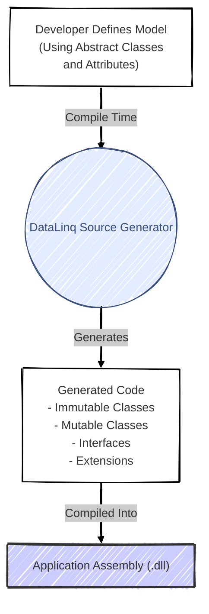
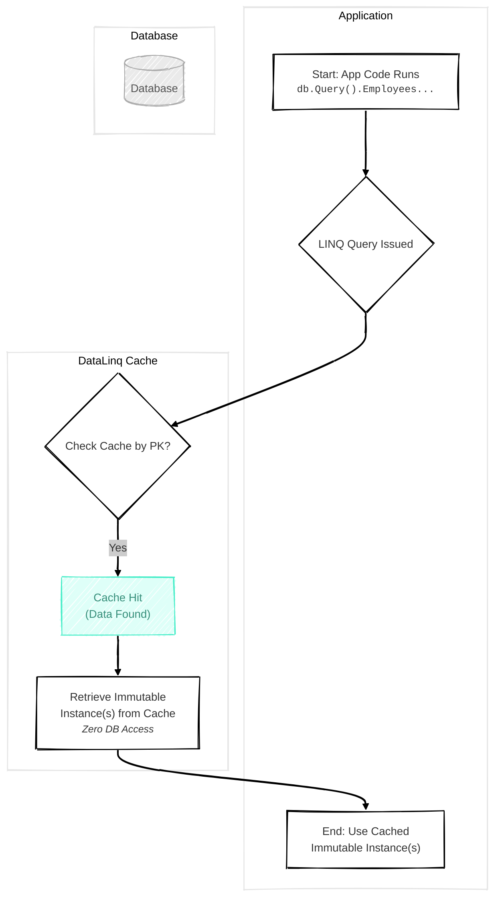
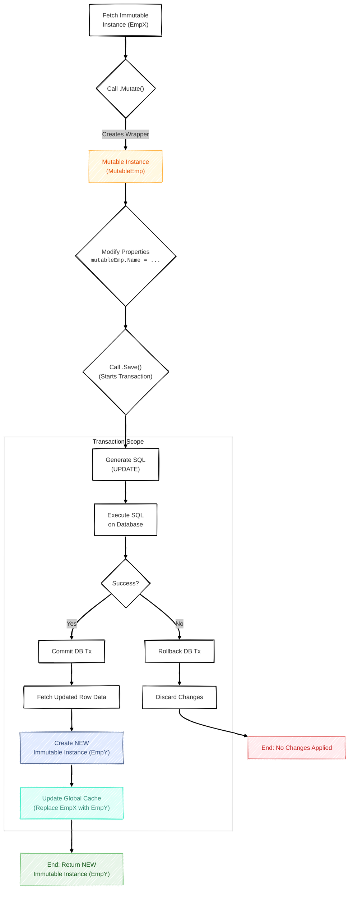
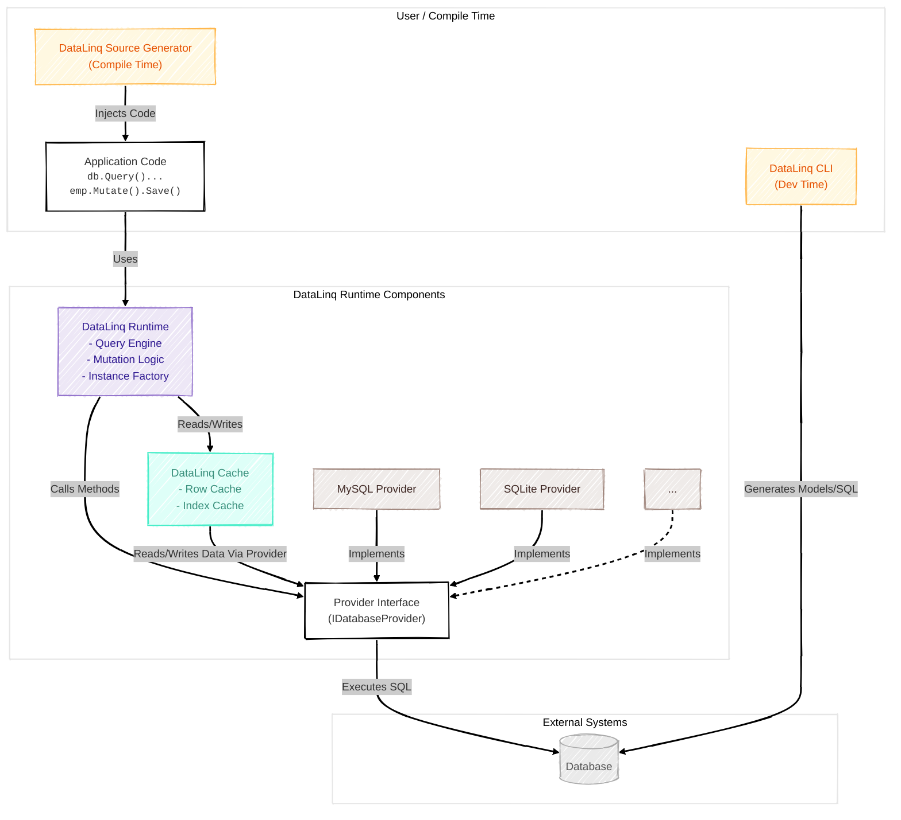
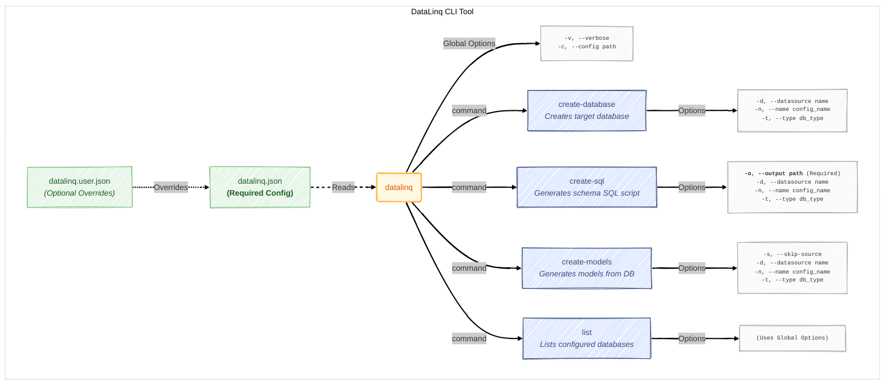
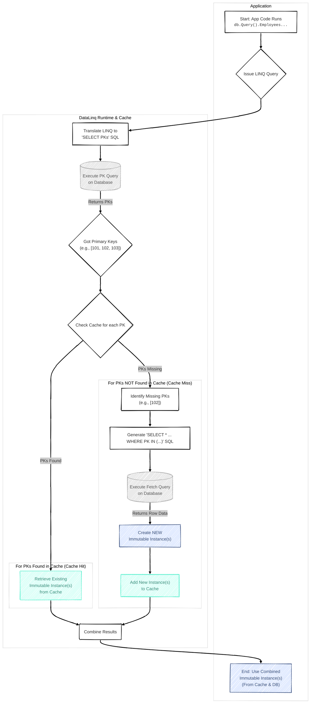
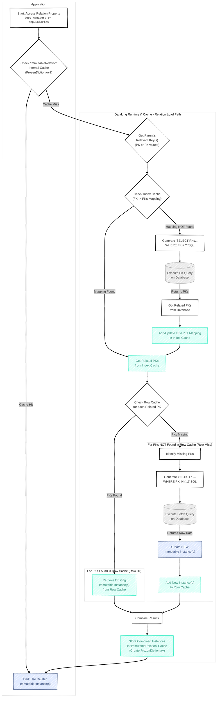
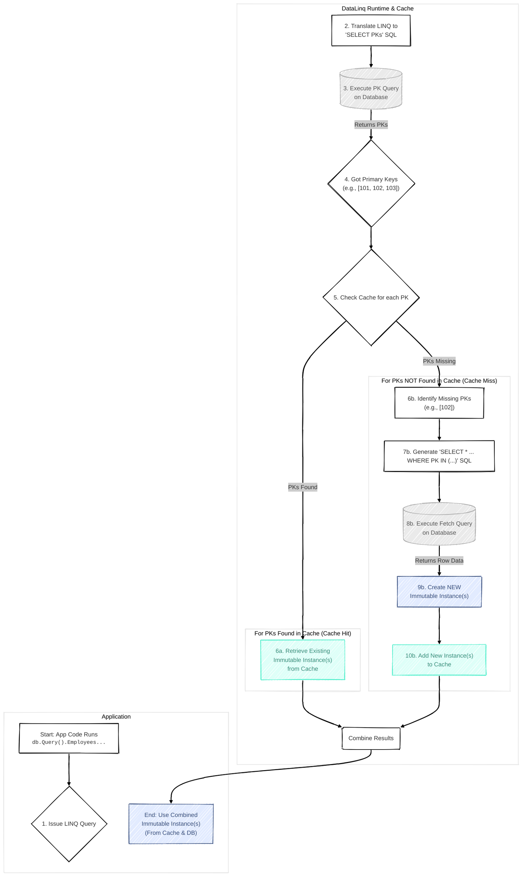

```mermaid
---
config:
  theme: neo
  look: handDrawn
---
flowchart TD
    A["Developer Defines Model<br>(Using Abstract Classes<br>and Attributes)"] -- Compile Time --> B(("DataLinq Source Generator"))
    B -- Generates --> C["Generated Code<br>- Immutable Classes<br>- Mutable Classes<br>- Interfaces<br>- Extensions"]
    C -- Compiled Into --> D["Application Assembly (.dll)"]
     B:::Aqua
     B:::Sky
    classDef Aqua stroke-width:1px, stroke-dasharray:none, stroke:#46EDC8, fill:#DEFFF8, color:#378E7A
    classDef Sky stroke-width:1px, stroke-dasharray:none, stroke:#374D7C, fill:#E2EBFF, color:#374D7C
    style D fill:#ccf,stroke:#333,stroke-width:2px
    linkStyle 0 stroke:#000000
```

```mermaid
---
config:
  theme: neo
  look: handDrawn
---
flowchart TD
 subgraph Application["Application"]
        B{"LINQ Query Issued"}
        A@{ label: "Start: App Code Runs<br><div style=\"font-family:monospace; font-size:0.9em;\">db.Query().Employees...</div>" }
        G["End: Use Cached<br>Immutable Instance(s)"]
  end
 subgraph subGraph1["DataLinq Cache"]
        D["Cache Hit<br>(Data Found)"]
        C{"Check Cache by PK?"}
        E@{ label: "Retrieve Immutable<br>Instance(s) from Cache<br><div style=\"font-style:italic; font-size:0.9em;\">Zero DB Access</div>" }
  end
 subgraph Database["Database"]
        F[("Database")]
  end
    A --> B
    C -- Yes --> D
    D --> E
    B --> C
    E --> G
    A@{ shape: rect}
    E@{ shape: rect}
     D:::Aqua
     F:::DatabaseStyle
    classDef Aqua stroke-width:1px, stroke:#46EDC8, fill:#DEFFF8, color:#378E7A
    classDef DatabaseStyle stroke-width:1px, stroke:#AAAAAA, fill:#EAEAEA, color:#555555
    linkStyle 2 stroke:#000000
```

```mermaid
---
config:
  theme: neo
  look: handDrawn
---
flowchart TD
    A["Fetch Immutable<br/>Instance (EmpX)"] --> B{"Call .Mutate()"};
    B -- Creates Wrapper --> C["Mutable Instance<br/>(MutableEmp)"]:::MutateStyle;
    C --> D{"Modify Properties<br/><div style='font-family:monospace; font-size:0.9em;'>mutableEmp.Name = ...</div>"};
    D --> E{"Call .Save()<br/>(Starts Transaction)"};

    subgraph "Transaction Scope"
        F["Generate SQL<br/>(UPDATE)"] --> G["Execute SQL<br/>on Database"];
        G --> H{"Success?"};
        H -- Yes --> I["Commit DB Tx"];
        I --> J["Fetch Updated Row Data"];
        J --> K["Create NEW<br/>Immutable Instance (EmpY)"]:::Sky;
        K --> L["Update Global Cache<br/>(Replace EmpX with EmpY)"]:::Aqua;
        H -- No --> M["Rollback DB Tx"];
        M --> N["Discard Changes"];
    end

    E --> F;
    L --> O["End: Return NEW<br/>Immutable Instance (EmpY)"]:::SuccessStyle;
    N --> P["End: No Changes Applied"]:::ErrorStyle;

    classDef Aqua stroke-width:1px, stroke:#46EDC8, fill:#DEFFF8, color:#378E7A
    classDef Sky stroke-width:1px, stroke:#374D7C, fill:#E2EBFF, color:#374D7C
    classDef MutateStyle stroke-width:1px, stroke:#FFB74D, fill:#FFF8E1, color:#E65100
    classDef ErrorStyle stroke-width:1px, stroke:#E57373, fill:#FFEBEE, color:#C62828
    classDef SuccessStyle stroke-width:1px, stroke:#81C784, fill:#E8F5E9, color:#1B5E20
    linkStyle default stroke:#000000
```

```mermaid
---
config:
  theme: neo
  look: handDrawn
---
graph TD
    subgraph "User / Compile Time"
        AppCode["Application Code<br/><div style='font-family:monospace; font-size:0.9em;'>db.Query()...<br/>emp.Mutate().Save()</div>"]
        CLI["DataLinq CLI<br/>(Dev Time)"]:::ToolStyle
        SourceGen["DataLinq Source Generator<br/>(Compile Time)"]:::ToolStyle
    end

    subgraph "DataLinq Runtime Components"
        Runtime["DataLinq Runtime<br/>- Query Engine<br/>- Mutation Logic<br/>- Instance Factory"]:::CoreStyle
        Cache["DataLinq Cache<br/>- Row Cache<br/>- Index Cache"]:::Aqua
        ProviderInterface["Provider Interface<br/>(IDatabaseProvider)"]
        MySQLProv["MySQL Provider"]:::ProviderStyle
        SQLiteProv["SQLite Provider"]:::ProviderStyle
        OtherProv["..."]:::ProviderStyle
    end

    subgraph "External Systems"
      DB[("Database")]:::DatabaseStyle;
    end

    AppCode -- Uses --> Runtime;
    Runtime -- Reads/Writes --> Cache;
    Runtime -- Calls Methods --> ProviderInterface;
    Cache -- Reads/Writes Data Via Provider --> ProviderInterface;
    ProviderInterface -- Executes SQL --> DB;

    MySQLProv -- Implements --> ProviderInterface;
    SQLiteProv -- Implements --> ProviderInterface;
    OtherProv -.->|Implements| ProviderInterface;

    SourceGen -- Injects Code --> AppCode;
    CLI -- Generates Models/SQL --> DB;


    classDef Aqua stroke-width:1px, stroke:#46EDC8, fill:#DEFFF8, color:#378E7A
    classDef Sky stroke-width:1px, stroke:#374D7C, fill:#E2EBFF, color:#374D7C
    classDef ToolStyle stroke-width:1px, stroke:#FFB74D, fill:#FFF8E1, color:#E65100
    classDef CoreStyle stroke-width:1px, stroke:#9575CD, fill:#EDE7F6, color:#311B92
    classDef ProviderStyle stroke-width:1px, stroke:#A1887F, fill:#EFEBE9, color:#3E2723
    classDef DatabaseStyle stroke-width:1px, stroke:#AAAAAA, fill:#EAEAEA, color:#555555
    linkStyle default stroke:#000000
    linkStyle 7 stroke-dasharray: 5 5
```

```mermaid
---
config:
  theme: neo
  look: handDrawn
---
flowchart LR
    subgraph subGraph0["Dev Tools"]
        direction TB
        A1[("Database Schema")]
        A2["Developer Models<br>(Abstract Classes<br>+ Attributes)"]
        CLI["DataLinq CLI"]
    end
    subgraph subGraph1["Compile Time Generation"]
        direction TB
        SourceGen["DataLinq Source Generator"]
        B1["Generated Code<br>- Immutable/Mutable Classes<br>- Interfaces &amp; Extensions"]
    end
    subgraph subGraph2["Runtime Execution"]
        direction TB
        AppCode["Application Code"]
        Runtime["DataLinq Runtime<br>- Query Engine<br>- Mutation Logic<br>- Instance Factory"]
        Cache["DataLinq Cache<br>- Row Cache<br>- Index Cache"]
        ProviderInterface["DataLinq Providers<br>- MySQL Provider<br>- SQLite Provider"]
        DB[("Database")]
    end
    CLI -- Reads --> A1
    CLI -- Creates/Modifies --> A2
    A2 -- Used by --> SourceGen
    SourceGen -- Generates --> B1
    B1 -- Compiled into --> AppCode
    AppCode -- Uses --> Runtime
    Runtime -- Instantiates --> B1
    Runtime -- Reads/Writes --> Cache
    Runtime -- Calls Methods --> ProviderInterface
    Cache -- Reads/Writes Data Via Provider --> ProviderInterface
    ProviderInterface -- Executes SQL --> DB
     A1:::DatabaseStyle
     CLI:::ToolStyle
     SourceGen:::ToolStyle
     B1:::GeneratedStyle
     AppCode:::AppStyle
     Runtime:::CoreStyle
     Cache:::Aqua
     DB:::DatabaseStyle
    classDef Aqua stroke-width:1px, stroke:#46EDC8, fill:#DEFFF8, color:#378E7A
    classDef Sky stroke-width:1px, stroke:#374D7C, fill:#E2EBFF, color:#374D7C
    classDef ToolStyle stroke-width:1px, stroke:#FFB74D, fill:#FFF8E1, color:#E65100
    classDef CoreStyle stroke-width:1px, stroke:#9575CD, fill:#EDE7F6, color:#311B92
    classDef DatabaseStyle stroke-width:1px, stroke:#AAAAAA, fill:#EAEAEA, color:#555555
    classDef AppStyle stroke-width:1px, stroke:#374D7C, fill:#E2EBFF, color:#374D7C
    classDef GeneratedStyle stroke-width:1px, stroke:#BDBDBD, fill:#F5F5F5, color:#424242

```

```mermaid
---
config:
  theme: neo
  look: handDrawn
---
graph TD
    subgraph DataLinq CLI Tool 

            ConfigFile["datalinq.json<br/><b>(Required Config)</b>"]:::FileStyle
            UserConfigFile["datalinq.user.json<br/><i>(Optional Overrides)</i>"]:::FileStyle
        CLI(datalinq):::ToolStyle -- Global Options --> GlobalOpts["-v, --verbose<br/>-c, --config path"]

        ConfigFile -- Reads --> CLI
        UserConfigFile -.->|Overrides| ConfigFile


        CLI -- command --> CreateDB["create-database<br/><i>Creates target database</i>"]
        CLI -- command --> CreateSQL["create-sql<br/><i>Generates schema SQL script</i>"]
        CLI -- command --> CreateModels["create-models<br/><i>Generates models from DB</i>"]
        CLI -- command --> ListCmd["list<br/><i>Lists configured databases</i>"]

        CreateDB -- Options --> CD_Opts["-d, --datasource name<br/>-n, --name config_name<br/>-t, --type db_type"]
        CreateSQL -- Options --> CS_Opts["<b>-o, --output path</b> (Required)<br/>-d, --datasource name<br/>-n, --name config_name<br/>-t, --type db_type"]
        CreateModels -- Options --> CM_Opts["-s, --skip-source<br/>-d, --datasource name<br/>-n, --name config_name<br/>-t, --type db_type"]
        ListCmd -- Options --> List_Opts["(Uses Global Options)"]

        CLI:::ToolStyle
        CreateDB:::CommandStyle
        CreateSQL:::CommandStyle
        CreateModels:::CommandStyle
        ListCmd:::CommandStyle
        CD_Opts:::OptionsStyle
        CS_Opts:::OptionsStyle
        CM_Opts:::OptionsStyle
        List_Opts:::OptionsStyle
        GlobalOpts:::OptionsStyle
        ConfigFile:::FileStyle
        UserConfigFile:::FileStyle

    end

    classDef ToolStyle stroke-width:2px, stroke:#FFB74D, fill:#FFF8E1, color:#E65100
    classDef CommandStyle stroke-width:1px, stroke:#374D7C, fill:#E2EBFF, color:#374D7C
    classDef OptionsStyle stroke-width:1px, stroke:#AAAAAA, fill:#FAFAFA, color:#333333, font-family:monospace, font-size:0.9em
    classDef FileStyle stroke-width:1px, stroke:#81C784, fill:#E8F5E9, color:#1B5E20
    linkStyle default stroke:#000000
    linkStyle 1 stroke-dasharray: 5 5
```

```mermaid
---
config:
  theme: neo
  look: handDrawn
---
flowchart TD
    subgraph Application
        A["Start: App Code Runs<br/><div style='font-family:monospace; font-size:0.9em;'>db.Query().Employees...</div>"] --> B{"Issue LINQ Query"}
        K["End: Use Combined<br/>Immutable Instance(s)<br/>(From Cache & DB)"]:::AppStyle
    end

    subgraph "DataLinq Runtime & Cache"
        C["Translate LINQ to<br/>'SELECT PKs' SQL"] --> D[("Execute PK Query<br/>on Database")]:::DatabaseStyle
        D -- Returns PKs --> E{"Got Primary Keys<br/>(e.g., [101, 102, 103])"}
        E --> F{"Check Cache for each PK"}

        subgraph "For PKs Found in Cache (Cache Hit)"
          direction LR
          G["Retrieve Existing<br/>Immutable Instance(s)<br/>from Cache"]:::Aqua
        end

        subgraph "For PKs NOT Found in Cache (Cache Miss)"
          direction TB
          H["Identify Missing PKs<br/>(e.g., [102])"] --> I["Generate 'SELECT * ... WHERE PK IN (...)' SQL"]
          I --> J[("Execute Fetch Query<br/>on Database")]:::DatabaseStyle
          J -- Returns Row Data --> L["Create NEW<br/>Immutable Instance(s)"]:::Sky
          L --> M["Add New Instance(s)<br/>to Cache"]:::Aqua
        end

        F -- PKs Found --> G
        F -- PKs Missing --> H

        G --> CombineEnd("Combine Results")
        M --> CombineEnd
    end

    CombineEnd --> K
    B --> C


    classDef Aqua stroke-width:1px, stroke:#46EDC8, fill:#DEFFF8, color:#378E7A
    classDef Sky stroke-width:1px, stroke:#374D7C, fill:#E2EBFF, color:#374D7C
    classDef AppStyle stroke-width:1px, stroke:#374D7C, fill:#E2EBFF, color:#374D7C
    classDef DatabaseStyle stroke-width:1px, stroke:#AAAAAA, fill:#EAEAEA, color:#555555
    classDef ErrorStyle stroke-width:1px, stroke:#E57373, fill:#FFEBEE, color:#C62828
    linkStyle default stroke:#000000
```

```mermaid
---
config:
  theme: neo
  look: handDrawn
---
flowchart TD
    subgraph Application
        A["Start: Access Relation Property<br/><div style='font-family:monospace; font-size:0.9em;'>dept.Managers <i>or</i> emp.Salaries</div>"] --> B{"Check 'ImmutableRelation'<br/>Internal Cache<br/>(FrozenDictionary?)"}
        O["End: Use Related<br/>Immutable Instance(s)"]:::AppStyle
    end

    subgraph "DataLinq Runtime & Cache - Relation Load Path"
        C{"Get Parent's<br/>Relevant Key(s)<br/>(PK or FK values)"} --> D{"Check Index Cache<br/>(FK -> PKs Mapping)"}

        %% Index Cache Hit Path
        D -- Mapping Found --> E["Got Related PKs<br/>from Index Cache"]:::Aqua

        %% Index Cache Miss Path
        D -- Mapping NOT Found --> F["Generate 'SELECT PKs...<br/>WHERE FK = ?' SQL"]
        F --> G[("Execute PK Query<br/>on Database")]:::DatabaseStyle
        G -- Returns PKs --> H["Got Related PKs<br/>from Database"]
        H --> I["Add/Update FK->PKs Mapping<br/>in Index Cache"]:::Aqua
        I --> E

        %% Row Cache Check (Common Path after getting PKs)
        E --> J{"Check Row Cache<br/>for each Related PK"}

        subgraph "For PKs Found in Row Cache (Row Hit)"
            K["Retrieve Existing<br/>Immutable Instance(s)<br/>from Row Cache"]:::Aqua
        end

        subgraph "For PKs NOT Found in Row Cache (Row Miss)"
            L["Identify Missing PKs"] --> M["Generate 'SELECT * ...<br/>WHERE PK IN (...)' SQL"]
            M --> N[("Execute Fetch Query<br/>on Database")]:::DatabaseStyle
            N -- Returns Row Data --> P["Create NEW<br/>Immutable Instance(s)"]:::Sky
            P --> Q["Add New Instance(s)<br/>to Row Cache"]:::Aqua
        end

        J -- PKs Found --> K
        J -- PKs Missing --> L

        %% Combine Results and Cache in Relation Object
        K --> CombineResults("Combine Results")
        Q --> CombineResults
        CombineResults --> R["Store Combined Instances<br/>in 'ImmutableRelation' Cache<br/>(Create FrozenDictionary)"]:::Aqua
    end

    B -- Cache Hit --> O
    B -- Cache Miss --> C
    R --> O


    classDef Aqua stroke-width:1px, stroke:#46EDC8, fill:#DEFFF8, color:#378E7A
    classDef Sky stroke-width:1px, stroke:#374D7C, fill:#E2EBFF, color:#374D7C
    classDef AppStyle stroke-width:1px, stroke:#374D7C, fill:#E2EBFF, color:#374D7C
    classDef DatabaseStyle stroke-width:1px, stroke:#AAAAAA, fill:#EAEAEA, color:#555555
    linkStyle default stroke:#000000
```

```mermaid
---
config:
  theme: neo
  look: handDrawn
---
flowchart TD
    subgraph Application
        A["Start: App Code Runs<br/><div style='font-family:monospace; font-size:0.9em;'>db.Query().Employees...</div>"] --> B{"1. Issue LINQ Query"}
        K["End: Use Combined<br/>Immutable Instance(s)<br/>(From Cache & DB)"]:::AppStyle
    end

    subgraph "DataLinq Runtime & Cache"
        C["2. Translate LINQ to<br/>'SELECT PKs' SQL"] --> D[("3. Execute PK Query<br/>on Database")]:::DatabaseStyle
        D -- Returns PKs --> E{"4. Got Primary Keys<br/>(e.g., [101, 102, 103])"}
        E --> F{"5. Check Cache for each PK"}

        subgraph "For PKs Found in Cache (Cache Hit)"
          direction LR
          G["6a. Retrieve Existing<br/>Immutable Instance(s)<br/>from Cache"]:::Aqua
        end

        subgraph "For PKs NOT Found in Cache (Cache Miss)"
          direction TB
          H["6b. Identify Missing PKs<br/>(e.g., [102])"] --> I["7b. Generate 'SELECT * ... WHERE PK IN (...)' SQL"]
          I --> J[("8b. Execute Fetch Query<br/>on Database")]:::DatabaseStyle
          J -- Returns Row Data --> L["9b. Create NEW<br/>Immutable Instance(s)"]:::Sky
          L --> M["10b. Add New Instance(s)<br/>to Cache"]:::Aqua
        end

        F -- PKs Found --> G
        F -- PKs Missing --> H

        G --> CombineEnd("Combine Results")
        M --> CombineEnd
    end

    CombineEnd --> K


    classDef Aqua stroke-width:1px, stroke:#46EDC8, fill:#DEFFF8, color:#378E7A
    classDef Sky stroke-width:1px, stroke:#374D7C, fill:#E2EBFF, color:#374D7C
    classDef AppStyle stroke-width:1px, stroke:#374D7C, fill:#E2EBFF, color:#374D7C
    classDef DatabaseStyle stroke-width:1px, stroke:#AAAAAA, fill:#EAEAEA, color:#555555
    classDef ErrorStyle stroke-width:1px, stroke:#E57373, fill:#FFEBEE, color:#C62828
    linkStyle default stroke:#000000
```