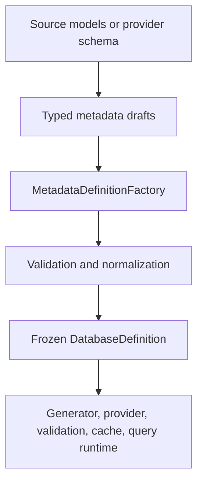

# Metadata Structure

The metadata model is the hinge between schema discovery, source models, generated code, runtime providers, validation, and caching.

Current DataLinq has two important metadata ideas:

- mutable draft inputs used while constructing metadata
- finalized runtime snapshots that should be treated as immutable

That distinction is not cosmetic. It prevents ordinary runtime code from mutating the shape that providers, caches, generated accessors, and validators all depend on.

## Construction Flow

`MetadataDefinitionFactory` owns the construction boundary. New metadata-producing code should prefer typed drafts and the factory instead of directly mutating runtime definitions.

## Root Metadata

### `DatabaseDefinition`

`DatabaseDefinition` is the finalized runtime root. It carries:

- database name and C# type information
- table and view models
- cache policy metadata
- generated declaration metadata
- lookup helpers for common table resolution
- finalized state used by providers and runtime execution

Generated database types bind this finalized metadata through `SetDataLinqGeneratedMetadata(...)`.

### `TableModel`

`TableModel` connects a generated/source model to its database table or view metadata. It is the bridge between C# type shape and database shape.

It can also carry generated provider-key row-store accessors, which let metadata-driven cache paths convert dynamic key components into the exact provider-key type used by a generated table cache.

## Tables, Views, Columns, and Indexes

### `TableDefinition`

`TableDefinition` describes a table:

- database table name
- C# model shape
- ordered columns
- primary-key shape
- indexes
- relation metadata
- cache settings
- table lookup helpers

Primary-key metadata is now more than a list of columns. The table key shape records model/provider CLR type information, store-kind selection, and a future scalar-converter slot.

### `ViewDefinition`

`ViewDefinition` describes a generated view shape. View support is intentionally narrower than table support. Provider metadata and validation compare the supported view boundary rather than pretending every provider view definition can roundtrip perfectly.

### `ColumnDefinition`

`ColumnDefinition` describes one database column and its C# value property:

- database name and provider type metadata
- C# value/property type metadata
- nullability
- primary-key and auto-increment state
- defaults
- enum metadata
- comments/checks where supported
- relation/foreign-key participation

### `ColumnIndex`

`ColumnIndex` describes an index across one or more database columns:

- name
- index type/characteristic
- ordered column parts
- relation participation when the index backs a key relationship

Provider-specific index details that DataLinq cannot represent should be documented as unsupported rather than imported lossy.

## Source Model Metadata

### `ModelDefinition`

`ModelDefinition` describes the C# model:

- type name and namespace
- table/view role
- attributes
- value properties
- relation properties
- generated declarations
- provider-key row-store accessor hook, when generated

### `ValueProperty`

`ValueProperty` represents a scalar property mapped to a column. It carries C# type information, database type metadata, defaults, enum metadata, and nullability.

### `RelationProperty`

`RelationProperty` represents a generated navigation property. It points back to relation metadata so generated models and query translation can reason about relation traversal without guessing from names.

## Relation Metadata

### `RelationDefinition`

`RelationDefinition` connects candidate-key and foreign-key sides of a relationship.

It records ordered relation parts, referential actions where supported, and enough table/index information for generated relations, validation, and relation-cache invalidation.

### `RelationPart`

`RelationPart` represents one side of a relationship and links relation metadata to the relevant `ColumnIndex`.

## Key Shape Metadata

Provider-key metadata is central to current cache behavior.

For a table, metadata describes:

- model-facing key type
- provider-facing key type
- scalar store kind for typed row stores and relation indexes
- composite key component order
- nullable component information
- scalar-converter slot for future model/provider value conversion

Generated scalar primary keys use provider CLR values directly. Generated composite primary keys use generated `DataLinqPrimaryKey` structs. Dynamic metadata paths use `DataLinqKey` as a carrier, not as the desired generated row-store identity.

## Maintenance Rule

Runtime metadata definitions should be treated as finalized snapshots. If code needs to create or transform metadata, build a typed draft and pass it through `MetadataDefinitionFactory`. If code needs fast access, add a finalized lookup/helper surface instead of mutating arrays or reintroducing repeated scans.
