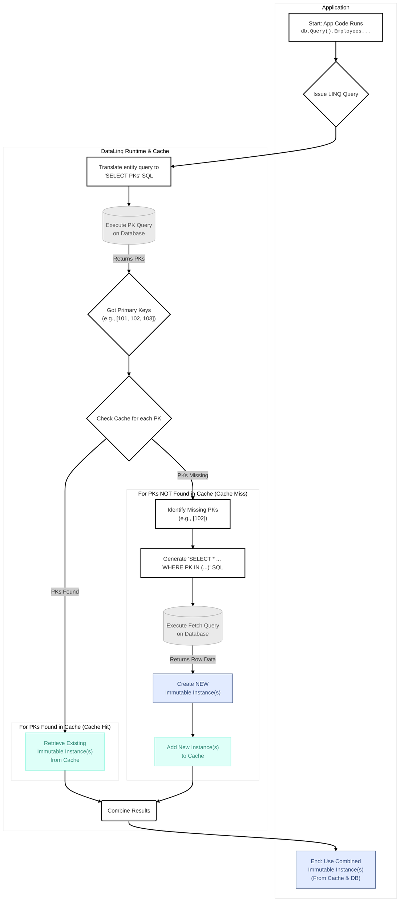
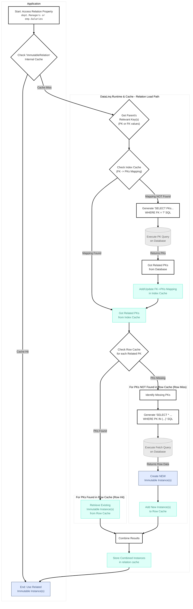

# Querying

DataLinq's runtime query story is centered on strongly typed access plus a deliberately limited LINQ translation layer.

That is a good thing, not a defect. A small, test-backed query surface is far better than a magical one that fails only after you ship.

For the exact query shapes that are currently safe to rely on, see [Supported LINQ Queries](Supported%20LINQ%20Queries.md).

## Runtime Setup

At runtime you connect with a normal connection string. The JSON config files are for the CLI, not for ordinary application queries.

```csharp
using DataLinq;
using DataLinq.MySql;
using DataLinq.Tests.Models.Employees;

var connectionString = "server=localhost;user=root;database=employees;password=yourpassword;";
var db = new MySqlDatabase<EmployeesDb>(connectionString);
```

Once instantiated, `db.Query()` gives you the generated database model surface.

## Typical Query Shapes

The usual entry point is standard LINQ over the generated table properties:

```csharp
var recentManagers = db.Query().Managers
    .Where(x => x.dept_fk.StartsWith("d00") && x.from_date > new DateOnly(2010, 1, 1))
    .OrderBy(x => x.dept_fk)
    .Take(10)
    .ToList();
```

Direct primary-key lookup also exists when you already know the key and do not need a LINQ pipeline:

```csharp
var department = Department.Get("d005", db);
```

If you need lower-level SQL-builder access, `Database<T>` also exposes `From(...)` and `From<TModel>()`. That is a different API surface from LINQ and should not be confused with "LINQ join support".

## SQL-Backed Result Shapes

The supported LINQ surface is no longer just "filter entities and hydrate them." Direct source-slot projections, scalar results, grouped aggregate rows, and supported join projection rows can be SQL-backed.

```csharp
var departmentIds = db.Query().Departments
    .Where(department => department.DeptNo.StartsWith("d00"))
    .OrderBy(department => department.DeptNo)
    .Select(department => department.DeptNo)
    .ToList();

var headcountByDepartment = db.Query().DepartmentEmployees
    .GroupBy(row => row.dept_no)
    .Select(group => new
    {
        DeptNo = group.Key,
        Count = group.Count(),
        MaxEmployeeNumber = group.Max(row => row.emp_no)
    })
    .OrderByDescending(row => row.Count)
    .ToList();

var departmentAssignments = db.Query().DepartmentEmployees
    .Join(
        db.Query().Departments,
        departmentEmployee => departmentEmployee.dept_no,
        department => department.DeptNo,
        (departmentEmployee, department) => new
        {
            departmentEmployee.emp_no,
            departmentEmployee.dept_no,
            DepartmentName = department.Name
        })
    .Where(row => row.dept_no == "d005")
    .OrderBy(row => row.emp_no)
    .Take(20)
    .ToList();
```

Those examples still live inside a deliberately bounded translator. The support boundary is documented, tested, and supposed to throw when you step outside it.

## Entity Query Execution Flow

This flow describes entity-shaped reads: queries that return generated model instances, direct primary-key lookups, and row-local projections that first materialize source rows. It is not the execution path for every successful query.



## What the Runtime Actually Does

The important behavior splits by result shape.

For entity-shaped reads:

1. DataLinq translates the supported LINQ shape into SQL that first identifies primary keys.
2. It checks the row cache for those keys.
3. It bulk-fetches only the missing rows.
4. It materializes immutable instances and reuses cached ones where possible.

For other supported result shapes:

- scalar results such as `Count`, `Any`, `Sum`, `Min`, `Max`, and `Average` render scalar SQL and convert the result value
- scalar member projection and SQL-backed anonymous/DTO projection rows read aliased values directly from the provider reader
- grouped aggregate projections render `GROUP BY` and aggregate selectors, then construct projection rows from SQL aliases
- row-local projections and row-local joined projections materialize the needed source rows first, then evaluate the supported selector in .NET

That primary-key-first path is still the reason repeated entity reads are cheap. It is just not a universal description of every query result. Cache identity belongs to generated entity rows; SQL result rows are ordinary projection values.

For more on the translation pipeline, see [Query Translator](internals/Query%20Translator.md). For the detailed parser design, see [LINQ Parser Architecture](internals/LINQ%20Parser%20Architecture.md).

## Relation Loading

Relation properties are lazy. Accessing a navigation property causes DataLinq to resolve the relation, cache the key mapping, and then hydrate any missing rows.

That means relation traversal is cheap after the first resolution, but it is still driven by the real relation metadata and cache state, not by speculative eager loading.



## Practical Caveats

- If row order matters, order explicitly before calling `First`, `Last`, or paging operators. Unordered "first" is fake determinism.
- Unsupported LINQ shapes should fail with `QueryTranslationException` during translation. They do not silently become good ideas.
- `Last()` and `LastOrDefault()` are supported in tested cases, but they are not the fast path. If what you really mean is "highest by X", write that as `OrderByDescending(...).First()` and be done with it.
- If you are unsure whether a query shape is supported, simplify it to the documented surface or add a test before depending on it.

## Lower-Level Query APIs

DataLinq also exposes lower-level query construction through `From(...)` and `SqlQuery`.

That API is real and useful, but it is not the same thing as the LINQ translator. The existence of raw SQL builder classes does not mean arbitrary LINQ `Join`, `GroupBy`, or aggregate shapes are supported.

## Summary

Use the LINQ surface that is already covered by tests, lean on explicit ordering, and treat relation access as lazy and cache-backed. That is the honest mental model for querying with DataLinq today.
