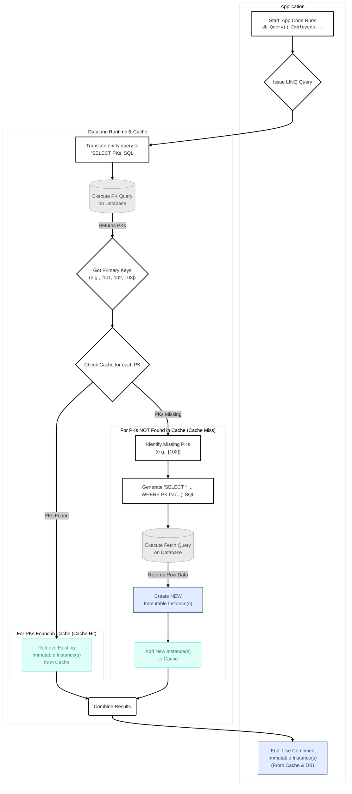
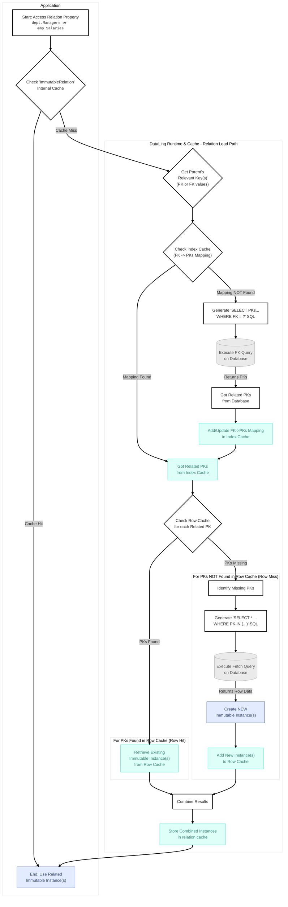

# Querying

DataLinq's runtime query story is centered on strongly typed access plus a deliberately limited LINQ translation layer.

That is a good thing, not a defect. A small, test-backed query surface is far better than a magical one that fails only after you ship.

For the exact query shapes that are currently safe to rely on, see [Supported LINQ Queries](Supported%20LINQ%20Queries.md).

The examples on this page use the SQL backend through SQLite, MySQL, or MariaDB. The experimental [Memory backend](backends/Memory.md) consumes the same normalized query-plan boundary but intentionally accepts a much smaller, read-only subset.

## Runtime Setup

At runtime you connect with a normal connection string. The JSON config files are for the CLI, not for ordinary application queries.

```csharp
using DataLinq;
using DataLinq.MySql;
using DataLinq.Tests.Models.Employees;

var connectionString = "server=localhost;user=root;database=employees;password=yourpassword;";
var db = new MySqlDatabase<EmployeesDb>(connectionString);
```

Once instantiated, `db.Query()` gives you the generated database model surface.

## Typical Query Shapes

The usual entry point is standard LINQ over the generated table properties:

```csharp
var recentManagers = db.Query().Managers
    .Where(x => x.dept_fk.StartsWith("d00") && x.from_date > new DateOnly(2010, 1, 1))
    .OrderBy(x => x.dept_fk)
    .Take(10)
    .ToList();
```

Direct primary-key lookup also exists when you already know the key and do not need a LINQ pipeline:

```csharp
var department = Department.Get("d005", db);
```

If you need lower-level SQL-builder access, `Database<T>` also exposes `From(...)` and `From<TModel>()`. That is a different API surface from LINQ and should not be confused with "LINQ join support".

## Prepared Queries

If the same LINQ structure runs repeatedly, use an explicit prepared query to parse and freeze that structure once. Current values are read from the invocation argument and rebound for every execution:

```csharp
var employeeByNumber = db.PrepareQuery(
    prototypeArgument: 10001,
    employeeNumber => db.Query().Employees.Single(employee =>
        employee.emp_no == employeeNumber));

var employee = employeeByNumber.Execute(db, 10042);
```

The prototype is not a default value and is not retained by the prepared query. It defines value-sensitive specialization that affects SQL structure: scalar nullness and the exact count/null count of a local sequence. Later arguments must have the same specialization shape. For example, prepare separate `IN` queries for one-item and three-item lists if both cardinalities are hot paths.

Use `PrepareSequenceQuery` when the result is a queryable sequence rather than a terminal such as `Single`, `Any`, `Count`, or `First`:

```csharp
var employeesByNumber = db.PrepareSequenceQuery(
    prototypeArgument: new[] { 10001, 10002, 10003 },
    employeeNumbers => db.Query().Employees
        .Where(employee => employeeNumbers.Contains(employee.emp_no!.Value))
        .OrderBy(employee => employee.emp_no));

var employees = employeesByNumber.Execute(db, new[] { 10042, 10043, 10044 }).ToList();
```

Mutable arrays and local collections are snapshotted for each invocation before execution begins, including before lazy sequence enumeration. A prepared query is thread-safe and may execute against the database that created it, another compatible database instance, a read-only access, or a transaction. Metadata ownership and backend capabilities are still validated on every execution.

Changing invocation values must flow through the prepared argument. Closure-captured values are rejected because retaining a closure would silently cache stale state—and often the database or transaction along with it. DataLinq does not maintain an automatic global expression cache; preparation is explicit and therefore bounded by the prepared objects your application chooses to retain.

## Backend Selection and Capability Rejection

The production path is:

```text
ExpressionQueryPlanParser
  -> QueryPlanTemplate + invocation values
  -> QueryExecutionRequest
  -> source-owned backend selection
  -> full capability validation
  -> SQL or Memory execution
```

The read source owns the backend. A SQL `Database` or `Transaction` selects its bound `SqlQueryPlanBackend`; `MemoryDatabase` selects its bound Memory backend. The request verifies that the source owns every plan table and that the selected backend is bound to that same source before it executes anything.

Parsing and backend support are different gates. An expression can be structurally valid and still require a feature the selected backend does not implement. That case throws `QueryBackendCapabilityException`—a `QueryTranslationException` subtype with `BackendName`, `Feature`, and `Location`—before Memory row work or SQL command execution. DataLinq does not partially execute the plan and does not silently fall back to unrestricted LINQ-to-objects.

## SQL-Backed Result Shapes

The supported LINQ surface is no longer just "filter entities and hydrate them." Direct source-slot projections, scalar results, grouped aggregate rows, and supported join projection rows can be SQL-backed.

```csharp
var departmentIds = db.Query().Departments
    .Where(department => department.DeptNo.StartsWith("d00"))
    .OrderBy(department => department.DeptNo)
    .Select(department => department.DeptNo)
    .ToList();

var headcountByDepartment = db.Query().DepartmentEmployees
    .GroupBy(row => row.dept_no)
    .Select(group => new
    {
        DeptNo = group.Key,
        Count = group.Count(),
        MaxEmployeeNumber = group.Max(row => row.emp_no)
    })
    .OrderByDescending(row => row.Count)
    .ToList();

var departmentAssignments = db.Query().DepartmentEmployees
    .Join(
        db.Query().Departments,
        departmentEmployee => departmentEmployee.dept_no,
        department => department.DeptNo,
        (departmentEmployee, department) => new
        {
            departmentEmployee.emp_no,
            departmentEmployee.dept_no,
            DepartmentName = department.Name
        })
    .Where(row => row.dept_no == "d005")
    .OrderBy(row => row.emp_no)
    .Take(20)
    .ToList();
```

Those examples still live inside a deliberately bounded translator. For relationship-specific query shapes, see [Relations and Joins](Relations%20and%20Joins.md). The support boundary is documented, tested, and supposed to throw when you step outside it.

## Entity Query Execution Flow

This SQL flow describes entity-shaped reads after the parser, request, source selection, and capability gate have accepted the plan. It covers queries that return generated model instances, direct primary-key lookups, and row-local projections that first materialize source rows. It is not the execution path for every successful query or for Memory.


```mermaid
---
config:
  theme: neo
  look: classic
---
flowchart TD
    subgraph Application
        A["Start: App Code Runs<br/><div style='font-family:monospace; font-size:0.9em;'>db.Query().Employees...</div>"] --> B{"Issue LINQ Query"}
        K["End: Use Combined<br/>Immutable Instance(s)<br/>(From Cache & DB)"]:::AppStyle
    end

    subgraph "DataLinq Runtime & Cache"
        C["Translate entity query to<br/>'SELECT PKs' SQL"] --> D[("Execute PK Query<br/>on Database")]:::DatabaseStyle
        D -- Returns PKs --> E{"Got Primary Keys<br/>(e.g., [101, 102, 103])"}
        E --> F{"Check Cache for each PK"}

        subgraph "For PKs Found in Cache (Cache Hit)"
          direction LR
          G["Retrieve Existing<br/>Immutable Instance(s)<br/>from Cache"]:::Aqua
        end

        subgraph "For PKs NOT Found in Cache (Cache Miss)"
          direction TB
          H["Identify Missing PKs<br/>(e.g., [102])"] --> I["Generate 'SELECT * ... WHERE PK IN (...)' SQL"]
          I --> J[("Execute Fetch Query<br/>on Database")]:::DatabaseStyle
          J -- Returns Row Data --> L["Create NEW<br/>Immutable Instance(s)"]:::Sky
          L --> M["Add New Instance(s)<br/>to Cache"]:::Aqua
        end

        F -- PKs Found --> G
        F -- PKs Missing --> H

        G --> CombineEnd("Combine Results")
        M --> CombineEnd
    end

    CombineEnd --> K
    B --> C

    classDef Aqua stroke-width:1px, stroke:#46EDC8, fill:#DEFFF8, color:#378E7A
    classDef Sky stroke-width:1px, stroke:#374D7C, fill:#E2EBFF, color:#374D7C
    classDef AppStyle stroke-width:1px, stroke:#374D7C, fill:#E2EBFF, color:#374D7C
    classDef DatabaseStyle stroke-width:1px, stroke:#AAAAAA, fill:#EAEAEA, color:#555555
    linkStyle default stroke:#000000
```

## What the Runtime Actually Does

The important behavior splits by result shape.

Before that split, DataLinq builds a `QueryExecutionRequest`, asks the read source for its bound backend, validates source ownership, and validates the complete normalized plan against that backend's capabilities. Only an accepted SQL request reaches the SQL paths below.

For entity-shaped reads:

1. DataLinq translates the supported LINQ shape into SQL that first identifies primary keys.
2. It checks the row cache for those keys.
3. It bulk-fetches only the missing rows.
4. It materializes immutable instances and reuses cached ones where possible.

For other supported result shapes:

- scalar results such as `Count`, `Any`, `Sum`, `Min`, `Max`, and `Average` render scalar SQL and convert the result value
- scalar member projection and SQL-backed anonymous/DTO projection rows read aliased values directly from the provider reader
- grouped aggregate projections render `GROUP BY` and aggregate selectors, then construct projection rows from SQL aliases
- row-local projections and row-local joined projections materialize the needed source rows first, then evaluate the supported selector in .NET

That primary-key-first path is still the reason repeated entity reads are cheap. It is just not a universal description of every query result. Cache identity belongs to generated entity rows; SQL result rows are ordinary projection values.

For more on the translation pipeline, see [Query Translator](internals/Query%20Translator.md). For the detailed parser design, see [LINQ Parser Architecture](internals/LINQ%20Parser%20Architecture.md).

## Relation Loading

Relation properties are lazy. Accessing a navigation property causes DataLinq to resolve the relation, cache the key mapping, and then hydrate any missing rows.

That means relation traversal is cheap after the first resolution, but it is still driven by the real relation metadata and cache state, not by speculative eager loading.


```mermaid
---
config:
  theme: neo
  look: classic
---
flowchart TD
    subgraph Application
        A["Start: Access Relation Property<br/><div style='font-family:monospace; font-size:0.9em;'>dept.Managers <i>or</i> emp.Salaries</div>"] --> B{"Check 'ImmutableRelation'<br/>Internal Cache"}
        O["End: Use Related<br/>Immutable Instance(s)"]:::AppStyle
    end

    subgraph "DataLinq Runtime & Cache - Relation Load Path"
        C{"Get Parent's<br/>Relevant Key(s)<br/>(PK or FK values)"} --> D{"Check Index Cache<br/>(FK -> PKs Mapping)"}

        D -- Mapping Found --> E["Got Related PKs<br/>from Index Cache"]:::Aqua
        D -- Mapping NOT Found --> F["Generate 'SELECT PKs...<br/>WHERE FK = ?' SQL"]
        F --> G[("Execute PK Query<br/>on Database")]:::DatabaseStyle
        G -- Returns PKs --> H["Got Related PKs<br/>from Database"]
        H --> I["Add/Update FK->PKs Mapping<br/>in Index Cache"]:::Aqua
        I --> E

        E --> J{"Check Row Cache<br/>for each Related PK"}

        subgraph "For PKs Found in Row Cache (Row Hit)"
            K["Retrieve Existing<br/>Immutable Instance(s)<br/>from Row Cache"]:::Aqua
        end

        subgraph "For PKs NOT Found in Row Cache (Row Miss)"
            L["Identify Missing PKs"] --> M["Generate 'SELECT * ...<br/>WHERE PK IN (...)' SQL"]
            M --> N[("Execute Fetch Query<br/>on Database")]:::DatabaseStyle
            N -- Returns Row Data --> P["Create NEW<br/>Immutable Instance(s)"]:::Sky
            P --> Q["Add New Instance(s)<br/>to Row Cache"]:::Aqua
        end

        J -- PKs Found --> K
        J -- PKs Missing --> L

        K --> CombineResults("Combine Results")
        Q --> CombineResults
        CombineResults --> R["Store Combined Instances<br/>in relation cache"]:::Aqua
    end

    B -- Cache Hit --> O
    B -- Cache Miss --> C
    R --> O

    classDef Aqua stroke-width:1px, stroke:#46EDC8, fill:#DEFFF8, color:#378E7A
    classDef Sky stroke-width:1px, stroke:#374D7C, fill:#E2EBFF, color:#374D7C
    classDef AppStyle stroke-width:1px, stroke:#374D7C, fill:#E2EBFF, color:#374D7C
    classDef DatabaseStyle stroke-width:1px, stroke:#AAAAAA, fill:#EAEAEA, color:#555555
    linkStyle default stroke:#000000
```

## Practical Caveats

- If row order matters, order explicitly before calling `First`, `Last`, or paging operators. Unordered "first" is fake determinism.
- Unsupported LINQ shapes should fail with `QueryTranslationException` during translation. They do not silently become good ideas.
- A plan accepted by the parser can still fail with `QueryBackendCapabilityException` when the selected backend lacks a required feature. Treat the exception's backend/feature/location fields as the actionable diagnostic.
- `Last()` and `LastOrDefault()` are supported in tested cases, but they are not the fast path. If what you really mean is "highest by X", write that as `OrderByDescending(...).First()` and be done with it.
- If you are unsure whether a query shape is supported, simplify it to the documented surface or add a test before depending on it.

## Lower-Level Query APIs

DataLinq also exposes lower-level query construction through `From(...)` and `SqlQuery`.

For tracked writes, use `Transaction.Insert(model)`, `Transaction.Update(model)`, and `Transaction.Delete(model)`. The old direct `SqlQuery`/`WhereGroup` mutation methods and `Insert`/`Update`/`Delete.Execute()` were never implemented. They are now hidden from editor completion and marked obsolete with a compiler error; existing binaries receive an actionable `NotSupportedException`.

The retained `InsertQuery()`, `UpdateQuery()`, and `DeleteQuery()` builders support `ToSql()` and `ToDbCommand()`. Dispose the returned command yourself. For example, `using var command = transaction.From("items").Where("id").EqualTo(42).DeleteQuery().ToDbCommand();` creates a parameterized command, which can be executed through `transaction.DatabaseAccess.ExecuteNonQuery(command)`. Raw execution bypasses DataLinq's tracked mutation and cache publication protocol. If such writes are committed, the caller must arrange the appropriate cache invalidation; use the tracked transaction API for ordinary model changes.

`ImmutableRelationMock<T>` implements the relation collection contract over a lazily captured immutable array. Enumeration preserves source order; keyed access uses model primary keys and rejects duplicate keys. `Clear()` discards the snapshot, so the next access enumerates the original source again. An already-running read may finish with its older snapshot. The mock does not clone the supplied model objects or load database relations.

That API is real and useful, but it is not the same thing as the LINQ translator. The existence of raw SQL builder classes does not mean arbitrary LINQ `Join`, `GroupBy`, or aggregate shapes are supported.

## Summary

Use the LINQ surface that is already covered by tests, lean on explicit ordering, and treat relation access as lazy and cache-backed. That is the honest mental model for querying with DataLinq today.
