# DataLinq Technical Documentation

## 1. Overview

DataLinq is built around a very specific trade:

- more generated code and more cache structure
- fewer runtime guesses and fewer repeated allocations

It is not trying to be the most permissive ORM on earth. It is trying to make a narrower model feel fast and predictable.

The important building blocks are:

- **Immutable Models:**
  Models are represented as immutable objects to reduce side effects during reads. When updates are needed, the system creates a mutable copy and commits that through the mutation flow.
- **Source Generation:**
  A source generator produces immutable and mutable classes from abstract model definitions.
- **LINQ Integration:**
  Queries are written in LINQ, but only a test-backed subset is translated.
- **Robust Caching:**
  Row, index, and key caches reduce repeated reads and preserve identity where possible.
- **Backend Flexibility:**
  The current concrete providers are MySQL/MariaDB and SQLite.

```mermaid
---
config:
  theme: neo
  look: classic
---
flowchart LR
    subgraph subGraph0["Dev Tools"]
        direction TB
        A1[("Database Schema")]
        A2["Developer Models<br>(Abstract Classes<br>+ Attributes)"]
        CLI["DataLinq CLI"]
    end
    subgraph subGraph1["Compile Time Generation"]
        direction TB
        SourceGen["DataLinq Source Generator"]
        B1["Generated Code<br>- Immutable/Mutable Classes<br>- Interfaces & Extensions"]
    end
    subgraph subGraph2["Runtime Execution"]
        direction TB
        AppCode["Application Code"]
        Runtime["DataLinq Runtime<br>- Query Engine<br>- Mutation Logic<br>- Instance Factory"]
        Cache["DataLinq Cache<br>- Row Cache<br>- Index Cache"]
        ProviderInterface["DataLinq Providers<br>- MySQL/MariaDB<br>- SQLite"]
        DB[("Database")]
    end
    CLI -- Reads --> A1
    CLI -- Creates/Modifies --> A2
    A2 -- Used by --> SourceGen
    SourceGen -- Generates --> B1
    B1 -- Compiled into --> AppCode
    AppCode -- Uses --> Runtime
    Runtime -- Instantiates --> B1
    Runtime -- Reads/Writes --> Cache
    Runtime -- Calls Methods --> ProviderInterface
    Cache -- Reads/Writes Data Via Provider --> ProviderInterface
    ProviderInterface -- Executes SQL --> DB
     A1:::DatabaseStyle
     CLI:::ToolStyle
     SourceGen:::ToolStyle
     B1:::GeneratedStyle
     AppCode:::AppStyle
     Runtime:::CoreStyle
     Cache:::Aqua
     DB:::DatabaseStyle
    classDef Aqua stroke-width:1px, stroke:#46EDC8, fill:#DEFFF8, color:#378E7A
    classDef ToolStyle stroke-width:1px, stroke:#FFB74D, fill:#FFF8E1, color:#E65100
    classDef CoreStyle stroke-width:1px, stroke:#9575CD, fill:#EDE7F6, color:#311B92
    classDef DatabaseStyle stroke-width:1px, stroke:#AAAAAA, fill:#EAEAEA, color:#555555
    classDef AppStyle stroke-width:1px, stroke:#374D7C, fill:#E2EBFF, color:#374D7C
    classDef GeneratedStyle stroke-width:1px, stroke:#BDBDBD, fill:#F5F5F5, color:#424242
```

## 2. Architecture

DataLinq is organized into several interconnected layers:

- **Model Layer:**
  Abstract model classes decorated with attributes such as `[Table]`, `[Column]`, and `[PrimaryKey]`.
- **Instance Creation and Mutation:**
  Immutable objects are created from `RowData`. Mutations happen through mutable wrappers and return fresh immutable instances.
- **Caching Subsystem:**
  `RowCache`, `IndexCache`, `KeyCache`, and `TableCache` cooperate to reduce repeated work.
- **Query Engine:**
  LINQ expressions are parsed and translated into backend-specific SQL for the supported surface.
- **Backend Flexibility:**
  Providers abstract backend-specific behavior behind a common runtime model.
- **Testing Infrastructure:**
  The repo has broad unit and integration coverage around metadata, query behavior, caching, and mutation.

## 3. Core Components

### 3.1 Model and Source Generation

- **Abstract Models:**
  Developers define abstract models and annotate them with attributes.
- **Source-Generated Classes:**
  The generator produces:
  - immutable classes
  - mutable classes
  - optional interfaces and helper extensions

### 3.2 Instance Management and Mutation

- **Immutable Base Class:**
  Handles access to `RowData`, lazy relation loading, and typed property access.
- **Mutable Wrapper:**
  Stores changes separately until commit.
- **Factory Methods:**
  `InstanceFactory` builds immutable instances from row data and metadata.

### 3.3 Caching Mechanisms

- **RowCache:**
  Stores immutable rows keyed by primary key.
- **IndexCache and KeyCache:**
  Store relation and key lookup data.
- **TableCache:**
  Owns the cache state for a table and coordinates updates after writes.

### 3.4 Query Handling

- **LINQ Integration:**
  Queries are written in LINQ, and the query engine translates supported shapes into backend-specific SQL commands.
- **Cache-Aware Query Execution:**
  Repeated reads can reuse cached rows rather than re-materializing them.

### 3.5 Testing and Examples

- **Unit Tests:**
  Cover cache behavior, metadata parsing, mutation lifecycle, equality, and query translation.
- **Integration Tests:**
  Exercise real providers and real transaction behavior.

## 4. Detailed Caching Workflow

The caching subsystem is critical to DataLinq's runtime model:

1. fetched rows become immutable instances
2. those instances are inserted into row cache
3. relation/index caches are updated as needed
4. later queries can reuse cached rows instead of rebuilding them
5. transaction-local cache state stays isolated until commit

## 5. Mutation and Data Consistency

DataLinq keeps writes coherent by enforcing a structured mutation flow:

1. convert immutable to mutable
2. track property changes
3. write through a transaction
4. replace stale immutable rows with fresh immutable rows after commit

Generated helpers such as `Save`, `Update`, `Insert`, and `MutateOrNew` sit on top of that core flow.

## 6. Current Reality

The repo clearly has room to grow, but the current technical center of gravity is still:

- MySQL/MariaDB and SQLite providers
- generator-backed immutable and mutable model flow
- cache-aware reads
- transaction-aware writes
- a limited but tested LINQ translator

## 7. Conclusion

DataLinq makes the most sense if you want a source-generated, cache-heavy, immutable-first ORM and you are willing to stay inside the supported query and mutation model. If that trade matches your problem, the architecture is coherent.
