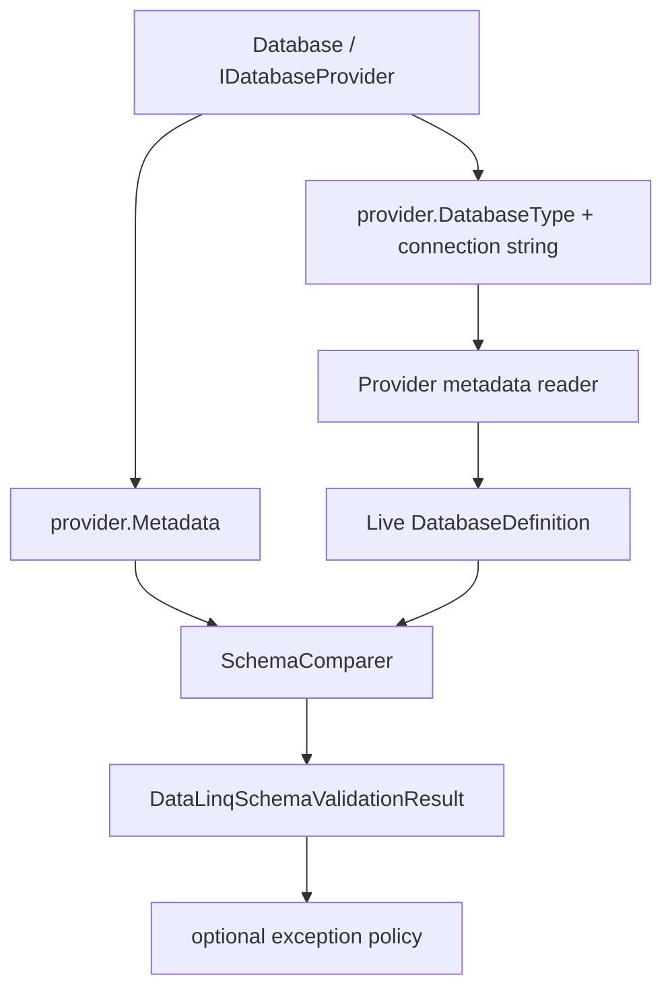

> [!WARNING]
> This document is roadmap or specification material. It describes planned behavior, not shipped DataLinq behavior.

# Specification: Schema Validation Hooks

**Status:** Accepted.
**Release horizon:** First post-0.9 adoption release.
**Last reviewed:** 2026-07-10.
**Dependency:** Runtime validation should compose with the planned DI/hosting package rather than introduce a competing startup abstraction.
**Goal:** Let applications and builds explicitly validate DataLinq model metadata against live database schemas so schema drift is caught during development, CI, deployment, and application startup.

**Related work:**

- `datalinq validate` already compares configured model files against live database metadata.
- `SchemaComparer` already produces provider-aware schema differences for the supported metadata subset.
- Runtime providers already carry finalized generated model metadata through `DatabaseProvider.Metadata`.

This plan deliberately does **not** add source-generator live database validation. Roslyn generation must stay deterministic, fast, credential-free, and network-free. Build-time live validation belongs in MSBuild/CLI integration, not inside the compiler pipeline.

## 1. Problem Statement

DataLinq already has useful drift detection, but the public integration points are too narrow:

- developers can run `datalinq validate` manually or in CI
- applications cannot currently call a first-class runtime validation API
- ASP.NET Core-hosted applications cannot opt into a standard startup validation hook
- project builds cannot opt into validation without hand-written scripts

That leaves an avoidable gap. A model can compile, deploy, and start against a database whose table, column, key, nullability, or default metadata has drifted. The first observed failure may then be a runtime query or mutation error, which is much too late.

The right fix is explicit, policy-driven validation hooks:

- runtime API for direct application calls
- startup/hosting integration for fail-fast deployment checks
- MSBuild target integration for local and CI builds

The wrong fix is hidden database access from generated code or provider constructors. Database validation is I/O, can require secrets, can be slow, and can fail for environmental reasons. It must be visible in the project or application startup surface.

## 2. Design Principles

- **Explicit opt-in:** no hidden database connections during ordinary model generation, provider construction, or query startup.
- **Shared comparison core:** reuse `SchemaComparer`, `SchemaValidationCapabilities`, and provider metadata readers instead of inventing a second drift model.
- **Runtime metadata first:** runtime validation compares `provider.Metadata` to live provider metadata. It should not reparse model source files.
- **Policy, not booleans:** callers choose whether warnings, errors, informational differences, provider read failures, or timeouts should fail the operation.
- **Structured results:** APIs return machine-readable differences before throwing convenience exceptions.
- **Provider-bound accuracy:** validation only reports metadata covered by the current provider support boundary. Unsupported metadata must be omitted or reported as an issue, not guessed.
- **No source-generator I/O:** compile-time live validation must be implemented as MSBuild/CLI execution after compilation inputs are available, not as Roslyn analyzer/generator behavior.

## 3. Runtime API

### 3.1. Public Surface

The runtime API should be available from `Database<T>` and provider-level helpers:

```csharp
var result = database.ValidateSchema();

if (result.HasFailures)
{
    foreach (var difference in result.Differences)
        logger.LogError("{Message}", difference.Message);
}
```

Convenience fail-fast form:

```csharp
database.EnsureSchemaValid(options =>
{
    options.FailOnSeverity = SchemaDifferenceSeverity.Error;
    options.TreatValidationIssuesAsFailures = true;
});
```

Suggested shape:

```csharp
public sealed class DataLinqSchemaValidationOptions
{
    public SchemaDifferenceSeverity FailOnSeverity { get; set; } = SchemaDifferenceSeverity.Error;
    public bool TreatValidationIssuesAsFailures { get; set; } = true;
    public bool IncludeInformationalDifferences { get; set; }
    public TimeSpan? CommandTimeout { get; set; }
    public IReadOnlyList<string>? Include { get; set; }
    public Action<string>? MetadataReaderLog { get; set; }
}

public sealed class DataLinqSchemaValidationResult
{
    public string DatabaseName { get; }
    public DatabaseType DatabaseType { get; }
    public int ModelTableCount { get; }
    public int DatabaseTableCount { get; }
    public IReadOnlyList<SchemaDifference> Differences { get; }
    public IReadOnlyList<DataLinqDiagnosticIssue> Issues { get; }
    public bool HasDifferences { get; }
    public bool HasFailures { get; }
}

public sealed class DataLinqSchemaValidationException : Exception
{
    public DataLinqSchemaValidationResult Result { get; }
}
```

Database API options:

```csharp
public abstract class Database<T>
{
    public DataLinqSchemaValidationResult ValidateSchema(
        Action<DataLinqSchemaValidationOptions>? configure = null);

    public void EnsureSchemaValid(
        Action<DataLinqSchemaValidationOptions>? configure = null);
}
```

Provider-level helper:

```csharp
public static class DataLinqSchemaValidator
{
    public static DataLinqSchemaValidationResult Validate(
        IDatabaseProvider provider,
        DataLinqSchemaValidationOptions? options = null);
}
```

### 3.2. Runtime Validation Flow



The important choice is that runtime validation starts from the finalized generated metadata already attached to the provider. It should not call the tooling-layer `SchemaValidator`, because that type reads model files from `datalinq.json`. Runtime code already has a better source of truth: the same `DatabaseDefinition` the provider uses for actual queries and mutations.

### 3.3. Provider Metadata Reading

The first implementation can reuse the provider metadata factories already registered through `PluginHook.MetadataFromSqlFactories`.

The runtime validator needs a small adapter that can call:

```csharp
var metadataOptions = new MetadataFromDatabaseFactoryOptions
{
    DeclareEnumsInClass = true,
    Include = validationOptions.Include?.ToList(),
    Log = validationOptions.MetadataReaderLog
};

PluginHook.MetadataFromSqlFactories[provider.DatabaseType]
    .GetMetadataFromSqlFactory(metadataOptions)
    .ParseDatabase(
        provider.Metadata.Name,
        provider.Metadata.CsType.Name,
        provider.Metadata.CsType.Namespace,
        provider.DatabaseName,
        provider.ConnectionString);
```

Implementation details will need to account for SQLite data-source normalization, provider-specific database name behavior, logging, and timeout plumbing. The point is not the exact call above; the point is that provider metadata readers should remain the only live schema readers.

### 3.4. Failure Policy

Default policy should be strict enough to catch real breakage but not so strict that benign production metadata causes startup failure.

Recommended defaults:

- fail on `SchemaDifferenceSeverity.Error`
- warn/report `SchemaDifferenceSeverity.Warning`
- omit or include `Info` by option
- treat metadata read failures as validation failures
- do not auto-create, auto-migrate, or auto-repair anything

This means:

- missing tables and columns fail
- type, nullability, primary-key, auto-increment, default, check, and foreign-key action mismatches fail when the provider supports those comparisons
- missing unique indexes fail
- missing ordinary indexes warn
- extra tables, columns, indexes, checks, and foreign keys warn by default because they can be intentional sidecar database objects
- comments remain informational

The exact classification should come from existing `SchemaDifferenceSeverity`; the runtime API should not maintain a separate severity table.

## 4. Startup Hook

### 4.1. Public Surface

For generic host / ASP.NET Core applications, the integration should be explicit registration:

```csharp
builder.Services.AddDataLinqSchemaValidation(options =>
{
    options.ValidateOnStartup = true;
    options.Validation.FailOnSeverity = SchemaDifferenceSeverity.Error;
});
```

Hosting registration can use a wrapping options type:

```csharp
public sealed class DataLinqSchemaValidationHostingOptions
{
    public bool ValidateOnStartup { get; set; } = true;
    public DataLinqSchemaValidationOptions Validation { get; } = new();
}
```

Registration should not guess databases out of thin air. Applications should provide the database instances or provider factories they want validated:

```csharp
builder.Services.AddDataLinqSchemaValidation()
    .ValidateDatabase<EmployeesDb>();
```

or:

```csharp
builder.Services.AddDataLinqSchemaValidation()
    .ValidateProvider(sp => sp.GetRequiredService<EmployeesDatabase>().Provider);
```

For hosted applications where DataLinq database instances are already registered:

```csharp
builder.Services.AddHostedService<DataLinqSchemaValidationHostedService>();
```

The helper registration can add the hosted service internally, but the behavior should be visible from the call site.

### 4.2. Startup Behavior

The hosted service should:

- validate all registered validation targets during application startup
- log every issue and difference with database name, provider, path, severity, and message
- throw when policy marks the result as failed
- avoid continuing to serve traffic after required validation fails

Recommended output posture:

- one concise summary per database
- individual warnings/errors as structured logs
- no connection strings in logs
- no generated SQL suggestions during startup unless explicitly requested later

### 4.3. Environment Policy

Applications need different policy per environment:

```csharp
builder.Services.AddDataLinqSchemaValidation(options =>
{
    options.ValidateOnStartup = builder.Environment.IsDevelopment()
        || builder.Environment.IsStaging()
        || builder.Configuration.GetValue<bool>("DataLinq:ValidateSchemaOnStartup");

    options.Validation.FailOnSeverity = builder.Environment.IsProduction()
        ? SchemaDifferenceSeverity.Error
        : SchemaDifferenceSeverity.Warning;
});
```

That is intentionally application code, not DataLinq magic. Production deployments vary. Some teams want startup failure on drift; others want a canary job to fail before app rollout. DataLinq should provide the mechanism and sane defaults, not pretend there is one universally correct deployment policy.

## 5. MSBuild / Build-Time Hook

### 5.1. Public Surface

Build-time live validation should be opt-in through MSBuild properties:

```xml
<PropertyGroup>
  <DataLinqValidateOnBuild>true</DataLinqValidateOnBuild>
  <DataLinqValidateOnBuildConfig>$(MSBuildProjectDirectory)\datalinq.json</DataLinqValidateOnBuildConfig>
  <DataLinqValidateOnBuildProvider>SQLite</DataLinqValidateOnBuildProvider>
  <DataLinqValidateOnBuildDatabase>AppDb</DataLinqValidateOnBuildDatabase>
  <DataLinqValidateOnBuildAll>false</DataLinqValidateOnBuildAll>
  <DataLinqValidateOnBuildFailOn>error</DataLinqValidateOnBuildFailOn>
</PropertyGroup>
```

For multi-target validation:

```xml
<PropertyGroup>
  <DataLinqValidateOnBuild>true</DataLinqValidateOnBuild>
  <DataLinqValidateOnBuildAll>true</DataLinqValidateOnBuildAll>
</PropertyGroup>
```

### 5.2. Execution Model

The first implementation should invoke the same validation path as the CLI:

```text
datalinq validate --format json ...
```

That is intentionally boring. It keeps local manual validation, CI validation, and MSBuild validation aligned.

The MSBuild target should:

- run after model source generation inputs are available
- run before packaging/publish when validation is enabled
- fail the build on validation exit code `2`
- fail, warn, or pass on validation exit code `1` according to drift policy
- print a concise error summary into MSBuild output
- preserve detailed JSON/text output in an artifact file when practical

### 5.3. Tool Resolution

The build hook should not require global tool installation as the only supported path.

Acceptable resolution order:

1. explicit `DataLinqCliPath`
2. repo/local tool manifest command
3. package-provided build task or tool path
4. global `datalinq` command as fallback

The exact packaging mechanism can be decided during implementation. The spec-level requirement is that build validation must be reproducible in CI and not depend silently on a developer's global machine state.

### 5.4. Secrets and Environments

Build-time validation can require connection strings and secrets. The target must therefore remain opt-in and should document the expected secret sources.

Allowed inputs:

- `datalinq.user.json` for local development
- environment variable secret references
- prompt-based secrets only for interactive CLI use, not ordinary MSBuild
- CI secret injection through environment variables or generated config files

The MSBuild target should not prompt for secrets by default. Non-interactive builds must fail clearly when required secrets are missing.

### 5.5. Why Not Source Generator Validation?

Live database validation from the source generator is rejected for this plan.

Reasons:

- generators run in IDEs on incomplete code and often run many times
- generators must be deterministic from compiler inputs
- database connections introduce latency, networking, credentials, and environmental failure
- production connection strings do not belong in compiler execution
- generator failures would blur model syntax errors with infrastructure errors

The source generator should continue validating model self-consistency. Live schema validation belongs in explicit tooling or runtime calls.

## 6. Implementation Slices

### Slice 1: Runtime Validator Core

- Add `DataLinqSchemaValidationOptions`.
- Add `DataLinqSchemaValidationResult`.
- Add `DataLinqSchemaValidationException`.
- Add `DataLinqSchemaValidator.Validate(IDatabaseProvider, options)`.
- Add `Database<T>.ValidateSchema(...)`.
- Add `Database<T>.EnsureSchemaValid(...)`.
- Reuse provider metadata readers and `SchemaComparer`.
- Add unit tests using SQLite metadata fixtures.

### Slice 2: Startup / Hosting Integration

- Add registration APIs for validation targets.
- Add hosted service or startup runner.
- Add structured logging for validation results.
- Add tests for fail/pass policy without requiring a server-backed database.
- Document usage in dev-plan first; move to user docs only after implementation.

### Slice 3: MSBuild Validation Target

- Add opt-in MSBuild properties.
- Invoke CLI validation with explicit target/config selection.
- Convert validation result to MSBuild errors/warnings.
- Preserve detailed validation output.
- Cover normal pass, drift, and infrastructure failure cases.

## 7. Non-Goals

- No automatic migration execution.
- No schema repair during startup.
- No source-generator database connections.
- No compile-time live database validation without an explicit MSBuild target.
- No new snapshot validation workflow in this plan.
- No provider metadata guessing outside the existing support boundary.

## 8. Open Questions

- Should `ValidateSchema()` be synchronous only for the first slice, matching the current provider access style, or should the public surface reserve async variants immediately?
- Should the startup package live in the main runtime package or a separate hosting integration package?
- Should MSBuild `FailOn=warning` map warnings to build errors, or should it emit warnings and rely on `TreatWarningsAsErrors`?
- Should runtime validation support cancellation tokens in the first slice, or only command timeout?
- Should startup validation run before or after application-specific migration tools, when both are registered?
