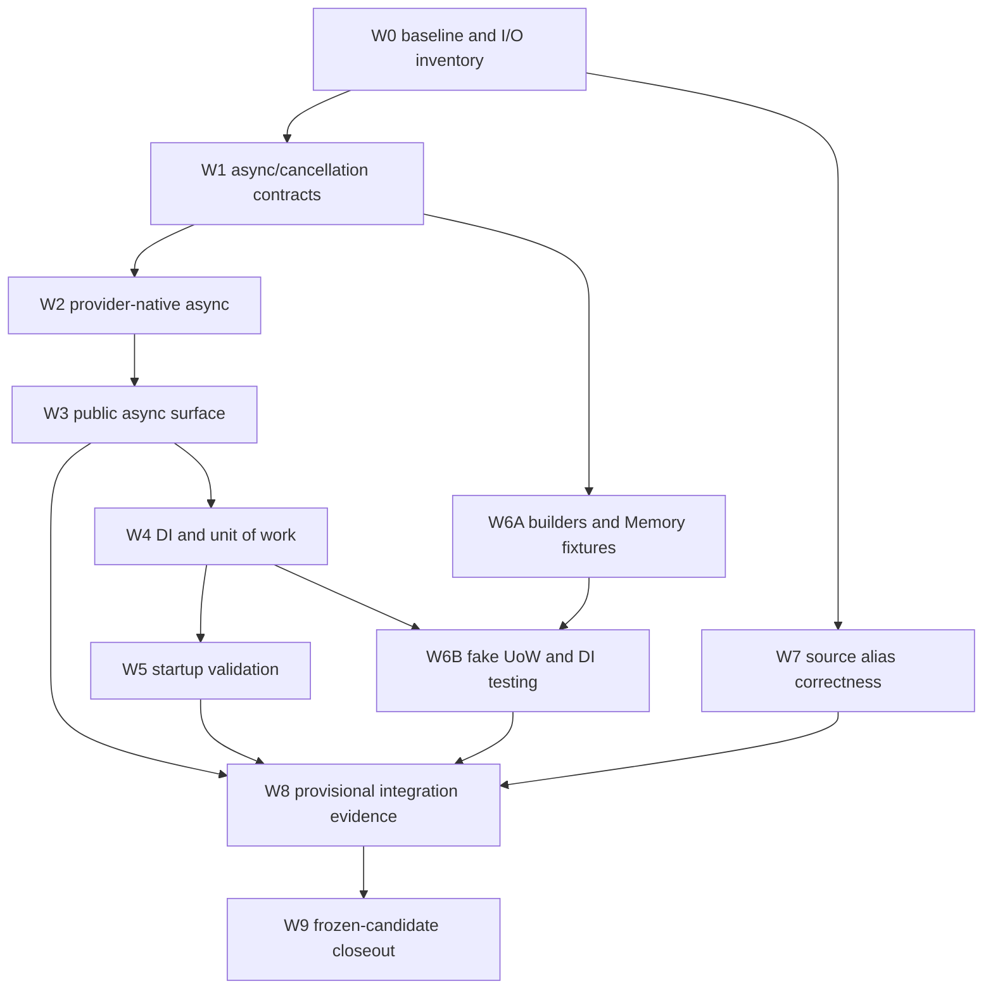

> [!WARNING]
> This is an implementation plan for a future release. It is not documentation of shipped DataLinq behavior.

# 0.10 Implementation Order And Integration Plan

**Status:** Accepted.

**Target release:** 0.10.

**Last reviewed:** 2026-09-04.

**Authority:** The [0.10 implementation roadmap](README.md) owns release scope. This document owns dependency order, shared-contract decisions, merge gates, and stop rules.

## Purpose

The adoption work crosses query execution, providers, transactions, hosting, schema validation, testing, generators, packaging, and documentation. This plan prevents each surface from inventing a slightly different cancellation, lifetime, or testing contract.

It does not authorize implementation outside the 0.10 roadmap.

## Ownership Map

| Workstream | Durable design source | Shared contracts owned here | Release gate |
| --- | --- | --- | --- |
| A10 native async and cancellation | [Async and Lazy Loading](../../query-and-runtime/Async%20and%20Lazy%20Loading.md) | async provider/access contracts, cancellation, sync/async parity | A10 gate |
| H10 DI, hosting, and unit of work | [Dependency Injection and Hosting Integration](../../architecture/Dependency%20Injection%20and%20Hosting%20Integration.md) | service lifetimes, read root, unit-of-work factory, disposal | H10 gate |
| V10 startup validation | [Schema Validation Hooks](../../providers-and-features/Schema%20Validation%20Hooks.md) | host policy, structured result, cancellation/timeout behavior | V10 gate |
| T10 testing support | [Model Testing and Mocking Support](../../testing/Model%20Testing%20and%20Mocking%20Support.md) | builders, relation graphs, Memory fixtures, fake unit of work | T10 gate |
| G10 source aliases | [Issue #93](https://github.com/bazer/DataLinq/issues/93) | semantic type identity and incremental dependencies | G10 gate |
| R10 release evidence | [Release Evidence and Closeout Plan](Release%20Evidence%20and%20Closeout%20Implementation%20Plan.md) | manifests, candidate identity, evidence validity, go/no-go | final gate |

## Decisions To Freeze Before Public API Work

### D10-1: Async Contract Shape

The accepted decisions and remaining OAPI questions live in [Async Public API Decisions](Async%20Public%20API%20Decisions.md). `Transaction()` stays synchronous and lazy, execution mode is chosen per operation, and public cancellation tokens are optional. Generated single-reference methods use `<PropertyName>Async()` without a `Load` prefix; collection handles remain synchronous and expose async execution terminals. These decisions do not replace W0 evidence or freeze unproven signatures.

Complete the audit and decide/test:

- which current public operations perform I/O
- which receive `Async` counterparts in the initial release
- which I/O operations accept an optional final `CancellationToken`; local construction/composition needs no token, and internal contracts may require explicit propagation
- enforce revised AAPI-8: public key/single-reference lookups, query/relation terminals, collection accessors, and disposal use `ValueTask`; prepared scalar/row execution, mutations, transaction completion/callbacks, and other non-LINQ awaitable operations use `Task`, with generic result types as appropriate; measure implementation costs without claiming a signature alone proves a performance improvement
- enforce AAPI-11's approved breaking rename to `AsKeyValuePairs()`, restoring standard row `AsEnumerable()`; A10 owns the narrow synchronous correction before async execution work, with T10 follow-through for custom/testing implementations and explicit source/binary migration evidence
- enforce AAPI-12's explicit async row view, local predicate semantics, and collection accessor names/result shapes
- enforce AAPI-13's normal transitive `System.Linq.AsyncEnumerable` dependency only for .NET 8/9 when implementing the async surface; pin its version centrally and verify packed dependency groups and consumers on .NET 8/9/10
- enforce AAPI-14's interface execution members and overridable async defaults; settle the exact primitive/overload inventory and concrete/custom/test implementation compatibility without synchronous database fallback
- enforce AAPI-15's public model-base visibility, overridable single-reference methods, and focused generated-name/inheritance diagnostics without automatically expanding mutable/shared model interfaces
- enforce AAPI-16's required-reference validation in both synchronous and asynchronous navigation, nullable optional references, and duplicate-target failures; A10 owns runtime/generator work with T10 parity and explicit migration evidence
- enforce AAPI-17/AAPI-18: direct `IAsyncEnumerable<T>` views and prepared-sequence `ExecuteAsync(...)`, no universal streaming guarantee, explicit completed materialization, deferred sequence I/O, ordinary/prepared/terminal parameter-capture boundaries, and sequential repeat enumeration without permanent result caching
- enforce AAPI-19/AAPI-20: optional method/enumerator tokens honored together, cancellation during buffered iteration, ownership/disposal on every enumeration exit, rejection of another execution during a live transaction reader, and preservation of validated later relation source transitions
- enforce AAPI-27 through AAPI-30: mutation identity/values captured before first suspension, exclusive use of pending mutable inputs, exactly-once synchronous local edits, and finite multi-model enumeration/capture before execution; retain documented reference-value/async-void limits
- enforce AAPI-31 through AAPI-33: task-returning transaction-only/token-aware callback families, helper-owned completion with explicit token propagation, and results delivered after commit/finalization/cleanup; materialize transaction-bound deferred results inside callbacks without hidden transaction retention
- enforce AAPI-34 through AAPI-38: one active execution operation per transaction across sync/async paths, resource-lifetime and private internal/mutable/helper ownership, rejected caller disposal during active work, and safe recovery without commit for unfinished callbacks
- enforce AAPI-39 through AAPI-41: existing per-relation coordination with independent wait cancellation, invalidation-safe row/index/relation publication, complete-result versus individual-row caching, and transaction/database isolation without a general coalescing system

Relation query composition is excluded from 0.10 under revised AAPI-10. Its [backlog proposal](../../query-and-runtime/Relation-Scoped%20Queries.md) creates no parser, test-helper query capability, or release-gate dependency here; existing database/transaction query roots remain in scope.

Do not add public async methods incrementally until one audit proves the surface is coherent.

### D10-2: Provider Cancellation And Failure Semantics

OAPI-3's enumeration contracts are accepted under AAPI-17 through AAPI-20, OAPI-4's failure policies under AAPI-21 through AAPI-26, OAPI-5's mutation/callback contracts under AAPI-27 through AAPI-33, and OAPI-6's concurrency/cache policies under AAPI-34 through AAPI-41. Resolve the exact signature/provider questions in the [API decision record](Async%20Public%20API%20Decisions.md#open-decisions-before-the-complete-api-is-frozen) without reopening those accepted boundaries.

Implement and prove:

- ordinary argument/lifecycle validation before pre-cancellation, including cached execution and unused commit; preserve prior transaction work and completed success
- private first-use initialization publication and unusable wrappers after interrupted initialization, without automatic reset/replay; successful initialization followed by pre-command cancellation remains distinct
- reusable canceled reads only after cleanup and provider trust are established; no partial materializer success or false complete relation publication
- poisoning after interrupted writes/post-write hydration, cancelable required I/O, and uninterrupted short local consistency finalization; prevent committing a canceled multi-model call's completed prefix
- independent confirmed/unknown database completion outcomes that survive subsequent finalization, notification, and cleanup failures, with terminal recovery restrictions
- explicit rollback caller tokens versus independent recovery rollback tokens; configurable 30-second starting recovery budget, verified before configuration freeze, without a total-cleanup deadline or unsafe abandoned work
- throwing disposal, primary/secondary failure precedence where DataLinq owns execution/cleanup, documented scope-exit limitations, and no duplicate reporting of already-reported cleanup failures
- structured cause/stage/outcome/recovery/secondary-failure information for explicit and implicit helpers, preserving ordinary exception identity and provider codes
- deterministic overlap/admission/recovery and cache invalidation/publication races under AAPI-34 through AAPI-41, including mixed sync/async execution, independent waiter cancellation, and cleanup failures without unsafe abandoned work

Exact public accessors/options, callback/mutation overload inventory, and compatibility remain under OAPI-7. Provider-specific interruption/classification and recovery-budget feasibility remain under OAPI-9 and W1/W2. AAPI-34 through AAPI-41 settle wider operation/shared-load coordination, private ownership across awaits, and recovery of unfinished callback work. Private gate/versioning representations and cost remain implementation choices; preserve AAPI-28's exclusive mutable lifetime and AAPI-32's borrowed completion restrictions.

Provider differences may be explicit, but they cannot become silent semantic drift.

### D10-3: Host Lifetime And Unit-Of-Work Ownership

Define:

- the reusable provider/database state lifetime
- connection and transaction ownership
- the read-only injected root
- the explicit unit-of-work factory and instance boundary
- participation by nested application services
- commit, rollback, cancellation, failure, and disposal terminal states
- host shutdown ownership

Do not introduce an ambient session to avoid making this decision.

### D10-4: Startup Validation Policy

Define one structured validation result and explicit policies for:

- fail startup
- log warning and continue
- disabled/no database access

The host adapter consumes this result; it does not invent a second schema comparison model.

### D10-5: Testing Fidelity Boundary

Freeze the ladder of test guarantees:

1. plain/business model shape
2. real metadata-aware immutable instance
3. real relation graph over testing infrastructure
4. real `DataLinq.Memory` capability execution
5. fake unit of work for application behavior
6. SQLite/server-backed provider behavior

Every helper name and document must reveal which layer it belongs to.

### D10-6: Performance Evidence Policy

Freeze a 0.9 baseline with the current benchmark harness before shared runtime changes. Issue #26 remains contextual debt; 0.10 blocks on new unexplained regressions, not automatic satisfaction of its literal final-0.8 parity target.

## Authoritative Dependency Graph

## Implementation Waves

### W0: Baseline And I/O Inventory

Required work:

- record clean commit, SDK, package graph, supported frameworks, provider targets, and test catalog
- inventory query, relation, mutation, transaction, metadata-read, and validation I/O boundaries
- map every current synchronous provider call to its native async availability
- capture current public API and generated-code snapshots
- run the focused/full test baselines and the benchmark lanes affected by async orchestration
- record current logging, metrics, cache, invalidation, and transaction-terminal behavior

Exit gate:

- the audit has no unowned I/O path
- later work can compare against immutable evidence rather than recollection
- D10-1 through D10-6 have named owners and unresolved questions are explicit

### W1: Internal Async And Cancellation Contracts

Required work:

- introduce internal async provider/access/source interfaces without changing public support claims
- carry cancellation through query execution, row loading, relation loading, mutation, transaction, and schema metadata boundaries
- preserve immutable invocation snapshots across awaits
- add focused cancellation/failure tests with deterministic controllable providers
- keep synchronous implementations direct

Exit gate:

- the contracts can express every inventoried I/O path
- no production path uses `Task.Run` as provider async
- no public API is frozen before provider feasibility is proven

### W2: Native Provider Async Execution

Required work:

- implement SQLite provider async paths and document driver-level synchronous behavior or cancellation limits explicitly
- implement MySQL/MariaDB native async paths through the shared provider
- cover reader lifetime, command cancellation, mutations, lazy transaction initialization through the first sync/async operation, commit/rollback, and disposal
- preserve cache publication and invalidation boundaries
- classify provider-specific cancellation/timeout/uncertain outcomes

Exit gate:

- representative provider compliance cases prove sync/async parity
- cancellation tests cover pre-dispatch, in-flight, and cleanup behavior
- server-backed targets have the same semantic assertions, with explicit provider exceptions only where unavoidable

### W3: Public Async Surface

Required work:

- expose the audited async query, relation, mutation, transaction, and validation operations
- add XML/API documentation and focused examples
- validate overload consistency, optional final `CancellationToken` parameters, generated `<PropertyName>Async` methods, and synchronous transaction construction against the API decision record
- run ApiCompat and review every public addition or change
- prove synchronous API behavior remains intact

Exit gate:

- the surface is coherent across supported operation families
- unsupported async shapes fail explicitly
- no new hidden property I/O or ambient transaction behavior entered the API; existing sync navigation behavior remains compatible

### W4: DI, Hosting, And Unit Of Work

Required work:

- establish the host-integration package boundary and dependency graph
- implement generated-database/provider registration
- expose read access and explicit unit-of-work factory contracts
- integrate logging and options validation
- test scopes, concurrent requests, nested service participation, cancellation, terminal failures, and shutdown
- document ownership without implying EF `DbContext` semantics

Exit gate:

- ASP.NET Core and Generic Host consumer fixtures resolve and dispose services correctly
- transaction state cannot leak across scopes
- unit-of-work failure semantics match the existing SQL mutable lifecycle

### W5: Startup Schema Validation

Required work:

- expose the structured runtime validation service
- integrate fail-fast/warning/disabled host policies
- propagate cancellation and timeout through provider metadata reads
- redact secrets and preserve actionable differences
- test multiple targets, deterministic ordering, partial failures, and host-startup behavior

Exit gate:

- startup validation proves no hidden database access when disabled
- fail-fast and warning policies consume one semantic result
- no migration or repair path exists in the host adapter

### W6: Testing Support

#### W6A: Builders, Relations, And Memory Fixtures

May proceed after W1 establishes the relevant read/cancellation contracts.

Required work:

- relation/reference doubles
- metadata-aware immutable builder
- relation graph builder
- Memory fixture and reset adapter
- deterministic test data support required by those builders

#### W6B: Fake Unit Of Work And DI Replacement

Begins only after W4 freezes the real unit-of-work contract.

Required work:

- fake unit of work and failure injection
- DI replacements for Memory-backed reads and fake writes
- distinctly named SQLite-in-memory provider helper
- docs/examples that separate test guarantees

Exit gate:

- builders preserve actual metadata/key/relation invariants
- Memory helpers do not widen Memory capabilities
- fake write behavior mirrors the public unit-of-work lifecycle without simulating provider semantics

### W7: Source Alias Correctness

May proceed independently after W0.

Required work:

- semantic type-symbol resolution
- stable emitted type identity
- alias-aware nullability/value classification
- focused syntax-only diagnostics
- incremental dependency invalidation
- generator approval/runtime coverage for aliases and neighboring type forms

Exit gate: all acceptance criteria in [issue #93](https://github.com/bazer/DataLinq/issues/93) are covered without unrelated generator redesign.

### W8: Provisional Integration Evidence

Required work:

- full quick and provider matrices
- API/package/consumer-smoke checks
- affected compatibility and browser graphs
- benchmark comparison and telemetry review
- DocFX and link validation
- public documentation draft based on implemented behavior only

Exit gate:

- no incomplete or nonzero command is reported as verified
- every warning/finding is owned and dispositioned
- release scope has not expanded

### W9: Frozen-Candidate Closeout

Required work:

- freeze commit and exact candidate version
- pack without publishing
- rerun the complete evidence graph from that exact candidate
- produce one manifest with artifact identities and an explicit go/no-go decision
- update release notes and public claims only from frozen evidence

Exit gate: all requirements in the [release evidence plan](Release%20Evidence%20and%20Closeout%20Implementation%20Plan.md) pass and publication remains a separate maintainer action.

## Safe Parallel Lanes

- W7 can run beside W1-W6 after W0.
- W6A can begin after W1 while provider work continues, but it cannot invent a second query engine.
- H10 package scaffolding may begin during W3, but public lifetimes cannot freeze until W3 contracts are stable.
- Release tooling can add new suite/package registrations incrementally, but final evidence waits for W8/W9.
- Documentation plans and examples may be drafted early; shipped-behavior wording waits for W9.

## Merge Rules

1. Each change names its owning workstream and gate.
2. Shared contract changes include focused tests in the same change.
3. Provider changes preserve the other providers or land behind an internal unused seam until parity is ready.
4. Public API additions require XML docs, ApiCompat review, and at least one consumer-shaped test.
5. New packages enter central versions, pack tooling, inspection, consumer smoke, and compatibility inventories together.
6. Testing helpers consume production metadata/Memory/unit-of-work contracts rather than copying semantics.
7. Public docs do not describe a workstream as shipped until W9 evidence is green.
8. No commit may quietly add an explicitly excluded feature because a nearby abstraction makes it convenient.

## Stop Rules

Stop and revise the roadmap before continuing if:

- native provider async requires a public breaking redesign not covered by the accepted contract
- cancellation can leave cache or mutable-instance state with an unclassifiable outcome
- the unit-of-work lifetime cannot be expressed without implicit ambient state
- startup validation needs a competing schema model
- testing support needs to fork Memory or provider execution semantics
- source alias support requires a broad generator architecture rewrite
- a proposed performance optimization introduces retention, pooling, or cache policy not justified by measured evidence
- any explicitly excluded 0.10 item becomes a practical dependency

Finishing early is not a scope-expansion event.

## Definition Of Ready To Start Implementation

- W0 commands and artifact locations are agreed
- D10-1 through D10-6 have named owners
- the initial public async surface audit is complete
- package ownership and unit-of-work lifetime questions are explicit
- the required testing subset is accepted
- issue #93 remains independently scoped
- the release evidence plan can record every workstream

## Links

- [DataLinq 0.10 Implementation Roadmap](README.md)
- [0.10 Async Public API Decisions](Async%20Public%20API%20Decisions.md)
- [0.10 Release Evidence and Closeout Implementation Plan](Release%20Evidence%20and%20Closeout%20Implementation%20Plan.md)
- [Development Roadmap](../../Roadmap.md)
