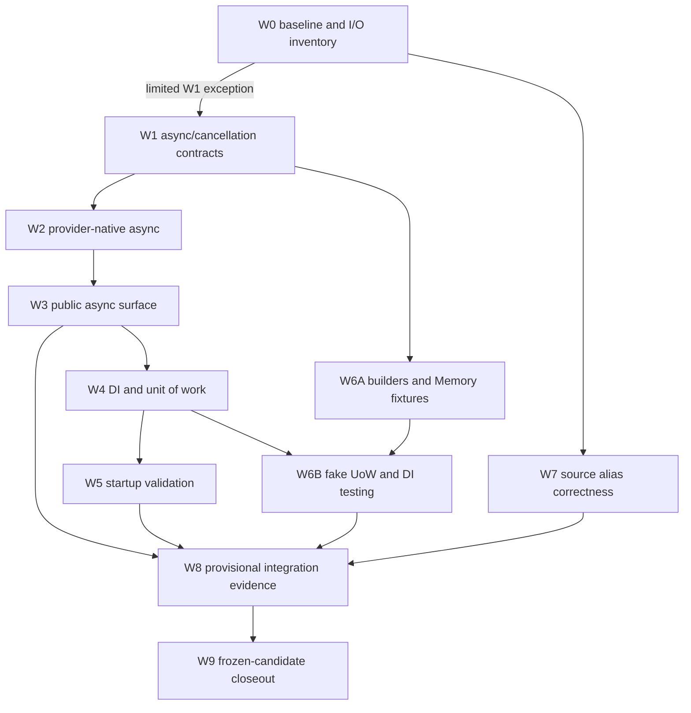

> [!WARNING]
> This is an implementation plan for a future release. It is not documentation of shipped DataLinq behavior.

# 0.10 Implementation Order And Integration Plan

**Status:** Accepted.

**Target release:** 0.10.

**Last reviewed:** 2026-09-17.

**Authority:** The [0.10 implementation roadmap](README.md) owns release scope. This document owns dependency order, shared-contract decisions, merge gates, and stop rules.

## Purpose

The adoption work crosses query execution, providers, transactions, hosting, schema validation, testing, generators, packaging, and documentation. This plan prevents each surface from inventing a slightly different cancellation, lifetime, or testing contract.

It does not authorize implementation outside the 0.10 roadmap.

## Ownership Map

| Workstream | Durable design source | Shared contracts owned here | Release gate |
| --- | --- | --- | --- |
| A10 native async and cancellation | [Async and Lazy Loading](../../query-and-runtime/Async%20and%20Lazy%20Loading.md) | async provider/access contracts, cancellation, sync/async parity | A10 gate |
| H10 DI, hosting, and unit of work | [Dependency Injection and Hosting Integration](../../architecture/Dependency%20Injection%20and%20Hosting%20Integration.md) | service lifetimes, read root, unit-of-work factory, disposal | H10 gate |
| V10 startup validation | [Schema Validation Hooks](../../providers-and-features/Schema%20Validation%20Hooks.md) | host policy, structured result, cancellation/timeout behavior | V10 gate |
| T10 testing support | [Model Testing and Mocking Support](../../testing/Model%20Testing%20and%20Mocking%20Support.md) | builders, relation graphs, Memory fixtures, fake unit of work | T10 gate |
| G10 source aliases | [Issue #93](https://github.com/bazer/DataLinq/issues/93) | semantic type identity and incremental dependencies | G10 gate |
| R10 release evidence | [Release Evidence and Closeout Plan](Release%20Evidence%20and%20Closeout%20Implementation%20Plan.md) | manifests, candidate identity, evidence validity, go/no-go | final gate |

## Decisions To Freeze Before Public API Work

### D10-1: Async Contract Shape

The accepted decisions and remaining OAPI questions live in [Async Public API Decisions](Async%20Public%20API%20Decisions.md). `Transaction()` stays synchronous and lazy, execution mode is chosen per operation, and public cancellation tokens are optional. Generated single-reference methods use `<PropertyName>Async()` without a `Load` prefix; collection handles remain synchronous and expose async execution terminals. These decisions do not replace W0 evidence or freeze unproven signatures.

Complete the audit and decide/test:

- which current public operations perform I/O
- which receive `Async` counterparts in the initial release
- which I/O operations accept an optional final `CancellationToken`; local construction/composition needs no token, and internal contracts may require explicit propagation
- enforce revised AAPI-8: public key/single-reference lookups, query/relation terminals, collection accessors, and disposal use `ValueTask`; prepared scalar/row execution, mutations, transaction completion/callbacks, and other non-LINQ awaitable operations use `Task`, with generic result types as appropriate; measure implementation costs without claiming a signature alone proves a performance improvement
- enforce AAPI-11's approved breaking rename to `AsKeyValuePairs()`, restoring standard row `AsEnumerable()`; A10 owns the narrow synchronous correction before async execution work, with T10 follow-through for custom/testing implementations and explicit source/binary migration evidence
- enforce AAPI-12's explicit async row view, local predicate semantics, and collection accessor names/result shapes
- enforce AAPI-13's normal transitive `System.Linq.AsyncEnumerable` dependency only for .NET 8/9 when implementing the async surface; pin its version centrally and verify packed dependency groups and consumers on .NET 8/9/10
- enforce AAPI-14 and AAPI-51 through AAPI-53: one async collection row primitive, overridable acyclic defaults, explicit unsupported capability, concrete member exposure, and consistent relation-scoped keyed results without synchronous database fallback or recursive forwarding
- enforce AAPI-15's public model-base visibility, overridable single-reference methods, and focused generated-name/inheritance diagnostics without automatically expanding mutable/shared model interfaces
- enforce AAPI-16's required-reference validation in both synchronous and asynchronous navigation, nullable optional references, and duplicate-target failures; A10 owns runtime/generator work with T10 parity and explicit migration evidence
- enforce AAPI-17/AAPI-18: direct `IAsyncEnumerable<T>` views and prepared-sequence `ExecuteAsync(...)`, no universal streaming guarantee, explicit completed materialization, deferred sequence I/O, ordinary/prepared/terminal parameter-capture boundaries, and sequential repeat enumeration without permanent result caching
- enforce AAPI-19/AAPI-20: optional method/enumerator tokens honored together, cancellation during buffered iteration, ownership/disposal on every enumeration exit, rejection of another execution during a live transaction reader, and preservation of validated later relation source transitions
- enforce AAPI-27 through AAPI-30: mutation identity/values captured before first suspension, exclusive use of pending mutable inputs, exactly-once synchronous local edits, and finite multi-model enumeration/capture before execution; retain documented reference-value/async-void limits
- enforce AAPI-31 through AAPI-33: task-returning transaction-only/token-aware callback families, helper-owned completion with explicit token propagation, and results delivered after commit/finalization/cleanup; materialize transaction-bound deferred results inside callbacks without hidden transaction retention
- enforce AAPI-34 through AAPI-38: one active execution operation per transaction across sync/async paths, resource-lifetime and private internal/mutable/helper ownership, rejected caller disposal during active work, and safe recovery without commit for unfinished callbacks
- enforce AAPI-39 through AAPI-41: existing per-relation coordination with independent wait cancellation, invalidation-safe row/index/relation publication, complete-result versus individual-row caching, and transaction/database isolation without a general coalescing system
- enforce AAPI-42 through AAPI-48: deliberate `DataLinq.Linq` query extensions/static entry, validated `IQueryable<T>` receivers, supported terminal/expression-predicate/default/numeric-selector overloads, and list/array versus standard local async collection materialization; no added LINQ translation or catch-all fallback
- enforce AAPI-49/AAPI-50: existing database/transaction/generated key helper families and source overloads, typed model-to-provider normalization exactly once, capture before suspension, nullable missing-key results, and null-key sentinel parity; AAPI-75/AAPI-76 separately select narrow Memory FindAsync and retain generated/prepared source boundaries
- enforce AAPI-54/AAPI-55: retained synchronous reference covariance plus the invariant async capability, shared loader state with separate execution paths, public overridable navigation, required/optional/cardinality/capability failure distinctions, and focused error-severity DLG collision diagnostics
- enforce AAPI-56 through AAPI-58: mirrored lower-level string/command/helper execution with verified async capability, the async reader companion, ephemeral current-row versus materialized results, and explicit owned/borrowed command/reader/connection lifetimes without arbitrary command cloning
- enforce AAPI-59 through AAPI-61: shared raw/managed adapter execution gates without raw mutation tracking or inferred read-only SQL, consuming synchronous attachment, and async disposal on owning roots with explicit dependency/DI ownership
- enforce AAPI-62/AAPI-63: typed immutable failure snapshots through exception access and Transaction.FailureContext, plus validated provider-scoped DataLinqExecutionOptions.RecoveryRollbackTimeout with preserved constructors and no global/live/per-operation timeout proliferation
- enforce AAPI-64 through AAPI-67: distinct async probe/metadata semantics, cancellation outside metadata Option failures, complete runtime validation and captured configuration, effective database identity and owned resources, fresh metadata without hidden mutation or atomic-DDL promises
- enforce AAPI-68 through AAPI-72: existing mutation/finite collection-insert families, generated typed bridges and independently owned source-less helpers, narrow nullable Save behavior, genuine async reads for unchanged updates, and untyped provider callbacks without overload/batch expansion
- enforce AAPI-73 through AAPI-78: explicit returned navigation/DTO results without strict sync-I/O enforcement, existing Memory query subset and narrow async lookup, retained navigation/prepared-source exclusions, separate graph doubles, immediate cooperative completion, and explicit missing capability without fallback or public flags
- enforce AAPI-79 through AAPI-81: operation-level SQLite limits, MySQL/MariaDB operation/connection trust and timeout separation, backend/consumer evidence, and an explicit remaining constructor/setup/administrative I/O audit
- enforce AAPI-82 through AAPI-85: synchronous construction/preparation and preserved SQLite setup timing, explicit journal-mode/provisioning counterparts, unsupported custom defaults, captured registration/inputs and partial-creation/error/resource behavior without migrations or destructive recovery
- enforce AAPI-86 through AAPI-90: complete fluent read helper results, private per-invocation mutable-builder state, disabled fluent mutation exclusions, public canonical-key TableCache lookup, and synchronous local maintenance/callbacks
- enforce AAPI-91 through AAPI-95: immutable diagnostic namespace/fields/direct accessor, identity and snapshot isolation, separate public classification/outcome enums, exact recovery flags and defensive ordered original secondary exceptions
- enforce AAPI-96 through AAPI-99: preserved concrete/shared/protected constructors and options property/interface defaults, bounded immutable pre-setup capture, DLG004 conflict binding/locations/database isolation, and retained synchronous MariaDB constructor probing
- enforce AAPI-100 through AAPI-102: class-based raw model readers and provider-transaction completion/disposal with unsupported legacy defaults, preserved managed ownership, exact diagnostic enum assignments, and the DataLinq execution-options namespace
- enforce AAPI-103 through AAPI-105: exact unconstrained query Min/Max nullable declarations, complete local relation predicate/numeric/generic extrema overloads, and inherited provider-interface disposal defaults with concrete/base dispatch and no synchronous fallback
- enforce AAPI-106 through AAPI-111: core validation types/snapshots, complete differences and independent failure policy, comparison-scoped Include/empty schemas, bounded per-command timeout, async LINQ 10.0.12 on .NET 8/9, and locked 0.9.2 compatibility including Memory with actual emitted evidence

Relation query composition is excluded from 0.10 under revised AAPI-10. Its [backlog proposal](../../query-and-runtime/Relation-Scoped%20Queries.md) creates no parser, test-helper query capability, or release-gate dependency here; existing database/transaction query roots remain in scope.

Do not add public async methods incrementally until one audit proves the surface is coherent.

### D10-2: Provider Cancellation And Failure Semantics

OAPI-3's enumeration contracts are accepted under AAPI-17 through AAPI-20, OAPI-4's failure policies under AAPI-21 through AAPI-26, OAPI-5's mutation/callback contracts under AAPI-27 through AAPI-33, and OAPI-6's concurrency/cache policies under AAPI-34 through AAPI-41. Resolve the exact signature/provider questions in the [API decision record](Async%20Public%20API%20Decisions.md#open-decisions-before-the-complete-api-is-frozen) without reopening those accepted boundaries.

Implement and prove:

- ordinary argument/lifecycle validation before pre-cancellation, including cached execution and unused commit; preserve prior transaction work and completed success
- private first-use initialization publication and unusable wrappers after interrupted initialization, without automatic reset/replay; successful initialization followed by pre-command cancellation remains distinct
- reusable canceled reads only after cleanup and provider trust are established; no partial materializer success or false complete relation publication
- poisoning after interrupted writes/post-write hydration, cancelable required I/O, and uninterrupted short local consistency finalization; prevent committing a canceled multi-model call's completed prefix
- independent confirmed/unknown database completion outcomes that survive subsequent finalization, notification, and cleanup failures, with terminal recovery restrictions
- explicit rollback caller tokens versus independent recovery rollback tokens; AAPI-63's positive finite provider-scoped 30-second starting recovery budget begins at automatic rollback, with no budget-restarting retries, total-cleanup deadline, or unsafe abandoned work; verify provider feasibility before API freeze
- throwing disposal, primary/secondary failure precedence where DataLinq owns execution/cleanup, documented scope-exit limitations, and no duplicate reporting of already-reported cleanup failures
- structured cause/stage/outcome/recovery/secondary-failure information for explicit and implicit helpers, preserving ordinary exception identity and provider codes
- deterministic overlap/admission/recovery and cache invalidation/publication races under AAPI-34 through AAPI-41, including mixed sync/async execution, independent waiter cancellation, and cleanup failures without unsafe abandoned work

OAPI-7's discussed design policies are accepted through AAPI-111, including G01–G03 and E01–E06 in the [signature inventory](Async%20Signature%20Inventory%20and%20Compatibility%20Matrix.md). Implementation, emitted manifests and all listed consumer/ApiCompat checks remain open. OAPI-8/OAPI-9 policies are accepted under AAPI-73 through AAPI-81; actual provider interruption/classification and recovery-budget feasibility still require W1/W2 evidence. AAPI-34 through AAPI-41 settle wider operation/shared-load coordination, private ownership across awaits, and recovery of unfinished callback work. Private gate/versioning representations and cost remain implementation choices; preserve AAPI-28's exclusive mutable lifetime and AAPI-32's borrowed completion restrictions.

Provider differences may be explicit, but they cannot become silent semantic drift.

### D10-3: Host Lifetime And Unit-Of-Work Ownership

Define:

- the reusable provider/database state lifetime
- connection and transaction ownership
- the read-only injected root
- the explicit unit-of-work factory and instance boundary
- participation by nested application services
- commit, rollback, cancellation, failure, and disposal terminal states
- host shutdown ownership

Do not introduce an ambient session to avoid making this decision.

### D10-4: Startup Validation Policy

Define one structured validation result and explicit policies for:

- fail startup
- log warning and continue
- disabled/no database access

The host adapter consumes this result; it does not invent a second schema comparison model. AAPI-64 through AAPI-67 settle async validation/probe contracts, configuration capture, operational failure versus schema differences, effective database identity, and fresh complete metadata without hidden creation/repair. Propagate startup cancellation, keep command timeout separate from a whole-operation token, and preserve provider/SQLite resource ownership.

AAPI-106 through AAPI-109 fix runtime types in core and hosting separately, immutable result snapshots retaining Info, independent threshold/issue policy, comparison-scoped Include and empty-schema behavior, and null/default, zero/unlimited, rounded positive command timeouts capped at 2,147,483 seconds. The adapter must not discard structured differences to filter logs, fabricate empty schemas from reader failures or silently ignore timeout settings.

### D10-5: Testing Fidelity Boundary

Freeze the ladder of test guarantees:

1. plain/business model shape
2. real metadata-aware immutable instance
3. real relation graph over testing infrastructure
4. real `DataLinq.Memory` capability execution
5. fake unit of work for application behavior
6. SQLite/server-backed provider behavior

Every helper name and document must reveal which layer it belongs to.

AAPI-74 through AAPI-78 preserve these boundaries for async execution: Memory queries/FindAsync use the admitted read-only subset; standalone relation graphs do not add Memory navigation; public prepared execution retains SQL-capable sources. AAPI-81 requires Memory-only package evidence without accidental SQL dependencies and controllable/provider-backed evidence for interruption, ownership, and connection trust.

### D10-6: Performance Evidence Policy

Freeze a 0.9 baseline with the current benchmark harness before shared runtime changes. Issue #26 remains contextual debt; 0.10 blocks on new unexplained regressions, not automatic satisfaction of its literal final-0.8 parity target.

## Authoritative Dependency Graph

## Implementation Waves

**Accepted sequencing exception, 2026-09-17:** the [W0-F1 investigation](SQLite%20Pool%20Ownership%20Investigation.md#accepted-limited-w1-exception) authorizes internal W1 contracts and controllable-provider tests while the submitted SQLite correction awaits upstream integration. W0 is not fully closed. Native SQLite acceptance, final provider feasibility/public API freeze and release approval remain blocked on verified official-package adoption and affected evidence. This changes only the W0-to-W1 scheduling edge; other wave dependencies remain in force.

### W0: Baseline And I/O Inventory

The [W0 baseline and evidence plan](W0%20Baseline%20and%20Evidence%20Plan.md) records accepted W0-P1 through W0-P6, including .NET 10 for all new benchmark baseline/candidate runs. The evidence tooling, benchmark-target migration, [sealed baseline capture](W0%20Baseline%20Evidence.md) and [I/O map](W0%20IO%20Execution%20Map.md) are recorded. W0-F1 remains open pending adoption of the tested upstream SQLite correction and affected evidence; only the scoped W1 exception above permits progress before its closeout. AAPI-111, as explicitly amended by the user on 2026-09-16, fixes the published 0.9.2 compatibility baseline, distinct from current-development performance/test identity. The earlier PluginHook compatibility question is resolved by that amendment and no longer blocks W0.

Required work:

- record clean commit, SDK, package graph, supported frameworks, provider targets, and test catalog
- inventory query, relation, mutation, transaction, metadata-read, and validation I/O boundaries
- map every current synchronous provider call to its native async availability
- capture current public API and generated-code snapshots
- run the focused/full test baselines and the benchmark lanes affected by async orchestration
- record current logging, metrics, cache, invalidation, and transaction-terminal behavior

Exit gate:

- the audit has no unowned I/O path
- later work can compare against immutable evidence rather than recollection
- D10-1 through D10-6 have named owners and unresolved questions are explicit

### W1: Internal Async And Cancellation Contracts

The current [functional and I/O audit](W1%20Functional%20and%20IO%20Audit.md) maps all 21 completion requirements to runtime/test evidence and merged history, with explicit reviewed, pending and open states. Its [first review batch](W1%20Functional%20and%20IO%20Audit.md#lifetime-and-relation-review) records F01/F04–F08, its [mutation review](W1%20Functional%20and%20IO%20Audit.md#mutation-review) records F09, and its [raw-execution review](W1%20Functional%20and%20IO%20Audit.md#raw-execution-review) records F10. Its [query and key-capture review](W1%20Functional%20and%20IO%20Audit.md#query-and-key-capture-review) records F11, corrects prepared projected-array snapshots for sync/async calls and proves warm transaction-local lookup behavior, with 5,139 broad local passes. Its [relation review](W1%20Functional%20and%20IO%20Audit.md#relation-coordination-and-publication-review) records F12 coordination and publication, adds four waiting-caller controls without runtime changes and passes 5,143 broad local cases. Its [metadata and existence-probe review](W1%20Functional%20and%20IO%20Audit.md#metadata-and-existence-probe-review) records F13/F14, corrects stale local-failure reports and overbroad availability mapping, adds 26 controls and passes 5,169 broad local cases. Its [administrative lifetime review](W1%20Functional%20and%20IO%20Audit.md#journal-provisioning-and-root-lifetime-review) records F15–F17, fixes stale setup-report attribution in journal mode/provisioning, adds 12 controls and passes 5,181 broad local cases. Its [cross-family diagnostic review](W1%20Functional%20and%20IO%20Audit.md#cross-family-diagnostic-review) records F20, corrects stale mutation/completion reports, adds 18 controls and passes 5,199 broad local cases. Next are performance and final integration (F19/F21), including all six strict W0 lanes; W1 is not complete.

The [telemetry allocation reduction](W1%20Telemetry%20Allocation%20Reduction.md) adds two late-listener controls and passes 5,201 broad local cases. Its clean before/candidate nine-row benchmarks reduce warm-key allocation overhead from +15.1% to +2.9%, with unchanged workload telemetry, but five allocation warnings remain. The subsequent [coordination measurements](W1%20Coordination%20Measurements.md) capture thirteen internal workloads on a clean commit and pass all 3,858 unit cases, including five new evidence-gate controls. These are bounded diagnostics, not F19/F21 closure; remaining cost review and all six final strict lanes stay open.

The subsequent [allocation-stage review](W1%20Allocation%20Stage%20Review.md) verifies 48 strict rows and unchanged telemetry, with two cold typed-ID allocation warnings and two latency warnings still unresolved. The [owned-cleanup occurrence correction](W1%20Owned%20Cleanup%20Occurrences.md) reproduces and fixes stale reader-to-command cleanup attribution in three modes, preserves fresh reports, and passes eight focused plus 5,214 broad cases. It extends the bounded F20 review; final committed performance and integration evidence remain F19/F21.

The [activity-scope allocation reduction](W1%20Activity%20Scope%20Allocation%20Reduction.md) removes unobserved mutation/transaction activity scopes while retaining late metrics and observer-failure handling. Six new controls pass within 5,220 broad cases. The strict nine-row candidate saves 768–891 B per CRUD workflow and about 195 B per update versus its immediate control, with unchanged telemetry and no latency warnings in that capture. Five allocation warnings, remaining stage findings, all six final strict lanes and F19/F21 closeout remain open.

The [six-lane performance checkpoint](W1%20Six-Lane%20Performance%20Checkpoint.md) captures all 90 canonical rows on clean integration `726810c6`, verifies 126 raw receipts and preserves unchanged telemetry. It records 13 allocation warnings and 19 latency warnings, so performance is not accepted. The [paired allocation diagnostics](W1%20Paired%20Allocation%20Diagnostics.md) compare nine workloads against the exact W0 runtime with matching checksums/telemetry and identify substantial diagnostic-scope/context costs. F19 now requires residual attribution and timing disposition; F21 still requires final I/O, broad-evidence and integration closeout.

The [paired timing follow-up](W1%20Paired%20Timing%20Follow-up.md) adds 23 W0/current comparisons with 106 verified raw receipts and unchanged telemetry. The nine-row allocation pair is strict canonical evidence; four other pairs are supplemental diagnostics. Thirteen allocation warnings, three latency warnings and six noisy latency rows remain in that set, including a larger ordinary scalar Any warning. All original findings and the rejected CRUD-filter attempt are retained. F19 still requires residual attribution, timing controls and disposition; F21 remains open.

The [timing controls](W1%20Timing%20Controls.md) add four longer-warmup scalar histories and 132 descriptive probe rows in ABBA order, with 28 scalar raw receipts and twelve complete probe reports independently verified. The earlier +54.02% ordinary scalar Any warning does not recur, but allocation and several read/stage timing costs remain. All thirteen previously uncontrolled original latency cases now have supplemental coverage, not acceptance. Failed probe pilots and all positive/inconclusive results are retained. Next is a tested reduction of scopes on completed iterator calls, followed by measured cost disposition; F19/F21 remain open.

The [materialization occurrence follow-through](W1%20Materialization%20Failure%20Occurrences.md) adds report checkpoints between row conversion, buffered completion, nested transforms and post-reader relation completion, and uses captured continuation completion/recovery through late observers. Its 30 new cases pass within 5,014 broad local passes. Checkpoint capture allocates no per-row object in the bounded control; full coordination/failure-reporting costs, classification/preflight/per-model/I/O mapping, adapter readiness and all six final W0 performance lanes remain open.

The preceding [settled failure occurrence follow-through](W1%20Settled%20Failure%20Occurrences.md) isolates post-cleanup conversion, buffered reader cleanup, optional assessment and recovery-policy getters, and preserves initialization diagnostics and stack before cleanup can overwrite a reused exception. Its 40 new cases pass within 4,984 broad local passes. Subsequent row/completion evidence is above; added successful-path scope costs remain unmeasured.

The preceding [no-dispatch recovery restriction follow-through](W1%20No-Dispatch%20Recovery%20Restrictions.md) prevents five async adapters from erasing provider Initialization/Lost evidence and shares its failure-only normalization with synchronous raw execution. All 30 new cases and 4,944 broad local cases pass. Its eager read/relation assessment gap is addressed by the follow-through above.

The preceding [raw execution diagnostics slice](W1%20Raw%20Execution%20Diagnostics.md) carries standalone actual/absent provider identity through eager and reader failures, consumes current command-specific synchronous no-dispatch evidence and isolates cleanup/assessment occurrences. Its 116 new cases pass within 4,914 broad local passes. Its async no-dispatch restriction gap is addressed by the follow-through above.

The preceding [administrative session diagnostics slice](W1%20Administrative%20Session%20Diagnostics.md) isolates each session-cleanup and availability-classifier occurrence and classifies known missing-session guards without guessing provider causes. Its 32 new cases pass within 4,798 broad local passes. Standalone raw attribution, remaining dispatch-evidence consumers, complete classification/I/O mapping, adapter readiness and measured coordination costs remained open at that checkpoint.

The [administrative failure classification follow-through](W1%20Administrative%20Failure%20Classification.md) distinguishes local probe/parser failures, known incomplete-result/command-lifetime violations and scoped logger notifications. Its 26 new cases and six strengthened metadata cases pass within 4,766 broad local passes. Administrative session/preflight attribution, standalone provider/raw paths, complete I/O mapping, adapter readiness and all six final W0 performance lanes remain open.

Execution record and PR-sized slices: [W1 internal execution contracts](W1%20Internal%20Execution%20Contracts.md). The command/reader acquisition foundation is internal and is not wired into production providers. The [transaction ownership and initialization foundation](W1%20Transaction%20Ownership%20and%20Initialization.md) shares leases with the existing synchronous mutation/completion guard, while native initialization, complete transaction/source orchestration and the full W1 exit gate remain open.

The merged [owned reads](W1%20Owned%20Read%20Execution.md), [query/relation ownership](W1%20Query%20and%20Relation%20Ownership.md), [async reader enumeration](W1%20Async%20Reader%20Enumeration.md), [read failure/recovery](W1%20Read%20Failure%20and%20Recovery.md) and [automatic recovery rollback](W1%20Automatic%20Recovery%20Rollback.md) establish bounded ownership and recovery contracts. The subsequent [helper lifetime/draining slice](W1%20Helper%20Lifetime%20and%20Draining.md) adds internal callback completion and tracked-work handoff. The [eager read follow-through](W1%20Eager%20Read%20Failure%20Reporting.md) covers pending eager failure observation and independent owned command/reader cleanup. The [managed async completion slice](W1%20Managed%20Async%20Completion.md) connects confirmation, recovery and helper cleanup to existing cache/mutable finalization. The [W1 completion audit](W1%20Completion%20Audit.md) tracks every remaining contract, integration and evidence gate; native/public wiring and provider/host options remain in their later waves.

Required work:

- introduce internal async provider/access/source interfaces without changing public support claims
- carry cancellation through query execution, row loading, relation loading, mutation, transaction, and schema metadata boundaries
- preserve immutable invocation snapshots across awaits
- add focused cancellation/failure tests with deterministic controllable providers
- keep synchronous implementations direct

The [async relation loading slice](W1%20Async%20Relation%20Loading.md) adds shared synchronous/asynchronous cold-load coordination, independent waiting cancellation and generation-safe buffered publication with controllable evidence. The [relation keys and targets follow-through](W1%20Relation%20Keys%20and%20Targets.md) reconciles converted/binary/composite keys, GUID writer capture and keyless candidate-key views, fixing async rejection and synchronous false cache identity. The [owning-root disposal slice](W1%20Owning%20Root%20Disposal.md) adds internal shared disposal state, independent cleanup/failure preservation and safe owned-maintenance shutdown without draining dependent application work. It also clarifies internal adapter compatibility readiness versus W2 production wiring under the accepted limited W1 exception. [Async provisioning](W1%20Async%20Provisioning.md) captures registration/script inputs and integrates explicit internal execution with owned command/session cleanup and partial-effect failure handling. [Async metadata reads](W1%20Async%20Metadata%20Reads.md) adds captured import/runtime separation, sequential reader/scalar commands, per-command timeout/token propagation and complete publication after owned cleanup. [Async existence probes](W1%20Async%20Existence%20Probes.md) adds captured local/scalar/first-row execution and availability-only failure mapping with cancellation and cleanup protection. [Async journal mode and the setup audit](W1%20Async%20Journal%20Mode%20and%20Setup%20Audit.md) adds captured internal non-query execution, independent cleanup and confirmed-command cancellation behavior while preserving existing synchronous constructor/setup boundaries. [Failure correlation and admission diagnostics](W1%20Failure%20Correlation%20and%20Admission%20Diagnostics.md) adds immutable operation/provider identity, isolated overlap snapshots and raw-command/completion/helper integration. [Async read correlation](W1%20Async%20Read%20Correlation.md) carries explicit operation/provider identity through captured SQL queries, key lookups, relations and deferred raw/model reads while preserving child recovery restrictions. [Async mutation correlation](W1%20Async%20Mutation%20Correlation.md) preserves requested mutation/Save identity through statement execution, private hydration, admission rejection and helper recovery, with distinct local-finalization classification. [Nontransactional correlation](W1%20Nontransactional%20Failure%20Correlation.md) binds Memory and administrative operation kinds, captured provider IDs and explicitly absent standalone identities while preserving nontransactional completion/recovery semantics. [Scoped failure attribution](W1%20Scoped%20Failure%20Attribution.md) rejects stale invocation facts before recovery in common coordinators and preserves owned snapshots across helper draining and metadata parsing. The [initial performance checkpoint](W1%20Initial%20Performance%20Checkpoint.md) captures nine W0 rows twice and a pre-attribution control; all three comparisons require review, including persistent added update allocations and variable timing warnings. [Synchronous read diagnostics](W1%20Synchronous%20Read%20Diagnostics.md) extends attribution to eager read resources and root/private iterator calls, and preserves row-conversion/read failures through both cleanups. The [mutation preflight allocation reduction](W1%20Mutation%20Preflight%20Allocation%20Reduction.md) removes successful-path operation-label allocation while retaining every guard, with complete 48-stage and nine-row comparisons. Update allocation improves to +2.1% versus W0, but cold relation remains +14.6% and neither performance comparison is accepted as a final pass. [Async query telemetry](W1%20Async%20Query%20Telemetry.md) adds captured logical SQL entity/scalar activities and counts through cleanup and local composition, with 39 controllable cases for cancellation, incomplete enumeration, callback failures and activity restoration. [Async mutation telemetry](W1%20Async%20Mutation%20Telemetry.md) preserves original failures through independent observer attempts, maintains write-dependent poisoning and helper recovery, and adds 29 controllable cases while retaining all query-telemetry regressions. [Async transaction telemetry](W1%20Async%20Transaction%20Telemetry.md) adds independent completion reporting without rewriting native certainty, a controllable first-use hook, once-only closure and caller-context preservation inside helper cleanup, with 29 new cases and 4,517 broad local passes. That slice leaves built-in native binding and protected synchronous telemetry unchanged; the later synchronous transaction slice below repairs existing synchronous completion. [Command telemetry](W1%20Command%20Telemetry.md) corrects the existing synchronous provider boundary and adds internal async hooks, independently finalizes reporting and unreturned readers, and preserves command-specific no-dispatch evidence without bypassing assessment or cleanup restrictions. Its 44 new cases and all 141 telemetry cases pass, with 4,561 broad local passes. [Synchronous query telemetry](W1%20Synchronous%20Query%20Telemetry.md) extends failure ownership to synchronous SQL logical queries, including per-call iterator activity restoration, typed entity conversion and exact-key terminals. Its 58 new cases and all 199 reporting cases pass, with 4,619 broad local passes. [Synchronous mutation telemetry](W1%20Synchronous%20Mutation%20Telemetry.md) extends owned reporting through statement cleanup, cache/hydration/lifecycle finalization, requested Save identity, no-dispatch and written-prefix safety, provider assessment and failed-initialization recovery. Its 58 new cases and all 257 reporting cases pass, with 4,677 broad local passes. [Synchronous transaction telemetry](W1%20Synchronous%20Transaction%20Telemetry.md) now records native certainty before observers, composes native cleanup with managed finalization, makes failed telemetry startup terminal and reports once under the requested completion kind. Its 41 new cases and all 298 reporting cases pass, with 4,718 broad local passes and clean core/SQLite/MySQL builds for .NET 8/9/10. [Completion failure classification](W1%20Completion%20Failure%20Classification.md) adds known local causes, distinct notification/cache-recovery stages and immutable capture at each cache failure, retaining specific nested diagnostics and disposal-only recovery after failed cache recovery. Its 22 new cases and all 4,740 broad local cases pass. Isolated scope/coordination costs, the remaining benchmark lanes, higher synchronous orchestration/classification, administrative telemetry and the final cross-family audit remain explicit completion gates.

Exit gate:

- the contracts can express every inventoried I/O path
- no production path uses `Task.Run` as provider async
- no public API is frozen before provider feasibility is proven

### W2: Native Provider Async Execution

Required work:

- implement SQLite provider async paths and document driver-level synchronous behavior or cancellation limits explicitly
- implement MySQL/MariaDB native async paths through the shared provider
- cover reader lifetime, command cancellation, mutations, lazy transaction initialization through the first sync/async operation, commit/rollback, and disposal
- preserve cache publication and invalidation boundaries
- classify provider-specific cancellation/timeout/uncertain outcomes

Exit gate:

- representative provider compliance cases prove sync/async parity
- cancellation tests cover pre-dispatch, in-flight, and cleanup behavior
- server-backed targets have the same semantic assertions, with explicit provider exceptions only where unavoidable

### W3: Public Async Surface

Required work:

- expose the audited async query, relation, mutation, transaction, and validation operations
- add XML/API documentation and focused examples
- validate overload consistency, optional final `CancellationToken` parameters, generated `<PropertyName>Async` methods, and synchronous transaction construction against the API decision record
- run ApiCompat and review every public addition or change
- prove synchronous API behavior remains intact

Exit gate:

- the surface is coherent across supported operation families
- unsupported async shapes fail explicitly
- no new hidden property I/O or ambient transaction behavior entered the API; existing sync navigation behavior remains compatible

### W4: DI, Hosting, And Unit Of Work

Required work:

- establish the host-integration package boundary and dependency graph
- implement generated-database/provider registration
- expose read access and explicit unit-of-work factory contracts
- integrate logging and options validation
- test scopes, concurrent requests, nested service participation, cancellation, terminal failures, and shutdown
- document ownership without implying EF `DbContext` semantics

Exit gate:

- ASP.NET Core and Generic Host consumer fixtures resolve and dispose services correctly
- transaction state cannot leak across scopes
- unit-of-work failure semantics match the existing SQL mutable lifecycle

### W5: Startup Schema Validation

Required work:

- expose the structured runtime validation service
- integrate fail-fast/warning/disabled host policies
- propagate cancellation and timeout through provider metadata reads
- redact secrets and preserve actionable differences
- test multiple targets, deterministic ordering, partial failures, and host-startup behavior

Exit gate:

- startup validation proves no hidden database access when disabled
- fail-fast and warning policies consume one semantic result
- no migration or repair path exists in the host adapter

### W6: Testing Support

#### W6A: Builders, Relations, And Memory Fixtures

May proceed after W1 establishes the relevant read/cancellation contracts.

Required work:

- relation/reference doubles
- metadata-aware immutable builder
- relation graph builder
- Memory fixture and reset adapter
- deterministic test data support required by those builders

#### W6B: Fake Unit Of Work And DI Replacement

Begins only after W4 freezes the real unit-of-work contract.

Required work:

- fake unit of work and failure injection
- DI replacements for Memory-backed reads and fake writes
- distinctly named SQLite-in-memory provider helper
- docs/examples that separate test guarantees

Exit gate:

- builders preserve actual metadata/key/relation invariants
- Memory helpers do not widen Memory capabilities
- fake write behavior mirrors the public unit-of-work lifecycle without simulating provider semantics

### W7: Source Alias Correctness

May proceed independently after W0.

Required work:

- semantic type-symbol resolution
- stable emitted type identity
- alias-aware nullability/value classification
- focused syntax-only diagnostics
- incremental dependency invalidation
- generator approval/runtime coverage for aliases and neighboring type forms

Exit gate: all acceptance criteria in [issue #93](https://github.com/bazer/DataLinq/issues/93) are covered without unrelated generator redesign.

### W8: Provisional Integration Evidence

Required work:

- full quick and provider matrices
- API/package/consumer-smoke checks
- affected compatibility and browser graphs
- benchmark comparison and telemetry review
- DocFX and link validation
- public documentation draft based on implemented behavior only

Exit gate:

- no incomplete or nonzero command is reported as verified
- every warning/finding is owned and dispositioned
- release scope has not expanded

### W9: Frozen-Candidate Closeout

Required work:

- freeze commit and exact candidate version
- pack without publishing
- rerun the complete evidence graph from that exact candidate
- produce one manifest with artifact identities and an explicit go/no-go decision
- update release notes and public claims only from frozen evidence

Exit gate: all requirements in the [release evidence plan](Release%20Evidence%20and%20Closeout%20Implementation%20Plan.md) pass and publication remains a separate maintainer action.

## Safe Parallel Lanes

- W7 can run beside W1-W6 after W0.
- W6A can begin after W1 while provider work continues, but it cannot invent a second query engine.
- H10 package scaffolding may begin during W3, but public lifetimes cannot freeze until W3 contracts are stable.
- Release tooling can add new suite/package registrations incrementally, but final evidence waits for W8/W9.
- Documentation plans and examples may be drafted early; shipped-behavior wording waits for W9.

## Merge Rules

The accepted [branch, PR and benchmark workflow](Branch%20PR%20and%20Benchmark%20Workflow.md) defines `v0.10` integration, feature PRs, stable fixes, CI/protection, release promotion and the rolling website development benchmark series.

1. Each change names its owning workstream and gate.
2. Shared contract changes include focused tests in the same change.
3. Provider changes preserve the other providers or land behind an internal unused seam until parity is ready.
4. Public API additions require XML docs, ApiCompat review, and at least one consumer-shaped test.
5. New packages enter central versions, pack tooling, inspection, consumer smoke, and compatibility inventories together.
6. Testing helpers consume production metadata/Memory/unit-of-work contracts rather than copying semantics.
7. Public docs do not describe a workstream as shipped until W9 evidence is green.
8. No commit may quietly add an explicitly excluded feature because a nearby abstraction makes it convenient.

## Stop Rules

Stop and revise the roadmap before continuing if:

- native provider async requires a public breaking redesign not covered by the accepted contract
- cancellation can leave cache or mutable-instance state with an unclassifiable outcome
- the unit-of-work lifetime cannot be expressed without implicit ambient state
- startup validation needs a competing schema model
- testing support needs to fork Memory or provider execution semantics
- source alias support requires a broad generator architecture rewrite
- a proposed performance optimization introduces retention, pooling, or cache policy not justified by measured evidence
- any explicitly excluded 0.10 item becomes a practical dependency

Finishing early is not a scope-expansion event.

## Definition Of Ready To Start Implementation

- W0 commands and artifact locations are agreed
- D10-1 through D10-6 have named owners
- the initial public async surface audit is complete
- package ownership and unit-of-work lifetime questions are explicit
- the required testing subset is accepted
- issue #93 remains independently scoped
- the release evidence plan can record every workstream

## Links

- [DataLinq 0.10 Implementation Roadmap](README.md)
- [0.10 Async Public API Decisions](Async%20Public%20API%20Decisions.md)
- [0.10 Release Evidence and Closeout Implementation Plan](Release%20Evidence%20and%20Closeout%20Implementation%20Plan.md)
- [Development Roadmap](../../Roadmap.md)
