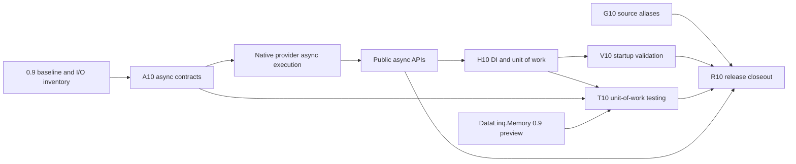

> [!WARNING]
> This is an implementation plan for a future release. It is not documentation of shipped DataLinq behavior.

# DataLinq 0.10 Implementation Roadmap

**Status:** Accepted.

**Target release:** 0.10.

**Last reviewed:** 2026-08-25.

**Prerequisite:** DataLinq 0.9.0 is published and its backend-neutral read, scalar/provider-value, UUID, Memory preview, and SQL mutable-lifecycle boundaries remain the baseline.

## Release Thesis

> Make DataLinq a first-class component in modern hosted .NET applications through native asynchronous and cancelable execution, explicit dependency-injection and unit-of-work lifetimes, opt-in startup schema validation, and first-class database-free testing support.

The release is successful when an ordinary ASP.NET Core or Generic Host application can register DataLinq, perform supported reads and writes through honest async APIs, propagate cancellation to the provider, validate schema at startup under an explicit policy, and test application behavior without constructing invalid runtime mocks or pretending that Memory proves SQL-provider semantics.

## Scope Policy

Every workstream in this document is required. There is no stretch-goal section and no automatic rule that completed work creates room for another feature.

Adding scope requires all of the following before implementation:

1. an explicit roadmap change
2. an owner and dependency placement in the [implementation order](Implementation%20Order%20and%20Integration%20Plan.md)
3. focused and release-level exit evidence in the [release evidence plan](Release%20Evidence%20and%20Closeout%20Implementation%20Plan.md)
4. an updated non-goal boundary where the addition changes a later program

## Required Workstreams

### A10: Native Async And Cancellation

Durable design source: [Async and Lazy Loading](../../query-and-runtime/Async%20and%20Lazy%20Loading.md).

Required contract:

- provider async APIs for SQLite, MySQL, and MariaDB, with native asynchronous I/O only where the underlying provider genuinely supports it and explicit SQLite limitations where it does not
- async execution for supported query terminals, sequence/scalar materialization, explicit relation loads, mutations, and transaction operations
- `CancellationToken` accepted at meaningful public I/O boundaries and propagated to database commands
- cancellation distinguished from timeout, provider failure, rollback failure, and uncertain commit outcome
- sync/async parity for query results, conversion, cache behavior, invalidation, logging, metrics, and transaction terminal states
- synchronous APIs retained as real synchronous implementations rather than sync-over-async wrappers

Acceptance summary:

- representative sync and async operations produce the same values and telemetry shape
- cancellation before dispatch, during provider execution, and during multi-step DataLinq orchestration has deterministic behavior
- no provider call that offers a native async equivalent is accidentally routed through `Task.Run`
- no async API captures mutable query invocation values after the existing snapshot boundary

Explicit non-goals:

- awaitable entities
- automatic lazy loading
- synchronous property access that performs hidden I/O
- async APIs that only wrap synchronous provider calls
- general backend plugin APIs

### H10: Dependency Injection, Hosting, And Unit Of Work

Durable design source: [Dependency Injection and Hosting Integration](../../architecture/Dependency%20Injection%20and%20Hosting%20Integration.md).

Required contract:

- a deliberate host-integration package boundary
- service registration for generated database models and current providers
- read access separated from explicit mutable unit-of-work ownership
- an explicit unit-of-work factory that owns transaction begin, commit, rollback, cancellation, disposal, and terminal-state reporting
- documented singleton/scoped/transient ownership for provider state, generated roots, connections, transactions, units of work, and hosted services
- Generic Host logging integration without a hard dependency on ASP.NET Core in the first package
- deterministic shutdown and disposal behavior

Acceptance summary:

- an ASP.NET Core test host and a worker-style Generic Host can resolve read services and execute one explicit unit of work
- concurrent scopes do not share transaction state accidentally
- failed commit, cancellation, rollback failure, and disposal paths preserve the existing mutable-instance trust rules
- application shutdown disposes owned resources exactly once

Explicit non-goals:

- implicit ambient transactions or an `AsyncLocal` session
- automatic transaction creation for ordinary reads
- automatic migrations at startup
- named/keyed database registrations
- XAML-framework-specific packages

### V10: Startup Schema Validation

Durable design source: [Schema Validation Hooks](../../providers-and-features/Schema%20Validation%20Hooks.md).

Required contract:

- opt-in startup validation over registered targets
- explicit fail-fast, warning-only, and disabled policies
- reuse of current provider metadata readers, schema comparer, structured differences, and diagnostics
- cancellation and timeout support aligned with A10
- clear outcomes for missing secrets, connectivity, metadata read, drift, unsupported differences, and cancellation
- structured logging without emitted connection secrets

Acceptance summary:

- a configured host can fail startup on actionable drift
- warning-only policy reports the same structured differences and continues
- disabled policy performs no database access
- multiple registered validation targets have deterministic ordering and failure aggregation
- validation never generates or applies a migration

Explicit non-goals:

- schema repair
- automatic migration application
- MSBuild/build-time validation
- source-generator database access
- interactive secret prompting during non-interactive startup

### T10: Application Testing Support

Durable design source: [Model Testing and Mocking Support](../../testing/Model%20Testing%20and%20Mocking%20Support.md).

Required contract:

- metadata-aware immutable builders with valid row/table/key identity
- collection and reference relation doubles that implement their full supported interfaces
- relation graph builders that use DataLinq relation metadata rather than hand-wired property substitution
- fixture construction and registration over the real `DataLinq.Memory` capability set
- fake unit-of-work behavior derived from H10, including writes, commit/rollback/disposal recording, and failure injection
- DI replacement helpers with distinct names for Memory-backed tests and SQLite-in-memory provider tests
- deterministic IDs, clocks, defaults, and reset behavior where those values are owned by the testing surface

Acceptance summary:

- application code can test scalar immutable behavior and relation graphs without a live database
- primary keys, equality, `GetValues()`, and `Mutate()` behave like real generated immutable instances
- relation direction, missing keys, duplicate keys, nullable references, and composite keys have focused diagnostics
- Memory-backed tests expose Memory capability failures rather than broadening query behavior
- provider-backed tests remain the documented authority for SQL translation, physical types, defaults, transactions, and provider behavior

Explicit non-goals:

- a second LINQ-to-Objects query provider
- mocks that bypass metadata or key invariants
- simulated provider transaction semantics
- generated test-shape interfaces before builders demonstrate a concrete need
- a broad query-assertion DSL in the baseline

### G10: Source Type Alias Correctness

Issue source: [#93](https://github.com/bazer/DataLinq/issues/93).

Required contract:

- semantically resolve model property types from the active compilation
- emit stable resolvable type identities rather than file-local alias spelling
- derive nullability and reference/value classification from resolved symbols
- fail syntax-only paths with a focused unsupported-alias diagnostic where semantic resolution is unavailable
- include alias targets in incremental generator dependencies
- retain scalar-converter, keyword, qualified built-in, enum, nullable, and custom-type generation behavior

Acceptance summary:

- alias-backed model declarations compile without leaking file-local aliases into generated files
- changing only an alias target recomputes affected generated output in the same incremental driver
- aliases cannot make a value type nullable or a reference type non-nullable contrary to the resolved contract

Explicit non-goal: a broad generator or metadata architecture rewrite unrelated to semantic type identity.

### R10: Release Evidence And Closeout

Owner: [0.10 Release Evidence and Closeout Implementation Plan](Release%20Evidence%20and%20Closeout%20Implementation%20Plan.md).

Required contract:

- establish the 0.9 before-state before changing shared runtime paths
- add focused workstream gates as implementation lands
- validate the full provider/test/package/API/compatibility/documentation graph before release
- compare benchmarks and telemetry against a same-runner baseline
- produce one frozen-candidate manifest and explicit go/no-go decision
- stop before publication unless the maintainer separately authorizes publishing

## Dependency Graph

G10 may proceed independently after the baseline is frozen. Relation doubles and immutable builders may start while H10 is being designed, but fake unit-of-work and DI replacement helpers cannot freeze before the real H10 contract.

## Release Exit Criteria

DataLinq 0.10 is ready for maintainer release review only when:

- every A10, H10, V10, T10, and G10 acceptance summary is backed by tests
- sync behavior remains compatible or every approved compatibility change is documented and dispositioned
- SQLite, MySQL, and MariaDB provider matrices pass for current supported targets
- cancellation and terminal-state tests cover provider and orchestration boundaries
- package inspection and external consumer smoke cover every new package and supported target framework
- ApiCompat has no undispositioned break
- applicable Native AOT, trim, WebAssembly, and browser gates are valid for the final package graph
- the benchmark comparison has complete artifacts, stable telemetry, and explicit disposition of every material change
- public docs describe only the final verified release boundary
- no item from the explicit non-goal list entered implementation without an approved roadmap revision

## Explicit Non-Goals

- [#65 atomic conditional updates](https://github.com/bazer/DataLinq/issues/65), set-based mutation, relation-aware mutation, batching, bulk execution, and audit events
- external-tool/Studio worker protocols and stable inspection documents
- MSBuild/build-time schema validation
- migration authoring, execution, history, locking, recovery, and repair
- Memory mutation, transactions, persistence, logs, replay, compaction, and browser storage
- broad join/grouping expansion
- automatic query-plan or result-set caching
- generated typed keys, JSON query translation, general observability protocols, PostgreSQL, CDC, and DataLinq.Store execution

These are not stretch goals. They remain outside 0.10 until the roadmap is explicitly revised.

## Links

- [Public Roadmap](../../../Roadmap.md)
- [Development Roadmap](../../Roadmap.md)
- [0.10 Implementation Order and Integration Plan](Implementation%20Order%20and%20Integration%20Plan.md)
- [0.10 Release Evidence and Closeout Implementation Plan](Release%20Evidence%20and%20Closeout%20Implementation%20Plan.md)
- [DataLinq 0.9 Implementation Roadmap](../v0.9/README.md)
