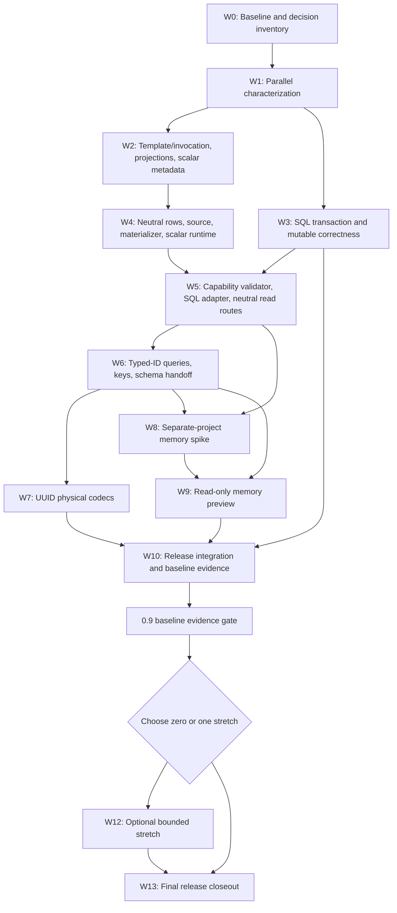

> [!WARNING]
> This document is roadmap implementation material for the DataLinq 0.9 development line. It is not normative product documentation and must not be treated as a shipped support claim.

# 0.9 Implementation Order And Integration Plan

**Status:** Implementation in progress. W0-W2 are complete; W3 and W4 are active on their gated lanes, and bounded `F6-A` integral-canonical primary-key/cache-cold routing is green under the W3 core-fault gate without making W5 complete. Bounded `SC-2` SQL projection slices are also green for root and joined converter-backed `ScalarMember` results, converter-backed column members in aliased anonymous and explicit-constructor `SqlRow` projections, and model-compatible converter-backed direct `GroupedAggregate` keys without completing W4 or W5. Single-source integral-keyed `ComputedRowLocal` `NewArray` recipe evidence is also green under `AotStrict`. Primitive-key `JoinedRowLocal` `NewArray` SQL execution preserves converter-backed joined-source values while retaining the intentional `SqlOnlyCompatibility` fence. Converter-backed `Sum`/`Min`/`Max`/`Average` selectors now fail translation before SQL until the converter contract grows explicit aggregate-preserving capability metadata; selectorless count/existence operations remain available.

**Target release:** DataLinq 0.9.

**Created:** 2026-07-10.

**Last reviewed:** 2026-07-13.

**Authority:** This document owns the exact cross-workstream implementation order, integration points, artifact ownership, and release gates for 0.9. Feature plans own behavior inside their assigned workstreams. If a feature plan's local ordering conflicts with this release-wide sequence, this document wins until the conflict is explicitly reconciled.

## Purpose

The individual 0.9 plans describe the intended features well, but several of them necessarily touch the same runtime seams:

- query execution and scalar conversion both need the canonical provider-value row boundary
- the query foundation, scalar conversion, and transaction work all touch cache and relation loading
- the memory preview consumes the foundation, scalar, UUID, generated-model, packaging, and constrained-runtime work
- baseline evidence must be green before a stretch is selected, while final evidence must be rerun after any selected stretch

This plan turns those overlapping designs into one executable path from the first characterization test to release closeout. It deliberately does not invent another global phase-number history. The wave and slice IDs below are local to 0.9.

## Release Plan Catalog

| Plan | Release role | Entry point in this sequence | Completion point |
| --- | --- | --- | --- |
| [DataLinq 0.9 Implementation Roadmap](README.md) | Release thesis, baseline scope, stretch filter, and claims | All waves | Final closeout |
| [Query Backend And Execution Foundation](Query%20Backend%20and%20Execution%20Foundation%20Implementation%20Plan.md) | Self-contained requests, neutral reads/materialization, capability validation, SQL adapter, and vertical spike | Waves 0-5 and 8 | Memory spike gate |
| [Scalar Converters And Typed IDs](Scalar%20Converters%20and%20Typed%20IDs%20Implementation%20Plan.md) | Model-to-canonical-provider conversion and typed-ID behavior | Waves 1-2, 4, and 6 | Scalar/typed-ID gate |
| [Scalar Converter Support](../../metadata-and-generation/Scalar%20Converter%20Support.md) | Durable scalar-converter design | Consulted by scalar waves | Updated to match implementation |
| [UUID Storage Format Support](../../providers-and-features/UUID%20Storage%20Format%20Support.md) | Canonical `Guid` to column-specific physical UUID codecs | Preparatory work in Waves 2/4; completion in Wave 7 | UUID provider gate |
| [SQL Transaction And Mutable Lifecycle](SQL%20Transaction%20and%20Mutable%20Lifecycle%20Implementation%20Plan.md) | Integrated transaction/cache/mutable execution plan | Waves 1 and 3 | SQL transaction-correctness gate |
| [SQLite Transaction Isolation Alignment](../../providers-and-features/SQLite%20Transaction%20Isolation%20Alignment.md) | Committed visibility and pending-versus-committed cache state | Waves 1 and 3 | SQL transaction-correctness gate |
| [Mutable Instance Lifecycle](../../query-and-runtime/Mutable%20Instance%20Lifecycle.md) | Mutable baseline provenance and reuse guards | Waves 1 and 3 | SQL transaction-correctness gate |
| [Read-Only Memory Backend](In-Memory%20Database%20Implementation%20Plan.md) | Separate memory project, generated store, query subset, semantics, and preview evidence | Waves 8-10 | Baseline evidence gate |
| [Memory Backend Architecture](../../backends/memory/Architecture.md) | Durable memory design beyond the release filter | Consulted by memory waves | Not a 0.9 scope-expansion authority |
| [Optional Join Expansion](Join%20and%20Grouping%20Continuation%20Implementation%20Plan.md) | One possible late stretch | Wave 12 only | Final evidence gate if selected |
| [Optional Memory JSON Snapshot](Memory%20JSON%20Persistence%20Implementation%20Plan.md) | The other possible late stretch | Wave 12 only | Final evidence gate if selected |
| [Release Evidence And Closeout](Release%20Evidence%20and%20Closeout%20Implementation%20Plan.md) | Evidence harness, package/API/upgrade checks, final matrix, documentation, and closeout | Waves 0, 8-10, and 13 | Ready-to-publish gate |

This document owns cross-plan ordering. The release-evidence plan owns solution and test-suite registration, preview-package promotion, package inspection, memory-specific AOT/WebAssembly smokes, benchmarks, final documentation, and release-evidence commands.

## Fixed Ownership Map

An artifact may have several consumers, but it must have one semantic owner. The following split is fixed for 0.9.

| Concern or artifact | Semantic owner | Consumers and constraints |
| --- | --- | --- |
| Structural query template, binding declarations, invocation values, specialization identity | Query foundation | SQL and memory consume it; neither may hide runtime values in structural nodes |
| Self-contained projection recipes and projection disposition | Query foundation | SQL may advertise more recipes than memory; neither receives the original expression after parsing |
| Query requirement extraction, capability vocabulary, validator, and capability diagnostics | Query foundation | SQL and memory declare dispositions against one vocabulary |
| Internal canonical provider-value row-buffer type and layout invariants | Query foundation | Scalar conversion populates/materializes it; memory stores instances of it but does not redefine it |
| Neutral read source, row loader, execution request, backend result ownership, and shared model materializer | Query foundation | SQL and memory adapt to these contracts; SQL-only members remain outside them |
| Model value to canonical provider CLR value conversion | Scalar workstream | Used by SQL reads/writes, keys, queries, memory seed/import, and materialization |
| Canonical provider equality, hashing, nullability, and key normalization | Scalar workstream | `KeyFactory`, cache identity, relations, joins, and memory indexes consume one rule set |
| Canonical `Guid` to provider/column physical UUID representation | UUID workstream | SQL providers only; memory rows remain canonical `Guid` values |
| SQL capability implementation, SQL rendering, command execution, reader ownership, and SQL telemetry | Query foundation's SQL adapter slice | Existing provider code is wrapped and migrated, not rewritten casually |
| Neutral primary-key, cache-cold, and relation read routing | Query foundation | Must preserve transaction semantics established by the correctness lane |
| Pending versus committed cache publication, transaction-local rows/tombstones, and relation notifications | SQL transaction-correctness lane | The foundation must not change publication semantics while neutralizing read routes |
| Mutable lifecycle/provenance state, touched-mutable tracking, promotion, and invalidation | Mutable lifecycle workstream | Existing SQL providers only in 0.9; no provider-neutral mutation contract is implied |
| SQLite isolation, WAL/private-cache defaults, and SQLite-specific tests | SQLite alignment workstream | Change isolation only after the pending overlay is working |
| Memory table state, seed ingestion, primary-key indexes, scans, sorting, and query evaluator | Memory workstream | Contains shared provider-value buffers and consumes shared normalization/materialization |
| `DataLinq.Memory` project/package surface and `DataLinq.Tests.Memory` test project | Memory workstream until spike gate; release integration after promotion | Both projects exist for the spike; memory is non-packable until promotion; tests are never packable |
| Package scripts, package inspection, compatibility target catalog, smoke hosts, benchmark registration, and final evidence | This integration plan | Must prove the memory route directly rather than inheriting SQLite evidence |

### Shared-file rules

The ownership map is especially important around these current hotspots:

- `Linq/Planning/*`, `ExpressionPlanQueryable`, and `QueryPlanSqlBuilder`: foundation first; scalar and UUID changes target the final adapter/value seams
- `RowData`, `InstanceFactory`, generated immutable factories, and generated database-root construction: foundation owns shape; scalar owns conversion behavior
- `KeyFactory` and canonical key construction: scalar owns behavior; foundation and memory call it
- `TableCache` row loading and lookup: foundation owns neutral routing
- `TableCache` transaction rows, invalidation, and notifications plus `State` and `Transaction`: SQL transaction-correctness lane owns publication semantics
- provider readers/writers: scalar owns model/canonical conversion; UUID owns canonical/physical `Guid` conversion
- `publish-nuget.ps1`, package-report presets, compatibility targets, smoke projects, and benchmark catalogs: release integration owns additions after the relevant feature gate

Do not solve a merge conflict by duplicating behavior into a second helper owned by another workstream. Resolve the ownership question and keep one path.

## Decisions And Gates

Some decisions are implementation outputs rather than reasons to delay all work. They still have explicit deadlines.

### D0: Current-behavior baseline

Before structural refactoring:

- record focused query-plan, SQL, projection, primary-key shortcut, cache-cold, relation-load, telemetry, and disposal behavior
- record transaction visibility, rollback/disposal, mutable reuse, and read-only transaction behavior across active providers
- record current build, test, package, constrained-runtime, and benchmark evidence relevant to changed paths
- distinguish intended behavior from a private object-layout snapshot

Gate: implementation may begin only when regressions in every execution route being moved would be observable.

### D1: Projection disposition

Before removing the original expression from executor APIs, classify every current `QueryPlanProjectionKind` and retained execution route as exactly one of:

1. direct plan value or SQL-backed row projection
2. self-contained, AOT-safe local projection recipe
3. self-contained SQL-only compatibility recipe rejected by memory capabilities
4. unsupported with an early, focused diagnostic

Gate: no projection kind may continue to recover executable behavior by re-walking the original expression.

### D2: Scalar conversion contract

For 0.9:

- converter instances are pure/stateless from the runtime's perspective; dependency-injected or request-scoped converters are deferred
- runtime conversion failure is a contextual exception; metadata/schema validation reports structured diagnostics before runtime where possible
- direct typed-ID equality and membership are supported; arbitrary `.Value` or other member unwrapping is not part of scalar conversion
- a new typed direct-primary-key public overload is not required for correctness; existing dynamic/fallback key entry points must normalize correctly first
- canonical provider values have one documented equality and hashing contract before converted keys or memory indexes ship

Gate: `SC-1` metadata tests prove resolved converter identity, direction, types, nullability, lifetime, and provider-codec handoff.

### D3: UUID Public And Metadata Shape

The 0.9 API decision is resolved:

- use `GuidStorageAttribute` and `GuidStorageFormat`
- absence of an attribute selects DataLinq's deterministic provider default
- `ProviderDefault` is resolution-only metadata, not a public enum value
- compatibility defaults remain provider/physical-column specific
- ambiguous `BINARY(16)` or SQLite `BLOB` receives a focused diagnostic
- string-only legacy `SqlQuery` binding is outside automatic ambiguous-binary normalization unless it uses a column-aware route

The already accepted release rules remain fixed: MySQL compatibility data is not silently reinterpreted, time-swap is deferred, and connector-wide `GuidFormat` does not define column meaning.

Gate: known UUID strings and bytes have approved test vectors for every in-scope format before provider integration.

### D4: Transaction/Cache Contract

Current code already contains transaction-scoped rows/notifications and provider-first commit publication. `TX-0` must characterize and preserve that baseline before deciding that new overlay APIs are needed. Before SQLite dirty-read defaults are removed, prove:

- successful writes enter transaction-local pending state
- outsiders keep committed cache/relation views until provider commit succeeds
- commit publishes once after provider commit
- rollback and open-transaction disposal discard pending state without publishing it
- touched mutables are promoted or invalidated at the same boundary
- read-only transactions reject writes

Gate: provider-independent cache, relation-notification, and mutable-lifecycle tests pass before the SQLite isolation change; the complete committed-visibility matrix passes afterward.

The gate is staged: cache-publication, relation-notification, mutable-provenance, and read-only-write tests must pass before the SQLite setting changes. Cross-connection committed-visibility tests may remain an explicit expected failure under the old dirty-read configuration, but must become green when the final SQLite isolation step lands.

### D5: Memory project and package boundary

The spike uses two separate projects from its first implementation commit:

- `src/DataLinq.Memory/DataLinq.Memory.csproj`
- `src/DataLinq.Tests.Memory/DataLinq.Tests.Memory.csproj`

Rules:

- `DataLinq.Memory` starts with `IsPackable=false`.
- `DataLinq.Tests.Memory` is always non-packable.
- memory implementation is not placed in the core `DataLinq` assembly as a shortcut.
- the spike projects may reference internal contracts through the narrowest deliberate friend/internal mechanism needed while those contracts remain experimental.
- package scripts and public package-report presets do not include memory before promotion.

Promotion gate:

- one self-contained request executes through SQL and memory
- memory needs no SQL-shaped stubs and never receives the original expression
- generated startup, canonical rows, shared materialization, primary-key lookup, filter, ordering/paging, scalar projection, result operator, cancellation, and unsupported diagnostics work
- strict AOT and WebAssembly execute the memory path without SQLite/native payloads, `Expression.Compile()`, or runtime code generation
- dependencies and public construction surface have been reviewed

If the gate passes, set `DataLinq.Memory` packable as an experimental preview and add it to release tooling. If it fails, stop or narrow the preview. Do not move the implementation into core, fake the missing seams, or weaken SQL compatibility to preserve the roadmap item.

### D6: Memory semantic matrix

Before advertising each memory operator, record its null, string, numeric, date/time, enum, typed-ID, `Guid`, membership, ordering, and result-operator semantics. A narrower set is acceptable.

Gate: capability metadata, behavior tests, and public support wording agree exactly. No LINQ-to-Objects fallback fills gaps.

### D7: Performance evidence policy

Before adapter migration measurements, record the existing SQL allocation/latency baseline and the threshold that triggers profiling or redesign. The decision must account for benchmark noise and must not turn one noisy timing run into a release claim.

Gate: SQL overhead is understood and accepted; memory startup, primary-key, and simple-scan allocation baselines exist without a plan-cache performance claim.

### D8: Stretch selection

Choose zero or one stretch only after the baseline evidence gate is green. The default choice is no stretch.

Gate: the selected candidate fits without changing a baseline contract, has a bounded support matrix, and can rerun provider and constrained-runtime evidence before release. Otherwise, select none.

## Authoritative Dependency Graph

The graph deliberately distinguishes the primitive memory spike from the public preview. The spike waits for the minimum neutral row/conversion and SQL-adapter seams. The preview waits for typed-ID/canonical-value behavior, while UUID physical codecs may finish in parallel because memory stores canonical `Guid`; UUID remains a required baseline release gate before W10/W11 close.

## Exact Implementation Waves

### W0: Baseline And Release Harness Inventory

Order:

1. Run and record the current focused unit/compliance/provider baseline.
2. Record current package, compatibility, AOT, WebAssembly, and benchmark commands and artifacts.
3. Inventory release-tool assumptions that must eventually learn about `DataLinq.Memory`.
4. Create the projection disposition, execution-route, and shared-artifact ownership checklists.
5. Record decisions D0 through D7 as resolved, deferred with a deadline, or blocking only their named wave.

Exit:

- no product behavior has changed
- every later wave has a reproducible before-state
- unresolved decisions have a named owner and latest resolution wave

### W1: Parallel Characterization

These lanes may proceed concurrently because they add evidence rather than competing runtime implementations.

#### W1-Q: Query execution characterization

- template/debug snapshots for every retained projection/result family
- scalar, null, and local-sequence binding freeze/isolation tests
- representative SQL snapshots and provider behavior
- terminal primary-key shortcut tests
- cache-cold, relation-load, telemetry, reader/command disposal, and transaction-root parity tests
- catalog every route that receives the original expression or constructs `QueryPlanSqlBuilder`

#### W1-T: Transaction and mutable characterization

- pending versus outside visibility for insert/update/delete
- relation behavior before commit, after commit, and after rollback
- repeated mutable save, cross-transaction reuse, commit reuse, rollback/disposal invalidation, deletion, primary-key changes, failed writes, and read-only writes
- temporary file-backed SQLite/WAL lane for concurrency semantics

#### W1-V: Value and UUID vectors

- primitive identity conversion baselines
- typed `int`, `long`, `Guid`, and `string` fixture types
- canonical provider equality/hash cases
- UUID known string/byte vectors for every in-scope physical format
- current schema-validation and diff behavior

Merge gate:

- characterization changes merge before production refactors
- deliberately failing target behavior is either represented as a focused skipped/expected-failure test or documented without making the main suite permanently red

### W2: Self-Contained Query Shape And Scalar Metadata

Merge in this order:

1. `SC-1` scalar contract, attributes/registrations, and resolved metadata without changing runtime value behavior.
2. Structural binding declarations and invocation-value split.
3. Explicit null/cardinality specialization validation.
4. Projection disposition matrix completion.
5. Self-contained projection recipes or SQL-only compatibility recipes.
6. Executor API removal of the original expression for every retained route.

Safe parallelism:

- scalar metadata/source-generator work may run beside template/invocation work while both avoid runtime row/cache files
- projection implementation begins only after the template/invocation shape is stable

Exit:

- structural templates contain no invocation values
- supported execution no longer needs the original expression
- SQL behavior remains green through the existing execution path
- scalar metadata can resolve model type, canonical provider type, and converter identity

### W3: Existing SQL Transaction And Mutable Correctness

This wave may overlap W2, but it must merge before W5 neutralizes cache and relation reads.

Merge in this order:

1. Rebaseline existing transaction rows/tombstones, scoped notifications, provider-first commit publication, and rollback/disposal cleanup; add APIs only for evidenced gaps.
2. Add mutable lifecycle state with stable provider-instance and transaction ownership.
3. Add write guards for read-only transactions, cross-provider/cross-transaction reuse, invalid/deleted mutables, and ordinary primary-key mutation.
4. Track touched mutables and support repeated reuse inside the same owning transaction.
5. Make the successful-change authority private and append only fully finalized mutations; poison the managed transaction after post-preflight statement, generated-value, pending-cache, authoritative-hydration, or lifecycle-finalization failure so only rollback/disposal remains legal.
6. Promote mutable baselines only after provider commit and local publication; partition post-commit publication failure without pretending the database rolled back.
7. Invalidate touched mutables after rollback or open-transaction disposal, even when provider cleanup fails.
8. Classify provider commit failure as outcome-unknown unless provider evidence proves otherwise, and block later managed reuse.
9. Define attached-transaction completion: once DataLinq mutables are touched, completion must be observed through the wrapper or their baselines become invalid.
10. Retune transaction/cache/relation compliance tests across SQLite, MySQL, and MariaDB.
11. Stop enabling SQLite dirty reads.
12. Remove shared cache from normal file-backed SQLite defaults while retaining the explicit named in-memory exception.
13. Preserve/configure `DefaultTimeout`, add file-backed WAL contention evidence, and defer automatic retry policy.
14. Update transaction, caching/mutation, SQLite, and troubleshooting documentation.

Exit:

- existing SQL providers pass the accepted mutable lifecycle matrix
- SQLite uses committed visibility without claiming literal MySQL/MariaDB `ReadCommitted` equivalence
- pending state cannot reach global caches or outside relation subscribers before provider commit

Progress through 2026-07-12: `TX-0` is already closed by W1 characterization. W3 has the complete `ML-1` provenance contract and the executable `ML-2` pre-execution guard slice. Existing mutables capture exact provider origin, transaction-local provenance uses an opaque exact-transaction token, and authoritative hydration/delete establish transaction-local state. Generated mutables inherit the single internal lifecycle holder without per-model fields or a public lifecycle API. Every supported model-mutation route rejects read-only/terminal wrappers, invalid/deleted or wrong-owner mutables, unsupported row shapes, primary-key drift, and foreign metadata before command construction; no-change, callback/generated, immutable-delete, and public `StateChange` routes have focused backstops. `TX-1A` records successfully transitioned lifecycle mutables by reference identity. `TX-1B` owns a private collection of only fully finalized mutations; public `Changes` is detached and public `StateChange.ExecuteQuery(...)` enters the same path. `TX-2A` is green for confirmed-success owned transactions: provider commit, global publication, transaction-cache cleanup, touched promotion, token commit, registry clearing, then deferred wrapper `Committed`. Bounded `TX-2B` recovers known-committed publication/local-cleanup failure with `CommittedStateFinalizationFailed` and provider-wide cache clearing. Bounded `TX-3` is green for managed rollback/open disposal with provider-first completion, accurate terminal ownership, scoped cleanup, invalidation, and deferred finalized status. Bounded `TX-4A` poisons post-preflight mutation-pipeline failures. Adjacent managed commit-call recovery preserves a throwing provider exception, records permanent `CommitOutcomeUnknown`, invalidates/clears touched and scoped state, structurally evicts provider-wide caches before recovery notifications, gates managed reuse, and permits only status-compatible rollback or disposal. Bounded provider-outcome evidence now proves the same recovery rematerializes an actual rollback after a pre-commit throw and an actual native commit followed by a throw across current SQLite, MySQL, and MariaDB targets, without claiming DataLinq can infer either result at runtime. `TX-5A` proves active attached wrapper-only commit promotion/reuse and rollback invalidation across every provider; provider adapters reject unavailable underlying completion instead of manufacturing status, so wrapper commit after external commit/rollback enters `CommitOutcomeUnknown` recovery without guessed publication. `TX-5B` detects the inactive original handle before managed read/write/fallback/dispose, records permanent `ExternalCompletionUnknown`, performs provider-wide recovery for externally completed wrapper rollback/disposal, and proves fresh rematerialization of actual external commit/rollback results across every provider. Shipped guidance and API remarks now define the wrapper-only ownership transfer, raw-write and low-level escape limitations, and attached connection lifetime, completing `TX-5`. Mutation/cache-callback managed reentrancy is rejected and completion entry points are serialized. This is still not the W3 exit. Raw low-level escape prevention, arbitrary local-cleanup fault injection, connector-native/full provider commit-fault evidence, and full concurrency semantics remain open. The green `ML-1` through bounded `TX-4` core lane permits `F6-A` only for primary-key shapes whose canonical provider CLR components are integral; string/CHAR, `Guid`/binary, other collation- or codec-sensitive keys, relation/index loading, and broader F6 routing remain on the legacy path or open behind their own gates.

SQLite `SQ-1`, `SQ-2`, and bounded `SQ-3` are green: all DataLinq-owned access paths reset `read_uncommitted=0`, owned transactions are deferred serializable, attached connections keep caller policy, private-cache WAL preserves committed insert/update/delete visibility, explicit shared cache locks rather than returning pending rows, generated file-backed connections omit `Cache`, named memory keeps shared cache, connection-default and command-level timeouts remain effective, provider busy details survive, failed command telemetry records the operation, and the complete SQLite compliance lane passes at 746/746. Automatic retry remains out of scope.

### W4: Neutral Rows, Sources, Materialization, And Scalar Runtime

Merge in this order:

1. Add the shared internal canonical provider-value row-buffer type and layout validation.
2. Add a trusted internal value-array/model-row factory while preserving public model-valued `RowData`.
3. Add the shared provider-to-model materializer and neutral cache/metrics access it requires.
4. Add neutral read-source and row-loader contracts with no SQL commands, connections, or transactions.
5. Change generated database-root and immutable-factory construction to accept the neutral read shape without a concrete `DataSourceAccess` cast.
6. Implement `SC-2` reader/writer/materialization/default-hydration conversion through the shared buffer.
7. Implement `SC-3` canonical equality/hashing plus dynamic/fallback primary, composite, foreign, relation, and cache-key normalization.
8. Preserve existing primitive behavior through identity mappings.

Exit:

- a test source supplies a canonical row and receives the normal generated immutable model
- model values remain visible through public row/model APIs
- SQL physical values do not leak into canonical rows
- dynamic keys and cache/relation identity have one canonical normalization path
- memory will not need a fake data reader or SQL-shaped source

### W5: Capability Validation, SQL Adapter, And Neutral Read Routing

Merge in this order:

1. Define the finite requirement/capability vocabulary from actual plan nodes.
2. Add exhaustive requirement extraction and invocation-sensitive validation.
3. Add SQL capability declarations matching retained behavior.
4. Wrap SQL rendering, command execution, result ownership, and materialization behind the SQL backend.
5. Migrate result families one at a time: entity sequence, scalar/aggregate, direct projection row, then retained local projection recipes.
6. Preserve parameterization, telemetry, transaction attribution, cancellation checks, and disposal after every family.
7. Route terminal primary-key optimization through the validated neutral source/backend path.
8. Route cache-cold and relation loads through neutral row requests while preserving the W3 pending/committed rules.
9. Remove temporary duplicate execution routes.

Safe parallelism:

- capability vocabulary/tests may proceed beside initial SQL-adapter scaffolding
- only one lane at a time owns an individual result family
- each cache/relation read family starts only after its applicable W3 fault/terminal-state gate and the scalar key-normalization contract are stable

Exit:

- every documented expression-query SQL route selects the SQL backend after validation
- no supported expression-query path constructs the SQL builder outside the adapter
- neutral read contracts retain correct transaction, cache, relation, telemetry, and disposal behavior

### W6: Scalar And Typed-ID Completion

Merge in this order:

1. Complete `SC-3` provider coverage for the canonical key path introduced in W4.
2. `SC-4` direct equality, local membership, supported equality-membership, and existing explicit join-key normalization.
3. Reject unsupported typed-ID member/structured value-object predicates before execution.
4. `SC-5` schema validation, diffing, provider type inference, and physical-codec handoff.
5. Run read/write/query/key/relation/default/schema tests for typed `int`, `long`, `Guid`, and `string` IDs across active SQL providers.

Progress on 2026-07-11: step 2 is partially implemented for direct equality/inequality and the existing local `Contains(...)`/equality-`Any(...)` plan. Canonical query values and physical SQL parameters now have distinct operand views, preserving cache identity while encoding each bound value once and memoizing the operand's detached physical values. Explicit join compatibility and unsupported structured-member diagnostics remain open, so W6 is not complete.

Generated optimized typed-key accessors and typed-key generation are not part of this wave. The dynamic path must be correct first.

Exit:

- all in-scope SQL paths use canonical provider values consistently
- cache identity does not depend on wrapper reference identity or provider wire bytes
- the UUID work has one completed physical-codec handoff

### W7: UUID Runtime Correctness

Known-value vectors, bounded `UUID-1A` declaration/codec primitives, and `UUID-1B` immutable provider-keyed resolution are green after `SC-1`; `UUID-2` provider integration still waits for `SC-2`. Wave 7 is the integration/completion checkpoint after the scalar key/query/schema prerequisites are ready. Execute and close the UUID plan in its granular dependency order:

1. `UUID-1A`: declaration vocabulary, intrinsic validation, lossless generation round-trips, and known-value codec primitives. Complete.
2. `UUID-1B`: provider-keyed resolved metadata, compatibility defaults, and physical compatibility diagnostics. Complete.
3. `UUID-2`: provider reads, writes, mutations, and generated/default hydration.
4. `UUID-3`: equality, nullable equality, membership, keys, cache, relations, update/delete predicates, and column-aware explicit queries.
5. `UUID-4`: static defaults, UUID-version diagnostics, validation, and semantic diffing.
6. `UUID-5`: provider evidence and documentation.

Exit:

- supported MySQL/MariaDB UUID paths work without relying on connector `GuidFormat`
- existing little-endian MySQL data remains compatible
- MariaDB native UUID and SQLite text/explicit binary paths have evidence
- memory-facing canonical values remain `Guid`

### W8: Separate-Project Vertical Memory Spike

Order:

1. Add non-packable `DataLinq.Memory` and `DataLinq.Tests.Memory` projects to the solution.
2. Give the test project a focused memory suite; do not add memory blindly to SQL-provider matrices.
3. Implement the smallest store over shared canonical provider-value buffers.
4. Implement primary-key lookup and one bounded scan path.
5. Add minimal memory capabilities and pre-execution validation.
6. Execute captured equality, ordering plus `Take`, entity materialization, direct scalar projection, and `Any` or `Count`.
7. Add cancellation and deterministic unsupported join/grouping/projection diagnostics.
8. Run the same request shapes through SQLite and memory for the shared semantic subset.
9. Add typed-ID and canonical-`Guid` cases after W6/W7 are green.
10. Execute the memory route in Native AOT, trimmed, WebAssembly no-AOT, and WebAssembly AOT smoke hosts without SQLite.

Exit is decision D5's promotion gate. Do not expand the operator matrix before the architecture passes it.

### W9: Read-Only Memory Preview

If the spike gate passes:

1. Promote `DataLinq.Memory` to an experimental preview package and keep `DataLinq.Tests.Memory` non-packable.
2. Complete `M0` seed validation, isolated stores, primary-key indexes, and generated startup.
3. Complete `M1` only for the agreed capability matrix.
4. Complete D6 and `M2` semantics/materialization tests before documenting each operator.
5. Ensure mutation, transaction, relation navigation, raw SQL, unsupported projections, joins, and grouping fail through precise capability diagnostics.
6. Keep memory state distinct from `TableCache` materialized identity so eviction cannot delete database rows.

If the spike gate fails, stop here, keep `DataLinq.Memory` non-packable, and re-scope the release claim. The baseline roadmap must then be revised explicitly.

### W10: Release Integration And Baseline Evidence

After package promotion:

1. Add `DataLinq.Memory` to the pack-only package set and package-report expected/runtime sets.
2. Verify the package depends deliberately on core and carries no SQLite, MySQL, native runtime, Roslyn, or accidental analyzer payload.
3. Register `DataLinq.Tests.Memory` with the Testing CLI using a focused suite/alias and explicit parity policy.
4. Extend compatibility tooling with a 0.9 target set that runs the memory path directly.
5. Extend AOT, trimmed, and browser smoke hosts with seed, lookup, filtered query, ordered/paged query, projection, typed-ID/`Guid`, and unsupported-diagnostic paths.
6. Add startup, primary-key lookup, simple scan, invocation, and SQL-adapter allocation scenarios to the benchmark harness.
7. Run net8/net9/net10 build coverage and the full SQLite/MySQL/MariaDB regression set.
8. Run scalar, UUID, transaction, memory, package, banned-payload, trim, AOT, WebAssembly, allocation, and documentation evidence.
9. Update public docs and support matrices only for green behavior.

The release tooling must retain the existing SQLite constrained-runtime evidence while adding a distinct memory route. A green SQLite smoke is not evidence for memory.

### W11: Baseline Evidence Gate

The baseline is green only when:

- all required workstream exit criteria in the 0.9 roadmap pass
- full SQL-provider regressions pass
- the transaction/mutable matrix passes
- scalar and UUID provider evidence passes
- the documented memory subset passes in ordinary, strict AOT, and browser environments
- package and banned-payload reports pass
- SQL overhead and memory allocation evidence are recorded and accepted
- public API compatibility has been reviewed
- public docs and support matrices match the evidence
- no required outcome depends on a stretch

This is a go/no-go gate for stretch selection, not final release closeout.

### W12: Optional Stretch

After W11, choose one of:

- no stretch
- bounded SQL multi-inner/composite-key work in `JOIN-1` through `JOIN-3`
- manual memory JSON snapshot work in `J0` through `J2`

Rules:

- never start both candidates
- do not alter a baseline contract to make the stretch fit
- run focused evidence after every local workstream
- update the support matrix only after the candidate's complete gate passes
- cut the stretch immediately if it threatens required correctness or final evidence time

### W13: Final Release Closeout

Final closeout occurs after the stretch decision, including when the decision is no stretch.

Order:

1. Freeze feature scope and remove temporary adapters, experimental bypasses, stale flags, and unsupported public claims.
2. Rerun full unit, generators, compliance, MySQL/MariaDB, and memory suites.
3. Rerun final clean-output compatibility, banned-payload, AOT, trim, WebAssembly no-AOT, and WebAssembly AOT reports.
4. Pack all 0.9 packages locally without publishing and run the final package report.
5. Refresh the agreed benchmark histories and interpret them conservatively.
6. Review public API compatibility, target frameworks, package dependencies, XML documentation, and preview labeling.
7. Prepare the GitHub release-note draft and update affected public support matrices. `CHANGELOG.md` remains generated from published releases and is regenerated after publication, not hand-authored as pre-release evidence.
8. Build DocFX and inspect generated output for the roadmap, memory, UUID, transaction, and query-support pages.
9. Record artifact paths, exact commands, failures/retries, warning disposition, and final pass counts in the closeout record.

No package publish is part of automated closeout. Publishing remains a separate manual user action.

## Safe Parallel Lanes

Parallel work is encouraged only across non-conflicting ownership boundaries.

| Time window | Safe parallel work | Required synchronization |
| --- | --- | --- |
| W1 | Query characterization, transaction characterization, value/UUID vectors, release-tool inventory | Merge characterization before runtime refactors |
| W2 | Template/invocation work and scalar metadata/source-generation work | Freeze column metadata and binding concepts before shared materialization |
| W2-W3 | Query-shape work and SQL transaction/mutable implementation | The applicable W3 core-fault gate merges before W5 touches each cache/relation read family; bounded `F6-A` does not waive the remaining gates |
| W4 | Neutral source/materializer scaffolding and scalar conversion implementation in separate files | Foundation owns buffer/type shape; scalar owns conversion logic |
| W5 | Capability vocabulary/tests and adapter scaffolding for different result families | One owner per result family; integrate sequentially |
| W6-W7 | Scalar documentation/schema tests and UUID codec work | Follow the UUID plan's granular prerequisites; `UUID-4` validation waits for `SC-5` |
| W7-W8 | UUID physical-provider work and the primitive memory spike | Memory uses canonical `Guid`, never UUID wire bytes; final UUID-leak regressions wait for the UUID lane |
| W8 | Memory store/index work, memory capability evaluator, and constrained-runtime host wiring | All consume the same spike fixture and shared request contract |
| W9-W10 | Memory operator hardening and release-tool integration after promotion | Package/report presets change only after `IsPackable` promotion |

Unsafe parallel work includes:

- two implementations of the provider-value row buffer
- simultaneous uncoordinated edits to `TableCache` read routing and transaction publication
- UUID parameter hacks while scalar column-aware normalization is still moving
- memory-specific projection reparsing while the foundation is defining recipes
- public package wiring before the spike promotion gate
- either stretch before W11

## Merge And Integration Rules

1. **Characterization before movement.** A route is not refactored until its current supported behavior is observable.
2. **Contract before consumer.** Merge shared template, row, source, conversion, and capability contracts before SQL or memory consumers depend on them.
3. **One result family at a time.** Entity, scalar/aggregate, direct projection, and local projection SQL routes migrate separately with provider evidence after each.
4. **Transaction semantics before cache neutralization.** W3 owns pending/committed behavior; each W5 read-family slice preserves the applicable green W3 semantics while changing how that family is routed.
5. **Dynamic correctness before generated optimization.** Scalar keys use a correct fallback path before any generated typed-key fast path is considered.
6. **No permanent dual pipelines.** A temporary compatibility adapter must have a named removal wave and cannot survive the relevant exit gate.
7. **No capability fallback.** Unsupported memory or SQL shapes fail before I/O/enumeration; no ordinary `IQueryable` or client-evaluation escape path is merged.
8. **No representation leakage.** Public `RowData` remains model-valued; memory stores canonical values; SQL codecs own physical values.
9. **Provider tests remain authoritative.** Memory tests never replace SQL translation, collation, transaction, constraint, or provider integration tests.
10. **Every merge leaves the applicable lane green.** Focused tests run per slice; broader provider and constrained-runtime gates run at named integration points.
11. **Plans follow evidence.** When implementation reveals a contract change, update the owning plan and this order before downstream work builds on it.
12. **Documentation promotion is last.** Roadmap wording may describe plans, but shipped support wording changes only after the corresponding evidence gate.

## First Implementation Slice Checklist

The first coherent slice is characterization only. It should make the foundation safe to change without committing to final internal type names.

**W0-W1 characterization completed:** 2026-07-10. The durable route, decision, harness, artifact, failure, and measurement record is [Baseline And Release Harness Inventory](Baseline%20and%20Release%20Harness%20Inventory.md). The file-backed SQLite/WAL and provider-lifecycle suites close the remaining executable characterization, while the [Mutation Lifecycle Expected-Failure And Ownership Matrix](Mutation%20Lifecycle%20Expected-Failure%20and%20Ownership%20Matrix.md) assigns unimplemented behavior to W3 without freezing unsafe behavior as compatible. Uneven command ownership remains assigned to W5, and the reproduced WebAssembly harness failure remains assigned to release-evidence work; none is disguised as green current behavior.

### Query route inventory

- [x] Enumerate every production expression-query entry point.
- [x] Enumerate every direct `QueryPlanSqlBuilder` construction site and classify production, test inspection, or nested builder use.
- [x] Enumerate the terminal primary-key shortcut and every cache-cold/relation loader that bypasses ordinary plan execution.
- [x] Enumerate every executor method that receives or re-reads the original expression.
- [x] Create the projection disposition table for every `QueryPlanProjectionKind`.

### Characterization tests

- [x] Add template/debug snapshots for entity, scalar, aggregate, direct-row, local-row, join, grouping, paging, and supported result shapes.
- [x] Add scalar/null/local-sequence freeze and isolation tests across separately parsed current-format plans; leave template/invocation isolation to W2 where those contracts are introduced.
- [x] Confirm representative exact provider SQL snapshots and plan-route SQL rendering/parity coverage for SQLite, MySQL, and MariaDB.
- [x] Add terminal primary-key hit/miss and telemetry characterization.
- [x] Add cache-cold and relation-load command, identity, notification, and reader-disposal characterization; inventory uneven command ownership as an explicit W5 migration gap.
- [x] Add read-only versus transaction-root parity characterization.
- [x] Add transaction tests for pending/outside visibility, rollback/disposal, relation views, and repeated mutable reuse; classify the currently missing read-only mutation guard as an ML-2 desired-behavior case rather than freezing today's unsafe behavior.

### Value and UUID characterization

- [x] Record primitive identity metadata for `int`, `long`, `Guid`, and `string`.
- [x] Add typed-ID fixture equality and hashing cases without inventing converter behavior.
- [x] Record canonical provider-key equality, hashing, type boundaries, and separation from physical UUID representations.
- [x] Approve independent native, text, little-endian binary, and RFC-order UUID vectors before codec implementation.
- [x] Assign UUID format-aware schema/diff characterization to SC-5/UUID-4 because current metadata cannot express byte layout honestly.

### W1 follow-up completed before W2

- [x] Add the temporary file-backed SQLite/WAL concurrency characterization lane.
- [x] Add deterministic provider commit, rollback, and disposal fault-injection characterization.
- [x] Finish the explicit expected-failure/owner matrix for cross-transaction reuse, rollback/disposal invalidation, deletion, primary-key mutation, failed writes, and read-only writes.

### Baseline evidence

- [x] Run the focused unit and compliance slices added above.
- [x] Run the active SQL-provider regression baseline.
- [x] Record current size/package/smoke commands and artifact locations.
- [x] Record current query-hotpath and provider allocation baselines used by D7; defer isolated template/invocation measurement to W2 and RE-1G.
- [x] Keep deliberately failing desired behavior focused and explicitly classified; do not leave the main suite broadly red.

### First-slice exit

- [x] Every supported route being moved has regression evidence.
- [x] Every known bypass has an assigned later wave and semantic owner.
- [x] Projection disposition D1 is complete enough to begin template/recipe work.
- [x] No production architecture or support claim has changed yet.

### W2 implementation completed

- [x] Add the SC-1 scalar converter metadata contracts without changing runtime value behavior.
- [x] Separate structural binding declarations and specialization from frozen invocation values.
- [x] Make nullness and local-sequence cardinality specialization explicit and validated.
- [x] Give every projection kind an explicit direct, AOT-safe, SQL-only compatibility, or unsupported disposition.
- [x] Normalize retained row-local projections into immutable recipes with source-slot and binding references.
- [x] Remove the original expression from post-parse executor contracts and derive the terminal primary-key shortcut from the validated invocation.
- [x] Preserve SQLite, MySQL, and MariaDB projection, join, SQL-parity, and primary-key behavior through the invocation-only route.

W2 is complete. W3 is proceeding independently, while W4 remains the next query-foundation dependency. Do not start `IQueryPlanBackend` or `DataLinq.Memory` in isolation; the neutral row, source, and materializer seam comes first.

### W3 implementation underway

- [x] Close `TX-0` with W1 transaction/cache characterization and the expected-failure ownership matrix.
- [x] Complete `ML-1`: exact provider origin, opaque transaction ownership, authoritative hydration/delete provenance, lazy accepted-commit normalization, terminal invalidation, reset atomicity, and one inherited internal holder with no generated/public lifecycle leakage.
- [x] Add `ML-2` command-free guards for the currently representable lifecycle/owner states, including the active poisoned-transaction preflight.
- [x] Add the bounded `TX-1A` reference-identity touched registry after successful hydrated-baseline or mutable-delete transitions.
- [x] Complete `TX-1B` successful-only private mutation authority, detached public `Changes` snapshots, and failed-candidate exclusion together with bounded `TX-4A` poisoning after post-preflight statement, generated-value, pending-cache, authoritative-hydration, or lifecycle-finalization failures.
- [x] Complete `TX-2A` confirmed-success finalization for DataLinq-owned transactions: global publication, transaction-cache cleanup, explicit touched promotion, token commit, registry clearing, read-source fallback gating, and deferred wrapper `Committed` publication.
- [x] Complete bounded `TX-2B` known-committed publication/local-cleanup recovery after a successful provider commit: dedicated diagnostic, ownership/mutable invalidation, best-effort local removal, provider-wide structural cache clearing before recovery notifications, and no rollback or wrapper `Committed` event.
- [x] Complete bounded `TX-3` managed-wrapper rollback/open-disposal finalization: provider-first completion attempt, accurate `RolledBack` versus `RollbackOutcomeUnknown` versus `OpenTransactionDisposed` ownership, touched invalidation/registry clearing, exact transaction row/subscription discard without global clearing, deferred finalized `RolledBack` observation, original provider exception preservation, and rollback-attempt gating. Attached completion is covered separately by `TX-5A`/`TX-5B`; raw handles, arbitrary local-cleanup fault injection, and full concurrency remain separate open work.
- [x] Add bounded managed `TX-4` provider-call recovery: preserve a throwing provider exception, install permanent `CommitOutcomeUnknown`, invalidate/clear touched and scoped state, structurally evict provider-wide committed caches before recovery notifications, retain recovery faults as secondary context, reject managed reuse/fallback, permit only status-compatible rollback or disposal, and keep low-level handles explicitly outside the claim.
- [x] Complete bounded `TX-4` provider-outcome evidence: native pre-commit-throw/rollback and commit-then-throw results rematerialize correctly across current SQLite, MySQL, and MariaDB targets without inventing generic certainty.
- [x] Add bounded `TX-5A` attached completion: active wrapper-only commit promotion/reuse and rollback invalidation across every provider, provider-adapter rejection instead of silent terminal status after external completion, and `CommitOutcomeUnknown` cache recovery when wrapper commit follows external commit or rollback.
- [x] Add bounded `TX-5B` external-completion handling: detect an inactive original handle before managed read/write/fallback/dispose, install permanent `ExternalCompletionUnknown`, extend provider-wide cache recovery to external-completion rollback/disposal, and prove actual commit/rollback rematerialization across every provider.
- [x] Publish the attached ownership contract in shipped transaction/troubleshooting guidance and XML API remarks, including wrapper-only completion, raw-write/cache limitations, low-level escapes, provider settings, and attached connection lifetime.
- [ ] Define and prove full raw-handle/concurrency semantics beyond the documented unsupported boundary.
- [x] Complete `SQ-1` DataLinq-owned SQLite committed visibility with pooled-state reset, deferred serializable transactions, attached-policy preservation, private-WAL insert/update/delete evidence, and full SQLite compliance.
- [x] Complete `SQ-2` file-backed shared-cache default removal while preserving named-memory and explicit caller settings.
- [x] Complete bounded `SQ-3` connection/command timeout, provider-error, command-telemetry, and no-retry evidence.
- [x] Open bounded `F6-A` primary-key/cache-cold routing only for key shapes whose canonical provider CLR components are integral after the `ML-1` through bounded `TX-4` core fault lane is green, preserving committed versus transaction-local cache scope and rerunning the applicable characterization.
- [ ] Keep foreign-key/relation/index and broader `F6` read families gated on their own transaction/cache characterization and remaining W3 terminal-state evidence.

### W4 implementation underway

- [x] Add the strict full-entity canonical provider-value row buffer with frozen table-ordinal, nullability, exact-type, and ownership validation.
- [x] Add a trusted reader-free `RowData` construction path that preserves public model values and cache-size accounting without fake readers.
- [x] Add the shared canonical-provider-to-model scalar materializer with backend-neutral, column-only conversion context.
- [x] Add source-independent canonical-key, cache-publication, immutable-construction, and success-metric orchestration around the materializer.
- [x] Add the minimal metadata-only read-source contract, additive legacy bridges, optional parallel immutable-factory metadata, and metric-free factory selection.
- [x] Emit genuine neutral generated immutable constructors/factories only for models with exact accessible read-source construction; preserve the legacy hook and generated-declaration shape.
- [x] Bind materialization orchestration to neutral source-scoped cache/metrics services while preserving committed and transaction-local identity.
- [x] Add immutable primary-key source-row requests, owned finite canonical-row results, cancellation, and a source-scoped loader capability without SQL members.
- [x] Bind existing SQL sources to a cancellation-aware primary-key loader that owns command/reader lifetime and decodes full rows to canonical provider values; route single and batched integral-canonical primary-key cache misses through it after the bounded W3 gate while preserving the legacy route for string/CHAR, `Guid`/binary, other codec-sensitive keys, and custom sources.
- [x] Generate neutral database roots and static factories for exact `IDataLinqReadSource` constructors while preserving an additive legacy-root fallback.
- [x] Convert typed model insert/update/delete values and predicates to canonical provider values before provider physical encoding without double-converting canonical loader/key paths.
- [x] Decode checked integral SQL auto-increment results to canonical provider values and materialize generated model IDs before assignment.
- [x] Normalize converter-backed model-row/model-instance key components, including current/original invalidation keys, while keeping metadata-free provider keys and generated fast paths separate.
- [x] Preserve insert write-slot assignment provenance and omit only reload-safe, provider-applicable server SQL defaults without collapsing explicit null into unset.
- [x] Omit an unassigned null auto-increment primary key whose canonical provider type is integral, including converter-backed model IDs, so an otherwise zero-column insert uses provider-owned SQLite `DEFAULT VALUES` or MySQL/MariaDB `() VALUES ()` syntax while assigned nulls and explicit IDs remain writes.
- [x] Hydrate provider-applicable, non-indexed server defaults through scalar conversion after authoritative reload when the key shape is integral-canonical and `F6-A` compatible, including one decodable integral auto-increment key; preserve explicit writes for indexed defaults, unsupported key shapes, and unknown non-auto keys.
- [x] Remove the transitional concrete `DataSourceAccess` cast from repository-owned roots: Employees, Allround, and the platform/AOT smoke now declare exact `IDataLinqReadSource` construction and emit both legacy and neutral factories; dedicated legacy fixtures retain compatibility coverage.
- [x] Keep converter-backed `MutableRowData` assignments in the public model domain: validate the resolved model CLR type, reject canonical provider values without converter calls or partial mutation, and preserve primitive identity-column conversion behavior.
- [x] Freeze `UUID-1A` declaration vocabulary and strict codec primitives, validate raw provider/format uniqueness, and preserve declarations through source parsing, metadata merge/model regeneration, source-generated runtime metadata, and equivalence digests without claiming provider integration.
- [x] Complete `UUID-1B` provider-keyed resolved metadata, canonical-`Guid`/typed-ID eligibility, built-in effective provider-type selection, deterministic compatibility defaults, physical compatibility diagnostics, durable provider-snapshot ambiguity, generated resolved-format metadata, and inconsistent carried-definition rejection without changing provider reads or writes.
- [x] Route converter-backed SQL `ScalarMember` results through the per-column physical-to-canonical decoder and shared scalar materializer before result-shape adaptation; prove root and joined projections, nullable and lifted-nullable results, boxing that preserves the model wrapper, terminal `Single()`, and `AotStrict` execution across the active SQLite, MySQL, and MariaDB runs.
- [x] Route converter-backed column members in aliased anonymous SQL `SqlRow` projections through the per-column physical-to-canonical decoder and shared scalar materializer; prove root and joined sources, nullable and lifted-nullable members, boxing that preserves the model wrapper, and terminal `Single()` across active providers while preserving `SqlOnlyCompatibility`.
- [x] Prove explicit-constructor DTO/record SQL `SqlRow` projections use that same boundary for root and joined sources, nullable and lifted-nullable arguments, boxing, and terminal `Single()` while preserving exact constructor/result types, `SqlOnlyCompatibility`, and the intentional `AotStrict` rejection.
- [x] Prove converter-backed non-key columns selected through a one-hop singular implicit relation retain the related source slot and column metadata through direct SQL `SqlRow` execution; cover nullable, lifted-nullable, boxed, terminal, and exact `ImplicitJoin` plan shapes while keeping relation keys primitive.
- [x] Prove single-source integral-keyed `ComputedRowLocal` `NewArray` recipes consume already materialized converter-backed model values under `AotStrict`; cover nullable, lifted, boxed, conditional, sequence, explicit cache clearing, and terminal `Single()` shapes without extending joined-local or legacy hydration routes.
- [x] Prove primitive-integral-keyed explicit-inner-join `JoinedRowLocal` `NewArray` SQL execution feeds converter-backed joined-source columns to an `AotSafe` recipe as model values; cover nullable, lifted, boxed, conditional, explicit cache clearing, exact source/key metadata, and canonical-value non-leakage while preserving the projection's intentional `SqlOnlyCompatibility` and `AotStrict` rejection.
- [x] Materialize model-compatible converter-backed column keys in direct SQL `GroupedAggregate` results through the same per-column boundary; prove scalar, nullable, boxed, and anonymous composite group keys projected through named members while keeping ordinary `Count()` raw, preserving the explicit `QueryTypedId`-to-`int` raw fallback, and retaining `SqlOnlyCompatibility`.
- [x] Reject scalar and grouped `Sum`, `Min`, `Max`, and `Average` over converter-backed columns during plan translation, including aggregate use in grouped `HAVING`, because the per-value converter contract does not declare additive, ordering, or mean-preserving semantics; keep selectorless `Count`/`Any` and grouped `Count()` available.
- [ ] Complete SC-2 for indexed defaults, rows with unknown non-auto keys, collation/codec-sensitive primary keys, UUID provider integration, member-init row evidence, joined/function-derived group keys, aggregate capability metadata and supported converter-backed aggregate execution, general `HAVING`, joined-local key handoff beyond primitive integral keys and neutral local-recipe hydration beyond integral SQL keys, and foreign-key/relation/index routing; bounded integral-canonical primary-key/cache-cold loading, converter-backed non-indexed default hydration, SQL `ScalarMember` conversion, aliased anonymous and explicit-constructor `SqlRow` conversion, direct model-compatible `GroupedAggregate` key conversion, single-source integral-keyed `ComputedRowLocal` `NewArray` recipe execution under `AotStrict`, primitive-key `JoinedRowLocal` `NewArray` SQL execution over converter-backed joined-source values, and the converted-aggregate semantics guard are green.
- [x] Decode scalar converter-backed primary-key projections to canonical provider values before `DataLinqKey` construction and cache handoff, preserving converted typed-store and terminal-fast-path gates.
- [ ] Complete SC-3 composite/joined reader-key and external relation/index lookup normalization without losing operand provenance.

Current integrated evidence after the primitive-key joined-local converter slice is `1051/1051` unit, `57/57` generator, `758/758` SQLite compliance, `426/426` on each of MySQL 8.4 and MariaDB 10.11/11.4/11.8 (`1704/1704` sequential server executions after concurrent connection instability), and `160/160` in the latest MySQL/MariaDB provider-specific lane. This is implementation evidence, not the final W11 or W13 frozen-candidate rerun.

## Baseline Versus Final Evidence

The two evidence gates serve different purposes.

| Gate | When | Question answered | May feature work follow? |
| --- | --- | --- | --- |
| Baseline evidence gate (W11) | After all required 0.9 work and before stretch selection | Can 0.9 ship its required architecture, correctness, and memory-preview claims now? | Only zero or one bounded stretch |
| Final release closeout (W13) | After the stretch decision and scope freeze | Does the exact release candidate still pass every required and selected-feature gate? | No; failures cause fixes and reruns, not new scope |

Evidence collected during a workstream is retained, but it does not replace the final rerun against the integrated release candidate.

## Release Stop Rules

Stop and revise the relevant plan when:

- the memory spike needs SQL stubs, expression reparsing, runtime compilation, a second cache, or a second generated model hierarchy
- public `RowData` or model properties would expose canonical or physical provider values
- disabling SQLite dirty reads cannot preserve owning-transaction behavior through the accepted overlay
- scalar conversion requires a breaking public model contract rather than the planned additive metadata/runtime seam
- UUID behavior still depends on connector-wide configuration for an advertised column format
- the SQL adapter causes an unexplained material regression
- package or constrained-runtime evidence pulls SQLite/native payload into the memory-only route
- a stretch requires changing a baseline contract or leaves insufficient time for final evidence

Stopping a slice at one of these rules is a successful architecture test. Hiding the failure behind a fallback is not.

## Definition Of Ready To Start 0.9

0.9 implementation is ready to start when:

- this order and ownership map are accepted
- the feature plans in the catalog remain accepted at their stated release boundaries
- the first implementation slice has a named owner
- current test infrastructure and active provider targets are available for characterization
- no one treats an unresolved later-wave decision as a reason to skip W0/W1 evidence work

The release does not need every later public type name decided before W1. It does need the decision gates above to be resolved before the wave that consumes them.

## Links

- [DataLinq Development Roadmap](../../Roadmap.md)
- [DataLinq 0.9 Implementation Roadmap](README.md)
- [Query Backend And Execution Foundation](Query%20Backend%20and%20Execution%20Foundation%20Implementation%20Plan.md)
- [Scalar Converters And Typed IDs](Scalar%20Converters%20and%20Typed%20IDs%20Implementation%20Plan.md)
- [UUID Storage Format Support](../../providers-and-features/UUID%20Storage%20Format%20Support.md)
- [Read-Only Memory Backend](In-Memory%20Database%20Implementation%20Plan.md)
- [SQLite Transaction Isolation Alignment](../../providers-and-features/SQLite%20Transaction%20Isolation%20Alignment.md)
- [Mutable Instance Lifecycle](../../query-and-runtime/Mutable%20Instance%20Lifecycle.md)
- [SQL Transaction And Mutable Lifecycle](SQL%20Transaction%20and%20Mutable%20Lifecycle%20Implementation%20Plan.md)
- [Release Evidence And Closeout](Release%20Evidence%20and%20Closeout%20Implementation%20Plan.md)
- [Optional Join Expansion](Join%20and%20Grouping%20Continuation%20Implementation%20Plan.md)
- [Optional Memory JSON Snapshot](Memory%20JSON%20Persistence%20Implementation%20Plan.md)
