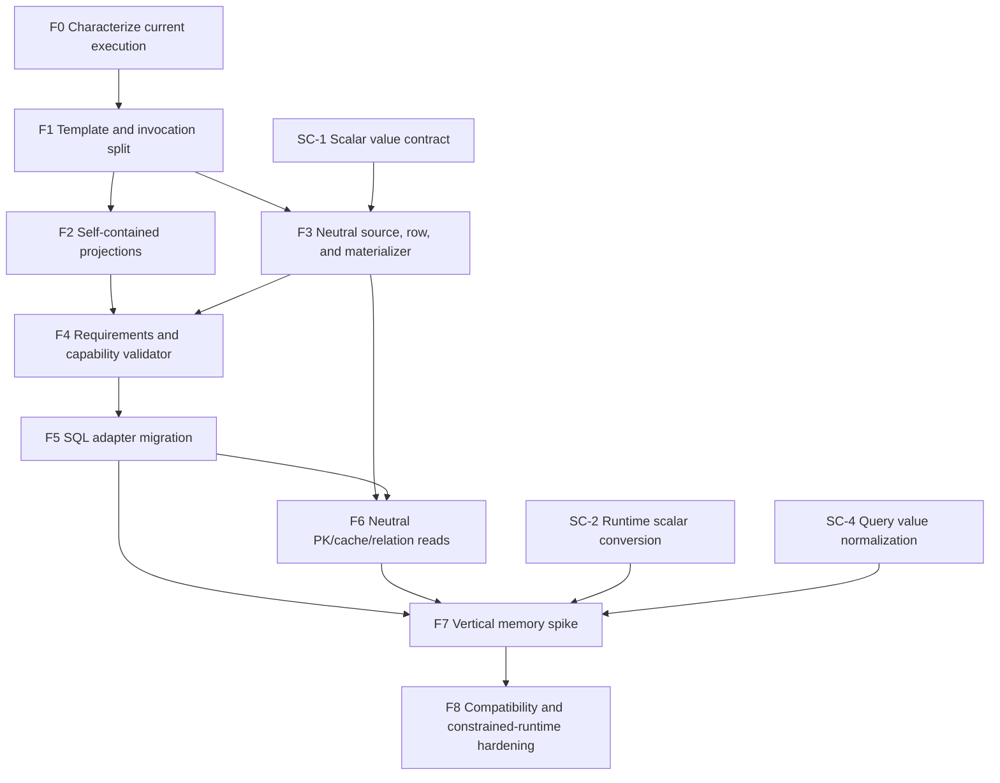

> [!WARNING]
> This document is roadmap implementation material for the DataLinq 0.9 development line. It is not normative product documentation and must not be treated as a shipped support claim.

# Query Backend And Execution Foundation Implementation Plan

**Status:** Implementation in progress. F0-F2 and `F5` are complete; F3, F4, F6, and F7 are active in bounded slices. The neutral row/materializer, primary-key loader, bounded index-row loader, neutral test-source composition, scalar-conversion, UUID storage, and memory-spike work documented below remains deliberately narrower than aggregate completion. Bounded `F4-B/F5-A/F5-B/F5-C/F5-D` adds one production request gate that selects the source-owned SQL backend and validates exactly once before work, plus complete SQL adapters for every retained expression-query result family with explicit result, cursor, cancellation, command, and reader ownership. The memory profile/backend executes pass-through root entity sequences plus one exact direct-`Int32` column/scalar equality slice; broader filter semantics, ordering, paging, projection, scalar, parity, and constrained-runtime paths remain open. Remaining cache/relation migration and legacy read-route removal also remain open. F4, F6, F7, UUID-2, and UUID-3 are not complete; W5 and W8 remain open.

**F4-B/F5 capability and execution progress:** The current contract contains 599 contextual features, with 344 supported and 255 unsupported SQL dispositions. The additive exact direct-`Int32` column/scalar comparison shape gives the memory backend an exhaustive narrow capability fence without adding SQL behavior; the initial F4-A 598/343/255 matrix remains documented below as historical checkpoint evidence. Every production expression query creates one `QueryExecutionRequest`, selects the source-owned backend, computes structural and invocation requirements, and validates exactly once before backend work. The SQL backend owns entity sequences and terminals, all six scalar reductions, direct `ScalarMember`/`SqlRow`/`GroupedAggregate` projections, and retained `Anonymous`/`ComputedRowLocal`/`JoinedRowLocal` recipes for their parser-supported result shapes. Projection execution returns final semantic `TResult` values through an owned cursor; SQL readers, aliases, `DBNull`, provider widths, converter-aware decoding, reflective row construction, and local recipe evaluation do not cross the backend contract. `SqlLocalProjectionExecutor` owns local SQL loading, joined-key buffering/cache hydration, result conversion, and bounded cancellation checks. `ExpressionQueryPlanExecutor` no longer constructs `QueryPlanSqlBuilder` for a supported projection. Contract tests freeze exactly-once backend dispatch for all three local kinds and terminals, `AotStrict` execution for `AotSafe` computed recipes, and pre-dispatch rejection for SQL-only anonymous and joined-local recipes. The integrated `F5-D` gate passes `57/57` generator tests, `1117/1117` unit tests, `788/788` SQLite compliance tests, `796/796` in each paired server run, and provider-specific batches of `160/160` and `162/162`. `F5` is complete. F4 remains open for the memory release profile/backend, while F6 retains neutral key/cache/relation and legacy read-route work; W5 is therefore not complete.

**F6-B index-row progress:** `SourceIndexRowRequest` and `SourceIndexRowLoadResult` add an optional, mutation-free full-row request/result pair for one frozen table index and canonical provider key. `IDataLinqIndexRowServices` is independent of the primary-key loader capability; existing SQL `DataSourceAccess` instances expose both through the same cached `DataSourceAccessSourceRowLoader`. The SQL adapter validates source ownership and read state, converts every index component through the provider writer, owns command/reader lifetime, observes cancellation at bounded points, and returns fully buffered canonical rows. The live `TableCache` dispatch is deliberately narrower than the contract: only an exact key for one integral canonical-provider index column uses the neutral loader. Cold loads retain row-cache miss/store/materialization accounting; read-only loads publish the shared relation index so the warm path returns the same immutable instances without another command. A reproduced rollback-poisoning bug showed that a transaction-visible relation key set must never enter that shared committed index, so both full-row relation loading and the still-SQL-shaped key-only path now publish shared index entries only from `ReadOnlyAccess`. Focused evidence is `6/6` contract tests, `11/11` adapter/route tests, `2/2` provider-key helper tests, and one SQLite-memory execution each for rollback isolation, cold/warm identity and telemetry, and the existing cold relation traversal. Integrated gates pass `1126/1126` unit, `57/57` generator, `792/792` SQLite compliance, `800/800` in each paired server compliance run, and `160/160` plus `162/162` provider-specific paired executions. String/CHAR, `Guid`/UUID, composite, converter-wrapped model keys, custom sources, key-only `GetKeys` neutralization, index preload, relation-wrapper redesign, memory relations, raw/manual reader routes, and broader legacy removal remain outside F6-B. F6 and W5 remain open.

**F6 neutral-source composition progress:** One contract test source now implements both `IDataLinqSourceRowServices` and `IDataLinqIndexRowServices`, supplies frozen canonical rows through the owned primary-key and index request/result contracts, and binds `ModelMaterializationServices` to the existing `RowCache` through `IReadSourceMaterializationCache`. The focused proof preserves request/result and metadata identity, materializes the expected generated model values with the exact neutral source, records one cache miss/materialization/insertion, and returns the same immutable instance on the second route's cache hit. Pre-cancelled primary-key and index requests perform zero row enumeration, cache lookup, materialization, or publication. Focused evidence is `2/2`; full unit and generator gates pass `1127/1127` and `57/57`. No provider matrix rerun is claimed because this checkpoint changes no production route. This is contract composition only: it does not exercise or widen `TableCache`, generated static `Get(...)`, relation wrappers, key-only lookup, index preload, custom production sources, a memory or query backend, transactions, or production telemetry. F6 and W5 remain open.

**F7/W8 memory-spike checkpoint:** Separate non-packable `DataLinq.Memory` and non-packable TUnit `DataLinq.Tests.Memory` projects are in the solution. Each memory source owns immutable per-table `CanonicalProviderValueRow` state plus a `DataLinqKey`-to-row-ordinal primary-key index, while materialized identities remain in one existing `RowCache` per table. The internal canonical seed path publishes a table atomically, rejects duplicate keys with row context, and does not freeze a public seed API. Direct primary-key requests use `SourcePrimaryKeyRowRequest`, generated materialization, and the shared source-bound cache; a non-concurrent test eviction proves clearing that cache does not remove store rows. SQL and memory startup share one registry lock across metadata resolution, publication, and generated static binding; a gated unit test proves a concurrent resolver cannot return during the first binder, while a 32-way cold start proves every source converges on the one winning graph. The source-bound backend now declares exactly 17 supported tokens and executes pass-through entity sequences plus repeated direct `Where` predicates restricted to exact non-nullable `Int32` root-column equality with an exact non-null `Int32` scalar binding. The shared comparison-shape classifier includes operand-node, column metadata, scalar declaration, and numeric-promotion boundaries, so string, column-to-column, nullable/mismatched, and promoted comparisons reject during capability validation rather than inside backend compilation. Accepted scalars normalize once per invocation; filtering occurs over canonical rows before materialization and preserves cache identity, capture rebinding, reversed operands, literal bindings, short-circuiting, empty completion, and bounded cancellation. That cancellation coverage uses an internal spike surface; generated public LINQ still supplies `CancellationToken.None`, so it is not a public cancellable-query claim. Focused memory and capability evidence passes `11/11` and `19/19`; integrated gates pass `1130/1130` unit, `57/57` generator, and `792/792` SQLite file/memory compliance tests. The memory project remains non-packable, builds cleanly for net8/net9/net10 with zero warnings or errors, and retains a dependency closure without SQL-provider or native-database packages. This is not general `Where`, numeric coercion, or SQL parity support. Ordering/`Take`, projections, scalar results, terminals, null/string/converter/typed-ID/`Guid` semantics, joins/grouping diagnostics, public seeding/API/package shape, concurrent cache maintenance, raw-SQL and relation diagnostics, Native AOT, trimming publication, and browser/WebAssembly remain open. F4, F7, W8, M0, M1, and M2 are not complete.

**Target release:** 0.9.

**Created:** 2026-07-10.

**Last reviewed:** 2026-07-13.

**Prerequisites:** The DataLinq-owned 0.8 expression parser and immutable query-plan model, the generated metadata/factory path, and characterization coverage for the currently documented SQL query subset.

## Purpose

This plan defines the foundation that lets SQL and a read-only memory backend execute the same self-contained DataLinq query request.

The immediate objective is not a public general-purpose backend SDK. It is a smaller and more testable internal architecture:

```text
expression
  -> query template + invocation
  -> capability validation
  -> backend execution
  -> canonical provider rows or semantic projection results
  -> shared model materialization where required
```

The foundation is successful when the existing SQL path uses it without regressions and one memory implementation can execute a deliberately small query subset without SQL, expression reparsing, or fake SQL-provider members.

This plan is the prerequisite for the 0.9 [Read-Only Memory Backend Implementation Plan](In-Memory%20Database%20Implementation%20Plan.md). It also defines the value boundary consumed by [Scalar Converters And Typed IDs](Scalar%20Converters%20and%20Typed%20IDs%20Implementation%20Plan.md) and [UUID Storage Format Support](../../providers-and-features/UUID%20Storage%20Format%20Support.md).

## Current Architecture Facts

The work must start from the current implementation, not the desired class diagram.

| Current fact | Consequence |
| --- | --- |
| [`QueryPlanTemplate`](../../../../src/DataLinq/Linq/Planning/QueryPlanTemplate.cs) and [`QueryPlanInvocation`](../../../../src/DataLinq/Linq/Planning/QueryPlanInvocation.cs) now separate validated structure, specialization, and frozen values. | F1 is complete. This is a correctness boundary and does not imply a production template cache or cross-specialization reuse. |
| [`QueryPlanProjectionRecipe`](../../../../src/DataLinq/Linq/Planning/QueryPlanProjectionRecipe.cs) makes retained row-local projections self-contained, and post-parse execution no longer receives the original expression. | F2 is complete. SQL-only recipe dispositions participate in the production capability gate, and the F5-D local adapter now evaluates retained recipes behind the selected SQL backend. |
| [`CanonicalProviderValueRow`](../../../../src/DataLinq/Instances/CanonicalProviderValueRow.cs) validates a complete frozen table-ordinal layout of canonical provider CLR values. [`ProviderRowMaterializer`](../../../../src/DataLinq/Instances/ProviderRowMaterializer.cs) applies cached scalar converters exactly once and creates model-valued [`RowData`](../../../../src/DataLinq/Instances/RowData.cs) without a reader. [`ModelMaterializationServices`](../../../../src/DataLinq/Instances/ModelMaterializationServices.cs) snapshots canonical primary-key identity before conversion, owns the cache probe when its caller has not already established a miss, and owns publication outcome plus successful materialization/store accounting. [`ReadSourceModelMaterializationRuntime`](../../../../src/DataLinq/Instances/ModelMaterializationServices.cs) binds that algorithm to a neutral source plus opaque cache services. | F3 is in progress. Existing SQL `DataSourceAccess` instances own one lazy materialization service whose cache adapter preserves committed versus transaction-local identity. The bounded live route can accept a `TableCache`-known miss without a duplicate lookup or miss metric while retaining concurrent-winner publication semantics. |
| [`ValidatedQueryExecutionRequest`](../../../../src/DataLinq/Linq/Planning/QueryExecution.cs) selects and validates the source-owned backend before every production expression-query dispatch. [`SqlQueryPlanBackend`](../../../../src/DataLinq/Linq/Planning/Sql/SqlQueryPlanBackend.cs) constructs [`QueryPlanSqlBuilder`](../../../../src/DataLinq/Linq/Planning/Sql/QueryPlanSqlBuilder.cs) for the complete entity sequence/six-terminal family, complete six-kind scalar-result family, and every supported direct or retained local projection family. | `F5-A/F5-B/F5-C/F5-D` is complete. Direct `ScalarMember`, `SqlRow`, and `GroupedAggregate` plus local `Anonymous`, `ComputedRowLocal`, and `JoinedRowLocal` results use the semantic backend cursor. No supported expression-query route retains an executor-side SQL compatibility path. |
| [`IDatabaseProvider`](../../../../src/DataLinq/Interfaces/IDatabaseProvider.cs) includes SQL construction, `IDbCommand`, `IDbConnection`, and transaction members. | Implementing it for memory would require meaningless or throwing SQL members. It must not become the neutral backend contract. |
| [`IDataLinqReadSource`](../../../../src/DataLinq/Interfaces/IDataLinqReadSource.cs) exposes metadata only. Legacy [`IDataSourceAccess`](../../../../src/DataLinq/Interfaces/IDataSourceAccess.cs) inherits it through a default metadata bridge while retaining `IDatabaseProvider` and `IDatabaseAccess`; [`DataSourceAccess`](../../../../src/DataLinq/Mutation/DataSourceAccess.cs) implements the internal source-services companion without exposing those runtime services publicly. | Generated immutable constructors, database roots, and materialization use the neutral identity while existing SQL sources retain their exact cache scope. SQL sources expose internal query-plan services for backend selection, and the bounded `MemoryReadSource` supplies its own memory backend; any neutral source without query-plan services is rejected before backend work. |
| [`GeneratorFileFactory`](../../../../src/DataLinq.SharedCore/Factories/Generator/GeneratorFileFactory.cs) detects an exact `IDataLinqReadSource` database constructor and emits both the legacy and neutral static factories without a concrete cast. [`IDatabaseModel<TDatabase>`](../../../../src/DataLinq/Interfaces/IDataLinqGeneratedDatabaseModel.cs) supplies an additive legacy fallback for older generated roots. | Repository-owned Employees, Allround, and platform/AOT smoke roots now use the neutral constructor and emit both entry points without the cast. Dedicated old-root fixtures preserve fallback and regeneration-diagnostic coverage. |
| SQL single and batched primary-key misses whose canonical key components are all integral use [`DataSourceAccessSourceRowLoader`](../../../../src/DataLinq/Cache/DataSourceAccessSourceRowLoader.cs), which adapts immutable [`SourcePrimaryKeyRowRequest`](../../../../src/DataLinq/Instances/SourceRowLoading.cs) batches to the existing SQL query builder, owns command/reader lifetime, and returns finite canonical `SourceRowLoadResult` batches through [`ProviderRowDecoder`](../../../../src/DataLinq/Instances/ProviderRowDecoder.cs). Bounded `UUID-3C` admits the same route for exactly one canonical `Guid` key component only when the concrete SQLite, MySQL, or MariaDB provider has exact resolved `GuidStorage`. | Bounded `F6-A` is live for the integral-canonical primary-key/cache-cold miss family after its W3 core-fault gate, with the separately gated scalar UUID-3C extension. The terminal scalar-primary-key route runs behind the selected and validated SQL backend. Remaining collation/codec-sensitive primary keys, custom-source fallback removal, and legacy reader routes remain open. |
| [`SourceIndexRowRequest`](../../../../src/DataLinq/Instances/SourceRowLoading.cs) snapshots one frozen table index, canonical provider key, and cancellation token. The optional `ISourceIndexRowLoader` returns an owned finite canonical-row result and leaves matching equality to the backend. Existing SQL sources share one cached `DataSourceAccessSourceRowLoader` across their primary-key and index capabilities. | Bounded `F6-B` routes only exact single-column integral canonical index keys from `TableCache` through the SQL adapter. Read-only cold loads preserve materialization, telemetry, shared-index warming, and immutable identity; transaction loads retain scoped visibility but cannot publish their visible key set into the shared committed index. Every broader relation/index/key shape and legacy route remains explicit follow-up work. |
| Public [`IRowData` and `RowData`](../../../../src/DataLinq/Instances/RowData.cs) expose the values behind immutable model properties. | Provider/wire values cannot be placed there casually. A separate internal provider-value buffer is required before model materialization. |
| The public legacy [`InstanceFactory.NewImmutableRow`](../../../../src/DataLinq/Instances/InstanceFactory.cs) still records through the SQL provider before invoking the legacy generated factory. Its internal read-source path invokes an exact neutral delegate when the model declares accessible `IRowData`/`IDataLinqReadSource` construction, or directly invokes the legacy delegate for an actual `IDataSourceAccess`, without provider access or a second metric. | Regenerated neutral-capable models now materialize from a neutral-only source. Legacy model declarations retain their exact generated constructor/hook and receive a focused update/regeneration diagnostic rather than a throwing SQL-shaped adapter when used with a neutral-only source. |
| Terminal scalar-primary-key recognition now lives in `SqlQueryPlanBackend.TryExecuteTerminalEntity` and accepts only the already selected [`ValidatedQueryExecutionRequest`](../../../../src/DataLinq/Linq/Planning/QueryExecution.cs). | The shortcut runs only after source ownership and capability validation, while preserving its entity telemetry, result semantics, and cache/materialization path. |

These are the seams to repair. A tiny executor interface pasted above the existing stack is not enough.

## Decisions For 0.9

### Keep the new contracts internal first

The first contracts should be internal unless an existing public abstraction must change for generated-code compatibility. The metadata-only `IDataLinqReadSource` is that narrow public exception because generated consumer assemblies must name it. Backend execution, capability declarations, provider-value buffers, source services, and materialization remain internal while they are being proven by only two implementations: the current SQL path and the memory spike.

Do not publish an extensibility API before these questions have evidence:

- result streaming and ownership
- async reader integration
- source/cache responsibilities
- backend-specific diagnostics
- mutation boundaries
- stable capability vocabulary

A public interface is cheap to add and expensive to correct. 0.9 should earn the shape first.

### Separate template, invocation, and execution context

The concepts are distinct even if the final type names differ:

```csharp
internal sealed class QueryPlanTemplate
{
    // Sources, operations, result shape, self-contained projection recipe,
    // binding declarations, and structural diagnostics.
}

internal sealed class QueryPlanInvocation
{
    public QueryPlanTemplate Template { get; }
    public QueryPlanBindingValues Values { get; }
}

internal readonly record struct QueryExecutionContext(
    IDataLinqReadSource Source,
    CancellationToken CancellationToken);

internal readonly record struct QueryExecutionRequest(
    QueryPlanInvocation Invocation,
    QueryExecutionContext Context);
```

This is conceptual API, not a naming commitment.

Ownership rules:

- The template owns only structural data.
- Binding declarations contain stable ID, kind, model/provider type expectations, and any structural constraints.
- The invocation owns copied/frozen scalar and local-sequence values for exactly one execution.
- Local-sequence contents, total count, and null count are invocation data. A freshly parsed template declares the total-count/null-count specialization needed by membership rendering; captured scalar bindings likewise declare their parsed nullness when comparison SQL depends on it.
- 0.9 does not require one template to be reusable across different scalar nullness or local-sequence total/null-count shapes. Explicit rebinding that does not satisfy either specialization fails validation; the normal query entry point can parse a matching template for a different shape.
- The execution context owns the selected source, cancellation, and execution-scoped diagnostics/telemetry context.
- Neither the backend executor nor materializer receives the original expression tree.

The split is a correctness requirement, not an announcement of plan caching. 0.9 will not add a global template cache, eviction policy, public fingerprint, cross-metadata template reuse, or cross-null/cardinality specialization reuse.

### Make supported projections self-contained

Before F2, `ComputedRowLocal` retained an `ExpressionShape` string for diagnostics while the executor recovered the real selector from the original expression. F2 removed that two-source contract in favor of self-contained projection recipes.

For every currently supported SQL shape that remains supported after the refactor, choose one explicit representation:

- direct provider-side projection members already represented as `QueryPlanValue` nodes
- a normalized AOT-safe local projection recipe interpreted by the existing projection evaluator
- an explicitly SQL-only execution recipe owned by the template
- a focused unsupported diagnostic if the shape cannot be represented honestly yet

Existing SQL behavior is a compatibility gate: a currently supported row-local SQL projection cannot simply disappear because memory does not support it. It must become a self-contained recipe or a narrowly scoped SQL compatibility recipe produced during parsing. Memory may reject that recipe through capability validation. Neither route may pass or reparse the original query expression.

Requirements for a local projection recipe:

- source parameters are stable source-slot references, not `ParameterExpression` identity
- captured values are binding references, not closure objects
- supported constructors, members, conversions, conditionals, and method calls are explicit nodes
- evaluation does not call `Expression.Compile()` or generate runtime code
- the debug writer can show the recipe
- capability validation can reject recipe node kinds before row enumeration

Do not keep the original `LambdaExpression` as a convenient hidden payload and call the request self-contained. That would preserve the architectural defect under a better type name.

### Distinguish provider values from wire values and model values

The shared read pipeline is:

```text
SQL/database wire value
  -> provider/column codec
  -> canonical provider CLR value
  -> scalar converter
  -> model CLR value
  -> public model-valued RowData
```

Memory begins at the canonical provider CLR value. It should not store MySQL UUID byte order, SQLite text formatting, or immutable model instances.

Examples:

- `CustomerId(42)` has model value `CustomerId`, canonical provider value `int 42`, and an integer database wire value.
- a model `Guid` has canonical provider value `Guid`; MySQL `BINARY(16)` bytes are a column/provider wire representation.
- a string-backed value object may have canonical provider value `string`, then use the provider's normal string wire handling.

`CanonicalProviderValueRow` is now the internal dense provider-value row buffer keyed by `TableDefinition` and column ordinal. `ProviderRowMaterializer`, the trusted `RowData` factory, `ModelMaterializationServices`, and `ReadSourceModelMaterializationRuntime` convert that buffer to a model-valued `RowData`, create the immutable instance through generated metadata, and integrate with source-owned cache identity. Memory consumes those live contracts rather than wrapping its rows in a fake `IDataLinqDataReader`.

This deliberately corrects the tempting but unsafe idea of making public `RowData` provider-valued. Existing model indexers, `GetValues()`, and `GetRowData()` expose its content.

### Split neutral reads from SQL services

The public read-source identity exposes metadata only. Backend execution needs a richer internal companion implemented alongside it. Conceptually:

```csharp
internal interface IDataLinqReadServices : IDataLinqReadSource
{
    IQueryPlanBackend QueryBackend { get; }
    ISourceRowLoader RowLoader { get; }
    IModelRowMaterializer Materializer { get; }
    DatabaseCache Cache { get; }
}
```

The implementation is being introduced capability by capability. `IDataLinqReadServices` carries source-scoped materialization. `IDataLinqSourceRowServices` adds `ISourceRowLoader` only when a source has a real loader; existing SQL `DataSourceAccess` instances now implement it through `DataSourceAccessSourceRowLoader`, not a null or throwing placeholder. `SourcePrimaryKeyRowRequest` snapshots and validates canonical provider keys plus cancellation, and `SourceRowLoadResult` owns a finite immutable row batch, verifies every returned primary key was requested, and lets no backend reader escape through this seam.

The exact cache exposure may change. The durable rules are:

- query-plan execution is neutral
- primary-key and relation/cache-cold loads are neutral
- generated immutable factories accept the neutral source shape
- raw SQL, commands, connections, and SQL transactions remain on SQL-specific services
- existing public SQL APIs continue through adapters rather than being forced onto memory

Avoid an interface that merely renames `IDatabaseProvider` while retaining every SQL member. Also avoid a parallel `MemoryDataSourceAccess` hierarchy that duplicates generated model and cache behavior.

### Validate capabilities once, before work

Introduce a structural requirement set derived from the template and invocation:

```csharp
internal sealed record QueryPlanRequirements(
    /* operation kinds, result kind, projection nodes, value kinds,
       source count/kinds, functions, invocation-sensitive limits */);

internal interface IQueryPlanBackend
{
    IDataLinqReadSource Source { get; }
    QueryBackendCapabilities Capabilities { get; }
    IQueryEntityCursor OpenEntityCursor(ValidatedQueryExecutionRequest request);
    IQueryProjectionCursor<TResult> OpenProjectionCursor<TResult>(ValidatedQueryExecutionRequest request);
    TResult ExecuteScalar<TResult>(ValidatedQueryExecutionRequest request);
    bool TryExecuteTerminalEntity(
        ValidatedQueryExecutionRequest request,
        out IImmutableInstance? result);
}
```

The family-specific result mechanics are now live for entity, scalar, direct-projection, and retained local-recipe results. This is the completed F5 surface; F4 still lacks the memory capability profile/backend, and F6 still owns neutral source-row/cache/relation migration.

Validation rules:

- The parser rejects expression shapes that DataLinq does not model at all.
- The capability validator rejects valid plan nodes that the selected backend does not implement.
- Binding/type validation rejects an invocation that does not satisfy its template declarations.
- Provider-value normalization errors identify model type, provider type, table, column, and binding where available.
- Validation completes before an SQL command is executed or a memory scan begins.
- No backend may silently invoke LINQ-to-Objects or client-side evaluation to widen its capability set.

Diagnostics should name at least:

- backend
- operation/projection/value/result feature
- source slot or column when relevant
- the supported alternative or materialization boundary when one exists

The SQL capability set initially describes current shipped behavior. The memory set is intentionally much smaller.

### Preserve optimizations behind the boundary

The terminal primary-key path is useful, but it cannot remain a special expression parser route tied directly to `TableCache` and SQL access.

Valid options:

- normalize it into a normal plan and let the backend select a primary-key index/command
- represent it as a validated source-row request handled by `ISourceRowLoader`
- retain parser recognition but dispatch through the chosen backend after the same binding, conversion, capability, telemetry, and cache gates

Invalid option:

- keep a hidden SQL-only shortcut that bypasses the request and then separately reimplement it for memory

The same rule applies to foreign-key/relation loads and cache misses.

### Prepare for real async without shipping it

The foundation should be cancellation-aware and lifetime-safe, but 0.9 does not implement the public async product.

Requirements:

- `QueryExecutionContext` carries a `CancellationToken`, defaulting to `None` for existing synchronous LINQ entry points.
- SQL checks cancellation before command execution; memory checks it at bounded scan, sort, projection, and materialization points.
- Backend result ownership makes reader/cursor disposal explicit.
- The neutral result contract does not require the SQL adapter to hide an open reader inside an unconstrained `IEnumerable<T>` forever.
- A future `ExecuteAsync`/async-cursor sibling can share the request, validator, materializer, and capability vocabulary.
- No fake `Task.Run`, `Task.FromResult`, or asynchronous memory facade is introduced.

The full async design needs separate work because `IDatabaseAccess` currently exposes synchronous operations only. That larger public API and provider implementation change is not a foundation exit criterion.

## In Scope

- characterize the current parser/executor/SQL behavior with focused tests
- split structural binding declarations from invocation values
- make supported execution independent of the original expression argument
- introduce neutral read-source, backend-execution, provider-row, and materialization seams
- make generated database/model construction accept the neutral source path
- route query, primary-key, cache-cold, and relation-load reads through neutral operations
- introduce backend capability declarations and pre-execution validation
- adapt the existing SQL builder/executor, projection, telemetry, and cache paths
- add cancellation to internal execution context and bounded cancellation checks
- prove the contract with an internal vertical memory spike
- retain SQLite, MySQL, and MariaDB behavior
- provide debug/snapshot visibility for template, invocation declarations, requirements, and backend selection

## Out Of Scope

- public third-party backend SDK stability
- production query-plan cache, eviction, or public cache keys
- provider-neutral mutation or transaction contracts
- memory insert/update/delete, transaction, snapshot-fork, or constraint behavior
- commit batches, logs, replay, CDC, or persistence
- public asynchronous LINQ or mutation APIs
- broad parser decomposition unrelated to the new seams
- broader join, grouping, or relation query support
- arbitrary client evaluation
- replacing existing raw SQL APIs
- changing UUID compatibility defaults or migrating stored UUID bytes

## Workstream Dependency Graph



Work may overlap where tests isolate the changes, but dependencies cannot be waved away. In particular, the public memory preview must not be built on a spike that still receives an expression or implements SQL interfaces with `NotSupportedException` stubs.

## Workstream Details

### F0: Characterize Current Execution

Add focused characterization before moving contracts:

- template/debug snapshots for each projection kind and result operator
- binding freeze tests for scalars, nulls, and local sequences
- SQL snapshots for representative entity, scalar, direct-row, row-local, join, grouping, paging, and aggregate plans
- behavior tests for terminal primary-key lookup
- cache-cold and relation-load command/telemetry tests
- disposal tests for readers and commands
- transaction versus read-only root parity

The characterization should distinguish intentional behavior from accidental internal layout. It is not a request to snapshot every private field.

Exit signal:

- the team can move execution ownership and detect a supported behavior regression immediately
- every current route that reparses the expression or bypasses the normal executor is catalogued

### F1: Split Template And Invocation

Refactor plan construction so binding declaration and binding value creation are separate products of one parse.

Work:

- introduce immutable binding declarations with stable IDs, kind, and expected types
- introduce immutable/copying invocation values
- remove concrete values from structural equality/debug identity
- make nullness, empty-membership, cardinality, or other parse-time specialization explicit rather than letting the parser inspect values invisibly
- document that cross-specialization reuse is deferred with production caching
- resolve literal and closure capture consistently; query-time values must not hide in structural nodes
- validate every binding reference at template construction
- validate invocation completeness, duplicate IDs, type compatibility, nullability expectations, and local sequence element types
- make SQL value rendering read invocation values through the new lookup
- add a diagnostic template fingerprint only if tests need it; do not make it a public cache key

Important tests:

- two compatible executions with the same shape and different non-null scalar values share no invocation state
- local sequences are copied/frozen; an invocation with a different specialization than its template is rejected rather than reused unsafely
- null and non-null captures preserve current semantics without pretending they necessarily share one template
- concurrent invocations cannot see each other's values
- an invalid or incomplete invocation fails before backend work

Exit signal:

- structural debug output is identical for equivalent query shapes with different compatible ordinary values, while specialization differences are visible
- invocation debug output can be redacted separately
- renderers and executors consume the validated `QueryPlanInvocation`; no value-bearing structural-plan hybrid remains

### F2: Make Projections Self-Contained

Work:

- inventory every `QueryPlanProjectionKind` and its current execution route
- replace expression-shape-only projections with explicit recipes for the subset that remains supported
- store constructor/member mapping and source-slot references in the template
- route captured projection values through invocation bindings
- teach `ProjectionExpressionEvaluator` or its replacement to consume the recipe rather than an expression parameter map
- preserve current SQL-backed direct projection behavior
- reject unsupported local projection nodes during parsing or capability validation, not after rows have been read

Exit signal:

- supported `Execute` and `ExecuteEnumerable` entry points accept request/context, not the original expression
- deleting access to the original expression after parsing does not change supported results
- debug output explains local projection shape beyond a human-only string

### F3: Introduce The Neutral Source, Row, And Materializer

Progress through 2026-07-13: the strict full-entity `CanonicalProviderValueRow`, trusted reader-free model-valued `RowData` factory, column-only `ProviderRowMaterializer`, and source-independent `ModelMaterializationServices` orchestration are implemented. The orchestration snapshots canonical primary keys before model conversion, distinguishes inserted, concurrent-winner, and not-cached publication results, and either owns the initial logical cache probe or accepts a miss already established by `TableCache`. `ReadSourceModelMaterializationRuntime` composes a neutral source with opaque source-owned cache/metrics services. Every existing SQL `DataSourceAccess` lazily owns one such service, and its adapter preserves committed versus transaction-local identity without exposing SQL commands, connections, or transactions to the materializer. Canonical provider keys reach current generated row-store accessors before model conversion can change their type; old generated accessors retain their legacy default behavior. `SourcePrimaryKeyRowRequest` owns and validates a finite canonical key batch and cancellation token. `SourceRowLoadResult` owns a finite canonical row batch and rejects cross-table, unrequested-key, and duplicate-key payloads. `ISourceRowLoader` contains no provider, SQL, reader, connection, transaction, or mutation member. Existing SQL sources implement the separate `IDataLinqSourceRowServices` capability with `DataSourceAccessSourceRowLoader`: it converts canonical keys to provider wire parameters, checks cancellation before bounded work, explicitly disposes command/reader state, and uses `ProviderRowDecoder` to separate physical decoding from provider-to-model conversion. Bounded `F6-A` makes this the live single and batched primary-key cache-miss route when every canonical provider key component is integral. Bounded `UUID-3C` admits the same route for exactly one canonical `Guid` component only when the concrete SQLite, MySQL, or MariaDB source has exact resolved column storage. String/CHAR keys remain on the legacy route to preserve provider-collation equality; composite UUID and other codec-sensitive keys, custom sources, and foreign-key/relation/index loads beyond bounded `F6-B` also remain unchanged.

`ModelValueConverter` validates and converts typed model mutation values to owned canonical provider values once per serialization, identity-capture, or identity-validation boundary before the existing provider writer applies physical encoding. `StateChange` captures canonical update/delete keys and reuses them for physical rendering, so the provider writer cannot double-convert those keys at render time; canonical loader/key writer paths remain physical-only. `GeneratedValueDecoder` normalizes raw SQL auto-increment scalars across all checked integral CLR pairs, and the extracted single-column materializer applies the same canonical-to-model converter before mutating the generated ID slot. Decode or converter failures leave that slot unchanged. `KeyFactory` converts only converter-backed components read from explicitly model-valued rows and model instances, including mixed composite and binary keys; metadata-free/provider key APIs remain unchanged. For scalar converter-backed primary-key projections, it asks `ProviderRowDecoder` for the canonical provider value at result ordinal zero before constructing the dynamic key, so non-simple typed-ID entity queries reach `TableCache` without a physical-provider-to-model-wrapper cast. A canonical `Guid` key opts this selection into the exact column-aware reader; other general scalar/projection routes remain metadata-free. Converter-backed SQL `ScalarMember` results likewise decode at the selected result alias and materialize the model value before supported result-shape adaptation, including exact joined scalar sources. Converter-backed column members in aliased anonymous `SqlRow` projections use that same result-alias boundary for root and joined sources, and model-compatible converter-backed direct `GroupedAggregate` keys use the projection-slot boundary; constructor-backed row/grouped results retain `SqlOnlyCompatibility`. Single-source integral-keyed `ComputedRowLocal` `NewArray` recipes consume converter-backed model values under `AotStrict`. Primitive-key `JoinedRowLocal` `NewArray` SQL execution preserves converter-backed joined-source values while retaining the projection's intentional `SqlOnlyCompatibility` fence. SQLite, MySQL, and MariaDB full-row canonical `Guid` reads and mutation writes use resolved text/native/binary codecs for the bounded non-key formats and for direct or representative Guid-backed typed scalar primary keys. UUID-3C also makes scalar key selection column-aware before `DataLinqKey` construction, while general scalar/projection decoding remains metadata-free. Current and original invalidation keys share the canonical boundary, converted-key generated `Get(...)` methods use the column-aware public helpers, and provider-key accessors stay disabled for converted components. The live neutral reload completes end-to-end typed-ID insert hydration for integral canonical auto IDs and exact scalar UUID keys on the separately gated UUID-3C shape. Insert mutations capture table-ordinal write slots with assignment provenance, so an assigned null remains an explicit SQL `NULL` while an unset, provider-applicable `DefaultSql` may be omitted from a non-primary-key, non-indexed column, including a converter-backed column, when the authoritative reload uses an integral-canonical `F6-A` primary key or one decodable integral auto-increment key. Provider-mismatched `DefaultSql`, client `[Default]` values, indexed defaults, non-integral generated keys, unsupported key shapes, and rows with unknown non-auto keys remain explicit writes. Roslyn emits genuine neutral immutable and database-root factories only when the respective model or root exposes the exact read-source constructor. The legacy constructors and hooks remain unchanged through additive fallbacks; an old root accepts real SQL sources and gives a focused regeneration diagnostic for a neutral-only source. `DbRead<T>` and the expression-plan root preserve the neutral source through parsing. Production execution now selects and validates source-owned query-plan services; a neutral source without the later memory backend is rejected before backend work. Composite reader keys, member-init row evidence, joined/function-derived grouped keys, converter-backed aggregate values, `HAVING`, joined typed-UUID and other non-primitive key handoff, neutral local-recipe hydration beyond the supported scalar SQL keys, reader/external relation-key normalization, remaining SC-2 query conversion, row/source-slot envelopes, remaining collation/codec-sensitive key routing, legacy fallback removal, and broader F6 foreign/relation/index loading beyond the exact single-column integral `F6-B` route remain open; scalar primary-key use from joined or relation callers is not yet characterized as a completed route.

Repository-owned root migration on 2026-07-12 moved Employees, Allround, and the platform/AOT smoke from concrete `DataSourceAccess` constructors to exact `IDataLinqReadSource` constructors. Generator evidence proves each migrated shape retains the SQL-compatible `NewDataLinqDatabase(IDataSourceAccess)` entry point and adds `NewDataLinqReadDatabase(IDataLinqReadSource)` without emitting the transitional concrete cast. Normal executions of the AOT- and trim-targeted smoke projects pass through the migrated platform root; this slice does not replace release-time publish evidence. Purpose-built legacy generator/runtime fixtures remain unchanged so the additive fallback and focused neutral-only-source diagnostic stay executable.

Default-only insert progress on 2026-07-12 extends reload-safe omission to an unassigned null auto-increment primary key whenever its canonical provider type is integral, including converter-backed model IDs. With no remaining write columns, the insert delegates its zero-column clause to the provider: SQLite emits `DEFAULT VALUES`, and MySQL/MariaDB emit `() VALUES ()`. The same authoritative-reload path hydrates provider-applicable, non-indexed server defaults through scalar conversion when the primary-key shape is integral-canonical and `F6-A` compatible. The focused converted-default active-provider matrix passes `4/4`; full unit, generator, SQLite compliance, and MySQL/MariaDB compliance runs pass `1051/1051`, `57/57`, `746/746`, and `748/748`. An assigned null or explicit identity remains an explicit write. Providers that do not declare default-only syntax retain the legacy null-key write and empty-query `VALUES (NULL)` fallback. Indexed defaults, unknown non-auto keys, non-integral generated IDs, server-default/generated-key hydration over string/CHAR or UUID key shapes, composite reader keys, member-init row evidence, joined/function-derived grouped keys, converter-backed aggregate values, `HAVING`, joined-local key handoff beyond primitive integral keys and neutral local-recipe hydration beyond integral SQL keys, and broader foreign-key/relation/index loads beyond bounded `F6-B` remain open. Terminal scalar-primary-key execution now runs behind the validated SQL backend.

SQL-projection progress on 2026-07-12 applies the shared physical-to-canonical-to-model boundary to converter-backed SQL `ScalarMember` results. Active-provider evidence covers root and joined int-backed typed-ID projections, nullable and lifted-nullable results, boxing without leaking the canonical `int`, terminal `Single()`, and normal-host execution under `AotStrict`. A second bounded SQL slice applies that boundary to converter-backed column members in aliased anonymous `SqlRow` projections for root and joined sources and terminal `Single()`, while preserving `SqlOnlyCompatibility`. Explicit model-to-`int` scalar projection conversion remains a translation diagnostic. This does not prove general nullable member predicate or projection translation beyond the exact same-mapping join-key shape exercised here, general numeric converter widening or narrowing, constrained-runtime execution, implicit-relation or member-init row projections, grouped/aggregate conversion outside the bounded key-only slice below, or retained local recipes beyond the bounded single-source `NewArray` slice below.

Explicit-constructor row evidence on 2026-07-12 proves direct constructor-backed DTO/record `SqlRow` projections use the same per-column boundary before positional constructor adaptation. Active-provider coverage includes root and joined source slots, non-nullable, nullable, lifted-nullable, and boxed typed IDs, plus terminal `Single()`. The plan preserves exact result and constructor types and retains `SqlOnlyCompatibility`; `AotStrict` rejects the reflective constructor path as designed. Full gates pass `1051/1051` unit, `57/57` generator, `752/752` SQLite compliance, `1416/1416` four-server compliance, and `160/160` in the latest MySQL/MariaDB provider-specific lane. This does not establish member-init projections, implicit-relation columns, post-projection DTO composition, constrained-runtime construction, or backend-neutral/memory execution.

Implicit-relation row evidence on 2026-07-12 proves a converter-backed non-key column reached through a one-hop singular implicit relation preserves its related-table `ColumnDefinition` through `ImplicitJoin` planning, SQL result aliasing, and direct `SqlRow` decoding/materialization. The dedicated active-provider fixture keeps both primary and foreign keys primitive and covers non-nullable, nullable, lifted-nullable, boxed, and terminal related values. Plan evidence records exactly one root and one implicit-join source and ties every converted related projection member to that source. Full gates pass `1051/1051` unit, `57/57` generator, `754/754` SQLite compliance, `1420/1420` four-server compliance, and `160/160` in the latest MySQL/MariaDB provider-specific lane. This does not establish converted relation keys, lazy relation loading, relation cache/index normalization, nullable left-join semantics, multi-hop or collection traversal, member-init/local recipes, constrained-runtime execution, or backend-neutral/memory relations.

Single-source local-recipe evidence on 2026-07-13 proves that a retained `ComputedRowLocal` `NewArray` recipe reads converter-backed source columns as materialized model values. The active-provider matrix executes sequence and terminal `Single()` plans under `AotStrict` after explicitly clearing the table cache and covers non-nullable, nullable, lifted-nullable, boxed-nullable, `HasValue`, and conditional `.Value` nodes; exact type assertions show that no canonical integer leaks into the result. The recipe is explicitly `AotSafe`, and no compatibility constructor or member reflection participates. This evidence does not instrument a specific loader implementation and is bounded to the current integral-canonical SQL entity-key configuration. Full gates pass `1051/1051` unit, `57/57` generator, `756/756` SQLite compliance, `1424/1424` four-server compliance, and `160/160` in the latest MySQL/MariaDB provider-specific lane. As a single-source slice, it does not establish joined-local execution, constructor/member-init local recipes, non-integral or composite neutral hydration, custom sources, Native AOT/browser publication, or backend-neutral/memory recipe execution.

Primitive-key joined-local evidence on 2026-07-13 proves that explicit-inner-join `JoinedRowLocal` `NewArray` SQL execution reloads root and joined rows before evaluating converter-backed joined-source columns as model values. The active-provider matrix runs after explicit cache clearing and covers non-nullable, nullable, lifted-nullable, boxed-nullable, `HasValue`, and conditional `.Value` shapes without canonical-integer leakage. Plan assertions pin one root plus one explicit-join source, one primitive non-converted `int` primary key per source, and the joined source's converter metadata. The normalized `NewArray` recipe is `AotSafe`; the enclosing joined projection deliberately remains `SqlOnlyCompatibility`, and `AotStrict` rejection remains the SQL-only backend fence. The focused active-provider matrix passes `6/6`. Two preceding concurrent four-target attempts reached `1426/1428` and `1427/1428`; their only failures were unrelated connection refusals, and every exact failing test passed on its immediate target-specific rerun. Full gates pass `1051/1051` unit, `57/57` generator, `758/758` SQLite compliance, `426/426` on each of MySQL 8.4 and MariaDB 10.11/11.4/11.8 (`1704/1704` sequential server executions after concurrent connection instability), and `160/160` in the latest MySQL/MariaDB provider-specific lane. Converted, composite, string, `Guid`, binary, and codec-sensitive joined keys, implicit/outer joins, nullable missing-source rows, joined terminal/paging composition, custom or backend-neutral/memory sources, and Native AOT/browser publication remain outside this slice.

SQLite UUID provider-consumption progress on 2026-07-13: A bounded SQLite-first `UUID-2` checkpoint requires exact resolved SQLite UUID storage metadata when mapped canonical `Guid` values cross the provider boundary. Direct full-row coverage spans Text36, Text32, little-endian BLOB, RFC-order BLOB, and nullable Text36/SQL NULL. A subsequent full-row-only converter bridge composes the same column-aware reader/writer boundary with a typed ID over RFC-order BLOB and a nullable typed ID over Text36/SQL NULL. Frozen non-symmetric writes, independent raw seeds, cache-cleared reads, and updates prove the physical/model boundary without relying on symmetric round trips. That original checkpoint excluded UUID primary keys; bounded UUID-3C now covers a direct little-endian BLOB scalar key and a Guid-backed typed RFC-order BLOB scalar key through exact reads, writes, cache loading, and mutation predicates. The earlier full gates passed `1055/1055` unit and `760/760` SQLite compliance, and `DataLinq.SQLite` built cleanly for `net8.0`, `net9.0`, and `net10.0`. Other independently instantiated typed formats, projection result decoding, remaining UUID predicates/membership, composite keys, relations, defaults, ambiguous BLOB metadata, other SQLite reader routes, memory, and Native AOT/browser publication remain outside these slices; aggregate `UUID-2` is not complete.

MySQL/MariaDB UUID provider-consumption progress on 2026-07-13: Provider-owned access and transaction readers carry exact provider identity into column-aware non-primary-key full-row canonical `Guid` decoding, and the shared writer takes the same identity from its selected factory. Direct values span native MariaDB UUID, Text36, Text32, little-endian `BINARY(16)`, and RFC-order `BINARY(16)`; the converter-backed slice proves a typed ID whose binary definition is little-endian on MySQL and RFC-order on MariaDB, plus nullable typed Text36/SQL NULL. Binary reads use raw bytes while text/native reads accept raw text or connector-canonical `Guid`. Frozen non-symmetric vectors, normal/transaction access, independent raw seeds, updates, provider-differentiated bytes, and no/adversarial `GuidFormat` modes prove the boundary. That original checkpoint excluded UUID primary keys; bounded UUID-3C now opts exact scalar direct and Guid-backed typed keys into column-aware decoding and key selection while keeping general scalar/projection decoding metadata-free. It proves MySQL little-endian binary versus MariaDB RFC-order binary under the same connector modes. The earlier full gates passed `1055/1055` unit, `760/760` SQLite compliance, `429/429` on each server target (`1716/1716` total), and `414/414` combined provider-specific executions; `DataLinq.MySql` built cleanly for `net8.0`, `net9.0`, and `net10.0`. Other typed formats, composite keys, projections, remaining predicates/membership, relations, defaults, provider-less public reader/access/transaction construction, memory, and Native AOT/browser publication remain outside the evidence claim; aggregate `UUID-2` is not complete.

UUID query-parameter progress on 2026-07-13: Bounded `UUID-3A` adds no new production route; it proves the existing SC-4 canonical-column operand pipeline reaches the exact non-primary-key SQLite/MySQL/MariaDB writer with resolved column metadata. Expression-query equality covers every direct bounded text/native/binary format. Deeper cases cover direct and representative converter-backed binary equality, inequality, local `Contains(...)`, and supported equality-`Any(...)`, while nullable direct and typed Text36 cover non-null values and literal `null`. Exact captured parameters and selective non-symmetric values prove the physical text/byte layout rather than a symmetric round trip. SQLite file and memory focused cases pass `2/2`; latest MySQL and MariaDB focused cases pass `1/1` each. Full gates pass `1055/1055` unit, `762/762` SQLite compliance, `432/432` on each MySQL 8.4 and MariaDB 10.11/11.4/11.8 target (`1728/1728` sequential), and `414/414` provider-specific executions. Captured-null variables, null-containing local sequences, manual string-only `SqlQuery`, UUID primary/composite keys, cache/relation/update-delete key paths, projections, defaults, other typed formats, provider-less readers, memory, and Native AOT/browser publication remain outside the checkpoint; aggregate `UUID-3` is not complete.

Nullable-invocation progress on 2026-07-13: Bounded `UUID-3B` makes every membership shape chosen from frozen invocation specialization rather than the runtime accident of SQL three-valued logic. Captured scalar null equality/inequality emits literal `IS NULL`/`IS NOT NULL` with zero parameters. Local sequences specialize by total count plus null count; explicit rebinding rejects either mismatch, while same-shape rebinding refreshes values and null position. Positive non-null-only membership emits `IN` plus `AND IS NOT NULL`, keeping it two-valued under outer negation; positive mixed emits `IN` over non-null parameters plus `OR IS NULL`; negative non-null-only emits `NOT IN` plus `OR IS NULL`; negative mixed emits `NOT IN` plus `AND IS NOT NULL`; null-only emits `IS NULL` or `IS NOT NULL`; empty membership remains fixed false or true. Only non-null values flow through column-aware conversion and physical provider binding. Focused evidence covers generic nullable semantics plus direct `Guid?` and Guid-backed typed nullable Text36 on SQLite file/memory and the existing MySQL/MariaDB connector-`GuidFormat` loops. Focused results are `21/21` `QueryPlanInvocation`, `10/10` `QueryPlanNode`, `25/25` parser/snapshot, `38/38` SQL parity, `2/2` generic nullable SQLite, `4/4` UUID SQLite, `2/2` MySQL 8.4, and `2/2` MariaDB 11.8. Full gates pass `1057/1057` unit, `766/766` SQLite compliance, `435/435` on each server target (`1740/1740` sequential), and `414/414` provider-specific executions. Manual string-only `SqlQuery`, UUID primary/composite keys, cache/relation/update-delete key paths, projections, defaults, other typed formats, provider-less readers, memory, and Native AOT/browser publication remain outside the checkpoint; aggregate `UUID-3` is not complete.

Scalar UUID primary-key progress on 2026-07-13: Bounded `UUID-3C` extends the neutral primary-key loader only to a table with exactly one canonical `Guid` key component and exact resolved `GuidStorage` for the concrete SQLite, MySQL, or MariaDB source. Provider readers/writers apply that column codec to full-row decoding, scalar key selection, insert/update/delete values, and update/delete predicates. Direct `Guid` and a representative Guid-backed typed ID preserve cold generated `Get(...)`, batched entity hydration, transaction authoritative reload, one logical cache probe, and warm reference identity. SQLite evidence covers little-endian BLOB direct keys and RFC-order BLOB typed keys; MySQL/MariaDB evidence proves MySQL little-endian versus MariaDB RFC-order binary under absent, `Char32`, `Binary16`, and `LittleEndianBinary16` connector settings. Composite UUID keys, relation/index/foreign-key operands, general scalar/projection decoding, manual string-only `SqlQuery`, joined typed-UUID row-local hydration, provider-less readers, memory, Native AOT/browser publication, defaults, schema comparison, and other typed formats remain open; F6 and aggregate UUID-2/UUID-3 are not complete.

Focused `UUID-3C` evidence is `2/2` on SQLite file/memory, `1/1` for the new scalar-key case on MySQL 8.4 and MariaDB 11.8, and `3/3` for the full UUID fixture on those two server targets. The integrated gates pass `1059/1059` unit, `57/57` generator, `768/768` SQLite compliance, `438/438` on each of MySQL 8.4 and MariaDB 10.11/11.4/11.8 (`1752/1752` sequential server executions), and `414/414` provider-specific executions. This is evidence for the bounded scalar-key checkpoint, not aggregate UUID completion or the final frozen-candidate rerun.

Grouped-key projection progress on 2026-07-12 applies the same boundary to model-compatible converter-backed column keys in direct SQL `QueryPlanProjection.GroupedAggregate` results while retaining `SqlOnlyCompatibility`. Active-provider evidence covers scalar, nullable, boxed, and anonymous composite group keys projected through named members. Ordinary `Count()` members remain on the raw aggregate-value path, and an explicit `QueryTypedId`-to-`int` group key preserves the raw provider-value fallback. Joined/function-derived keys, converter-backed aggregate values, `HAVING`, constrained-runtime execution, backend-neutral or memory grouping, and general collation/codec semantics remain open.

Converted-aggregate semantics progress on 2026-07-12 rejects scalar and grouped `Sum`, `Min`, `Max`, and `Average` during plan translation when the selector resolves to a converter-backed column, including aggregate predicates in grouped `HAVING`. `IDataLinqScalarConverter` declares only per-value conversion, so the runtime cannot infer additive, ordering, or mean-preserving behavior from reversibility or CLR numeric types; materializing one SQL aggregate result would not repair arbitrary provider-domain aggregation. Selectorless `Count` and `Any`, and grouped `Count()`, remain available. The SQL aggregate selector validators repeat the check as defense in depth for internal plans. Active-provider tests use a deliberately non-aggregate-preserving numeric converter and observe zero SQL commands for every rejected query. Full gates pass `1051/1051` unit, `57/57` generator, `750/750` SQLite compliance, `1412/1412` four-server compliance, and `160/160` in the latest MySQL/MariaDB provider-specific lane. Aggregate capability metadata and supported converter-backed aggregate execution remain open.

Work:

- define the minimal read source contract
- move generated root construction away from the concrete `Mutation.DataSourceAccess` cast
- introduce a dense internal canonical provider-value row buffer
- use the live trusted provider-row-to-model-row materializer so memory does not impersonate `IDataLinqDataReader`
- introduce one shared provider-to-model row materializer
- normalize provider keys before cache lookup and insertion
- preserve model-valued public `RowData`
- define row/source-slot envelopes needed for direct projections and future joins without implementing wider join behavior
- keep SQL wire decoding in provider/column codecs

Materialization invariants:

- the buffer's table and column layout match metadata exactly
- required columns cannot be silently missing
- provider-to-model conversion happens once per materialized row unless a measured lazy strategy is deliberately chosen
- conversion exceptions contain table, column, source, provider type, model type, and safe value context
- cache identity derives from canonical provider key values
- materialization invokes existing generated immutable factories
- direct constructor/anonymous projections either use an AOT-proven projector/factory or remain outside the memory AOT capability claim; `ConstructorInfo.Invoke` is not assumed safe merely because it works under the desktop JIT

Exit signal:

- a test backend can supply a canonical row buffer and receive the same immutable model shape as SQL
- generated models do not require a SQL-specific concrete source
- no public model accessor returns MySQL UUID bytes or another wire representation

### F4: Add Requirements And Capability Validation

Bounded `F4-A` progress on 2026-07-13 froze the initial 598-feature vocabulary and the SQL profile's exact 343-supported/255-unsupported matrix. `QueryPlanRequirements` recursively visits sources, operations and nested pushdowns, predicates and values, projection members and recipes, results, declarations, and bound invocation shapes in deterministic order. Context features prevent known renderer-only failures from being mislabeled as generic support: SQL rejects invalid root topology, invalid join-right source roles, repeated pushdown, joined pushdown without a direct-column `SqlRow`, foreign-key-side relation `EXISTS`, non-normalized Boolean predicate functions, unsupported nullable-inequality shapes, the legal two-argument `Substring` shape that the retained SQL providers cannot yet render, null/negative/invalid paging counts, grouped-member mismatches, and non-direct-numeric aggregate selectors during capability preflight. The neutral template validator separately freezes legal arities for all current value functions. The focused `18/18` TUnit contract suite freezes the category counts and a fingerprint of every token-to-disposition pair, exercises representative supported plans and each interaction fence, and proves diagnostic redaction; that historical checkpoint's full unit gate passed `1077/1077`. At the `F4-A` checkpoint, production routing, the exactly-once gate, and the minimal memory profile were intentionally still open; bounded `F4-B/F5` and the later F7/W8 spike have since landed those bounded foundations. The memory release profile remains incomplete, so F4 and W8 are not complete.

Work:

- define a finite capability vocabulary from actual plan node kinds
- compute requirements recursively through pushdowns, predicates, values, projections, and result shapes
- include source count/kinds and function kinds
- include invocation-sensitive requirements separately
- add SQL capabilities matching current support
- add a minimal memory capability set for the spike
- add a dedicated DataLinq exception/diagnostic shape or a focused `QueryTranslationException` subtype
- run validation exactly once per execution request before backend work

Avoid hundreds of ad hoc booleans with unclear interactions. Capabilities should be composable feature descriptors or a structured set that can answer why a plan failed.

Example diagnostic shape:

```text
Backend 'memory' cannot execute query plan feature 'GroupBy'.
Operation: operations[2]
Source: s0 (employees)
Supported memory preview alternatives: materialize before grouping, or execute with a SQL provider.
```

Tests:

- every operation, predicate/value/function, projection, and result kind has an explicit SQL and memory disposition
- nested/pushdown requirements are not missed
- unsupported plans do not execute SQL commands or enumerate memory rows
- diagnostics are deterministic and do not dump sensitive binding values

Exit signal:

- no backend relies on a late switch default to communicate normal unsupported capability
- the support matrix can be generated or audited from the same vocabulary

### F5: Adapt SQL Execution

The SQL adapter should reuse proven code aggressively.

Bounded `F5-A` progress on 2026-07-13 adapts the complete entity result family: entity sequences plus `Single`, `SingleOrDefault`, `First`, `FirstOrDefault`, `Last`, and `LastOrDefault`. Every route receives the same already selected and exactly-once validated request, and the gate rejects a backend whose source identity differs from the request. Terminal scalar-primary-key recognition occurs inside the SQL backend after validation. Non-optimized entity execution returns an owned cursor that disposes its enumerator on completion, early disposal, failure, and cancellation; the lazy `Select` reader now explicitly owns and disposes its command. Non-primary-key `First` variants finish their SQL-bounded cursor so successful terminal queries retain successful telemetry rather than looking like abandoned enumeration. Live compliance proves an unsupported sequence and terminal plan fail with a redacted diagnostic and zero commands, query executions, cache activity, row loading, or materialization. Its checkpoint gates passed `1088/1088` unit, `772/772` SQLite compliance, `780/780` for MySQL 8.4 plus MariaDB 10.11, and `780/780` for MariaDB 11.4 plus MariaDB 11.8.

Bounded `F5-B` progress on 2026-07-13 adapts the complete scalar-result family by `QueryPlanResultKind`: `Count`, `Any`, `Sum`, `Min`, `Max`, and `Average`. This includes supported reductions over entity, direct scalar, joined, paged/pushdown, and grouped projection shapes; grouped row sequences and scalar/direct `First`/`Single`/`Last` variants remain direct-projection work. The generic backend result is semantic `TResult`, and the SQL adapter retains the established invariant conversion for `DBNull`, numeric `Any`, provider numeric widths, empty `Sum`, and nullable empty aggregates. Scalar commands are disposed on success, provider failure, and cancellation, with a second cancellation check between command creation and provider execution. Positive transaction-root, grouped reduction, direct-projection reduction, and scalar telemetry evidence is green. Live capability rejection now covers a scalar terminal with the same redacted zero-I/O guarantees as sequence/entity terminals. Integrated gates pass `1097/1097` unit, `774/774` SQLite compliance, `782/782` for each two-server compliance batch, and `160/160` plus `162/162` provider-specific executions. Direct projections and retained local recipes still followed, so F5 was not complete at that checkpoint.

Bounded `F5-C` progress on 2026-07-13 adapts every currently supported direct SQL projection kind: `ScalarMember`, `SqlRow`, and `GroupedAggregate`. This includes root, supported explicit-join, implicit singular-relation, joined-pushdown, and grouped-row sequences, plus parser-supported scalar-member and SQL-row `First`, `FirstOrDefault`, `Single`, `SingleOrDefault`, `Last`, and `LastOrDefault` results. Grouped row terminals and explicit-join row terminals remain parser-rejected rather than being silently widened. `IQueryProjectionCursor<TResult>` carries final semantic results, while `SqlDirectProjectionExecutor` owns SQL alias lookup, physical-to-canonical-to-model converter handling, guarded grouped-key decoding, and reflective row construction. Cursor and token-aware reader loops dispose enumerator, reader, and command state on completion, early terminal exit, decoder/constructor/provider failure, and cancellation. Existing reader-command telemetry and transaction attribution remain intact; this slice deliberately does not misclassify direct projection work as entity or scalar query metrics. Capability rejection now includes direct projection sequences and row terminals with the same redacted zero-I/O guarantee. Integrated gates pass `1109/1109` unit, `780/780` SQLite compliance, `788/788` for each two-server compliance batch, and `160/160` plus `162/162` provider-specific executions. Retained local recipes still followed, so F5 was not complete at that checkpoint.

Bounded `F5-D` completion on 2026-07-13 adapts all three retained local projection kinds: `Anonymous`, `ComputedRowLocal`, and `JoinedRowLocal`. Sequences and parser-supported row terminals now open the same semantic `IQueryProjectionCursor<TResult>` through the exact already validated backend request. `SqlLocalProjectionExecutor` owns SQL row loading, joined-primary-key buffering, existing `TableCache` hydration, recipe evaluation, and final result conversion. AOT-safe computed recipes execute with strict recipe options; the enclosing `Anonymous` and `JoinedRowLocal` SQL-only compatibility fences are unchanged. Contract tests prove exactly-once backend dispatch for each local kind and a local terminal, and prove that `AotStrict` computed recipes reach the cursor while SQL-only anonymous and joined-local recipes fail before it opens. Active-provider terminal and transaction tests cover all three local families, including empty/multiple-row cardinality and uncommitted transaction-visible values. The integrated gate passes `57/57` generator tests, `1117/1117` unit tests, `788/788` SQLite compliance tests, `796/796` in each paired server run, and `160/160` plus `162/162` provider-specific executions. The executor-side SQL compatibility route and its direct `QueryPlanSqlBuilder` construction are removed, satisfying the F5 exit signal.

This closeout does not pretend the mechanics became neutral. Single-source local recipes reproject through `Select.Execute()`: cancellation is checked at backend entry and between rows/recipe work, but the entity subquery itself is still the synchronous SQL route rather than a provider-native cancellable read. Joined local recipes use the token-aware key reader, then hydrate buffered provider keys through `TableCache`; converted, composite, string/CHAR, UUID, or otherwise codec-sensitive joined-key neutrality remains F6 work. Telemetry also remains deliberately compatible rather than newly unified: single-source local loading keeps entity-query/cache metrics, joined key selection keeps reader-command/transaction attribution, and cache hydration keeps its existing accounting. F5 therefore closes without claiming the neutral key/cache/relation, cancellation, telemetry, memory profile, or memory backend exits that keep F6 and W5 open.

Work:

- wrap `QueryPlanSqlBuilder`, SQL value rendering, reader execution, scalar conversion, and projection row creation behind the backend executor
- make SQL rendering consume template plus invocation
- return canonical provider rows for model materialization or final semantic projection values; do not expose provider readers or half-decoded value arrays through the backend contract
- preserve command parameterization and avoid literalizing invocation values
- preserve telemetry activity, success/failure metrics, transaction attribution, and disposal
- ensure SQL exceptions are not mislabeled as capability errors
- migrate terminal primary-key lookup through the neutral loader/optimization route
- migrate cache-cold and foreign-key loads without removing existing batching/index behavior
- keep explicit/raw `SqlQuery` APIs on SQL-specific paths

Migration strategy:

- move one result family at a time: entity sequence, scalar result, direct projection row, then supported local projection
- run provider snapshots/behavior tests after each family
- keep a temporary compatibility adapter if needed, but do not leave two permanent execution paths selected by projection kind

Exit signal:

- all documented expression-query SQL behavior flows through backend selection and capability validation
- SQL provider output and behavior remain stable except for intentional diagnostics
- no supported expression-query path directly constructs `QueryPlanSqlBuilder` outside the SQL adapter

`F5-D` satisfies these three expression-query exit signals. The adjacent cache-cold/foreign-key work item belongs to F6 and remains open; explicit/raw `SqlQuery` remains intentionally SQL-specific rather than being counted as an adapter escape.

### F6: Neutralize Primary-Key, Cache, And Relation Reads

Bounded `F6-A` progress on 2026-07-12 routes SQL single and batched primary-key cache misses through `SourcePrimaryKeyRowRequest`, `DataSourceAccessSourceRowLoader`, `CanonicalProviderValueRow`, and `ModelMaterializationServices` when every canonical provider key component is integral. `TableCache` remains the one logical cache probe and immutable-instance identity owner; a known miss materializes without a second cache probe or miss metric while cache publication still returns a concurrent winner. Scalar converter-backed primary-key projections for non-simple entity queries decode into canonical provider keys before that handoff. Scalar single-key loads preserve the equality-query shape, batched loads retain the 500-key bound, and ordered results retain the existing local ordering step. Transaction authoritative reload uses the same source-scoped route. Bounded `UUID-3C` on 2026-07-13 extends that route to exactly one canonical `Guid` component only when SQLite, MySQL, or MariaDB identity and exact resolved storage metadata make physical decoding and binding unambiguous. String/CHAR keys retain the legacy path because provider collation can differ from CLR equality; composite UUID and other codec-sensitive keys also retain it. Terminal scalar-primary-key recognition now occurs inside the selected SQL backend after capability validation. The compatibility fallback for custom legacy `IDataSourceAccess`, composite reader keys, foreign-key/relation/index loads, raw/manual reader paths, joined typed-UUID key hydration, memory, and constrained-runtime publication remain incomplete or unchanged. F6 is not complete.

The F6-A exclusions above describe that checkpoint. Bounded `F6-B` on 2026-07-13 supersedes only its blanket foreign-key/relation/index exclusion for one exact live family: it introduces `SourceIndexRowRequest`, `SourceIndexRowLoadResult`, and the optional `ISourceIndexRowLoader`/`IDataLinqIndexRowServices` capability without adding mutation responsibility or coupling it to primary-key loading. Existing SQL sources intentionally expose both capabilities through one cached `DataSourceAccessSourceRowLoader`. The adapter validates that the source owns the request metadata and may still read, converts each canonical index component through the selected provider writer, checks cancellation before provider work and at bounded reader points, owns/disposes command and reader state, decodes full canonical rows, and returns no live provider cursor. `TableCache` selects this route only when the relation/index has exactly one integral canonical-provider column and the caller supplies that exact canonical CLR type. Cold rows keep the established hit/miss, database-row, materialization, and store accounting; a read-only cold load may populate the shared index, and the warm load reuses the same immutable instances without another command.

The F6-B gate exposed a pre-existing W3 defect rather than papering over it: a transaction could publish its pending-visible relation key set into the shared committed index, then rollback and leave later read-only relation loads poisoned. Shared index publication is now restricted to `ReadOnlyAccess` in both full-row relation loading and the key-only `GetKeys` path. Transaction relation loads still use their source-scoped row/materialization services and may observe pending rows, but they cannot publish that view globally. This changes no relation wrapper and does not make key-only lookup neutral. Focused evidence is green: `6/6` index-contract tests, `11/11` SQL-adapter and route tests, `2/2` provider-key helper tests, plus `1/1` SQLite-memory executions for rollback isolation, cold/warm identity and telemetry, and the existing cold collection/reference traversal. The integrated regression gates pass `1126/1126` unit, `57/57` generator, `792/792` SQLite compliance, `800/800` in each paired server compliance run, and `160/160` plus `162/162` provider-specific paired executions.

The separate neutral-source composition checkpoint proves that the primary-key loader, optional index loader, generated immutable factory, shared materializer, and existing row-cache identity contract compose without `IDataSourceAccess` or `IDatabaseAccess`. Its first load owns one logical cache lookup/miss and publication; loading the same canonical row through the other request family returns the cached immutable instance. Pre-cancellation stops before enumerating the frozen source rows or entering materialization. Focused evidence is `2/2`, with full `1127/1127` unit and `57/57` generator gates; the provider matrix was not rerun because no production route changed.

F6-B and the contract-composition proof do not admit string/CHAR, `Guid`/UUID, composite indices, converter-wrapped model keys, custom production sources, key-only `GetKeys` or index-preload neutralization, relation-wrapper redesign, memory relations, raw/manual reader paths, or broader legacy-route removal. The composition proof also does not exercise `TableCache`, generated static `Get(...)`, a memory or query backend, transactions, or production telemetry. Those routes retain their prior behavior and gates. F6 and W5 remain open.

Work:

- define source-row requests for primary-key and foreign-key/index lookups
- preserve batching of primary-key loads
- normalize requested keys through scalar/provider-value metadata
- route SQL requests to existing command builders through the SQL loader
- let memory use its primary-key index and bounded scans/indexes without SQL
- keep `TableCache` responsible for materialized instance identity, not backend state
- ensure cache eviction cannot delete memory database rows
- preserve relation cache invalidation behavior for SQL; memory is read-only in 0.9
- keep generated relation navigation outside the read-only memory preview and make relation property access fail through the memory read-source capability boundary rather than reaching a SQL-shaped member

Exit signal:

- a neutral test source can supply canonical primary-key/index rows and materialize a generated immutable model through the existing object/cache model without a fake `IDatabaseAccess`
- SQL cache-miss and in-scope relation behavior remains green through the neutral source route with transaction scope, telemetry, index, and disposal semantics preserved
- source-row loaders have no mutation responsibility

Loading that generated model from the actual memory backend is now a completed bounded F7/W8 vertical-spike proof. It was deliberately not a circular prerequisite for completing the neutral F6 contracts and SQL migration, and it does not complete the broader memory release profile.

### F7: Run The Vertical Memory Spike

Build the smallest implementation that exercises every new seam.

Project boundary for the spike:

- create a separate `DataLinq.Memory` project rather than placing the executor in the core or SQLite package
- keep `DataLinq.Memory` non-packable until this spike passes its architecture, dependency, and constrained-runtime gates
- create a separate TUnit `DataLinq.Tests.Memory` project so memory capability tests never masquerade as SQLite-memory tests or general SQL compliance
- reuse these project boundaries if the spike is promoted; do not build a disposable second prototype beside them

Fixture:

- one generated database
- one keyed table with primitive scalar columns
- a small deterministic seed held as canonical provider-value buffers
- add a typed-ID column after the scalar converter workstream is ready
- add a `Guid` column after UUID canonical-value rules are ready

Required paths:

- direct primary-key lookup
- captured-value equality filter
- ordering and `Take`
- entity materialization
- direct scalar projection
- `Any` or `Count`
- pre-cancelled request and cancellation during a scan
- deterministic unsupported join/grouping diagnostic

Comparison:

- execute equivalent fixtures through SQLite and memory
- compare model values and ordering for the shared semantic subset
- record deliberate provider differences rather than normalizing them by accident

AOT/browser:

- execute the spike from the generated Blazor WebAssembly smoke
- no native SQLite dependency on the memory route
- no `Expression.Compile()`, dynamic assembly, runtime code generation, or reflection-only generated model fallback

Stop and revise the foundation if the spike needs:

- SQL strings or command stubs
- the original expression after parsing
- immutable model instances as store rows
- a second generated model hierarchy
- a second cache implementation
- late fallback to ordinary `IQueryable`

Exit signal:

- one request shape executes through both SQL and memory adapters
- the spike proves the row and source seams in browser AOT
- the architecture is ready for the separate read-only memory preview workstream

### F8: Harden Compatibility And Observability

Work:

- extend the query-plan debug writer with template bindings, requirements, selected backend, and projection recipe
- redact binding values by default
- expose capability failures through stable error messages/codes where the project already has a diagnostic convention
- retain query telemetry categories across adapters
- add backend name and execution route to diagnostic activities without exploding metric cardinality
- benchmark parse/template/invocation allocations and SQL adapter overhead
- update package/size tooling for memory constrained smokes

Performance rule:

The SQL adapter should not impose a meaningful steady-state regression merely to create a prettier architecture. Set an evidence threshold before measuring; if overhead is material, profile request construction, validation, allocation, and row envelopes rather than bypassing the boundary.

Exit signal:

- failures explain whether parsing, binding, capability, conversion, backend execution, or materialization failed
- SQL baseline latency/allocation changes are understood
- memory lookup/scan baselines exist without a plan-cache claim

## Detailed Test Matrix

### Template and invocation

- same structure, different scalar values
- empty/one/many local sequence captures and their explicit specialization behavior
- null captured value with declared type
- mutable source collection changed after invocation freeze
- missing, duplicate, extra, and wrong-kind binding
- wrong scalar type and wrong local-sequence element type
- concurrent invocations of one template
- redacted debug output

### Projection

- entity
- direct scalar column, including converter-backed model, nullable, lifted-nullable, boxed, joined-source, terminal, and `AotStrict` result shapes
- direct `GroupedAggregate` keys, including converter-backed scalar, nullable, boxed, and named composite model shapes, raw aggregate members, and explicit provider-typed fallback
- direct constructor/anonymous row
- supported single-source local projection recipe
- supported joined local projection on SQL, if it remains part of current behavior
- captured scalar inside projection
- unsupported method/member recipe rejected before execution
- terminal `First`/`Single` over each retained projection family

### Capability validation

- every `QueryPlanOperationKind`
- every predicate and value kind
- every `QueryPlanFunctionKind`
- every projection and result kind
- nested pushdown operations
- multi-source versus single-source backend limits
- local sequence size/empty semantics
- backend mismatch diagnostic without binding-value leakage
- no SQL command/memory enumeration on validation failure

### Source and materialization

- single and composite provider keys
- typed-ID provider keys
- UUID canonical values with provider-specific SQL wire formats
- nullable and required columns
- enum/date/time/string/byte-array provider values in the existing supported set
- conversion failure context
- duplicate cache materialization returns existing identity where current cache semantics require it
- cache eviction does not alter memory store state
- SQL primary-key batching and relation loading regression coverage

### SQL adapter

- SQLite, MySQL, and MariaDB query behavior for the documented matrix
- read-only and transaction roots
- parameterization and binding isolation
- entity/scalar/direct-row/local-row/aggregate paths retained by 0.9
- primary-key shortcut behavior
- command, reader, and activity disposal on success, cancellation, and failure
- telemetry and metrics attribution

### Memory spike

- primary-key hit/miss
- scan filter
- ordering/paging
- entity and direct scalar projection
- `Any`/`Count`
- typed-ID equality and membership after converter availability
- UUID equality/membership on canonical `Guid`
- cancellation
- unsupported join, grouping, mutation, and projection recipe
- isolated seed stores
- Native AOT, trim, WebAssembly no-AOT, and WebAssembly AOT smoke as applicable

## Risks And Mitigations

| Risk | Why it matters | Mitigation |
| --- | --- | --- |
| The neutral source becomes a renamed SQL provider. | Memory ends up with throwing command/connection members and cannot prove the architecture. | Keep `System.Data`, SQL text, connections, and transactions out of the neutral read contract; enforce with a test memory implementation. |
| Template/invocation split quietly retains values in structural nodes. | Reuse tests pass superficially while captured state can leak across executions. | Audit every constant/captured/local-sequence construction path and assert value-independent structural debug output. |
| Nullness and local-sequence cardinality are mistaken for universally reusable shape. | Current null resolution and SQL `IN` expansion can change structure or semantics based on invocation values. | Represent specialization explicitly, validate it, and defer cross-specialization reuse to later cache design. |
| Projection still depends on the expression. | The request is not self-contained and memory needs a parallel parser/evaluator path. | Remove expression parameters from executor APIs and add tests that discard the expression after parse. |
| Public `RowData` is changed to provider values. | Model accessors expose `int` instead of typed IDs or bytes instead of `Guid`. | Add a separate internal provider-value buffer and materialize model-valued `RowData`. |
| Capability flags drift from actual switches. | Docs claim support that fails late or a backend accidentally evaluates unsupported shapes. | Central requirement extractor, exhaustive enum disposition tests, and pre-execution validation. |
| Primary-key/cache/relation paths remain SQL-only. | Simple queries work in memory but normal generated model navigation forks or fails. | Include neutral source-row loading in the foundation and prove cache-cold behavior in the spike. |
| Async readiness overcomplicates the synchronous release. | The foundation stalls on a public async redesign. | Carry cancellation and explicit result ownership only; defer public async APIs and provider async implementations. |
| SQL adapter adds material overhead. | Existing users pay for architecture they did not ask for. | Measure per-family migration, avoid duplicate plan walks where possible, and profile before weakening the boundary. |
| Memory semantics accidentally become LINQ-to-Objects semantics. | Tests pass against memory while SQL differs on nulls, strings, dates, or ordering. | Implement only documented provider-neutral semantics and mark/provider-test differences explicitly. |
| New internal contracts are published prematurely. | 0.9 locks in unproven result, cache, and async designs. | Keep contracts internal through the spike and expose only the minimum preview construction surface. |

## Required Evidence

The foundation is complete only when there is evidence for all of the following:

- a structural template contains no per-invocation values
- null/cardinality specializations are explicit, and incompatible invocations cannot reuse a specialized template
- SQL and memory consume the same request/context concepts
- supported execution does not receive or reparse the original expression
- the neutral source has no SQL command, connection, renderer, or transaction requirement
- an internal provider-value buffer feeds one shared model materializer
- memory materialization uses `CanonicalProviderValueRow` plus the shared trusted materializer rather than a fake `IDataLinqDataReader`
- generated database construction accepts the neutral source path
- parser errors and backend capability errors are distinct and deterministic
- capability validation occurs before I/O or enumeration
- primary-key, cache-cold, and relation-load SQL regressions are green through the new source route
- SQL behavior remains green across SQLite, MySQL, and MariaDB
- cancellation is carried and observed without fake async APIs
- the memory vertical spike passes generated Native AOT and browser WebAssembly execution without SQLite
- debug/telemetry output identifies the backend route without exposing binding values
- measured SQL overhead is understood and acceptable

## Definition Of Done

This implementation plan reaches its stopping point when:

- the old `DataLinqQueryPlan` shape has been replaced or cleanly wrapped by separate template and invocation concepts
- all retained expression-query execution paths use a self-contained request
- SQL execution is behind the backend adapter
- source/cache/materialization paths are backend-neutral for reads
- capability validation is exhaustive for the current plan vocabulary
- the vertical memory spike proves the full pipeline and constrained runtime
- no production plan cache, memory mutation, persistence, or public async scope has leaked in
- the 0.9 roadmap and related plans accurately describe the resulting boundaries

At that point, implementation can expand the memory query subset using [Read-Only Memory Backend Implementation Plan](In-Memory%20Database%20Implementation%20Plan.md). It should not revisit the foundation casually unless new evidence exposes a genuine contract flaw.

## Links

- [DataLinq 0.9 Implementation Roadmap](README.md)
- [0.9 Implementation Order And Integration Plan](Implementation%20Order%20and%20Integration%20Plan.md)
- [SQL Transaction And Mutable Lifecycle Implementation Plan](SQL%20Transaction%20and%20Mutable%20Lifecycle%20Implementation%20Plan.md)
- [Release Evidence And Closeout Implementation Plan](Release%20Evidence%20and%20Closeout%20Implementation%20Plan.md)
- [Read-Only Memory Backend Implementation Plan](In-Memory%20Database%20Implementation%20Plan.md)
- [Memory Backend Architecture](../../backends/memory/Architecture.md)
- [Scalar Converters And Typed IDs Implementation Plan](Scalar%20Converters%20and%20Typed%20IDs%20Implementation%20Plan.md)
- [UUID Storage Format Support](../../providers-and-features/UUID%20Storage%20Format%20Support.md)
- [LINQ Parser Architecture Review](../../query-and-runtime/LINQ%20Parser%20Architecture%20Review.md)
- [Supported LINQ Queries](../../../Supported%20LINQ%20Queries.md)
- [LINQ Translation Support Matrix](../../../support-matrices/LINQ%20Translation%20Support%20Matrix.md)
- [Practical AOT And Size Plan](../../platform-compatibility/Practical%20AOT%20and%20Size%20Plan.md)
