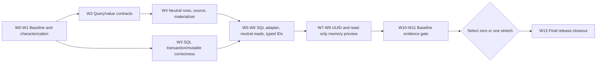

> [!WARNING]
> This folder contains roadmap material for the DataLinq 0.9 development line. It is not normative product documentation and must not be treated as a shipped support claim.

# DataLinq 0.9 Implementation Roadmap

**Status:** Implementation in progress. W0-W2 are complete. W3 now has the bounded mutable-provenance substrate and the command-free `ML-2` guard slice, while W4 has the canonical provider-value row buffer, reader-free model-row construction, shared bidirectional scalar conversion for materialization and typed model mutation serialization, checked integral auto-increment result hydration, canonical model-row/model-instance key normalization, source-scoped committed/transaction cache services, immutable primary-key row-loader contracts, a buffered SQL primary-key loader/decoder adapter, genuine neutral generated immutable construction, neutral generated database roots with legacy compatibility, and explicit insert write slots that preserve unset versus assigned-null provenance for a narrow reload-safe server-default path. SC-4 direct equality and local `Contains(...)`/equality-`Any(...)` now preserve canonical cache identity while binding lazily encoded physical parameters. `TX-1` successful-change recording/touched tracking, terminal invalidation and poisoning, join compatibility, structured-query diagnostics, deferred server-default shapes, and the remaining reader/external routes are next; live cache-cold model routing still waits for the full W3/W5 gate.

**Target release:** 0.9.

**Created:** 2026-07-03.

**Last reviewed:** 2026-07-11.

**Prerequisites:** DataLinq 0.8's production expression parser, immutable source-slot query-plan model, generated metadata/runtime path, and current SQL provider compliance coverage.

**Start here:** [0.9 Implementation Order And Integration Plan](Implementation%20Order%20and%20Integration%20Plan.md) is the authoritative cross-workstream sequence. This page owns release scope and claims; the order plan owns when overlapping work lands.

**First-slice record:** [Baseline And Release Harness Inventory](Baseline%20and%20Release%20Harness%20Inventory.md) freezes the query, transaction, provider, package, constrained-runtime, and performance before-state used by W2 and later work.

**W1 mutation-lifecycle matrix:** [Mutation Lifecycle Expected-Failure And Ownership Matrix](Mutation%20Lifecycle%20Expected-Failure%20and%20Ownership%20Matrix.md) classifies the unsafe and incomplete current paths without presenting them as shipped behavior, and assigns their executable acceptance work to W3.

**W3 current boundary:** `TX-0` is closed by that W1 evidence. The bounded `ML-1` substrate captures exact provider origin from an immutable row, uses an opaque exact-transaction token for transaction-local provenance, binds successful transaction hydration and mutable delete through owner-aware internal transitions, and permits lazy committed normalization only after provider commit, global publication, and transaction-local cache cleanup. The `ML-2` slice now rejects read-only/terminal transactions, invalid or deleted mutables, wrong provider or transaction owners, unsafe insert/update shapes, tracked or untracked primary-key drift, foreign metadata handles, and immutable deletes with a conflicting known owner before command construction. No-change and callback/generated routes use the same preflight, while public `StateChange` execution revalidates its captured table, columns, and identity. This is still not the W3 exit: `TX-1` touched-mutables/successful-change recording, rollback/disposal invalidation, poisoning and uncertain outcomes, full touched-mutable promotion, attached-transaction completion, and `F6` live read routing remain open.

## Release Thesis

0.9 should make DataLinq's query-plan boundary real without trying to finish every feature that the boundary could eventually enable.

The release should do three things well:

1. make query execution self-contained and backend-neutral below expression parsing
2. make scalar and UUID value conversion correct across the existing SQL providers
3. prove the architecture with a deliberately read-only `DataLinq.Memory` preview for generated models

It should also close two existing SQL-provider correctness gaps before DataLinq multiplies backend behavior: SQLite committed visibility and trustworthy mutable-instance baselines.

The intended release claim is narrow:

> DataLinq 0.9 introduces a backend-neutral read-query execution foundation, first-class scalar conversion and UUID storage codecs, and an AOT-friendly read-only memory preview that executes a documented subset of DataLinq query plans without SQL.

The release also aligns DataLinq-managed SQLite reads around committed visibility and makes mutable reuse explicit and safe across commit, rollback, failure, and transaction boundaries.

That is already a substantial release. Memory mutation, transactional snapshots, JSON commit logs, replay, broad join/grouping expansion, and production query-plan caching do not belong in the baseline. Putting all of them into 0.9 would turn one architecture proof into several unfinished products.

## Why The Foundation Comes First

W2 made the query template and invocation self-contained, but the lower read and execution stack is not yet backend-neutral:

- [`QueryPlanTemplate`](../../../../src/DataLinq/Linq/Planning/QueryPlanTemplate.cs), [`QueryPlanInvocation`](../../../../src/DataLinq/Linq/Planning/QueryPlanInvocation.cs), and self-contained projection recipes now separate structural shape from frozen execution values without retaining the original expression after parsing.
- [`CanonicalProviderValueRow`](../../../../src/DataLinq/Instances/CanonicalProviderValueRow.cs), [`ProviderRowMaterializer`](../../../../src/DataLinq/Instances/ProviderRowMaterializer.cs), and the trusted `RowData` factory establish and convert between separate canonical-provider and public model-value row representations; neutral-capable generated immutable models now consume that path without a SQL source.
- The expression executor directly constructs [`QueryPlanSqlBuilder`](../../../../src/DataLinq/Linq/Planning/Sql/QueryPlanSqlBuilder.cs), so SQL rendering remains the implicit execution center.
- [`IDatabaseProvider`](../../../../src/DataLinq/Interfaces/IDatabaseProvider.cs) exposes `IDbCommand`, `IDbConnection`, SQL rendering helpers, and database transactions. It is not a credible neutral contract for a memory backend.
- [`IDataLinqReadSource`](../../../../src/DataLinq/Interfaces/IDataLinqReadSource.cs) supplies the metadata-only model-construction identity. Existing SQL [`DataSourceAccess`](../../../../src/DataLinq/Mutation/DataSourceAccess.cs) instances now bind the shared materializer to source-scoped cache services without putting provider commands on that public contract; SQL database access and command loading remain legacy-specific.
- Newly generated database roots accept `IDataLinqReadSource`; Roslyn emits a distinct neutral root factory when it sees that exact constructor. Existing checked-in roots retain an additive default bridge and their concrete SQL-shaped cast until they are regenerated, so the migration does not break consumer assemblies.
- Cold cache and relation loads still issue provider commands directly through the existing source access path. A source-scoped primary-key loader/decoder adapter now exists, but live routing deliberately waits for the W3/W5 gate; relation loading remains later F6 work.
- Public [`IRowData`](../../../../src/DataLinq/Instances/RowData.cs) exposes model instance values. Quietly repurposing it as a provider-value store would leak storage representations through public model APIs.

The 0.9 foundation must address those facts. Adding an `IQueryPlanBackend` beside them while leaving every lower layer SQL-shaped would only create a memory provider full of throwing SQL stubs.

The detailed foundation work is tracked in [Query Backend And Execution Foundation Implementation Plan](Query%20Backend%20and%20Execution%20Foundation%20Implementation%20Plan.md).

## 0.9 Scope

| Bucket | Commitment |
| --- | --- |
| Baseline | Self-contained query template/invocation/request; backend-neutral source, execution, and row-materialization seams; capability validation; SQL adapter; scalar converters and typed IDs; UUID runtime correctness; SQLite committed visibility; mutable-instance lifecycle correctness for existing SQL providers; a vertical memory spike; a read-only memory preview; release evidence across providers, AOT, WebAssembly, packages, and docs. |
| Late stretch | Select **at most one** after the baseline is green: a bounded explicit SQL join slice, or manual snapshot-only JSON import/export for memory. Shipping neither is acceptable. |
| Deferred | Memory mutation and transactions; canonical commit batches; commit logs, replay, compaction, or flush-on-commit; persistence CLI commands; broad join/grouping work; relation-aware join sugar; left joins; production plan caching; general async APIs; arbitrary JSON mapping. |

## Dependency Graph

The exact dependencies, safe parallel lanes, ownership map, merge rules, and first implementation slice live in the [0.9 Implementation Order And Integration Plan](Implementation%20Order%20and%20Integration%20Plan.md). The release-level flow is:



The ordering has four important consequences:

- current behavior is characterized before contracts move
- SQL transaction/mutable semantics stabilize before neutral cache/relation read routing lands
- scalar normalization exists before typed-ID, UUID query, and memory behavior become separate collections of special cases
- the stretch decision happens after the baseline evidence gate, and final closeout reruns after the stretch decision

## Workstream: Query Backend And Execution Foundation

This workstream owns the architectural boundary.

### Self-contained execution request

Separate query structure from runtime values without promising a production cache:

- a structural query template contains sources, operations, result shape, binding declarations, and every projection recipe required for execution
- an invocation contains the frozen scalar and local-sequence values for one execution
- an execution request combines the invocation with a source/runtime context and cancellation state
- execution no longer receives the original expression as a hidden second plan
- row-local projection support either becomes an explicit, AOT-safe plan recipe or stays outside a backend's advertised capability set

Currently supported SQL row-local projections must become self-contained plan/compatibility recipes so existing behavior stays green; memory may reject those recipes. Neither backend may receive or reparse the original query expression.

The template may record explicit nullness, empty-membership, or cardinality specialization where current parsing/rendering semantics require it. 0.9 does not promise that one template is reusable across those specializations.

This separation is required for correctness and backend execution. It may make future plan caching possible, but 0.9 must not add a process-wide cache, cache eviction policy, public cache key, cross-specialization reuse, or performance claim based on hypothetical reuse. Focused tests may compare compatible structural templates and measure allocations; that is evidence, not a shipped caching feature.

### Backend-neutral source and materialization seams

Introduce narrow internal contracts for:

- metadata and source identity
- query-plan execution
- primary-key/source-row loading
- canonical provider-value row buffers
- shared conversion from provider values to model-valued `RowData`
- immutable instance creation and cache participation

Keep SQL-only operations behind SQL-specific interfaces. Raw SQL strings, `IDbCommand`, connections, and SQL transactions do not belong on the neutral memory-facing contract.

Do not turn existing public `RowData` into a provider-value bag. Use an internal row buffer, decode SQL wire representations into canonical provider CLR values, apply scalar conversion into model values, and only then expose/materialize the public model row. Cache keys and relation indexes should use normalized provider-key values without leaking those values through model properties.

### Capability validation

Add one validator between parsing and execution:

- the template declares or can be inspected for required operations, value kinds, projections, source counts, and result operators
- each backend advertises an explicit capability set
- invocation-sensitive limits, such as local sequence size, are validated with the invocation
- validation finishes before commands are sent or memory rows are enumerated
- unsupported shapes fail through a DataLinq-owned diagnostic naming the backend and unsupported plan feature
- there is no client-side or LINQ-to-Objects fallback

Universal unsupported expression shapes remain parser errors. A valid DataLinq plan that a particular backend cannot execute is a capability error. That distinction needs tests because it is part of the product's honesty.

### SQL adapter

Move existing SQL execution behind the new boundary rather than rewriting the SQL engine:

- wrap `QueryPlanSqlBuilder` and the current projection/materialization paths in the SQL backend adapter
- preserve current SQLite, MySQL, and MariaDB behavior and diagnostics
- route the terminal primary-key optimization through the same neutral source/backend contract instead of maintaining an unvalidated SQL-only escape route
- preserve telemetry, metrics, command ownership, and disposal semantics
- migrate cold cache and relation loads to neutral source operations while leaving raw SQL APIs explicitly SQL-only

The SQL adapter is the compatibility proof. The memory spike does not proceed to a public preview while existing providers require a parallel execution pipeline to stay green.

### Async-ready, not fake-async

0.9 does not promise a new public async query API. It should avoid making that future needlessly expensive:

- carry a `CancellationToken` in the internal execution context
- check cancellation before I/O and at bounded points in memory scans, ordering, and materialization
- keep result/cursor ownership explicit so a future async SQL reader can have a real lifetime
- avoid neutral interfaces whose only possible implementation is synchronous `IEnumerable<T>` over an already-open provider reader
- keep `System.Data` async details inside the SQL adapter
- do not add `Task.FromResult`, thread-pool wrappers, or fake asynchronous memory methods

Native asynchronous database execution and public cancellation-aware terminal operators remain follow-up product work.

## Workstream: Scalar Values, Typed IDs, And UUIDs

UUID correctness should be in 0.9. It is not decorative scope: the current storage format can affect whether a correct-looking equality or `Contains(...)` query finds an existing row.

The value pipeline must distinguish three layers:

```text
model CLR value -> canonical provider CLR value -> provider/column wire value
```

Examples:

- `CustomerId` to `int` is scalar model/provider conversion.
- canonical `Guid` to MySQL `BINARY(16)` bytes is a column storage codec.
- SQLite text UUID and MariaDB native UUID are different wire choices for the same canonical value.

Those layers should share metadata and normalization entry points without pretending they are the same conversion.

### Baseline scalar and typed-ID slice

The baseline follows [Scalar Converter Support](../../metadata-and-generation/Scalar%20Converter%20Support.md) and the focused [Scalar Converters And Typed IDs Implementation Plan](Scalar%20Converters%20and%20Typed%20IDs%20Implementation%20Plan.md):

- explicit converter metadata and registration
- separate model and provider CLR types on column metadata
- centralized conversion for reads, writes, query constants, local sequences, keys, foreign keys, relation lookup, cache identity, generated/default values, and schema validation
- typed-ID primary keys and foreign keys
- direct equality and local `Contains(...)`
- explicit join-key normalization where the already-supported SQL join shape uses compatible provider types
- clear rejection of value-object member queries that are not part of scalar conversion

Generated typed-ID source output and adapter packages for third-party typed-ID libraries are later work. Explicit converters must become boring before convenience generation is added.

### Baseline UUID runtime-correctness slice

The baseline takes the correctness-critical portion of [UUID Storage Format Support](../../providers-and-features/UUID%20Storage%20Format%20Support.md):

- explicit/resolved UUID storage metadata and a tested codec
- backward-compatible MySQL `BINARY(16)` defaults for existing DataLinq data
- column-aware read and write conversion for SQLite, MySQL, and MariaDB
- direct equality, nullable equality, local `Contains(...)`, primary-key/cache loads, relation predicates, update/delete keys, and static defaults using the same codec
- diagnostics for the `DefaultNewUUID(UUIDVersion.Version7)` versus MySQL/MariaDB `UUID()` semantic mismatch
- schema validation that distinguishes compatible type shape from an unknown or incompatible UUID byte layout
- server tests that do not rely on a matching MySqlConnector `GuidFormat` connection option

Ambiguous-schema import UX, new UUID CLI configuration, automatic data migration between binary layouts, and changing compatibility defaults are not baseline work. `BINARY(16)` does not describe its byte order; 0.9 must report that ambiguity rather than guess destructively.

## Workstream: Existing SQL Transaction Correctness

The trimmed memory backend is read-only, but the existing SQL write path still has correctness work that matters more than speculative persistence features. 0.9 should close it before adding another mutable backend.

The detailed designs own this work:

- [SQL Transaction And Mutable Lifecycle Implementation Plan](SQL%20Transaction%20and%20Mutable%20Lifecycle%20Implementation%20Plan.md)
- [SQLite Transaction Isolation Alignment](../../providers-and-features/SQLite%20Transaction%20Isolation%20Alignment.md)
- [Mutable Instance Lifecycle](../../query-and-runtime/Mutable%20Instance%20Lifecycle.md)

The release boundary is:

- DataLinq-managed SQLite reads use committed visibility rather than relying on shared-cache dirty reads
- transaction-local rows, tombstones, relation views, and mutable baselines remain local until the provider commit succeeds
- committed/global cache publication and relation notification happen after provider commit, not after each attempted write
- rollback or disposal discards transaction-local state without publishing it globally
- a mutable baseline records provider and transaction provenance
- reuse inside the owning active transaction and after a successful commit is well-defined
- reuse through another transaction, after rollback/disposal, after deletion, or after an uncertain failed write is rejected with an actionable diagnostic
- ordinary primary-key mutation and writes through read-only transactions are rejected
- SQLite documentation describes committed visibility honestly without claiming literal equivalence to MySQL/MariaDB `ReadCommitted`

This is existing SQL-provider mutation correctness, not a provider-neutral mutation architecture. It does not authorize memory mutation, commit batches, persistence hooks, or transaction-parity claims for the read-only memory preview.

Coordinate cache/source edits with the query foundation so each artifact has one owner:

- the query foundation owns neutral read, cache-miss, and materialization seams
- the transaction plans own pending-versus-committed cache publication and mutable provenance
- regression tests own the point where those seams meet

## Workstream: Vertical Memory Spike

Before a public package or polished builder API, build one end-to-end spike through the real architecture:

```text
expression parser
  -> structural template + invocation
  -> capability validation
  -> memory executor
  -> canonical provider-value row
  -> shared model materializer/cache
  -> generated immutable model or direct projection
```

The spike should prove:

- one generated database and a small seeded table
- primary-key lookup
- one scalar predicate with a captured value
- ordering plus `Take`
- an entity result and one direct scalar projection
- `Any` or `Count`
- the same request shape executing through the SQL adapter for parity
- a deterministic unsupported diagnostic for a join or grouping plan
- cancellation before execution and during a bounded memory scan
- browser/WebAssembly AOT execution without SQLite, SQL generation, `Expression.Compile()`, or runtime code generation

The spike fails if memory requires SQL-shaped stubs, reparses the original expression, stores immutable model instances as database state, or bypasses the shared materialization/cache boundary. Fix the foundation before expanding the memory feature.

## Workstream: Read-Only Memory Preview

The durable design remains in [Memory Backend Architecture](../../backends/memory/Architecture.md). The 0.9 release filter is intentionally narrower than that document, and the executable slice is tracked in [Read-Only Memory Backend Implementation Plan](In-Memory%20Database%20Implementation%20Plan.md).

### Baseline capability set

The preview should support only generated models, one root table per query, and explicitly seeded canonical rows. Its initial query set is:

- primary-key lookup
- single-source scalar equality, inequality, ordering comparisons, null checks, boolean `And`/`Or`/`Not`, and local scalar membership
- `OrderBy`, `ThenBy`, `Skip`, and `Take`
- `Any`, `Count`, `First`, `FirstOrDefault`, `Single`, and `SingleOrDefault`
- entity and direct scalar projections represented completely in the plan
- direct column-backed constructor/anonymous-row projections only if the memory materializer has explicit Native AOT and WebAssembly evidence; otherwise they remain outside the 0.9 memory capability set
- deterministic seed loading into isolated store instances suitable for tests and examples
- clear capability failures for every unsupported operation

The exact matrix may be narrower if parity evidence exposes ambiguous null, string, date/time, or ordering semantics. The memory backend may be stricter than SQL in 0.9; it must never silently be looser.

### Baseline exclusions

The memory preview does not include:

- insert, update, delete, `Save`, or provider-neutral mutation
- transactions, isolation, rollback, conflict detection, generated identities, or constraint emulation
- commit batches, logs, replay, forks, compaction, or failure injection
- automatic persistence or background flush
- raw SQL
- joins, grouping, relation predicates, or implicit collection expansion
- post-paging `Pushdown`, unless it is deliberately added to the capability matrix with ordering/paging parity tests
- generated relation navigation/lazy relation loading; accessing it must fail through the memory read-source capability boundary rather than falling into SQL-shaped access
- computed row-local projections that are not fully represented by the execution template
- a promise of SQL collation, null, date/time, or concurrency parity

Mutation APIs exposed by shared surfaces must fail immediately with a precise preview-capability diagnostic; they must not partially mutate state or masquerade as successful no-ops.

The user-facing description should say **read-only preview**. Calling this a general database replacement would be fiction.

## Late Stretch Decision

After all baseline gates are green, choose zero or one candidate. Do not develop both in parallel.

| Candidate | Maximum acceptable slice | Explicit exclusions |
| --- | --- | --- |
| Bounded SQL join continuation | Chained explicit inner joins over direct source-slot equi-keys, direct SQL-backed projection rows, and composite keys only if they use the same completed normalization primitive. | Grouping continuation, `GroupJoin`, left/outer joins, relation-aware `JoinBy`/`JoinMany`, collection expansion, or client fallback. |
| Manual JSON snapshot | A deterministic, versioned snapshot format that can be explicitly exported from and loaded into a read-only memory store. Manual API calls only. | Mutation, flush-on-commit, logs, replay, compaction, schema migrations, CLI commands, browser storage adapters, or arbitrary existing JSON documents. |

Use [Join And Grouping Continuation Implementation Plan](Join%20and%20Grouping%20Continuation%20Implementation%20Plan.md) or [Memory JSON Persistence Implementation Plan](Memory%20JSON%20Persistence%20Implementation%20Plan.md) only after applying the release filter above. Their wider designs remain backlog material, not an excuse to smuggle a second release into the stretch.

Selection criteria:

- the baseline has complete SQL, memory, value-conversion, and constrained-runtime evidence
- the candidate can finish without changing a baseline architectural contract
- the candidate has a small, documentable support matrix
- implementation and verification fit inside the remaining release budget
- choosing it does not delay correctness fixes

If neither candidate meets those conditions, 0.9 ships without a stretch. That is discipline, not failure.

## Release Evidence

0.9 is not complete when the APIs compile. It is complete when the following evidence exists.

Execution, commands, artifact ownership, provider targets, package/API checks, blocker policy, and the distinction between early harness work and the final frozen-candidate run are owned by [Release Evidence And Closeout Implementation Plan](Release%20Evidence%20and%20Closeout%20Implementation%20Plan.md).

### Query and SQL compatibility

- parser/template snapshots prove runtime values are absent from structural templates
- invocation isolation tests prove repeated executions cannot share captured values accidentally
- self-contained execution tests prove executors do not receive or reparse the original expression
- capability validation tests cover operations, projections, values, result operators, and invocation-sensitive limits
- the existing documented SQL query subset remains green on SQLite, MySQL, and MariaDB
- read-only and transaction query roots retain parity on SQL providers
- primary-key optimizations, cold cache loads, and relation loads still use correct telemetry and cache identity

### Scalar and UUID correctness

- typed IDs cover reads, writes, equality, `Contains`, keys, foreign keys, relations, generated values, and schema validation
- provider/model/wire conversions are tested separately and together
- MySQL `BINARY(16)` equality and `Contains` pass without connection-string-dependent UUID behavior
- MariaDB native UUID and SQLite text UUID behavior pass provider tests
- legacy MySQL little-endian binary data remains readable
- incompatible or unknown UUID layouts and database-side UUID-version mismatches produce actionable diagnostics

### SQL transaction correctness

- SQLite no longer enables dirty-read behavior as the normal DataLinq visibility mechanism
- owning transactions see their pending DataLinq-managed changes while normal database reads do not see them before commit
- global cache and relation notification occur only after provider commit succeeds
- rollback and open-transaction disposal discard pending state without exposing it
- mutable reuse, commit promotion, cross-transaction rejection, rollback invalidation, failed-write handling, deletion, primary-key mutation, and read-only transaction guards pass SQLite, MySQL, and MariaDB compliance tests
- raw SQL and externally performed writes remain documented outside guarantees that DataLinq cannot enforce

### Memory preview

- every advertised memory query shape has unit and compliance-style behavior tests
- unsupported joins, grouping, mutations, and row-local projection shapes fail before enumeration changes observable state
- primary-key and scan paths use normalized provider values
- SQL and memory results are compared for the shared supported subset with semantic differences explicitly documented
- deterministic seeding and database-instance isolation are proven

### Compatibility, packaging, and performance

- core package targets build for the repository's `net8.0`, `net9.0`, and `net10.0` matrix
- promoted `DataLinq.Memory` preview packages have deliberate dependencies and no accidental SQLite/native provider payload
- public API compatibility is reviewed; neutral internal seams do not force needless breaks in SQL provider APIs
- generated Native AOT and trimmed smokes execute the memory path
- Blazor WebAssembly no-AOT and AOT browser smokes execute seed, query, direct scalar projection, and unsupported-diagnostic paths without native SQLite
- package/size reports include the new package and constrained target rather than relying on the historical target list
- focused benchmarks record parsing, invocation creation, memory lookup/scan, and allocation baselines without claiming production plan-cache wins

The constrained-runtime work should build on [Practical AOT And Size Plan](../../platform-compatibility/Practical%20AOT%20and%20Size%20Plan.md). A successful SQLite WebAssembly smoke does not prove the new memory path; the release evidence must run memory directly.

### Documentation

- public docs clearly separate production SQL providers, SQLite in-memory mode, and the read-only DataLinq memory preview
- [Supported LINQ Queries](../../../Supported%20LINQ%20Queries.md) and the [LINQ Translation Support Matrix](../../../support-matrices/LINQ%20Translation%20Support%20Matrix.md) list memory support per shape rather than inheriting SQL claims
- UUID storage defaults and compatibility behavior are documented per provider
- roadmap-only mutation, transaction, persistence, cache, and stretch features are not presented as shipped
- generated DocFX output is checked when navigation or public pages change

## Baseline Exit Criteria

The baseline gate is green only when all of the following are true:

- SQL execution consumes the same self-contained request shape as memory
- `ExpressionQueryPlanExecutor` no longer needs the original expression for supported execution
- memory does not implement SQL-only provider members as throwing placeholders
- capability validation occurs before backend work
- scalar and UUID normalization use shared metadata-driven entry points
- SQLite committed visibility and mutable baseline provenance pass the existing SQL provider compliance matrix
- the read-only memory subset passes its documented matrix under normal .NET and browser AOT
- existing providers remain green
- package, API, performance, and documentation evidence is recorded

## Explicit Non-Goals

- production query-plan caching, eviction, or a public cache-key contract
- general backend plugin APIs or a claim that arbitrary backends can execute DataLinq plans
- provider-neutral mutation or transactions
- memory insert/update/delete support
- commit batches, event streams, logs, replay, compaction, or CDC
- JSON flush-on-commit or automatic persistence
- new persistence CLI commands
- arbitrary JSON mapping, JSONPath querying, or a standalone JSON backend
- broad multi-join/grouping continuation in the baseline
- materialized `IGrouping<TKey,TElement>`, `GroupJoin`, or left joins
- generated typed-ID output or automatic third-party typed-ID discovery
- a general value-object query language
- public asynchronous query/mutation APIs in this release
- replacing SQL provider integration tests with memory tests

## Follow-Up After 0.9

Once the backend read boundary has evidence, the sensible follow-up queue is:

1. native async/cancellation-aware SQL query and mutation APIs
2. dependency injection, explicit unit-of-work, startup validation, and testing integration
3. provider-neutral mutation built on the trustworthy SQL mutable-instance lifecycle
4. isolated memory transactions, constraints, deterministic keys, and committed-change receipts
5. snapshot persistence, then logs/replay only if mutation produces a clean committed artifact
6. the unselected join or snapshot stretch
7. production plan caching only after benchmarks justify lifetime, identity, concurrency, and eviction rules

The related longer-term plans remain useful, but they are not 0.9 promises:

- [JSON Persistence Store Architecture](../../backends/memory/persistence/json/JSON%20Persistence%20Store%20Architecture.md)
- [Relation-Aware Join API](../../query-and-runtime/Relation-Aware%20Join%20API.md)
- [Dependency Injection And Hosting Integration](../../architecture/Dependency%20Injection%20and%20Hosting%20Integration.md)

## Open Decisions

Only decisions that can still change the baseline belong here:

- Which provider-neutral null and string semantics should memory define, and which provider differences must remain explicit?
- Does the separate, initially non-packable `DataLinq.Memory` project pass the promotion gate and earn its preview NuGet package? Failure requires an explicit roadmap re-scope; memory does not move into core as a shortcut.
- Which, if either, late stretch candidate earns the remaining release budget?
