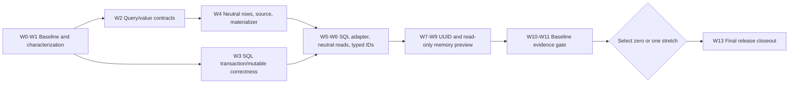

> [!WARNING]
> This folder contains roadmap material for the DataLinq 0.9 development line. It is not normative product documentation and must not be treated as a shipped support claim.

# DataLinq 0.9 Implementation Roadmap

**Status:** Implementation in progress. W0-W2 and `F5` are complete; W3-W5 remain active. The transaction, canonical-row/materialization, primary-key read, scalar-conversion, and UUID storage checkpoints documented below remain bounded rather than aggregate completion claims. Bounded `F4-B/F5-A/F5-B/F5-C/F5-D` adds the production exactly-once capability gate plus complete SQL adapters for every retained expression-query result family, including post-validation scalar-primary-key optimization and explicit result/cursor/cancellation/command ownership. Memory capabilities/backend remain open. Raw low-level escape prevention, local-cleanup fault boundaries, connector-native/full provider commit-fault evidence, join compatibility, structured-query diagnostics, indexed and unknown-key server-default shapes, UUID routes beyond the bounded slices, legacy fallback removal, string/CHAR keys, composite and relation/index/foreign-key UUID routing, general UUID projections and manual `SqlQuery`, joined typed-UUID key hydration, member-init row evidence, joined/function-derived grouped keys, converter-backed aggregate values, `HAVING`, provider-less readers, Native AOT/browser publication, and remaining reader/external routes are also open. W3, W5, F4, F6, UUID-2, and UUID-3 remain incomplete.

**F4-B/F5 capability and execution progress:** The 598-feature vocabulary and exhaustive SQL profile remain unchanged at 343 supported and 255 unsupported dispositions. Every production expression query creates one `QueryExecutionRequest`, selects the source-owned backend, extracts requirements, and validates exactly once before backend work. The SQL adapter owns the complete entity family, all six scalar reductions, every currently supported direct SQL projection (`ScalarMember`, `SqlRow`, and `GroupedAggregate`), and every retained local projection (`Anonymous`, `ComputedRowLocal`, and `JoinedRowLocal`) for their parser-supported sequence and terminal shapes. One typed semantic projection cursor carries final results without exposing a reader, command, `DBNull`, alias, provider-width artifact, or SQL row envelope. `SqlLocalProjectionExecutor` now owns SQL row loading, joined-key buffering/cache hydration, normalized recipe evaluation, result conversion, and bounded cancellation checks; `ExpressionQueryPlanExecutor` no longer constructs `QueryPlanSqlBuilder` or contains a SQL compatibility executor for a supported projection. Contract coverage freezes exactly-once backend dispatch for all three local kinds, terminal dispatch, `AotStrict` execution for `AotSafe` computed recipes, and pre-dispatch rejection for SQL-only anonymous and joined-local recipes. The integrated `F5-D` gate passes `57/57` generator tests, `1117/1117` unit tests, `788/788` SQLite compliance tests, `796/796` in each paired server run, and `160/160` plus `162/162` provider-specific executions.

`F5` completion is deliberately an adapter-routing claim, not neutral-read or observability completion. Single-source local recipes still reproject through the synchronous SQL entity loader, so cancellation is checked before and between bounded local work but is not yet a provider-native cancellable entity read. Joined local recipes still buffer provider primary keys before hydrating source rows through `TableCache`; converted/composite/string/UUID joined-key neutrality remains `F6` work. Existing route-specific telemetry is preserved: single-source local loading retains entity-query/cache accounting, while joined key selection retains reader-command attribution and any later cache loads keep their established accounting. No backend-neutral local-projection telemetry category is claimed. The memory capability profile/backend also remains open, so `F4`, `F6`, and `W5` are not complete.

**Default-only insert progress:** An unassigned null auto-increment primary key is now omitted when its canonical provider type is integral, including converter-backed model IDs. An otherwise zero-column insert renders through provider-owned syntax as SQLite `DEFAULT VALUES` or MySQL/MariaDB `() VALUES ()`. The same bounded authoritative-reload path hydrates provider-applicable, non-indexed converter-backed server defaults when the primary-key shape is `F6-A` compatible. The focused converted-default active-provider matrix passes `4/4`; full unit, generator, SQLite compliance, and MySQL/MariaDB compliance runs pass `1051/1051`, `57/57`, `746/746`, and `748/748`. Assigned nulls and explicit identity values remain writes. Providers that do not declare default-only syntax retain the legacy null-key write and empty-query `VALUES (NULL)` fallback. Indexed defaults, unknown non-auto keys, non-integral generated IDs, server-default/generated-key hydration over string/CHAR or UUID key shapes, and the remaining live read families remain open, so SC-2 is not complete.

**SQL projection progress:** SQL `ScalarMember` projections over converter-backed columns now decode the selected physical value to the column's canonical provider CLR value and apply the shared scalar materializer before adapting the declared result type. Active-provider compliance evidence covers root and joined `QueryTypedId` projections, nullable typed-ID columns, lifting a non-null typed ID to nullable, boxing while preserving the model wrapper, terminal `Single()`, and direct execution with `ProjectionEvaluationOptions.AotStrict`. The same boundary now materializes converter-backed column members in aliased anonymous SQL `SqlRow` projections while preserving their existing `SqlOnlyCompatibility` disposition; active-provider evidence covers root and joined rows, nullable and lifted-nullable members, boxing that preserves the model wrapper, and terminal `Single()`. Explicit model-to-`int` scalar projection conversion remains a focused translation rejection. This is evidence for an `int`-backed typed ID, not proof of general nullable `.Value`/`.HasValue` predicate or projection translation beyond the exact same-mapping join-key shape exercised here, arbitrary numeric converter widening or narrowing, Native AOT or browser execution, implicit-relation or member-init row projections, grouped/aggregate conversion outside the bounded key-only slice below, or retained local recipes beyond the bounded single-source `NewArray` slice below. `SC-2` remains open.

**Explicit-constructor SQL row evidence:** Constructor-backed DTO/record `SqlRow` projections now have active-provider evidence through the same converter-aware result-alias boundary. The matrix covers root and joined source slots, non-nullable, nullable, lifted-nullable, and boxed typed-ID arguments, plus terminal `Single()`. Plan assertions preserve the exact result and constructor types and the existing `SqlOnlyCompatibility` disposition; `ProjectionEvaluationOptions.AotStrict` intentionally rejects the reflective constructor path. Full gates pass `1051/1051` unit, `57/57` generator, `752/752` SQLite compliance, `1416/1416` compliance across MySQL 8.4 and MariaDB 10.11/11.4/11.8, and `160/160` in the latest MySQL/MariaDB provider-specific lane. This is evidence for direct constructor arguments only. It does not add member-init support, implicit-relation columns, post-`Select` DTO-member composition, Native AOT/browser construction, or memory-backend execution.

**Implicit-relation SQL row evidence:** A dedicated primitive-PK/FK fixture now proves that converter-backed non-key values selected through a one-hop singular implicit relation retain the related table's column metadata through `ImplicitJoin` planning, SQL aliasing, and `SqlRow` materialization. Active-provider coverage includes non-nullable, nullable, lifted-nullable, boxed, and terminal results, and plan assertions prove one root plus one implicit-join source with converter-backed related columns. Full gates pass `1051/1051` unit, `57/57` generator, `754/754` SQLite compliance, `1420/1420` compliance across MySQL 8.4 and MariaDB 10.11/11.4/11.8, and `160/160` in the latest MySQL/MariaDB provider-specific lane. This is direct SQL join projection evidence only. It does not establish converted relation keys, lazy relation loading, relation cache/index normalization, nullable left-join semantics, multi-hop or collection traversal, member-init/local recipes, AOT/browser execution, or memory-backend relations.

**AOT-safe local projection evidence:** A single-source typed-ID query proves that retained `ComputedRowLocal` `NewArray` recipes read converter-backed values from materialized model rows and execute under `ProjectionEvaluationOptions.AotStrict`. Active-provider coverage includes non-nullable, nullable, lifted-nullable, boxed-nullable, `HasValue`, conditional `.Value`, ordinary sequence execution, and terminal `Single()` after explicitly clearing the table cache; exact type assertions show that no canonical `int` leaks into the recipe result. The evidence does not instrument a specific loader implementation and is bounded to the current integral-canonical SQL entity-key configuration. Full gates pass `1051/1051` unit, `57/57` generator, `756/756` SQLite compliance, `1424/1424` compliance across MySQL 8.4 and MariaDB 10.11/11.4/11.8, and `160/160` in the latest MySQL/MariaDB provider-specific lane. As a single-source slice, it does not establish joined-local execution, constructor/member-init local recipes, string/CHAR, `Guid`/binary, composite or unknown-key neutral hydration, custom sources, Native AOT/browser publication, or memory-backend recipe execution.

**Joined-local converter evidence:** A dedicated primitive-PK/FK fixture proves that explicit-inner-join `JoinedRowLocal` `NewArray` SQL execution reloads both source rows and feeds converter-backed joined-source columns to the normalized recipe as model values. Active-provider coverage after explicit cache clearing includes non-nullable, nullable, lifted-nullable, boxed-nullable, `HasValue`, and conditional `.Value` shapes; plan assertions record one root plus one explicit-join source, primitive non-converted `int` primary keys, and converter metadata on the joined columns, while exact result types show that no canonical `int` leaks through those converter slots. The `NewArray` recipe is `AotSafe`, but the enclosing joined projection intentionally remains `SqlOnlyCompatibility` because joined-row execution is SQL-only; `AotStrict` rejection is therefore preserved and asserted. The focused active-provider matrix passes `6/6`. Two preceding concurrent four-target attempts reached `1426/1428` and `1427/1428`; their only failures were unrelated connection refusals, and every exact failing test passed on its immediate target-specific rerun. Full gates pass `1051/1051` unit, `57/57` generator, `758/758` SQLite compliance, `426/426` on each of MySQL 8.4 and MariaDB 10.11/11.4/11.8 (`1704/1704` sequential server executions after concurrent connection instability), and `160/160` in the latest MySQL/MariaDB provider-specific lane. This does not establish converted, composite, string, `Guid`, binary, or codec-sensitive joined keys, implicit or outer joins, nullable missing-source rows, joined terminal/paging composition, custom or memory backends, or Native AOT/browser publication.

**Grouped-key projection progress:** Model-compatible converter-backed column keys in direct SQL `QueryPlanProjection.GroupedAggregate` results now use the same per-column physical-to-canonical-to-model boundary while retaining `SqlOnlyCompatibility`. Active-provider evidence covers scalar, nullable, boxed, and anonymous composite group keys projected through named members. Ordinary `Count()` members continue through the raw aggregate-value path, and an explicit `QueryTypedId`-to-`int` group key retains the raw provider-value fallback rather than being rematerialized as a wrapper. This bounded slice does not establish joined or function-derived group keys, supported converter-backed aggregate execution, general `HAVING`, Native AOT or browser execution, backend-neutral or memory grouping, or general collation/codec semantics. Full unit, generator, SQLite compliance, and MySQL/MariaDB compliance runs pass `1051/1051`, `57/57`, `746/746`, and `748/748`. `SC-2` remains open.

**Converted-aggregate semantics guard:** Scalar and grouped `Sum`, `Min`, `Max`, and `Average` now fail during expression-plan translation when their selector resolves to a converter-backed column, including aggregate use in grouped `HAVING`. The scalar converter contract declares only per-value conversion; it does not declare the additive, ordering, or mean-preserving semantics needed to aggregate canonical provider values as model values. Applying `FromProvider` once to a SQL aggregate result would therefore be unsound. Selectorless `Count` and `Any`, plus grouped `Count()`, remain supported. Active-provider tests use a deliberately non-aggregate-preserving numeric converter and prove the rejection occurs before any SQL command. Full gates pass `1051/1051` unit, `57/57` generator, `750/750` SQLite compliance, `1412/1412` compliance across MySQL 8.4 and MariaDB 10.11/11.4/11.8, and `160/160` in the latest MySQL/MariaDB provider-specific lane. Aggregate capability metadata and supported converter-backed aggregate execution remain future work; this guard prevents a silent wrong-result claim rather than completing that work.

**UUID-1 progress:** `UUID-1A` freezes the five-format vocabulary, multi-provider declarations, intrinsic validation, strict canonical-`Guid`/physical codecs, and lossless raw-declaration round-trips. `UUID-1B` adds immutable provider-keyed `GuidStorageDefinition` metadata, canonical-`Guid` eligibility after scalar conversion, built-in effective physical-type selection, exact-over-default resolution, MySQL/MariaDB little-endian compatibility defaults, explicit SQLite `BLOB` byte order, durable provider-snapshot uncertainty with a blocking model-source diagnostic, generated-definition carriage, and inconsistent carried-definition rejection. SQLite, MySQL, and MariaDB readers/writers consume those definitions for non-primary-key full-row canonical `Guid` mutation and materialization across each provider's direct text/native/binary matrix, plus representative binary converter-backed typed IDs and nullable direct/typed Text36/SQL NULL. The bounded UUID-3A/3B expression-query slices consume the same definitions for column-aware non-key equality and membership, including captured nulls and null-containing nullable sequences. Bounded UUID-3C consumes them for an exact scalar direct or Guid-backed typed primary key. Composite UUID keys, other independently instantiated typed formats, projections, manual string-only `SqlQuery`, remaining query routes, relations, defaults, and schema comparison remain open; aggregate `UUID-2` and `UUID-3` are not complete.

**SQLite UUID-2 provider progress:** A bounded SQLite-first `UUID-2` checkpoint requires exact resolved SQLite UUID storage metadata when mapped canonical `Guid` values cross the provider boundary. The writer encodes non-primary-key canonical `Guid` mutation values through `GuidCodec`, and the column-aware reader decodes raw TEXT/BLOB values through the same resolved format before full-row materialization. Direct coverage includes non-nullable `Guid` across inferred Text36, explicit Text32, little-endian BLOB, and RFC-order BLOB, plus nullable Text36/SQL NULL. The same frozen write/raw-seed/update lifecycle proves a converter-backed typed ID over RFC-order BLOB and a nullable typed ID over Text36/SQL NULL. That original checkpoint excluded UUID primary keys; bounded UUID-3C now covers a direct little-endian BLOB scalar key and a Guid-backed typed RFC-order BLOB scalar key through exact reads, writes, cache loading, and mutation predicates. The earlier focused SQLite matrix passed `2/2`, the full unit and SQLite compliance gates passed `1055/1055` and `760/760`, and `DataLinq.SQLite` built cleanly for `net8.0`, `net9.0`, and `net10.0`. Other typed formats, projection result decoding, remaining UUID predicates/membership, composite keys, relations, defaults, ambiguous BLOB metadata, other SQLite reader routes, memory, and Native AOT/browser publication remain outside these slices; aggregate `UUID-2` is not complete.

**MySQL/MariaDB UUID-2 provider progress:** Provider-owned database access and transaction readers retain exact MySQL versus MariaDB identity, and the shared writer takes the same identity from the selected provider factory. Non-primary-key full-row canonical `Guid` values consume native MariaDB UUID, Text36, Text32, little-endian `BINARY(16)`, and RFC-order `BINARY(16)` definitions. Binary reads bypass connector UUID conversion through raw bytes; text/native reads accept raw text or connector-canonical `Guid`. Frozen non-symmetric vectors prove exact writes, independently raw-seeded reads, normal and transaction access, update re-encoding, nullable Text36/SQL NULL, and provider-differentiated binary byte order under no `GuidFormat`, `Char32`, `Binary16`, and `LittleEndianBinary16`. The same lifecycle proves a converter-backed typed ID as little-endian binary on MySQL and RFC-order binary on MariaDB, plus nullable typed Text36/SQL NULL. That original checkpoint excluded UUID primary keys; bounded UUID-3C now opts exact scalar direct and Guid-backed typed keys into the column-aware reader, writer, key-selection, neutral cache-load, and mutation-predicate paths. It proves MySQL little-endian binary versus MariaDB RFC-order binary under the same absent/adversarial connector `GuidFormat` modes. The earlier full gates passed `1055/1055` unit, `760/760` SQLite compliance, `429/429` on each of MySQL 8.4 and MariaDB 10.11/11.4/11.8 (`1716/1716` sequential server executions), plus `102/102` MySQL and `104/104` on each MariaDB target in the provider-specific suite (`414/414`). `DataLinq.MySql` built cleanly for `net8.0`, `net9.0`, and `net10.0`; the generator surface was unchanged and not rerun. Provider-less public reader/access/transaction construction retains legacy behavior. Other typed formats, composite keys, projections, remaining predicates/membership, relations, defaults, memory, and Native AOT/browser publication remain outside the evidence claim; aggregate `UUID-2` is not complete.

**UUID-3 query-parameter progress:** `UUID-3A` proved that the existing SC-4 canonical-column operand route reaches exact non-primary-key provider writers without a production-route change. Equality covers every direct bounded SQLite, MySQL, and MariaDB format; deeper cases cover direct and representative typed binary equality, inequality, local `Contains(...)`, and supported equality-`Any(...)`, while nullable direct and typed Text36 covered non-null values and literal `null`. Exact captured parameters and selective non-symmetric values prove the resolved column's text or byte layout. Its full gates passed `1055/1055` unit, `762/762` SQLite compliance, `432/432` on each server target (`1728/1728` sequential), and `414/414` provider-specific executions.

**UUID-3 nullable-invocation progress:** Bounded `UUID-3B` makes nullness structural where SQL shape depends on it. A local-sequence template records total count plus null count; explicit rebinding rejects either mismatch, while same-shape rebinding refreshes values and null position. Captured scalar null comparisons render literal `IS NULL`/`IS NOT NULL` with zero parameters. Nullable `Contains(...)` and equality-`Any(...)` partition nulls into two-valued SQL: positive non-null-only membership uses `IN (...) AND IS NOT NULL`; positive mixed uses `IN (...) OR IS NULL`; negative non-null-only uses `NOT IN (...) OR IS NULL`; negative mixed uses `NOT IN (...) AND IS NOT NULL`; null-only and empty inputs collapse to `IS NULL`/`IS NOT NULL` and fixed false/true. The positive non-null-only guard preserves C# behavior under outer negation and compound Boolean composition. Only non-null members bind through the target column codec. Focused direct-`Guid?` and Guid-backed typed nullable Text36 evidence covers SQLite file/memory and the existing MySQL/MariaDB `GuidFormat` loops. Focused results are `21/21` invocation, `10/10` node, `25/25` parser/snapshot, `38/38` SQL-parity, `2/2` generic nullable SQLite, `4/4` UUID SQLite, `2/2` MySQL 8.4, and `2/2` MariaDB 11.8. Full gates pass `1057/1057` unit, `766/766` SQLite compliance, `435/435` on each server target (`1740/1740` sequential), and `414/414` provider-specific executions. Manual string-only `SqlQuery`, UUID primary/composite keys, cache/relation/update-delete key paths, projections, defaults, other typed formats, provider-less readers, memory, and Native AOT/browser publication remain outside the claim; aggregate `UUID-3` is not complete.

**UUID-3 scalar-key progress:** Bounded `UUID-3C` admits the neutral source-row path only for exactly one canonical `Guid` primary-key component with an exact resolved definition for the concrete SQLite, MySQL, or MariaDB source. Direct `Guid` and a representative Guid-backed typed ID use provider column codecs for full-row decoding, scalar key selection, insert/update/delete values, and update/delete predicates. Cold generated `Get(...)`, batched entity queries, transaction authoritative reload, and warm reference identity preserve the existing cache contract. SQLite proves direct little-endian BLOB and typed RFC-order BLOB keys; MySQL/MariaDB prove provider-differentiated MySQL little-endian versus MariaDB RFC-order binary under absent, `Char32`, `Binary16`, and `LittleEndianBinary16` connector settings. Composite UUID keys, relation/index/foreign-key routing, general scalar/projection decoding, manual string-only `SqlQuery`, joined typed-UUID key hydration, provider-less readers, memory, Native AOT/browser publication, defaults, schema comparison, and other typed formats remain open; W3, F6, SC-3, UUID-2, and UUID-3 are not complete.

Focused `UUID-3C` evidence is `2/2` on SQLite file/memory, `1/1` for the new scalar-key case on MySQL 8.4 and MariaDB 11.8, and `3/3` for the full UUID fixture on those two server targets. The integrated gates pass `1059/1059` unit, `57/57` generator, `768/768` SQLite compliance, `438/438` on each of MySQL 8.4 and MariaDB 10.11/11.4/11.8 (`1752/1752` sequential server executions), and `414/414` provider-specific executions. This is evidence for the bounded scalar-key checkpoint, not aggregate UUID completion or the final frozen-candidate rerun.

**Target release:** 0.9.

**Created:** 2026-07-03.

**Last reviewed:** 2026-07-13.

**Prerequisites:** DataLinq 0.8's production expression parser, immutable source-slot query-plan model, generated metadata/runtime path, and current SQL provider compliance coverage.

**Start here:** [0.9 Implementation Order And Integration Plan](Implementation%20Order%20and%20Integration%20Plan.md) is the authoritative cross-workstream sequence. This page owns release scope and claims; the order plan owns when overlapping work lands.

**First-slice record:** [Baseline And Release Harness Inventory](Baseline%20and%20Release%20Harness%20Inventory.md) freezes the query, transaction, provider, package, constrained-runtime, and performance before-state used by W2 and later work.

**W1 mutation-lifecycle matrix:** [Mutation Lifecycle Expected-Failure And Ownership Matrix](Mutation%20Lifecycle%20Expected-Failure%20and%20Ownership%20Matrix.md) classifies the unsafe and incomplete current paths without presenting them as shipped behavior, and assigns their executable acceptance work to W3.

**W3 current boundary:** `TX-0` and `ML-1` are closed. The provenance contract captures provider and transaction ownership through one inherited internal holder without generated/public leakage; the bounded `ML-2` slice rejects invalid, terminal, wrong-owner, read-only, unsafe-shape, primary-key-drift, and foreign-metadata mutations before provider work. `TX-1A`/`TX-1B` supply reference-identity touched ownership and private successful-only commit authority. `TX-2A` finalizes confirmed owned commits before wrapper `Committed` observation; bounded `TX-2B` recovers known-committed publication/local-cleanup failure with permanent invalidation and provider-wide cache clearing. Bounded `TX-3` finalizes managed rollback/open disposal with provider-first completion, exact scoped cleanup, terminal mutable ownership, and deferred finalized rollback observation. Bounded `TX-4A` poisons post-preflight mutation failures, while managed `CommitOutcomeUnknown` recovery preserves a throwing provider exception, invalidates/clears touched and scoped state, evicts provider-wide caches before recovery notifications, and rejects unsafe reuse without claiming a database outcome. Bounded provider-outcome evidence proves both actual results around an injected completion boundary while preserving runtime uncertainty. Full `TX-5` covers active attached completion, inactive-handle recovery, and public ownership guidance. `SQ-1` resets all DataLinq-owned SQLite access to `read_uncommitted=0`, uses deferred serializable owned transactions, preserves attached caller policy, and proves private-WAL committed visibility plus explicit shared-cache locking. `SQ-2` removes shared cache from generated file defaults while retaining named-memory and explicit caller settings. Bounded `SQ-3` proves connection/command timeout behavior, preserved busy details, failed-operation telemetry, and no DataLinq retry. Managed reentrancy is rejected and completion entry points are serialized. The green `ML-1` through bounded `TX-4` core lane permits the neutral primary-key/cache-cold route for integral canonical key shapes; bounded UUID-3C separately admits one exact resolved canonical `Guid` component on SQLite, MySQL, or MariaDB. This is still not the W3 exit: raw `DatabaseAccess`/`IDbTransaction` escape prevention, broader local-cleanup fault injection, connector-native/full provider commit-fault evidence, full concurrency semantics beyond the bounded SQLite matrix, collation-sensitive string/CHAR keys, composite and other codec-sensitive keys, relation/index loading, and the remaining F6 read families remain open.

## Release Thesis

0.9 should make DataLinq's query-plan boundary real without trying to finish every feature that the boundary could eventually enable.

The release should do three things well:

1. make query execution self-contained and backend-neutral below expression parsing
2. make scalar and UUID value conversion correct across the existing SQL providers
3. prove the architecture with a deliberately read-only `DataLinq.Memory` preview for generated models

It should also close two existing SQL-provider correctness gaps before DataLinq multiplies backend behavior: SQLite committed visibility and trustworthy mutable-instance baselines.

The intended release claim is narrow:

> DataLinq 0.9 introduces a backend-neutral read-query execution foundation, first-class scalar conversion and UUID storage codecs, and an AOT-friendly read-only memory preview that executes a documented subset of DataLinq query plans without SQL.

The release also aligns DataLinq-managed SQLite reads around committed visibility and makes mutable reuse explicit and safe across commit, rollback, failure, and transaction boundaries.

That is already a substantial release. Memory mutation, transactional snapshots, JSON commit logs, replay, broad join/grouping expansion, and production query-plan caching do not belong in the baseline. Putting all of them into 0.9 would turn one architecture proof into several unfinished products.

## Why The Foundation Comes First

W2 made the query template and invocation self-contained, but the lower read and execution stack is not yet backend-neutral:

- [`QueryPlanTemplate`](../../../../src/DataLinq/Linq/Planning/QueryPlanTemplate.cs), [`QueryPlanInvocation`](../../../../src/DataLinq/Linq/Planning/QueryPlanInvocation.cs), and self-contained projection recipes now separate structural shape from frozen execution values without retaining the original expression after parsing.
- [`CanonicalProviderValueRow`](../../../../src/DataLinq/Instances/CanonicalProviderValueRow.cs), [`ProviderRowMaterializer`](../../../../src/DataLinq/Instances/ProviderRowMaterializer.cs), and the trusted `RowData` factory establish and convert between separate canonical-provider and public model-value row representations; neutral-capable generated immutable models now consume that path without a SQL source.
- Every production expression query now passes through one [`QueryExecutionRequest`](../../../../src/DataLinq/Linq/Planning/QueryExecution.cs), source-owned backend selection, and capability validation before dispatch. Entity sequences and terminals, all six scalar reductions, the direct `ScalarMember`/`SqlRow`/`GroupedAggregate` projection family, and retained `Anonymous`/`ComputedRowLocal`/`JoinedRowLocal` recipes execute through [`SqlQueryPlanBackend`](../../../../src/DataLinq/Linq/Planning/Sql/SqlQueryPlanBackend.cs). Supported expression-query execution no longer constructs [`QueryPlanSqlBuilder`](../../../../src/DataLinq/Linq/Planning/Sql/QueryPlanSqlBuilder.cs) outside the SQL adapter.
- [`IDatabaseProvider`](../../../../src/DataLinq/Interfaces/IDatabaseProvider.cs) exposes `IDbCommand`, `IDbConnection`, SQL rendering helpers, and database transactions. It is not a credible neutral contract for a memory backend.
- [`IDataLinqReadSource`](../../../../src/DataLinq/Interfaces/IDataLinqReadSource.cs) supplies the metadata-only model-construction identity. Existing SQL [`DataSourceAccess`](../../../../src/DataLinq/Mutation/DataSourceAccess.cs) instances now bind the shared materializer to source-scoped cache services without putting provider commands on that public contract; SQL database access and command loading remain legacy-specific.
- Newly generated database roots accept `IDataLinqReadSource`; Roslyn emits a distinct neutral root factory when it sees that exact constructor. The repository-owned Employees, Allround, and platform/AOT smoke roots now use that shape and generate both legacy and neutral entry points without a concrete SQL-shaped cast. Dedicated legacy fixtures retain the additive fallback so old consumer models remain covered rather than silently reclassified as neutral.
- Single and batched cold primary-key misses use the source-scoped loader/decoder adapter when every canonical key component is integral. Bounded UUID-3C extends the same route to one canonical `Guid` component only with resolved SQLite/MySQL/MariaDB storage metadata, covering direct and representative Guid-backed typed keys. Scalar converter-backed primary-key projections for non-simple entity queries also decode into canonical provider keys before that cache handoff. Converter-backed SQL `ScalarMember` results, converter-backed column members in aliased anonymous and explicit-constructor `SqlRow` projections, and model-compatible converter-backed direct `GroupedAggregate` keys use the same per-column decoder and scalar materializer; constructor-backed row/grouped results retain `SqlOnlyCompatibility`. Single-source integral-keyed `ComputedRowLocal` `NewArray` recipes also consume converter-backed model values under `AotStrict`. Primitive-key `JoinedRowLocal` `NewArray` SQL execution also preserves converter-backed joined-source values while retaining the projection's intentional `SqlOnlyCompatibility` fence. Converter-backed `Sum`/`Min`/`Max`/`Average` selectors fail before SQL because the converter contract has no aggregate-preserving capability metadata, while selectorless counts remain available. Composite reader keys, member-init row evidence, joined/function-derived grouped keys, supported converter-backed aggregate execution, general `HAVING`, joined typed-UUID and other non-primitive key handoff, neutral local-recipe hydration beyond the existing SQL entity/key routes, string/CHAR keys, other codec-sensitive key shapes, custom-source fallbacks, and relation/index loads remain incomplete or retain their existing paths; each remaining family stays behind its applicable W3/F6 gate.
- Public [`IRowData`](../../../../src/DataLinq/Instances/RowData.cs) exposes model instance values. Quietly repurposing it as a provider-value store would leak storage representations through public model APIs.

The 0.9 foundation must address those facts. Adding an `IQueryPlanBackend` beside them while leaving every lower layer SQL-shaped would only create a memory provider full of throwing SQL stubs.

The detailed foundation work is tracked in [Query Backend And Execution Foundation Implementation Plan](Query%20Backend%20and%20Execution%20Foundation%20Implementation%20Plan.md).

## 0.9 Scope

| Bucket | Commitment |
| --- | --- |
| Baseline | Self-contained query template/invocation/request; backend-neutral source, execution, and row-materialization seams; capability validation; SQL adapter; scalar converters and typed IDs; UUID runtime correctness; SQLite committed visibility; mutable-instance lifecycle correctness for existing SQL providers; a vertical memory spike; a read-only memory preview; release evidence across providers, AOT, WebAssembly, packages, and docs. |
| Late stretch | Select **at most one** after the baseline is green: a bounded explicit SQL join slice, or manual snapshot-only JSON import/export for memory. Shipping neither is acceptable. |
| Deferred | Memory mutation and transactions; canonical commit batches; commit logs, replay, compaction, or flush-on-commit; persistence CLI commands; broad join/grouping work; relation-aware join sugar; left joins; production plan caching; general async APIs; arbitrary JSON mapping. |

## Dependency Graph

The exact dependencies, safe parallel lanes, ownership map, merge rules, and first implementation slice live in the [0.9 Implementation Order And Integration Plan](Implementation%20Order%20and%20Integration%20Plan.md). The release-level flow is:



The ordering has four important consequences:

- current behavior is characterized before contracts move
- the applicable SQL transaction/mutable core-fault semantics stabilize before each neutral cache/relation read family lands
- scalar normalization exists before typed-ID, UUID query, and memory behavior become separate collections of special cases
- the stretch decision happens after the baseline evidence gate, and final closeout reruns after the stretch decision

## Workstream: Query Backend And Execution Foundation

This workstream owns the architectural boundary.

### Self-contained execution request

Separate query structure from runtime values without promising a production cache:

- a structural query template contains sources, operations, result shape, binding declarations, and every projection recipe required for execution
- an invocation contains the frozen scalar and local-sequence values for one execution
- an execution request combines the invocation with a source/runtime context and cancellation state
- execution no longer receives the original expression as a hidden second plan
- row-local projection support either becomes an explicit, AOT-safe plan recipe or stays outside a backend's advertised capability set

Currently supported SQL row-local projections must become self-contained plan/compatibility recipes so existing behavior stays green; memory may reject those recipes. Neither backend may receive or reparse the original query expression.

The template may record explicit nullness, empty-membership, or cardinality specialization where current parsing/rendering semantics require it. 0.9 does not promise that one template is reusable across those specializations.

This separation is required for correctness and backend execution. It may make future plan caching possible, but 0.9 must not add a process-wide cache, cache eviction policy, public cache key, cross-specialization reuse, or performance claim based on hypothetical reuse. Focused tests may compare compatible structural templates and measure allocations; that is evidence, not a shipped caching feature.

### Backend-neutral source and materialization seams

Introduce narrow internal contracts for:

- metadata and source identity
- query-plan execution
- primary-key/source-row loading
- canonical provider-value row buffers
- shared conversion from provider values to model-valued `RowData`
- immutable instance creation and cache participation

Keep SQL-only operations behind SQL-specific interfaces. Raw SQL strings, `IDbCommand`, connections, and SQL transactions do not belong on the neutral memory-facing contract.

Do not turn existing public `RowData` into a provider-value bag. Use an internal row buffer, decode SQL wire representations into canonical provider CLR values, apply scalar conversion into model values, and only then expose/materialize the public model row. Cache keys and relation indexes should use normalized provider-key values without leaking those values through model properties.

### Capability validation

Add one validator between parsing and execution:

- the template declares or can be inspected for required operations, value kinds, projections, source counts, and result operators
- each backend advertises an explicit capability set
- invocation-sensitive limits, such as local sequence size, are validated with the invocation
- validation finishes before commands are sent or memory rows are enumerated
- unsupported shapes fail through a DataLinq-owned diagnostic naming the backend and unsupported plan feature
- there is no client-side or LINQ-to-Objects fallback

Universal unsupported expression shapes remain parser errors. A valid DataLinq plan that a particular backend cannot execute is a capability error. That distinction needs tests because it is part of the product's honesty.

### SQL adapter

Move existing SQL execution behind the new boundary rather than rewriting the SQL engine:

- wrap `QueryPlanSqlBuilder` and the current projection/materialization paths in the SQL backend adapter
- preserve current SQLite, MySQL, and MariaDB behavior and diagnostics
- route the terminal primary-key optimization through the same neutral source/backend contract instead of maintaining an unvalidated SQL-only escape route
- preserve telemetry, metrics, command ownership, and disposal semantics
- migrate cold cache and relation loads to neutral source operations while leaving raw SQL APIs explicitly SQL-only

The SQL adapter is the compatibility proof. The memory spike does not proceed to a public preview while existing providers require a parallel execution pipeline to stay green.

### Async-ready, not fake-async

0.9 does not promise a new public async query API. It should avoid making that future needlessly expensive:

- carry a `CancellationToken` in the internal execution context
- check cancellation before I/O and at bounded points in memory scans, ordering, and materialization
- keep result/cursor ownership explicit so a future async SQL reader can have a real lifetime
- avoid neutral interfaces whose only possible implementation is synchronous `IEnumerable<T>` over an already-open provider reader
- keep `System.Data` async details inside the SQL adapter
- do not add `Task.FromResult`, thread-pool wrappers, or fake asynchronous memory methods

Native asynchronous database execution and public cancellation-aware terminal operators remain follow-up product work.

## Workstream: Scalar Values, Typed IDs, And UUIDs

UUID correctness should be in 0.9. It is not decorative scope: the current storage format can affect whether a correct-looking equality or `Contains(...)` query finds an existing row.

The value pipeline must distinguish three layers:

```text
model CLR value -> canonical provider CLR value -> provider/column wire value
```

Examples:

- `CustomerId` to `int` is scalar model/provider conversion.
- canonical `Guid` to MySQL `BINARY(16)` bytes is a column storage codec.
- SQLite text UUID and MariaDB native UUID are different wire choices for the same canonical value.

Those layers should share metadata and normalization entry points without pretending they are the same conversion.

### Baseline scalar and typed-ID slice

The baseline follows [Scalar Converter Support](../../metadata-and-generation/Scalar%20Converter%20Support.md) and the focused [Scalar Converters And Typed IDs Implementation Plan](Scalar%20Converters%20and%20Typed%20IDs%20Implementation%20Plan.md):

- explicit converter metadata and registration
- separate model and provider CLR types on column metadata
- centralized conversion for reads, writes, query constants, local sequences, keys, foreign keys, relation lookup, cache identity, generated/default values, and schema validation
- typed-ID primary keys and foreign keys
- direct equality and local `Contains(...)`
- explicit join-key normalization where the already-supported SQL join shape uses compatible provider types
- clear rejection of value-object member queries that are not part of scalar conversion

Generated typed-ID source output and adapter packages for third-party typed-ID libraries are later work. Explicit converters must become boring before convenience generation is added.

### Baseline UUID runtime-correctness slice

The baseline takes the correctness-critical portion of [UUID Storage Format Support](../../providers-and-features/UUID%20Storage%20Format%20Support.md):

- explicit/resolved UUID storage metadata and a tested codec
- backward-compatible MySQL `BINARY(16)` defaults for existing DataLinq data
- column-aware read and write conversion for SQLite, MySQL, and MariaDB
- direct equality, nullable equality, local `Contains(...)`, primary-key/cache loads, relation predicates, update/delete keys, and static defaults using the same codec
- diagnostics for the `DefaultNewUUID(UUIDVersion.Version7)` versus MySQL/MariaDB `UUID()` semantic mismatch
- schema validation that distinguishes compatible type shape from an unknown or incompatible UUID byte layout
- server tests that do not rely on a matching MySqlConnector `GuidFormat` connection option

Ambiguous-schema import UX, new UUID CLI configuration, automatic data migration between binary layouts, and changing compatibility defaults are not baseline work. `BINARY(16)` does not describe its byte order; 0.9 must report that ambiguity rather than guess destructively.

## Workstream: Existing SQL Transaction Correctness

The trimmed memory backend is read-only, but the existing SQL write path still has correctness work that matters more than speculative persistence features. 0.9 should close it before adding another mutable backend.

The detailed designs own this work:

- [SQL Transaction And Mutable Lifecycle Implementation Plan](SQL%20Transaction%20and%20Mutable%20Lifecycle%20Implementation%20Plan.md)
- [SQLite Transaction Isolation Alignment](../../providers-and-features/SQLite%20Transaction%20Isolation%20Alignment.md)
- [Mutable Instance Lifecycle](../../query-and-runtime/Mutable%20Instance%20Lifecycle.md)

The release boundary is:

- DataLinq-managed SQLite reads use committed visibility rather than relying on shared-cache dirty reads
- generated file-backed SQLite connections use private/default cache while named memory retains shared cache
- transaction-local rows, tombstones, relation views, and mutable baselines remain local until the provider commit succeeds
- committed/global cache publication and relation notification happen after provider commit, not after each attempted write
- rollback or disposal discards transaction-local state without publishing it globally
- managed rollback distinguishes confirmed `RolledBack` from `RollbackOutcomeUnknown`, while direct open-wrapper disposal records `OpenTransactionDisposed`; all require a fresh mutable
- rollback/open-disposal cleanup removes only exact transaction rows/subscriptions and preserves committed/global cache and relation state
- a mutable baseline records provider and transaction provenance
- reuse inside the owning active transaction and after a successful commit is well-defined
- reuse through another transaction, after rollback/disposal, after deletion, or after an uncertain failed write is rejected with an actionable diagnostic
- ordinary primary-key mutation and writes through read-only transactions are rejected
- SQLite documentation describes committed visibility honestly without claiming literal equivalence to MySQL/MariaDB `ReadCommitted`

This is existing SQL-provider mutation correctness, not a provider-neutral mutation architecture. It does not authorize memory mutation, commit batches, persistence hooks, or transaction-parity claims for the read-only memory preview.

Coordinate cache/source edits with the query foundation so each artifact has one owner:

- the query foundation owns neutral read, cache-miss, and materialization seams
- the transaction plans own pending-versus-committed cache publication and mutable provenance
- regression tests own the point where those seams meet

## Workstream: Vertical Memory Spike

Before a public package or polished builder API, build one end-to-end spike through the real architecture:

```text
expression parser
  -> structural template + invocation
  -> capability validation
  -> memory executor
  -> canonical provider-value row
  -> shared model materializer/cache
  -> generated immutable model or direct projection
```

The spike should prove:

- one generated database and a small seeded table
- primary-key lookup
- one scalar predicate with a captured value
- ordering plus `Take`
- an entity result and one direct scalar projection
- `Any` or `Count`
- the same request shape executing through the SQL adapter for parity
- a deterministic unsupported diagnostic for a join or grouping plan
- cancellation before execution and during a bounded memory scan
- browser/WebAssembly AOT execution without SQLite, SQL generation, `Expression.Compile()`, or runtime code generation

The spike fails if memory requires SQL-shaped stubs, reparses the original expression, stores immutable model instances as database state, or bypasses the shared materialization/cache boundary. Fix the foundation before expanding the memory feature.

## Workstream: Read-Only Memory Preview

The durable design remains in [Memory Backend Architecture](../../backends/memory/Architecture.md). The 0.9 release filter is intentionally narrower than that document, and the executable slice is tracked in [Read-Only Memory Backend Implementation Plan](In-Memory%20Database%20Implementation%20Plan.md).

### Baseline capability set

The preview should support only generated models, one root table per query, and explicitly seeded canonical rows. Its initial query set is:

- primary-key lookup
- single-source scalar equality, inequality, ordering comparisons, null checks, boolean `And`/`Or`/`Not`, and local scalar membership
- `OrderBy`, `ThenBy`, `Skip`, and `Take`
- `Any`, `Count`, `First`, `FirstOrDefault`, `Single`, and `SingleOrDefault`
- entity and direct scalar projections represented completely in the plan
- direct column-backed constructor/anonymous-row projections only if the memory materializer has explicit Native AOT and WebAssembly evidence; otherwise they remain outside the 0.9 memory capability set
- deterministic seed loading into isolated store instances suitable for tests and examples
- clear capability failures for every unsupported operation

The exact matrix may be narrower if parity evidence exposes ambiguous null, string, date/time, or ordering semantics. The memory backend may be stricter than SQL in 0.9; it must never silently be looser.

### Baseline exclusions

The memory preview does not include:

- insert, update, delete, `Save`, or provider-neutral mutation
- transactions, isolation, rollback, conflict detection, generated identities, or constraint emulation
- commit batches, logs, replay, forks, compaction, or failure injection
- automatic persistence or background flush
- raw SQL
- joins, grouping, relation predicates, or implicit collection expansion
- post-paging `Pushdown`, unless it is deliberately added to the capability matrix with ordering/paging parity tests
- generated relation navigation/lazy relation loading; accessing it must fail through the memory read-source capability boundary rather than falling into SQL-shaped access
- computed row-local projections that are not fully represented by the execution template
- a promise of SQL collation, null, date/time, or concurrency parity

Mutation APIs exposed by shared surfaces must fail immediately with a precise preview-capability diagnostic; they must not partially mutate state or masquerade as successful no-ops.

The user-facing description should say **read-only preview**. Calling this a general database replacement would be fiction.

## Late Stretch Decision

After all baseline gates are green, choose zero or one candidate. Do not develop both in parallel.

| Candidate | Maximum acceptable slice | Explicit exclusions |
| --- | --- | --- |
| Bounded SQL join continuation | Chained explicit inner joins over direct source-slot equi-keys, direct SQL-backed projection rows, and composite keys only if they use the same completed normalization primitive. | Grouping continuation, `GroupJoin`, left/outer joins, relation-aware `JoinBy`/`JoinMany`, collection expansion, or client fallback. |
| Manual JSON snapshot | A deterministic, versioned snapshot format that can be explicitly exported from and loaded into a read-only memory store. Manual API calls only. | Mutation, flush-on-commit, logs, replay, compaction, schema migrations, CLI commands, browser storage adapters, or arbitrary existing JSON documents. |

Use [Join And Grouping Continuation Implementation Plan](Join%20and%20Grouping%20Continuation%20Implementation%20Plan.md) or [Memory JSON Persistence Implementation Plan](Memory%20JSON%20Persistence%20Implementation%20Plan.md) only after applying the release filter above. Their wider designs remain backlog material, not an excuse to smuggle a second release into the stretch.

Selection criteria:

- the baseline has complete SQL, memory, value-conversion, and constrained-runtime evidence
- the candidate can finish without changing a baseline architectural contract
- the candidate has a small, documentable support matrix
- implementation and verification fit inside the remaining release budget
- choosing it does not delay correctness fixes

If neither candidate meets those conditions, 0.9 ships without a stretch. That is discipline, not failure.

## Release Evidence

0.9 is not complete when the APIs compile. It is complete when the following evidence exists.

Execution, commands, artifact ownership, provider targets, package/API checks, blocker policy, and the distinction between early harness work and the final frozen-candidate run are owned by [Release Evidence And Closeout Implementation Plan](Release%20Evidence%20and%20Closeout%20Implementation%20Plan.md).

### Query and SQL compatibility

- parser/template snapshots prove runtime values are absent from structural templates
- invocation isolation tests prove repeated executions cannot share captured values accidentally
- self-contained execution tests prove executors do not receive or reparse the original expression
- capability validation tests cover operations, projections, values, result operators, and invocation-sensitive limits
- the existing documented SQL query subset remains green on SQLite, MySQL, and MariaDB
- read-only and transaction query roots retain parity on SQL providers
- primary-key optimizations, cold cache loads, and relation loads still use correct telemetry and cache identity

### Scalar and UUID correctness

- typed IDs cover reads, writes, equality, `Contains`, keys, foreign keys, relations, generated values, and schema validation
- provider/model/wire conversions are tested separately and together
- MySQL `BINARY(16)` equality and `Contains` pass without connection-string-dependent UUID behavior
- MariaDB native UUID and SQLite text UUID behavior pass provider tests
- legacy MySQL little-endian binary data remains readable
- incompatible or unknown UUID layouts and database-side UUID-version mismatches produce actionable diagnostics

### SQL transaction correctness

- SQLite no longer enables dirty-read behavior as the normal DataLinq visibility mechanism
- owning transactions see their pending DataLinq-managed changes while normal database reads do not see them before commit
- global cache and relation notification occur only after provider commit succeeds
- rollback and open-transaction disposal discard pending state without exposing it
- managed-wrapper rollback/open disposal terminalizes ownership and touched mutables before deferred `RolledBack` status observation, and a failed rollback that remains open permits only disposal
- mutable reuse, commit promotion, cross-transaction rejection, managed rollback/open-disposal invalidation, failed-write handling, deletion, primary-key mutation, and read-only transaction guards pass SQLite, MySQL, and MariaDB compliance tests
- raw SQL, captured `DatabaseAccess`, direct underlying `IDbTransaction`, and externally performed writes remain documented outside managed poison, operation, cache, and lifecycle guarantees that DataLinq cannot enforce

### Memory preview

- every advertised memory query shape has unit and compliance-style behavior tests
- unsupported joins, grouping, mutations, and row-local projection shapes fail before enumeration changes observable state
- primary-key and scan paths use normalized provider values
- SQL and memory results are compared for the shared supported subset with semantic differences explicitly documented
- deterministic seeding and database-instance isolation are proven

### Compatibility, packaging, and performance

- core package targets build for the repository's `net8.0`, `net9.0`, and `net10.0` matrix
- promoted `DataLinq.Memory` preview packages have deliberate dependencies and no accidental SQLite/native provider payload
- public API compatibility is reviewed; neutral internal seams do not force needless breaks in SQL provider APIs
- generated Native AOT and trimmed smokes execute the memory path
- Blazor WebAssembly no-AOT and AOT browser smokes execute seed, query, direct scalar projection, and unsupported-diagnostic paths without native SQLite
- package/size reports include the new package and constrained target rather than relying on the historical target list
- focused benchmarks record parsing, invocation creation, memory lookup/scan, and allocation baselines without claiming production plan-cache wins

The constrained-runtime work should build on [Practical AOT And Size Plan](../../platform-compatibility/Practical%20AOT%20and%20Size%20Plan.md). A successful SQLite WebAssembly smoke does not prove the new memory path; the release evidence must run memory directly.

### Documentation

- public docs clearly separate production SQL providers, SQLite in-memory mode, and the read-only DataLinq memory preview
- [Supported LINQ Queries](../../../Supported%20LINQ%20Queries.md) and the [LINQ Translation Support Matrix](../../../support-matrices/LINQ%20Translation%20Support%20Matrix.md) list memory support per shape rather than inheriting SQL claims
- UUID storage defaults and compatibility behavior are documented per provider
- roadmap-only mutation, transaction, persistence, cache, and stretch features are not presented as shipped
- generated DocFX output is checked when navigation or public pages change

## Baseline Exit Criteria

The baseline gate is green only when all of the following are true:

- SQL execution consumes the same self-contained request shape as memory
- `ExpressionQueryPlanExecutor` no longer needs the original expression for supported execution
- memory does not implement SQL-only provider members as throwing placeholders
- capability validation occurs before backend work
- scalar and UUID normalization use shared metadata-driven entry points
- SQLite committed visibility and mutable baseline provenance pass the existing SQL provider compliance matrix
- the read-only memory subset passes its documented matrix under normal .NET and browser AOT
- existing providers remain green
- package, API, performance, and documentation evidence is recorded

## Explicit Non-Goals

- production query-plan caching, eviction, or a public cache-key contract
- general backend plugin APIs or a claim that arbitrary backends can execute DataLinq plans
- provider-neutral mutation or transactions
- memory insert/update/delete support
- commit batches, event streams, logs, replay, compaction, or CDC
- JSON flush-on-commit or automatic persistence
- new persistence CLI commands
- arbitrary JSON mapping, JSONPath querying, or a standalone JSON backend
- broad multi-join/grouping continuation in the baseline
- materialized `IGrouping<TKey,TElement>`, `GroupJoin`, or left joins
- generated typed-ID output or automatic third-party typed-ID discovery
- a general value-object query language
- public asynchronous query/mutation APIs in this release
- replacing SQL provider integration tests with memory tests

## Follow-Up After 0.9

Once the backend read boundary has evidence, the sensible follow-up queue is:

1. native async/cancellation-aware SQL query and mutation APIs
2. dependency injection, explicit unit-of-work, startup validation, and testing integration
3. provider-neutral mutation built on the trustworthy SQL mutable-instance lifecycle
4. isolated memory transactions, constraints, deterministic keys, and committed-change receipts
5. snapshot persistence, then logs/replay only if mutation produces a clean committed artifact
6. the unselected join or snapshot stretch
7. production plan caching only after benchmarks justify lifetime, identity, concurrency, and eviction rules

The related longer-term plans remain useful, but they are not 0.9 promises:

- [JSON Persistence Store Architecture](../../backends/memory/persistence/json/JSON%20Persistence%20Store%20Architecture.md)
- [Relation-Aware Join API](../../query-and-runtime/Relation-Aware%20Join%20API.md)
- [Dependency Injection And Hosting Integration](../../architecture/Dependency%20Injection%20and%20Hosting%20Integration.md)

## Open Decisions

Only decisions that can still change the baseline belong here:

- Which provider-neutral null and string semantics should memory define, and which provider differences must remain explicit?
- Does the separate, initially non-packable `DataLinq.Memory` project pass the promotion gate and earn its preview NuGet package? Failure requires an explicit roadmap re-scope; memory does not move into core as a shortcut.
- Which, if either, late stretch candidate earns the remaining release budget?
