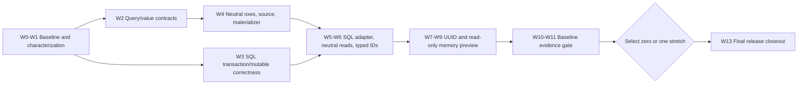

> [!WARNING]
> This folder contains roadmap material for the DataLinq 0.9 development line. It is not normative product documentation and must not be treated as a shipped support claim.

# DataLinq 0.9 Implementation Roadmap

> [!NOTE]
> In the F4-B/F5 capability paragraph below, "current" means current at that historical checkpoint; its `613`/`355`/`258` catalog/SQL counts and `15`/`12` refinement counts are not the live project state. The live M1-H state is catalog `616`, SQL `358` supported / `258` unsupported, with `18` post-F4-A refinements of which `15` are SQL-supported.

**Status:** Implementation in progress. W0-W2, `F5`, the bounded `F7` vertical proof, all ordered W8 spike steps, D5 package promotion, aggregate M0, W10 steps 1-2 / RE-1D package-tool integration, and W10 step 3 / RE-1A Testing CLI memory-suite registration are complete; bounded M1-A exact non-null inequality, bounded M1-B exact Boolean composition, bounded M1-C exact non-null `Int32` relational comparison, bounded M1-D exact local `Int32` membership, bounded M1-E exact ordered final `Skip`, bounded M1-F exact `Single`/`SingleOrDefault`, bounded M1-G exact ordered `Skip`/`Take` window, and bounded M1-H exact ordered `First`/`FirstOrDefault` are also green. W3-W6 and the remaining W9 work stay active. The Memory preview covers canonical/model-valued seed, public model-valued `Find<TModel>(object)` for exactly one primary-key column, the current 57-token query island with nested `&&`/`||`/`!` over exact direct non-nullable converter-free model/provider `Int32` comparison and local-membership leaves plus exact canonical-`Guid` `==`/`!=` leaves, one exact ordered final-`Skip` sequence shape, one exact ordered final `Skip`/`Take` window, exact unpaged `Single`/`SingleOrDefault`, and exact ordered unpaged `First`/`FirstOrDefault` over root entities and direct-`Int32` scalars, representative diagnostics, focused SQLite parity, canonical Guid-backed/direct-`Guid` storage, and direct execution under Native AOT, full trimming, WebAssembly no-AOT, and WebAssembly AOT without SQL-provider/native-database payload. M0 freezes that `MemoryDatabase<TDatabase>` and the neutral-source route expose no raw-SQL, provider, command, connection, or Memory provider-style post-seed CRUD/commit/transaction service; the legacy inherited provider member and parameterless `Delete()` extension reject without additional backend work. The wider query and semantic matrix, remaining typed-ID/`Guid` predicate shapes, projections, membership outside the exact direct non-nullable `Int32` fence, relational comparisons outside the exact direct `Int32` fence, paging outside the exact ordered final-`Skip`/`Take` fence, bare or unordered `First`/`FirstOrDefault`, broader ordered-first projections, `Last`/`LastOrDefault`, terminals after paging, general ordering, relations, composite primary-key lookup, aggregate M1-M2 completion, compatibility-catalog integration, package-consumer and packaged constrained-runtime evidence, and final packaged release reruns remain open. RE-1C, RE-1E/F/G/H, W10 steps 4-9, aggregate RE-1/RE-4/W10/W11, final release-candidate closeout, and publication remain open. Local-cleanup fault boundaries, connector-native/full provider commit-fault evidence, general join compatibility, structured-query diagnostics, indexed and unknown-key server-default shapes, UUID routes beyond the bounded slices, legacy fallback removal, string/CHAR keys, composite UUID routing, broader relation/index/foreign-key UUID routing, general UUID projections and manual `SqlQuery`, broader joined typed-UUID key hydration, member-init row evidence, joined/function-derived grouped keys, converter-backed aggregate values, `HAVING`, provider-less readers, and remaining reader/external routes are also open. W3, W5, W6, F4, F6, the remaining W9 work, UUID-2, and UUID-3 remain incomplete.

**F4-B/F5 capability and execution progress:** The current vocabulary contains 613 contextual features, with an exhaustive SQL profile of 355 supported and 258 unsupported dispositions. The fifteen post-F4-A additions distinguish exact direct non-nullable `Int32` column/scalar equality, exact non-nullable canonical-`Guid` column/scalar equality, the exact one-key `Int32` single-column-primary-key ordering shape, safe and unsafe same-scope paging compositions including exact ordered final `Skip`, an exact nonnegative `Int32` scalar-binding count, an exact direct non-nullable converter-free `Int32` root scalar projection, and exact direct non-nullable converter-free `Int32` column/local-sequence membership from their broader alternatives. Twelve refinements describe SQL-supported behavior; both scalar-projection shapes, the canonical-`Guid` comparison shape, both descriptive membership-shape tokens, and the exact ordered final-`Skip` shape remain SQL-supported, while `PagingCompositionShape:RepeatedTakeInScope`, `PagingCompositionShape:TakeBeforeSkipInScope`, and `PagingCompositionShape:RepeatedSkipInScope` are deliberately SQL-unsupported because the retained renderer stores only one limit and one offset per scope. Exact `Int32` shape classification now respects model-property as well as provider nullability. Explicit ordering conversions likewise remain represented and reject as `Value:Converted@Ordering` until cast-aware rendering exists, preventing silent narrowing misordering. Template validation now also requires every source element type to match its table model, every projection-returning result type to match its projection, and `Any`/`Count` to use canonical `bool`/`Int32` result types; non-aggregate results cannot carry aggregate selectors. The SQL local-projection adapter retypes its internal entity request accordingly. The dated initial 598/343/255 matrix remains recorded in the foundation plan. Every production expression query creates one `QueryExecutionRequest`, selects the source-owned backend, extracts requirements, and validates exactly once before backend work. The SQL adapter owns the complete entity family, all six scalar reductions, every currently supported direct SQL projection (`ScalarMember`, `SqlRow`, and `GroupedAggregate`), and every retained local projection (`Anonymous`, `ComputedRowLocal`, and `JoinedRowLocal`) for their parser-supported sequence and terminal shapes. One typed semantic projection cursor carries final results without exposing a reader, command, `DBNull`, alias, provider-width artifact, or SQL row envelope. `SqlLocalProjectionExecutor` now owns SQL row loading, joined-key buffering/cache hydration, normalized recipe evaluation, result conversion, and bounded cancellation checks; `ExpressionQueryPlanExecutor` no longer constructs `QueryPlanSqlBuilder` or contains a SQL compatibility executor for a supported projection. Contract coverage freezes exactly-once backend dispatch for all three local kinds, terminal dispatch, `AotStrict` execution for `AotSafe` computed recipes, and pre-dispatch rejection for SQL-only anonymous and joined-local recipes. The integrated `F5-D` gate passes `57/57` generator tests, `1117/1117` unit tests, `788/788` SQLite compliance tests, `796/796` in each paired server run, and `160/160` plus `162/162` provider-specific executions.

`F5` completion is deliberately an adapter-routing claim, not neutral-read or observability completion. Single-source local recipes still reproject through the synchronous SQL entity loader, so cancellation is checked before and between bounded local work but is not yet a provider-native cancellable entity read. Joined local recipes still buffer provider primary keys before hydrating source rows through `TableCache`; exact converter-backed canonical-`Int32`, canonical-`Int64`, and one representative Guid-backed binary-storage reader-key slice are now normalized, while wider converted, composite, string, other UUID format/mapping, and codec-sensitive joined-key neutrality remains `F6` work. Existing route-specific telemetry is preserved: single-source local loading retains entity-query/cache accounting, while joined key selection retains reader-command attribution and any later cache loads keep their established accounting. No backend-neutral local-projection telemetry category is claimed. The bounded memory vertical proof is complete, but its release profile remains far short of the advertised preview boundary, so `F4`, `F6`, `W5`, and the remaining W9 work remain open.

**Historical W8 step-8 parity-and-diagnostics checkpoint:** The non-packable memory backend retains zero or more exact direct-`Int32` equality `Where` operations and exactly one optional ascending or descending ordering over the root entity's direct non-nullable converter-free `Int32` single-column primary key, optionally followed by one final exact nonnegative `Int32` scalar-binding `Take`. Its exhaustive profile remains 31 tokens and also admits a final `ScalarMember` sequence over a direct non-nullable converter-free model/provider `Int32` root column with an exact `Int32` result; the selected column may be the primary key or a non-key column. Selectorless `Any` and `Count` reduce either root entities or that exact scalar projection through the shared canonical-row cursor; predicate overloads remain bounded to the admitted exact root-column equality shape. Empty input returns `false`/`0`, unordered `Any` short-circuits, `Count` exhausts the selected cursor with checked `Int32` arithmetic, and ordered reductions inherit full-match buffering. Reductions materialize neither entities nor projected cells and perform zero `RowCache` work. Terminal operations after paging remain parser pushdowns and reject before row access. `ScalarProjectionShape:Other` still fences string, nullable, widened, boxed, converter-backed, typed-ID, `Guid`, joined, and broader projection shapes. Natural self-join, grouped-aggregate, and captured row-local projection plans freeze deterministic first capability failures (`SourceCount:Multiple` at `sources`, `Operation:GroupBy` at `operations[0]`, and `Projection:ComputedRowLocalExpression` at `projection`) before any store/cache diagnostic changes, and the captured value is redacted. The same canonical-row cursor owns scan accounting, filtering, ordering, `Take`, cancellation, and disposal. Entity sequences materialize selected identities through the existing cache, while scalar sequences read selected canonical cells through shared scalar materialization/result adaptation. Unordered scalar projection streams lazily without promising stable seed order; ordered projection retains full-match buffering and total primary-key order. `Take(0)` performs no scan, `Take` limits above cardinality return all ordered rows, and a public query snapshots the count at construction. Bounded step-8 parity uses the same generated metadata and five adversarial exact-`Int32` rows (`Int32.MinValue`, `-11`, `0`, `17`, and `Int32.MaxValue`, with repeated group values and distinct names) in memory and SQLite. Each paired shape is parsed exactly once into one `QueryPlanInvocation`, then that same invocation is executed through both sources. The hard-coded expected observation covers every representative dimension of the current 31-token profile: unordered root and repeated-equality entity sequences, ascending and descending ordering, zero/bounded/over-cardinality `Take`, primary-key and non-key scalar projection, composed filter/order/page/projection, empty sequences, and entity/projected `Any` and `Count`. Only unordered results are normalized, and only after provider execution; every ordered result is compared in returned order. A separate shared invocation records the deliberate SQLite-only post-`Take` terminal difference: SQLite executes it, while memory rejects `Operation:Pushdown` before diagnostics change. At that checkpoint focused memory and capability tests passed `33/33` and `25/25`; integrated gates remained `1138/1138` unit, `57/57` generator, and `795/795` SQLite file/memory compliance tests. The parity test host intentionally carries SQLite and native assets; the `DataLinq.Memory` runtime remains non-packable and its resolved runtime graphs remain free of SQL-provider and native-database packages. Internal pre-cancellation and bounded entity, filtered, ordered, and projected yield cancellation plus scalar-reduction pre-cancellation are proven; generated public LINQ still supplies `CancellationToken.None`. This is not support for other scalar types, anonymous/constructed/local projections, projected-value predicates, post-projection composition beyond selectorless `Any`/`Count`, `LongCount`, other scalar reductions, element terminals, general ordering, `ThenBy`, `Skip`, stable ties, top-N performance, or general SQL equivalence.

**Historical F7/W8 step-9 model-valued seed and Guid-backed typed-ID checkpoint:** An internal dense table-ordinal model-valued seed path sits beside the original canonical-provider seed path. Every cell uses the shared `ModelValueConverter` before atomic canonical-row/key publication. One generated fixture proves a Guid-backed typed-ID primary key, a direct `Guid`, a second non-null typed field, and a nullable typed field: null bypasses conversion, stored cells and lookup keys remain canonical `Guid`, and cold materialization restores model values. Deliberately different SQLite, MySQL, and MariaDB `GuidStorage` declarations never become memory text or bytes. Seed normalization invokes `ToProvider` twice. Cold materialization adds two `FromProvider` calls plus one `ToProvider` for the existing generated immutable primary-key capture, for cumulative counts of three and two. Warm lookup plus root enumeration adds no conversion and reuses the same immutable instance. Explicit test cache eviction and rematerialization add two more `FromProvider` calls plus one more key-capture `ToProvider`, for cumulative counts of four and four. A differential canonical-seed case sends canonical `Guid` cells through `SeedCanonical` with zero seed-time `ToProvider`; cold materialization invokes `FromProvider` for all three converted fields plus one `ToProvider` for immutable primary-key capture. Full model type/nullability preflight precedes a row's first converter, completed reseeds and concurrent same-table attempts reject before their converter execution, and invalid or duplicate rows leave the table unpublished; invalid-cell top-level diagnostics are value-redacted and retain row/column context. Converter code runs outside the seed monitor. At that checkpoint focused tests passed `7/7`, the full memory project passed `40/40`, and `DataLinq.Memory` built cleanly for net8/net9/net10. Guid-backed typed-ID predicates, projections, membership, ordering, relations, the public seed/package surface, and `M0` remain open. The following step-10 checkpoint supersedes only the AOT/browser, bounded `F7`, and ordered W8-step status.

**Historical F7/W8 provider-free constrained-runtime checkpoint:** `DataLinq.Memory.PlatformCompatibility.Smoke` supplied the same generated-model runner to separate non-packable Native AOT, full-trim, and Blazor WebAssembly hosts. The then-current 31-token profile executed canonical/model-valued seed, primary-key hit/miss, captured equality, order plus `Take`, entity and scalar results, `Any`/`Count`, deterministic self-join rejection before work, pre-cancellation, and canonical Guid-backed/direct-`Guid` storage. Native AOT and full-trim executables published and exited successfully; isolated WebAssembly no-AOT and AOT publishes completed in a real browser with zero warning/error entries. All four published outputs scanned clean for `DataLinq.SQLite`, `DataLinq.MySql`, `Microsoft.Data.Sqlite`, `MySqlConnector`, `SQLitePCLRaw`, and `e_sqlite3`. Clean or isolated intermediate paths were required when switching WebAssembly AOT modes to avoid cross-mode stripped-IL contamination. The memory suite passed `42/42`. This completed bounded `F7` and W8 step 10 without widening the query profile, making `DataLinq.Memory` packable, freezing a public seed API, or completing W9/W10.

**D5-A memory public-surface checkpoint:** `MemoryDatabase<TDatabase>` now publicly owns one isolated store, exposes `Query()`, and accepts generated mutable rows through `Seed<TModel>(IEnumerable<Mutable<TModel>>)`. The seed path snapshots model values by frozen table ordinal after reserving publication, normalizes through shared converters, and atomically seals each table once; malformed or lazy-enumerator failures publish nothing and remain correctable, ordinary cleanup cannot mask an earlier failure, cancellation cleanup propagates, and completed or empty-table reseeds reject before reading the new source. `MemorySeedException` and `QueryBackendCapabilityException` are public; canonical buffers/keys, metadata/read-source plumbing, diagnostic counters, explicit-token execution, and cache/test hooks are not. The constrained-runtime runner now uses this public construction/seed/query path, and Native AOT, full trim, and isolated WebAssembly no-AOT/AOT browser runs remain green with clean dependency scans. The memory suite passes `55/55`, and independent surface review is green. This completed D5-A only: at that checkpoint the project remained non-packable pending D5-B inspection of actual package dependencies/assets and an explicit promotion decision, while W10 still owned release integration and packaged reruns.

**Historical SC-6A exact canonical-`Guid` equality checkpoint:** At that checkpoint, the exhaustive Memory capability profile contained 32 tokens and admitted exact default-null-semantics column-to-scalar equality only when one direct non-null root column was either an identity-mapped `Guid` or a resolved scalar-converter-backed model type canonicalized to `Guid`, and the scalar was non-null. Both operand orders, selective hits and misses, invocation rebinding, and entity `Any`/`Count` are proven. Each captured model scalar crosses the existing `ModelValueConverter` exactly once per predicate during execution-plan compilation; row evaluation then compares exact canonical `Guid` values. No `GuidStorage` definition, SQL-provider codec, byte/text representation, or parsing participates. The public construction, generated-mutable `Seed(...)`, and `Query()` surface is unchanged. Converter failures cross the public memory boundary as value-redacted `QueryTranslationException` instances without an arbitrary retained inner exception graph; `OperationCanceledException`, `OutOfMemoryException`, and `AccessViolationException` propagate with exact identity. Nullable columns or bindings, inequality, local membership, `Guid` ordering, scalar projection, typed-ID member unwrapping, relations, and public typed primary-key lookup remained unsupported and rejected before memory row work. One same-invocation differential fixture executes each parsed `QueryPlanInvocation` unchanged through memory and independently raw-seeded SQLite for the bounded direct and converted `Guid` hit/miss and reduction matrix; this is exact regression pressure, not general SQL parity. The checkpoint gates passed `62/62` memory, `1214/1214` unit, and `60/60` generator tests, and `DataLinq.Memory` built cleanly for net8, net9, and net10. Native AOT and full-trim executables passed, isolated real-browser WebAssembly no-AOT and AOT runs passed without warning/error entries, and all four published outputs scanned clean for SQL-provider and native-database payloads. At the SC-6A checkpoint, D5-B/package promotion, the remaining query shapes, aggregate SC-6, and aggregate W6 remained open.

**D5-B experimental-package promotion checkpoint:** `DataLinq.Memory` is now packable and carries the same private MinVer and SourceLink build dependencies as the other runtime packages; `DataLinq.Tests.Memory` remains non-packable. Core and Memory were packed together as local `0.9.0-preview.d5b.5` candidates. The Memory nuspec contains exactly one `DataLinq` dependency per `net8.0`, `net9.0`, and `net10.0` group, with the candidate version as its NuGet minimum and `Build,Analyzers` excluded. The package embeds a dedicated Memory preview README that describes only the bounded supported surface and explicitly rejects mutation, transactions, durability, persistence, raw SQL, relation navigation, joins, grouping, arbitrary projections, and general LINQ parity. The runtime package contains exactly three managed `DataLinq.Memory.dll` assets and no analyzer, runtime, native, build, build-transitive, or tool folders; its matching symbol package contains exactly three PDBs. Direct archive and binary-token inspection found no SQL-provider, native-database, Roslyn, Remotion, or generator payload, and package metadata plus repository provenance matched the pack input. The explicit two-package report completed with zero findings, and an ordinary MinVer-driven pack also succeeded with an aligned core dependency instead of the former stable-package/prerelease-dependency `NU5104` failure. At that checkpoint this recorded the explicit decision to promote the bounded backend as an experimental preview and completed D5 plus W9 step 1; M0, M1, M2, D6, and all W10 release-script, Testing CLI, compatibility-catalog, packaged constrained-runtime, public-documentation, and publication work remained open.

**M0-A public exact single-column lookup checkpoint:** `MemoryDatabase<TDatabase>.Find<TModel>(object)` now accepts the non-null model-side value for exactly one generated primary-key column, normalizes converter-backed keys through the shared `ModelValueConverter` boundary, probes the existing canonical primary-key index without scanning, and returns the correctly materialized generated immutable model or `null`. Primitive and Guid-backed typed-ID hit/miss, an unseeded-table miss, warm same-instance reuse, model-valued `RowData`, and independent store/read-source/identity ownership are proven. Wrong model types, raw canonical surrogates, numeric surrogates, composite-key metadata, and ordinary conversion failures during initial `ToProvider` normalization, canonical-to-model `FromProvider` materialization, or generated immutable primary-key `ToProvider` identity capture reject through value-redacted public `MemoryLookupException` diagnostics with no retained arbitrary inner exception graph; a literal null argument throws `ArgumentNullException`. Cancellation, `OutOfMemoryException`, and `AccessViolationException` at all three conversion points preserve exact exception identity, and a failed materialization or identity capture does not poison the identity cache. Focused lookup evidence passes `15/15`, the full Memory suite passes `77/77`, `DataLinq.Memory` builds for `net8.0`, `net9.0`, and `net10.0` with zero warnings and zero errors, Native AOT and full-trim executables pass, isolated WebAssembly no-AOT and AOT browser runs reach `passed`/`completed` with only expected runtime and stage logs, and every published output remains clean of SQL-provider and native-database payloads. The exhaustive Memory LINQ capability profile remains exactly 32 tokens. At that checkpoint this completed only bounded M0-A: no generated `Get(...)` overload whose source parameter was typed as `MemoryDatabase<TDatabase>` or `IDataLinqReadSource` alone was added, composite lookup remained unsupported, aggregate M0 still awaited Testing CLI and structural SQL-boundary work, and W10 release-tool/package integration remained open.

**W10 step-3 / RE-1A Testing CLI registration checkpoint:** `DataLinq.Tests.Memory` is now the first-class, non-target-batched `memory` suite. A direct built run with summary JSON passes `77/77` and emits exactly one result with `Targets` reported as `-`; the test-infrastructure state file retains the same hash and timestamp, proving that the lane does not provision or rewrite provider state. An explicit `--suite memory --alias all` run also passes `77/77` once with `Targets` `-`. The composite `--suite all --alias quick --build` gate passes `2162/2162`: generators `60`, unit `1214`, memory `77` exactly once with `Targets` `-`, and compliance `811` across `sqlite-file` and `sqlite-memory`. The `list` surface identifies the project and targetless behavior. `memory` is a suite, not a provider alias; `sqlite-memory` retains its existing SQLite-target meaning. The test project intentionally references `DataLinq.SQLite` for bounded differential parity, so this project-based CLI checkpoint is neither provider-free constrained-runtime evidence nor a package-consumer rerun. At that checkpoint this completed W10 step 3 and RE-1A registration only; aggregate M0 still awaited structural SQL-boundary closeout, while compatibility-catalog, release-package, aggregate RE-1, aggregate W10, and final release-candidate work remained open.

**Aggregate M0 structural-boundary checkpoint:** `MemoryDatabase<TDatabase>` exposes only `Find`, `Query`, and `Seed`; the complete public `IDataLinqReadSource` contract exposes only metadata and inherits no operational interface; and the Memory construction/query route supplies none of `IDataSourceAccess`, `IDatabaseProvider`, or `IDatabaseAccess` and exposes no provider-style post-seed CRUD/commit/transaction service. Primitive and converter-backed fixtures freeze the existing shared generated `Get(...)` source parameters to exactly `IDataSourceAccess`, `Database<TDatabase>`, or `Transaction<TDatabase>`; none is typed as `IDataLinqReadSource` alone or `MemoryDatabase<TDatabase>`. The canonical primitive fixture proves its row, root, and query provider expose no SQL access interface, while consumer-authored partial members remain outside the Memory contract. The legacy inherited `GetDataSource()` member and parameterless `Delete()` extension reject with a DataLinq-owned diagnostic without additional backend work, Memory diagnostics remain unchanged, and public lookup preserves stored identity. Focused public-boundary tests pass `14/14`, and the complete targetless Memory suite passes `78/78`. Together with existing M0-A multi-target/constrained-runtime evidence and the D5-B dependency/archive boundary, this completes aggregate M0 without a fake throwing raw-SQL API or a change to the 32-token query profile. The embedded package README changed, so W10 still owns a fresh aligned candidate. M1, M2, compatibility-catalog/package integration, aggregate RE-1/W10, and final release-candidate work remain open.

**M1-A exact non-null inequality checkpoint:** The Memory backend adds only `ComparisonOperator:NotEqual`; the 610-feature catalog and SQL's 352-supported/258-unsupported profile are unchanged, while the exhaustive Memory profile grows from 32 to 33 tokens. `!=` is admitted under default null semantics only for the two existing exact column/scalar shapes: direct non-nullable converter-free model/provider `Int32`, and non-nullable canonical `Guid` from either direct `Guid` or a resolved Guid-backed typed ID. Both operand orders, late invocation rebinding, mixed `==`/`!=`, entity and direct-`Int32` scalar projection, selectorless `Any`/`Count`, and the existing primary-key ordering plus final `Take` compositions are covered. Typed model scalars normalize once per predicate through `ModelValueConverter`; row comparison uses canonical values and never `GuidStorage`, SQL text, or provider byte codecs. Ordinary converter failures remain value-redacted without an inner exception graph, while cancellation and fatal exceptions retain identity. Strings, widened/boxed numerics, column-to-column and nullable comparisons, typed-ID member unwrapping, ordered predicates, compound boolean predicates, membership, `Skip`, `ThenBy`, element terminals, anonymous projections, joins, relation navigation, and grouping still reject before Memory row work. Focused and same-invocation differential tests prove the exact primitive, direct-`Guid`, and Guid-backed typed-ID inequality paths; the differential fixtures execute each parsed plan through Memory and independently raw-seeded SQLite. The targetless Memory suite passes `88/88`, and the runtime builds cleanly for net8/net9/net10. The constrained-runtime smoke exercises the representative primitive `Int32 !=` path, not canonical-`Guid` inequality; Native AOT and full-trim publishes execute successfully; isolated WebAssembly no-AOT and AOT publishes reach `passed` in real browser runs with zero warning/error entries; and recursive path/content scans of all four output roots find no SQL-provider/native-database payload. This advances only bounded M1 and D6 comparison semantics. At that checkpoint, aggregate M1/M2 and W10 package/compatibility reruns remained open, and the packed README change required a fresh later candidate.

**M1-B exact Boolean-composition checkpoint:** The Memory backend adds only `Predicate:And`, `Predicate:Or`, and `Predicate:Not`; the 610-feature catalog and SQL's 352-supported/258-unsupported profile are unchanged, while the exhaustive Memory profile grows from 33 to 36 tokens. `&&`, `||`, and `!` are admitted only as nested plan-tree composition over the existing exact default-null-semantics `==`/`!=` leaves: direct non-nullable converter-free model/provider `Int32`, and non-nullable canonical `Guid` from either direct `Guid` or a resolved Guid-backed typed ID. `And` and `Or` evaluate terms left-to-right with row-time short circuit, while `Not` evaluates and negates its child once. Every captured scalar is still normalized eagerly exactly once per comparison leaf while the invocation-local row plan is compiled before enumeration; branch short circuit does not defer or suppress conversion. The trees compose with repeated `Where`, entity and direct-`Int32` scalar projection, selectorless `Any`/`Count`, and the existing exact primary-key ordering plus final `Take`. Any unsupported predicate kind or comparison leaf still rejects at its exact nested capability location before store, cache, binding-conversion, or row work. Focused tests prove nested truth, precedence, negation, late rebinding, row-time short circuit, eager per-leaf Guid-backed normalization, unsupported-child zero-work rejection, and unchanged materialization boundaries. Same-invocation differential fixtures execute representative primitive and canonical-`Guid` trees through Memory and independently raw-seeded SQLite; this is bounded regression pressure, not general provider parity. The targetless Memory suite passes `96/96`, and the runtime builds cleanly for net8/net9/net10. The constrained-runtime smoke exercises one representative primitive tree containing all three operators, not canonical-`Guid` Boolean composition; Native AOT and full-trim publishes execute successfully, isolated WebAssembly no-AOT and AOT publishes reach `passed` in real browser runs with zero warning/error entries, and recursive path/content scans of all four output roots find no SQL-provider/native-database payload. This advances only bounded M1 and D6 predicate composition. At that checkpoint, aggregate M1/M2 and W10 package/compatibility reruns remained open, and the packed README change required a fresh later candidate.

**M1-C exact non-null Int32 relational checkpoint:** The Memory backend adds only `ComparisonOperator:GreaterThan`, `ComparisonOperator:GreaterThanOrEqual`, `ComparisonOperator:LessThan`, and `ComparisonOperator:LessThanOrEqual`; the 610-feature catalog and SQL's 352-supported/258-unsupported profile are unchanged, while the exhaustive Memory profile grows from 36 to 40 tokens. `<`, `<=`, `>`, and `>=` are admitted under default null semantics only between one direct non-nullable converter-free model/provider `Int32` root column and one exact non-null `Int32` scalar, in either operand order. Scalar-left forms invert the operator before the row predicate is constructed; row evaluation then uses the corresponding direct C# `int` comparison and never subtraction, so this slice introduces no comparison-arithmetic overflow path. Existing exact direct-`Guid` and resolved Guid-backed typed-ID `==`/`!=` leaves remain admitted, but relational canonical-`Guid` comparisons classify to `QueryPlanComparisonShape.DefaultNullSemantics` and reject before Memory store, binding-conversion, cache, or row work. The new leaves compose inside the bounded M1-B `And`/`Or`/`Not` trees and with repeated `Where`, entity and direct-`Int32` scalar projection, selectorless `Any`/`Count`, the exact primary-key ordering, and final `Take`. Focused evidence passes `6/6` `MemoryOrderedInt32ComparisonTests` and `25/25` `QueryPlanCapabilityValidationTests`; the full targetless Memory suite passes `103/103`. Capability contracts freeze the exact 40-token list, exact relational-`Int32` classification in both operand directions, canonical-`Guid` relational fallback, and the unchanged 610/352/258 catalog/SQL matrix. One same-invocation differential range fixture covers all four relational operators, both operand directions, and late rebinding through Memory and independently raw-seeded SQLite; this is bounded regression pressure, not general provider parity. `DataLinq` and `DataLinq.Memory` build cleanly for `net8.0`, `net9.0`, and `net10.0` with zero warnings and zero errors. Native AOT and full-trim publishes and executables pass with the exact range result and capability count (`range-filtered=[-5,17]`, `capabilities=40`). Isolated WebAssembly no-AOT and AOT publishes reach `passed` in real browser runs with the same exact range result and capability count, the expected `querying-relational-range` stage, and zero warning/error entries. Recursive filename and binary/text scans of the `aot`, `trim`, `wasm-noaot`, and `wasm-aot` output roots find none of `DataLinq.SQLite`, `DataLinq.MySql`, `Microsoft.Data.Sqlite`, `MySqlConnector`, `SQLitePCLRaw`, or `e_sqlite3`. This advances only bounded M1/D6 exact `Int32` relational semantics. At that checkpoint, aggregate M1/M2 and W10 package/compatibility reruns remained open, and the packed README change required a fresh later candidate.

**W10 steps 1-2 / RE-1D package-tooling checkpoint:** Commits `bdae5f5b` and follow-up version fix `39522ce376a2dddb4faa7dcaded80d470889abb2` add `DataLinq.Memory` to the default public pack set and the default expected/runtime package-report sets, reject non-empty pack output, and make inspection fail closed over version, identity, metadata, independently inventoried symbol packages, exact Memory dependency/assets, managed assembly identity, and banned payloads. The first `0.9.0-preview.w10.1` probe exposed that `PackageVersion` did not override MinVer; the follow-up uses `MinVerVersionOverride`. The final fresh `0.9.0-preview.w10.2` candidate at `artifacts/nuget-release/0.9.0-preview.w10.2` contains six `.nupkg` and six independently matched `.snupkg` packages, all at the exact candidate version. The default schema `v0.9.package-inspection-report.v3` report at `artifacts/dev/package-report/20260804-075329094` records six packages, six symbol packages, six expected packages, four runtime packages, zero findings, and zero hard failures. `DataLinq.Memory` has exactly the net8/net9/net10 DLL/PDB sets, three valid CLI assemblies named `DataLinq.Memory`, exact same-version core-only dependency groups with `Build,Analyzers` excluded, clean metadata/root assets, and no provider, native, Roslyn, Remotion, or generator payload. Focused `PackageInspectorTests` pass `17/17`, `CompatibilitySizeReportTests` pass `9/9`, the unit suite passes `1231/1231`, and the integrated quick gate passes `2205/2205` (`60` generators + `1231` unit + `103` memory + `811` compliance); the Dev CLI build has zero warnings/errors, and DocFX has zero errors with only the two known duplicate `AnalyzerReleases` warnings. No package was published. This completes only W10 steps 1-2 and RE-1D. RE-1C, RE-1E/F/G/H, W10 steps 4-9, aggregate RE-1/RE-4/W10/W11, packaged constrained-runtime evidence, consumer smoke, final release-candidate closeout, and publication remain open. Aggregate M1/M2 remain unchanged at Memory `40`, catalog `610`, and SQL `352` supported / `258` unsupported.

**Integral typed-ID relation progress:** A bounded SC-3 checkpoint now composes the existing model-to-canonical key path with `F6-B` for one `Int32`-backed typed-ID PK/FK relation shape. Generated converter-backed collection and reference relations deliberately use the dynamic `DataLinqKey` path, so `KeyFactory` normalizes model components before cache dispatch. `TableCache` admits converter-backed index metadata only when the supplied key is already the exact canonical integral CLR value; a raw model wrapper remains ineligible, and neither converter direction runs at that gate. Active-provider evidence covers cold parent-to-children loading, read-only shared-index warming, warm immutable identity, singular child-to-parent reuse, model-valued public IDs, the unchanged primitive fast path, and rollback isolation. At the relation checkpoint, full generator, unit, and SQLite file/memory gates passed `58/58`, `1138/1138`, and `797/797`; the new relation case passed `4/4` across SQLite file, SQLite memory, MySQL 8.4, and MariaDB 11.8. This does not complete the typed `int`/`long`/`Guid`/`string` matrix, composite or codec-sensitive relations, joined/external/key-only/preload routes, transaction-specific typed-ID relation behavior, memory relations, or SC-3/W6.

**Joined typed-ID reader-key progress:** `JoinedRowLocal` execution now recognizes one scalar converter-backed primary-key shape whose canonical provider CLR type is exactly `Int32`. The joined SQL reader decodes the selected key column to its canonical integer at the actual alias ordinal, wraps it in `DataLinqKey`, and only then enters the dynamic `TableCache` path; public projection recipes still receive model-valued entities and properties. A self-join over a `QueryTypedId` primary key and nullable parent join column passes `4/4` across the active providers after explicit cache clearing, proves both joined sources hydrate, repeated parent rows share one immutable instance, and warm dynamic-key lookups return those exact objects. The unchanged primitive joined-local route also passes `4/4`; full generator, unit, and SQLite file/memory gates pass `58/58`, `1138/1138`, and `799/799`. The enclosing projection remains `SqlOnlyCompatibility`. This does not normalize converter-backed `Int64`, `Guid`/UUID, string/CHAR, composite, external, raw/manual, or memory joined-reader keys.

**Join-key compatibility progress:** The SQL plan builder now recursively inspects direct and pushed-down explicit or implicit joins before constructing SQL state. Converter-free non-UUID joins retain their established behavior. Converter-backed keys must be converter-backed on both sides and expose the same resolved underlying model CLR type, canonical provider CLR type, and nominal converter CLR type; the validator never invokes either conversion direction. Canonical `Guid` keys additionally require resolved storage metadata for the concrete provider and the same exact `GuidStorageFormat`, while declaration provenance (`IsExplicit`) is deliberately ignored. Focused unit coverage passes `10/10`; intentionally mismatched converter and UUID-format pairs reject with `QueryTranslationException` and zero SQL commands or converter calls in `8/8` active-provider cases; the selected existing primitive, same-mapping typed-ID, implicit-relation, and pushdown regression surface passes `36/36`. Integrated generator, unit, and SQLite file/memory gates pass `58/58`, `1148/1148`, and `803/803`. This is a nominal incompatibility guard, not behavioral proof: the same converter type can still branch on `ScalarConversionContext.Column`. A sound general equivalence contract, mixed identity/converter mappings, non-UUID physical concerns such as collation/signedness/precision, composite keys, memory joins, and joined typed-UUID materialization remain open, so SC-4/W6 are not complete.

**Schema type-handoff progress:** The model side of `SchemaComparer` resolves an effective physical type through the same built-in-provider policy used by SQL generation. With finalized scalar metadata, a converter-backed primitive canonical type therefore no longer produces false drift merely because it has no explicit `[Type]`; provider-default declarations translate, exact live-provider metadata is still required, real physical mismatches remain visible, and converter code is never invoked. A later bounded checkpoint adds separate compatibility validation for a finalized converter-backed canonical provider CLR type of exactly `Int32`, but only after normalized physical SQL signatures match. SQLite accepts `INTEGER`; MySQL/MariaDB accept signed `INT`/`INTEGER`. Server integer aliases, display widths, and ordinary signed `true`/`null` metadata are normalized as non-semantic, while explicit unsignedness remains distinct and non-integer length/precision modifiers are preserved. Matching text, unsigned `INT`, `MEDIUMINT`, or `BIGINT` storage reports `ColumnCanonicalTypeMismatch` as `Error/Ambiguous`; genuine physical drift remains only `ColumnTypeMismatch`, unresolved canonical CLR metadata is skipped, and `diff` emits review comments without SQL. Focused scalar, UUID-neighbor, diff-script, and live-provider cases pass `13/13`, `15/15`, `6/6`, and `4/4`; integrated generator, unit, SQLite file/memory, and four-server compliance gates pass `59/59`, `1196/1196`, `803/803`, and `1622/1622`. Configured `datalinq validate`/`diff` still parse model source as deferred syntax metadata, where `[ScalarConverter]` is only a marker and assembly registrations are unresolved; this canonical check is therefore unavailable there, and converter-only source still needs explicit `[Type]` metadata for physical comparison. Other canonical CLR types, authoritative source-only converter resolution, and aggregate SC-5/W6 completion remain open.

**UUID validation/default-safety progress:** After exact active-provider SQL type equality, `SchemaComparer` now compares resolved UUID metadata or raw exact/default `[GuidStorage]` intent without invoking converters. MySQL/MariaDB `CHAR(36)`/`VARCHAR(36)`, `CHAR(32)`/`VARCHAR(32)`, and native MariaDB `UUID` are schema-observable; unhinted MySQL/MariaDB `BINARY(16)` and SQLite `BLOB` or `TEXT` remain `Error/Ambiguous` unresolved because those SQL types do not encode byte order or text shape. Trusted same-type format changes report a manual data migration and diff generation stays comment-only; physical type drift suppresses secondary format noise. Bare deferred `Guid`/`System.Guid`/`global::System.Guid` source is also unresolved because source-only metadata cannot disprove an assembly scalar registration, while a deferred property-converter marker is not misclassified as UUID intent. A second bounded handoff formats fixed `Guid` values already present in finalized direct-canonical metadata through the same resolved codec used by runtime writes before SQLite/MySQL/MariaDB DDL literal rendering. It covers all 13 text/native/binary provider-format combinations; ambiguous layouts and converter-backed defaults reject before SQL with zero converter calls. A third handoff fails closed on `DefaultNewUUID` Version4 and Version7 DDL for SQLite, MySQL, and MariaDB rather than substituting unverified provider functions. Exact MySQL/MariaDB `UUID()` imports remain provider-scoped `DefaultSql`, explicit provider `DefaultSql` remains the intentional escape hatch, and Version4/Version7 stay distinct through parsing, explicit model regeneration, schema comparison, migration snapshots, metadata roundtrip comparison, and equivalence digests. A fourth handoff adds public exact-D `[DefaultGuid("...")]` as a storage-neutral source carrier for an ordinary fixed model `Guid`: parsing normalizes to base `DefaultAttribute(Guid)` with no code expression, runtime metadata carries a real `Guid`, mutable initialization uses `global::System.Guid.Parse(...)`, and model regeneration emits canonical lowercase. The expression-free carrier and exact base meaning compare identically in schema, snapshot, roundtrip, and digest fingerprints; custom Guid-valued default subclasses remain distinct. Guid defaults carrying a `CodeExpression` fail closed during regeneration and remain distinct in roundtrip comparison, while schema, snapshot, and digest fingerprints describe the fixed value. The existing codecs then render the ordinary fixed value across the covered 13 formats. A fifth handoff completes direct generated-client Version4/Version7 initialization across net8/net9/net10. Version7 uses a runtime-owned RFC 9562 helper with UTC Unix milliseconds plus 74 random bits; generated parameterless mutable constructors evaluate client defaults once, required constructors delegate without re-evaluating, and immutable-copy construction generates nothing. This is not a same-millisecond monotonicity or metadata-transformer ownership claim. `[Default("guid-text")]` remains invalid, and migration snapshots remain at format version 2. Current integrated gates pass `60/60` generator, `1203/1203` unit, and `803/803` SQLite file/memory tests; the latest four-target compliance batch passes `1622/1622`, and the full MySQL/MariaDB provider-specific lane passes `376/376`. Focused client-generation evidence passes `5/5` runtime, `16/16` constructor-generation, `1/1` source-generator, and `6/6` fail-closed SQLite default tests; the generated consumer fixture builds cleanly for all three target frameworks. This remains bounded default support: converter-backed defaults, static provider-default import, transformer source precedence, SQLite expression/BLOB import, automatic provider-version/storage-aware server generation, canonical compatibility beyond finalized converter-backed `Int32` and `Int64`, authoritative source-only typed-ID resolution, and aggregate SC-5/UUID-4 completion remain open.

The UUID-version preservation claim above is limited to direct source parsing, direct metadata-to-model regeneration, and semantic fingerprints. It does not claim that `MetadataTransformer` preserves a source default through source/database merge. Because the serialized snapshot default fingerprint now includes UUID version, new schema migration snapshots intentionally identify format version 2; existing format-version-1 JSON still deserializes because readers do not reject older versions. Normalizing `DefaultGuid` to the pre-existing fixed-`Guid` meaning does not require a further snapshot-version change.

**Default-only insert progress:** An unassigned null auto-increment primary key is now omitted when its canonical provider type is integral, including converter-backed model IDs. An otherwise zero-column insert renders through provider-owned syntax as SQLite `DEFAULT VALUES` or MySQL/MariaDB `() VALUES ()`. The same bounded authoritative-reload path hydrates provider-applicable, non-indexed converter-backed server defaults when the primary-key shape is `F6-A` compatible. The focused converted-default active-provider matrix passes `4/4`; full unit, generator, SQLite compliance, and MySQL/MariaDB compliance runs pass `1051/1051`, `57/57`, `746/746`, and `748/748`. Assigned nulls and explicit identity values remain writes. Providers that do not declare default-only syntax retain the legacy null-key write and empty-query `VALUES (NULL)` fallback. Indexed defaults, unknown non-auto keys, non-integral generated IDs, server-default/generated-key hydration over string/CHAR or UUID key shapes, and the remaining live read families remain open, so SC-2 is not complete.

**SQL projection progress:** SQL `ScalarMember` projections over converter-backed columns now decode the selected physical value to the column's canonical provider CLR value and apply the shared scalar materializer before adapting the declared result type. Active-provider compliance evidence covers root and joined `QueryTypedId` projections, nullable typed-ID columns, lifting a non-null typed ID to nullable, boxing while preserving the model wrapper, terminal `Single()`, and direct execution with `ProjectionEvaluationOptions.AotStrict`. The same boundary now materializes converter-backed column members in aliased anonymous SQL `SqlRow` projections while preserving their existing `SqlOnlyCompatibility` disposition; active-provider evidence covers root and joined rows, nullable and lifted-nullable members, boxing that preserves the model wrapper, and terminal `Single()`. Explicit model-to-`int` scalar projection conversion remains a focused translation rejection. This is evidence for an `int`-backed typed ID, not proof of general nullable `.Value`/`.HasValue` predicate or projection translation beyond the exact same-mapping join-key shape exercised here, arbitrary numeric converter widening or narrowing, Native AOT or browser execution, implicit-relation or member-init row projections, grouped/aggregate conversion outside the bounded key-only slice below, or retained local recipes beyond the bounded single-source `NewArray` slice below. `SC-2` remains open.

**Explicit-constructor SQL row evidence:** Constructor-backed DTO/record `SqlRow` projections now have active-provider evidence through the same converter-aware result-alias boundary. The matrix covers root and joined source slots, non-nullable, nullable, lifted-nullable, and boxed typed-ID arguments, plus terminal `Single()`. Plan assertions preserve the exact result and constructor types and the existing `SqlOnlyCompatibility` disposition; `ProjectionEvaluationOptions.AotStrict` intentionally rejects the reflective constructor path. Full gates pass `1051/1051` unit, `57/57` generator, `752/752` SQLite compliance, `1416/1416` compliance across MySQL 8.4 and MariaDB 10.11/11.4/11.8, and `160/160` in the latest MySQL/MariaDB provider-specific lane. This is evidence for direct constructor arguments only. It does not add member-init support, implicit-relation columns, post-`Select` DTO-member composition, Native AOT/browser construction, or memory-backend execution.

**Implicit-relation SQL row evidence:** A dedicated primitive-PK/FK fixture now proves that converter-backed non-key values selected through a one-hop singular implicit relation retain the related table's column metadata through `ImplicitJoin` planning, SQL aliasing, and `SqlRow` materialization. Active-provider coverage includes non-nullable, nullable, lifted-nullable, boxed, and terminal results, and plan assertions prove one root plus one implicit-join source with converter-backed related columns. Full gates pass `1051/1051` unit, `57/57` generator, `754/754` SQLite compliance, `1420/1420` compliance across MySQL 8.4 and MariaDB 10.11/11.4/11.8, and `160/160` in the latest MySQL/MariaDB provider-specific lane. This is direct SQL join projection evidence only. It does not establish converted relation keys, lazy relation loading, relation cache/index normalization, nullable left-join semantics, multi-hop or collection traversal, member-init/local recipes, AOT/browser execution, or memory-backend relations.

**AOT-safe local projection evidence:** A single-source typed-ID query proves that retained `ComputedRowLocal` `NewArray` recipes read converter-backed values from materialized model rows and execute under `ProjectionEvaluationOptions.AotStrict`. Active-provider coverage includes non-nullable, nullable, lifted-nullable, boxed-nullable, `HasValue`, conditional `.Value`, ordinary sequence execution, and terminal `Single()` after explicitly clearing the table cache; exact type assertions show that no canonical `int` leaks into the recipe result. The evidence does not instrument a specific loader implementation and is bounded to the current integral-canonical SQL entity-key configuration. Full gates pass `1051/1051` unit, `57/57` generator, `756/756` SQLite compliance, `1424/1424` compliance across MySQL 8.4 and MariaDB 10.11/11.4/11.8, and `160/160` in the latest MySQL/MariaDB provider-specific lane. As a single-source slice, it does not establish joined-local execution, constructor/member-init local recipes, string/CHAR, `Guid`/binary, composite or unknown-key neutral hydration, custom sources, Native AOT/browser publication, or memory-backend recipe execution.

**Joined-local converter evidence:** A dedicated primitive-PK/FK fixture proves that explicit-inner-join `JoinedRowLocal` `NewArray` SQL execution reloads both source rows and feeds converter-backed joined-source columns to the normalized recipe as model values. Active-provider coverage after explicit cache clearing includes non-nullable, nullable, lifted-nullable, boxed-nullable, `HasValue`, and conditional `.Value` shapes; plan assertions record one root plus one explicit-join source, primitive non-converted `int` primary keys, and converter metadata on the joined columns, while exact result types show that no canonical `int` leaks through those converter slots. The `NewArray` recipe is `AotSafe`, but the enclosing joined projection intentionally remains `SqlOnlyCompatibility` because joined-row execution is SQL-only; `AotStrict` rejection is therefore preserved and asserted. The focused active-provider matrix passes `6/6`. Two preceding concurrent four-target attempts reached `1426/1428` and `1427/1428`; their only failures were unrelated connection refusals, and every exact failing test passed on its immediate target-specific rerun. Full gates pass `1051/1051` unit, `57/57` generator, `758/758` SQLite compliance, `426/426` on each of MySQL 8.4 and MariaDB 10.11/11.4/11.8 (`1704/1704` sequential server executions after concurrent connection instability), and `160/160` in the latest MySQL/MariaDB provider-specific lane. This does not establish converted, composite, string, `Guid`, binary, or codec-sensitive joined keys, implicit or outer joins, nullable missing-source rows, joined terminal/paging composition, custom or memory backends, or Native AOT/browser publication.

**Grouped-key projection progress:** Model-compatible converter-backed column keys in direct SQL `QueryPlanProjection.GroupedAggregate` results now use the same per-column physical-to-canonical-to-model boundary while retaining `SqlOnlyCompatibility`. Active-provider evidence covers scalar, nullable, boxed, and anonymous composite group keys projected through named members. Ordinary `Count()` members continue through the raw aggregate-value path, and an explicit `QueryTypedId`-to-`int` group key retains the raw provider-value fallback rather than being rematerialized as a wrapper. This bounded slice does not establish joined or function-derived group keys, supported converter-backed aggregate execution, general `HAVING`, Native AOT or browser execution, backend-neutral or memory grouping, or general collation/codec semantics. Full unit, generator, SQLite compliance, and MySQL/MariaDB compliance runs pass `1051/1051`, `57/57`, `746/746`, and `748/748`. `SC-2` remains open.

**Converted-aggregate semantics guard:** Scalar and grouped `Sum`, `Min`, `Max`, and `Average` now fail during expression-plan translation when their selector resolves to a converter-backed column, including aggregate use in grouped `HAVING`. The scalar converter contract declares only per-value conversion; it does not declare the additive, ordering, or mean-preserving semantics needed to aggregate canonical provider values as model values. Applying `FromProvider` once to a SQL aggregate result would therefore be unsound. Selectorless `Count` and `Any`, plus grouped `Count()`, remain supported. Active-provider tests use a deliberately non-aggregate-preserving numeric converter and prove the rejection occurs before any SQL command. Full gates pass `1051/1051` unit, `57/57` generator, `750/750` SQLite compliance, `1412/1412` compliance across MySQL 8.4 and MariaDB 10.11/11.4/11.8, and `160/160` in the latest MySQL/MariaDB provider-specific lane. Aggregate capability metadata and supported converter-backed aggregate execution remain future work; this guard prevents a silent wrong-result claim rather than completing that work.

**UUID-1 progress:** `UUID-1A` freezes the five-format vocabulary, multi-provider declarations, intrinsic validation, strict canonical-`Guid`/physical codecs, and lossless raw-declaration round-trips. `UUID-1B` adds immutable provider-keyed `GuidStorageDefinition` metadata, canonical-`Guid` eligibility after scalar conversion, built-in effective physical-type selection, exact-over-default resolution, MySQL/MariaDB little-endian compatibility defaults, explicit SQLite `BLOB` byte order, durable provider-snapshot uncertainty with a blocking model-source diagnostic, generated-definition carriage, and inconsistent carried-definition rejection. SQLite, MySQL, and MariaDB readers/writers consume those definitions for non-primary-key full-row canonical `Guid` mutation and materialization across each provider's direct text/native/binary matrix, plus representative binary converter-backed typed IDs and nullable direct/typed Text36/SQL NULL. The bounded UUID-3A/3B expression-query slices consume the same definitions for column-aware non-key equality and membership, including captured nulls and null-containing nullable sequences. Bounded UUID-3C consumes them for an exact scalar direct or Guid-backed typed primary key, a later joined-key checkpoint admits one representative Guid-backed `JoinedRowLocal` shape, and the exact resolved canonical-`Guid` F6-B checkpoint below admits one single-column relation/index family. The separate bounded UUID-4 checkpoints cover physical-type-gated format comparison, fixed direct-`Guid` source declaration/regeneration and DDL literal encoding, version-preserving `DefaultNewUUID` metadata, fail-closed provider DDL, faithful raw `UUID()` import, and net8-safe single-evaluation direct client generation. Composite UUID keys, other independently instantiated typed formats, projections, manual string-only `SqlQuery`, remaining query routes, relation/index/foreign-key paths beyond that exact F6-B slice, converter-backed defaults, static provider-default import, automatic server UUID generation, and broader schema/default work remain open; aggregate `UUID-2` and `UUID-3` are not complete.

**SQLite UUID-2 provider progress:** A bounded SQLite-first `UUID-2` checkpoint requires exact resolved SQLite UUID storage metadata when mapped canonical `Guid` values cross the provider boundary. The writer encodes non-primary-key canonical `Guid` mutation values through `GuidCodec`, and the column-aware reader decodes raw TEXT/BLOB values through the same resolved format before full-row materialization. Direct coverage includes non-nullable `Guid` across inferred Text36, explicit Text32, little-endian BLOB, and RFC-order BLOB, plus nullable Text36/SQL NULL. The same frozen write/raw-seed/update lifecycle proves a converter-backed typed ID over RFC-order BLOB and a nullable typed ID over Text36/SQL NULL. That original checkpoint excluded UUID primary keys; bounded UUID-3C now covers a direct little-endian BLOB scalar key and a Guid-backed typed RFC-order BLOB scalar key through exact reads, writes, cache loading, and mutation predicates. The earlier focused SQLite matrix passed `2/2`, the full unit and SQLite compliance gates passed `1055/1055` and `760/760`, and `DataLinq.SQLite` built cleanly for `net8.0`, `net9.0`, and `net10.0`. Other typed formats, projection result decoding, remaining UUID predicates/membership, composite keys, relations, defaults, ambiguous BLOB metadata, other SQLite reader routes, memory, and Native AOT/browser publication remain outside these slices; aggregate `UUID-2` is not complete.

**MySQL/MariaDB UUID-2 provider progress:** Provider-owned database access and transaction readers retain exact MySQL versus MariaDB identity, and the shared writer takes the same identity from the selected provider factory. Non-primary-key full-row canonical `Guid` values consume native MariaDB UUID, Text36, Text32, little-endian `BINARY(16)`, and RFC-order `BINARY(16)` definitions. Binary reads bypass connector UUID conversion through raw bytes; text/native reads accept raw text or connector-canonical `Guid`. Frozen non-symmetric vectors prove exact writes, independently raw-seeded reads, normal and transaction access, update re-encoding, nullable Text36/SQL NULL, and provider-differentiated binary byte order under no `GuidFormat`, `Char32`, `Binary16`, and `LittleEndianBinary16`. The same lifecycle proves a converter-backed typed ID as little-endian binary on MySQL and RFC-order binary on MariaDB, plus nullable typed Text36/SQL NULL. That original checkpoint excluded UUID primary keys; bounded UUID-3C now opts exact scalar direct and Guid-backed typed keys into the column-aware reader, writer, key-selection, neutral cache-load, and mutation-predicate paths. It proves MySQL little-endian binary versus MariaDB RFC-order binary under the same absent/adversarial connector `GuidFormat` modes. The earlier full gates passed `1055/1055` unit, `760/760` SQLite compliance, `429/429` on each of MySQL 8.4 and MariaDB 10.11/11.4/11.8 (`1716/1716` sequential server executions), plus `102/102` MySQL and `104/104` on each MariaDB target in the provider-specific suite (`414/414`). `DataLinq.MySql` built cleanly for `net8.0`, `net9.0`, and `net10.0`; the generator surface was unchanged and not rerun. Provider-less public reader/access/transaction construction retains legacy behavior. Other typed formats, composite keys, projections, remaining predicates/membership, relations, defaults, memory, and Native AOT/browser publication remain outside the evidence claim; aggregate `UUID-2` is not complete.

**UUID-3 query-parameter progress:** `UUID-3A` proved that the existing SC-4 canonical-column operand route reaches exact non-primary-key provider writers without a production-route change. Equality covers every direct bounded SQLite, MySQL, and MariaDB format; deeper cases cover direct and representative typed binary equality, inequality, local `Contains(...)`, and supported equality-`Any(...)`, while nullable direct and typed Text36 covered non-null values and literal `null`. Exact captured parameters and selective non-symmetric values prove the resolved column's text or byte layout. Its full gates passed `1055/1055` unit, `762/762` SQLite compliance, `432/432` on each server target (`1728/1728` sequential), and `414/414` provider-specific executions.

**UUID-3 nullable-invocation progress:** Bounded `UUID-3B` makes nullness structural where SQL shape depends on it. A local-sequence template records total count plus null count; explicit rebinding rejects either mismatch, while same-shape rebinding refreshes values and null position. Captured scalar null comparisons render literal `IS NULL`/`IS NOT NULL` with zero parameters. Nullable `Contains(...)` and equality-`Any(...)` partition nulls into two-valued SQL: positive non-null-only membership uses `IN (...) AND IS NOT NULL`; positive mixed uses `IN (...) OR IS NULL`; negative non-null-only uses `NOT IN (...) OR IS NULL`; negative mixed uses `NOT IN (...) AND IS NOT NULL`; null-only and empty inputs collapse to `IS NULL`/`IS NOT NULL` and fixed false/true. The positive non-null-only guard preserves C# behavior under outer negation and compound Boolean composition. Only non-null members bind through the target column codec. Focused direct-`Guid?` and Guid-backed typed nullable Text36 evidence covers SQLite file/memory and the existing MySQL/MariaDB `GuidFormat` loops. Focused results are `21/21` invocation, `10/10` node, `25/25` parser/snapshot, `38/38` SQL-parity, `2/2` generic nullable SQLite, `4/4` UUID SQLite, `2/2` MySQL 8.4, and `2/2` MariaDB 11.8. Full gates pass `1057/1057` unit, `766/766` SQLite compliance, `435/435` on each server target (`1740/1740` sequential), and `414/414` provider-specific executions. Manual string-only `SqlQuery`, UUID primary/composite keys, cache/relation/update-delete key paths, projections, defaults, other typed formats, provider-less readers, memory, and Native AOT/browser publication remain outside the claim; aggregate `UUID-3` is not complete.

**UUID-3 scalar-key progress:** Bounded `UUID-3C` admits the neutral source-row path only for exactly one canonical `Guid` primary-key component with an exact resolved definition for the concrete SQLite, MySQL, or MariaDB source. Direct `Guid` and a representative Guid-backed typed ID use provider column codecs for full-row decoding, scalar key selection, insert/update/delete values, and update/delete predicates. Cold generated `Get(...)`, batched entity queries, transaction authoritative reload, and warm reference identity preserve the existing cache contract. SQLite proves direct little-endian BLOB and typed RFC-order BLOB keys; MySQL/MariaDB prove provider-differentiated MySQL little-endian versus MariaDB RFC-order binary under absent, `Char32`, `Binary16`, and `LittleEndianBinary16` connector settings. At that checkpoint, composite UUID keys, relation/index/foreign-key routing, general scalar/projection decoding, manual string-only `SqlQuery`, joined typed-UUID key hydration, provider-less readers, memory, Native AOT/browser publication, defaults, schema work beyond the separate bounded UUID-4 format checkpoint, and other typed formats remained open. The later joined-key and exact resolved F6-B relation/index checkpoints below supersede only those two exact exclusions; W3, F6, SC-3, UUID-2, and UUID-3 are not complete.

Focused `UUID-3C` evidence is `2/2` on SQLite file/memory, `1/1` for the new scalar-key case on MySQL 8.4 and MariaDB 11.8, and `3/3` for the full UUID fixture on those two server targets. The integrated gates pass `1059/1059` unit, `57/57` generator, `768/768` SQLite compliance, `438/438` on each of MySQL 8.4 and MariaDB 10.11/11.4/11.8 (`1752/1752` sequential server executions), and `414/414` provider-specific executions. This is evidence for the bounded scalar-key checkpoint, not aggregate UUID completion or the final frozen-candidate rerun.

**Exact `Int64` typed-ID checkpoint:** The finalized canonical integral boundary now admits `Int64` beside `Int32` in three deliberately exact places. Schema compatibility requires SQLite `INTEGER` or signed MySQL/MariaDB `BIGINT`; matching text, signed narrower server integers, or unsigned `BIGINT` are incompatible after physical signatures match. `F6-B` admits an already-canonical `Int64` PK/FK relation key without invoking the converter, and `JoinedRowLocal` decodes a converter-backed `Int64` primary key at its selected alias ordinal before dynamic cache hydration. Dedicated values above `Int32.MaxValue` (`5_000_000_101` through `6_000_000_203`) prove the path is not accidental narrowing. Focused evidence is `2/2` for the joined-reader seam, including the `Int16` legacy-path exclusion, `19/19` for the scalar schema class, and `11/11` for the loader class; the dedicated relation/joined compliance fixture passes `4/4` on SQLite file/memory and `8/8` across the four server targets, while the live schema class passes `8/8` across those servers. Current integrated gates pass `60/60` generator, `1211/1211` unit, `807/807` SQLite file/memory, `815/815` in each paired server batch (`1630/1630` total), and `189/189` plus `191/191` provider-specific executions (`380/380` total). At that checkpoint, other integral CLR types, string/CHAR, UUID/`Guid`, composite keys or indexes, raw model wrappers at neutral dispatch, external/key-only/preload and manual-reader routes, memory relations/joins, source-only converter resolution, converter-backed defaults, and aggregate SC-5/W6 completion remained open. The later exact Guid-backed checkpoints below supersede only the joined-key and resolved canonical-`Guid` relation/index exclusions. The memory backend remains the separately gated exact-`Int32` island described above.

**Exact joined Guid-backed typed-ID checkpoint:** One representative explicit-inner `JoinedRowLocal` shape now admits a scalar converter-backed primary key whose canonical provider type is `Guid`, but only when the concrete SQLite, MySQL, or MariaDB source has resolved `GuidStorage` for that column. The runtime admission is format-agnostic once that active-provider storage is resolved; this checkpoint's provider evidence and support claim use one representative binary mapping. The joined reader uses the selected alias ordinal and the column-aware provider decoder to recover canonical `Guid`, constructs a dynamic `DataLinqKey`, and hydrates both sources through the existing cache path. Non-symmetric raw bytes prove the active-provider layout rather than an application round trip; cold execution proves both children, the repeated parent, canonical cache identity, and model-valued public rows without `byte[]` leakage, while the warm execution reuses the exact immutable instances. The focused reader seam passes `5/5` and invokes neither converter direction. End-to-end cold immutable construction legitimately records three `ToProvider` and five `FromProvider` calls; the warm execution adds zero. Focused compliance passes `2/2` on SQLite file/memory and `4/4` across MySQL 8.4 plus MariaDB 10.11/11.4/11.8. At that checkpoint, joined-key evidence for text/native UUID storage, other typed mappings or formats, composites, outer or missing-source joins, UUID relation/index/foreign-key routing, external/key-only/preload/manual/provider-less readers, source-only converter resolution, converter-backed defaults, memory/AOT, and aggregate W6/UUID completion remained open. The following F6-B checkpoint supersedes only the exact resolved relation/index exclusion.

**Exact resolved `Guid` relation/index checkpoint:** Bounded `F6-B` now admits an exact single-column canonical `Guid` relation/index key only for a concrete SQLite, MySQL, or MariaDB source whose indexed column has resolved active-provider `GuidStorage`. Direct and converter-backed column metadata are eligible at the gate only when the caller already supplies the exact canonical `Guid`; the gate invokes neither converter direction and rejects model wrappers, raw `byte[]` or text values, missing, unresolved, or unknown-provider mappings, and composite indexes. The runtime gate is format-agnostic after storage resolution, but current provider execution and support evidence is deliberately limited to one converter-backed binary PK/FK mapping: RFC-order bytes on SQLite file/memory and MariaDB, and little-endian bytes on MySQL. Non-symmetric raw PK/FK seeds prove codec selection. A transaction-local delete and relation load followed by rollback leaves the shared committed index empty; a subsequent read-only cold load materializes both children and warms the index, while warm collection and reverse-reference traversal reuse the same immutable instances without another reader. Cold relation construction records `ToProvider=3` and `FromProvider=4`; the warm collection adds zero, and the two reverse references finish at `ToProvider=5` and `FromProvider=4`. Integrated gates pass `60/60` generator, `1214/1214` unit, `811/811` SQLite file/memory, `819/819` in each paired server batch (`1638/1638` total), and the unchanged provider-specific baseline remains `380/380`. Direct-`Guid` relation execution, text/native relation evidence, composites, raw/model-wrapper operands, external/custom/provider-less sources, key-only/preload/manual readers, memory relations, broader relation-wrapper work, and aggregate F6/W6/UUID completion remain open.

**M1-D exact local Int32 membership checkpoint:** The capability catalog adds exactly two `MembershipShape` values and grows from 610 to 612 features. SQL supports both vocabulary values, so its exhaustive profile grows from 352 to 354 supported while 258 remain unsupported; this describes existing SQL behavior rather than adding a new SQL execution route. Memory grows from 40 to 49 tokens through exactly `Predicate:In`, both predicate polarities, the exact direct-`Int32` membership shape, the membership item and sequence value uses, local-sequence binding, and empty/non-empty-without-nulls sequence shapes. The only admitted item is a direct, non-nullable, converter-free model/provider `Int32` root column against an invocation-local exact `Int32` sequence. Positive and negated `Contains`, equivalent equality-shaped local `Any` in either operand order, empty and non-empty sequences, duplicates, reassigned captures, nested Boolean trees, ordering plus final `Take`, direct-`Int32` projection, `Any`, and `Count` are covered. The shared parser's existing contract normalizes a captured null collection reference to an empty sequence, so positive membership is false and negated membership true; this deliberately differs from LINQ-to-Objects' null-source exception. Execution constructs an invocation-local `HashSet<int>` with cancellation checks before Memory store access. Nullable or null-containing, string, widened, boxed, converter-backed, `Guid`, and typed-ID membership classifies as `MembershipShape:Other`; after shared parser capture, capability validation rejects those shapes before Memory store, cache, conversion, or row work. Focused evidence passes `6/6` `MemoryInt32MembershipTests` and `26/26` `QueryPlanCapabilityValidationTests`; full Unit and targetless Memory suites pass `1232/1232` and `110/110`. The integrated quick gate passes `2213/2213` (`60` generators + `1232` unit + `110` memory + `811` compliance). One same-invocation fixture proves positive, negated, empty, null-reference, rebound, and composed scalar results against independently raw-seeded SQLite; it is bounded regression pressure, not general provider parity. `DataLinq` and `DataLinq.Memory` build for `net8.0`, `net9.0`, and `net10.0` with zero warnings and errors. Fresh isolated Native AOT and full-trim executables and real-browser WebAssembly no-AOT/AOT runs under `artifacts/dev/memory-m1d-membership-20260804` pass with `membership-filtered=[-5,42]`, `capabilities=49`, the `querying-int32-membership` stage, and zero browser warning/error or page-error entries. Recursive path and binary/text scans of all four publish roots find zero SQL-provider or native-database payload hits. This completes only bounded M1-D; aggregate M1/M2 and broader membership remain open. No package was built or published for this checkpoint, so the earlier `0.9.0-preview.w10.2` candidate remains valid historical W10 evidence but does not contain the M1-D README.

**M1-E exact ordered final Skip checkpoint:** The capability catalog adds exactly `PagingCompositionShape:SingleSkipAfterSingleOrdering` and grows from 612 to 613 features. SQL supports that descriptive vocabulary value, so its exhaustive profile grows from 354 to 355 supported while 258 remain unsupported; this describes existing SQL behavior rather than adding a new SQL execution route. Memory grows from 49 to 51 tokens through exactly `Operation:Skip` and the new paging-composition shape, reusing the existing exact primary-key ordering, exact nonnegative `Int32` paging-count, scalar-binding, and paging-value tokens. The admitted shape is one final nonnegative exact `Int32` scalar-binding `Skip` after exactly one direct, non-nullable, converter-free model/provider `Int32` ordering over the table's entire single-column primary key; admitted `Where` predicates may appear before the ordering or between it and final `Skip`. It executes entity and direct-`Int32` scalar sequences, selects only the ordered suffix, and materializes no skipped rows. Bare, unordered, repeated, negative, or non-primary-key `Skip`, `Skip` plus `Take`, `Take` plus `Skip`, post-`Skip` composition, element terminals, and `ThenBy` reject before Memory store, cache, or materialization work. Focused evidence passes `6/6` `MemoryOrderedSkipTests` and `26/26` `QueryPlanCapabilityValidationTests`; one same-invocation SQLite parity fixture proves the bounded ordered suffix. Full Unit and targetless Memory suites pass `1232/1232` and `117/117`. The integrated quick gate passes `2220/2220` (`60` generators + `1232` unit + `117` memory + `811` compliance). `DataLinq` and `DataLinq.Memory` build for `net8.0`, `net9.0`, and `net10.0` with zero warnings and errors. Fresh isolated Native AOT and full-trim executables and real-browser WebAssembly no-AOT/AOT runs under `artifacts/dev/memory-m1e-skip-20260804` pass with `skipped=[17,42]`, `capabilities=51`, the `querying-ordered-skip` stage, and zero browser warning/error or page-error entries. Recursive path and binary/text scans of all four publish roots find zero SQL-provider or native-database payload hits. This completes only bounded M1-E; aggregate M1/M2 and broader ordering/paging remain open. No package was built or published for this checkpoint; the earlier `0.9.0-preview.w10.2` candidate and M1-D's 49/612/354/258 counts remain historical evidence, and no package contains the M1-E README.

**M1-F exact Single/SingleOrDefault checkpoint:** The capability catalog remains at 613 features and SQL remains at 355 supported / 258 unsupported dispositions. Memory grows from 51 to 53 tokens through exactly `Result:Single` and `Result:SingleOrDefault`. The admitted result family is the existing one-root, unpaged Memory island over a root entity or exact direct non-nullable converter-free `Int32` scalar projection; the existing admitted predicates, Boolean composition, local `Int32` membership, and exact primary-key `Int32` ordering compose, while predicate terminal overloads normalize through `Where`. `Single` returns the sole canonical match and throws the standard `InvalidOperationException` for empty or multiple results. `SingleOrDefault` returns the sole match, `null` for an empty entity result, or `0` for an empty scalar result, and throws the standard `InvalidOperationException` for multiple results. Execution establishes canonical-row cardinality before entity materialization or scalar conversion, so empty and multiple results perform zero partial cache or materialization work; an unordered multiplicity probe stops at the second matching row, while ordered execution retains the full buffer/sort boundary. A cold successful entity result materializes once; a warm result reuses the cached identity, while a scalar result performs no entity or cache work. Invocation rebinding and pre-cancellation retain their existing contracts. `First`, `FirstOrDefault`, `Last`, `LastOrDefault`, `Single` or `SingleOrDefault` after `Take` or `Skip`, string projection, non-primary-key ordering, and all previously unsupported shapes remain rejected; terminal-after-paging rejection is classified as `Operation:Pushdown`. Focused evidence passes `6/6` `MemorySingleResultTests` and `26/26` `QueryPlanCapabilityValidationTests`; full Unit and targetless Memory suites pass `1232/1232` and `124/124`. The integrated quick gate passes `2227/2227` (`60` generators + `1232` unit + `124` memory + `811` compliance). One same-invocation SQLite parity fixture passes `1/1` across entity/scalar success, default, empty, and multiplicity semantics. `DataLinq` and `DataLinq.Memory` build for `net8.0`, `net9.0`, and `net10.0` with zero warnings and errors. Fresh isolated Native AOT and full-trim executables and real-browser WebAssembly no-AOT/AOT runs under `artifacts/dev/memory-m1f-single-20260804` reach `status=passed` and `stage=completed` with `single-entity=17, single-entity-default-null=True, single-scalar=3, single-scalar-default=0, single-multiple-before-materialization=True`, `capabilities=53`, the `querying-single-results` stage, and zero browser warning/error entries or error state. Recursive path and binary/text scans of all four publish roots report `PathHits=0` and `ContentHits=0` for SQL-provider or native-database payloads. This completes only bounded M1-F; aggregate M1/M2 and broader element terminals remain open. No package was built or published for this checkpoint; the historical `0.9.0-preview.w10.2` candidate does not contain the M1-D, M1-E, or M1-F README.

**M1-G exact ordered Skip/Take window checkpoint:** The capability catalog adds exactly `PagingCompositionShape:SingleTakeAfterSingleSkipAfterSingleOrdering` and grows from 613 to 614 features; the paging-composition category grows to seven values. SQL supports that descriptive vocabulary value, so its exhaustive profile grows from 355 to 356 supported while 258 remain unsupported; this describes existing SQL behavior rather than adding a new SQL execution route. Memory grows from 53 to 54 tokens through exactly that paging-composition shape. The admitted contract is `[Where*] OrderBy(exact direct Int32 single-column PK) [Where*] Skip(nonnegative exact Int32 scalar binding) Take(nonnegative exact Int32 scalar binding)`, with `Skip` immediately followed by final `Take`, over an entity sequence or the existing exact direct non-nullable converter-free `Int32` scalar projection. A positive `Take` scans, predicate-checks, and sorts all matches before selecting the window, but skipped and truncated rows perform no entity cache or materialization work; scalar execution performs no entity or cache work. `Take(0)` validates both counts and observes cancellation but performs zero row scan, predicate evaluation, sort, cache access, or materialization; a negative `Skip` still rejects even with `Take(0)`. Each count snapshots when its query object is constructed, rebuilt queries capture changed values, and pre- plus mid-execution cancellation remain preserved. Bare or unordered paging, `Take` before `Skip`, repeated paging, negative or non-exact counts, non-primary-key ordering, `ThenBy`, `Where` after `Skip` including `Skip`-`Where`-`Take`, post-window work or terminals, `Single`/`SingleOrDefault`/`Any`/`Count` after paging, and all previously unsupported shapes remain rejected before unsupported backend work. Focused evidence passes `6/6` `MemoryOrderedPageWindowTests`, `6/6` `MemoryOrderedSkipTests`, and `26/26` `QueryPlanCapabilityValidationTests`; one same-invocation SQLite parity fixture passes `1/1`. Full Unit and targetless Memory suites pass `1232/1232` and `131/131`. The integrated quick gate passes `2234/2234` (`60` generators + `1232` unit + `131` memory + `811` compliance). `DataLinq.Memory` builds for `net8.0`, `net9.0`, and `net10.0` in Release with zero warnings and errors. Fresh isolated Native AOT and full-trim executables under `artifacts/dev/memory-m1g-page-window-20260804` exit zero, and real-browser WebAssembly no-AOT/AOT runs reach `status=passed` and `stage=completed` with `windowed=[17]`, `capabilities=54`, the `querying-ordered-page-window` stage, and zero browser warning/error entries or rendered error state. Recursive path and binary/text scans of all four publish roots report `PathHits=0` and `ContentHits=0` for SQL-provider or native-database payloads. This completes only bounded M1-G; aggregate M1/M2 and broader paging and terminals remain open. No package was built or published for this checkpoint; the historical `0.9.0-preview.w10.2` candidate does not contain the M1-D, M1-E, M1-F, or M1-G README.

**M1-H exact ordered First/FirstOrDefault checkpoint:** The capability catalog adds the two-value `ResultCompositionShape` category and grows from 614 to 616 features. SQL supports both descriptive vocabulary values, so its exhaustive profile grows from 356 to 358 supported while 258 remain unsupported; the frozen matrix fingerprint is `58EFC3317462A864AF44233C00943AB75FB2119C18E1F16EE2A0578480EAEF60`. Memory grows from 54 to 57 tokens through exactly `ResultCompositionShape:FirstAfterSingleOrdering`, `Result:First`, and `Result:FirstOrDefault`. The admitted contract is an unpaged root entity or exact direct non-nullable converter-free `Int32` scalar sequence with exactly one ascending or descending direct-`Int32` single-column-primary-key `OrderBy`, with every other top-level operation an admitted `Where`; predicate terminal overloads normalize into that shape. Execution fully scans, filters, buffers, and sorts canonical matches before choosing the deterministic first row, then performs selected-only entity cache/materialization or direct scalar conversion. Empty `First` throws the standard `InvalidOperationException`; empty `FirstOrDefault` returns `null` for an entity or `0` for an `Int32` scalar. The at-most-one cursor never consumes, materializes, or converts a second row and preserves cancellation on its synthetic second `MoveNext`. Bare or unordered `First`/`FirstOrDefault`, non-primary-key ordering, `ThenBy`, broader projection, paging or pushdown, `Last`/`LastOrDefault`, and all previously unsupported shapes reject before Memory work. Focused evidence passes `8/8` `MemoryOrderedFirstResultTests`, `27/27` `QueryPlanCapabilityValidationTests`, `1/1` same-invocation SQLite parity, and `2/2` platform smoke tests. Full Unit and targetless Memory suites pass `1233/1233` and `140/140`; the integrated quick gate passes `2244/2244` (`60` generators + `1233` unit + `140` memory + `811` compliance). `DataLinq.Memory` builds in Release for `net8.0`, `net9.0`, and `net10.0` with zero warnings and errors. Fresh isolated Native AOT and full-trim publishes and executables under `artifacts/dev/memory-m1h-ordered-first-20260804` exit zero, while real-browser WebAssembly no-AOT/AOT runs reach `status=passed` and `stage=completed` with `first-entity=17, first-entity-default-null=True, first-scalar=7, first-scalar-default=0`, `capabilities=57`, the `querying-ordered-first-results` stage, and no warning/error logs or rendered error state. Recursive path and binary/text scans of all four final roots report `PathHits=0` and `ContentHits=0` for banned SQL-provider/native-database payloads. This completes only bounded M1-H; aggregate M1/M2 remain open. No package was built or published for this checkpoint; the historical `0.9.0-preview.w10.2` candidate does not contain the M1-D, M1-E, M1-F, M1-G, or M1-H README.

**Target release:** 0.9.

**Created:** 2026-07-03.

**Last reviewed:** 2026-08-04.

**Prerequisites:** DataLinq 0.8's production expression parser, immutable source-slot query-plan model, generated metadata/runtime path, and current SQL provider compliance coverage.

**Start here:** [0.9 Implementation Order And Integration Plan](Implementation%20Order%20and%20Integration%20Plan.md) is the authoritative cross-workstream sequence. This page owns release scope and claims; the order plan owns when overlapping work lands.

**First-slice record:** [Baseline And Release Harness Inventory](Baseline%20and%20Release%20Harness%20Inventory.md) freezes the query, transaction, provider, package, constrained-runtime, and performance before-state used by W2 and later work.

**W1 mutation-lifecycle matrix:** [Mutation Lifecycle Expected-Failure And Ownership Matrix](Mutation%20Lifecycle%20Expected-Failure%20and%20Ownership%20Matrix.md) classifies the unsafe and incomplete current paths without presenting them as shipped behavior, and assigns their executable acceptance work to W3.

**W3 current boundary:** `TX-0` and `ML-1` are closed. The provenance contract captures provider and transaction ownership through one inherited internal holder without generated/public leakage; the bounded `ML-2` slice rejects invalid, terminal, wrong-owner, read-only, unsafe-shape, primary-key-drift, and foreign-metadata mutations before provider work. `TX-1A`/`TX-1B` supply reference-identity touched ownership and private successful-only commit authority. `TX-2A` finalizes confirmed owned commits before wrapper `Committed` observation; bounded `TX-2B` recovers known-committed publication/local-cleanup failure with permanent invalidation and provider-wide cache clearing. Bounded `TX-3` finalizes managed rollback/open disposal with provider-first completion, exact scoped cleanup, terminal mutable ownership, and deferred finalized rollback observation. Bounded `TX-4A` poisons post-preflight mutation failures, while managed `CommitOutcomeUnknown` recovery preserves a throwing provider exception, invalidates/clears touched and scoped state, evicts provider-wide caches before recovery notifications, and rejects unsafe reuse without claiming a database outcome. Bounded provider-outcome evidence proves both actual results around an injected completion boundary while preserving runtime uncertainty. Full `TX-5` covers active attached completion, inactive-handle recovery, and public ownership guidance. `SQ-1` resets all DataLinq-owned SQLite access to `read_uncommitted=0`, uses deferred serializable owned transactions, preserves attached caller policy, and proves private-WAL committed visibility plus explicit shared-cache locking. `SQ-2` removes shared cache from generated file defaults while retaining named-memory and explicit caller settings. Bounded `SQ-3` proves connection/command timeout behavior, preserved busy details, failed-operation telemetry, and no DataLinq retry. Managed reentrancy is rejected and completion entry points are serialized. The green `ML-1` through bounded `TX-4` core lane permits the neutral primary-key/cache-cold route for integral canonical key shapes; bounded UUID-3C separately admits one exact resolved canonical `Guid` component on SQLite, MySQL, or MariaDB. This is still not the W3 exit: raw `DatabaseAccess`/`IDbTransaction` escape prevention, broader local-cleanup fault injection, connector-native/full provider commit-fault evidence, full concurrency semantics beyond the bounded SQLite matrix, collation-sensitive string/CHAR keys, composite and other codec-sensitive keys, relation/index loading beyond the exact single-column integral and resolved canonical-`Guid` F6-B families, and the remaining F6 read families remain open.

**W3 relation/index qualification:** The final blanket relation/index phrase above now has two bounded canonical families. An already-normalized exact single-column integral key may traverse the neutral `F6-B` relation-index loader under the existing integral rules, including converter-backed canonical `Int32` and `Int64`. An exact single-column canonical `Guid` may traverse it only for a concrete SQLite, MySQL, or MariaDB source with resolved active-provider `GuidStorage`; direct and converter-backed column metadata share that gate, but current provider execution evidence is limited to one converter-backed binary mapping. All broader relation/index families remain open, and `TableCache` itself still performs no model conversion.

## Release Thesis

0.9 should make DataLinq's query-plan boundary real without trying to finish every feature that the boundary could eventually enable.

The release should do three things well:

1. make query execution self-contained and backend-neutral below expression parsing
2. make scalar and UUID value conversion correct across the existing SQL providers
3. prove the architecture with a deliberately read-only `DataLinq.Memory` preview for generated models

It should also close two existing SQL-provider correctness gaps before DataLinq multiplies backend behavior: SQLite committed visibility and trustworthy mutable-instance baselines.

The intended release claim is narrow:

> DataLinq 0.9 introduces a backend-neutral read-query execution foundation, first-class scalar conversion and UUID storage codecs, and an AOT-friendly read-only memory preview that executes a documented subset of DataLinq query plans without SQL.

The release also aligns DataLinq-managed SQLite reads around committed visibility and makes mutable reuse explicit and safe across commit, rollback, failure, and transaction boundaries.

That is already a substantial release. Memory mutation, transactional snapshots, JSON commit logs, replay, broad join/grouping expansion, and production query-plan caching do not belong in the baseline. Putting all of them into 0.9 would turn one architecture proof into several unfinished products.

## Why The Foundation Comes First

W2 made the query template and invocation self-contained, but the lower read and execution stack is not yet backend-neutral:

- [`QueryPlanTemplate`](../../../../src/DataLinq/Linq/Planning/QueryPlanTemplate.cs), [`QueryPlanInvocation`](../../../../src/DataLinq/Linq/Planning/QueryPlanInvocation.cs), and self-contained projection recipes now separate structural shape from frozen execution values without retaining the original expression after parsing.
- [`CanonicalProviderValueRow`](../../../../src/DataLinq/Instances/CanonicalProviderValueRow.cs), [`ProviderRowMaterializer`](../../../../src/DataLinq/Instances/ProviderRowMaterializer.cs), and the trusted `RowData` factory establish and convert between separate canonical-provider and public model-value row representations; neutral-capable generated immutable models now consume that path without a SQL source.
- Every production expression query now passes through one [`QueryExecutionRequest`](../../../../src/DataLinq/Linq/Planning/QueryExecution.cs), source-owned backend selection, and capability validation before dispatch. Entity sequences and terminals, all six scalar reductions, the direct `ScalarMember`/`SqlRow`/`GroupedAggregate` projection family, and retained `Anonymous`/`ComputedRowLocal`/`JoinedRowLocal` recipes execute through [`SqlQueryPlanBackend`](../../../../src/DataLinq/Linq/Planning/Sql/SqlQueryPlanBackend.cs). Supported expression-query execution no longer constructs [`QueryPlanSqlBuilder`](../../../../src/DataLinq/Linq/Planning/Sql/QueryPlanSqlBuilder.cs) outside the SQL adapter.
- [`IDatabaseProvider`](../../../../src/DataLinq/Interfaces/IDatabaseProvider.cs) exposes `IDbCommand`, `IDbConnection`, SQL rendering helpers, and database transactions. It is not a credible neutral contract for a memory backend.
- [`IDataLinqReadSource`](../../../../src/DataLinq/Interfaces/IDataLinqReadSource.cs) supplies the metadata-only model-construction identity. Existing SQL [`DataSourceAccess`](../../../../src/DataLinq/Mutation/DataSourceAccess.cs) instances now bind the shared materializer to source-scoped cache services without putting provider commands on that public contract; SQL database access and command loading remain legacy-specific.
- Newly generated database roots accept `IDataLinqReadSource`; Roslyn emits a distinct neutral root factory when it sees that exact constructor. The repository-owned Employees, Allround, and platform/AOT smoke roots now use that shape and generate both legacy and neutral entry points without a concrete SQL-shaped cast. Dedicated legacy fixtures retain the additive fallback so old consumer models remain covered rather than silently reclassified as neutral.
- Single and batched cold primary-key misses use the source-scoped loader/decoder adapter when every canonical key component is integral. Bounded UUID-3C extends the same route to one canonical `Guid` component only with resolved SQLite/MySQL/MariaDB storage metadata, covering direct and representative Guid-backed typed keys. Scalar converter-backed primary-key projections for non-simple entity queries also decode into canonical provider keys before that cache handoff. Converter-backed SQL `ScalarMember` results, converter-backed column members in aliased anonymous and explicit-constructor `SqlRow` projections, and model-compatible converter-backed direct `GroupedAggregate` keys use the same per-column decoder and scalar materializer; constructor-backed row/grouped results retain `SqlOnlyCompatibility`. Single-source integral-keyed `ComputedRowLocal` `NewArray` recipes also consume converter-backed model values under `AotStrict`. Primitive-key `JoinedRowLocal` `NewArray` SQL execution also preserves converter-backed joined-source values while retaining the projection's intentional `SqlOnlyCompatibility` fence; exact scalar converter-backed canonical-`Int32`, canonical-`Int64`, and one representative Guid-backed joined reader key with resolved provider storage now enter the same dynamic cache identity boundary, with the Guid-backed provider evidence limited to binary mappings. Converter-backed `Sum`/`Min`/`Max`/`Average` selectors fail before SQL because the converter contract has no aggregate-preserving capability metadata, while selectorless counts remain available. Composite reader keys, member-init row evidence, joined/function-derived grouped keys, supported converter-backed aggregate execution, general `HAVING`, joined typed-UUID evidence beyond that representative binary mapping, including text/native storage, other non-primitive keys, neutral local-recipe hydration beyond the existing SQL entity/key routes, string/CHAR keys, other codec-sensitive key shapes, custom-source fallbacks, and relation/index loads beyond the exact integral slices and exact resolved canonical-`Guid` slice remain incomplete or retain their existing paths; each remaining family stays behind its applicable W3/F6 gate.
- The blanket relation/index exclusion in the preceding inventory now has three exact scalar-converter SC-3 exceptions. Generated converter-backed lazy relations use the canonical dynamic-key path, and `F6-B` accepts the resulting single canonical `Int32`, `Int64`, or resolved active-provider `Guid` key without converting it again. The Guid admission is format-agnostic after resolution, but its provider relation evidence is one converter-backed binary mapping. Raw model wrappers, other integral variants, strings, composite or unresolved UUID shapes, joined/external lookups, key-only/preload paths, provider-less readers, and memory relations remain outside those exceptions.
- Public [`IRowData`](../../../../src/DataLinq/Instances/RowData.cs) exposes model instance values. Quietly repurposing it as a provider-value store would leak storage representations through public model APIs.

The 0.9 foundation must address those facts. Adding an `IQueryPlanBackend` beside them while leaving every lower layer SQL-shaped would only create a memory provider full of throwing SQL stubs.

The detailed foundation work is tracked in [Query Backend And Execution Foundation Implementation Plan](Query%20Backend%20and%20Execution%20Foundation%20Implementation%20Plan.md).

## 0.9 Scope

| Bucket | Commitment |
| --- | --- |
| Baseline | Self-contained query template/invocation/request; backend-neutral source, execution, and row-materialization seams; capability validation; SQL adapter; scalar converters and typed IDs; UUID runtime correctness; SQLite committed visibility; mutable-instance lifecycle correctness for existing SQL providers; a vertical memory spike; a read-only memory preview; release evidence across providers, AOT, WebAssembly, packages, and docs. |
| Late stretch | Select **at most one** after the baseline is green: a bounded explicit SQL join slice, or manual snapshot-only JSON import/export for memory. Shipping neither is acceptable. |
| Deferred | Memory mutation and transactions; canonical commit batches; commit logs, replay, compaction, or flush-on-commit; persistence CLI commands; broad join/grouping work; relation-aware join sugar; left joins; production plan caching; general async APIs; arbitrary JSON mapping. |

## Dependency Graph

The exact dependencies, safe parallel lanes, ownership map, merge rules, and first implementation slice live in the [0.9 Implementation Order And Integration Plan](Implementation%20Order%20and%20Integration%20Plan.md). The release-level flow is:


```mermaid
flowchart LR
    W0["W0-W1 Baseline and characterization"] --> W2["W2 Query/value contracts"]
    W0 --> W3["W3 SQL transaction/mutable correctness"]
    W2 --> W4["W4 Neutral rows, source, materializer"]
    W4 --> W5["W5-W6 SQL adapter, neutral reads, typed IDs"]
    W3 --> W5
    W5 --> W7["W7-W9 UUID and read-only memory preview"]
    W7 --> W10["W10-W11 Baseline evidence gate"]
    W10 --> S{"Select zero or one stretch"}
    S --> W13["W13 Final release closeout"]
```

The ordering has four important consequences:

- current behavior is characterized before contracts move
- the applicable SQL transaction/mutable core-fault semantics stabilize before each neutral cache/relation read family lands
- scalar normalization exists before typed-ID, UUID query, and memory behavior become separate collections of special cases
- the stretch decision happens after the baseline evidence gate, and final closeout reruns after the stretch decision

## Workstream: Query Backend And Execution Foundation

This workstream owns the architectural boundary.

### Self-contained execution request

Separate query structure from runtime values without promising a production cache:

- a structural query template contains sources, operations, result shape, binding declarations, and every projection recipe required for execution
- an invocation contains the frozen scalar and local-sequence values for one execution
- an execution request combines the invocation with a source/runtime context and cancellation state
- execution no longer receives the original expression as a hidden second plan
- row-local projection support either becomes an explicit, AOT-safe plan recipe or stays outside a backend's advertised capability set

Currently supported SQL row-local projections must become self-contained plan/compatibility recipes so existing behavior stays green; memory may reject those recipes. Neither backend may receive or reparse the original query expression.

The template may record explicit nullness, empty-membership, or cardinality specialization where current parsing/rendering semantics require it. 0.9 does not promise that one template is reusable across those specializations.

This separation is required for correctness and backend execution. It may make future plan caching possible, but 0.9 must not add a process-wide cache, cache eviction policy, public cache key, cross-specialization reuse, or performance claim based on hypothetical reuse. Focused tests may compare compatible structural templates and measure allocations; that is evidence, not a shipped caching feature.

### Backend-neutral source and materialization seams

Introduce narrow internal contracts for:

- metadata and source identity
- query-plan execution
- primary-key/source-row loading
- canonical provider-value row buffers
- shared conversion from provider values to model-valued `RowData`
- immutable instance creation and cache participation

Keep SQL-only operations behind SQL-specific interfaces. Raw SQL strings, `IDbCommand`, connections, and SQL transactions do not belong on the neutral memory-facing contract.

Do not turn existing public `RowData` into a provider-value bag. Use an internal row buffer, decode SQL wire representations into canonical provider CLR values, apply scalar conversion into model values, and only then expose/materialize the public model row. Cache keys and relation indexes should use normalized provider-key values without leaking those values through model properties.

### Capability validation

Add one validator between parsing and execution:

- the template declares or can be inspected for required operations, value kinds, projections, source counts, and result operators
- each backend advertises an explicit capability set
- invocation-sensitive limits, such as local sequence size, are validated with the invocation
- validation finishes before commands are sent or memory rows are enumerated
- unsupported shapes fail through a DataLinq-owned diagnostic naming the backend and unsupported plan feature
- there is no client-side or LINQ-to-Objects fallback

Universal unsupported expression shapes remain parser errors. A valid DataLinq plan that a particular backend cannot execute is a capability error. That distinction needs tests because it is part of the product's honesty.

### SQL adapter

Move existing SQL execution behind the new boundary rather than rewriting the SQL engine:

- wrap `QueryPlanSqlBuilder` and the current projection/materialization paths in the SQL backend adapter
- preserve current SQLite, MySQL, and MariaDB behavior and diagnostics
- route the terminal primary-key optimization through the same neutral source/backend contract instead of maintaining an unvalidated SQL-only escape route
- preserve telemetry, metrics, command ownership, and disposal semantics
- migrate cold cache and relation loads to neutral source operations while leaving raw SQL APIs explicitly SQL-only

The SQL adapter is the compatibility proof. The memory spike does not proceed to a public preview while existing providers require a parallel execution pipeline to stay green.

### Async-ready, not fake-async

0.9 does not promise a new public async query API. It should avoid making that future needlessly expensive:

- carry a `CancellationToken` in the internal execution context
- check cancellation before I/O and at bounded points in memory scans, ordering, and materialization
- keep result/cursor ownership explicit so a future async SQL reader can have a real lifetime
- avoid neutral interfaces whose only possible implementation is synchronous `IEnumerable<T>` over an already-open provider reader
- keep `System.Data` async details inside the SQL adapter
- do not add `Task.FromResult`, thread-pool wrappers, or fake asynchronous memory methods

Native asynchronous database execution and public cancellation-aware terminal operators remain follow-up product work.

## Workstream: Scalar Values, Typed IDs, And UUIDs

UUID correctness should be in 0.9. It is not decorative scope: the current storage format can affect whether a correct-looking equality or `Contains(...)` query finds an existing row.

The value pipeline must distinguish three layers:

```text
model CLR value -> canonical provider CLR value -> provider/column wire value
```

Examples:

- `CustomerId` to `int` is scalar model/provider conversion.
- canonical `Guid` to MySQL `BINARY(16)` bytes is a column storage codec.
- SQLite text UUID and MariaDB native UUID are different wire choices for the same canonical value.

Those layers should share metadata and normalization entry points without pretending they are the same conversion.

### Baseline scalar and typed-ID slice

The baseline follows [Scalar Converter Support](../../metadata-and-generation/Scalar%20Converter%20Support.md) and the focused [Scalar Converters And Typed IDs Implementation Plan](Scalar%20Converters%20and%20Typed%20IDs%20Implementation%20Plan.md):

- explicit converter metadata and registration
- separate model and provider CLR types on column metadata
- centralized conversion for reads, writes, query constants, local sequences, keys, foreign keys, relation lookup, cache identity, generated/default values, and schema validation
- typed-ID primary keys and foreign keys
- direct equality and local `Contains(...)`
- explicit join-key normalization where the already-supported SQL join shape uses compatible provider types
- clear rejection of value-object member queries that are not part of scalar conversion

Generated typed-ID source output and adapter packages for third-party typed-ID libraries are later work. Explicit converters must become boring before convenience generation is added.

### Baseline UUID runtime-correctness slice

The baseline takes the correctness-critical portion of [UUID Storage Format Support](../../providers-and-features/UUID%20Storage%20Format%20Support.md):

- explicit/resolved UUID storage metadata and a tested codec
- backward-compatible MySQL `BINARY(16)` defaults for existing DataLinq data
- column-aware read and write conversion for SQLite, MySQL, and MariaDB
- direct equality, nullable equality, local `Contains(...)`, primary-key/cache loads, relation predicates, update/delete keys, and fixed direct-`Guid` defaults in finalized metadata using the same codec
- fail-closed Version4/Version7 provider-DDL diagnostics plus faithful provider-scoped import of exact MySQL/MariaDB `UUID()` expressions
- schema validation that distinguishes compatible type shape from an unknown or incompatible UUID byte layout
- server tests that do not rely on a matching MySqlConnector `GuidFormat` connection option

Ambiguous-schema import UX, new UUID CLI configuration, automatic data migration between binary layouts, and changing compatibility defaults are not baseline work. `BINARY(16)` does not describe its byte order; 0.9 must report that ambiguity rather than guess destructively.

## Workstream: Existing SQL Transaction Correctness

The trimmed memory backend is read-only, but the existing SQL write path still has correctness work that matters more than speculative persistence features. 0.9 should close it before adding another mutable backend.

The detailed designs own this work:

- [SQL Transaction And Mutable Lifecycle Implementation Plan](SQL%20Transaction%20and%20Mutable%20Lifecycle%20Implementation%20Plan.md)
- [SQLite Transaction Isolation Alignment](../../providers-and-features/SQLite%20Transaction%20Isolation%20Alignment.md)
- [Mutable Instance Lifecycle](../../query-and-runtime/Mutable%20Instance%20Lifecycle.md)

The release boundary is:

- DataLinq-managed SQLite reads use committed visibility rather than relying on shared-cache dirty reads
- generated file-backed SQLite connections use private/default cache while named memory retains shared cache
- transaction-local rows, tombstones, relation views, and mutable baselines remain local until the provider commit succeeds
- committed/global cache publication and relation notification happen after provider commit, not after each attempted write
- rollback or disposal discards transaction-local state without publishing it globally
- managed rollback distinguishes confirmed `RolledBack` from `RollbackOutcomeUnknown`, while direct open-wrapper disposal records `OpenTransactionDisposed`; all require a fresh mutable
- rollback/open-disposal cleanup removes only exact transaction rows/subscriptions and preserves committed/global cache and relation state
- a mutable baseline records provider and transaction provenance
- reuse inside the owning active transaction and after a successful commit is well-defined
- reuse through another transaction, after rollback/disposal, after deletion, or after an uncertain failed write is rejected with an actionable diagnostic
- ordinary primary-key mutation and writes through read-only transactions are rejected
- SQLite documentation describes committed visibility honestly without claiming literal equivalence to MySQL/MariaDB `ReadCommitted`

This is existing SQL-provider mutation correctness, not a provider-neutral mutation architecture. It does not authorize memory mutation, commit batches, persistence hooks, or transaction-parity claims for the read-only memory preview.

Coordinate cache/source edits with the query foundation so each artifact has one owner:

- the query foundation owns neutral read, cache-miss, and materialization seams
- the transaction plans own pending-versus-committed cache publication and mutable provenance
- regression tests own the point where those seams meet

## Workstream: Vertical Memory Spike

Before a public package or polished builder API, build one end-to-end spike through the real architecture:

```text
expression parser
  -> structural template + invocation
  -> capability validation
  -> memory executor
  -> canonical provider-value row
  -> shared model materializer/cache
  -> generated immutable model or direct projection
```

The spike should prove:

- one generated database and a small seeded table
- primary-key lookup
- one scalar predicate with a captured value
- ordering plus `Take`
- an entity result and one direct scalar projection
- `Any` or `Count`
- the same request shape executing through the SQL adapter for parity
- a deterministic unsupported diagnostic for a join or grouping plan
- cancellation before execution and during a bounded memory scan
- browser/WebAssembly AOT execution without SQLite, SQL generation, `Expression.Compile()`, or runtime code generation

The bounded spike proved every bullet above for its then-current 31-token profile. Step 8 sent each representative parsed invocation unchanged through SQLite and memory, and step 10 executed the provider-free route under Native AOT, full trimming, WebAssembly no-AOT, and WebAssembly AOT. The unsupported matrix covered a valid self-join, grouped aggregate, and captured computed projection with exact capability feature/location, captured-value redaction, and unchanged memory diagnostics. Cancellation evidence preserved the original token before work and at bounded row-yield points. This closed bounded `F7`; it did not claim broader parity, W9 capabilities, public/package promotion, or W10 release evidence.

The spike fails if memory requires SQL-shaped stubs, reparses the original expression, stores immutable model instances as database state, or bypasses the shared materialization/cache boundary. Fix the foundation before expanding the memory feature.

## Workstream: Read-Only Memory Preview

The durable design remains in [Memory Backend Architecture](../../backends/memory/Architecture.md). The 0.9 release filter is intentionally narrower than that document, and the executable slice is tracked in [Read-Only Memory Backend Implementation Plan](In-Memory%20Database%20Implementation%20Plan.md).

### Baseline capability set

The preview should support only generated models, one root table per query, and explicitly seeded canonical rows. Its initial query set is:

- primary-key lookup
- single-source scalar equality, inequality, ordering comparisons, null checks, boolean `And`/`Or`/`Not`, and local scalar membership
- `OrderBy`, `ThenBy`, `Skip`, and `Take`
- `Any`, `Count`, `First`, `FirstOrDefault`, `Single`, and `SingleOrDefault`
- entity and direct scalar projections represented completely in the plan
- direct column-backed constructor/anonymous-row projections only if the memory materializer has explicit Native AOT and WebAssembly evidence; otherwise they remain outside the 0.9 memory capability set
- deterministic seed loading into isolated store instances suitable for tests and examples
- clear capability failures for every unsupported operation

The exact matrix may be narrower if parity evidence exposes ambiguous null, string, date/time, or ordering semantics. The memory backend may be stricter than SQL in 0.9; it must never silently be looser.

### Baseline exclusions

The memory preview does not include:

- insert, update, delete, `Save`, or provider-neutral mutation
- transactions, isolation, rollback, conflict detection, generated identities, or constraint emulation
- commit batches, logs, replay, forks, compaction, or failure injection
- automatic persistence or background flush
- raw SQL
- joins, grouping, relation predicates, or implicit collection expansion
- post-paging `Pushdown`, unless it is deliberately added to the capability matrix with ordering/paging parity tests
- generated relation navigation/lazy relation loading; accessing it must fail through the memory read-source capability boundary rather than falling into SQL-shaped access
- computed row-local projections that are not fully represented by the execution template
- a promise of SQL collation, null, date/time, or concurrency parity

Mutation APIs exposed by shared surfaces must fail immediately with a precise preview-capability diagnostic; they must not partially mutate state or masquerade as successful no-ops.

The user-facing description should say **read-only preview**. Calling this a general database replacement would be fiction.

## Late Stretch Decision

After all baseline gates are green, choose zero or one candidate. Do not develop both in parallel.

| Candidate | Maximum acceptable slice | Explicit exclusions |
| --- | --- | --- |
| Bounded SQL join continuation | Chained explicit inner joins over direct source-slot equi-keys, direct SQL-backed projection rows, and composite keys only if they use the same completed normalization primitive. | Grouping continuation, `GroupJoin`, left/outer joins, relation-aware `JoinBy`/`JoinMany`, collection expansion, or client fallback. |
| Manual JSON snapshot | A deterministic, versioned snapshot format that can be explicitly exported from and loaded into a read-only memory store. Manual API calls only. | Mutation, flush-on-commit, logs, replay, compaction, schema migrations, CLI commands, browser storage adapters, or arbitrary existing JSON documents. |

Use [Join And Grouping Continuation Implementation Plan](Join%20and%20Grouping%20Continuation%20Implementation%20Plan.md) or [Memory JSON Persistence Implementation Plan](Memory%20JSON%20Persistence%20Implementation%20Plan.md) only after applying the release filter above. Their wider designs remain backlog material, not an excuse to smuggle a second release into the stretch.

Selection criteria:

- the baseline has complete SQL, memory, value-conversion, and constrained-runtime evidence
- the candidate can finish without changing a baseline architectural contract
- the candidate has a small, documentable support matrix
- implementation and verification fit inside the remaining release budget
- choosing it does not delay correctness fixes

If neither candidate meets those conditions, 0.9 ships without a stretch. That is discipline, not failure.

## Release Evidence

0.9 is not complete when the APIs compile. It is complete when the following evidence exists.

Execution, commands, artifact ownership, provider targets, package/API checks, blocker policy, and the distinction between early harness work and the final frozen-candidate run are owned by [Release Evidence And Closeout Implementation Plan](Release%20Evidence%20and%20Closeout%20Implementation%20Plan.md).

### Query and SQL compatibility

- parser/template snapshots prove runtime values are absent from structural templates
- invocation isolation tests prove repeated executions cannot share captured values accidentally
- self-contained execution tests prove executors do not receive or reparse the original expression
- capability validation tests cover operations, projections, values, result operators, and invocation-sensitive limits
- the existing documented SQL query subset remains green on SQLite, MySQL, and MariaDB
- read-only and transaction query roots retain parity on SQL providers
- primary-key optimizations, cold cache loads, and relation loads still use correct telemetry and cache identity

### Scalar and UUID correctness

- typed IDs cover reads, writes, equality, `Contains`, keys, foreign keys, relations, generated values, and schema validation
- provider/model/wire conversions are tested separately and together
- MySQL `BINARY(16)` equality and `Contains` pass without connection-string-dependent UUID behavior
- MariaDB native UUID and SQLite text UUID behavior pass provider tests
- legacy MySQL little-endian binary data remains readable
- incompatible or unknown UUID layouts and database-side UUID-version mismatches produce actionable diagnostics

### SQL transaction correctness

- SQLite no longer enables dirty-read behavior as the normal DataLinq visibility mechanism
- owning transactions see their pending DataLinq-managed changes while normal database reads do not see them before commit
- global cache and relation notification occur only after provider commit succeeds
- rollback and open-transaction disposal discard pending state without exposing it
- managed-wrapper rollback/open disposal terminalizes ownership and touched mutables before deferred `RolledBack` status observation, and a failed rollback that remains open permits only disposal
- mutable reuse, commit promotion, cross-transaction rejection, managed rollback/open-disposal invalidation, failed-write handling, deletion, primary-key mutation, and read-only transaction guards pass SQLite, MySQL, and MariaDB compliance tests
- raw SQL, captured `DatabaseAccess`, direct underlying `IDbTransaction`, and externally performed writes remain documented outside managed poison, operation, cache, and lifecycle guarantees that DataLinq cannot enforce

### Memory preview

- every advertised memory query shape has unit and compliance-style behavior tests
- unsupported joins, grouping, mutations, and row-local projection shapes fail before enumeration changes observable state
- primary-key and scan paths use normalized provider values
- SQL and memory results are compared for the shared supported subset with semantic differences explicitly documented
- deterministic seeding and database-instance isolation are proven

### Compatibility, packaging, and performance

- core package targets build for the repository's `net8.0`, `net9.0`, and `net10.0` matrix
- promoted `DataLinq.Memory` preview packages have deliberate dependencies and no accidental SQLite/native provider payload
- public API compatibility is reviewed; neutral internal seams do not force needless breaks in SQL provider APIs
- generated Native AOT and trimmed smokes execute the memory path
- Blazor WebAssembly no-AOT and AOT browser smokes execute seed, query, direct scalar projection, and unsupported-diagnostic paths without native SQLite
- package/size reports include the new package and constrained target rather than relying on the historical target list
- focused benchmarks record parsing, invocation creation, memory lookup/scan, and allocation baselines without claiming production plan-cache wins

The constrained-runtime work should build on [Practical AOT And Size Plan](../../platform-compatibility/Practical%20AOT%20and%20Size%20Plan.md). A successful SQLite WebAssembly smoke does not prove the new memory path; the release evidence must run memory directly.

### Documentation

- public docs clearly separate production SQL providers, SQLite in-memory mode, and the read-only DataLinq memory preview
- [Supported LINQ Queries](../../../Supported%20LINQ%20Queries.md) and the [LINQ Translation Support Matrix](../../../support-matrices/LINQ%20Translation%20Support%20Matrix.md) list memory support per shape rather than inheriting SQL claims
- UUID storage defaults and compatibility behavior are documented per provider
- roadmap-only mutation, transaction, persistence, cache, and stretch features are not presented as shipped
- generated DocFX output is checked when navigation or public pages change

## Baseline Exit Criteria

The baseline gate is green only when all of the following are true:

- SQL execution consumes the same self-contained request shape as memory
- `ExpressionQueryPlanExecutor` no longer needs the original expression for supported execution
- memory does not implement SQL-only provider members as throwing placeholders
- capability validation occurs before backend work
- scalar and UUID normalization use shared metadata-driven entry points
- SQLite committed visibility and mutable baseline provenance pass the existing SQL provider compliance matrix
- the read-only memory subset passes its documented matrix under normal .NET and browser AOT
- existing providers remain green
- package, API, performance, and documentation evidence is recorded

## Explicit Non-Goals

- production query-plan caching, eviction, or a public cache-key contract
- general backend plugin APIs or a claim that arbitrary backends can execute DataLinq plans
- provider-neutral mutation or transactions
- memory insert/update/delete support
- commit batches, event streams, logs, replay, compaction, or CDC
- JSON flush-on-commit or automatic persistence
- new persistence CLI commands
- arbitrary JSON mapping, JSONPath querying, or a standalone JSON backend
- broad multi-join/grouping continuation in the baseline
- materialized `IGrouping<TKey,TElement>`, `GroupJoin`, or left joins
- generated typed-ID output or automatic third-party typed-ID discovery
- a general value-object query language
- public asynchronous query/mutation APIs in this release
- replacing SQL provider integration tests with memory tests

## Follow-Up After 0.9

Once the backend read boundary has evidence, the sensible follow-up queue is:

1. native async/cancellation-aware SQL query and mutation APIs
2. dependency injection, explicit unit-of-work, startup validation, and testing integration
3. provider-neutral mutation built on the trustworthy SQL mutable-instance lifecycle
4. isolated memory transactions, constraints, deterministic keys, and committed-change receipts
5. snapshot persistence, then logs/replay only if mutation produces a clean committed artifact
6. the unselected join or snapshot stretch
7. production plan caching only after benchmarks justify lifetime, identity, concurrency, and eviction rules

The related longer-term plans remain useful, but they are not 0.9 promises:

- [JSON Persistence Store Architecture](../../backends/memory/persistence/json/JSON%20Persistence%20Store%20Architecture.md)
- [Relation-Aware Join API](../../query-and-runtime/Relation-Aware%20Join%20API.md)
- [Dependency Injection And Hosting Integration](../../architecture/Dependency%20Injection%20and%20Hosting%20Integration.md)

## Open Decisions

Only decisions that can still change the baseline belong here:

- Which provider-neutral null and string semantics should memory define, and which provider differences must remain explicit?
- Which, if either, late stretch candidate earns the remaining release budget?
