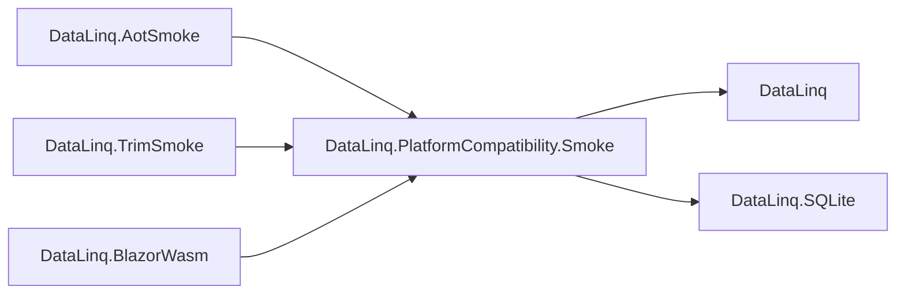
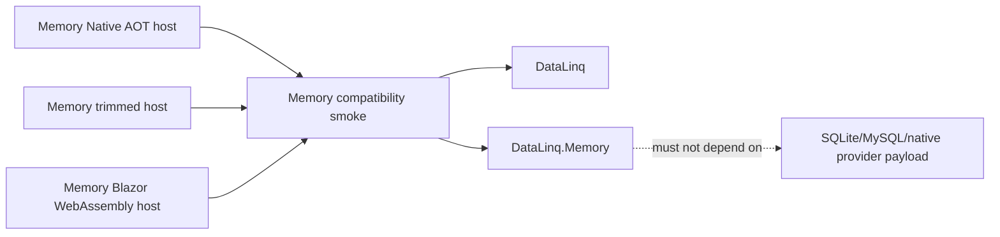

> [!WARNING]
> This document is roadmap implementation material for the DataLinq 0.9 development line. It is not normative product documentation and must not be treated as a shipped support claim.

# 0.9 Release Evidence And Closeout Implementation Plan

**Status:** Accepted.

**Target release:** DataLinq 0.9.

**Created:** 2026-07-10.

**Last reviewed:** 2026-07-10.

**Depends on:** The required workstreams in the [DataLinq 0.9 Implementation Roadmap](README.md). The final closeout begins only after their baseline evidence is green and the release has selected zero or one optional stretch.

## Objective

Close 0.9 with one reproducible body of evidence rather than a collection of individually green feature branches.

The feature plans already define detailed unit and behavior matrices. This plan does not duplicate them. It owns the cross-cutting work that turns those matrices into a release decision:

- build the missing evidence infrastructure early enough that it can influence implementation
- run the complete SQL-provider and memory-backend matrix
- prove the direct memory path under trim, Native AOT, WebAssembly, and WebAssembly AOT
- inspect freshly packed packages rather than project references
- review public API, generated-code, storage, and upgrade compatibility
- record benchmark baselines and final comparisons without inventing marketing claims
- make public documentation match only the behavior proved by the final artifacts
- produce a single release manifest from one identified commit
- stop at a verified, ready-to-publish package set without publishing anything

The release claim remains the narrow claim in the 0.9 roadmap. This plan cannot broaden it.

## Two Different Kinds Of Release Work

Release evidence has two stages that must not be confused.

### Evidence infrastructure starts early

The test lane, memory-only constrained-runtime smokes, package inspection, API comparison, package-consumer smoke, benchmark scenarios, and evidence-manifest shape must be implemented alongside the product work. Waiting until feature freeze would make the release discover architectural and packaging defects far too late.

Early evidence may be provisional. Its purpose is to expose bad seams while they are still affordable to change.

### The release-candidate run happens last

The authoritative reports are produced only after:

- the required 0.9 workstreams are complete
- the baseline gate is green
- the release has selected zero or one stretch
- any selected stretch is complete or has been cut cleanly
- public API is frozen for the release candidate
- feature work has stopped

Final artifacts must come from one identified commit and one documented toolchain. A report copied from an earlier implementation checkpoint is not final release evidence.

## Current Tooling Facts And Gaps

The repository has good 0.8 release tooling, but it does not yet prove the 0.9 release claim.

| Area | Current repository state | Required 0.9 change |
| --- | --- | --- |
| Test suites | `DataLinq.Testing.CLI` currently knows `generators`, `unit`, `compliance`, `mysql`, and `all`. There is no distinct DataLinq memory suite. | Add one TUnit-backed `memory` lane that runs once per invocation and is included deliberately in `all`. Do not label it `sqlite-memory`; that name already means an in-memory SQLite connection. |
| Provider matrix | The active matrix already defines `sqlite-file`, `sqlite-memory`, `mysql-8.4`, `mariadb-10.11`, `mariadb-11.4`, and `mariadb-11.8`. | Make the final 0.9 SQL gate run this exact matrix. Keep DataLinq.Memory outside the SQL server-target multiplication and run its capability suite separately. |
| Constrained-runtime smoke | `DataLinq.PlatformCompatibility.Smoke` references `DataLinq`, the generator, and `DataLinq.SQLite`. `DataLinq.AotSmoke`, `DataLinq.TrimSmoke`, and `DataLinq.BlazorWasm` all consume that SQLite-shaped smoke graph. | Add a memory-only graph that references `DataLinq.Memory` and `DataLinq` but not `DataLinq.SQLite`, `Microsoft.Data.Sqlite`, or SQLitePCLRaw. The existing SQLite graph remains a regression gate. |
| Compatibility reporting | `CompatibilityTargetCatalog` exposes the historical `phase8c` target set, and the documented release thresholds are still described as 0.8 thresholds. | Add a deliberate 0.9 target set/profile containing both existing SQLite regression targets and direct-memory targets, with independently named results and reviewed thresholds. |
| Packing | `publish-nuget.ps1` currently packs `DataLinq`, `DataLinq.SQLite`, `DataLinq.MySql`, `DataLinq.CLI`, and `DataLinq.Tools`. | After the vertical memory spike passes its promotion gate, add the separate preview `DataLinq.Memory` package to the public pack set. Do not put the memory backend into the core package merely to avoid updating release tooling. |
| Package inspection | `package-report` expects the same five packages and treats only the three existing runtime packages as runtime packages. | Add `DataLinq.Memory` to the expected public and runtime package sets and add checks for accidental SQL/native-provider dependencies or assets. |
| Package consumption | Package reports inspect archive contents, but there is no 0.9 consumer proof for the new package graph. | Restore a clean sample against the freshly packed local feed, build generated models, seed/query memory, and exercise an existing SQL provider without project references. |
| Public API compatibility | No repeatable ApiCompat or equivalent package-baseline report is part of the current release gate. | Add a repeatable comparison against the latest 0.8 packages and record every additive change and every intentional or accidental break. A 0.x version is not permission to surprise users casually. |
| Benchmarks | Existing benchmark lanes cover the current query hot path and provider watchpoints. They do not isolate template/invocation work, SQL-adapter overhead, or the memory backend. | Capture the existing baseline before the query foundation changes, then add focused 0.9 scenarios and compare final results. |
| Documentation closeout | The previous public-documentation audit is implemented/closed and mainly describes the 0.8 surface. | Give 0.9 its own documentation target list and final verification gate. |
| Release notes | `CHANGELOG.md` is generated from published GitHub releases by `generate-changelog.ps1`. | Prepare release-note text before publishing. Do not hand-author `CHANGELOG.md` as the pre-release source; regenerate it only after a release exists. |

These gaps are part of 0.9 implementation. They are not optional administrative cleanup.

## Release Flow

The identifiers in this plan are local (`RE-0` through `RE-7`). They are not global roadmap phases.

```mermaid
flowchart LR
    RE0["RE-0: Contract and evidence decisions"] --> RE1["RE-1: Build evidence infrastructure early"]
    RE1 --> IMPL["Required 0.9 implementation"]
    IMPL --> BASE["Provisional baseline evidence"]
    BASE --> STRETCH{"Select zero or one stretch"}
    STRETCH --> FREEZE["Feature and public-API freeze"]
    FREEZE --> RE2["RE-2: Final test matrix"]
    RE2 --> RE3["RE-3: API and upgrade compatibility"]
    RE3 --> RE4["RE-4: Packages and constrained runtimes"]
    RE4 --> RE5["RE-5: Final benchmark comparison"]
    RE5 --> RE6["RE-6: Documentation and release-note draft"]
    RE6 --> RE7["RE-7: Evidence manifest and go/no-go"]
    RE7 --> READY["Ready for manual release action"]
```



`RE-1` is intentionally before most product implementation. `RE-2` through `RE-7` are intentionally after feature freeze.

## Ownership Boundaries

| Work | Owner |
| --- | --- |
| Feature behavior and focused tests | The relevant foundation, scalar, UUID, transaction, memory, or stretch implementation plan |
| Cross-backend capability contract | Query foundation and memory plans |
| Testing CLI suite/catalog integration | This plan |
| Full provider-matrix orchestration | This plan using the existing test-provider catalog |
| Memory-only AOT/trim/browser graph | This plan, consuming the memory plan's supported slice |
| Existing SQLite constrained-runtime behavior | Existing compatibility tooling, rerun here as a regression gate |
| Pack script and package-report integration | This plan |
| Public API baseline comparison | This plan |
| Benchmark scenario implementation and release comparison | This plan, using the benchmark CLI |
| Public documentation wording | This plan after implementation evidence is green |
| NuGet publishing, tags, and external release actions | Explicitly outside this plan; manual user action only |

## DataLinq.Memory Package Decision

The vertical memory spike should not force a public package shape before the architecture works. Promotion is therefore explicit:

1. Build the vertical spike in separate, initially non-packable `DataLinq.Memory` and non-packable `DataLinq.Tests.Memory` projects; do not place it in core.
2. Pass the spike requirements in the [Query Backend And Execution Foundation Implementation Plan](Query%20Backend%20and%20Execution%20Foundation%20Implementation%20Plan.md).
3. Review the public construction, seed, capability, isolation, and diagnostics surface.
4. Promote the implementation to a separate, packable `DataLinq.Memory` preview package.
5. Add that package to all `RE-1` package, smoke, API, and documentation gates.

After the promotion gate, the release shape is not ambiguous: the read-only preview ships as `DataLinq.Memory`, separate from `DataLinq`, `DataLinq.SQLite`, and `DataLinq.MySql`.

The package must:

- target the repository's `net8.0`, `net9.0`, and `net10.0` matrix
- depend on `DataLinq` deliberately
- avoid dependencies on `DataLinq.SQLite`, `DataLinq.MySql`, `Microsoft.Data.Sqlite`, MySqlConnector, SQLitePCLRaw, or other native provider payloads
- expose only the minimum preview construction/seeding surface
- describe itself as an experimental read-only preview
- contain no mutation, transaction, persistence, or SQL compatibility claim

If the spike does not earn promotion, do not publish a hollow package. That is a baseline release decision requiring an explicit roadmap revision, not an excuse to hide the implementation in the core package.

## RE-0: Release Contract And Evidence Decisions

Complete this workstream before foundation implementation changes the public or generated surface materially.

### Lock the support statement

Copy the intended 0.9 statement from the roadmap into the evidence manifest and list the non-claims beside it:

- backend-neutral read-query execution foundation
- scalar converters and typed IDs across in-scope runtime paths
- UUID storage correctness for the bounded provider formats
- existing SQL transaction correctness gates
- generated-model, read-only `DataLinq.Memory` preview
- direct memory trim, Native AOT, WebAssembly, and WebAssembly AOT smoke evidence

Explicit non-claims include memory mutation, memory transactions, persistence, SQL semantic equivalence, arbitrary LINQ, broad joins/grouping, production plan caching, and public async APIs.

### Resolve decisions that affect evidence shape

- confirm the separate `DataLinq.Memory` package promotion rule above
- choose the final public namespace and package description
- choose the public capability-exception shape and ensure diagnostics do not leak invocation values
- verify the frozen `GuidStorageAttribute`/`GuidStorageFormat` shape and the rule that absence of an attribute selects a deterministic DataLinq provider default
- use `0.8.0` as the API/package-consumer baseline unless a newer 0.8.x package is released before implementation begins, in which case record the replacement explicitly
- define whether an optional stretch has any additional package, support-matrix, smoke, or benchmark surface
- define the release-candidate version placeholder, such as `0.9.0-rc.N`, without publishing it

### Define the evidence manifest

Use one release directory per candidate, for example:

```text
artifacts/release/v0.9/<candidate-or-commit>/
  manifest.md
  manifest.json
  tests/
  api/
  packages/
  compatibility/
  benchmarks/
  docs/
  release-notes.md
```

The manifest must record:

- exact commit SHA and branch
- whether the worktree was clean when the authoritative run began
- OS, architecture, .NET SDK, installed workloads, browser, and container-engine versions
- selected release version and selected stretch, if any
- every command, exit code, start/end time, and report path
- test totals per suite and provider target
- warnings, skipped tests, environment caveats, and their disposition
- package ids, versions, SHA-256 hashes, target frameworks, and symbol-package presence
- API comparison baseline and reviewed differences
- constrained-runtime sizes, warnings, banned-payload findings, and smoke status
- benchmark baseline/final artifact pairs and written interpretation
- documentation build/link-check result
- unresolved blockers; the valid final count is zero

Do not rely on terminal scrollback as release evidence.

### RE-0 acceptance criteria

- the release claim and non-claims are written once and referenced by later gates
- the memory package promotion rule is accepted
- the 0.8 compatibility baseline is named
- public API naming decisions required by early work are closed or assigned a deadline before their owning workstream begins
- the evidence directory and manifest fields are defined before reports start accumulating

## RE-1: Build Evidence Infrastructure Early

This workstream runs alongside foundation characterization, scalar metadata work, and the memory vertical spike. It must be substantially complete before the baseline implementation is called feature-complete.

### RE-1A: Add a distinct memory TUnit and Testing CLI lane

Add a TUnit-based memory test project or an equally isolated TUnit lane. The recommended shape is a dedicated project and a Testing CLI suite named `memory`.

The lane must:

- run once, not once per SQL provider target
- use generated models and the real memory package/project
- cover the advertised query capability matrix and deterministic unsupported diagnostics
- cover store-instance isolation and deterministic seed loading
- cover provider-value normalization, typed IDs, canonical `Guid`, entity/scalar materialization, and primary-key identity
- cover cancellation before execution and during bounded scans
- prove mutation APIs fail before changing observable state
- reuse capability-contract fixtures where useful without pretending that SQL-specific fixtures apply
- appear separately in summary JSON and terminal output
- join the Testing CLI `all` suite only after its project is reliable

Do not add DataLinq.Memory as another target inside every SQL compliance test. SQL providers and the memory backend share selected behavior contracts, not implementation or semantic identity.

Representative command after the lane exists:

```powershell
.\scripts\dotnet-sandbox.ps1 run --project src\DataLinq.Testing.CLI -- run --suite memory --output failures --summary-json artifacts\release\v0.9\<candidate>\tests\memory.json
```

### RE-1B: Add a memory-only constrained-runtime graph

The existing graph remains useful but cannot prove the new backend:



Add an independent graph after memory promotion:



The exact project names may follow existing naming conventions. The dependency separation is not optional.

The direct memory smoke must execute, rather than merely publish:

- generated metadata startup
- isolated store construction
- deterministic seed loading containing ordinary scalars, a typed ID, and canonical `Guid`
- primary-key hit and miss
- captured scalar equality
- ordering plus `Take`
- entity materialization
- direct scalar projection
- `Any` or `Count`
- one deterministic unsupported join/grouping diagnostic before enumeration
- cancellation at a bounded execution point where the host permits it

It must not:

- register SQLite
- generate SQL
- load a native database library
- call `Expression.Compile()` or runtime code generation
- rely on filesystem or browser persistence
- route through a compatibility fallback that the memory preview does not claim

The existing generated SQLite smokes remain in the 0.9 target set. A green memory smoke cannot conceal a regression in the product that already shipped.

### RE-1C: Generalize compatibility reporting

Extend the compatibility target catalog with a 0.9 target set or equivalent repeatable selection. Keep target results independently named so reports distinguish:

- SQLite Native AOT
- SQLite trimmed
- SQLite WebAssembly no-AOT
- SQLite WebAssembly AOT
- Memory Native AOT
- Memory trimmed
- Memory WebAssembly no-AOT
- Memory WebAssembly AOT

The current `phase8c` alias may remain for historical compatibility. New release docs should not pretend that a target set named after an old phase proves memory merely because both use .NET publish.

Representative command after the new target set exists:

```powershell
.\scripts\dotnet-sandbox.ps1 run --project src\DataLinq.Dev.CLI -- size-report --target v0.9 --clean-output --release-thresholds --fail-on-threshold --fail-on-banned-payload --format markdown
```

`v0.9` is a placeholder until the tooling change chooses the exact accepted alias. The final plan must replace placeholders with the implemented command.

The report must classify publish, executable/browser smoke, warning, payload, and environment failures separately.

### RE-1D: Integrate the preview package into pack and inspection tooling

After the memory promotion gate:

- add `DataLinq.Memory` to `publish-nuget.ps1`
- add it to the default expected public package set in `PackageInspector`
- add it to the runtime-package set
- require a matching `.snupkg`
- verify `lib/net8.0`, `lib/net9.0`, and `lib/net10.0` assets
- inspect dependency groups for accidental SQL/provider/native dependencies
- inspect package assets for SQLitePCLRaw, SQLite native libraries, MySqlConnector, Roslyn, and Remotion payloads
- verify package id, description, repository metadata, license, readme, symbols, and version alignment
- keep generator assets owned by the core `DataLinq` package rather than duplicating them accidentally in `DataLinq.Memory`

### RE-1E: Add a packed-package consumer smoke

Project-reference success is insufficient. Add a repeatable smoke that consumes only packages from the fresh local pack directory.

The smoke must:

- restore `DataLinq` and `DataLinq.Memory` at the exact candidate version from the local feed
- compile a representative generated database and model
- open the read-only memory store, seed it, and run the documented minimal query path
- verify generator/analyzer assets flow through the package graph
- build against every supported target framework, or use one multi-targeted consumer project that does so
- include a representative existing SQL consumer build so the new package graph does not hide core/provider packaging regressions
- fail if NuGet resolves any package from a stale candidate directory

Representative command after the smoke tooling exists:

```powershell
# Placeholder: replace with the implemented package-smoke command or project.
.\scripts\dotnet-sandbox.ps1 run --project src\DataLinq.Dev.CLI -- package-smoke --package-dir artifacts\nuget-release\v0.9-rc.N --version 0.9.0-rc.N --output artifacts\release\v0.9\<candidate>\packages\consumer-smoke
```

### RE-1F: Establish public API comparison

Adopt `Microsoft.DotNet.ApiCompat`, package validation, or an equivalently repeatable API-report tool. The exact mechanism is less important than reproducibility and review.

Compare freshly packed 0.9 candidates with the chosen 0.8 baseline for:

- `DataLinq`
- `DataLinq.SQLite`
- `DataLinq.MySql`
- `DataLinq.CLI` where its public assembly surface matters

`DataLinq.Memory` is new and has no 0.8 binary baseline. Generate and archive its first public API surface so later releases do.

The comparison must distinguish:

- additive public APIs
- source breaks
- binary breaks
- generated-code contract changes
- intentionally internal implementation changes
- changes to attributes, enums, constructors, exceptions, or interfaces that affect user code

Representative command after the mechanism exists:

```powershell
# Placeholder: replace with the accepted ApiCompat/package-validation command.
.\scripts\dotnet-sandbox.ps1 run --project src\DataLinq.Dev.CLI -- api-report --baseline-version 0.8.0 --package-dir artifacts\nuget-release\v0.9-rc.N --output artifacts\release\v0.9\<candidate>\api
```

### RE-1G: Add benchmark scenarios and capture the pre-change baseline

Before the query-backend foundation replaces the current execution path, run the existing heavy query and provider watchpoint lanes and archive them under a clearly named 0.9-before-foundation baseline.

Then add focused scenarios for:

- structural template creation
- invocation binding with one scalar and one local sequence
- repeated execution through the SQL adapter
- warm and cold SQL primary-key paths across the new source boundary
- memory store construction and seed loading
- memory primary-key hit and miss
- memory scalar scan
- memory filter plus order/paging
- repeated materialization/cache identity
- typed-ID conversion and UUID codec paths where they are measurable without creating a synthetic microbenchmark lie

Do not make a production plan-cache benchmark for a feature 0.9 does not ship.

### RE-1H: Add manifest-friendly outputs

Where a tool currently emits only human-readable output, add or preserve JSON summaries suitable for the release manifest. Every report should include its schema/version, command inputs, target names, outcome, and artifact paths.

### RE-1 acceptance criteria

- `memory` is a first-class TUnit/Testing CLI lane with separate summary output
- a memory-only constrained-runtime graph exists and has no SQLite/provider dependency
- the compatibility reporter can select and distinguish legacy SQLite and direct-memory targets
- pack and package-report defaults include `DataLinq.Memory` after promotion
- a fresh local package-consumer smoke exists
- a repeatable 0.8-to-0.9 public API comparison exists
- benchmark baselines were captured before the architecture change, or the absence of a true baseline is explicitly recorded before implementation proceeds
- every final tool can write a report path suitable for the evidence manifest

## RE-2: Final Test Matrix

Run this workstream after feature and public-API freeze. Focused tests run throughout implementation; these are the authoritative release-candidate results.

### In-process and backend lanes

| Lane | Frequency | Required purpose |
| --- | --- | --- |
| `generators` | Once | Generated metadata, source shape, diagnostics, typed converter/UUID metadata, and generated-root compatibility. |
| `unit` | Once | Query templates/invocations, capabilities, conversions, codecs, lifecycle rules, CLI/tooling, and pure runtime behavior. |
| `memory` | Once | Direct read-only memory capability and semantics matrix. |
| `compliance` | Per selected SQL target as defined by the existing CLI | Cross-provider SQL behavior and transaction correctness. |
| `mysql` | Per MySQL/MariaDB server target | Provider-specific metadata, UUID storage, SQL generation, and server behavior. |

The final SQL provider targets are not shorthand:

| Target | Release role |
| --- | --- |
| `sqlite-file` | File-backed SQLite visibility, transaction, UUID text/binary, cache, and query regressions. |
| `sqlite-memory` | In-memory SQLite provider behavior. This is not `DataLinq.Memory`. |
| `mysql-8.4` | MySQL 8.4 LTS, including binary UUID layouts without `GuidFormat`. |
| `mariadb-10.11` | MariaDB 10.11 LTS/native UUID behavior. |
| `mariadb-11.4` | MariaDB 11.4 LTS/native UUID behavior. |
| `mariadb-11.8` | MariaDB 11.8 LTS/native UUID behavior and current default lane. |

Use the repository's `all` alias because it already names that provider matrix. Do not replace the final run with `latest` merely because it is faster.

### Required behavior groups

The final matrix must include the focused evidence owned by the feature plans:

- self-contained template/invocation isolation and no original-expression execution dependency
- exhaustive capability requirement/advertisement disposition
- SQL primary-key, cold-cache, relation-load, projection, aggregate, and transaction-root regressions
- scalar/typed-ID reads, writes, queries, membership, keys, relations, cache identity, generated/default values, and validation
- UUID native/text/little-endian/RFC-order behavior in the provider combinations claimed by 0.9
- MySQL binary UUID tests without a `GuidFormat` connection option
- a hard-coded or raw-SQL pre-0.9 UUID byte fixture, not a fixture produced by the new codec being tested
- an explicit regression showing a conflicting connector `GuidFormat` cannot redefine column metadata
- SQLite committed visibility and pending-versus-committed cache publication
- mutable provenance, rollback/disposal invalidation, failed-write handling, deletion, primary-key mutation rejection, and read-only transaction guards
- every advertised memory query shape and every documented unsupported category
- cancellation and disposal on success, failure, and early rejection
- the selected stretch's matrix, if one was selected

### Representative commands

Restore and build using the workspace-local wrapper:

```powershell
.\scripts\dotnet-sandbox.ps1 restore src\DataLinq.sln -v minimal
.\scripts\dotnet-sandbox.ps1 run --project src\DataLinq.Dev.CLI -- build src\DataLinq.sln --profile ci --output errors
```

Bring up the complete server matrix where needed:

```powershell
.\scripts\dotnet-sandbox.ps1 run --project src\DataLinq.Testing.CLI -- up --alias all
```

Run the complete suite after the memory lane joins `all`:

```powershell
$env:DATALINQ_TEST_DB_HOST='127.0.0.1'
.\scripts\dotnet-sandbox.ps1 run --project src\DataLinq.Testing.CLI -- run --alias all --batch-size 4 --output failures --summary-json artifacts\release\v0.9\<candidate>\tests\all.json
```

The loopback environment override is needed for server-backed commands inside the native Windows sandbox. A host-side release run may use the normal resolved server endpoints when they are proven healthy.

Until the memory lane is part of `all`, run it explicitly as shown in `RE-1A`; do not omit it.

### RE-2 acceptance criteria

- clean restore and build pass for the release commit
- every required suite passes with zero failed tests
- the complete provider matrix above is present in the summary
- unexpected skips, quarantines, retries, or missing targets are treated as blockers until dispositioned explicitly
- SQL and memory results are compared only for the documented shared subset, with differences recorded rather than hidden
- each feature-plan evidence matrix can point to a final suite/report result
- the selected stretch, if any, is indistinguishable from baseline work in test quality

## RE-3: Public API, Upgrade, And Data Compatibility

This workstream answers whether an existing user can adopt 0.9 without discovering a silent source, binary, generated-code, or data reinterpretation surprise.

### Public API review

Review the repeatable API report from `RE-1F` and the first `DataLinq.Memory` API snapshot.

Pay particular attention to:

- generated database root constructors and source-access types
- public `IDataSourceAccess`, provider, transaction, cache, and row-data surfaces
- new scalar converter registration and metadata APIs
- typed-ID converter error behavior
- `GuidStorageAttribute`, `GuidStorageFormat`, defaults, and diagnostics
- capability exceptions and diagnostic properties
- memory store/build/seed APIs
- disposal, ownership, concurrency, isolation, and mutability implications
- enum additions that might affect exhaustive user switches
- public types accidentally exposed solely to connect internal backend seams

Internal contracts should remain internal through the preview unless a real user-facing need proves otherwise.

Every detected break must be one of:

- fixed before release
- accepted deliberately with migration/rebuild instructions and release-note prominence
- evidence that 0.9 must be delayed or rescoped

“It is only 0.x” is not an adequate disposition.

### Generated-code and package-consumer compatibility

Use representative 0.8-era model/config fixtures to prove:

- rebuilding with the 0.9 core/generator produces valid generated code
- normal SQL database construction remains source-compatible where intended
- generated roots no longer need the concrete SQL-shaped cast internally without forcing unnecessary public constructor churn
- existing SQLite and MySQL/MariaDB consumer samples compile against the packed 0.9 packages
- package consumers do not need project references or repository-only analyzer wiring

If binaries compiled against 0.8 must be rebuilt because generated/runtime contracts changed, say so explicitly. Do not confuse source regeneration compatibility with binary compatibility.

### UUID and schema compatibility

Prove the compatibility stance in the UUID plan:

- existing MySQL `BINARY(16)` defaults remain little-endian compatibility layout
- known bytes written with pre-0.9 semantics remain readable and queryable
- equality, `Contains`, primary keys, relations, update, and delete bind the same physical layout
- connector-wide `GuidFormat` is unnecessary and cannot override column meaning
- explicit RFC-order data remains distinct
- MariaDB native UUID and SQLite text behavior retain their documented defaults
- a byte-layout-only change is reported as a semantic/manual migration even when SQL type stays `BINARY(16)`
- no automatic UUID data rewrite is generated or implied
- the UUIDv7/model-default versus MySQL/MariaDB `UUID()` mismatch has an actionable diagnostic

### Memory preview contract review

Before API freeze, review the separate package as a product surface:

- construction makes store-instance isolation obvious
- seed input is validated and copied/owned predictably
- canonical provider values are not exposed as public model row state
- mutation and transaction calls fail immediately and leave no partial state
- unsupported query diagnostics name the backend and feature without leaking values
- thread-safety and concurrent-read behavior are either proved or documented as unsupported
- disposal/lifetime semantics are explicit even if the implementation owns no native resource
- the name “Memory” cannot reasonably be confused with SQLite `:memory:` in public docs

### RE-3 acceptance criteria

- a reviewed 0.8-to-0.9 API report exists for every existing public package
- the first `DataLinq.Memory` public API snapshot is archived
- no accidental public backend seam remains
- a packed-package consumer builds representative generated memory and SQL models
- every accepted break has precise migration/rebuild wording
- legacy UUID data is proved with independent physical fixtures
- no in-scope storage representation changes silently

## RE-4: Packaging, Trim, Native AOT, And Browser Evidence

This workstream uses fresh packed packages and clean constrained-runtime outputs. It does not accept a successful project build as package evidence or a successful WebAssembly publish as browser evidence.

### Pack without publishing

Use the repository workflow with an explicit candidate version and fresh directory:

```powershell
.\publish-nuget.ps1 -PackOnly -Version 0.9.0-rc.N -PackageOutputPath artifacts\nuget-release\v0.9-rc.N
```

`N` is a placeholder. The actual candidate version and output directory must be unique and recorded in the manifest.

After `RE-1D`, the expected public packages are:

- `DataLinq`
- `DataLinq.SQLite`
- `DataLinq.MySql`
- `DataLinq.Memory`
- `DataLinq.CLI`
- `DataLinq.Tools`

Inspect that exact fresh directory:

```powershell
.\scripts\dotnet-sandbox.ps1 run --project src\DataLinq.Dev.CLI -- package-report --package-dir artifacts\nuget-release\v0.9-rc.N --format markdown
```

The updated default expected/runtime package sets should make extra override flags unnecessary. If overrides remain necessary, record the exact lists in the manifest so the report cannot silently omit Memory.

Run the package-consumer smoke from `RE-1E` against that same directory and version.

### Package acceptance checks

- all six expected package ids are present and no unexpected ids are present
- package versions match exactly
- every `.nupkg` has its `.snupkg`
- runtime packages contain their intended `net8.0`, `net9.0`, and `net10.0` assemblies
- repository, license, readme, symbol, and source metadata are present
- `DataLinq` still owns generator analyzer assets correctly
- Roslyn and Remotion remain absent from runtime dependency groups/assets
- `DataLinq.Memory` has no SQL provider, ADO.NET provider, SQLitePCLRaw, or native database dependency/assets
- `DataLinq.Memory` depends only on the deliberate core/runtime graph
- package hashes are recorded before any manual external action

### Run clean compatibility evidence

After the 0.9 target set exists:

```powershell
.\scripts\dotnet-sandbox.ps1 run --project src\DataLinq.Dev.CLI -- size-report --target v0.9 --clean-output --release-thresholds --fail-on-threshold --fail-on-banned-payload --format markdown
```

Replace `v0.9` with the implemented alias if it differs.

Required outcomes:

- existing SQLite Native AOT publishes and executes its documented smoke
- existing SQLite trimmed output publishes and executes its documented smoke
- existing SQLite browser no-AOT and AOT publishes execute in a real browser
- memory Native AOT publishes and executes the direct memory smoke
- memory trimmed output publishes and executes the direct memory smoke
- memory browser no-AOT and AOT publishes execute the direct memory smoke in a real browser
- browser results include console/page errors and the last reached smoke step
- memory output contains no native SQLite/provider payload
- supported memory execution uses no runtime expression compilation or dynamic code generation
- warning counts and owners are explicit
- existing SQLitePCLRaw warnings remain visible and scoped to the SQLite graph; they must not contaminate the memory-only graph
- thresholds use reviewed 0.9 baselines and report symbol-excluded/native and compressed-browser sizes honestly

If WebAssembly build behavior differs inside the native Windows sandbox, rerun the same release command outside the sandbox before classifying it as a product failure. The authoritative report must say where and how it ran.

### RE-4 acceptance criteria

- pack, package report, and package-consumer smoke all use the same fresh candidate directory
- all package checks pass and hashes are in the manifest
- every SQLite and memory constrained target publishes and executes
- a memory-only dependency/payload proof exists, not merely a code path inside the SQLite smoke
- no banned payload or unexplained new warning remains
- any threshold change is reviewed and justified by product changes, not raised to make a red report green

## RE-5: Benchmark Baseline And Final Comparison

Performance evidence protects existing SQL users from paying an unexplained tax for the new backend boundary. It also establishes honest first baselines for memory. It is not a competition between an in-process dictionary and a database server.

### Pre-foundation baseline

Before the execution refactor, capture the existing heavy lanes:

```powershell
.\scripts\dotnet-sandbox.ps1 run --project src\DataLinq.Benchmark.CLI -- run --phase3-query-hotpath --profile heavy --history-json artifacts\benchmarks\history\v0.9-before-foundation-query-hotpath.json
.\scripts\dotnet-sandbox.ps1 run --project src\DataLinq.Benchmark.CLI -- run --phase2-watch --profile heavy --history-json artifacts\benchmarks\history\v0.9-before-foundation-provider-watch.json
```

If implementation has already begun before these commands run, label the evidence honestly; do not call it a pre-change baseline.

### Final existing-path comparison

Rerun the same scenarios and profile from the release commit:

```powershell
.\scripts\dotnet-sandbox.ps1 run --project src\DataLinq.Benchmark.CLI -- run --phase3-query-hotpath --profile heavy --history-json artifacts\benchmarks\history\v0.9-final-query-hotpath.json
.\scripts\dotnet-sandbox.ps1 run --project src\DataLinq.Benchmark.CLI -- run --phase2-watch --profile heavy --history-json artifacts\benchmarks\history\v0.9-final-provider-watch.json
```

Compare:

- parsing/template construction
- repeated scalar and membership queries
- SQL rendering/parameterization
- warm and startup primary-key paths
- provider initialization
- allocations per operation
- telemetry shape, to detect accidentally duplicated plan walks or materialization

### New 0.9 lanes

Add and run focused benchmark selections. Placeholder command shape:

```powershell
# Placeholder: replace names with implemented benchmark selections.
.\scripts\dotnet-sandbox.ps1 run --project src\DataLinq.Benchmark.CLI -- run --v09-query-backend --profile heavy --history-json artifacts\benchmarks\history\v0.9-final-query-backend.json
.\scripts\dotnet-sandbox.ps1 run --project src\DataLinq.Benchmark.CLI -- run --v09-memory-read --profile heavy --history-json artifacts\benchmarks\history\v0.9-final-memory-read.json
```

The new scenarios should isolate:

- structural template creation from invocation creation
- invocation isolation/rebinding cost
- SQL adapter overhead without changing database workload
- memory store startup and seed loading
- primary-key hit and miss
- bounded scan/predicate
- ordering/paging
- repeated entity and scalar materialization
- allocations for each path

Do not compare memory latency to MySQL latency as proof that memory is “faster.” That comparison is intellectually empty.

### Interpretation rules

- allocation changes are generally more stable than small local timing changes
- use heavy-profile history, not one noisy default-profile run, for conclusions
- investigate a structural or repeatable SQL regression before weakening the backend boundary
- if a regression is accepted, state its size, scenario, reason, and why the architecture benefit justifies it
- establish memory numbers as baselines, not promises
- do not claim production plan-cache savings because 0.9 ships no production plan cache
- do not use benchmark means as marketing copy unless repeated history makes the claim defensible

### RE-5 acceptance criteria

- pre-change and final artifacts exist for the same existing SQL scenarios, or the missing true baseline is disclosed
- final focused query-backend and memory artifacts exist
- allocation and latency results have a written interpretation
- no unexplained repeatable regression remains
- docs distinguish measurement evidence from performance promises

## RE-6: Documentation And Release-Note Draft

Documentation follows green implementation evidence. It must not run ahead of the package, provider, or constrained-runtime reports.

### Public documentation targets

At minimum, review and update:

- root `README.md`, root `index.md`, and `docs/index.md` where the new package changes discovery or installation
- `docs/getting-started/Installation.md`
- a dedicated public memory-backend page under `docs/backends/` and `docs/toc.yml`
- `docs/Supported LINQ Queries.md`
- `docs/support-matrices/LINQ Translation Support Matrix.md`
- `docs/Querying.md`
- `docs/Implementing a new backend.md`, while making clear that 0.9 does not publish a general third-party backend plugin API
- `docs/Attributes and Model Definitions.md` for scalar converters, typed IDs, and UUID storage metadata
- `docs/backends/MySQL-MariaDB.md`
- `docs/backends/SQLite.md`
- `docs/Transactions.md`
- `docs/Caching and Mutation.md`
- `docs/Platform Compatibility.md`
- `docs/Benchmark Results.md`
- `docs/support-matrices/Test Provider Matrix.md` and contributor CLI docs for the new memory suite/compatibility targets
- `docs/Roadmap.md`

The public memory page must say:

- separate `DataLinq.Memory` preview package
- generated models only
- read-only preview
- explicit seeding and isolated store instances
- exact supported query subset
- exact unsupported operations and deterministic capability errors
- no SQL semantic-equivalence promise
- no replacement for provider-backed integration tests
- no mutation, transactions, persistence, filesystem/browser storage, or raw SQL

The LINQ support matrix must record memory support per shape. It must not inherit a green SQL cell automatically.

UUID docs must record provider defaults, physical formats, compatibility little-endian behavior, ambiguous schema warnings, the absence of automatic byte-layout migration, and database UUID-generation caveats.

Platform compatibility must distinguish:

- existing generated SQLite constrained-runtime evidence
- direct, provider-free memory constrained-runtime evidence
- Native AOT, trim, browser no-AOT, and browser AOT as separate claims

### Maintainer documentation

Update:

- `docs/contributing/DataLinq.Testing.CLI.md` for the `memory` suite
- `docs/contributing/DataLinq.Dev.CLI.md` for the implemented 0.9 compatibility target set and package-report package lists
- `docs/contributing/DataLinq.Benchmark.CLI.md` for the new focused lanes
- the 0.9 roadmap and each completed implementation plan with final status/evidence links

Do not leave commands containing placeholders in final contributor docs.

### Release-note and changelog policy

Prepare a release-note draft under the evidence directory, for example:

```text
artifacts/release/v0.9/<candidate>/release-notes.md
```

The draft should include:

- the narrow release thesis
- new package/API highlights
- SQL-provider compatibility and transaction fixes
- typed-ID and UUID behavior
- exact memory preview boundary
- upgrade/rebuild or migration notes
- AOT/browser support boundary
- known limitations and deferred work
- package list

Do not manually use `CHANGELOG.md` as the pre-release authoring source. The repository's `generate-changelog.ps1` reads published GitHub releases; changelog regeneration belongs after the user has performed the external release action.

### Documentation verification

Run:

```powershell
docfx build docfx.json
```

Also run the repository's Markdown link validation or an equivalent explicit check. DocFX alone does not prove every deep relative link resolves.

Inspect generated `_site` pages for:

- the memory page and navigation
- installation/package ids
- support-matrix layout
- platform-compatibility wording
- provider UUID tables
- roadmap wording

### RE-6 acceptance criteria

- public docs describe only green final evidence
- memory and SQLite in-memory modes cannot be confused
- support matrices list backend-specific support and exclusions
- UUID compatibility/migration caveats are explicit
- release notes contain upgrade and known-limitations sections
- contributor commands match the implemented tools
- DocFX and explicit link validation pass
- generated site output is inspected, not merely generated
- `CHANGELOG.md` remains governed by the post-release generation workflow

## RE-7: Final Evidence Manifest And Go/No-Go

This is the final closeout. It adds no product behavior.

### Freeze and run discipline

Before the authoritative run:

- stop feature work
- identify the candidate commit
- record worktree state
- select zero or one stretch and record the decision
- ensure every placeholder command in this plan has been replaced by implemented command syntax
- start with fresh package, compatibility, and report directories
- do not mix artifacts from different commits under one candidate directory

Run the final gates in this order:

1. environment/toolchain inventory
2. clean restore and build
3. complete Testing CLI/provider matrix
4. API compatibility report and review
5. fresh pack without publishing
6. package report and package-consumer smoke
7. clean SQLite and memory constrained-runtime report
8. final benchmark refresh and interpretation
9. public/maintainer documentation update
10. DocFX build, link validation, and generated-site inspection
11. release-note draft
12. manifest completeness and blocker review

The order matters. Documentation and release notes should describe the package and runtime artifacts that actually passed, not what the team expected to pass.

### Evidence manifest summary

The final `manifest.md` should contain a compact table like:

| Gate | Result | Command/report | Commit | Notes |
| --- | --- | --- | --- | --- |
| Build | Pass/Fail | path | SHA | SDK/host |
| Tests: generators | Pass/Fail | path | SHA | totals |
| Tests: unit | Pass/Fail | path | SHA | totals |
| Tests: memory | Pass/Fail | path | SHA | totals |
| Tests: SQL matrix | Pass/Fail | path | SHA | every target |
| API compatibility | Pass/Fail | path | SHA | accepted differences |
| Pack/package report | Pass/Fail | path | SHA | package hashes |
| Package consumer | Pass/Fail | path | SHA | TFMs |
| SQLite compatibility | Pass/Fail | path | SHA | target results |
| Memory compatibility | Pass/Fail | path | SHA | target results/no native provider |
| Benchmarks | Pass/Fail/Informational | path | SHA | disposition |
| Docs | Pass/Fail | path | SHA | DocFX/link check/site inspection |
| Release notes | Ready/Not ready | path | SHA | upgrade notes |

All required rows must refer to the same commit. If an evidence-only harness or documentation fix changes the commit, rerun the affected gates and update the manifest honestly.

### Blocker policy

The following block the 0.9 release candidate:

- any required suite or advertised provider target fails or is missing
- the memory lane is absent from the final test summary
- SQL execution behavior regresses through the backend adapter without an accepted correction
- a legacy UUID fixture becomes unreadable or binds different physical values
- SQLite committed visibility or mutable-lifecycle correctness remains red
- `DataLinq.Memory` cannot pass its package-promotion gate
- a memory constrained-runtime smoke includes SQLite/native-provider payload or does not execute in the browser
- an existing SQLite constrained-runtime release claim regresses
- a packed-package consumer cannot build/run
- an unreviewed public API break exists
- package ids, versions, target frameworks, dependencies, symbols, or hashes are inconsistent
- banned payload findings remain
- a warning or benchmark regression is hidden rather than dispositioned
- public docs claim more than the final reports prove
- the evidence manifest mixes commits or has unexplained omissions

The optional stretch is always the first thing cut. It may not delay or weaken a correctness gate.

Baseline work is not silently cut. If the memory preview, UUID correctness, transaction correctness, or execution foundation cannot pass, the choices are to fix the issue, delay 0.9, or explicitly revise the roadmap and release thesis. Quietly deleting a failed baseline line from release notes is not an acceptable release process.

### Environment failures

Toolchain, browser, container, network, or sandbox failures are not automatically product failures, but they are not passes either.

- diagnose the classification
- rerun the same command in the appropriate supported host environment
- record both the failed attempt and authoritative rerun when useful
- do not replace a runtime smoke with publish-only evidence
- do not call a target green when it never executed

### No-publish boundary

This plan ends when:

- the final package directory is verified
- package hashes and reports are recorded
- release-note text is ready
- the evidence manifest has zero unresolved blockers
- the candidate is ready for the user to release manually

Do not run NuGet push, create tags, publish a GitHub release, or automate external release actions under this plan. The user owns those actions.

After an external release exists, `generate-changelog.ps1` may be run in the normal workflow to regenerate `CHANGELOG.md`. That post-release maintenance is not part of the pre-release gate.

### RE-7 acceptance criteria

- every required final gate refers to one identified commit
- the stretch decision is recorded
- package hashes and exact versions are recorded
- all warnings, skips, API differences, and benchmark changes have dispositions
- unresolved blocker count is zero
- release-note draft matches the final support boundary
- no package, tag, or release has been published by this plan

## Overall Definition Of Done

This plan is complete when:

- release evidence infrastructure was implemented early enough to influence the 0.9 architecture
- the complete TUnit and SQL provider matrix passes
- `DataLinq.Memory` is a separately packed read-only preview after passing its spike promotion gate
- fresh packages pass inspection and a real package-consumer smoke
- public API and upgrade compatibility have been reviewed against 0.8
- legacy UUID data and existing SQL provider behavior remain correct
- direct memory and existing SQLite paths execute under every constrained target claimed by the release
- benchmark baselines and final comparisons are recorded and interpreted honestly
- public documentation and release-note text match the final artifacts
- one complete evidence manifest has zero unresolved blockers
- the verified package set is ready for manual user action, with no publishing performed

## Links

- [DataLinq 0.9 Implementation Roadmap](README.md)
- [0.9 Implementation Order And Integration Plan](Implementation%20Order%20and%20Integration%20Plan.md)
- [Query Backend And Execution Foundation Implementation Plan](Query%20Backend%20and%20Execution%20Foundation%20Implementation%20Plan.md)
- [Scalar Converters And Typed IDs Implementation Plan](Scalar%20Converters%20and%20Typed%20IDs%20Implementation%20Plan.md)
- [UUID Storage Format Support](../../providers-and-features/UUID%20Storage%20Format%20Support.md)
- [Read-Only Memory Backend Implementation Plan](In-Memory%20Database%20Implementation%20Plan.md)
- [SQLite Transaction Isolation Alignment](../../providers-and-features/SQLite%20Transaction%20Isolation%20Alignment.md)
- [Mutable Instance Lifecycle](../../query-and-runtime/Mutable%20Instance%20Lifecycle.md)
- [SQL Transaction And Mutable Lifecycle Implementation Plan](SQL%20Transaction%20and%20Mutable%20Lifecycle%20Implementation%20Plan.md)
- [Practical AOT And Size Plan](../../platform-compatibility/Practical%20AOT%20and%20Size%20Plan.md)
- [Test Provider Matrix](../../../support-matrices/Test%20Provider%20Matrix.md)
- [DataLinq.Testing.CLI](../../../contributing/DataLinq.Testing.CLI.md)
- [DataLinq.Dev.CLI](../../../contributing/DataLinq.Dev.CLI.md)
- [DataLinq.Benchmark.CLI](../../../contributing/DataLinq.Benchmark.CLI.md)
- [0.8 Release Evidence Closeout](../v0.8/phase-24-release-evidence-benchmarks-docs/Implementation%20Plan.md)
