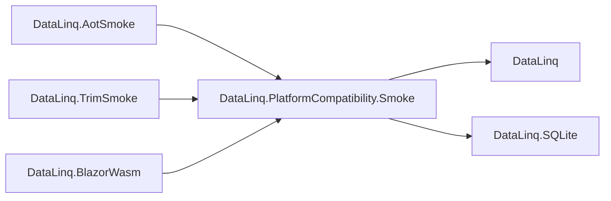
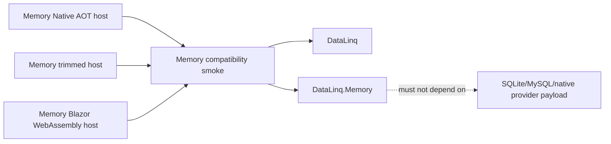

> [!WARNING]
> This document is roadmap implementation material for the DataLinq 0.9 development line. It is not normative product documentation and must not be treated as a shipped support claim.

# 0.9 Release Evidence And Closeout Implementation Plan

**Status:** Accepted. The bounded W8 project-reference Memory constrained-runtime graph, SC-6A canonical-`Guid` equality island, D5-B local package promotion, aggregate M0, bounded M1-A exact non-null inequality, bounded M1-B exact Boolean composition, bounded M1-C exact non-null `Int32` relational comparison, bounded M1-D exact local `Int32` membership, bounded M1-E exact ordered final `Skip`, bounded M1-F exact `Single`/`SingleOrDefault`, bounded M1-G exact ordered `Skip`/`Take` window, bounded M1-H exact ordered `First`/`FirstOrDefault`, W10 steps 1-2 / RE-1D package-tool integration, W10 step 3 / RE-1A Testing CLI registration, W10 step 4 / RE-1C compatibility reporting, RE-1E aligned package-consumer evidence, the current-development RE-1F public-API checkpoint, W10 step 5 (the source-project and exact-package eight-target matrices), the current-development W10 step 6 / RE-1G focused benchmark lanes, and the RE-1H-A Testing CLI, RE-1H-B package-report, RE-1H-C benchmark history/comparison, and RE-1H-D compatibility size-report manifest-output implementation checkpoints are implemented and green. The query selector has six isolated planning/binding/adapter cases and a clean heavy checkpoint; the provider-free Memory selector has nine construction/seed/read/identity/Guid-binding cases, Memory-specific telemetry, and its own clean heavy checkpoint. Neither focused lane has a true pre-foundation equivalent; that limitation is explicit. Aggregate M1/M2 remain open; the current profiles are Memory `57`, catalog `616`, and SQL `358` supported / `258` unsupported. Aggregate RE-1H, manifest consumption, W10 steps 7-9, RE-5 final benchmark execution/disposition, aggregate RE-1/RE-4/W10/W11, final-RC repetition of the package, consumer, API, benchmark, and constrained-runtime gates, final release-candidate closeout, and publication remain open.

**Target release:** DataLinq 0.9.

**Created:** 2026-07-10.

**Last reviewed:** 2026-08-07.

**Depends on:** The required workstreams in the [DataLinq 0.9 Implementation Roadmap](README.md). The final closeout begins only after their baseline evidence is green and the release has selected zero or one optional stretch.

## Objective

Close 0.9 with one reproducible body of evidence rather than a collection of individually green feature branches.

The feature plans already define detailed unit and behavior matrices. This plan does not duplicate them. It owns the cross-cutting work that turns those matrices into a release decision:

- build the missing evidence infrastructure early enough that it can influence implementation
- run the complete SQL-provider and memory-backend matrix
- prove the direct memory path under trim, Native AOT, WebAssembly, and WebAssembly AOT
- inspect freshly packed packages rather than project references
- review public API, generated-code, storage, and upgrade compatibility
- record benchmark baselines and final comparisons without inventing marketing claims
- make public documentation match only the behavior proved by the final artifacts
- produce a single release manifest from one identified commit
- stop at a verified, ready-to-publish package set without publishing anything

The release claim remains the narrow claim in the 0.9 roadmap. This plan cannot broaden it.

## Two Different Kinds Of Release Work

Release evidence has two stages that must not be confused.

### Evidence infrastructure starts early

The test lane, memory-only constrained-runtime smokes, package inspection, API comparison, package-consumer smoke, benchmark scenarios, and evidence-manifest shape must be implemented alongside the product work. Waiting until feature freeze would make the release discover architectural and packaging defects far too late.

Early evidence may be provisional. Its purpose is to expose bad seams while they are still affordable to change.

### The release-candidate run happens last

The authoritative reports are produced only after:

- the required 0.9 workstreams are complete
- the baseline gate is green
- the release has selected zero or one stretch
- any selected stretch is complete or has been cut cleanly
- public API is frozen for the release candidate
- feature work has stopped

Final artifacts must come from one identified commit and one documented toolchain. A report copied from an earlier implementation checkpoint is not final release evidence.

## Current Tooling Facts And Gaps

The repository has good 0.8 release tooling, but it does not yet prove the 0.9 release claim.

| Area | Current repository state | Required 0.9 change |
| --- | --- | --- |
| Test suites | `DataLinq.Testing.CLI` now knows `generators`, `unit`, `memory`, `compliance`, `mysql`, and `all`. The targetless `memory` project lane runs once and is included exactly once in `all`; `sqlite-memory` retains its in-memory SQLite target meaning. | **Complete for W10 step 3 / RE-1A registration.** Keep this project-based lane distinct from provider-free compatibility and package-consumer evidence. |
| Provider matrix | The active matrix already defines `sqlite-file`, `sqlite-memory`, `mysql-8.4`, `mariadb-10.11`, `mariadb-11.4`, and `mariadb-11.8`. | Make the final 0.9 SQL gate run this exact matrix. Keep DataLinq.Memory outside the SQL server-target multiplication and run its capability suite separately. |
| Constrained-runtime smoke | The historical SQLite graph and separate Memory graph are registered as eight independently named targets in the accepted `v0.9` compatibility surface. The complete clean source-project matrix and the exact `0.9.0-preview.w10.3` package-backed matrix both publish, execute, and inspect all eight targets successfully; the package-backed matrix additionally proves per-target package provenance, and Memory outputs scan clean for SQL-provider/native-database payload. | **Complete for W10 step 5 at the aligned-preview checkpoint.** Repeat the exact package-backed matrix against the final RC; this preview checkpoint is not final release evidence. |
| Compatibility reporting | `CompatibilityTargetCatalog` exposes both the historical/default `phase8c` set and the eight-target `v0.9` set. Newly generated reports use schema `v0.9.compatibility-size-report.v6` and record resolved invocation/strict intent, timing, outcome/completeness/review/validity, guarded artifact paths and hashes, exact package inputs/aggregate and end-of-run stability, per-target archive/cache/extracted-file provenance, isolated candidate scratch/cache, checkout start/end state, and entry/DevTools assembly revision plus clean-build attestation. | **Complete for RE-1C / W10 steps 4-5 infrastructure and the RE-1H-D tooling checkpoint.** Preserve historical v2 and v5 artifacts and dated checkpoint descriptions without relabeling them; repeat the new strict exact-package contract against the final RC. |
| Packing | `publish-nuget.ps1` now packs six public packages, including the separate preview `DataLinq.Memory`, rejects non-empty output, and honors an explicit candidate through `MinVerVersionOverride`. | **Complete for W10 step 1 / RE-1D.** Keep Memory separate from core and retain the exact fresh-directory/version checks. |
| Package inspection | `package-report` preserves the fail-closed six-public/four-runtime package policy and now emits schema `v0.9.package-inspection-report.v4` with resolved invocation, timing, outcome/completeness, artifact paths, per-package-and-symbol archive hashes, path-independent candidate identity, exact version/commit/stability, structured failures, and clean checkout/runner/candidate attestation. | **Complete for W10 step 2 / RE-1D policy and the RE-1H-B tooling checkpoint.** Run the strict v4 contract against the final RC; this implementation checkpoint is not aggregate RE-4 evidence. |
| Package consumption | `package-smoke` drives a tracked project-reference-free consumer through an isolated exact-version local restore, net8/net9/net10 builds with per-TFM generated-source proof, public Memory and SQLite execution, and a MySQL public-surface compilation probe. Outer schema `v0.9.package-consumer-smoke-report.v2` records timing, outcome/completeness, candidate and restored-package hashes, commands/logs, and report paths; the bounded execution payload remains v1. | **Complete for RE-1E at the aligned preview and RE-1H-E tooling.** Repeat against the final RC; do not confuse this with the separate packaged constrained-runtime gate. |
| Public API compatibility | `api-report` now pins ApiCompat 10.0.302, locks exact published 0.8 package bytes and repository provenance, snapshots 33 package surfaces, compares four library packages plus all three CLI tool assets, self-validates inherited package-framework divergences, and records JSON/Markdown/raw evidence. Clean candidate `0.9.0-preview.re1f.2` has zero hard findings after review of 216 compatible diagnostics, three first Memory surfaces, and two exact tracked inherited divergences. | **Complete for RE-1F at the current-development preview checkpoint.** Repeat the exact gate and review against the final RC; generated-source and behavioral compatibility remain separate RE-3 work. |
| Benchmarks | Existing lanes cover the broad query hot path and provider watchpoints. The `v0.9-query-backend` selector has six focused planning/binding/adapter cases; clean commit `1cb725d4` has a complete two-provider heavy artifact with exact allocations, latency/error, operation counts, telemetry, two marginal minimum-iteration warnings, and retained SQLite-memory adapter noise. The separate `v0.9-memory-read` selector has nine provider-free construction/seed/read/identity/Guid-binding cases; clean commit `24374aa9` has a complete one-provider heavy artifact with exact Memory telemetry, low measured uncertainty, and three minimum-iteration warnings. New numeric/named v3 history/comparison reports record exact scope, raw artifacts/hashes, row identity, review semantics, and runner provenance; strict validity accepts only exact canonical heavy lanes. | **Complete for the current-development W10 step 6 / RE-1G checkpoint and RE-1H-C reporting tooling only.** Repeat both selectors against the final RC, compare retained SQL lanes only where genuinely comparable, disposition legacy-v2 comparisons explicitly, and keep RE-5 execution plus aggregate manifest consumption open. |
| Documentation closeout | The previous public-documentation audit is implemented/closed and mainly describes the 0.8 surface. | Give 0.9 its own documentation target list and final verification gate. |
| Release notes | `CHANGELOG.md` is generated from published GitHub releases by `generate-changelog.ps1`. | Prepare release-note text before publishing. Do not hand-author `CHANGELOG.md` as the pre-release source; regenerate it only after a release exists. |

These gaps are part of 0.9 implementation. They are not optional administrative cleanup.

## Release Flow

The identifiers in this plan are local (`RE-0` through `RE-7`). They are not global roadmap phases.


```mermaid
flowchart LR
    RE0["RE-0: Contract and evidence decisions"] --> RE1["RE-1: Build evidence infrastructure early"]
    RE1 --> IMPL["Required 0.9 implementation"]
    IMPL --> BASE["Provisional baseline evidence"]
    BASE --> STRETCH{"Select zero or one stretch"}
    STRETCH --> FREEZE["Feature and public-API freeze"]
    FREEZE --> RE2["RE-2: Final test matrix"]
    RE2 --> RE3["RE-3: API and upgrade compatibility"]
    RE3 --> RE4["RE-4: Packages and constrained runtimes"]
    RE4 --> RE5["RE-5: Final benchmark comparison"]
    RE5 --> RE6["RE-6: Documentation and release-note draft"]
    RE6 --> RE7["RE-7: Evidence manifest and go/no-go"]
    RE7 --> READY["Ready for manual release action"]
```

`RE-1` is intentionally before most product implementation. `RE-2` through `RE-7` are intentionally after feature freeze.

## Ownership Boundaries

| Work | Owner |
| --- | --- |
| Feature behavior and focused tests | The relevant foundation, scalar, UUID, transaction, memory, or stretch implementation plan |
| Cross-backend capability contract | Query foundation and memory plans |
| Testing CLI suite/catalog integration | This plan |
| Full provider-matrix orchestration | This plan using the existing test-provider catalog |
| Memory-only AOT/trim/browser graph | This plan, consuming the memory plan's supported slice |
| Existing SQLite constrained-runtime behavior | Existing compatibility tooling, rerun here as a regression gate |
| Pack script and package-report integration | This plan |
| Public API baseline comparison | This plan |
| Benchmark scenario implementation and release comparison | This plan, using the benchmark CLI |
| Public documentation wording | This plan after implementation evidence is green |
| NuGet publishing, tags, and external release actions | Explicitly outside this plan; manual user action only |

## DataLinq.Memory Package Decision

The vertical memory spike should not force a public package shape before the architecture works. Promotion is therefore explicit:

1. Build the vertical spike in separate, initially non-packable `DataLinq.Memory` and non-packable `DataLinq.Tests.Memory` projects; do not place it in core.
2. Pass the spike requirements in the [Query Backend And Execution Foundation Implementation Plan](Query%20Backend%20and%20Execution%20Foundation%20Implementation%20Plan.md).
3. Review the public construction, seed, capability, isolation, and diagnostics surface.
4. Promote the implementation to a separate, packable `DataLinq.Memory` preview package.
5. Add that package to the `RE-1` package, API, and documentation gates, then rerun the already-proven memory smoke graph through the accepted release/package harness rather than recreating it after promotion.

After the promotion gate, the release shape is not ambiguous: the read-only preview ships as `DataLinq.Memory`, separate from `DataLinq`, `DataLinq.SQLite`, and `DataLinq.MySql`.

The package must:

- target the repository's `net8.0`, `net9.0`, and `net10.0` matrix
- depend on `DataLinq` deliberately
- avoid dependencies on `DataLinq.SQLite`, `DataLinq.MySql`, `Microsoft.Data.Sqlite`, MySqlConnector, SQLitePCLRaw, or other native provider payloads
- expose only the minimum preview construction/seeding surface
- describe itself as an experimental read-only preview
- contain no mutation, transaction, persistence, or SQL compatibility claim

If the spike does not earn promotion, do not publish a hollow package. That is a baseline release decision requiring an explicit roadmap revision, not an excuse to hide the implementation in the core package.

D5-B closes steps 1 through 4 with an explicit experimental-preview promotion decision. `DataLinq.Memory` is packable; `DataLinq.Tests.Memory` remains non-packable. Local core and Memory packages at `0.9.0-preview.d5b.5` have matching identities, and each Memory TFM group carries only a same-candidate `DataLinq` minimum with build/analyzer assets excluded. The package embeds a dedicated Memory preview README that states the bounded supported surface and the unsupported mutation, transaction, durability, persistence, raw SQL, relation, join/grouping, projection, and general-LINQ boundaries. The runtime archive contains exactly one managed Memory assembly for net8, net9, and net10, while the symbol archive contains one PDB per TFM. Direct archive, metadata, and binary-token inspection finds no SQL-provider, native-database, Roslyn, Remotion, generator, analyzer, runtime, native, build, or tool payload. The explicit two-package report has zero findings, and ordinary MinVer-driven packing no longer produces the earlier stable-package/prerelease-dependency `NU5104` failure. Step 5 and every release-harness/package-consumer rerun remain W10 work; no package was published.

## RE-0: Release Contract And Evidence Decisions

Complete this workstream before foundation implementation changes the public or generated surface materially.

### Lock the support statement

Copy the intended 0.9 statement from the roadmap into the evidence manifest and list the non-claims beside it:

- backend-neutral read-query execution foundation
- scalar converters and typed IDs across in-scope runtime paths
- UUID storage correctness for the bounded provider formats
- existing SQL transaction correctness gates
- generated-model, read-only `DataLinq.Memory` preview
- direct memory trim, Native AOT, WebAssembly, and WebAssembly AOT smoke evidence

Explicit non-claims include memory mutation, memory transactions, persistence, SQL semantic equivalence, arbitrary LINQ, broad joins/grouping, production plan caching, and public async APIs.

### Resolve decisions that affect evidence shape

- confirm the separate `DataLinq.Memory` package promotion rule above
- choose the final public namespace and package description
- choose the public capability-exception shape and ensure diagnostics do not leak invocation values
- verify the frozen `GuidStorageAttribute`/`GuidStorageFormat` shape and the rule that absence of an attribute selects a deterministic DataLinq provider default
- use `0.8.0` as the API/package-consumer baseline unless a newer 0.8.x package is released before implementation begins, in which case record the replacement explicitly
- define whether an optional stretch has any additional package, support-matrix, smoke, or benchmark surface
- define the release-candidate version placeholder, such as `0.9.0-rc.N`, without publishing it

### Define the evidence manifest

Use one release directory per candidate, for example:

```text
artifacts/release/v0.9/<candidate-or-commit>/
  manifest.md
  tests/
  api/
  packages/
  compatibility/
  benchmarks/
  docs/
  release-notes.md
```

The manifest is a maintainer-owned Markdown checklist, not another verification product. It must record:

- the clean release commit, branch, candidate version, and selected stretch, if any
- the relevant OS, .NET SDK, browser, and container-engine versions
- each required command or report path, its exit/result, and test totals where applicable
- package ids, versions, and SHA-256 hashes for the candidate actually tested
- API differences, benchmark warnings, skips, and other caveats with their human disposition
- documentation build/link-check result and unresolved blockers; the valid final blocker count is zero

The release machine is trusted. Evidence work protects against accidental candidate mix-ups, stale reports, partial runs, and undocumented failures. It does not need to resist an attacker who can replace binaries, inject environment variables, race filesystem writes, or alter ignored files during the run. If that threat model becomes relevant, move release production to a controlled signed CI workflow rather than extending the local reporters. `manifest.json`, a manifest composer, cross-report deserializers, and additional per-tool attestation schemas are explicitly out of scope for 0.9.

Do not rely on terminal scrollback as release evidence.

### RE-0 acceptance criteria

- the release claim and non-claims are written once and referenced by later gates
- the memory package promotion rule is accepted
- the 0.8 compatibility baseline is named
- public API naming decisions required by early work are closed or assigned a deadline before their owning workstream begins
- the evidence directory and manifest fields are defined before reports start accumulating

## RE-1: Build Evidence Infrastructure Early

This workstream runs alongside foundation characterization, scalar metadata work, and the memory vertical spike. It must be substantially complete before the baseline implementation is called feature-complete.

### RE-1A: Add a distinct memory TUnit and Testing CLI lane

**Registration status:** Complete as W10 step 3 on 2026-08-03.

The dedicated TUnit `DataLinq.Tests.Memory` project is registered as the Testing CLI suite named `memory`.

The lane contract remains:

- run once, not once per SQL provider target
- use generated models and the real memory package/project
- cover the advertised query capability matrix and deterministic unsupported diagnostics
- cover store-instance isolation and deterministic seed loading
- cover provider-value normalization, typed IDs, canonical `Guid`, entity/scalar materialization, and primary-key identity
- cover cancellation before execution and during bounded scans
- prove Memory provider-style post-seed CRUD/commit/transaction APIs are absent and the parameterless `Delete()` extension rejects without additional provider/backend work or observable state change
- reuse capability-contract fixtures where useful without pretending that SQL-specific fixtures apply
- appear separately in summary JSON and terminal output
- join the Testing CLI `all` suite only after its project is reliable

Do not add DataLinq.Memory as another target inside every SQL compliance test. SQL providers and the memory backend share selected behavior contracts, not implementation or semantic identity.

Canonical direct command:

```powershell
.\scripts\dotnet-sandbox.ps1 run --project src\DataLinq.Testing.CLI -- run --suite memory --build --output failures --summary-json artifacts\release\v0.9\tests\memory.json
```

Verified registration evidence is exact. The direct built summary run passes `77/77`, emits one `memory` result with `Targets` `-`, and preserves both the hash and timestamp of `artifacts/testdata/testinfra-state.json`. Supplying `--alias all` explicitly still passes `77/77` in one result with `Targets` `-`, proving that SQL target aliases do not multiply this suite. The composite `--suite all --alias quick --build` gate passes `2162/2162`: generators `60`, unit `1214`, memory `77` exactly once with `Targets` `-`, and compliance `811` across `sqlite-file` and `sqlite-memory`. The `list` surface identifies the Memory project and its non-target-batched behavior.

This is intentionally project-based evidence. `DataLinq.Tests.Memory` references `DataLinq.SQLite` for bounded differential-parity fixtures, so the CLI lane must not be described as provider-free and does not substitute for the separate provider-free constrained-runtime graph or a package-consumer rerun. This checkpoint closes RE-1A registration only. Later sections now record green compatibility, package, consumer, public-API, and current-development benchmark checkpoints; aggregate RE-1 remains open for manifest work, final-RC repetition, and final release evidence.

### RE-1B: Add a memory-only constrained-runtime graph

The existing graph remains useful but cannot prove the new backend:


```mermaid
flowchart LR
    A["DataLinq.AotSmoke"] --> P["DataLinq.PlatformCompatibility.Smoke"]
    T["DataLinq.TrimSmoke"] --> P
    W["DataLinq.BlazorWasm"] --> P
    P --> C["DataLinq"]
    P --> S["DataLinq.SQLite"]
```

Add the independent graph during W8 before memory promotion so the architecture and dependency boundary are tested before a public API/package shape is frozen:


```mermaid
flowchart LR
    MA["Memory Native AOT host"] --> MP["Memory compatibility smoke"]
    MT["Memory trimmed host"] --> MP
    MW["Memory Blazor WebAssembly host"] --> MP
    MP --> C["DataLinq"]
    MP --> M["DataLinq.Memory"]
    M -. "must not depend on" .-> X["SQLite/MySQL/native provider payload"]
```

The exact project names may follow existing naming conventions. The dependency separation is not optional.

Bounded W8 step-10 implementation used `DataLinq.Memory.PlatformCompatibility.Smoke`, `DataLinq.Memory.AotSmoke`, `DataLinq.Memory.TrimSmoke`, and `DataLinq.Memory.BlazorWasm`. The shared runner exercised the unchanged 31-token memory profile, including canonical/model-valued seed, primary-key hit/miss, captured equality, ordering plus `Take`, entity and direct scalar materialization, `Any`/`Count`, deterministic unsupported self-join rejection before work, pre-cancellation, and canonical Guid-backed/direct-`Guid` storage. Native AOT and full-trim executables published and exited successfully. Isolated WebAssembly no-AOT and AOT publishes executed successfully in a real browser with zero warning/error entries. Recursive scans of all four outputs found no `DataLinq.SQLite`, `DataLinq.MySql`, `Microsoft.Data.Sqlite`, `MySqlConnector`, `SQLitePCLRaw`, or `e_sqlite3`. This was bounded project-reference evidence only: at that checkpoint W10 still owned compatibility-catalog registration, accepted thresholds/report schemas, package/promotion reruns, the retained SQLite graph, and final manifest integration.

D5-A reruns the same four hosts after the shared runner switches its construction, generated-mutable seeding, and query work to the minimal public `MemoryDatabase<TDatabase>` surface. Native AOT and full-trim executables still exit successfully; isolated browser no-AOT and AOT runs reach `passed` with no warning/error logs; each browser output contains one fingerprinted copy of each DataLinq assembly; and recursive scans of all four outputs remain clear of the banned SQL-provider/native-database tokens above. The full memory suite passes `55/55`, including cleanup failure precedence and cancellation propagation, and independent surface review is green. Canonical storage assertions, direct-key probes, internal cancellation, and the exact capability-count assertion remain privileged smoke checks and are not claimed as public API. At the D5-A checkpoint `DataLinq.Memory` remained non-packable pending D5-B; that later local promotion does not substitute for W10 package-consumer or packaged compatibility evidence.

The later bounded SC-6A checkpoint adds one deliberately narrow Memory query capability: exact non-null canonical-`Guid` column/scalar equality, in either operand order, for direct `Guid` columns and resolved Guid-backed typed-ID columns. It covers typed primary-key and non-key hit/miss behavior, scalar rebinding, repeated mixed equality, and `Any`/`Count`; nullable typed-`Guid` equality, `NotEqual`, membership, ordering, scalar projection, and typed-ID member unwrapping remain unsupported or translation-rejected before store work. Same-invocation parity parses each query once and executes the exact `QueryPlanInvocation` against both providers. Memory uses the public model-valued seed surface; SQLite is independently raw-seeded with a little-endian BLOB typed primary key, Text36 direct `Guid`, and RFC-order BLOB typed non-key value, using cross-wired non-byte-symmetric values to prove selective parity rather than accidental byte-layout agreement. The catalog is `610` features, of which SQL supports `352` and rejects `258`; the Memory profile admits `32` tokens. Bounded verification passes `62/62` Memory, `1214/1214` Unit, and `60/60` Generator tests; `DataLinq.Memory` builds for `net8.0`, `net9.0`, and `net10.0` with zero warnings and zero errors. Native AOT and full-trim hosts publish and execute successfully, isolated real-browser WebAssembly no-AOT and AOT runs reach `passed` with zero browser warning/error entries, and banned-token scans remain clean across all four outputs. This remains project-reference, non-packaged evidence. At the SC-6A checkpoint, D5-B package inspection/promotion, W10 compatibility/package integration, aggregate SC-6, and aggregate W6 were still open.

D5-B subsequently added package-boundary evidence without rerunning the constrained hosts through packages. It promoted the runtime after aligned nuspec/dependency, archive-layout, symbols, metadata/provenance, and banned-payload inspection of the local `0.9.0-preview.d5b.5` core/Memory pair. At that checkpoint W10 compatibility/package integration, aggregate SC-6, and aggregate W6 remained open.

The later bounded M0-A checkpoint changes the shared runner's primary-key probes to the public `MemoryDatabase<TDatabase>.Find<TModel>(object)` surface. One non-null model-side value is accepted only for exactly one generated key column; converter-backed keys normalize through `ModelValueConverter`, the canonical index is probed without scanning, and a hit returns the generated immutable model while a miss or unseeded-table probe returns `null`. Focused evidence also proves warm same-instance reuse, model-valued `RowData`, separate store/read-source/identity ownership, value-redacted `MemoryLookupException` handling for invalid model/canonical/numeric values, composite metadata, and ordinary failures during initial `ToProvider` normalization, canonical-to-model `FromProvider` materialization, or generated immutable primary-key `ToProvider` identity capture, plus literal-null `ArgumentNullException`, exact fatal/cancellation exception identity at all three conversion points, and cache recovery after failed materialization or identity capture. Focused lookup coverage passes `15/15`, the complete Memory suite passes `77/77`, net8/net9/net10 builds have zero warnings and zero errors, Native AOT and full-trim executables publish and pass, isolated WebAssembly no-AOT and AOT browser runs reach `passed`/`completed` with only expected runtime and stage logs, and banned-provider/native-payload scans remain clean. The query capability profile stays at 32 tokens. At that checkpoint this remained project-reference M0-A evidence, not a generated `Get(...)` overload whose source parameter was typed as `MemoryDatabase<TDatabase>` or `IDataLinqReadSource` alone, composite lookup, aggregate M0, Testing CLI/structural SQL-boundary closeout, packaged constrained-runtime evidence, compatibility-catalog integration, or W10 completion.

The aggregate M0 structural-boundary checkpoint closes that later gap without a production API addition. `MemoryDatabase<TDatabase>` exposes only `Find`, `Query`, and `Seed`; the complete public `IDataLinqReadSource` contract exposes only metadata and inherits no operational interface; and the Memory construction/query route supplies none of `IDataSourceAccess`, `IDatabaseProvider`, or `IDatabaseAccess` and exposes no provider-style post-seed CRUD/commit/transaction service. Primitive and converter-backed fixtures freeze the existing shared generated `Get(...)` source parameters to exactly `IDataSourceAccess`, `Database<TDatabase>`, or `Transaction<TDatabase>`; none is typed as `IDataLinqReadSource` alone or `MemoryDatabase<TDatabase>`. The canonical primitive fixture proves its row, root, and query provider expose no SQL access interface, while consumer-authored partial members remain outside the Memory contract. The legacy inherited `GetDataSource()` member and parameterless `Delete()` extension reject with the same DataLinq-owned diagnostic without additional backend work, Memory diagnostics remain unchanged, and public lookup preserves stored identity. Focused public-boundary tests pass `14/14`, and the complete targetless Memory suite passes `78/78`. Earlier multi-target builds and four-mode constrained-runtime runs remained valid production evidence because production assemblies were unchanged. At that checkpoint D5-B's dependency/archive result still defined the package boundary, but the embedded README had changed and W10 still needed to inspect a fresh aligned candidate. This completed aggregate M0 without adding a throwing raw-SQL method or widening the 32-token query profile; M1/M2, compatibility/package integration, aggregate RE-1/W10, and publication remained open.

**M1-A exact non-null inequality checkpoint:** The Memory backend adds only `ComparisonOperator:NotEqual`; the 610-feature catalog and SQL's 352-supported/258-unsupported profile are unchanged, while the exhaustive Memory profile grows from 32 to 33 tokens. `!=` is admitted under default null semantics only for the two existing exact column/scalar shapes: direct non-nullable converter-free model/provider `Int32`, and non-nullable canonical `Guid` from either direct `Guid` or a resolved Guid-backed typed ID. Both operand orders, late invocation rebinding, mixed `==`/`!=`, entity and direct-`Int32` scalar projection, selectorless `Any`/`Count`, and the existing primary-key ordering plus final `Take` compositions are covered. Typed model scalars normalize once per predicate through `ModelValueConverter`; row comparison uses canonical values and never `GuidStorage`, SQL text, or provider byte codecs. Ordinary converter failures remain value-redacted without an inner exception graph, while cancellation and fatal exceptions retain identity. Strings, widened/boxed numerics, column-to-column and nullable comparisons, typed-ID member unwrapping, ordered predicates, compound boolean predicates, membership, `Skip`, `ThenBy`, element terminals, anonymous projections, joins, relation navigation, and grouping still reject before Memory row work. Focused and same-invocation differential tests prove the exact primitive, direct-`Guid`, and Guid-backed typed-ID inequality paths; the differential fixtures execute each parsed plan through Memory and independently raw-seeded SQLite. The targetless Memory suite passes `88/88`, and the runtime builds cleanly for net8/net9/net10. The constrained-runtime smoke exercises the representative primitive `Int32 !=` path, not canonical-`Guid` inequality; Native AOT and full-trim publishes execute successfully; isolated WebAssembly no-AOT and AOT publishes reach `passed` in real browser runs with zero warning/error entries; and recursive path/content scans of all four output roots find no SQL-provider/native-database payload. This advances only bounded M1 and D6 comparison semantics. At that checkpoint, aggregate M1/M2 and W10 package/compatibility reruns remained open, and the packed README change required a fresh later candidate.

**M1-B exact Boolean-composition checkpoint:** The Memory backend adds only `Predicate:And`, `Predicate:Or`, and `Predicate:Not`; the 610-feature catalog and SQL's 352-supported/258-unsupported profile are unchanged, while the exhaustive Memory profile grows from 33 to 36 tokens. `&&`, `||`, and `!` are admitted only as nested plan-tree composition over the existing exact default-null-semantics `==`/`!=` leaves: direct non-nullable converter-free model/provider `Int32`, and non-nullable canonical `Guid` from either direct `Guid` or a resolved Guid-backed typed ID. `And` and `Or` evaluate terms left-to-right with row-time short circuit, while `Not` evaluates and negates its child once. Every captured scalar is still normalized eagerly exactly once per comparison leaf while the invocation-local row plan is compiled before enumeration; branch short circuit does not defer or suppress conversion. The trees compose with repeated `Where`, entity and direct-`Int32` scalar projection, selectorless `Any`/`Count`, and the existing exact primary-key ordering plus final `Take`. Any unsupported predicate kind or comparison leaf still rejects at its exact nested capability location before store, cache, binding-conversion, or row work. Focused tests prove nested truth, precedence, negation, late rebinding, row-time short circuit, eager per-leaf Guid-backed normalization, unsupported-child zero-work rejection, and unchanged materialization boundaries. Same-invocation differential fixtures execute representative primitive and canonical-`Guid` trees through Memory and independently raw-seeded SQLite; this is bounded regression pressure, not general provider parity. The targetless Memory suite passes `96/96`, and the runtime builds cleanly for net8/net9/net10. The constrained-runtime smoke exercises one representative primitive tree containing all three operators, not canonical-`Guid` Boolean composition; Native AOT and full-trim publishes execute successfully, isolated WebAssembly no-AOT and AOT publishes reach `passed` in real browser runs with zero warning/error entries, and recursive path/content scans of all four output roots find no SQL-provider/native-database payload. This advances only bounded M1 and D6 predicate composition. At that checkpoint, aggregate M1/M2 and W10 package/compatibility reruns remained open, and the packed README change required a fresh later candidate.

**M1-C exact non-null Int32 relational checkpoint:** The Memory backend adds only `ComparisonOperator:GreaterThan`, `ComparisonOperator:GreaterThanOrEqual`, `ComparisonOperator:LessThan`, and `ComparisonOperator:LessThanOrEqual`; the 610-feature catalog and SQL's 352-supported/258-unsupported profile are unchanged, while the exhaustive Memory profile grows from 36 to 40 tokens. `<`, `<=`, `>`, and `>=` are admitted under default null semantics only between one direct non-nullable converter-free model/provider `Int32` root column and one exact non-null `Int32` scalar, in either operand order. Scalar-left forms invert the operator before the row predicate is constructed; row evaluation then uses the corresponding direct C# `int` comparison and never subtraction, so this slice introduces no comparison-arithmetic overflow path. Existing exact direct-`Guid` and resolved Guid-backed typed-ID `==`/`!=` leaves remain admitted, but relational canonical-`Guid` comparisons classify to `QueryPlanComparisonShape.DefaultNullSemantics` and reject before Memory store, binding-conversion, cache, or row work. The new leaves compose inside the bounded M1-B `And`/`Or`/`Not` trees and with repeated `Where`, entity and direct-`Int32` scalar projection, selectorless `Any`/`Count`, the exact primary-key ordering, and final `Take`. Focused evidence passes `6/6` `MemoryOrderedInt32ComparisonTests` and `25/25` `QueryPlanCapabilityValidationTests`; the full targetless Memory suite passes `103/103`. Capability contracts freeze the exact 40-token list, exact relational-`Int32` classification in both operand directions, canonical-`Guid` relational fallback, and the unchanged 610/352/258 catalog/SQL matrix. One same-invocation differential range fixture covers all four relational operators, both operand directions, and late rebinding through Memory and independently raw-seeded SQLite; this is bounded regression pressure, not general provider parity. `DataLinq` and `DataLinq.Memory` build cleanly for `net8.0`, `net9.0`, and `net10.0` with zero warnings and zero errors. Native AOT and full-trim publishes and executables pass with the exact range result and capability count (`range-filtered=[-5,17]`, `capabilities=40`). Isolated WebAssembly no-AOT and AOT publishes reach `passed` in real browser runs with the same exact range result and capability count, the expected `querying-relational-range` stage, and zero warning/error entries. Recursive filename and binary/text scans of the `aot`, `trim`, `wasm-noaot`, and `wasm-aot` output roots find none of `DataLinq.SQLite`, `DataLinq.MySql`, `Microsoft.Data.Sqlite`, `MySqlConnector`, `SQLitePCLRaw`, or `e_sqlite3`. This advances only bounded M1/D6 exact `Int32` relational semantics. At that checkpoint, aggregate M1/M2 and W10 package/compatibility reruns remained open, and the packed README change required a fresh later candidate.

**M1-D exact local Int32 membership checkpoint:** The capability catalog adds exactly two `MembershipShape` values and grows from 610 to 612 features. SQL supports both vocabulary values, so its exhaustive profile grows from 352 to 354 supported while 258 remain unsupported; this describes existing SQL behavior rather than adding a new SQL execution route. Memory grows from 40 to 49 tokens through exactly `Predicate:In`, both predicate polarities, the exact direct-`Int32` membership shape, the membership item and sequence value uses, local-sequence binding, and empty/non-empty-without-nulls sequence shapes. The only admitted item is a direct, non-nullable, converter-free model/provider `Int32` root column against an invocation-local exact `Int32` sequence. Positive and negated `Contains`, equivalent equality-shaped local `Any` in either operand order, empty and non-empty sequences, duplicates, reassigned captures, nested Boolean trees, ordering plus final `Take`, direct-`Int32` projection, `Any`, and `Count` are covered. The shared parser's existing contract normalizes a captured null collection reference to an empty sequence, so positive membership is false and negated membership true; this deliberately differs from LINQ-to-Objects' null-source exception. Execution constructs an invocation-local `HashSet<int>` with cancellation checks before Memory store access. Nullable or null-containing, string, widened, boxed, converter-backed, `Guid`, and typed-ID membership classifies as `MembershipShape:Other`; after shared parser capture, capability validation rejects those shapes before Memory store, cache, conversion, or row work. Focused evidence passes `6/6` `MemoryInt32MembershipTests` and `26/26` `QueryPlanCapabilityValidationTests`; full Unit and targetless Memory suites pass `1232/1232` and `110/110`. The integrated quick gate passes `2213/2213` (`60` generators + `1232` unit + `110` memory + `811` compliance). One same-invocation fixture proves positive, negated, empty, null-reference, rebound, and composed scalar results against independently raw-seeded SQLite; it is bounded regression pressure, not general provider parity. `DataLinq` and `DataLinq.Memory` build for `net8.0`, `net9.0`, and `net10.0` with zero warnings and errors. Fresh isolated Native AOT and full-trim executables and real-browser WebAssembly no-AOT/AOT runs under `artifacts/dev/memory-m1d-membership-20260804` pass with `membership-filtered=[-5,42]`, `capabilities=49`, the `querying-int32-membership` stage, and zero browser warning/error or page-error entries. Recursive path and binary/text scans of all four publish roots find zero SQL-provider or native-database payload hits. This completes only bounded M1-D; aggregate M1/M2 and broader membership remain open. No package was built or published for this checkpoint, so the earlier `0.9.0-preview.w10.2` candidate remains valid historical W10 evidence but does not contain the M1-D README.

**M1-E exact ordered final Skip checkpoint:** The capability catalog adds exactly `PagingCompositionShape:SingleSkipAfterSingleOrdering` and grows from 612 to 613 features. SQL supports that descriptive vocabulary value, so its exhaustive profile grows from 354 to 355 supported while 258 remain unsupported; this describes existing SQL behavior rather than adding a new SQL execution route. Memory grows from 49 to 51 tokens through exactly `Operation:Skip` and the new paging-composition shape, reusing the existing exact primary-key ordering, exact nonnegative `Int32` paging-count, scalar-binding, and paging-value tokens. The admitted shape is one final nonnegative exact `Int32` scalar-binding `Skip` after exactly one direct, non-nullable, converter-free model/provider `Int32` ordering over the table's entire single-column primary key; admitted `Where` predicates may appear before the ordering or between it and final `Skip`. It executes entity and direct-`Int32` scalar sequences, selects only the ordered suffix, and materializes no skipped rows. Bare, unordered, repeated, negative, or non-primary-key `Skip`, `Skip` plus `Take`, `Take` plus `Skip`, post-`Skip` composition, element terminals, and `ThenBy` reject before Memory store, cache, or materialization work. Focused evidence passes `6/6` `MemoryOrderedSkipTests` and `26/26` `QueryPlanCapabilityValidationTests`; one same-invocation SQLite parity fixture proves the bounded ordered suffix. Full Unit and targetless Memory suites pass `1232/1232` and `117/117`. The integrated quick gate passes `2220/2220` (`60` generators + `1232` unit + `117` memory + `811` compliance). `DataLinq` and `DataLinq.Memory` build for `net8.0`, `net9.0`, and `net10.0` with zero warnings and errors. Fresh isolated Native AOT and full-trim executables and real-browser WebAssembly no-AOT/AOT runs under `artifacts/dev/memory-m1e-skip-20260804` pass with `skipped=[17,42]`, `capabilities=51`, the `querying-ordered-skip` stage, and zero browser warning/error or page-error entries. Recursive path and binary/text scans of all four publish roots find zero SQL-provider or native-database payload hits. This completes only bounded M1-E; aggregate M1/M2 and broader ordering/paging remain open. No package was built or published for this checkpoint; the earlier `0.9.0-preview.w10.2` candidate and M1-D's 49/612/354/258 counts remain historical evidence, and no package contains the M1-E README.

**M1-F exact Single/SingleOrDefault checkpoint:** The capability catalog remains at 613 features and SQL remains at 355 supported / 258 unsupported dispositions. Memory grows from 51 to 53 tokens through exactly `Result:Single` and `Result:SingleOrDefault`. The admitted result family is the existing one-root, unpaged Memory island over a root entity or exact direct non-nullable converter-free `Int32` scalar projection; the existing admitted predicates, Boolean composition, local `Int32` membership, and exact primary-key `Int32` ordering compose, while predicate terminal overloads normalize through `Where`. `Single` returns the sole canonical match and throws the standard `InvalidOperationException` for empty or multiple results. `SingleOrDefault` returns the sole match, `null` for an empty entity result, or `0` for an empty scalar result, and throws the standard `InvalidOperationException` for multiple results. Execution establishes canonical-row cardinality before entity materialization or scalar conversion, so empty and multiple results perform zero partial cache or materialization work; an unordered multiplicity probe stops at the second matching row, while ordered execution retains the full buffer/sort boundary. A cold successful entity result materializes once; a warm result reuses the cached identity, while a scalar result performs no entity or cache work. Invocation rebinding and pre-cancellation retain their existing contracts. `First`, `FirstOrDefault`, `Last`, `LastOrDefault`, `Single` or `SingleOrDefault` after `Take` or `Skip`, string projection, non-primary-key ordering, and all previously unsupported shapes remain rejected; terminal-after-paging rejection is classified as `Operation:Pushdown`. Focused evidence passes `6/6` `MemorySingleResultTests` and `26/26` `QueryPlanCapabilityValidationTests`; full Unit and targetless Memory suites pass `1232/1232` and `124/124`. The integrated quick gate passes `2227/2227` (`60` generators + `1232` unit + `124` memory + `811` compliance). One same-invocation SQLite parity fixture passes `1/1` across entity/scalar success, default, empty, and multiplicity semantics. `DataLinq` and `DataLinq.Memory` build for `net8.0`, `net9.0`, and `net10.0` with zero warnings and errors. Fresh isolated Native AOT and full-trim executables and real-browser WebAssembly no-AOT/AOT runs under `artifacts/dev/memory-m1f-single-20260804` reach `status=passed` and `stage=completed` with `single-entity=17, single-entity-default-null=True, single-scalar=3, single-scalar-default=0, single-multiple-before-materialization=True`, `capabilities=53`, the `querying-single-results` stage, and zero browser warning/error entries or error state. Recursive path and binary/text scans of all four publish roots report `PathHits=0` and `ContentHits=0` for SQL-provider or native-database payloads. This completes only bounded M1-F; aggregate M1/M2 and broader element terminals remain open. No package was built or published for this checkpoint; the historical `0.9.0-preview.w10.2` candidate does not contain the M1-D, M1-E, or M1-F README.

**M1-G exact ordered Skip/Take window checkpoint:** The capability catalog adds exactly `PagingCompositionShape:SingleTakeAfterSingleSkipAfterSingleOrdering` and grows from 613 to 614 features; the paging-composition category grows to seven values. SQL supports that descriptive vocabulary value, so its exhaustive profile grows from 355 to 356 supported while 258 remain unsupported; this describes existing SQL behavior rather than adding a new SQL execution route. Memory grows from 53 to 54 tokens through exactly that paging-composition shape. The admitted contract is `[Where*] OrderBy(exact direct Int32 single-column PK) [Where*] Skip(nonnegative exact Int32 scalar binding) Take(nonnegative exact Int32 scalar binding)`, with `Skip` immediately followed by final `Take`, over an entity sequence or the existing exact direct non-nullable converter-free `Int32` scalar projection. A positive `Take` scans, predicate-checks, and sorts all matches before selecting the window, but skipped and truncated rows perform no entity cache or materialization work; scalar execution performs no entity or cache work. `Take(0)` validates both counts and observes cancellation but performs zero row scan, predicate evaluation, sort, cache access, or materialization; a negative `Skip` still rejects even with `Take(0)`. Each count snapshots when its query object is constructed, rebuilt queries capture changed values, and pre- plus mid-execution cancellation remain preserved. Bare or unordered paging, `Take` before `Skip`, repeated paging, negative or non-exact counts, non-primary-key ordering, `ThenBy`, `Where` after `Skip` including `Skip`-`Where`-`Take`, post-window work or terminals, `Single`/`SingleOrDefault`/`Any`/`Count` after paging, and all previously unsupported shapes remain rejected before unsupported backend work. Focused evidence passes `6/6` `MemoryOrderedPageWindowTests`, `6/6` `MemoryOrderedSkipTests`, and `26/26` `QueryPlanCapabilityValidationTests`; one same-invocation SQLite parity fixture passes `1/1`. Full Unit and targetless Memory suites pass `1232/1232` and `131/131`. The integrated quick gate passes `2234/2234` (`60` generators + `1232` unit + `131` memory + `811` compliance). `DataLinq.Memory` builds for `net8.0`, `net9.0`, and `net10.0` in Release with zero warnings and errors. Fresh isolated Native AOT and full-trim executables under `artifacts/dev/memory-m1g-page-window-20260804` exit zero, and real-browser WebAssembly no-AOT/AOT runs reach `status=passed` and `stage=completed` with `windowed=[17]`, `capabilities=54`, the `querying-ordered-page-window` stage, and zero browser warning/error entries or rendered error state. Recursive path and binary/text scans of all four publish roots report `PathHits=0` and `ContentHits=0` for SQL-provider or native-database payloads. This completes only bounded M1-G; aggregate M1/M2 and broader paging and terminals remain open. No package was built or published for this checkpoint; the historical `0.9.0-preview.w10.2` candidate does not contain the M1-D, M1-E, M1-F, or M1-G README.

**M1-H exact ordered First/FirstOrDefault checkpoint:** The capability catalog adds the two-value `ResultCompositionShape` category and grows from 614 to 616 features. SQL supports both descriptive vocabulary values, so its exhaustive profile grows from 356 to 358 supported while 258 remain unsupported; the frozen matrix fingerprint is `58EFC3317462A864AF44233C00943AB75FB2119C18E1F16EE2A0578480EAEF60`. Memory grows from 54 to 57 tokens through exactly `ResultCompositionShape:FirstAfterSingleOrdering`, `Result:First`, and `Result:FirstOrDefault`. The admitted contract is an unpaged root entity or exact direct non-nullable converter-free `Int32` scalar sequence with exactly one ascending or descending direct-`Int32` single-column-primary-key `OrderBy`, with every other top-level operation an admitted `Where`; predicate terminal overloads normalize into that shape. Execution fully scans, filters, buffers, and sorts canonical matches before choosing the deterministic first row, then performs selected-only entity cache/materialization or direct scalar conversion. Empty `First` throws the standard `InvalidOperationException`; empty `FirstOrDefault` returns `null` for an entity or `0` for an `Int32` scalar. The at-most-one cursor never consumes, materializes, or converts a second row and preserves cancellation on its synthetic second `MoveNext`. Bare or unordered `First`/`FirstOrDefault`, non-primary-key ordering, `ThenBy`, broader projection, paging or pushdown, `Last`/`LastOrDefault`, and all previously unsupported shapes reject before Memory work. Focused evidence passes `8/8` `MemoryOrderedFirstResultTests`, `27/27` `QueryPlanCapabilityValidationTests`, `1/1` same-invocation SQLite parity, and `2/2` platform smoke tests. Full Unit and targetless Memory suites pass `1233/1233` and `140/140`; the integrated quick gate passes `2244/2244` (`60` generators + `1233` unit + `140` memory + `811` compliance). `DataLinq.Memory` builds in Release for `net8.0`, `net9.0`, and `net10.0` with zero warnings and errors. Fresh isolated Native AOT and full-trim publishes and executables under `artifacts/dev/memory-m1h-ordered-first-20260804` exit zero, while real-browser WebAssembly no-AOT/AOT runs reach `status=passed` and `stage=completed` with `first-entity=17, first-entity-default-null=True, first-scalar=7, first-scalar-default=0`, `capabilities=57`, the `querying-ordered-first-results` stage, and no warning/error logs or rendered error state. Recursive path and binary/text scans of all four final roots report `PathHits=0` and `ContentHits=0` for banned SQL-provider/native-database payloads. This completes only bounded M1-H; aggregate M1/M2 remain open. No package was built or published for this checkpoint; the historical `0.9.0-preview.w10.2` candidate does not contain the M1-D, M1-E, M1-F, M1-G, or M1-H README.

The direct memory smoke must execute, rather than merely publish:

- generated metadata startup
- isolated store construction
- deterministic seed loading containing ordinary scalars, a typed ID, and canonical `Guid`
- public model-valued exact single-column `Find<TModel>(object)` hit, miss, unseeded miss, and warm identity
- captured scalar equality, inequality, one exact direct-`Int32` relational range, and exact positive/negated direct-`Int32` local membership
- ordering plus `Take`
- entity materialization
- direct scalar projection
- `Any` or `Count`
- one deterministic unsupported join/grouping diagnostic before enumeration
- cancellation at a bounded execution point where the host permits it

It must not:

- register SQLite
- generate SQL
- load a native database library
- call `Expression.Compile()` or runtime code generation
- rely on filesystem or browser persistence
- route through a compatibility fallback that the memory preview does not claim

The existing generated SQLite smokes remain in the 0.9 target set. A green memory smoke cannot conceal a regression in the product that already shipped.

### RE-1C: Generalize compatibility reporting — Complete

The historical/default `phase8c` selector retains its original four target ids. The implemented `--target v0.9` set keeps target results independently named so reports distinguish:

- `sqlite-native-aot`
- `sqlite-trimmed`
- `sqlite-wasm-no-aot`
- `sqlite-wasm-aot`
- `memory-native-aot`
- `memory-trimmed`
- `memory-wasm-no-aot`
- `memory-wasm-aot`

`--targets` accepts exact ids plus `aot`, `trim`, `wasm`, `wasm-aot`, `sqlite`, `memory`, and `all`; aliases resolve to matching entries within the chosen target set, deduplicate, and retain catalog order. The default remains `phase8c`, whose four original ids and SQLite graph are unchanged. Alias spellings keep their alias meaning even when they overlap a historical id; an exact id that is neither present nor a recognized alias rejects.

The accepted release-style command is:

```powershell
.\scripts\dotnet-sandbox.ps1 run --project src\DataLinq.Dev.CLI -- size-report --target v0.9 --clean-output --release-thresholds --fail-on-threshold --fail-on-banned-payload --format markdown
```

The changed report DTO uses schema `v0.9.compatibility-size-report.v2` and records explicit SQLite/Memory graph identity plus separate publish, smoke, and payload-inspection phase status. `SelectedTargetIds` records the resolved request, `ExpectedTargetCount` records the complete chosen-set cardinality, and `IsFullTargetSet` becomes true only when the produced target reports exactly match that complete set; selector subsets and early termination remain visibly incomplete. Its summary separates product publish failures, product smoke failures, product inspection failures, environment failures, unsupported observations, warning totals, threshold findings, and banned payloads. A later inspection/report-analysis fault preserves earlier completed phase and payload evidence. Product, environment, and unsupported outcomes all keep required evidence hard-failed; in particular, no-AOT failures are not blanket-downgraded to unsupported.

Both WebAssembly hosts now publish the same neutral browser contract, and JSON/Markdown retain contract presence, final status and stage, window-console entries, Playwright-console entries, and page errors. Roslyn bans remain global. Memory targets additionally scan both paths and binary/text content for `DataLinq.SQLite`, `DataLinq.MySql`, `Microsoft.Data.Sqlite`, `MySqlConnector`, `SQLitePCLRaw`, and `e_sqlite3`. Release-threshold messages describe shared version-neutral compatibility guardrails rather than stale 0.8 policy. Focused `CompatibilitySizeReportTests` pass `18/18`.

This completes RE-1C and W10 step 4 only. No new eight-target publish, executable/browser smoke, package-consumer, or packaged constrained-runtime report is claimed here; W10 step 5 remains open.

**W10 step-5 build-isolation progress (2026-08-04):** The first required Memory no-AOT report at `artifacts/dev/compat-size-report/20260804-204326416` correctly hard-failed in `ThrowAway.Option..cctor` instead of being downgraded. Forensics proved that report had combined the interpreter runtime with stale AOT-stripped Webcil from the shared project `obj`; the failing `ThrowAway` payload was byte-identical to the prior AOT payload, while the isolated M1-H no-AOT payload retained the constructor IL and had passed. The reporter now supplies an absolute stable `--artifacts-path` at `artifacts/dev/compat-size-build/<target-set>/<target-id>`, keeps timestamped `PublishDir` evidence separate, records the mutable path as `BuildScratchDirectory`, canonicalizes target-set identity, locks each target across clean plus publish, cleans only that target scratch, refuses reparse-directed cleanup, allocates collision-free report roots, rejects `--clean-output` with `--no-restore`, and treats missing isolated restore assets as environment failure. Focused compatibility-report tests pass `24/24`. Fresh outside-sandbox clean reports then passed real-browser Memory AOT at `artifacts/dev/compat-size-report/20260804-212531524` and Memory no-AOT immediately afterward at `artifacts/dev/compat-size-report/20260804-212921738`; each records `169` files, `passed`/`completed`, zero warnings, zero banned payloads, zero threshold findings, and zero hard failures. A sandboxed no-restore replay at `artifacts/dev/compat-size-report/20260804-213007759` reproduced the clean no-AOT payload and pass. This closes the cross-mode build-contamination blocker only; the fresh complete eight-target report, package-consumer/package-constrained reruns, and W10 step 5 remain open.

**W10 step-5 source-matrix checkpoint (2026-08-04):** The first complete clean `v0.9` execution at `artifacts/dev/compat-size-report/20260804-215636525-f5eff92caf254691b0e6ab642bc7b012` published and inspected all eight targets and passed seven smokes, but correctly hard-failed SQLite WebAssembly AOT at `constructing-generated-database` with `MONO_WASM: function signature mismatch`. The direct `T.SetDataLinqGeneratedMetadata` delegate introduced by `f48ca308` had reopened the Mono AOT thunk failure previously fixed by `a8c032fa`; routing it through an ordinary closed-generic `BindGeneratedMetadata` wrapper keeps binding synchronous inside the `DatabaseDefinition.ResolveLoadedDatabase` lock and leaves the protected constructor ABI unchanged. A targeted clean report at `artifacts/dev/compat-size-report/20260804-221405824-1e6f146b7f82471289219355154ebcfc` and immediate no-restore replay at `artifacts/dev/compat-size-report/20260804-221806894-bafaa72e2f4e4ffc8a1175427dd6164a` both pass the SQLite WebAssembly AOT browser smoke through `verifying-strict-parser-projection`. The authoritative outside-sandbox complete clean report at `artifacts/dev/compat-size-report/20260804-221857903-7c6f5890ed36489d88c8c1b98fb989ff` then passes publish, executable/browser smoke, and inspection for all eight registered targets, with zero product, environment, or unsupported hard failures, zero banned payloads, and zero threshold findings. Each SQLite WebAssembly target retains 13 visible expected SQLitePCLRaw/e_sqlite3 `WASM0001` diagnostics, now correctly owned by `ThirdPartyDependency`; every Memory target remains warning-free. Focused compatibility-report tests pass `24/24`, the full Unit suite passes `1248/1248`, and the Dev CLI Release build has zero warnings and errors. This closes the source-project eight-target execution portion of W10 step 5 only. At that checkpoint the accepted package-consumer command was still a placeholder and the compatibility catalog still published project-reference hosts, so the fresh candidate, package-consumer, and packaged constrained-runtime reruns remained open.

**RE-1E / W10 step-5 fresh package-consumer checkpoint (2026-08-05):** Commit `af48e8df` implements the fail-closed harness. Pack-only candidate `0.9.0-preview.w10.3` at `artifacts/nuget-release/0.9.0-preview.w10.3` contains six `.nupkg` and six `.snupkg` files, all at the exact version and stamped with full repository commit `af48e8df4d3303202de0ccf687868c1a36f877d0`. Default package report `artifacts/dev/package-report/20260805-184359713` records six expected packages, four runtime packages, six symbol packages, and zero findings or hard failures. Package-consumer report `artifacts/release/v0.9/0.9.0-preview.w10.3/packages/consumer-smoke` proves exact local source and cached-package SHA for all four consumed packages, no project libraries, all three supported target frameworks, 3/3 builds, generated types, exact net10 Memory ids `[-5,17]`, exact SQLite ids `[-5,17,42]`, a successful MySQL surface probe, and zero findings. Focused harness tests pass `32/32`; full Unit passes `1280/1280`; CLI Release build and DocFX complete with zero errors. No package was published. This closes RE-1E and the package-consumer portion of W10 step 5 for the aligned preview. Packaged Native AOT, trim, and WebAssembly evidence still remains open, so W10 step 5 and aggregate RE-4 are not complete.

**W10 step-5 package-backed constrained-runtime checkpoint (2026-08-06):** The authoritative aligned-preview report at `artifacts/dev/compat-size-report/20260805-222206252-dcd508472b764d838066c37508d26c06` uses schema `v0.9.compatibility-size-report.v5`, dependency source `PackedPackages`, and the exact `0.9.0-preview.w10.3` six-package candidate with aggregate identity `f024c4d85010208ea98ca1c4af6d66daad403ac847e21490ef3fc1836ad602b3`. Every package is stamped with repository commit `af48e8df4d3303202de0ccf687868c1a36f877d0`; the constrained graphs resolve `DataLinq` SHA-256 `c1c330e99e37a04955f815bd18df27a6bf22ec3b140534fe148f6991feae18dd`, `DataLinq.SQLite` SHA-256 `bb0d0fde4eca6cbd846a60807c17562d2a14474e345f05d2ffd5c14d583744f5`, and `DataLinq.Memory` SHA-256 `ec86d5f11cd80afbf2e36301583f9eadcbe14a62aabaccc13a71e82f48d46c74`, with source, archive hash, and extracted files verified for every target. Publish, executable/browser smoke, inspection, and package provenance pass for all eight targets; product, environment, unsupported, runner-state, banned-payload, threshold, and hard-failure counts are zero. Each SQLite WebAssembly target retains 13 expected `ThirdPartyDependency`-owned `WASM0001` diagnostics; the other six targets, including every Memory target, are warning-free. The CLI and DevTools assemblies both report informational version `1.0.0+49e5f78fe4b96b33baf08ba63dc4d5458236f9fa`, embedded commit `49e5f78fe4b96b33baf08ba63dc4d5458236f9fa`, and clean build state; checkout start/end commits match, both worktree samples are clean, no drift occurred, and runner state is valid for evidence. This completes W10 step 5 at the aligned-preview checkpoint only. The final-RC rerun and aggregate RE-4/W10 remain open, and no package was published.

### RE-1D: Integrate the preview package into pack and inspection tooling — Complete

Completed after the memory promotion gate:

- add `DataLinq.Memory` to `publish-nuget.ps1`
- add it to the default expected public package set in `PackageInspector`
- add it to the runtime-package set
- require a matching `.snupkg`
- verify `lib/net8.0`, `lib/net9.0`, and `lib/net10.0` assets
- inspect dependency groups for accidental SQL/provider/native dependencies
- inspect package assets for SQLitePCLRaw, SQLite native libraries, MySqlConnector, Roslyn, and Remotion payloads
- verify package id, description, repository metadata, license, readme, symbols, and version alignment
- keep generator assets owned by the core `DataLinq` package rather than duplicating them accidentally in `DataLinq.Memory`

Commits `bdae5f5b` and follow-up version fix `39522ce376a2dddb4faa7dcaded80d470889abb2` implement this boundary. The initial `0.9.0-preview.w10.1` probe exposed that `PackageVersion` did not override MinVer; the follow-up uses `MinVerVersionOverride`. The final fresh `0.9.0-preview.w10.2` candidate at `artifacts/nuget-release/0.9.0-preview.w10.2` contains six `.nupkg` and six independently matched `.snupkg` packages, all at the exact candidate version. The default schema `v0.9.package-inspection-report.v3` report at `artifacts/dev/package-report/20260804-075329094` records six packages, six symbol packages, six expected packages, four runtime packages, zero findings, and zero hard failures. `DataLinq.Memory` has exact net8/net9/net10 DLL/PDB sets, three valid CLI assemblies named `DataLinq.Memory`, exact same-version core-only dependency groups with `Build,Analyzers` excluded, clean metadata/root assets, and no provider, native, Roslyn, Remotion, or generator payload. `PackageInspectorTests` pass `17/17`, `CompatibilitySizeReportTests` pass `9/9`, unit passes `1231/1231`, and the integrated quick gate passes `2205/2205` (`60` generators + `1231` unit + `103` memory + `811` compliance). The Dev CLI build is clean with zero warnings/errors; DocFX reports zero errors and only the two known duplicate `AnalyzerReleases` warnings. No package was published. This completes only W10 steps 1-2 and RE-1D; RE-1C, RE-1E/F/G/H, W10 steps 4-9, aggregate RE-1/RE-4/W10/W11, packaged constrained-runtime evidence, consumer smoke, final release-candidate closeout, and publication remain open. Aggregate M1/M2 remain unchanged at Memory `40`, catalog `610`, and SQL `352` supported / `258` unsupported.

The `40`/`610`/`352`/`258` counts in the package-tooling paragraph above describe the historical `w10.2` candidate's source checkpoint. The fresh `w10.3` candidate now contains the current M1-H state: Memory `57`, catalog `616`, and SQL `358` supported / `258` unsupported.

### RE-1E: Add a packed-package consumer smoke — Complete for aligned preview

Project-reference success is insufficient. Add a repeatable smoke that consumes only packages from the fresh local pack directory.

The smoke must:

- restore `DataLinq` and `DataLinq.Memory` at the exact candidate version from the local feed
- compile a representative generated database and model
- open the read-only memory store, seed it, and run the documented minimal query path
- verify generator/analyzer assets flow through the package graph
- build against every supported target framework, or use one multi-targeted consumer project that does so
- include a representative existing SQL consumer build so the new package graph does not hide core/provider packaging regressions
- fail if NuGet resolves any package from a stale candidate directory

Implemented command:

```powershell
.\scripts\dotnet-sandbox.ps1 run --project src\DataLinq.Dev.CLI -- package-smoke --package-dir artifacts\nuget-release\v0.9-rc.N --version 0.9.0-rc.N --output artifacts\release\v0.9\<candidate>\packages\consumer-smoke
```

The command copies the tracked four-file fixture into a fresh isolated output, restores the exact requested versions from the selected candidate directory, verifies the restored package SHA-256 values, builds net8/net9/net10, checks the expected generated types separately for every TFM, and executes the net10 public Memory and real shared-cache in-memory SQLite paths plus a MySQL public-surface compilation probe. The summary trusts the runner-validated exit/schema/framework/payload contract. Failed or incomplete reports return exit code `1`; Markdown is promoted before JSON so `report.json` is the simple completion marker.

Focused `PackageConsumerSmokeTests` pass `34/34`, the Dev CLI Release build has zero warnings and errors, and the retained `0.9.0-preview.w10.3` candidate passes the real v2 restore/build/run probe with six candidate packages inspected, four exact packages restored, five commands, three generated-source target rows, and zero findings. The dated v1 report remains the aligned-preview RE-1E artifact; v2 is a tooling checkpoint rather than a relabeling of that history. Repeat the v2 command for the final RC. Together with the package-backed constrained-runtime checkpoint above, W10 step 5 is complete at the aligned preview, while aggregate RE-4 and final-RC repetition remain open.

### RE-1F: Establish public API comparison

Adopt `Microsoft.DotNet.ApiCompat`, package validation, or an equivalently repeatable API-report tool. The exact mechanism is less important than reproducibility and review.

Compare freshly packed 0.9 candidates with the chosen 0.8 baseline for:

- `DataLinq`
- `DataLinq.SQLite`
- `DataLinq.MySql`
- `DataLinq.Tools`
- the exact per-TFM `DataLinq.CLI` tool assemblies, even when the current exported surface is empty

`DataLinq.Memory` is new and has no 0.8 binary baseline. Generate and archive its first public API surface so later releases do.

The binary/API lane must distinguish:

- additive public APIs and first-package surfaces
- source-sensitive and binary breaks
- candidate-only cross-target-framework mismatches
- exact cross-target-framework divergences inherited from the locked baseline
- public shape changes involving attributes, enum members, constructors, parameter names, interfaces, and exception types

Purely internal implementation changes should produce no public-API finding. Generated-source, runtime-behavior, wire-format, exception-behavior, and data compatibility are not ApiCompat claims; `RE-3` owns those reviews.

Implemented command:

```powershell
dotnet tool restore --tool-manifest .config\dotnet-tools.json
.\scripts\dotnet-sandbox.ps1 run --project src\DataLinq.Dev.CLI -- api-report --baseline-dir artifacts\api-baseline\nuget-org-0.8.0 --baseline-version 0.8.0 --candidate-dir artifacts\nuget-release\v0.9-rc.N --candidate-version 0.9.0-rc.N --output artifacts\release\v0.9\<candidate>\api
```

The command pins `Microsoft.DotNet.ApiCompat.Tool`, validates both exact package sets and their repository provenance, retains normal and strict raw comparisons, self-validates each locked baseline library package, records one semantic metadata snapshot for every selected compile asset, and makes dirty/stale/drifting runner evidence fail closed. Normal baseline diagnostics are hard compatibility or source-sensitive breaks. A candidate cross-TFM diagnostic is a hard failure unless its exact ApiCompat identity matches both the locked baseline's own current-framework validation and a tracked disposition with rationale; an inherited divergence remains a visible review finding rather than being silently forgiven. Strict-baseline-only additions likewise remain visible for review. The custom snapshots are supplemental audit evidence; ApiCompat remains authoritative. Generated-source, behavioral, wire-format, exception-behavior, and data compatibility are explicitly not relabeled as binary proof and remain part of `RE-3`.

**Current-development acceptance checkpoint (2026-08-07):** clean pushed commit `a62f331688aa1cbdc120f9c716369d4b18c68831` produced exact candidate `0.9.0-preview.re1f.2` and schema `v0.9.api-compatibility-report.v2` at `artifacts/release/v0.9/0.9.0-preview.re1f.2/api/report.json`. The report SHA-256 is `caa2750a4d97b46c5720e27cc81fa2f7b805e4a115e89765e49516cd24a20651`; its baseline aggregate is `6522e4ef5ea4775c51940fddde6ee22a79e70507f9d80cc68421eac7437735d8`, candidate aggregate is `9bdb6327012dbcc8a040fdfd1600912acab83045a23b46ba250958a3e4ed1692`, and tracked baseline-lock SHA-256 is `22048467a35b1374ccb3cdc605935628bb76c8cb6813741bc74ab40cecfad3d5`. All `24` pinned-tool executions succeeded. The report binds a clean unchanged start/end checkout, clean matching Dev CLI and DevTools assemblies, the candidate packages, and the locked 0.8 tag; it captures five baseline packages, six candidate packages, `33` public surfaces, and `10` comparison groups with zero hard failures.

All `221` required-review findings were manually reviewed. The `216` compatible findings reduce to `72` unique TFM-symmetric additions: `20` scalar-converter/canonical-mapping changes, `17` UUID-storage/default/schema changes, `23` neutral read-source/generated bridges, `8` mutation/transaction-safety additions, one structured query-capability diagnostic, and three provider-correct default-only insert members. They contain `19` new types, `45` new members, and `8` added interface relationships, each repeated once across net8, net9, and net10; no asymmetric or accidental surface was found. The three first `DataLinq.Memory` snapshots each contain the same seven-line bounded surface—`MemoryDatabase<TDatabase>`, its constructor, `Query`, `Seed`, nullable `Find`, and the two catchable exception identities—with no SQL/provider/transaction surface leakage. CLI baseline and bidirectional current-TFM comparisons remain zero-diagnostic.

The remaining two review items are exact inherited `CP0002` divergences for the protected `loadLock` fields. Published 0.8 exposes `object` on net8 and `System.Threading.Lock` on net9/net10; preserving those per-TFM signatures avoids breaking subclasses compiled for any published target. The v2 lock records both exact diagnostic identities and the rationale, baseline self-validation reproduces them, and any missing, new, changed, stale, or unused disposition is a hard failure. The rejected `.re1f.1` attempt is deliberately not acceptance evidence: its retained schema-v1 report correctly captured four real net9/net10 baseline breaks, which prompted restoration of the published signatures. A separate non-authoritative schema-v2 stale-candidate probe against the same `.re1f.1` bytes also emitted two unused-disposition hard failures, proving that the replacement policy fails closed.

This completes RE-1F for the current-development preview checkpoint. Repeat the same exact package/API gate and review against the final RC; aggregate RE-1, RE-3 behavioral/generated/data review, and final release closeout remain open.

### RE-1G: Add benchmark scenarios and capture the pre-change baseline

Before the query-backend foundation replaces the current execution path, run the existing heavy query and provider watchpoint lanes and archive them under a clearly named 0.9-before-foundation baseline.

Then add focused scenarios for:

- structural template creation
- invocation binding with one scalar and one local sequence
- repeated execution through the SQL adapter
- warm and cold SQL primary-key paths across the new source boundary
- memory store construction and seed loading
- memory primary-key hit and miss
- memory scalar scan
- memory filter plus order/paging
- repeated materialization/cache identity
- typed-ID conversion and UUID codec paths where they are measurable without creating a synthetic microbenchmark lie

Do not make a production plan-cache benchmark for a feature 0.9 does not ship.

**Partial implementation checkpoint:** `--v09-query-backend` now selects six exact cases: unbound expression parse/structural-template creation, the combined production parse/template/initial-bind route, template freeze/validation from prebuilt nodes, invocation binding with one non-null scalar plus one three-item local sequence, request/capability preparation without a command, and repeated pre-parsed SQL-adapter scalar `Any`. The wiring smoke contains all `12` expected rows across `sqlite-file` and `sqlite-memory`; every row has allocation data, telemetry, an exact scenario-specific operation count, a non-`other` category, and tracking group `v0.9-query-backend`. Adapter rows record one scalar query and zero entity queries/materializations per operation. Because that smoke ran before the implementation commit and the current history schema does not record dirty state, it is wiring evidence only. The first clean-commit heavy probe then exposed sub-100 ms SQL-adapter iterations and high file-backed variance; it remains diagnostic input rather than the accepted baseline. The adapter batch was therefore increased from `1000` to `3000` while the five CPU-bound batches remain `1000`.

**First clean query-heavy checkpoint (2026-08-06):** Clean pushed commit `1cb725d45661fae207cd361ff315917a55d89622` produced history artifact `artifacts/benchmarks/history/v0.9-query-backend-1cb725d4-heavy.json` with run id `20260805-233344164-cc6612e89bff4791a2a7a2ff289b95c7`. All `12` method/provider rows are complete and carry exact operation counts, allocation data, error/standard-deviation data, zero-work telemetry for the five non-executing seams, and one scalar query with zero entity queries/materializations for each adapter operation. Provider-independent allocations are `8140.80` B/op for structural parse/template capture, `9492.48` B/op for the combined production parse/template/initial bind, `1044.48` B/op for template freeze/validation, `1341.44` B/op for invocation binding, and `4843.52` B/op for request/capability preparation. The adapter allocates `12789.76` B/op for `sqlite-file` and `13168.64` B/op for `sqlite-memory`; its means are `33.4105` and `63.9012` microseconds respectively. Those are first post-foundation baselines, not regressions, wins, isolated adapter-overhead deltas, or marketing claims. The enlarged batch reduced file-backed adapter error from the diagnostic probe's `20.8%` to `1.4%` and standard deviation from `29.1%` to `2.0%`. BenchmarkDotNet still reports two marginal `MinIterationTime` warnings at `92.143` ms for request preparation and `97.398` ms for one adapter case, while the SQLite-memory adapter retains `10.5%` error and `15.0%` standard deviation. Final-RC repetition must preserve those caveats or supersede them with repeated evidence. At this query-only checkpoint, the Memory lane and aggregate RE-1G/W10 step-6 closeout remained open.

**First clean Memory-heavy checkpoint (2026-08-06):** Clean pushed commit `24374aa9990b97c85a7a8bb8e7619c7ddfbc8207` produced history artifact `artifacts/benchmarks/history/v0.9-memory-read-24374aa9-heavy.json` with run id `20260806-000816787-5c9bb4f575e04d5c81002c0f5e2dcbf3`. All `9` rows use provider `memory`, tracking group `v0.9-memory-read`, one operation per invoke, non-`other` scenario categories, allocation and uncertainty data, and one deterministic telemetry replay. Construction records one database; construct-and-seed records one database plus `1280` seeded rows; hit/miss record one primary-key request/probe; the warm hit additionally records one cache lookup/hit; scalar scan records `1024` visited rows; filter/order/page records `1024/1024/960` visited/evaluated/rejected rows; repeated identity records `1024/1024/1023` plus one cache lookup/hit; and both Guid cases record `256/256/255`. Every case records zero Memory materializations/insertions and zero SQL telemetry.

The measured mean/allocation pairs are: warm-metadata construction `0.4467` microseconds / `2201.60` B/op; construct plus public seed `1699.5103` microseconds / `612495.36` B/op; primary-key hit `0.4515` microseconds / `1116.16` B/op; miss `0.2596` microseconds / `860.16` B/op; scalar scan `61.2534` microseconds / `5949.44` B/op; filter/order/page `40.7241` microseconds / `30484.48` B/op; repeated entity identity `22.9807` microseconds / `11161.60` B/op; direct-`Guid` count `11.0010` microseconds / `11171.84` B/op; and typed-ID count `10.5773` microseconds / `11182.08` B/op. Relative error ranges from `1.36%` to `3.71%`, and standard deviation from `1.90%` to `5.32%`. BenchmarkDotNet reports only three `MinIterationTime` warnings: `83.258` ms for typed ID, `87.555` ms for direct `Guid`, and `80.319` ms for filter/order/page. Their relative error and standard deviation remain low, so changing batching would alter the just-established workload for no compelling statistical gain; final-RC repetition owns confirmation.

This is the first post-foundation Memory baseline, not evidence of a regression or win. Construction is warm-metadata rather than cold process startup; mutable seed-object creation is setup work, while database construction, public seed snapshot/conversion/indexing/publication, and `1280` rows are measured. Reusable query chains are prebuilt, but the shipped parse/bind/validation/execution path remains inside every query case and the identity/Guid cases also construct their `Single`/`Count` terminal expressions. Repeated identity is a `1024`-row equality scan ending in a cache hit, not an indexed lookup. The direct-`Guid`/typed-ID pair is an end-to-end canonical binding comparison, not an isolated converter or physical UUID-codec benchmark; the lower typed-ID point estimate is not a converter-win claim. With those boundaries recorded, the current-development W10 step-6 / RE-1G benchmark checkpoint is complete; RE-5 owns repetition of both selectors against the final RC.

### RE-1H: Add manifest-friendly outputs

Where a tool currently emits only human-readable output, add or preserve JSON summaries suitable for the release manifest. Every report should include its schema/version, command inputs, target names, outcome, and artifact paths.

**Scope correction (2026-08-08):** this work stops at useful receipts. The already-implemented A-D reports may retain their richer provenance fields, but 0.9 will not add more hostile-workstation hardening, require every intermediate byte to be attested, or build a machine-enforced manifest consumer. For final closeout, maintainers require the requested command to succeed, verify the intended target scope and package hashes, retain the report/log paths, and review warnings manually.

#### RE-1H-A: Testing CLI manifest output

**Complete for the implementation checkpoint, not aggregate RE-1H.** `DataLinq.Testing.CLI run --summary-json` now emits schema `v0.9.testing-run-summary.v1`. It records the resolved invocation and safe non-secret environment inputs, structured selected targets and resolved suites, expected and observed suite/batch rows, build/test command arguments and UTC timestamps, the validated effective database host used by each server-backed command, legacy-compatible totals and `Targets`, explicit outcomes and completeness, report/raw-log artifact paths, and start/end checkout plus Testing CLI/DevTools runner attestations. The report writer and stale-file invalidation accept destinations only beneath the repository `artifacts` tree; artifact completeness accepts referenced logs only when they are existing regular files beneath that same non-reparse path. Failure details are bounded and credential-redacted, completed rows survive a later batch failure, and a requested report cannot silently reuse an older green file.

`Outcome` and `IsCompleteForInvocation` describe the selected invocation, so a focused run may pass without becoming release evidence. `ValidForEvidence` is deliberately stricter: it revalidates the exact canonical five-suite/six-target release catalog, reconstructs the expected suite/batch coverage from the resolved invocation, and requires an exact observed match for a passed and complete unfiltered all-suite/all-target run. Complete referenced artifacts, one target per provider-backed result row, a clean checkout whose commit and status remain stable, and matching Testing CLI and DevTools assemblies built from that clean commit are also required. The final recipe therefore uses `--batch-size 1`; larger provider batches expose structured target membership but only aggregate counts and cannot satisfy the manifest's per-provider-total requirement.

This closes only RE-1H-A, the Testing CLI portion. It does not execute W10 step 7 or close the authoritative final-RC matrix, aggregate report audit, manifest integration, or release closeout.

#### RE-1H-B: Package-report manifest output

**Complete for the implementation checkpoint, not aggregate RE-1H or RE-4.** `DataLinq.Dev.CLI package-report` now emits schema `v0.9.package-inspection-report.v4`. `--version` supplies the exact candidate and opts into strict release intent; `--output` selects a guarded, non-overlapping report directory strictly beneath repository `artifacts`. The schema records the resolved repository/package/report paths, output format, exact expected/runtime package sets and all failure switches, UTC timing, outcome and inspection/artifact completeness, explicit JSON/Markdown paths, per-`.nupkg`/`.snupkg` byte length and SHA-256, a path-independent aggregate, candidate version/repository-commit consistency and archive stability, hard-failure disposition, bounded structured inspection-error details, and start/end checkout plus Dev CLI/DevTools runner provenance.

`ValidForEvidence` requires a passed, inspection-complete, artifact-complete report under the exact six-public/four-runtime policy with every failure switch enabled. The package input must be beneath repository `artifacts`; every expected package and symbol archive must match the requested version and canonical Git repository identity, all archive repository commits must resolve coherently to one full commit, the archive set and bytes must remain stable, and the clean checkout must remain unchanged with matching clean Dev CLI/DevTools assemblies and candidate provenance. A diagnostic invocation can therefore be `Passed` while invalid for release evidence. A versioned CLI invocation exits unsuccessfully unless the strict gate passes.

The writer promotes Markdown first and JSON last, making `report.json` the completion marker for the pair. For a safe explicit output, action-level semantic failures invalidate only prior regular `report.json`/`report.md`; unrelated contents are rejected. Parser/pre-action validation, fatal or cancellation boundaries, and report-write failures may emit no JSON, so manifest consumers must require successful command exit plus the v4 completeness and validity gates. This checkpoint implements only the package-report surface: W10 step 7, the final-RC run, aggregate RE-1H/RE-4, final manifest consumption, release closeout, and publication remain open.

#### RE-1H-C: Benchmark history and comparison manifest output

**Complete for the implementation checkpoint, not aggregate RE-1H or RE-5.** `DataLinq.Benchmark.CLI run` now writes numeric/named history schema `3` / `v0.9.benchmark-history.v3` and comparison schema `3` / `v0.9.benchmark-comparison.v3`. Each run owns a new exclusive `artifacts/benchmarks/runs/<timestamp>-<guid>` root. History records exact resolved invocation and command evidence, structured OS/architecture/runtime/logical-processor/processor/BenchmarkDotNet identity, expected/observed targets, per-row statistical/allocation/job/toolchain values, exact operation count and selector tracking group, complete telemetry, warnings/failure, referenced raw artifact bytes/SHA-256, a path-independent row aggregate, outcome/completeness/artifact/review/validity state, and clean checkout plus Benchmark CLI/DevTools/benchmark-assembly provenance. Comparison records immutable baseline/candidate file, hash, schema, run, commit, profile/filter/environment/scope, row-aggregate, legacy, and source-validity identities together with exact row coverage and separate latency/allocation/telemetry statuses.

`--release-evidence` requires `--history-json` and fails unless the history is complete, artifact-backed, and valid for one exact canonical matrix: heavy/`MediumRun`, unfiltered `*`, freshly built, no pass-through arguments, and either three Phase 2 methods across `sqlite-file` plus `sqlite-memory` (`6` rows), three Phase 3 methods across both SQLite modes (`6`), six v0.9 query-backend methods across both (`12`), or nine v0.9 Memory methods on `memory` (`9`). Every target must be unique and operation/tracking/telemetry shape must match policy. Comparison intent additionally requires `--comparison-json`, exact compatible scope and structured benchmark environment including processor and BenchmarkDotNet version, unchanged input hashes, and two release-valid v3 source histories. Review warnings do not silently disappear: a noisy latency row remains reviewable, allocation threshold warnings are evaluated independently of timing noise, and telemetry changes require review even when comparison remains structurally valid.

History, baseline, comparison, logs, and raw benchmark outputs are guarded beneath repository `artifacts` without reparse traversal, requested report paths must be distinct, and JSON is written through a fresh temporary sibling then atomically promoted. Once safe requested output paths are resolved, stale history/comparison files are invalidated before action-level semantic validation. Parser/unsafe-path failures happen earlier; early semantic or report-write failures may leave no replacement, while ordinary in-run failures attempt bounded `Error` artifacts. Manifest consumers must require successful exit plus the v3 identity, outcome/completeness, artifact, validity, scope, and provenance gates. Structurally valid v1/v2 histories remain readable for continuity, but are always diagnostic-only sources, force comparison review, and can never make a strict comparison valid. The filtered benchmark-history CI lane likewise uses pass-through multi-category selection and one provider, so it is explicitly noncanonical, `ReleaseEvidenceIntent: false`, and `ValidForEvidence: false`; automatic comparison uses only an exact-profile/filter retained v1/v2 baseline, or no baseline when none remains, rather than wedging on hosted-runner identity drift known only after execution. This checkpoint does not execute W10 step 7 or RE-5, consume reports into the final manifest, close aggregate RE-1H/W10, create a final-RC artifact, or publish anything.

#### RE-1H-D: Compatibility size-report manifest output

**Complete for the implementation checkpoint, not aggregate RE-1H or RE-4.** `DataLinq.Dev.CLI size-report` now emits schema `v0.9.compatibility-size-report.v6`. `--output` selects a guarded fresh directory below repository `artifacts`; it cannot overlap package input, mutable compatibility-build state, or the report-lock root. A path-derived exclusive writer lease is held from report preparation through JSON promotion. Only a previous regular `report.json`/`report.md` pair may be invalidated, and JSON is removed first. The schema records resolved invocation and release-evidence intent, timing, target and package provenance, explicit JSON/Markdown and referenced-artifact hashes, outcome, invocation completeness, artifact completeness, candidate stability, runner/candidate checkout identity, review state, and strict validity. Markdown is promoted first and JSON last, so the JSON file is the completion marker.

`Outcome` and `IsCompleteForInvocation` remain diagnostic concepts. `ValidForEvidence` is intrinsic and much narrower: it requires the exact ordered eight-target `v0.9` package-backed catalog, Release/default-RID settings, restore plus smoke, clean intermediate outputs, release thresholds, both failure switches, continuation after publish failures, the standard largest-file count, explicit guarded output, the exact six public package ids/version, complete stable candidate/artifact hashes, clean stable commit-aligned runners and candidate, and successful publish/smoke/inspection/provenance for every target. WebAssembly additionally requires the recorded passing browser contract with a final stage and no page errors. Expected third-party `WASM0001` diagnostics remain visible as `ReviewRequired`; they require disposition and are not quietly erased or treated as DataLinq payload failures. `--release-evidence` changes the process exit to fail unless that strict validity is true. A focused, source-project, skipped-smoke, or otherwise noncanonical run can still provide a passed diagnostic report, but cannot become release evidence.

This closes only RE-1H-D tooling. It does not execute W10 step 7, repeat the package-backed constrained-runtime gate for the final RC, consume a report in the final manifest, close aggregate RE-1H/RE-4/W10, close the release candidate, or publish packages.

#### RE-1H-E: Practical package-consumer receipt

**Complete for tooling, not the final-RC run.** `DataLinq.Dev.CLI package-smoke` now emits outer schema `v0.9.package-consumer-smoke-report.v2` while retaining the inner execution schema v1. It records timing, outcome and exit, exact candidate/restored-package SHA-256 identities, five command results and logs, separate net8/net9/net10 generated-source proof, the validated net10 Memory/SQLite/MySQL consumer payload, and report paths. A complete invocation must restore, build all three TFMs, run net10, and retain every command log. Markdown is written before JSON so the JSON file remains the simple completion marker.

This is deliberately the end of package-smoke evidence engineering. Final release confidence comes from running this command against the freshly packed RC from a clean commit and recording its successful report in `manifest.md`, not from adding local-machine tamper resistance.

### RE-1 acceptance criteria

- **Complete (RE-1A / W10 step 3):** `memory` is a first-class TUnit/Testing CLI lane with separate summary output and exactly-once composite execution
- **Complete (RE-1B / W10 step 5 at aligned preview):** the memory-only constrained-runtime graph executes from both project references and exact packages and has no SQLite/provider dependency or payload
- **Complete (RE-1C / W10 steps 4-5 infrastructure):** the compatibility reporter selects and distinguishes legacy SQLite and direct-memory targets and records exact package provenance plus clean runner checkout/build attestation
- **Complete (RE-1D / W10 steps 1-2):** pack and package-report defaults include `DataLinq.Memory`, and the fresh exact-version candidate/report pass the dependency, asset, metadata, symbol, assembly-identity, and banned-payload gates
- **Complete (RE-1E at aligned preview):** a fresh exact-version local package-consumer smoke exists and has passed against the candidate used by the package-backed constrained-runtime matrix
- **Complete (RE-1F at current-development preview):** a clean exact-package 0.8-to-0.9 public API report exists with zero hard failures, every additive/new-package finding reviewed, and both inherited per-TFM divergences proven and dispositioned; repeat it against the final RC
- **Complete with explicit limitation (RE-1G / current-development W10 step 6):** retained broad SQL before-state artifacts and clean focused post-foundation query/Memory heavy checkpoints exist; no true pre-foundation focused query or Memory artifact exists, and RE-5 owns both focused selectors' final-RC repetition
- **Complete for the implementation checkpoint (RE-1H-A / Testing CLI only):** the versioned Testing CLI summary records the selected invocation, structured target/suite coverage, per-command timing and artifacts, explicit completeness, and strict full-matrix runner evidence without treating focused runs as release evidence
- **Complete for the implementation checkpoint (RE-1H-B / package-report only):** schema v4 records exact package-policy inputs, archive and aggregate identity, candidate/runner provenance, outcome/completeness/artifact paths and structured failures, while strict validity keeps diagnostic passes out of release evidence
- **Complete for the implementation checkpoint (RE-1H-C / benchmark reports only):** numeric/named v3 history and comparison artifacts record exact canonical scope, operation/tracking/telemetry semantics, referenced artifact hashes, row/input identity, review/exit state, safe atomic paths, and clean runner provenance without treating diagnostic or legacy-v2 comparisons as release evidence
- **Complete for the implementation checkpoint (RE-1H-D / compatibility size-report only):** schema v6 records resolved constrained-runtime invocation, complete hashed artifacts, outcome/completeness/review/validity, candidate stability, and runner/candidate provenance; strict package-backed validity keeps focused or source-project diagnostics out of release evidence
- **Complete at the practical tooling boundary (aggregate RE-1H):** the required test, package, consumer, API, compatibility, and benchmark commands now retain usable reports. Final-RC execution and manual `manifest.md` assembly remain release work, but no additional report schemas or manifest-consumer implementation are required.

## RE-2: Final Test Matrix

Run this workstream after feature and public-API freeze. Focused tests run throughout implementation; these are the authoritative release-candidate results.

### In-process and backend lanes

| Lane | Frequency | Required purpose |
| --- | --- | --- |
| `generators` | Once | Generated metadata, source shape, diagnostics, typed converter/UUID metadata, and generated-root compatibility. |
| `unit` | Once | Query templates/invocations, capabilities, conversions, codecs, lifecycle rules, CLI/tooling, and pure runtime behavior. |
| `memory` | Once | Direct read-only memory capability and semantics matrix. |
| `compliance` | Per selected SQL target as defined by the existing CLI | Cross-provider SQL behavior and transaction correctness. |
| `mysql` | Per MySQL/MariaDB server target | Provider-specific metadata, UUID storage, SQL generation, and server behavior. |

The final SQL provider targets are not shorthand:

| Target | Release role |
| --- | --- |
| `sqlite-file` | File-backed SQLite visibility, transaction, UUID text/binary, cache, and query regressions. |
| `sqlite-memory` | In-memory SQLite provider behavior. This is not `DataLinq.Memory`. |
| `mysql-8.4` | MySQL 8.4 LTS, including binary UUID layouts without `GuidFormat`. |
| `mariadb-10.11` | MariaDB 10.11 LTS/native UUID behavior. |
| `mariadb-11.4` | MariaDB 11.4 LTS/native UUID behavior. |
| `mariadb-11.8` | MariaDB 11.8 LTS/native UUID behavior and current default lane. |

Use the repository's `all` alias because it already names that provider matrix. Do not replace the final run with `latest` merely because it is faster.

### Required behavior groups

The final matrix must include the focused evidence owned by the feature plans:

- self-contained template/invocation isolation and no original-expression execution dependency
- exhaustive capability requirement/advertisement disposition
- SQL primary-key, cold-cache, relation-load, projection, aggregate, and transaction-root regressions
- scalar/typed-ID reads, writes, queries, membership, keys, relations, cache identity, generated/default values, and validation
- UUID native/text/little-endian/RFC-order behavior in the provider combinations claimed by 0.9
- MySQL binary UUID tests without a `GuidFormat` connection option
- a hard-coded or raw-SQL pre-0.9 UUID byte fixture, not a fixture produced by the new codec being tested
- an explicit regression showing a conflicting connector `GuidFormat` cannot redefine column metadata
- `SQ-1`/`SQ-2`/bounded-`SQ-3` SQLite evidence: owned scalar/reader/non-query/transaction policy, pooled-state reset, deferred serializable transactions, attached-policy preservation, private-WAL pending insert/update/delete isolation, explicit shared-cache lock behavior, generated file defaults without `Cache`, named-memory shared-cache preservation, resolved/opened file paths, connection-default and command-level timeout behavior, preserved provider busy details, failed-operation telemetry, no DataLinq retry, rollback/commit, and full SQLite compliance
- mutable provenance, primary-key mutation rejection, read-only transaction guards, successful-only private mutation authority, detached public `Changes` behavior, and public `StateChange.ExecuteQuery(...)` finalization
- mutation-failure evidence partitioned between statement preparation/execution, generated-value hydration, transaction-local cache application, authoritative-row hydration, and lifecycle finalization
- confirmed-success owned-transaction finalization: global publication, transaction-cache cleanup, explicit touched-mutable promotion with committed-delete preservation, ownership-token commit, registry clearing, transaction-bound fallback gating, and a wrapper `Committed` event deferred until that state is observable
- bounded known-committed recovery after `DatabaseAccess.Commit()` returns successfully and committed publication or transaction-cache cleanup then fails: original-cause-preserving `TransactionCommitFinalizationException`, cleanup-failure reporting, no rollback or wrapper `Committed` event, ownership/touched-mutable invalidation, best-effort transaction-local removal, and provider-wide row/index clearing before best-effort recovery notifications
- bounded managed-wrapper rollback/open-disposal finalization: provider-first completion attempt; `RolledBack`, `RollbackOutcomeUnknown`, and `OpenTransactionDisposed` ownership outcomes; touched invalidation/registry clearing; exact transaction row/subscription discard without committed-cache clearing; deferred finalized wrapper `RolledBack` observation; exact primary provider exception retention; rollback-attempt gating; deterministic cleanup-fault partitions; and owned insert/update/mutable-delete coverage across active providers
- bounded managed provider-call recovery: exact provider-cause preservation, permanent `CommitOutcomeUnknown`, touched/transaction-local invalidation and clearing, provider-wide row/index eviction before recovery notifications, secondary recovery-failure context, managed operation gates, and status-compatible rollback/disposal without outcome inference
- full `TX-5` attached evidence: active wrapper-only commit promotion/reuse and rollback invalidation across every provider; no guessed publication and `CommitOutcomeUnknown` recovery when wrapper commit follows external completion; inactive-handle detection before managed read/write/fallback/dispose; outcome-specific permanent invalidation; provider-wide recovery for uncertain rollback/disposal; fresh rematerialization of the actual external commit/rollback result; and shipped/API guidance for wrapper ownership, raw writes, low-level escapes, provider settings, and connection lifetime
- bounded provider-outcome evidence from `EmployeesTransactionCommitOutcomeTests`: native pre-commit-throw/rollback and commit-then-throw results across current SQLite, MySQL, and MariaDB targets, exact exception/context preservation, no publication, permanent invalidation, provider-wide cache eviction, and fresh rematerialization
- separate still-open evidence for low-level raw-handle escape prevention, arbitrary local-cache primitive fault injection, connector-native/full provider commit-fault coverage, and full concurrency semantics
- every advertised memory query shape and every documented unsupported category
- cancellation and disposal on success, failure, and early rejection
- the selected stretch's matrix, if one was selected

### Representative commands

Restore and build using the workspace-local wrapper:

```powershell
.\scripts\dotnet-sandbox.ps1 restore src\DataLinq.sln -v minimal
.\scripts\dotnet-sandbox.ps1 run --project src\DataLinq.Dev.CLI -- build src\DataLinq.sln --profile ci --output errors
```

Bring up the complete server matrix where needed:

```powershell
.\scripts\dotnet-sandbox.ps1 run --project src\DataLinq.Testing.CLI -- up --alias all
```

Run the complete suite; the registered memory lane is included exactly once in `all`:

```powershell
$env:DATALINQ_TEST_DB_HOST='127.0.0.1'
.\scripts\dotnet-sandbox.ps1 run --project src\DataLinq.Testing.CLI -- run --alias all --batch-size 1 --output failures --summary-json artifacts\release\v0.9\<candidate>\tests\all.json
```

The loopback environment override is needed for server-backed commands inside the native Windows sandbox. A host-side release run may use the normal resolved server endpoints when they are proven healthy.

For focused Memory verification, run it explicitly as shown in `RE-1A`. Provider aliases affect the SQL-target-batched suites but do not multiply `memory`.

### RE-2 acceptance criteria

- clean restore and build pass for the release commit
- every required suite passes with zero failed tests
- the complete provider matrix above is present in the summary
- unexpected skips, quarantines, retries, or missing targets are treated as blockers until dispositioned explicitly
- SQL and memory results are compared only for the documented shared subset, with differences recorded rather than hidden
- each feature-plan evidence matrix can point to a final suite/report result
- the selected stretch, if any, is indistinguishable from baseline work in test quality

## RE-3: Public API, Upgrade, And Data Compatibility

This workstream answers whether an existing user can adopt 0.9 without discovering a silent source, binary, generated-code, or data reinterpretation surprise.

### Public API review

Review the repeatable API report from `RE-1F` and the first `DataLinq.Memory` API snapshot.

Pay particular attention to:

- generated database root constructors and source-access types
- public `IDataSourceAccess`, provider, transaction, cache, and row-data surfaces
- new scalar converter registration and metadata APIs
- typed-ID converter error behavior
- `GuidStorageAttribute`, `GuidStorageFormat`, defaults, and diagnostics
- capability exceptions and diagnostic properties
- memory store/build/seed APIs
- disposal, ownership, concurrency, isolation, and mutability implications
- mutation-lifecycle behavioral hardening that ApiCompat cannot see: owner-controlled `MutableRowData` no longer accepts direct public reset/value mutation; immutable identity is captured canonically at construction instead of following later in-place reference/byte-array drift; `Transaction.Changes` still returns `List<StateChange>` but now returns a detached ordered snapshot whose mutation cannot change commit authority; `StateChange.GetChanges()` detaches array values; and public `StateChange.ExecuteQuery(...)` is single-attempt once provider execution begins and now performs the same generated-key, pending-cache, authoritative-hydration, lifecycle, successful-recording, and failure-poisoning path as normal transaction mutations
- captured mutable candidates reject later assignment or in-place array drift before provider work, successful relation/index impact keys are finalized from authoritative hydration rather than a later live mutable, and `TransactionPoisonedException` is the safe diagnostic for later DataLinq-managed operations
- for a confirmed-success DataLinq-owned commit, the wrapper `Committed` event is now raised after global publication, transaction-cache cleanup, explicit touched promotion, ownership-token commit, and registry clearing; transaction-bound immutable/foreign-key/relation fallback is rejected during the earlier provider-terminal/local-finalization window, and a throwing wrapper observer surfaces only after finalization
- `TransactionCommitFinalizationException` is an additive public diagnostic for a known-successful database commit followed by committed-publication or transaction-cache-cleanup failure; its `InnerException` is the original local failure, `CleanupFailures` preserves additional recovery faults, and callers must not infer rollback or retry commit
- the bounded known-committed recovery path invalidates transaction-derived mutable ownership, attempts local removal, and structurally clears all provider-table committed rows and indices before recovery notifications; this broader cache eviction is an intentional behavioral hardening that must be called out in upgrade review
- managed-wrapper rollback and open disposal now attempt provider completion before local finalization, invalidate transaction-derived mutable ownership, discard only exact transaction rows/subscriptions, and defer the wrapper `RolledBack` event until that state is observable; this ordering and the fact that rolled-back mutables can no longer be reset/reused are behavioral hardening even though no new public exception type is added
- a rollback exception that leaves the provider transaction open now records `RollbackOutcomeUnknown` internally and gates every managed operation except disposal; the exact provider exception is rethrown with namespaced DataLinq context and any secondary finalization failures attached rather than replaced
- low-level `Transaction.DatabaseAccess` and captured underlying `IDbTransaction` handles remain outside managed poison and operation guards; this limitation must be reviewed explicitly rather than hidden behind the unchanged public property signature
- enum additions that might affect exhaustive user switches
- public types accidentally exposed solely to connect internal backend seams

Internal contracts should remain internal through the preview unless a real user-facing need proves otherwise.

Every detected break must be one of:

- fixed before release
- accepted deliberately with migration/rebuild instructions and release-note prominence
- evidence that 0.9 must be delayed or rescoped

“It is only 0.x” is not an adequate disposition.

### Generated-code and package-consumer compatibility

Use representative 0.8-era model/config fixtures to prove:

- rebuilding with the 0.9 core/generator produces valid generated code
- normal SQL database construction remains source-compatible where intended
- generated roots no longer need the concrete SQL-shaped cast internally without forcing unnecessary public constructor churn
- existing SQLite and MySQL/MariaDB consumer samples compile against the packed 0.9 packages
- package consumers do not need project references or repository-only analyzer wiring

If binaries compiled against 0.8 must be rebuilt because generated/runtime contracts changed, say so explicitly. Do not confuse source regeneration compatibility with binary compatibility.

### UUID and schema compatibility

Prove the compatibility stance in the UUID plan:

- existing MySQL `BINARY(16)` defaults remain little-endian compatibility layout
- known bytes written with pre-0.9 semantics remain readable and queryable
- equality, `Contains`, primary keys, relations, update, and delete bind the same physical layout
- connector-wide `GuidFormat` is unnecessary and cannot override column meaning
- explicit RFC-order data remains distinct
- MariaDB native UUID and SQLite text behavior retain their documented defaults
- a byte-layout-only change is reported as a semantic/manual migration even when SQL type stays `BINARY(16)`
- no automatic UUID data rewrite is generated or implied
- the UUIDv7/model-default versus MySQL/MariaDB `UUID()` mismatch has an actionable diagnostic

### Memory preview contract review

Before API freeze, review the separate package as a product surface:

- construction makes store-instance isolation obvious
- seed input is validated and copied/owned predictably
- canonical provider values are not exposed as public model row state
- mutation and transaction calls fail immediately and leave no partial state
- unsupported query diagnostics name the backend and feature without leaking values
- thread-safety and concurrent-read behavior are either proved or documented as unsupported
- disposal/lifetime semantics are explicit even if the implementation owns no native resource
- the name “Memory” cannot reasonably be confused with SQLite `:memory:` in public docs

### RE-3 acceptance criteria

- a reviewed 0.8-to-0.9 API report exists for every existing public package
- the first `DataLinq.Memory` public API snapshot is archived
- no accidental public backend seam remains
- a packed-package consumer builds representative generated memory and SQL models
- every accepted break has precise migration/rebuild wording
- legacy UUID data is proved with independent physical fixtures
- no in-scope storage representation changes silently

## RE-4: Packaging, Trim, Native AOT, And Browser Evidence

This workstream uses fresh packed packages and clean constrained-runtime outputs. It does not accept a successful project build as package evidence or a successful WebAssembly publish as browser evidence.

### Pack without publishing

Use the repository workflow with an explicit candidate version and fresh directory:

```powershell
.\publish-nuget.ps1 -PackOnly -Version 0.9.0-rc.N -PackageOutputPath artifacts\nuget-release\v0.9-rc.N
```

`N` is a placeholder. The actual candidate version and output directory must be unique and recorded in the manifest.

RE-1D now sets these default expected public packages:

- `DataLinq`
- `DataLinq.SQLite`
- `DataLinq.MySql`
- `DataLinq.Memory`
- `DataLinq.CLI`
- `DataLinq.Tools`

Inspect that exact fresh directory:

```powershell
.\scripts\dotnet-sandbox.ps1 run --project src\DataLinq.Dev.CLI -- package-report --package-dir artifacts\nuget-release\v0.9-rc.N --version 0.9.0-rc.N --output artifacts\release\v0.9\v0.9-rc.N\packages\inspection --format markdown
```

The v4 final recipe pairs the exact candidate version with an explicit fresh report directory. Strict validity requires the default expected/runtime sets and every failure policy; a deliberate override remains useful for diagnostics but cannot silently become release evidence. The completed W10 tooling probe remains the historical schema-v3 `0.9.0-preview.w10.2` directory and report at `artifacts/dev/package-report/20260804-075329094`. The aligned package-acceptance checkpoint remains the historical schema-v3 `0.9.0-preview.w10.3` report at `artifacts/dev/package-report/20260805-184359713`. Neither is v4 final-RC or publication evidence, and no authoritative final-RC v4 report is claimed yet.

The `RE-1E` consumer smoke and package-backed compatibility report have run against the same aligned `w10.3` directory and version; repeat this exact pairing for the final RC.

### Package acceptance checks

- all six expected package ids are present and no unexpected ids are present
- package versions match exactly
- every `.nupkg` has its `.snupkg`
- runtime packages contain their intended `net8.0`, `net9.0`, and `net10.0` assemblies
- repository, license, readme, symbol, and source metadata are present
- `DataLinq` still owns generator analyzer assets correctly
- Roslyn and Remotion remain absent from runtime dependency groups/assets
- `DataLinq.Memory` has no SQL provider, ADO.NET provider, SQLitePCLRaw, or native database dependency/assets
- `DataLinq.Memory` depends only on the deliberate core/runtime graph
- package hashes are recorded before any manual external action

### Run clean compatibility evidence

The already-green source-project regression uses the registered 0.9 target set:

```powershell
.\scripts\dotnet-sandbox.ps1 run --project src\DataLinq.Dev.CLI -- size-report --target v0.9 --clean-output --release-thresholds --fail-on-threshold --fail-on-banned-payload --format markdown
```

That invocation remains project-reference regression evidence and must not be retroactively relabeled as package evidence. The implemented package-backed form is:

```powershell
.\scripts\dotnet-sandbox.ps1 run --project src\DataLinq.Dev.CLI -- size-report --target v0.9 --package-dir artifacts\nuget-release\v0.9-rc.N --version 0.9.0-rc.N --output artifacts\release\v0.9\v0.9-rc.N\compatibility --clean-output --release-thresholds --fail-on-threshold --fail-on-banned-payload --release-evidence --format markdown
```

`--package-dir` and `--version` are paired exact inputs. For the final-RC command, also supply `--output artifacts\release\v0.9\v0.9-rc.N\compatibility --release-evidence`: the explicit guarded output prevents stale evidence reuse, and strict intent makes the command fail unless the completed v6 report is intrinsically release-valid. Package-backed runs isolate their candidate scratch/cache identity from the project-reference graph, verify package source, archive hash, and extracted files per target before smoke execution, and retain package-content provenance separately from runner/tool provenance. The aligned `0.9.0-preview.w10.3` checkpoint passed the historical v5 command shape; rerun the stricter v6 form against the final RC before aggregate RE-4 closes.

Required outcomes:

- existing SQLite Native AOT publishes and executes its documented smoke
- existing SQLite trimmed output publishes and executes its documented smoke
- existing SQLite browser no-AOT and AOT publishes execute in a real browser
- memory Native AOT publishes and executes the direct memory smoke
- memory trimmed output publishes and executes the direct memory smoke
- memory browser no-AOT and AOT publishes execute the direct memory smoke in a real browser
- browser results include console/page errors and the last reached smoke step
- memory output contains no native SQLite/provider payload
- supported memory execution uses no runtime expression compilation or dynamic code generation
- warning counts and owners are explicit
- existing SQLitePCLRaw warnings remain visible and scoped to the SQLite graph; they must not contaminate the memory-only graph
- thresholds use reviewed 0.9 baselines and report symbol-excluded/native and compressed-browser sizes honestly

If WebAssembly build behavior differs inside the native Windows sandbox, rerun the same release command outside the sandbox before classifying it as a product failure. The authoritative report must say where and how it ran.

When switching the same WebAssembly project between AOT and no-AOT, use clean or isolated intermediate paths. Reusing one `obj` graph can retain mode-specific stripped IL and produce interpreter failures that do not reproduce from an isolated build.

### RE-4 acceptance criteria

- pack, package report, and package-consumer smoke all use the same fresh candidate directory
- all package checks pass and hashes are in the manifest
- every SQLite and memory constrained target publishes and executes
- a memory-only dependency/payload proof exists, not merely a code path inside the SQLite smoke
- no banned payload or unexplained new warning remains
- any threshold change is reviewed and justified by product changes, not raised to make a red report green

## RE-5: Benchmark Baseline And Final Comparison

Performance evidence protects existing SQL users from paying an unexplained tax for the new backend boundary. It also establishes honest first baselines for memory. It is not a competition between an in-process dictionary and a database server.

### Pre-foundation baseline

Before the execution refactor, capture the existing heavy lanes:

```powershell
.\scripts\dotnet-sandbox.ps1 run --project src\DataLinq.Benchmark.CLI -- run --phase3-query-hotpath --profile heavy --history-json artifacts\benchmarks\history\v0.9-before-foundation-query-hotpath.json
.\scripts\dotnet-sandbox.ps1 run --project src\DataLinq.Benchmark.CLI -- run --phase2-watch --profile heavy --history-json artifacts\benchmarks\history\v0.9-before-foundation-provider-watch.json
```

If implementation has already begun before these commands run, label the evidence honestly; do not call it a pre-change baseline.

Those retained commands and artifact references describe the historical schema-v2 checkpoint and stay unchanged. Schema v2 is now a supported diagnostic baseline input, not release-valid v3 provenance.

### Final existing-path comparison

Rerun the same scenarios and profile from the release commit:

```powershell
.\scripts\dotnet-sandbox.ps1 run --project src\DataLinq.Benchmark.CLI -- run --phase3-query-hotpath --profile heavy --release-evidence --history-json artifacts\benchmarks\history\v0.9-final-query-hotpath.json
.\scripts\dotnet-sandbox.ps1 run --project src\DataLinq.Benchmark.CLI -- run --phase2-watch --profile heavy --release-evidence --history-json artifacts\benchmarks\history\v0.9-final-provider-watch.json
```

Generate those strict candidate histories separately from the retained-v2 comparisons. A v2 source is always diagnostic-only and makes a strict comparison fail, so use explicit diagnostic comparison outputs and disposition them rather than weakening or mislabeling the strict candidate gate:

```powershell
.\scripts\dotnet-sandbox.ps1 run --project src\DataLinq.Benchmark.CLI -- run --phase3-query-hotpath --profile heavy --history-json artifacts\benchmarks\history\v0.9-final-query-hotpath-v2-comparison-candidate.json --baseline artifacts\benchmarks\history\v0.9-before-foundation-query-hotpath.json --comparison-json artifacts\benchmarks\comparisons\v0.9-final-vs-before-query-hotpath.json
.\scripts\dotnet-sandbox.ps1 run --project src\DataLinq.Benchmark.CLI -- run --phase2-watch --profile heavy --history-json artifacts\benchmarks\history\v0.9-final-provider-watch-v2-comparison-candidate.json --baseline artifacts\benchmarks\history\v0.9-before-foundation-provider-watch.json --comparison-json artifacts\benchmarks\comparisons\v0.9-final-vs-before-provider-watch.json
```

Compare:

- parsing/template construction
- repeated scalar and membership queries
- SQL rendering/parameterization
- warm and startup primary-key paths
- provider initialization
- allocations per operation
- telemetry shape, to detect accidentally duplicated plan walks or materialization

### New 0.9 lanes

Run the implemented focused benchmark selections against the final RC:

```powershell
.\scripts\dotnet-sandbox.ps1 run --project src\DataLinq.Benchmark.CLI -- run --v09-query-backend --profile heavy --release-evidence --history-json artifacts\benchmarks\history\v0.9-final-query-backend.json
.\scripts\dotnet-sandbox.ps1 run --project src\DataLinq.Benchmark.CLI -- run --v09-memory-read --profile heavy --release-evidence --history-json artifacts\benchmarks\history\v0.9-final-memory-read.json
```

The focused scenarios isolate:

- structural template creation from invocation creation
- invocation isolation/rebinding cost
- SQL adapter overhead without changing database workload
- memory store startup and seed loading
- primary-key hit and miss
- bounded scan/predicate
- ordering/paging
- repeated entity and scalar materialization
- allocations for each path

Do not compare memory latency to MySQL latency as proof that memory is “faster.” That comparison is intellectually empty.

### Interpretation rules

- allocation changes are generally more stable than small local timing changes
- comparison allocation warnings remain active even when latency is classified as noisy; both require an explicit disposition
- use heavy-profile history, not one noisy default-profile run, for conclusions
- investigate a structural or repeatable SQL regression before weakening the backend boundary
- if a regression is accepted, state its size, scenario, reason, and why the architecture benefit justifies it
- establish memory numbers as baselines, not promises
- do not claim production plan-cache savings because 0.9 ships no production plan cache
- do not use benchmark means as marketing copy unless repeated history makes the claim defensible

### RE-5 acceptance criteria

- pre-change and final artifacts exist for the same existing SQL scenarios, or the missing true baseline is disclosed
- final focused query-backend and memory artifacts exist
- every final history is strict v3 release evidence; every retained-v2 comparison is labeled diagnostic and has an explicit review disposition
- allocation and latency results have a written interpretation
- no unexplained repeatable regression remains
- docs distinguish measurement evidence from performance promises

## RE-6: Documentation And Release-Note Draft

Documentation follows green implementation evidence. It must not run ahead of the package, provider, or constrained-runtime reports.

### Public documentation targets

At minimum, review and update:

- root `README.md`, root `index.md`, and `docs/index.md` where the new package changes discovery or installation
- `docs/getting-started/Installation.md`
- a dedicated public memory-backend page under `docs/backends/` and `docs/toc.yml`
- `docs/Supported LINQ Queries.md`
- `docs/support-matrices/LINQ Translation Support Matrix.md`
- `docs/Querying.md`
- `docs/Implementing a new backend.md`, while making clear that 0.9 does not publish a general third-party backend plugin API
- `docs/Attributes and Model Definitions.md` for scalar converters, typed IDs, and UUID storage metadata
- `docs/backends/MySQL-MariaDB.md`
- `docs/backends/SQLite.md`
- `docs/Transactions.md`
- `docs/Caching and Mutation.md`
- `docs/Platform Compatibility.md`
- `docs/Benchmark Results.md`
- `docs/support-matrices/Test Provider Matrix.md` and contributor CLI docs for the registered memory suite, implemented source/package-backed compatibility evidence, and final-RC repetition boundary
- `docs/Roadmap.md`

The public memory page must say:

- separate `DataLinq.Memory` preview package
- generated models only
- read-only preview
- explicit seeding and isolated store instances
- exact supported query subset
- exact unsupported operations and deterministic capability errors
- no SQL semantic-equivalence promise
- no replacement for provider-backed integration tests
- no mutation, transactions, persistence, filesystem/browser storage, or raw SQL

The LINQ support matrix must record memory support per shape. It must not inherit a green SQL cell automatically.

UUID docs must record provider defaults, physical formats, compatibility little-endian behavior, ambiguous schema warnings, the absence of automatic byte-layout migration, and database UUID-generation caveats.

Platform compatibility must distinguish:

- existing generated SQLite constrained-runtime evidence
- direct, provider-free memory constrained-runtime evidence
- Native AOT, trim, browser no-AOT, and browser AOT as separate claims

### Maintainer documentation

Update:

- **Complete for W10 step 3:** `docs/contributing/DataLinq.Testing.CLI.md` documents the `memory` suite
- **Complete for RE-1D / W10 steps 1-2:** `docs/contributing/DataLinq.Dev.CLI.md` documents the implemented six-package/four-runtime package-report defaults and Memory inspection policy
- **Complete for the RE-1H-B tooling checkpoint:** `docs/contributing/DataLinq.Dev.CLI.md` documents package-report schema v4, exact version/output inputs, archive and aggregate identity, strict release validity, checkout/runner/candidate provenance, JSON-last completion, stale-report invalidation, and no-report parser/fatal/write boundaries; final-RC execution and manifest consumption remain open
- **Complete for the RE-1H-C tooling checkpoint:** `docs/contributing/DataLinq.Benchmark.CLI.md` documents numeric/named v3 history/comparison, exact canonical lane matrices, unique run roots, required build and clean runner provenance, operation/tracking/telemetry review semantics, artifact and row/input hashes, strict `--release-evidence` plus exit behavior, guarded atomic paths and stale-output boundaries, diagnostic-only v1/v2 inputs, independent allocation warnings, and the noncanonical `ValidForEvidence: false` benchmark-history CI lane; RE-5 final execution/disposition and manifest consumption remain open
- **Complete for RE-1C / W10 steps 4-5 infrastructure and RE-1H-D tooling:** `docs/contributing/DataLinq.Dev.CLI.md` documents the historical/default `phase8c` set, the eight-target `v0.9` catalog, selectors, current schema v6 invocation/outcome/completeness/review/validity contract, guarded output and JSON-last completion, exact package input/stability/provenance and candidate-isolated scratch/cache, artifact hashes, runner checkout/assembly clean-build attestation, browser telemetry, payload policy, and guardrails; final-RC constrained-runtime execution and manifest consumption remain open
- **Complete for W10 step 6 / RE-1G:** `docs/contributing/DataLinq.Benchmark.CLI.md` documents both focused selectors, exact scenario boundaries, Memory telemetry, smoke commands, accepted clean heavy checkpoints, missing true pre-foundation focused evidence, and RE-5 final-RC repetition
- **Complete for RE-1F tooling and the current-development checkpoint:** `docs/contributing/DataLinq.Dev.CLI.md` documents pinned tool restoration, exact baseline/candidate and lock inputs, package/CLI/Memory scope, schema-v2 retained evidence, hard-versus-review classification, clean runner attestation, and the explicit non-binary RE-3 boundary; final-RC rerun and review remain required
- the 0.9 roadmap and each completed implementation plan with final status/evidence links

Do not leave commands containing placeholders in final contributor docs.

### Release-note and changelog policy

Prepare a release-note draft under the evidence directory, for example:

```text
artifacts/release/v0.9/<candidate>/release-notes.md
```

The draft should include:

- the narrow release thesis
- new package/API highlights
- SQL-provider compatibility and transaction fixes
- the managed poison recovery contract: the original mutation exception is rethrown, later managed reads/writes/commit are rejected, affected lifecycle mutables are invalidated, and recovery requires rollback or disposal followed by fresh committed materialization
- the bounded successful owned-commit contract: committed publication and local cleanup precede explicit mutable promotion/token finalization, and the wrapper `Committed` event observes the finalized state
- the bounded known-committed local-failure contract: after the provider commit returned successfully, publication/local-cleanup failure raises `TransactionCommitFinalizationException`, preserves original and recovery failures, invalidates transaction-derived mutables, clears provider cache state conservatively, and reports neither rollback nor a wrapper `Committed` event
- the bounded managed-wrapper rollback/open-disposal contract: provider completion is attempted first; token/mutables/registry and exact transaction cache/subscriptions are finalized before wrapper `RolledBack` observation; confirmed rollback, unknown rollback outcome, and direct open disposal remain distinct; committed/global state is preserved; and a failed rollback that remains open permits only disposal
- the explicit limitation that low-level `DatabaseAccess` or underlying transaction handles can bypass those managed guards/finalization paths and must not be reused after mutation failure or treated as wrapper-observed completion
- the recovery distinction among a provider-call exception recovered as permanent managed `CommitOutcomeUnknown`, external attached completion first observed by managed read/write/fallback/dispose as permanent `ExternalCompletionUnknown`, externally completed wrapper rollback as `RollbackOutcomeUnknown`, and ordinary managed-wrapper rollback/disposal; bounded `TX-2B` applies only after the provider commit call returned successfully, uncertain recovery evicts provider-wide caches without determining the database outcome, `TX-5A` covers active attached wrapper completion plus wrapper commit after external completion, bounded `TX-5B` covers the inactive-handle paths, and bounded `TX-3` applies to ordinary rollback/disposal entering through the wrapper
- typed-ID and UUID behavior
- exact memory preview boundary
- upgrade/rebuild or migration notes
- AOT/browser support boundary
- known limitations and deferred work
- package list

Do not manually use `CHANGELOG.md` as the pre-release authoring source. The repository's `generate-changelog.ps1` reads published GitHub releases; changelog regeneration belongs after the user has performed the external release action.

### Documentation verification

Run:

```powershell
docfx build docfx.json
```

Also run the repository's Markdown link validation or an equivalent explicit check. DocFX alone does not prove every deep relative link resolves.

Inspect generated `_site` pages for:

- the memory page and navigation
- installation/package ids
- support-matrix layout
- platform-compatibility wording
- provider UUID tables
- roadmap wording

### RE-6 acceptance criteria

- public docs describe only green final evidence
- memory and SQLite in-memory modes cannot be confused
- support matrices list backend-specific support and exclusions
- UUID compatibility/migration caveats are explicit
- release notes contain upgrade and known-limitations sections
- contributor commands match the implemented tools
- DocFX and explicit link validation pass
- generated site output is inspected, not merely generated
- `CHANGELOG.md` remains governed by the post-release generation workflow

## RE-7: Final Evidence Manifest And Go/No-Go

This is the final closeout. It adds no product behavior.

### Freeze and run discipline

Before the authoritative run:

- stop feature work
- identify the candidate commit
- record worktree state
- select zero or one stretch and record the decision
- ensure every placeholder command in this plan has been replaced by implemented command syntax
- start with fresh package, compatibility, and report directories
- do not mix artifacts from different commits under one candidate directory

Run the final gates in this order:

1. environment/toolchain inventory
2. clean restore and build
3. complete Testing CLI/provider matrix
4. fresh pack without publishing
5. package report and package-consumer smoke
6. API compatibility report and review
7. clean SQLite and memory constrained-runtime report
8. final benchmark refresh and interpretation
9. public/maintainer documentation update
10. DocFX build, link validation, and generated-site inspection
11. release-note draft
12. manifest completeness and blocker review

The order matters. Documentation and release notes should describe the package and runtime artifacts that actually passed, not what the team expected to pass.

### Evidence manifest summary

The final `manifest.md` should contain a compact table like:

| Gate | Result | Command/report | Candidate/package commit | Runner/tool commit | Notes |
| --- | --- | --- | --- | --- | --- |
| Build | Pass/Fail | path | SHA | SHA | SDK/host |
| Tests: generators | Pass/Fail | path | SHA | SHA | totals |
| Tests: unit | Pass/Fail | path | SHA | SHA | totals |
| Tests: memory | Pass/Fail | path | SHA | SHA | totals |
| Tests: SQL matrix | Pass/Fail | path | SHA | SHA | every target |
| API compatibility | Pass/Fail | path | SHA | SHA | accepted differences |
| Pack/package report | Pass/Fail | path | SHA | SHA | package hashes |
| Package consumer | Pass/Fail | path | SHA | SHA | TFMs |
| SQLite compatibility | Pass/Fail | path | SHA | SHA | target results |
| Memory compatibility | Pass/Fail | path | SHA | SHA | target results/no native provider |
| Benchmarks | Pass/Fail/Informational | path | SHA | SHA | disposition |
| Docs | Pass/Fail | path | SHA | SHA | DocFX/link check/site inspection |
| Release notes | Ready/Not ready | path | SHA | SHA | upgrade notes |

The final candidate should come from one clean release commit. If a later code or packaging fix changes that commit, rerun the affected gates and update the manifest honestly; documentation-only wording fixes need only their relevant documentation checks.

### Blocker policy

The following block the 0.9 release candidate:

- any required suite or advertised provider target fails or is missing
- the memory lane is absent from the final test summary
- SQL execution behavior regresses through the backend adapter without an accepted correction
- a legacy UUID fixture becomes unreadable or binds different physical values
- SQLite committed visibility or mutable-lifecycle correctness remains red
- `DataLinq.Memory` cannot pass its package-promotion gate
- a memory constrained-runtime smoke includes SQLite/native-provider payload or does not execute in the browser
- an existing SQLite constrained-runtime release claim regresses
- a packed-package consumer cannot build/run
- an unreviewed public API break exists
- package ids, versions, target frameworks, dependencies, symbols, or hashes are inconsistent
- banned payload findings remain
- a warning or benchmark regression is hidden rather than dispositioned
- public docs claim more than the final reports prove
- the evidence manifest mixes commits or has unexplained omissions

The optional stretch is always the first thing cut. It may not delay or weaken a correctness gate.

Baseline work is not silently cut. If the memory preview, UUID correctness, transaction correctness, or execution foundation cannot pass, the choices are to fix the issue, delay 0.9, or explicitly revise the roadmap and release thesis. Quietly deleting a failed baseline line from release notes is not an acceptable release process.

### Environment failures

Toolchain, browser, container, network, or sandbox failures are not automatically product failures, but they are not passes either.

- diagnose the classification
- rerun the same command in the appropriate supported host environment
- record both the failed attempt and authoritative rerun when useful
- do not replace a runtime smoke with publish-only evidence
- do not call a target green when it never executed

### No-publish boundary

This plan ends when:

- the final package directory is verified
- package hashes and reports are recorded
- release-note text is ready
- the evidence manifest has zero unresolved blockers
- the candidate is ready for the user to release manually

Do not run NuGet push, create tags, publish a GitHub release, or automate external release actions under this plan. The user owns those actions.

After an external release exists, `generate-changelog.ps1` may be run in the normal workflow to regenerate `CHANGELOG.md`. That post-release maintenance is not part of the pre-release gate.

### RE-7 acceptance criteria

- every required final gate refers to one identified commit
- the stretch decision is recorded
- package hashes and exact versions are recorded
- all warnings, skips, API differences, and benchmark changes have dispositions
- unresolved blocker count is zero
- release-note draft matches the final support boundary
- no package, tag, or release has been published by this plan

## Overall Definition Of Done

This plan is complete when:

- release evidence infrastructure was implemented early enough to influence the 0.9 architecture
- the complete TUnit and SQL provider matrix passes
- `DataLinq.Memory` is a separately packed read-only preview after passing its spike promotion gate
- fresh packages pass inspection and a real package-consumer smoke
- public API and upgrade compatibility have been reviewed against 0.8
- legacy UUID data and existing SQL provider behavior remain correct
- direct memory and existing SQLite paths execute under every constrained target claimed by the release
- benchmark baselines and final comparisons are recorded and interpreted honestly
- public documentation and release-note text match the final artifacts
- one complete evidence manifest has zero unresolved blockers
- the verified package set is ready for manual user action, with no publishing performed

## Links

- [DataLinq 0.9 Implementation Roadmap](README.md)
- [0.9 Implementation Order And Integration Plan](Implementation%20Order%20and%20Integration%20Plan.md)
- [Query Backend And Execution Foundation Implementation Plan](Query%20Backend%20and%20Execution%20Foundation%20Implementation%20Plan.md)
- [Scalar Converters And Typed IDs Implementation Plan](Scalar%20Converters%20and%20Typed%20IDs%20Implementation%20Plan.md)
- [UUID Storage Format Support](../../providers-and-features/UUID%20Storage%20Format%20Support.md)
- [Read-Only Memory Backend Implementation Plan](In-Memory%20Database%20Implementation%20Plan.md)
- [SQLite Transaction Isolation Alignment](../../providers-and-features/SQLite%20Transaction%20Isolation%20Alignment.md)
- [Mutable Instance Lifecycle](../../query-and-runtime/Mutable%20Instance%20Lifecycle.md)
- [SQL Transaction And Mutable Lifecycle Implementation Plan](SQL%20Transaction%20and%20Mutable%20Lifecycle%20Implementation%20Plan.md)
- [Practical AOT And Size Plan](../../platform-compatibility/Practical%20AOT%20and%20Size%20Plan.md)
- [Test Provider Matrix](../../../support-matrices/Test%20Provider%20Matrix.md)
- [DataLinq.Testing.CLI](../../../contributing/DataLinq.Testing.CLI.md)
- [DataLinq.Dev.CLI](../../../contributing/DataLinq.Dev.CLI.md)
- [DataLinq.Benchmark.CLI](../../../contributing/DataLinq.Benchmark.CLI.md)
- [0.8 Release Evidence Closeout](../v0.8/phase-24-release-evidence-benchmarks-docs/Implementation%20Plan.md)
