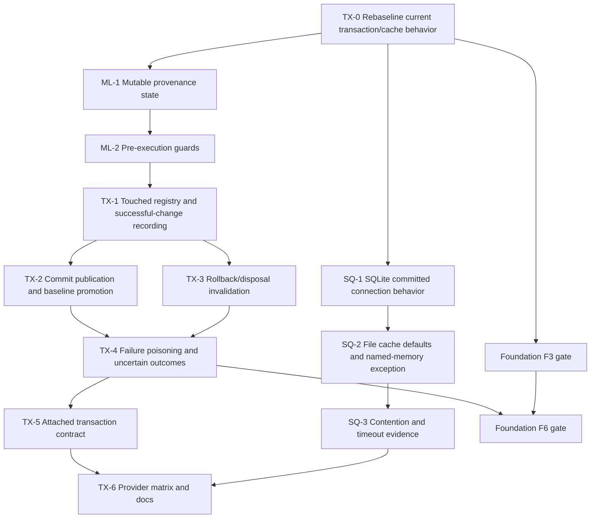

> [!WARNING]
> This document is roadmap implementation material for the DataLinq 0.9 development line. It is not normative product documentation and must not be treated as a shipped support claim.

# SQL Transaction And Mutable Lifecycle Implementation Plan

**Status:** Accepted.

**Target release:** 0.9.

**Created:** 2026-07-10.

**Last reviewed:** 2026-07-10.

**Design sources:** [SQLite Transaction Isolation Alignment](../../providers-and-features/SQLite%20Transaction%20Isolation%20Alignment.md) and [Mutable Instance Lifecycle](../../query-and-runtime/Mutable%20Instance%20Lifecycle.md).

## Purpose

This plan turns the existing SQL-provider correctness requirements into an executable implementation sequence.

It has two related objectives:

1. make mutable-instance reuse trustworthy across provider, transaction, commit, rollback, disposal, deletion, and failure boundaries
2. stop DataLinq-owned SQLite connections from using dirty reads as the mechanism for same-transaction visibility

The current code is closer to the desired cache-publication model than the older design discussion implies. DataLinq already keeps rows and notifications transaction-scoped while a transaction is open, commits the provider transaction before applying global cache changes, and discards transaction rows on rollback. The implementation must preserve and characterize that working behavior rather than rebuilding it under new names.

The missing correctness layer is mutable provenance and failure state. A mutable is reset to transaction-local values after each successful statement today, but it does not remember which provider or transaction owns that baseline. A failed statement can also remain in the transaction's `Changes` collection. Those are the sharp edges this plan closes before the query foundation rewires source and cache access.

## Release Decision

The 0.9 behavior is deliberately conservative:

- a mutable baseline belongs to one provider instance
- a transaction-local baseline belongs to one active DataLinq transaction
- reuse inside that transaction is allowed
- successful commit promotes the baseline to committed
- rollback or disposal of an open transaction invalidates every mutable touched by it
- cross-provider and cross-transaction writes fail before SQL execution
- ordinary primary-key mutation fails before SQL execution
- writes through `TransactionType.ReadOnly` fail before SQL execution
- any mutation execution failure poisons the DataLinq transaction; only rollback or disposal remains legal
- a failed mutation is removed from, or never added to, the successful change collection and can never be published as committed cache state
- an attached external transaction that performs DataLinq mutations must be completed through the DataLinq transaction wrapper
- DataLinq-owned SQLite connections use committed/serializable visibility and never enable `PRAGMA read_uncommitted = true`
- file-backed SQLite defaults do not opt into shared cache
- named in-memory SQLite may retain shared cache because separate connections otherwise do not share the same in-memory database
- 0.9 does not invent a retry framework; it preserves caller-configured SQLite timeout behavior and records contention evidence

This is existing SQL-provider mutation correctness. It does not create provider-neutral mutation contracts, memory transactions, commit receipts, or persistence hooks.

## Current-Code Rebaseline

Implementation starts from these verified facts.

| Current fact | Consequence for this plan |
| --- | --- |
| [`Transaction.AddAndExecute`](../../../../src/DataLinq/Mutation/Transaction.cs) calls `Provider.State.ApplyChanges(changes, this)` after a successful statement. | Pending cache application is already explicitly transaction-scoped. Do not replace it with a second overlay system. |
| [`TableCache.ApplyChanges`](../../../../src/DataLinq/Cache/TableCache.Invalidation.cs) dispatches to transaction-local or committed application based on the transaction argument. | Preserve this split and characterize its notifications, row identity, and cleanup before changing source contracts. |
| Transaction-local notifications include the owning transaction and [`CacheNotificationManager`](../../../../src/DataLinq/Cache/TableCache.Notifications.cs) only clears matching transaction subscribers. | Outside relation objects are not supposed to observe pending notifications. Keep this invariant through foundation workstream `F6`. |
| [`Transaction.Commit`](../../../../src/DataLinq/Mutation/Transaction.cs) calls `DatabaseAccess.Commit()` before globally applying `Changes`. | Provider-first commit ordering already exists. Harden its failure partitions; do not publish before provider commit. |
| Rollback and disposal remove transaction cache entries. | Add mutable invalidation to the same terminal paths and prove cleanup even when provider rollback/disposal fails. |
| [`Mutable<T>`](../../../../src/DataLinq/Instances/Mutable.cs) tracks only new/deleted state, the current immutable instance, and changed values. | Provider ownership, transaction ownership, invalidity, and terminal reason need explicit internal state. |
| `Transaction` resets a mutable to the hydrated transaction row immediately after a successful insert/update. | That reset must bind a transaction-local baseline and register the mutable with the transaction. |
| `CheckIfTransactionIsValid()` returns early for `TransactionType.ReadOnly`. | Write APIs currently lack the required read-only guard. Fix it before deeper lifecycle work. |
| `Changes.AddRange(...)` runs before SQL execution. | A failed statement can remain in the change list. Successful-change recording and transaction poisoning must become atomic from DataLinq's perspective. |
| Existing compliance tests cover transaction-local cache identity, commit invalidation, rollback cache preservation, relation visibility, and repeated implicit `Save()`. | Treat them as required characterization, then add the missing provenance and failure matrix. |
| [`SQLiteDbAccess`](../../../../src/DataLinq.SQLite/SQLiteDbAccess.cs) enables `PRAGMA read_uncommitted = true` for normal non-query, scalar, and reader connections. | DataLinq-owned non-transactional SQLite connections must explicitly use the committed default instead. |
| [`SQLiteDatabaseTransaction`](../../../../src/DataLinq.SQLite/SQLiteDatabaseTransaction.cs) enables the same pragma and begins `ReadUncommitted` transactions. | Begin an honest provider-supported committed/serializable transaction and retain own-write visibility through the real provider transaction plus the existing local cache. |
| File-backed `Cache=Shared` defaults are emitted by testing infrastructure and CLI config initialization, while [`SQLiteConnectionStringFactory`](../../../../src/DataLinq.SQLite/SQLiteConnectionStringFactory.cs) forces shared cache only for named memory databases. | Remove shared cache from file defaults and their tests/examples. Preserve the named-memory exception. |

If `TX-0` disproves any row in this table, update this plan before moving contracts. Architecture work based on a fictional baseline is worse than no plan.

## Scope

### In scope

- internal mutable baseline state and provenance
- provider-instance and transaction ownership guards
- reference-identity tracking of mutables touched by a transaction
- same-transaction mutable reuse
- promotion after confirmed provider commit
- invalidation after rollback, open-transaction disposal, mutation failure, or uncertain commit outcome
- committed and transaction-local delete lifecycle
- rejection of ordinary primary-key changes
- rejection of writes through read-only transactions
- successful-change recording that excludes failed statements
- poison-on-mutation-failure behavior
- attached external-transaction mutation contract
- preservation of pending-versus-committed cache publication
- SQLite committed visibility on DataLinq-owned connections
- removal of shared cache from file-backed defaults
- focused contention and timeout evidence without new retry policy
- SQLite, MySQL, and MariaDB compliance coverage
- public documentation of the behavior that actually ships

### Out of scope

- optimistic concurrency tokens or automatic conflict resolution
- silently reloading a row and reconstructing user intent after rollback or failure
- provider-neutral transaction or mutation interfaces
- memory mutation or transactions
- canonical commit batches, receipts, logs, replay, or CDC
- automatic retry of failed mutations or commits
- a general SQLite busy-handler/retry framework
- claiming that SQLite has literal MySQL/MariaDB `READ COMMITTED` semantics
- reconstructing raw writes performed before an external transaction is attached
- making arbitrary external connections obey DataLinq visibility rules
- primary-key migration through ordinary mutable assignment

## Artifact And Code Ownership

Each artifact has one primary owner even where workstreams coordinate.

| Concern | Owning plan/workstream | Primary implementation points | Boundary rule |
| --- | --- | --- | --- |
| Mutable provenance and guards | This plan, `ML-*` | `src/DataLinq/Instances/Mutable.cs`, `MutableRowData.cs`, internal mutable interfaces in `InstanceFactory.cs` | State is internal; generated mutable models inherit the behavior rather than duplicating it. |
| Transaction touched registry and terminal transitions | This plan, `TX-*` | `src/DataLinq/Mutation/Transaction.cs`, `StateChange.cs`, `State.cs` | Track mutables by reference identity. Mutable equality/hash semantics must never identify registry entries. |
| Pending versus committed cache publication | This plan, `TX-*` | `src/DataLinq/Cache/TableCache.Invalidation.cs`, `TableCache.Notifications.cs`, `DatabaseCache.cs` | Preserve the existing split. Change it only when a failing correctness test proves a defect. |
| Neutral read source, canonical row buffer, and materializer | Foundation `F3` | See [Query Backend And Execution Foundation Implementation Plan](Query%20Backend%20and%20Execution%20Foundation%20Implementation%20Plan.md) | `F3` owns the contract shape; this plan owns provider/transaction scope semantics carried by it. |
| Neutral PK/cache/relation reads | Foundation `F6` | `TableCache` row lookup/loading/query files and relation adapters | `F6` may reroute reads, but it may not merge committed and transaction-local cache scopes or publish pending notifications globally. |
| Scalar model/provider conversion | Scalar workstreams `SC-*` | converter metadata, row conversion, keys, query values | This plan consumes model-valued mutable state; it does not create a second conversion layer. |
| UUID wire encoding | UUID workstreams `UUID-*` | provider readers/writers/query binding | Lifecycle state contains canonical/model values, never connector-specific UUID bytes. |
| SQLite isolation and connection defaults | This plan, `SQ-*` | `SQLiteDbAccess.cs`, `SQLiteDatabaseTransaction.cs`, testing connection settings, CLI config initialization | Named memory sharing is a narrow exception; file-backed defaults use private cache. |
| Provider compliance tests | This plan, `TX-6` | active TUnit projects under `src/DataLinq.Tests.Unit` and `src/DataLinq.Tests.Compliance` | Legacy xUnit projects must not be recreated. |

## Lifecycle Model

The exact type names may differ, but the runtime must represent these facts independently:

- whether the mutable is new, existing, or deleted
- whether its baseline is committed, transaction-local, or invalid
- the provider-instance owner of an existing baseline
- the transaction owner of a transaction-local baseline
- the reason an invalid baseline cannot be reused
- the user's assignments since the current baseline

Do not encode all of this in one overloaded Boolean or infer it from `MutableRowData.HasChanges()`.

Conceptually:

```csharp
internal enum MutableBaselineKind
{
    NoneForNew,
    Committed,
    TransactionLocal,
    Invalid
}

internal enum MutableInvalidationReason
{
    RolledBack,
    OpenTransactionDisposed,
    MutationFailed,
    CommitOutcomeUnknown,
    Deleted
}
```

Provider ownership should use a stable provider-instance reference or opaque internal token. Database type, database name, and connection-string equality are not sufficient: two provider instances may point at similarly named databases while maintaining different caches and transaction state.

Transaction ownership should use the specific DataLinq transaction instance or an opaque transaction token. Do not use only `TransactionID` if a direct reference/token is already available.

Dirty state remains the set of explicit assignments since the baseline. It does not need a duplicate lifecycle enum if the provenance state and changed-value set can answer the question without ambiguity.

### Required transitions

| Starting state | Operation/outcome | Result |
| --- | --- | --- |
| New | successful insert in transaction `T` | Existing, clean transaction-local baseline owned by provider `P` and `T`; generated values hydrated. |
| New | failed insert | Invalid due to mutation failure; user assignments remain inspectable; transaction is poisoned. |
| Committed clean/dirty | successful update in `T` | Clean transaction-local baseline owned by `T`; only tracked assignments were written. |
| Transaction-local in `T` | another successful write in `T` | New clean transaction-local baseline still owned by `T`. |
| Transaction-local in `T` | write through another transaction or implicit write | Reject before SQL; state is unchanged. |
| Transaction-local in `T` | successful commit | Clean committed baseline owned by provider `P`; transaction ownership removed. |
| Transaction-local in `T` | rollback or open disposal | Invalid; no later write may reuse it. |
| Any writable state | mutation command failure | Invalid; `T` poisoned; failed change absent from successful changes. |
| Any transaction-local state | provider commit failure/unknown outcome | Invalid with an uncertain-commit diagnostic; no global publication. |
| Existing mutable | committed delete | Deleted terminal state; later mutation fails. |
| Existing mutable | transaction-local delete then rollback/disposal | Invalid rather than restored heuristically. |
| Any state | ordinary primary-key assignment followed by a write | Reject before SQL. |

Public `Reset()` must not become an escape hatch that clears invalid, deleted, provider, or transaction provenance. All authoritative baseline advancement should flow through one internal operation that receives the hydrated immutable row and explicit owner context. If the existing public `Reset(T)` remains, it must validate provenance and must not resurrect an invalid mutable silently.

## Workstream Dependency Graph



`ML-*` and `SQ-*` may overlap after `TX-0`. `F3` may also advance after the `TX-0` characterization gate. `F6` must not rewrite cache and relation reads until the mutable/transaction terminal-state suite through `TX-4` is green.

## TX-0: Rebaseline Existing Transaction And Cache Behavior

Before changing runtime state, turn current working behavior into explicit tests.

Work:

- inventory every call to `State.ApplyChanges`, `TableCache.ApplyChanges`, transaction-row removal, and cache notification
- verify which tests already cover transaction-local rows, relation subscriptions, commit invalidation, and rollback preservation
- add focused characterization only where behavior is not observable today
- record provider command and cache-notification order for insert, update, and delete
- record the current status transitions of owned and attached provider transactions
- characterize provider commit, rollback, and disposal exceptions with controllable test doubles
- characterize existing repeated implicit and explicit `Save()` behavior
- prove that transaction-local notifications do not clear committed relation subscribers before commit

Required tests:

- successful statement applies only transaction-local cache effects
- committed/global cache publication happens after provider commit
- rollback does not publish or invalidate committed state because of a pending write
- disposal of an open transaction removes transaction rows
- outside relation collections remain stable before commit and refresh after commit
- same-transaction materialization preserves graph identity
- transaction-local cache entries disappear after every terminal path

Exit signal:

- the current pending/committed cache split is backed by deterministic tests
- any genuine gap is listed against a later workstream instead of being mistaken for missing architecture
- foundation `F3` has a stable set of transaction/cache invariants to preserve

## ML-1: Add Mutable Baseline Provenance

Work:

- introduce one internal lifecycle/provenance holder used by `Mutable<T>` and generated subclasses
- capture provider ownership when creating a mutable from an immutable instance
- represent new, committed, transaction-local, invalid, and deleted baselines
- retain the owning transaction for transaction-local baselines
- retain a safe invalidation reason for diagnostics
- add a single internal baseline-advance operation used after successful hydration
- ensure ordinary changed-value tracking remains separate from provenance
- ensure `Reset()` and `Reset(T)` cannot erase invalidity or transaction ownership accidentally
- keep lifecycle internals out of public equality and hash code

Implementation constraint:

The touched registry introduced later must use reference equality. `Mutable<T>.GetHashCode()` changes from a transient identifier to a primary-key hash after insert, and two separate mutable objects may compare equal by primary key. Neither behavior is suitable for transaction ownership tracking.

Exit signal:

- a mutable can report internally whether its baseline is new, committed, transaction-local, invalid, or deleted
- an existing baseline identifies its exact provider owner
- a transaction-local baseline identifies its exact transaction owner
- generated mutable types inherit the state without per-model generated fields
- public row values and mutation property APIs remain unchanged

## ML-2: Add Pre-Execution Mutation Guards

Run all guards before creating commands, changing transaction caches, resetting a mutable, or recording a successful change.

Work:

- replace the current read-only early return with an explicit write rejection
- reject writes on committed, rolled-back, disposed, or poisoned transactions
- reject invalid and deleted mutables
- reject a committed mutable owned by a different provider instance
- reject a transaction-local mutable owned by another active transaction
- reject implicit writes while a mutable belongs to an active explicit transaction
- allow repeated writes through the owning active transaction
- validate insert receives a new mutable and update receives an existing mutable
- reject tracked changes to primary-key columns for ordinary update/save
- apply provider ownership checks to immutable delete inputs where source ownership is available
- emit DataLinq-owned diagnostics containing operation, model/table, provider/transaction context, and recovery guidance without connection-string or binding-value leakage

The no-change update path still runs lifecycle/provider/transaction guards. It may skip SQL only after the mutable is proven safe.

Exit signal:

- every invalid write fails before provider command execution
- `TransactionType.ReadOnly` cannot insert, update, save, or delete
- same-transaction reuse remains green
- cross-provider, cross-transaction, invalid, deleted, and primary-key mutation cases have focused tests

## TX-1: Track Touched Mutables And Successful Changes

Work:

- add a reference-identity registry of mutables touched by each transaction
- register a mutable only as part of a successful statement/baseline advancement, while ensuring the current mutable is invalidated if its attempted statement fails
- bind each successfully hydrated mutable to the transaction-local baseline
- preserve generated/default value hydration before baseline advancement
- make transaction-local delete state explicit for mutable delete inputs
- ensure repeated writes update one registry entry rather than depending on mutable equality
- make `Changes` a collection of successfully executed state changes, not attempted statements
- either append a change only after successful execution or remove the exact attempted change in the failure path
- preserve earlier successful pending changes for rollback diagnostics, but never allow them to commit after the transaction becomes poisoned
- ensure failed insert/update/delete attempts are never passed to global `ApplyChanges`

Atomicity rule:

```text
preflight guards
  -> execute provider statement
  -> hydrate result
  -> finalize successful StateChange
  -> append successful change
  -> apply transaction-local cache effect
  -> advance/register mutable baseline
```

If existing generated-key mechanics require constructing a `StateChange` before execution, that object remains an uncommitted candidate. It is not a successful change until execution and hydration complete.

Exit signal:

- `Changes` contains only statements confirmed successful by DataLinq
- a failed candidate cannot reach committed cache publication
- every mutable reset to a transaction-local row is owned by and registered with that transaction
- repeated same-transaction writes preserve the latest hydrated baseline

## TX-2: Commit Publication And Baseline Promotion

The success order is fixed:

1. validate the transaction is open, writable where applicable, and not poisoned
2. commit the provider transaction
3. apply successful changes to committed/global cache state and notifications
4. remove transaction-local cache state
5. promote touched mutable baselines to committed
6. clear transaction ownership and complete terminal state

Work:

- preserve provider-first commit ordering
- make committed publication consume only the successful change collection
- publish relation notifications only after provider commit succeeds
- promote all touched, non-deleted mutables to committed provider-owned baselines
- keep committed-deleted mutables terminal
- make promotion/registry cleanup idempotent enough for internal cleanup paths without permitting public double commit
- ensure transaction-local immutable rows already handed to callers stop using a completed transaction as their active read source according to existing immutable behavior
- partition cache-publication failure from provider-commit failure

Failure after provider commit:

If provider commit succeeds but committed-cache publication fails, the database is committed and cannot be rolled back. DataLinq must:

- never report a rollback
- remove transaction-local cache state
- conservatively invalidate or clear affected committed cache state so a later read reloads from the database
- invalidate touched mutable baselines and require a fresh committed read
- throw a diagnostic stating that the database commit succeeded but local publication failed

Baseline promotion should be a non-throwing internal state transition. If it nevertheless fails, invalidate the affected mutable rather than claiming a trustworthy committed baseline.

Exit signal:

- provider commit always precedes global cache publication and mutable promotion
- successful commit permits later reuse of the same mutable through the same provider
- outside rows and relations refresh only after commit
- a post-provider-commit cache failure cannot leave stale state presented as authoritative

## TX-3: Rollback And Open-Transaction Disposal

Work:

- on explicit rollback, invoke provider rollback before terminal cleanup when the provider transaction is still open
- discard transaction-local rows and notifications without applying successful pending changes globally
- invalidate every touched mutable, including inserts, updates, and transaction-local deletes
- on disposal of an open or poisoned transaction, perform the provider's rollback/disposal path and the same invalidation
- perform mutable invalidation and local-cache cleanup even when provider rollback or disposal throws
- keep the original provider exception while attaching enough DataLinq context to explain that mutable baselines are invalid
- prevent public `Reset()` from making those mutables writable again
- preserve committed/global cache entries when no committed publication occurred

Rollback does not attempt to reconstruct an earlier mutable baseline. The user must materialize a fresh committed row or create a new mutable.

Exit signal:

- every touched mutable rejects later writes after rollback or open disposal
- no transaction-local cache entries survive terminal cleanup
- committed caches and relations are not cleared merely because a pending write rolled back
- rollback/disposal failure still cannot leave a mutable marked trustworthy

## TX-4: Poison Mutation Failures And Handle Uncertain Outcomes

Cross-provider behavior is simpler and safer if any mutation command failure poisons the DataLinq write transaction.

Work:

- add an internal poisoned/failed transaction state distinct from provider `Open`
- enter it when insert, update, delete, generated-value hydration, or pending-cache application fails
- invalidate the current mutable and all previously touched transaction-local mutables
- remove the failed candidate from the successful change collection
- reject later reads, `Commit()`, and additional writes through the poisoned transaction
- allow only `Rollback()` and `Dispose()` as recovery operations
- guarantee no successful pending change from a poisoned transaction is globally published
- distinguish provider statement failure, hydration failure, pending-cache failure, provider commit failure, and post-commit cache-publication failure in diagnostics
- keep user assignments inspectable for diagnostics, but never treat them as a trustworthy baseline

Provider commit failure is outcome-uncertain unless the provider can prove otherwise. The cross-provider rule is:

- do not apply global cache changes
- invalidate touched mutables
- reject further writes and commit
- permit rollback/disposal cleanup where the provider still allows it
- require a fresh committed read before retrying at application level

Do not automatically retry a mutation or commit. Without idempotency tokens and provider-specific evidence, a retry can duplicate an insert or repeat a partially observed operation.

Exit signal:

- fault-injection tests prove failed changes cannot be committed or published
- a poisoned transaction cannot be reused accidentally
- earlier successful statements in the same transaction are rolled back rather than published
- diagnostics distinguish definite rollback, mutation failure, and unknown commit outcome

## TX-5: Define Attached External Transaction Ownership

DataLinq cannot infer lifecycle transitions if callers commit or roll back the underlying `IDbTransaction` behind its wrapper.

The 0.9 contract is:

- attaching before DataLinq writes is supported
- same-transaction reads and DataLinq-managed writes use the normal local cache and mutable lifecycle
- once DataLinq touches a mutable, commit or rollback must be performed through the DataLinq transaction wrapper
- externally closing the underlying transaction bypasses DataLinq promotion/invalidation and is unsupported
- disposal without an observed DataLinq commit invalidates touched mutables conservatively
- raw writes performed before attachment are outside DataLinq's cache-change reconstruction
- attached SQLite connections retain caller-owned pragma/connection policy; the committed-visibility guarantee applies to DataLinq-owned connections unless attached settings are validated as compatible

Work:

- document the ownership transfer for lifecycle coordination
- detect an externally closed/invalid underlying transaction at the next wrapper operation where possible
- poison/invalidate rather than guessing whether an external commit happened
- cover attached DataLinq writes followed by wrapper commit and rollback
- cover external closure followed by wrapper access with a deterministic diagnostic
- do not attempt to intercept arbitrary calls on the original `IDbTransaction`

Exit signal:

- the supported attached-transaction path gets the same mutable promotion/invalidation behavior as owned transactions
- bypassing the wrapper cannot leave a mutable silently marked committed
- public docs identify raw pre-attachment writes and external completion as outside DataLinq's cache/lifecycle guarantees

## SQ-1: Change SQLite To Committed Visibility

This slice changes provider behavior only after `TX-0` proves same-transaction visibility does not depend on global cache publication.

For DataLinq-owned SQLite connections:

- never execute `PRAGMA read_uncommitted = true`
- explicitly restore or verify `PRAGMA read_uncommitted = false` when opening pooled connections so prior connection state cannot leak in
- begin provider transactions at `IsolationLevel.Serializable`, or the documented Microsoft.Data.Sqlite committed/serializable equivalent selected by provider evidence
- preserve WAL for file-backed databases
- preserve same-transaction reads through the provider transaction and transaction-local cache
- describe the behavior as committed visibility, not literal `READ COMMITTED`

Work:

- update non-query, scalar, and reader connection initialization in `SQLiteDbAccess`
- update owned transaction initialization in `SQLiteDatabaseTransaction`
- add a focused helper/test seam so all owned connection paths use the same pragma policy
- leave attached caller-owned connection configuration explicit under `TX-5`
- add provider tests proving normal DataLinq reads do not see another transaction's pending insert, update, or delete
- use file-backed SQLite with WAL as the authoritative concurrency lane
- retain named in-memory tests as a fast functional lane, not the concurrency oracle

Exit signal:

- no DataLinq-owned SQLite path enables dirty reads
- an owning transaction sees its successful writes
- normal outside reads observe the old committed state until commit
- rollback preserves the old committed state
- docs avoid claiming MySQL-style per-statement `READ COMMITTED` snapshots

## SQ-2: Remove Shared Cache From File-Backed Defaults

Work:

- remove `Cache=Shared` from file-backed SQLite connections created by testing infrastructure
- remove it from new CLI configuration defaults and update the associated unit tests/snapshots/examples
- audit public sample/config files for file-backed shared-cache defaults introduced by DataLinq
- preserve `Mode=Memory;Cache=Shared` normalization for named in-memory databases
- preserve user-supplied shared-cache settings rather than silently rewriting explicit configuration, while documenting why private cache is recommended for file/WAL operation
- prove file-backed generated/default connection strings still resolve paths and open correctly

Exit signal:

- DataLinq-generated file-backed defaults use private/default cache with WAL
- named in-memory databases still work across the multiple connections DataLinq opens
- tests distinguish the named-memory exception from the recommended file-backed configuration

## SQ-3: Record Contention And Timeout Evidence

Removing dirty reads may expose real SQLite locking behavior. 0.9 should observe it honestly without building an unproven retry subsystem.

Work:

- preserve caller-supplied `SqliteConnectionStringBuilder.DefaultTimeout` and command timeout behavior
- do not add automatic transaction, statement, or commit retries
- add bounded file-backed WAL tests with one writer and concurrent readers
- record whether readers observe the last committed snapshot and whether writer contention produces a bounded busy/locked failure
- ensure lock errors retain SQLite/provider details and DataLinq operation context
- document that applications with sustained writer contention need an application-specific retry/idempotency policy
- add benchmark or timing evidence only to catch pathological initialization/pragma overhead, not to promise a universal latency threshold

Exit signal:

- configured timeout values are not overwritten by DataLinq
- contention tests terminate deterministically and never expose dirty data
- no hidden retry can duplicate a mutation
- remaining SQLite single-writer and snapshot differences are documented

## Foundation F3/F6 Interaction Gate

The query foundation and this correctness plan touch adjacent runtime seams. Their ownership must remain explicit.

### Before `F3`

- `TX-0` characterization is green
- the foundation records committed versus transaction-local source/cache scope in its neutral read context
- provider instance identity survives adaptation to the neutral source
- generated immutable rows loaded inside a transaction retain that transaction's read/cache scope

`F3` owns the neutral source and materializer types. This plan owns what provider and transaction ownership mean. A neutral source that exposes only metadata and a backend while erasing cache scope is not sufficient.

### Before `F6`

- `ML-1` through `TX-4` are green across the core fault-injection lane
- read-only, cross-provider, cross-transaction, rollback/disposal, and poisoned-transaction guards are stable
- committed versus transaction-local notification behavior is characterized
- source-row requests carry enough scope to select the correct transaction row cache and subscriptions

`F6` may reroute primary-key, cold-cache, and relation reads. It must not:

- make transaction reads fall through to committed object identity accidentally
- let committed reads inspect another transaction's rows
- notify committed relation subscribers for pending changes
- move mutation responsibility into source-row loaders
- use a backend name or database name as transaction/cache identity

After each `F6` migration slice, rerun the transaction/cache characterization tests before proceeding to another read family.

## TX-6: Provider Matrix, Documentation, And Release Evidence

### Core and fault-injection tests

- lifecycle state transitions do not depend on mutable equality/hash code
- `Reset()` cannot clear invalid/deleted provenance
- read-only transaction writes fail before command creation/execution
- primary-key mutation fails before command execution
- failed candidate is absent from successful `Changes`
- mutation failure poisons the transaction
- commit is rejected on a poisoned transaction
- rollback/dispose invalidates all touched mutables
- provider commit failure causes no global publication
- post-commit cache-publication failure clears affected cache state and requires fresh mutable materialization

### SQLite, MySQL, and MariaDB compliance

- repeated implicit `Save()` preserves prior committed values
- repeated `Save()` in one explicit transaction preserves prior transaction-local values
- a mutable owned by one open transaction cannot be written through another
- a mutable owned by an open transaction cannot be written implicitly
- a mutable promoted by successful commit can be reused later through the same provider
- cross-provider reuse fails before SQL
- rollback and open disposal make touched mutables unusable
- insert followed by insert rejects the second operation
- no-change update performs no write after guards pass
- committed and transaction-local delete have the documented terminal behavior
- provider constraint/command failure poisons the transaction and publishes nothing
- wrapper-owned attached transactions promote/invalidate correctly

### SQLite-specific evidence

- owned connections report `read_uncommitted = 0`
- normal outside entity, projection, scalar/aggregate, and direct DataLinq SQL reads do not see pending writes where the provider permits concurrent reads
- same transaction reads its own insert/update/delete
- file-backed default connections do not request shared cache
- named in-memory connections retain the required shared-cache/keepalive behavior
- file-backed WAL contention respects configured timeout and never returns dirty rows

### Documentation

Update only after behavior is green:

- `docs/Caching and Mutation.md`
- `docs/Transactions.md`
- `docs/Troubleshooting.md`
- `docs/backends/SQLite.md`
- XML documentation for mutation and transaction APIs
- CLI/config examples that currently recommend file-backed `Cache=Shared`

Documentation must say:

- mutable objects are reusable only while their baseline is trustworthy
- transaction-local mutable baselines cannot cross transaction boundaries
- rollback, open disposal, mutation failure, and uncertain commit require a fresh mutable
- attached transactions performing DataLinq writes must be completed through the wrapper
- SQLite provides committed visibility through serializable/snapshot-oriented semantics, not literal MySQL/MariaDB `READ COMMITTED`
- named shared in-memory SQLite is a functional test mode, not the concurrency truth source
- DataLinq does not automatically retry failed writes or commits

Exit signal:

- all required unit and provider compliance tests are green
- the foundation `F3` and `F6` integration suite is green after source/cache migration
- shipped docs match the implemented boundary exactly

## Detailed Failure Matrix

| Failure point | Successful change recorded? | Global cache publication? | Mutable result | Legal next transaction action |
| --- | --- | --- | --- | --- |
| Preflight guard | No | No | Unchanged | Fix caller input/use correct transaction. |
| Provider mutation statement | No | No | Invalid due to mutation failure; assignments remain inspectable | Rollback or dispose only. |
| Generated-value hydration | No finalized change | No | Invalid | Rollback or dispose only. |
| Transaction-local cache application | No finalized/publishable change | No | Invalid | Rollback or dispose only. |
| Provider commit before confirmation | Pending successful changes remain local only | No | Invalid; outcome unknown | Rollback if provider permits, otherwise dispose; fresh read required. |
| Global cache publication after confirmed provider commit | Provider changes are committed | Attempted; affected cache must be conservatively cleared | Invalid; database commit succeeded | Dispose/cleanup; fresh read required. |
| Mutable promotion after confirmed provider commit | Provider changes are committed | Yes | Promote non-throwingly or invalidate affected mutable | Transaction is committed; fresh read if invalidated. |
| Provider rollback | No new committed changes | No | Invalid regardless of rollback exception | Dispose/cleanup. |

## Baseline Exit Criteria

This implementation plan is complete when:

- the existing transaction-local/committed cache split is preserved and covered by explicit tests
- mutable baselines carry provider and transaction provenance
- all write guards run before SQL
- transaction touched-mutables are tracked by reference identity
- only successful statements appear in the transaction's publishable change collection
- mutation failure poisons the transaction and no poisoned transaction can commit
- commit promotes mutables only after provider commit and global cache publication succeed
- rollback and open disposal invalidate every touched mutable
- attached transaction lifecycle has a documented, tested wrapper-completion contract
- DataLinq-owned SQLite paths never enable `read_uncommitted`
- file-backed DataLinq defaults no longer opt into shared cache
- named in-memory SQLite keeps only the sharing necessary for multi-connection operation
- timeout/locking evidence exists without automatic retries
- SQLite, MySQL, and MariaDB compliance tests pass
- foundation `F3`/`F6` preserves provider and transaction cache scope
- public docs make no stronger claim than the tested behavior

## Risks And Mitigations

| Risk | Why it matters | Mitigation |
| --- | --- | --- |
| Rebuilding an overlay that already exists | Duplicate transaction state will drift and create new cache bugs. | `TX-0` freezes current behavior; later work adds only missing provenance/failure semantics. |
| Mutable registry uses value equality | Mutable equality/hash changes after insert and separate objects can share a primary key. | Use reference equality exclusively. |
| Public `Reset()` erases invalidity | A rolled-back row can be written later as if it were committed. | Separate changed-value reset from authoritative internal baseline advancement. |
| Failed changes stay in `Changes` | Commit/cache publication can describe a statement that never succeeded. | Finalize/append only after success or remove the exact failed candidate; poison commit regardless. |
| Commit failure is treated as definite rollback | The provider may have committed despite an exception. | No publication, invalidate mutables, require fresh read, and report unknown outcome. |
| Foundation erases transaction scope | Neutral cache reads can leak identity or pending rows across transactions. | Gate `F3`/`F6` on explicit provider/cache-scope context and rerun characterization per slice. |
| SQLite serializable behavior is called `ReadCommitted` | Users infer per-statement snapshot behavior that SQLite does not provide. | Use the product term committed visibility and document snapshot/single-writer differences. |
| Removing dirty reads exposes locks | Existing tests or apps may have relied on unsafe concurrency. | File-backed WAL evidence, preserve configured timeout, clear diagnostics, no hidden retry. |
| Named in-memory SQLite becomes the concurrency oracle | Shared cache has different locking behavior and is required merely to share the database. | Keep it as a fast functional lane; use temporary file/WAL tests for visibility and contention. |

## Links

- [DataLinq 0.9 Implementation Roadmap](README.md)
- [0.9 Implementation Order And Integration Plan](Implementation%20Order%20and%20Integration%20Plan.md)
- [Release Evidence And Closeout Implementation Plan](Release%20Evidence%20and%20Closeout%20Implementation%20Plan.md)
- [Query Backend And Execution Foundation Implementation Plan](Query%20Backend%20and%20Execution%20Foundation%20Implementation%20Plan.md)
- [Scalar Converters And Typed IDs Implementation Plan](Scalar%20Converters%20and%20Typed%20IDs%20Implementation%20Plan.md)
- [SQLite Transaction Isolation Alignment](../../providers-and-features/SQLite%20Transaction%20Isolation%20Alignment.md)
- [Mutable Instance Lifecycle](../../query-and-runtime/Mutable%20Instance%20Lifecycle.md)
- [Caching And Mutation](../../../Caching%20and%20Mutation.md)
- [Transactions](../../../Transactions.md)
- [SQLite Backend](../../../backends/SQLite.md)
