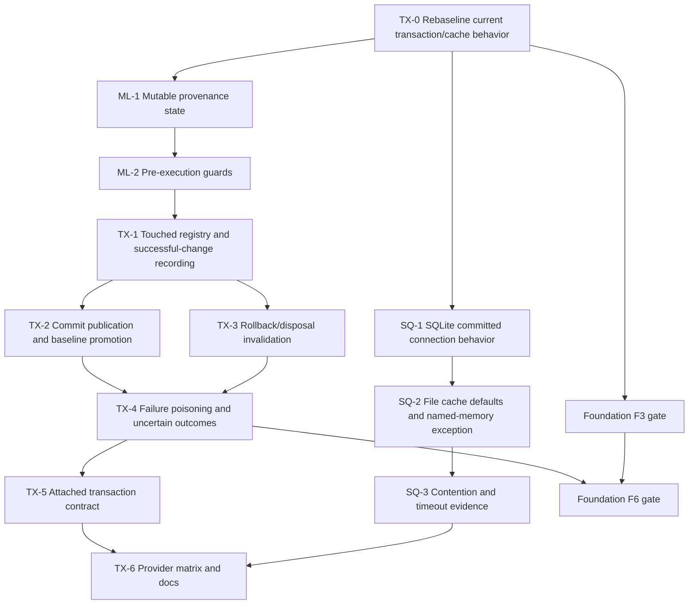

> [!WARNING]
> This document is roadmap implementation material for the DataLinq 0.9 development line. It is not normative product documentation and must not be treated as a shipped support claim.

# SQL Transaction And Mutable Lifecycle Implementation Plan

**Status:** Implementation in progress. `TX-0`, the complete `ML-1` provenance contract, the representable `ML-2` pre-execution guard slice, `TX-1` (`TX-1A` touched-mutable tracking plus `TX-1B` successful-change authority), `TX-2A` confirmed-success finalization for DataLinq-owned transactions, bounded `TX-2B` known-committed recovery, bounded `TX-3` managed-wrapper rollback/open-disposal finalization, bounded `TX-4A` mutation-pipeline poisoning, bounded managed provider-call `CommitOutcomeUnknown` cache recovery, bounded provider-outcome evidence for a throwing commit, the full `TX-5` attached-transaction contract, `SQ-1` DataLinq-owned SQLite committed visibility, `SQ-2` file-backed shared-cache default removal, and bounded `SQ-3` contention/diagnostic evidence are implemented. Raw low-level escape prevention, local-cleanup fault injection beyond the supported cache primitives, connector-native/full real-provider commit-fault evidence, full concurrency semantics beyond the bounded SQLite matrix, and the remaining terminal-state work are still open.

**Target release:** 0.9.

**Created:** 2026-07-10.

**Last reviewed:** 2026-07-12.

**Design sources:** [SQLite Transaction Isolation Alignment](../../providers-and-features/SQLite%20Transaction%20Isolation%20Alignment.md) and [Mutable Instance Lifecycle](../../query-and-runtime/Mutable%20Instance%20Lifecycle.md).

## Purpose

This plan turns the existing SQL-provider correctness requirements into an executable implementation sequence.

It has two related objectives:

1. make mutable-instance reuse trustworthy across provider, transaction, commit, rollback, disposal, deletion, and failure boundaries
2. stop DataLinq-owned SQLite connections from using dirty reads as the mechanism for same-transaction visibility

The current code is closer to the desired cache-publication model than the older design discussion implies. DataLinq already keeps rows and notifications transaction-scoped while a transaction is open, commits the provider transaction before applying global cache changes, and discards transaction rows on rollback. The implementation must preserve and characterize that working behavior rather than rebuilding it under new names.

The original missing correctness layer was mutable provenance and failure state. The complete `ML-1` contract remembers the exact provider and, for a transaction-local baseline, the exact transaction token; `ML-2` enforces that provenance before provider work. `TX-1` now makes a private ordered list the sole commit authority and adds a candidate only after every DataLinq mutation-finalization stage succeeds. `TX-2A` consumes that authority on the confirmed-success path for an owned transaction, completes global and local cache work, promotes the touched registry, commits the token, and defers the wrapper `Committed` event until that local finalization is complete. Bounded `TX-2B` recovers conservatively when the provider commit is known to have succeeded but later committed publication or transaction-cache cleanup fails. Bounded `TX-3` consumes the same ownership authority for managed-wrapper rollback and open disposal. Bounded `TX-4A` poisons the managed wrapper after a post-preflight mutation-pipeline failure. The adjacent provider-call recovery handles the distinct case where managed `Commit()` itself throws: it preserves the exact provider exception, marks transaction-derived ownership `CommitOutcomeUnknown`, invalidates and clears touched/transaction-local state, structurally evicts provider-wide committed rows and indices before recovery notifications, retains recovery faults as secondary context, blocks managed reads/writes/callbacks/commit and terminal read-source fallback, and permits rollback only while provider status remains nonterminal. It deliberately does not infer whether the database committed; eviction prevents retained cache state from pretending to answer that question. Bounded provider-outcome tests now prove that this same recovery rematerializes both an actual rollback after a pre-commit throw and an actual commit followed by a throw across current SQLite, MySQL, and MariaDB targets. `TX-5A` applies confirmed commit and rollback transitions to active attached wrappers and routes wrapper commit after external commit/rollback into unknown-outcome recovery rather than guessed publication. Bounded `TX-5B` detects an inactive attached provider handle before managed reads, mutations, terminal read-source fallback, or disposal; it records permanent `ExternalCompletionUnknown`, invalidates touched/scoped state, evicts provider-wide committed caches before recovery notifications, blocks further managed use, suppresses a fabricated wrapper rollback event, and leaves only idempotent disposal legal after the first diagnostic. Raw low-level escape prevention, cleanup-fault injection beyond supported primitives, connector-native/full real-provider commit-fault evidence, and full concurrency remain lifecycle work before the query foundation rewires source and cache access.

## Release Decision

The 0.9 behavior is deliberately conservative:

- a mutable baseline belongs to one provider instance
- a transaction-local baseline belongs to one active DataLinq transaction
- reuse inside that transaction is allowed
- successful commit promotes the baseline to committed
- rollback or disposal of an open transaction invalidates every mutable touched by it
- a throwing rollback that leaves the provider open records `RollbackOutcomeUnknown`; the managed wrapper permits only disposal and never pretends the rollback succeeded
- managed rollback/disposal removes only exact transaction rows and subscriptions, preserving committed/global cache and relation state
- cross-provider and cross-transaction writes fail before SQL execution
- ordinary primary-key mutation fails before SQL execution
- writes through `TransactionType.ReadOnly` fail before SQL execution
- any post-preflight DataLinq-managed mutation-pipeline failure poisons the DataLinq transaction; only rollback or disposal remains legal through the managed wrapper
- a failed mutation is never added to the private successful-change authority and can never be published as committed cache state through the managed wrapper
- after a provider commit is known to have succeeded, a committed-publication or transaction-cache-cleanup failure is reported as known committed, invalidates transaction-derived mutable baselines, and clears cache state conservatively rather than pretending rollback occurred
- when the provider `Commit()` call itself throws, DataLinq preserves that exception, records `CommitOutcomeUnknown`, publishes nothing globally, invalidates scoped ownership, evicts provider-wide committed caches before recovery notifications, gates managed reuse/fallback, and allows only status-compatible rollback or disposal; eviction restores cache safety but does not guess the database outcome
- an attached external transaction that performs DataLinq mutations must be completed through the DataLinq transaction wrapper
- DataLinq-owned SQLite connections use committed/serializable visibility and never enable `PRAGMA read_uncommitted = true`
- file-backed SQLite defaults do not opt into shared cache
- named in-memory SQLite may retain shared cache because separate connections otherwise do not share the same in-memory database
- 0.9 does not invent a retry framework; it preserves caller-configured SQLite timeout behavior and records contention evidence

This is existing SQL-provider mutation correctness. It does not create provider-neutral mutation contracts, memory transactions, commit receipts, or persistence hooks.

## W1 Before-State Rebaseline

The following table preserves the verified W1 before-state that motivated the implementation slices. It is historical evidence, not a present-tense description; the progress callouts below record which deficits have since been closed.

| W1 before-state fact | Consequence for this plan |
| --- | --- |
| [`Transaction.AddAndExecute`](../../../../src/DataLinq/Mutation/Transaction.cs) calls `Provider.State.ApplyChanges(changes, this)` after a successful statement. | Pending cache application is already explicitly transaction-scoped. Do not replace it with a second overlay system. |
| [`TableCache.ApplyChanges`](../../../../src/DataLinq/Cache/TableCache.Invalidation.cs) dispatches to transaction-local or committed application based on the transaction argument. | Preserve this split and characterize its notifications, row identity, and cleanup before changing source contracts. |
| Transaction-local notifications include the owning transaction and [`CacheNotificationManager`](../../../../src/DataLinq/Cache/TableCache.Notifications.cs) only clears matching transaction subscribers. | Outside relation objects are not supposed to observe pending notifications. Keep this invariant through foundation workstream `F6`. |
| [`Transaction.Commit`](../../../../src/DataLinq/Mutation/Transaction.cs) calls `DatabaseAccess.Commit()` before globally applying `Changes`. | Provider-first commit ordering already exists. Harden its failure partitions; do not publish before provider commit. |
| Rollback and disposal remove transaction cache entries. | Add mutable invalidation to the same terminal paths and prove cleanup even when provider rollback/disposal fails. |
| [`Mutable<T>`](../../../../src/DataLinq/Instances/Mutable.cs) tracks only new/deleted state, the current immutable instance, and changed values. | Provider ownership, transaction ownership, invalidity, and terminal reason need explicit internal state. |
| `Transaction` resets a mutable to the hydrated transaction row immediately after a successful insert/update. | That reset must bind a transaction-local baseline and register the mutable with the transaction. |
| `CheckIfTransactionIsValid()` returns early for `TransactionType.ReadOnly`. | Write APIs currently lack the required read-only guard. Fix it before deeper lifecycle work. |
| `Changes.AddRange(...)` runs before SQL execution. | A failed statement can remain in the change list. Successful-change recording and transaction poisoning must become atomic from DataLinq's perspective. |
| Existing compliance tests cover transaction-local cache identity, commit invalidation, rollback cache preservation, relation visibility, and repeated implicit `Save()`. | Treat them as required characterization, then add the missing provenance and failure matrix. |
| At W1, [`SQLiteDbAccess`](../../../../src/DataLinq.SQLite/SQLiteDbAccess.cs) enabled `PRAGMA read_uncommitted = true` for normal non-query, scalar, and reader connections. | `SQ-1` now routes every owned access path through one committed-visibility policy that resets the pragma to `false`. |
| At W1, [`SQLiteDatabaseTransaction`](../../../../src/DataLinq.SQLite/SQLiteDatabaseTransaction.cs) enabled the same pragma and began `ReadUncommitted` transactions. | `SQ-1` now begins deferred serializable transactions and retains own-write visibility through the real provider transaction plus the existing local cache. |
| At W1, file-backed `Cache=Shared` defaults were emitted by testing infrastructure and CLI config initialization, while [`SQLiteConnectionStringFactory`](../../../../src/DataLinq.SQLite/SQLiteConnectionStringFactory.cs) forced shared cache only for named memory databases. | `SQ-2` now omits `Cache` from generated file defaults while preserving named-memory normalization and explicit caller settings. |

`TX-0` is closed by the W1 transaction/cache characterization, provider-lifecycle fault harness, and expected-failure ownership matrix. Those artifacts confirmed the pending/committed cache split and provider-first publication order while assigning the missing provenance, guard, and failure semantics to W3. Later implementation must update this plan if it disproves that characterized baseline; `TX-0` is not a recurring excuse to redesign the overlay.

## Current Implementation Boundary

The first W3 runtime slice was deliberately narrower than the full `ML-1` exit. Its provenance boundary was:

- an existing mutable captures its origin from the immutable row that created it and retains the exact SQL provider instance; provider type, database name, metadata identity, and connection-string equality are not substitutes
- a transaction-local baseline retains an opaque ownership token for the exact DataLinq transaction; lifecycle state does not infer ownership from a public numeric transaction ID
- new mutables remain origin-free until a successful mutation has produced an authoritative hydrated immutable row
- one internal authoritative-hydration transition replaces the baseline and binds both exact provider origin and transaction token without mixing that transition with ordinary user-assignment tracking
- mutable delete has an explicit transaction-local provenance state rather than immediately pretending that the row is globally committed-deleted
- transaction-local provenance may normalize lazily to committed provenance only after its token records that provider commit, global cache/notification publication, and transaction-local cache cleanup all succeeded, in that order

That successful-commit token normalization began as a bounded provenance substrate. `TX-1A` enumerates lifecycle-aware mutables after their successful authoritative transition, `TX-1B` owns the ordered successful changes privately after complete mutation finalization, and `TX-2A` consumes the registry for explicit promotion after a confirmed owned-transaction commit, committed publication, and transaction-cache cleanup. If the provider commit succeeded but either later local stage fails, bounded `TX-2B` marks the ownership token `CommittedStateFinalizationFailed`. If the provider `Commit()` call throws before DataLinq can establish its outcome, the bounded managed fence instead marks the token `CommitOutcomeUnknown`; that terminal token invalidates transaction-derived lifecycle snapshots immediately while retaining exact transaction cache state until wrapper rollback/disposal cleanup. Bounded `TX-3` terminalizes unresolved ownership after managed-wrapper rollback or open disposal. Explicit rollback records `RolledBack` only when the provider reports that result; a throwing provider that remains open records `RollbackOutcomeUnknown` and installs a rollback-attempt gate instead of pretending success. Direct open-wrapper disposal records `OpenTransactionDisposed` regardless of the provider cleanup result; disposal after an earlier `CommitOutcomeUnknown` or other terminal outcome preserves that outcome.

`ML-1` does **not** make arbitrary reuse safe by itself. The `ML-2` command-free guard slice closes unsafe pre-execution reuse for the lifecycle states currently represented, including the public row-data and deferred-`StateChange` escape hatches. `TX-1A` supplies the reference-identity registry, and `TX-1B` routes normal and public `StateChange` execution through one transaction-owned pipeline whose private successful list cannot be changed through the detached public `Changes` snapshot. Captured mutation values detect later assignment and in-place array drift before provider work; generated primary keys are captured after provider execution, while relation/index impact keys remain provisional until authoritative-row hydration finalizes them for later cache publication. On the confirmed-success owned path, `TX-2A` defers the wrapper `Committed` event until global publication, transaction-cache cleanup, touched-mutable promotion, token commit, and registry clearing are complete. If `DatabaseAccess.Commit()` returned successfully but committed publication or transaction-cache cleanup fails, bounded `TX-2B` performs known-committed recovery. If `DatabaseAccess.Commit()` throws, bounded `CommitOutcomeUnknown` recovery preserves the exact exception, skips global publication, permanently invalidates transaction-derived lifecycle state, clears the touched registry and exact transaction state, structurally evicts provider-wide committed rows and indices before recovery notifications, and rejects managed reads, writes, callbacks, repeated commit, and terminal fallback. Recovery-notification or cleanup failures remain secondary context on the provider exception. `Rollback()` is allowed only while provider status remains nonterminal and cannot overwrite `CommitOutcomeUnknown`; `Dispose()` preserves that reason. Cache eviction prevents stale retained entries, but none of these actions proves whether the original commit reached the database. Bounded provider-outcome evidence verifies both possible actual results without changing that runtime uncertainty. Bounded `TX-3` covers ordinary explicit rollback and disposal of open/poisoned unresolved ownership, bounded `TX-4A` covers mutation-pipeline failure, `TX-5A` proves active attached wrapper-only commit/rollback and conservative wrapper completion after external closure, and bounded `TX-5B` fences first managed read/write/fallback/dispose observation with permanent `ExternalCompletionUnknown` recovery. The green `ML-1` through bounded `TX-4` core lane now permits `F6-A` primary-key/cache-cold routing only when every canonical provider key component is integral. Consequently W3 is not complete: raw low-level escape prevention, local-cleanup fault injection beyond the supported cache primitives, connector-native/full real-provider commit-fault evidence, full concurrency semantics, collation-sensitive string/CHAR keys, `Guid`/binary and other codec-sensitive keys, relation/index loading, and the remaining F6 read families remain open.

## Scope

### In scope

- internal mutable baseline state and provenance
- provider-instance and transaction ownership guards
- reference-identity tracking of mutables touched by a transaction
- same-transaction mutable reuse
- promotion after confirmed provider commit
- invalidation after rollback, open-transaction disposal, mutation failure, or uncertain commit outcome
- committed and transaction-local delete lifecycle
- rejection of ordinary primary-key changes
- rejection of writes through read-only transactions
- successful-change recording that excludes failed statements
- poison-on-mutation-failure behavior
- attached external-transaction mutation contract
- preservation of pending-versus-committed cache publication
- SQLite committed visibility on DataLinq-owned connections
- removal of shared cache from file-backed defaults
- focused contention and timeout evidence without new retry policy
- SQLite, MySQL, and MariaDB compliance coverage
- public documentation of the behavior that actually ships

### Out of scope

- optimistic concurrency tokens or automatic conflict resolution
- silently reloading a row and reconstructing user intent after rollback or failure
- provider-neutral transaction or mutation interfaces
- memory mutation or transactions
- canonical commit batches, receipts, logs, replay, or CDC
- automatic retry of failed mutations or commits
- a general SQLite busy-handler/retry framework
- claiming that SQLite has literal MySQL/MariaDB `READ COMMITTED` semantics
- reconstructing raw writes performed before an external transaction is attached
- intercepting operations through an already captured raw `DatabaseAccess` or underlying `IDbTransaction`; those handles bypass managed poison and operation guards
- making arbitrary external connections obey DataLinq visibility rules
- primary-key migration through ordinary mutable assignment

## Artifact And Code Ownership

Each artifact has one primary owner even where workstreams coordinate.

| Concern | Owning plan/workstream | Primary implementation points | Boundary rule |
| --- | --- | --- | --- |
| Mutable provenance and guards | This plan, `ML-*` | `src/DataLinq/Instances/Mutable.cs`, `MutableRowData.cs`, internal mutable interfaces in `InstanceFactory.cs` | State is internal; generated mutable models inherit the behavior rather than duplicating it. |
| Transaction touched registry and terminal transitions | This plan, `TX-*` | `src/DataLinq/Mutation/Transaction.cs`, `StateChange.cs`, `State.cs` | Track mutables by reference identity. Mutable equality/hash semantics must never identify registry entries. |
| Pending versus committed cache publication | This plan, `TX-*` | `src/DataLinq/Cache/TableCache.Invalidation.cs`, `TableCache.Notifications.cs`, `DatabaseCache.cs` | Preserve the existing split. Change it only when a failing correctness test proves a defect. |
| Neutral read source, canonical row buffer, and materializer | Foundation `F3` | See [Query Backend And Execution Foundation Implementation Plan](Query%20Backend%20and%20Execution%20Foundation%20Implementation%20Plan.md) | `F3` owns the contract shape; this plan owns provider/transaction scope semantics carried by it. |
| Neutral PK/cache/relation reads | Foundation `F6` | `TableCache` row lookup/loading/query files and relation adapters | `F6` may reroute reads, but it may not merge committed and transaction-local cache scopes or publish pending notifications globally. |
| Scalar model/provider conversion | Scalar workstreams `SC-*` | converter metadata, row conversion, keys, query values | This plan consumes model-valued mutable state; it does not create a second conversion layer. |
| UUID wire encoding | UUID workstreams `UUID-*` | provider readers/writers/query binding | Lifecycle state contains canonical/model values, never connector-specific UUID bytes. |
| SQLite isolation and connection defaults | This plan, `SQ-*` | `SQLiteDbAccess.cs`, `SQLiteDatabaseTransaction.cs`, testing connection settings, CLI config initialization | Named memory sharing is a narrow exception; file-backed defaults use private cache. |
| Provider compliance tests | This plan, `TX-6` | active TUnit projects under `src/DataLinq.Tests.Unit` and `src/DataLinq.Tests.Compliance` | Legacy xUnit projects must not be recreated. |

## Lifecycle Model

The exact type names may differ, but the runtime must represent these facts independently:

- whether the mutable is new, existing, or deleted
- whether its baseline is committed, transaction-local, or invalid
- the provider-instance owner of an existing baseline
- the transaction owner of a transaction-local baseline
- the reason an invalid baseline cannot be reused
- the user's assignments since the current baseline

Do not encode all of this in one overloaded Boolean or infer it from `MutableRowData.HasChanges()`.

Conceptually:

```csharp
internal enum MutableBaselineKind
{
    NoneForNew,
    Committed,
    TransactionLocal,
    Invalid
}

internal enum MutableInvalidationReason
{
    RolledBack,
    RollbackOutcomeUnknown,
    OpenTransactionDisposed,
    MutationFailed,
    CommitOutcomeUnknown,
    CommittedStateFinalizationFailed
}
```

Provider ownership should use a stable provider-instance reference or opaque internal token. Database type, database name, and connection-string equality are not sufficient: two provider instances may point at similarly named databases while maintaining different caches and transaction state.

Transaction ownership should use the specific DataLinq transaction instance or an opaque transaction token. Do not use only `TransactionID` if a direct reference/token is already available.

Dirty state remains the set of explicit assignments since the baseline. It does not need a duplicate lifecycle enum if the provenance state and changed-value set can answer the question without ambiguity.

### Required transitions

| Starting state | Operation/outcome | Result |
| --- | --- | --- |
| New | successful insert in transaction `T` | Existing, clean transaction-local baseline owned by provider `P` and `T`; generated values hydrated. |
| New | failed insert | Invalid due to mutation failure; user assignments remain inspectable; transaction is poisoned. |
| Committed clean/dirty | successful update in `T` | Clean transaction-local baseline owned by `T`; only tracked assignments were written. |
| Transaction-local in `T` | another successful write in `T` | New clean transaction-local baseline still owned by `T`. |
| Transaction-local in `T` | write through another transaction or implicit write | Reject before SQL; state is unchanged. |
| Transaction-local in `T` | successful commit | Clean committed baseline owned by provider `P`; transaction ownership removed. |
| Transaction-local in `T` | confirmed rollback | Invalid with `RolledBack`; no later write may reuse it. |
| Transaction-local in `T` | rollback throws while the provider remains open | Invalid with `RollbackOutcomeUnknown`; no later managed operation except disposal may reuse the wrapper. |
| Transaction-local in `T` | open-wrapper disposal | Invalid with `OpenTransactionDisposed`; no later write may reuse it, even if provider cleanup throws. |
| Any writable state | mutation command failure | Invalid; `T` poisoned; failed change absent from successful changes. |
| Any transaction-local state | provider commit failure/unknown outcome | Invalid with an uncertain-commit diagnostic; no global publication. |
| Existing mutable | committed delete | Deleted terminal state; later mutation fails. |
| Existing mutable | transaction-local delete then rollback/disposal | Invalid rather than restored heuristically. |
| Any state | ordinary primary-key assignment followed by a write | Reject before SQL. |

Public `Reset()` must not become an escape hatch that clears invalid, deleted, provider, or transaction provenance. All authoritative baseline advancement should flow through one internal operation that receives the hydrated immutable row and explicit owner context. If the existing public `Reset(T)` remains, it must validate provenance and must not resurrect an invalid mutable silently.

## Workstream Dependency Graph



`ML-*` and `SQ-*` may overlap after `TX-0`. `F3` may also advance after the `TX-0` characterization gate. `F6` must not rewrite cache and relation reads until the mutable/transaction terminal-state suite through `TX-4` is green.

## TX-0: Rebaseline Existing Transaction And Cache Behavior

**Status:** Complete through the W1 characterization record.

Before changing runtime state, turn current working behavior into explicit tests.

Work:

- inventory every call to `State.ApplyChanges`, `TableCache.ApplyChanges`, transaction-row removal, and cache notification
- verify which tests already cover transaction-local rows, relation subscriptions, commit invalidation, and rollback preservation
- add focused characterization only where behavior is not observable today
- record provider command and cache-notification order for insert, update, and delete
- record the current status transitions of owned and attached provider transactions
- characterize provider commit, rollback, and disposal exceptions with controllable test doubles
- characterize existing repeated implicit and explicit `Save()` behavior
- prove that transaction-local notifications do not clear committed relation subscribers before commit

Required tests:

- successful statement applies only transaction-local cache effects
- committed/global cache publication happens after provider commit
- rollback does not publish or invalidate committed state because of a pending write
- disposal of an open transaction removes transaction rows
- outside relation collections remain stable before commit and refresh after commit
- same-transaction materialization preserves graph identity
- transaction-local cache entries disappear after every terminal path

Exit signal:

- the current pending/committed cache split is backed by deterministic tests
- any genuine gap is listed against a later workstream instead of being mistaken for missing architecture
- foundation `F3` has a stable set of transaction/cache invariants to preserve

## ML-1: Add Mutable Baseline Provenance

Work:

- introduce one internal lifecycle/provenance holder used by `Mutable<T>` and generated subclasses
- capture the exact provider-instance origin from the immutable row when creating an existing mutable; never reconstruct ownership from database type, name, metadata, or connection text
- represent new, committed, transaction-local, invalid, and deleted baselines
- retain an opaque token for the exact owning DataLinq transaction rather than a public or numeric transaction identifier
- retain a safe invalidation reason for diagnostics
- add a single internal authoritative-hydration operation that replaces the immutable baseline and binds provider/transaction provenance only after successful hydration
- represent mutable delete as transaction-local until the owning transaction reaches its accepted commit boundary
- allow lazy transaction-local-to-committed normalization only after provider commit, global publication, and transaction-local cache cleanup have all completed successfully
- ensure ordinary changed-value tracking remains separate from provenance
- ensure `Reset()` and `Reset(T)` cannot erase invalidity or transaction ownership accidentally
- keep lifecycle internals out of public equality and hash code

Implementation constraint:

The `TX-1A` touched registry uses reference equality. `Mutable<T>.GetHashCode()` changes from a transient identifier to a primary-key hash after insert, and two separate mutable objects may compare equal by primary key. Neither behavior is suitable for transaction ownership tracking.

Current progress: the provenance holder, immutable-captured provider origin, opaque transaction token, authoritative hydration/delete transitions, `TX-1A` reference-identity registry, `TX-1B` successful-only mutation authority, `TX-2A` confirmed-success owned-transaction promotion/token finalization, bounded `TX-2B` known-committed publication/local-cleanup recovery, bounded `TX-3` managed-wrapper rollback/open-disposal finalization, bounded `TX-4A` mutation-failure invalidation, and managed provider-call `CommitOutcomeUnknown` cache recovery are implemented. `TX-2B` applies only after the provider commit call returned successfully. Commit-call recovery applies only when wrapper `Commit()` throws: it rejects later managed use, invalidates scoped ownership, and evicts retained provider-wide committed cache state, but does not determine the database outcome.

Exit signal:

- a mutable can report internally whether its baseline is new, committed, transaction-local, invalid, or deleted
- an existing baseline identifies its exact provider owner
- a transaction-local baseline identifies its exact transaction owner
- generated mutable types inherit the state without per-model generated fields
- public row values and mutation property APIs remain unchanged

`ML-1` is green. `MutableLifecycleTests` covers new, committed, transaction-local, invalid, existing, and deleted row/baseline combinations; exact provider and opaque transaction-owner reference identity; lazy token normalization; every terminal invalidation reason; reset atomicity; and concurrent snapshots. The generated `MutableEmployee` proof now also verifies that the single `MutableLifecycle` holder is declared only by `Mutable<Employee>`, no lifecycle field is emitted on the generated subtype, no public `Lifecycle` property leaks, and ordinary generated mutation properties remain usable. The lifecycle and equality fixtures share one CLR-serialized `EmployeesDb` metadata graph so parallel test initialization cannot replace mapped column identity underneath generated setters.

## ML-2: Add Pre-Execution Mutation Guards

Run all guards before creating commands, changing transaction caches, resetting a mutable, or recording a successful change.

Work:

- replace the current read-only early return with an explicit write rejection
- reject writes on committed, rolled-back, disposed, or poisoned transactions
- reject invalid and deleted mutables
- reject a committed mutable owned by a different provider instance
- reject a transaction-local mutable owned by another active transaction
- reject implicit writes while a mutable belongs to an active explicit transaction
- allow repeated writes through the owning active transaction
- validate insert receives a new mutable and update receives an existing mutable
- reject tracked changes to primary-key columns for ordinary update/save
- apply provider ownership checks to immutable delete inputs where source ownership is available
- emit DataLinq-owned diagnostics containing operation, model/table, provider/transaction context, and recovery guidance without connection-string or binding-value leakage

The no-change update path still runs lifecycle/provider/transaction guards. It may skip SQL only after the mutable is proven safe.

Exit signal:

- every invalid write fails before provider command execution
- `TransactionType.ReadOnly` cannot insert, update, save, or delete
- same-transaction reuse remains green
- cross-provider, cross-transaction, invalid, deleted, and primary-key mutation cases have focused tests

Progress on 2026-07-11: the currently representable `ML-2` slice is implemented. `MutationGuardException` reports operation/model/table and safe provider/transaction context without values, SQL, connection strings, or database names. Exact provider/token ownership is checked before the no-change branch and before callback/generated mutation actions; read-only, committed, rolled-back, and disposed wrappers reject writes while read-only commit/read behavior remains valid. Insert/update shape, invalid/deleted state, tracked primary-key assignment, untracked canonical key drift, foreign table/column handles, and known immutable-delete ownership are guarded before command construction. Public `StateChange` execution revalidates its detached captured candidate, including in-place array content, and renders captured canonical keys rather than trusting later live mutable state. Owner-controlled `MutableRowData` mutation methods reject direct reset/value writes so callers must use lifecycle-aware mutable APIs. Bounded `TX-4A` now supplies the poisoned-transaction preflight for managed post-failure reuse, while terminal committed/rolled-back/disposed checks take precedence after completion. This is intentional 0.9 behavioral hardening that must appear in upgrade evidence even though most public signatures are unchanged.

## TX-1: Track Touched Mutables And Successful Changes

Work:

- add a reference-identity registry of mutables touched by each transaction
- register a mutable only as part of a successful statement/baseline advancement, while ensuring the current mutable is invalidated if its attempted statement fails
- bind each successfully hydrated mutable to the transaction-local baseline
- preserve generated/default value hydration before baseline advancement
- make transaction-local delete state explicit for mutable delete inputs
- ensure repeated writes update one registry entry rather than depending on mutable equality
- make `Changes` a collection of successfully executed state changes, not attempted statements
- either append a change only after successful execution or remove the exact attempted change in the failure path
- preserve earlier successful pending changes for rollback diagnostics, but never allow them to commit after the transaction becomes poisoned
- ensure failed insert/update/delete attempts are never passed to global `ApplyChanges`

Atomicity rule:

```text
preflight guards
  -> execute provider statement and finalize generated identity/provisional impact keys
  -> apply transaction-local cache effect
  -> load authoritative row and freeze database-authoritative impact keys where required
  -> advance/register mutable lifecycle
  -> append to private successful-change authority
```

If generated-key mechanics require constructing a `StateChange` before execution, that object remains an uncommitted candidate. It is not a successful change until provider execution, pending-cache application, authoritative hydration, and lifecycle finalization complete. If a later stage fails after SQL succeeds, the transaction-local effect may exist only inside the poisoned transaction until rollback/disposal cleanup; the candidate never enters private commit authority or global publication.

Execution-time impact keys are sufficient for the immediate transaction-local eviction pass. Insert defaults or provider triggers may change indexed values, so the authoritative reload replaces those provisional keys before the change enters successful commit authority; committed publication never derives impact from a later live mutable value.

Progress through 2026-07-12: `TX-1A` and `TX-1B` are implemented. Each transaction owns a reference-identity set of lifecycle-aware mutables and records only fully finalized changes in private authority. `TX-2A` closes the confirmed-success owned-transaction status-callback window; bounded `TX-2B` recovers the known-committed local-failure path; bounded `TX-3` consumes ownership for ordinary managed rollback/open disposal; and bounded `TX-4A` poisons post-preflight mutation failures. Adjacent managed provider-call recovery marks `CommitOutcomeUnknown` when `DatabaseAccess.Commit()` throws, preserves the exact provider exception, invalidates/clears touched and exact transaction state, structurally evicts provider-wide committed caches before recovery notifications, retains recovery faults as secondary context, blocks managed reads/writes/callbacks/repeated commit/fallback, and permits rollback only before provider status becomes terminal. Bounded provider-outcome evidence proves that recovery rematerializes the actual database state for both a pre-commit throw followed by rollback and a real commit followed by a throw. `TX-5A` proves active attached wrapper commit/rollback and rejects wrapper commit after external commit/rollback into that same conservative recovery. Bounded `TX-5B` recognizes the inactive original handle before managed read/write/fallback/dispose, installs `ExternalCompletionUnknown`, recovers provider-wide caches, suppresses guessed rollback publication, and blocks all later managed work except disposal across every active provider. These slices do not let DataLinq infer a particular failed-commit outcome at runtime, prevent raw low-level escape, inject arbitrary local-cleanup failures, supply connector-native/full real-provider commit-fault evidence, or establish full concurrency.

Exit signal:

- `Changes` contains only statements confirmed successful by DataLinq
- a failed candidate cannot reach committed cache publication
- every mutable reset to a transaction-local row is owned by and registered with that transaction
- repeated same-transaction writes preserve the latest hydrated baseline

## TX-2: Commit Publication And Baseline Promotion

### TX-2A: Confirmed-Success Owned-Transaction Finalization

This bounded slice is implemented for DataLinq-owned transactions whose provider `Commit()` call and subsequent DataLinq publication/local-finalization stages all succeed. The order is fixed:

1. validate the transaction is open, writable where applicable, and not poisoned
2. enter managed commit finalization and commit the provider transaction, deferring the provider's wrapper `Committed` event
3. apply successful changes to committed/global cache state and notifications
4. remove transaction-local cache state
5. explicitly promote every touched mutable to a provider-owned committed baseline, preserving the deleted row kind; invalidate an ownership mismatch instead of claiming a trustworthy baseline
6. mark the transaction ownership token committed and clear the touched registry
7. end the guarded finalization window and raise the deferred wrapper `Committed` event

Implemented work:

- preserve provider-first commit ordering
- make committed publication consume only the successful change collection
- publish relation notifications only after provider commit succeeds
- promote all touched, non-deleted mutables to committed provider-owned baselines
- keep committed-deleted mutables terminal
- make promotion/registry cleanup idempotent enough for internal cleanup paths without permitting public double commit
- gate transaction-bound immutable, foreign-key, and relation read-source fallback while the provider status is already `Committed` but managed local finalization is still in progress
- let transaction-bound reads switch to provider committed access from the deferred wrapper `Committed` callback, after local finalization is complete
- ensure a throwing wrapper status observer can surface only after cache cleanup, mutable promotion, token commit, and registry clearing are complete

Focused lifecycle and core tests prove exact-owner promotion, committed-delete preservation, final callback state, the early-fallback gate, and observer-failure ordering. `EmployeesTransactionCommitPublicationTests` exercises global notification, transaction-cache removal, explicit promotion/registry clearing, token commit, deferred callback state, outside committed reads, and later mutable reuse on the active SQL-provider fixture. `EmployeesTransactionLifecycleTests` now proves the same promotion/reuse path when an active attached transaction is committed only through the DataLinq wrapper across SQLite, MySQL, and MariaDB. The same provider fixture also bounds externally completed attached sequences under `TX-5A`/`TX-5B` instead of inferring them from shared code.

`TX-2A` exit signal:

- provider commit always precedes global cache publication and mutable promotion
- a confirmed successful owned commit permits later reuse of the same mutable through the same provider
- the wrapper `Committed` event observes global publication, empty transaction-local cache/registry state, committed token outcome, and promoted mutable baselines
- transaction-bound objects cannot treat the provider's early terminal status as permission to read through committed access while local finalization is still running

### TX-2B: Known-Committed Publication Recovery

This bounded slice is implemented for failures after `DatabaseAccess.Commit()` returns successfully but before committed publication or transaction-cache cleanup completes. It is separate from a provider `Commit()` exception: a throwing provider call has an unknown database outcome and remains assigned to `TX-4`.

Once provider commit succeeds, the database is committed and cannot honestly be rolled back. The implemented recovery order is therefore conservative and irreversible:

1. mark the transaction ownership token `CommittedStateFinalizationFailed`
2. invalidate every touched lifecycle mutable with `CommittedStateFinalizationFailed` and clear the touched registry
3. attempt transaction-local removal from every provider table cache, retaining any cleanup failures
4. structurally clear committed rows and indices for every table in the provider cache before invoking any recovery notification
5. attempt all recovery notifications best-effort and retain their failures too
6. throw `TransactionCommitFinalizationException` with the original publication/local-cleanup failure as `InnerException` and additional recovery faults in `CleanupFailures`

The path never invokes rollback and never raises the deferred wrapper `Committed` event. Provider status remains committed, while transaction-derived mutable baselines are permanently invalid and later mutation diagnostics tell the caller that the database committed but local state finalization failed. Clearing the whole provider cache is intentionally broader than trying to infer which structures a partially completed publication touched; subsequent reads must materialize fresh committed state.

Focused core evidence injects a committed/global notification failure after provider commit, preserves the original cause, proves zero rollback and zero wrapper `Committed` calls, verifies the failed ownership token and mutable reason, removes transaction-local state across the provider, and clears unrelated committed rows and indices across multiple tables. Separate cache tests prove subscriber sweeps continue after individual failures and that provider-wide recovery completes structural clearing before any notification observes it. This is bounded recovery evidence, not a provider-call classification or attached-transaction contract.

`TX-2B` exit signal:

- a post-provider-commit cache failure cannot leave stale state presented as authoritative
- transaction-local state and touched ownership cannot remain apparently reusable after a known-committed local failure
- diagnostics distinguish known database commit/local publication failure from an outcome-unknown provider-call exception
- recovery failures remain inspectable without replacing the original publication/local-cleanup cause

## TX-3: Rollback And Open-Transaction Disposal

Bounded managed-wrapper implementation:

- explicit `Rollback()` invokes provider rollback before local finalization when the provider transaction is still open
- after the provider attempt, exact transaction rows and transaction-owned notification subscriptions are discarded without invoking those subscribers or applying successful pending changes globally
- the ownership token reaches `RolledBack` only if the provider reached rolled-back status; otherwise it reaches `RollbackOutcomeUnknown`
- every touched insert, update, and transaction-local mutable delete is invalidated with that outcome, except that an earlier stronger `MutationFailed` reason remains intact; the touched registry is then cleared
- if a failed rollback leaves the provider transaction open, an internal rollback-attempt gate blocks managed reads, writes, callbacks, commit, and another rollback; only `Dispose()` remains legal
- direct disposal of an open or poisoned managed wrapper invokes the provider disposal path first, then records `OpenTransactionDisposed` and performs the same exact transaction cleanup even when provider rollback/resource disposal throws; disposal after an earlier terminal token outcome preserves that outcome
- disposal after a completed commit or rollback does not reclassify already-finalized mutable state
- the exact provider exception remains the primary rethrown exception; namespaced DataLinq context identifies the transaction, operation, invalidation result, local-finalization attempt, and any secondary cleanup/observer failures without replacing the provider cause
- any provider `RolledBack` status publication is deferred at the wrapper until token/mutable finalization, registry clearing, and scoped cache cleanup complete; an observer exception cannot interrupt provider or local cleanup, while a provider that remains open publishes no false rolled-back event
- public `Reset()` cannot make an invalid mutable writable again
- committed/global rows, indices, relations, and subscriptions are not cleared when no committed publication occurred

Rollback does not attempt to reconstruct an earlier mutable baseline. The user must materialize a fresh committed row or create a new mutable.

This is deliberately bounded to completion through the managed wrapper. Direct `DatabaseAccess` or underlying `IDbTransaction` completion cannot consume the wrapper's ownership registry. Active attached wrapper rollback is green under `TX-5A`, and a wrapper rollback after detected external completion remains conservative `RollbackOutcomeUnknown`. Bounded `TX-5B` now closes first managed read/write/fallback/dispose observation of an inactive original handle; local-cache cleanup fault injection beyond the supported concurrent cache primitives and full races between mutation, completion, and raw handles remain open.

Exit signal:

- every touched mutable rejects later writes after rollback or open disposal
- no exact transaction row or notification subscription survives managed-wrapper terminal cleanup
- committed caches and relations are not cleared merely because a pending write rolled back
- rollback/disposal failure still cannot leave a mutable marked trustworthy, and a failed rollback cannot leave an apparently reusable managed wrapper
- wrapper `RolledBack` observers, when the provider reaches that status, see finalized token, mutable, registry, and scoped-cache state

## TX-4: Poison Mutation Failures And Handle Uncertain Outcomes

Cross-provider behavior is simpler and safer if any post-preflight failure in the DataLinq-managed mutation pipeline poisons the DataLinq write transaction.

Bounded `TX-4A` is implemented for mutation-pipeline failure:

- add an internal poisoned/failed transaction state distinct from provider `Open`
- enter it when statement preparation/execution, generated-value decoding, pending-cache application, authoritative-row hydration, or lifecycle finalization fails
- invalidate the current mutable and all previously touched transaction-local mutables
- never append the failed candidate to the private successful-change authority
- make a `StateChange` single-attempt once provider execution begins so immutable deletes or failed candidates cannot be replayed silently
- reject later managed reads, callbacks, `Commit()`, and additional writes through the poisoned transaction
- allow only `Rollback()` and `Dispose()` as recovery operations
- guarantee no successful pending change from a poisoned transaction is globally published
- preserve the exact original mutation exception; use a safe `TransactionPoisonedException` with the recorded mutation stage only for later managed operations
- keep user assignments inspectable for diagnostics, but never treat them as a trustworthy baseline
- reject mutation/cache-callback managed reentrancy and serialize completion entry points, without presenting that guard or the `TX-2A` owned-commit status deferral as a full multi-threaded transaction contract
- report committed, rolled-back, or disposed terminal state instead of stale poison state after terminal completion

The deterministic core fault lane covers command construction, provider statement failure, generated-ID decode, pending-cache notification/application, direct callback mutation drift before hydration, authoritative reload miss, earlier-success retention, later managed gates, legal/idempotent disposal, captured scalar and in-place array drift, relation-impact-key freezing, managed callback reentrancy, null-FK read gating, terminal diagnostics after rollback, and the explicit raw-access bypass. Provider compliance covers a successful update followed by a duplicate-key failure and rollback across active SQLite, MySQL, and MariaDB targets, public `Changes` snapshot isolation, mutable-delete and auto-increment-insert `StateChange` execution through transaction authority, frozen indexed impact keys, and the null-FK poison gate.

Bounded managed provider-call recovery is now implemented for an exception thrown by `DatabaseAccess.Commit()`:

- preserve and rethrow the exact provider exception from the original `Commit()` call
- mark the ownership token `CommitOutcomeUnknown`; token-derived and directly touched lifecycle state becomes permanently invalid with the same reason, and clear the touched registry
- do not apply private successful changes to global cache state and do not raise the wrapper `Committed` event
- remove exact transaction rows/subscriptions, structurally clear every provider-table committed row/index before invoking recovery notifications, then discard recovery subscriptions
- attach cleanup/recovery failures as secondary context on the exact provider exception instead of masking it
- reject later managed reads, writes, callbacks, repeated commit, and transaction-bound immutable/foreign-key/relation fallback
- allow `Rollback()` only while provider status remains nonterminal; even if that attempt reports rolled back, preserve `CommitOutcomeUnknown` and report that DataLinq cannot prove a definite database rollback
- allow `Dispose()` in every status while preserving `CommitOutcomeUnknown`; the immediate recovery already made scoped/cache cleanup idempotent
- never treat conservative cache eviction as proof of the database outcome

This is deliberately not full `TX-4`. DataLinq still cannot determine whether a throwing provider commit actually committed. It makes the provider cache conservative by evicting every committed row/index and notifying then discarding relation subscribers, so no retained cache entry is presented as authoritative; the next outside read must rematerialize whatever state the database exposes. `EmployeesTransactionCommitOutcomeTests` now runs managed writes through native SQLite/MySQL/MariaDB transactions, replaces only the completion handle, and injects either a throw before the native commit or a throw immediately after it. Both cases preserve the exact exception and `CommitOutcomeUnknown`, clear scoped/provider caches, reject mutable reuse, and rematerialize the actual provider outcome. This is real database-outcome evidence around an injected completion boundary, not a connector-originated fault. Low-level `DatabaseAccess` and underlying `IDbTransaction` calls still bypass recovery.

Post-provider-commit committed-publication or transaction-cache-cleanup failure is the bounded, known-committed `TX-2B` partition and no longer shares this ambiguity. Bounded `TX-3` closes ordinary managed rollback/open-disposal invalidation. Attached/external completion remains `TX-5`: wrapper `Commit()` preserves the exact provider failure under `CommitOutcomeUnknown`, wrapper `Rollback()` records `RollbackOutcomeUnknown`, and bounded `TX-5B` records `ExternalCompletionUnknown` when managed read/write/fallback/dispose first observes the inactive original handle. Each uncertain partition removes scoped state, evicts provider-wide caches where the database may have committed outside DataLinq, and blocks terminal fallback instead of pretending a definite outcome.

Do not automatically retry a mutation or commit. Without idempotency tokens and provider-specific evidence, a retry can duplicate an insert or repeat a partially observed operation.

Bounded provider-outcome evidence — complete:

- current SQLite, MySQL, and MariaDB targets prove both injected pre-commit-throw and commit-then-throw actual outcomes
- both outcomes keep the runtime contract conservative: exact failure, no publication, permanent invalidation, provider-wide cache eviction, and fresh rematerialization
- diagnostics continue to distinguish definite rollback, mutation failure, known-committed local finalization failure, and unknown commit outcome

Remaining full-`TX-4` exit signal:

- raw/direct completion and concurrency boundaries are either closed or documented as unsupported
- connector-originated commit-fault evidence is added where a stable, reproducible provider hook exists; the injected completion proxy is not mislabeled as such

## TX-5: Define Attached External Transaction Ownership

DataLinq cannot infer lifecycle transitions if callers commit or roll back the underlying `IDbTransaction` behind its wrapper.

The 0.9 contract is:

- attaching before DataLinq writes is supported
- same-transaction reads and DataLinq-managed writes use the normal local cache and mutable lifecycle
- once DataLinq touches a mutable, commit or rollback must be performed through the DataLinq transaction wrapper
- externally completing the original transaction remains unsupported, but the managed wrapper must detect the inactive handle where supported and recover conservatively rather than continue through stale cache state
- wrapper `Commit()` after external completion remains `CommitOutcomeUnknown`; wrapper `Rollback()` remains `RollbackOutcomeUnknown`; first managed read, write, fallback, or disposal records `ExternalCompletionUnknown`
- direct disposal after external completion invalidates touched mutables, clears provider-wide caches, reports the ambiguity, and suppresses a fabricated managed rollback notification; later disposal is idempotent
- raw writes performed before attachment are outside DataLinq's cache-change reconstruction
- attached SQLite connections retain caller-owned pragma/connection policy; the committed-visibility guarantee applies to DataLinq-owned connections unless attached settings are validated as compatible

Work:

- [x] document the ownership transfer for lifecycle coordination in public shipped guidance and API remarks
- [x] detect an externally closed/invalid underlying transaction at every managed operation where possible
- [x] poison/invalidate and evict caches rather than guessing publication when wrapper `Commit()` follows external commit or rollback
- [x] cover attached DataLinq writes followed by wrapper commit and rollback across every active provider
- [x] cover external closure followed by wrapper read, write, rollback, and dispose with deterministic unknown-completion diagnostics and conservative provider-wide cache recovery
- [x] do not attempt to intercept arbitrary calls on the original `IDbTransaction`

`TX-5` is green. Active attached transactions completed only through the DataLinq wrapper use the same commit promotion/reuse and rollback invalidation/scoped-cleanup contracts as owned transactions across SQLite, MySQL, and MariaDB. SQL provider adapters no longer skip an unavailable underlying commit/rollback and then manufacture a terminal status. If the caller externally commits or rolls back and subsequently calls wrapper `Commit()`, the adapter failure enters permanent `CommitOutcomeUnknown` recovery: no private changes are published, touched/scoped state is invalidated and cleared, provider-wide caches are evicted, and the exact completion failure is returned. A detectably inactive handle followed by wrapper `Rollback()` remains `RollbackOutcomeUnknown`, but performs the same provider-wide recovery because the external action may have committed. If managed read, mutation preflight, transaction-bound fallback, or direct disposal observes the inactive handle first, `TX-5B` installs permanent `ExternalCompletionUnknown`, invalidates touched state, clears scoped and provider-wide caches before recovery notifications, and rejects all later managed work except disposal. Direct disposal reports the ambiguity while remaining terminal/idempotent and does not publish an adapter-generated rollback as a trustworthy managed outcome. The supported providers expose the inactive original handle as a non-open or unavailable `IDbTransaction.Connection`, and the active-provider compliance matrix proves external commit and rollback outcomes are rematerialized from the database after recovery. Shipped transaction/troubleshooting guidance and XML API remarks now define wrapper-only completion, raw-write cache limitations, low-level escape behavior, caller-owned connection settings, conservative recovery, and the fact that current adapters consume the attached transaction/connection lifetime.

Exit signal:

- the supported attached-transaction path gets the same mutable promotion/invalidation behavior as owned transactions
- bypassing the wrapper cannot leave a mutable silently marked committed
- public docs identify raw pre-attachment writes and external completion as outside DataLinq's cache/lifecycle guarantees

## SQ-1: Change SQLite To Committed Visibility

This slice changes provider behavior only after `TX-0` proves same-transaction visibility does not depend on global cache publication.

For DataLinq-owned SQLite connections:

- never execute `PRAGMA read_uncommitted = true`
- explicitly restore or verify `PRAGMA read_uncommitted = false` when opening pooled connections so prior connection state cannot leak in
- begin provider transactions at `IsolationLevel.Serializable`, or the documented Microsoft.Data.Sqlite committed/serializable equivalent selected by provider evidence
- preserve WAL for file-backed databases
- preserve same-transaction reads through the provider transaction and transaction-local cache
- describe the behavior as committed visibility, not literal `READ COMMITTED`

Work:

- [x] update non-query, scalar, and reader connection initialization in `SQLiteDbAccess`
- [x] update owned transaction initialization in `SQLiteDatabaseTransaction`
- [x] add a focused helper/test seam so all owned connection paths use the same pragma policy
- [x] leave attached caller-owned connection configuration explicit under `TX-5`
- [x] add provider tests proving normal DataLinq reads do not see another transaction's pending insert, update, or delete
- [x] use file-backed SQLite with WAL as the authoritative concurrency lane
- [x] retain named in-memory tests as a fast functional lane, not the concurrency oracle

Exit signal:

- no DataLinq-owned SQLite path enables dirty reads
- an owning transaction sees its successful writes
- private/default-cache file-WAL outside reads observe the old committed state until commit; explicit shared cache never exposes pending data and may lock
- rollback preserves the old committed state
- docs avoid claiming MySQL-style per-statement `READ COMMITTED` snapshots

`SQ-1` is green. `SQLiteConnectionPolicy` resets every DataLinq-owned connection to `PRAGMA read_uncommitted = false`; scalar, reader, and non-query tests poison and reuse pooled connections to prove the reset. Owned transactions use deferred `IsolationLevel.Serializable`, preserving concurrent read transactions and same-transaction writes without taking an immediate write lock. File-backed private-cache WAL tests prove outside direct SQL reads retain committed insert/update/delete state until commit, explicit shared cache locks rather than leaking pending data, rollback preserves committed state, and configured writer timeout remains bounded. Attached transactions retain a caller-enabled pragma. The full SQLite compliance lane remains green.

## SQ-2: Remove Shared Cache From File-Backed Defaults

Work:

- [x] remove `Cache=Shared` from file-backed SQLite connections created by testing infrastructure
- [x] remove it from new CLI configuration defaults and update the associated unit tests/snapshots/examples
- [x] audit public sample/config files for file-backed shared-cache defaults introduced by DataLinq
- [x] preserve `Mode=Memory;Cache=Shared` normalization for named in-memory databases
- [x] preserve user-supplied shared-cache settings rather than silently rewriting explicit configuration, while documenting why private cache is recommended for file/WAL operation
- [x] prove file-backed generated/default connection strings still resolve paths and open correctly

Exit signal:

- DataLinq-generated file-backed defaults use private/default cache with WAL
- named in-memory databases still work across the multiple connections DataLinq opens
- tests distinguish the named-memory exception from the recommended file-backed configuration

`SQ-2` is green. `CliConfigInit` emits file-backed SQLite connection strings without a `Cache` key, and `PodmanTestEnvironmentSettings` does the same for `sqlite-file` while retaining `Mode=Memory;Cache=Shared` for `sqlite-memory`. Focused tests prove the generated file path resolves and opens, the file builder reports the provider default cache, the named-memory builder remains shared, and explicit caller strings continue to round-trip unchanged. The complete SQLite compliance lane passes at 740/740 on the new defaults.

## SQ-3: Record Contention And Timeout Evidence

Removing dirty reads may expose real SQLite locking behavior. 0.9 should observe it honestly without building an unproven retry subsystem.

Work:

- [x] preserve caller-supplied `SqliteConnectionStringBuilder.DefaultTimeout` and command timeout behavior
- [x] do not add automatic transaction, statement, or commit retries
- [x] add bounded file-backed WAL tests with one writer and concurrent readers
- [x] record whether readers observe the last committed snapshot and whether writer contention produces a bounded busy/locked failure
- [x] ensure lock errors retain SQLite/provider details and DataLinq operation context
- [x] document that applications with sustained writer contention need an application-specific retry/idempotency policy
- [x] add timing evidence only at the configured timeout boundary; no universal latency promise or retry benchmark is introduced

Exit signal:

- configured timeout values are not overwritten by DataLinq
- contention tests terminate deterministically and never expose dirty data
- no hidden retry can duplicate a mutation
- remaining SQLite single-writer and snapshot differences are documented

Bounded `SQ-3` is green without a runtime policy change. The file-WAL characterization proves an unconfigured command honors the one-second connection default, an explicit command honors its two-second override, both attempts preserve `SQLITE_BUSY` code 5 and the provider message, and two attempted updates produce exactly two failed `datalinq.db.command` activities tagged as non-transactional `update` operations with `SqliteException` error context. Private-cache readers keep the last committed snapshot, explicit shared cache either returns that committed value or surfaces `SQLITE_LOCKED`, and DataLinq performs no automatic retry.

## Foundation F3/F6 Interaction Gate

The query foundation and this correctness plan touch adjacent runtime seams. Their ownership must remain explicit.

### Before `F3`

- `TX-0` characterization is green
- the foundation records committed versus transaction-local source/cache scope in its neutral read context
- provider instance identity survives adaptation to the neutral source
- generated immutable rows loaded inside a transaction retain that transaction's read/cache scope

`F3` owns the neutral source and materializer types. This plan owns what provider and transaction ownership mean. A neutral source that exposes only metadata and a backend while erasing cache scope is not sufficient.

### Before `F6`

- `ML-1` through `TX-4` are green across the core fault-injection lane
- read-only, cross-provider, cross-transaction, rollback/disposal, and poisoned-transaction guards are stable
- committed versus transaction-local notification behavior is characterized
- source-row requests carry enough scope to select the correct transaction row cache and subscriptions

These prerequisites are satisfied for bounded `F6-A` only. The first primary-key/cache-cold family preserves provider and transaction cache scope through the existing source-scoped services, and is restricted to key shapes whose canonical provider CLR components are integral. String/CHAR keys retain the legacy route because database collation can make provider equality differ from CLR equality; `Guid`/binary and other codec-sensitive shapes also retain the legacy route. This is not a blanket W3 exit or authorization to migrate relation/index reads without their own characterization rerun.

`F6` may reroute primary-key, cold-cache, and relation reads. It must not:

- make transaction reads fall through to committed object identity accidentally
- let committed reads inspect another transaction's rows
- notify committed relation subscribers for pending changes
- move mutation responsibility into source-row loaders
- use a backend name or database name as transaction/cache identity

After each `F6` migration slice, rerun the transaction/cache characterization tests before proceeding to another read family.

## TX-6: Provider Matrix, Documentation, And Release Evidence

### Core and fault-injection tests

- lifecycle state transitions do not depend on mutable equality/hash code
- `Reset()` cannot clear invalid/deleted provenance
- read-only transaction writes fail before command creation/execution
- primary-key mutation fails before command execution
- failed candidate is absent from private successful-change authority and detached public `Changes` snapshots
- post-preflight mutation failure poisons the managed transaction and invalidates the current and previously touched lifecycle mutables
- managed reads, writes, callbacks, and commit are rejected on a poisoned transaction while rollback/dispose remain legal
- captured scalar/reference-array mutation drift rejects before provider work, direct callback drift rejects before authoritative hydration, and successful generated primary-key and relation/index impact keys are frozen after execution
- mutation/cache-callback managed reentrancy is rejected and completion entry points are serialized; on a confirmed successful owned commit, the wrapper `Committed` event observes completed publication, local cleanup, promotion/token finalization, and registry clearing
- managed-wrapper rollback/dispose terminalizes ownership, invalidates all touched mutables, discards exact transaction rows/subscriptions, and defers wrapper `RolledBack` status until finalization **(green, bounded `TX-3`)**
- a managed provider `Commit()` exception preserves the exact cause, records `CommitOutcomeUnknown`, performs no global publication, gates managed reuse/fallback, permits only status-compatible rollback or scoped disposal, and never launders cleanup into a known database outcome **(green, bounded `TX-4` fence)**
- after a known-successful provider commit, committed-publication or transaction-cache-cleanup failure invalidates ownership/mutables, removes local state best-effort, clears provider-wide committed row/index state before recovery notifications, and throws a dedicated original-cause-preserving diagnostic **(green, bounded `TX-2B`)**

Current deterministic evidence spans `src/DataLinq.Tests.Unit/Core/TransactionMutationFailureTests.cs`, `TransactionFaultInjectionCharacterizationTests.cs`, `MutableLifecycleTests.cs`, `CacheNotificationManagerTests.cs`, and `DatabaseCacheTests.cs`. In addition to the bounded `TX-1B`/`TX-2A`/`TX-2B`/`TX-3`/`TX-4A` cases, it proves provider-commit exceptions before and after provider status transition preserve the exact cause, permanently install `CommitOutcomeUnknown`, skip publication/status reporting, invalidate and clear touched/scoped state, structurally clear provider-wide committed caches before recovery notifications, retain recovery failures as secondary context, gate managed reads/writes/repeated commit/fallback, and preserve uncertainty through status-compatible rollback/disposal. `EmployeesTransactionCommitOutcomeTests` adds native-provider outcome evidence around an injected completion boundary: pre-commit throw plus managed rollback rematerializes the old row, while native commit plus throw rematerializes the new row, and both preserve conservative managed recovery across current SQLite, MySQL, and MariaDB targets. The deterministic fault fixture explicitly proves raw `DatabaseAccess` remains outside managed guards. Active-provider `TX-5A`/`TX-5B` evidence separately proves attached wrapper-only commit/rollback, wrapper-commit rejection after external completion, inactive-handle observability, and conservative first read/write/rollback/dispose recovery. This evidence does not inject arbitrary local-cache primitive failures, prevent raw low-level escape, supply connector-native/full real-provider commit-fault coverage, or establish full concurrency semantics.

### SQLite, MySQL, and MariaDB compliance

- repeated implicit `Save()` preserves prior committed values
- repeated `Save()` in one explicit transaction preserves prior transaction-local values
- a mutable owned by one open transaction cannot be written through another
- a mutable owned by an open transaction cannot be written implicitly
- a mutable promoted by successful commit can be reused later through the same provider
- cross-provider reuse fails before SQL
- rollback and open disposal make touched mutables unusable
- insert followed by insert rejects the second operation
- no-change update performs no write after guards pass
- committed and transaction-local delete have the documented terminal behavior
- provider constraint/command failure poisons the transaction and publishes nothing
- wrapper-owned attached transactions promote/invalidate correctly
- externally completed attached handles cannot serve managed reads/writes/fallback, and uncertain wrapper completion/disposal evicts provider-wide caches before fresh rematerialization

Current provider evidence for bounded `TX-1B`/`TX-4A` is `src/DataLinq.Tests.Compliance/Transactions/EmployeesTransactionFailureTests.cs`: a successful update followed by a duplicate-key failure retains only the earlier success as private diagnostic state, rejects managed reuse/commit, rolls back the database change, and emits no committed cache notification across active providers. The same fixture proves public `Changes` mutation cannot alter private commit authority; public mutable-delete and auto-increment-insert `StateChange` execution use transaction-owned finalization; successful indexed impact keys remain frozen when the mutable is edited again before commit; and first null-FK access cannot bypass a poisoned managed read gate. The other bullets remain release targets unless their owning slice is already identified as green elsewhere.

Current provider evidence for `TX-2A` is `src/DataLinq.Tests.Compliance/Transactions/EmployeesTransactionCommitPublicationTests.cs`. Its owned-transaction commit callback observes the committed global notification, absent transaction cache/rows, empty touched registry, committed ownership token, explicitly promoted mutable, and a successful outside read; the same mutable is then reused through the provider. `EmployeesTransactionLifecycleTests` adds active attached wrapper-only commit promotion/reuse, active attached rollback invalidation, and external commit/rollback followed by conservative wrapper commit, read, write, rollback, and disposal rejection/recovery across SQLite, MySQL, and MariaDB. Those cases assert inactive-handle observability, permanent outcome-specific invalidation, empty touched/scoped/provider-wide cache state, blocked transaction-bound fallback and mutable reuse, no fabricated disposal-time rollback event, and fresh outside rematerialization of the actual committed or rolled-back row. `EmployeesMutableLifecycleTests` supplies bounded `TX-3` owned-wrapper insert/update/mutable-delete rollback and open-dispose coverage, later implicit/explicit reuse rejection, scoped subscription discard, committed-cache preservation, and the externally completed attached-handle rollback fence. Provider cleanup and commit-call failures remain deterministic core evidence because real connectors do not expose stable rollback/disposal/commit fault hooks. Bounded `TX-2B` likewise has deterministic core/cache fault evidence rather than a real-provider injected publication/local-cleanup fault.

### SQLite-specific evidence

- [x] owned scalar, reader, non-query, and transaction connections report `read_uncommitted = 0`, including after pooled-state poisoning
- [x] private-cache file/WAL outside direct SQL reads retain committed insert/update/delete state until commit
- [x] the same owned transaction reads its own insert/update/delete and the full SQLite compliance lane remains green
- [x] file-backed generated/default connections do not request shared cache (`SQ-2`)
- [x] named in-memory connections retain the required shared-cache/keepalive behavior
- [x] file-backed WAL contention honors connection-default and explicit command timeouts, preserves provider busy details, emits failed-operation telemetry, performs no retry, and never returns dirty rows; explicit shared cache may surface `SQLITE_LOCKED`

### Documentation

Update only after behavior is green:

- [x] `docs/Caching and Mutation.md` already routes transaction semantics to the canonical page and contains no stale isolation claim
- [x] `docs/Transactions.md`
- [x] `docs/Troubleshooting.md`
- [x] `docs/backends/SQLite.md`
- [x] XML documentation for mutation and transaction APIs remains accurate for owned versus attached policy
- [x] CLI/config examples use private/default file cache and reserve shared cache for named memory or explicit caller opt-in (`SQ-2`)

Documentation must say:

- mutable objects are reusable only while their baseline is trustworthy
- transaction-local mutable baselines cannot cross transaction boundaries
- rollback, open disposal, mutation failure, and uncertain commit require a fresh mutable
- attached transactions performing DataLinq writes must be completed through the wrapper
- external original-handle completion is unsupported; if the managed wrapper detects it, the wrapper rejects continued use, invalidates transaction-derived state, and conservatively evicts caches without claiming commit or rollback
- SQLite provides committed visibility through serializable/snapshot-oriented semantics, not literal MySQL/MariaDB `READ COMMITTED`
- named shared in-memory SQLite is a functional test mode, not the concurrency truth source
- DataLinq does not automatically retry failed writes or commits

Exit signal:

- all required unit and provider compliance tests are green
- the foundation `F3` and `F6` integration suite is green after source/cache migration
- shipped docs match the implemented boundary exactly

## Detailed Failure Matrix

The preflight, statement-preparation/execution, generated-value, transaction-local cache, authoritative-row hydration, and lifecycle-finalization rows are green for bounded `TX-1B`/`TX-4A`. Confirmed-success owned finalization is green for `TX-2A`; known-committed local-failure recovery is green for bounded `TX-2B`; managed rollback/open-disposal finalization is green for bounded `TX-3`; managed provider-call recovery is green for installing/enforcing `CommitOutcomeUnknown` and conservatively evicting provider-wide caches; bounded provider-outcome evidence is green for native pre-commit-throw/rollback and commit-then-throw results; `TX-5A` is green for active attached wrapper-only commit/rollback plus wrapper-commit rejection after external completion; and bounded `TX-5B` is green for first managed read/write/fallback/rollback/dispose observation of an inactive attached handle across every provider. Raw low-level escape prevention, arbitrary local-cleanup fault injection, connector-native/full provider commit-fault evidence, and full concurrency remain open.

| Failure point | Successful change recorded? | Global cache publication? | Mutable result | Legal next transaction action |
| --- | --- | --- | --- | --- |
| Preflight guard | No | No | Unchanged | Fix caller input/use correct transaction. |
| Provider mutation preparation or statement | No | No | Invalid due to mutation failure; assignments remain inspectable | Rollback or dispose only through the managed wrapper. |
| Generated-value hydration | No finalized change | No | Invalid | Rollback or dispose only. |
| Transaction-local cache application | No finalized/publishable change | No | Invalid | Rollback or dispose only. |
| Authoritative-row hydration | No finalized/publishable change | No | Invalid | Rollback or dispose only. |
| Mutable lifecycle finalization or private successful recording | No finalized/publishable change | No | Invalid | Rollback or dispose only. |
| Provider `Commit()` call throws (`TX-4`, bounded managed recovery) | Pending successful authority remains local/diagnostic after recovery | No publication; exact transaction state and provider-wide committed rows/indices are evicted before recovery notifications | Ownership and touched mutables become invalid with `CommitOutcomeUnknown`; exact provider exception is preserved and recovery faults are secondary | Managed reads/writes/callbacks/commit/fallback reject. Rollback is allowed only while provider status is nonterminal and preserves uncertainty; disposal remains legal. Materialize outside through cleared caches; do not infer the database outcome. |
| Confirmed successful owned commit (`TX-2A`) | Provider changes are committed and private successful authority is finalized | Yes, followed by transaction-cache removal | Explicitly promoted to committed; owner mismatch is invalidated rather than trusted | Token is committed, registry is empty, then the wrapper `Committed` event is published. |
| Global cache publication/transaction-cache cleanup failure after confirmed provider commit (`TX-2B`, bounded green) | Provider changes are committed | Attempted; provider-wide committed rows and indices are structurally cleared before best-effort notifications | Ownership token and touched mutables become invalid with `CommittedStateFinalizationFailed`; database commit succeeded | No rollback or wrapper `Committed` event; inspect `TransactionCommitFinalizationException`, then materialize fresh committed state. |
| Confirmed managed-wrapper rollback (`TX-3`, bounded green) | Pending successful authority remains diagnostic only | No; exact transaction rows/subscriptions are discarded and committed cache state remains | Token and newly terminalized touched mutables become invalid with `RolledBack`; an earlier `MutationFailed` reason is preserved | Wrapper `RolledBack` event runs after finalization; materialize fresh committed state before another write. |
| Managed-wrapper rollback throws while provider remains open (`TX-3`, bounded green) | Pending successful authority remains diagnostic only | No; exact transaction rows/subscriptions are still discarded | Token and touched mutables become invalid with `RollbackOutcomeUnknown`; the exact provider exception remains primary | Only wrapper disposal is legal; do not retry managed rollback, write, read, or commit. |
| Open-wrapper disposal (`TX-3`, bounded green) | Pending successful authority remains diagnostic only | No; exact transaction rows/subscriptions are discarded and committed cache state remains | Token and newly terminalized touched mutables become invalid with `OpenTransactionDisposed`, even if provider cleanup throws | Wrapper is disposed; materialize fresh committed state before another write. |

## Baseline Exit Criteria

This implementation plan is complete when:

- the existing transaction-local/committed cache split is preserved and covered by explicit tests
- mutable baselines carry provider and transaction provenance
- all write guards run before SQL
- transaction touched-mutables are tracked by reference identity
- only fully finalized mutations appear in the transaction's private publishable change authority, and public snapshots cannot alter it
- mutation failure poisons the transaction and no poisoned transaction can commit
- commit promotes mutables only after provider commit and global cache publication succeed
- rollback and open disposal invalidate every touched mutable
- attached transaction lifecycle has a documented, tested wrapper-completion contract
- DataLinq-owned SQLite paths never enable `read_uncommitted`
- file-backed DataLinq defaults no longer opt into shared cache
- named in-memory SQLite keeps only the sharing necessary for multi-connection operation
- timeout/locking evidence exists without automatic retries
- SQLite, MySQL, and MariaDB compliance tests pass
- foundation `F3`/`F6` preserves provider and transaction cache scope
- public docs make no stronger claim than the tested behavior

Current progress closes `TX-2A` confirmed-success finalization, bounded `TX-2B` known-committed recovery, bounded `TX-3` managed rollback/open-disposal finalization, managed `CommitOutcomeUnknown` cache recovery after a throwing provider commit, bounded native-provider outcome evidence around an injected completion boundary, full `TX-5` attached ownership/completion/recovery, `SQ-1` DataLinq-owned SQLite committed visibility, `SQ-2` file-backed shared-cache default removal, bounded `SQ-3` contention/diagnostic evidence, and the integral-canonical-key `F6-A` primary-key/cache-cold slice. It does not make this overall exit green: raw escape prevention, connector-native/full provider commit-fault evidence, full concurrency semantics beyond the bounded SQLite matrix, collation- and codec-sensitive key routing, relation/index loading, and the remaining F6 read families remain required.

## Risks And Mitigations

| Risk | Why it matters | Mitigation |
| --- | --- | --- |
| Rebuilding an overlay that already exists | Duplicate transaction state will drift and create new cache bugs. | `TX-0` freezes current behavior; later work adds only missing provenance/failure semantics. |
| Mutable registry uses value equality | Mutable equality/hash changes after insert and separate objects can share a primary key. | Use reference equality exclusively. |
| Public `Reset()` erases invalidity | A rolled-back row can be written later as if it were committed. | Separate changed-value reset from authoritative internal baseline advancement. |
| Failed changes stay in `Changes` | Commit/cache publication can describe a statement that never succeeded. | Finalize/append only after success or remove the exact failed candidate; poison commit regardless. |
| Commit failure is treated as definite rollback | The provider may have committed despite an exception. | No publication, invalidate mutables, require fresh read, and report unknown outcome. |
| Foundation erases transaction scope | Neutral cache reads can leak identity or pending rows across transactions. | Gate `F3`/`F6` on explicit provider/cache-scope context and rerun characterization per slice. |
| SQLite serializable behavior is called `ReadCommitted` | Users infer per-statement snapshot behavior that SQLite does not provide. | Use the product term committed visibility and document snapshot/single-writer differences. |
| Removing dirty reads exposes locks | Existing tests or apps may have relied on unsafe concurrency. | File-backed WAL evidence, preserve configured timeout, clear diagnostics, no hidden retry. |
| Named in-memory SQLite becomes the concurrency oracle | Shared cache has different locking behavior and is required merely to share the database. | Keep it as a fast functional lane; use temporary file/WAL tests for visibility and contention. |

## Links

- [DataLinq 0.9 Implementation Roadmap](README.md)
- [0.9 Implementation Order And Integration Plan](Implementation%20Order%20and%20Integration%20Plan.md)
- [Release Evidence And Closeout Implementation Plan](Release%20Evidence%20and%20Closeout%20Implementation%20Plan.md)
- [Query Backend And Execution Foundation Implementation Plan](Query%20Backend%20and%20Execution%20Foundation%20Implementation%20Plan.md)
- [Scalar Converters And Typed IDs Implementation Plan](Scalar%20Converters%20and%20Typed%20IDs%20Implementation%20Plan.md)
- [SQLite Transaction Isolation Alignment](../../providers-and-features/SQLite%20Transaction%20Isolation%20Alignment.md)
- [Mutable Instance Lifecycle](../../query-and-runtime/Mutable%20Instance%20Lifecycle.md)
- [Caching And Mutation](../../../Caching%20and%20Mutation.md)
- [Transactions](../../../Transactions.md)
- [SQLite Backend](../../../backends/SQLite.md)
