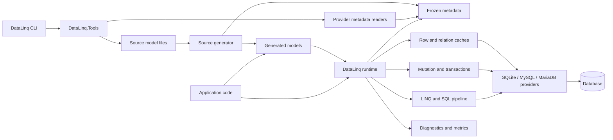
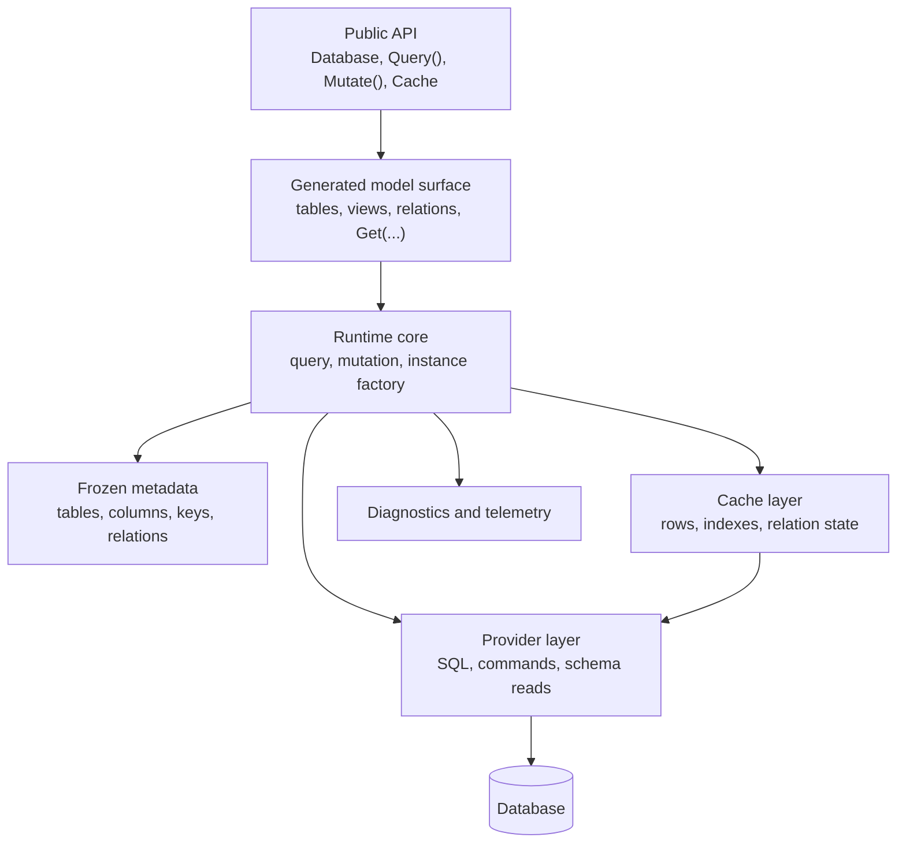

# Architecture Overview

DataLinq is built around one central trade:

- more structure at generation time
- fewer guesses at runtime

The library makes that trade through generated models, frozen metadata, provider-specific SQL/metadata adapters, immutable read models, explicit mutation objects, and cache identity based on provider keys.

That is the through-line. Most internals make sense once you understand that DataLinq would rather reject an unsupported shape than pretend a vague runtime fallback is safe.

## System Map

## Repository Organization

The important projects are grouped by job, not by accident:

| Area | Project or folder | Responsibility |
| --- | --- | --- |
| Runtime | `src/DataLinq` | Query execution, mutation, cache, metadata consumption, diagnostics, provider abstractions |
| Shared core | `src/DataLinq.SharedCore` | Attributes, metadata definitions, typed drafts, validation, generator/runtime shared contracts |
| Source generator | `src/DataLinq.Generators` | Compile-time model discovery and generated model output |
| Providers | `src/DataLinq.SQLite`, `src/DataLinq.MySql` | Provider SQL, metadata reads, database access, type mapping |
| Tools | `src/DataLinq.Tools`, `src/DataLinq.CLI` | Model generation, schema creation, validation, conservative diff scripts |
| Testing | `src/DataLinq.Tests.*`, `src/DataLinq.Testing.*` | Unit, compliance, provider, and infrastructure coverage |
| Benchmarks | `src/DataLinq.Benchmark`, `src/DataLinq.Benchmark.CLI` | Benchmark scenarios, history artifacts, regression comparison |

## Core Ideas

### Generated Code Is Part Of The Runtime Contract

Generated database models implement `IDatabaseModel<TDatabase>`. The runtime expects generated metadata hooks, generated instance hooks, generated key accessors, and generated relation handles to exist.

That is deliberate. Reflection-heavy discovery is the wrong default for this design because it makes startup slower, weakens AOT/trimming claims, and hides stale generated output.

See [Source Generator](Source%20Generator.md).

### Metadata Is Built, Validated, Then Frozen

DataLinq metadata starts as mutable draft input from source models, provider schemas, or generated metadata. It then passes through `MetadataDefinitionFactory`, which validates and normalizes the shape before producing finalized runtime definitions.

Runtime metadata should be treated as a snapshot. If code wants to create metadata, it should create typed drafts. If code wants fast access, it should use finalized lookup surfaces instead of mutating runtime arrays.

See [Metadata Structure](Metadata%20Structure.md).

### Reads Are Immutable

Query results are immutable model instances. That keeps repeated reads predictable and lets cached instances be shared without hidden dirty tracking.

Mutable objects exist, but they are transient write surfaces. The read side and write side are intentionally different.

### Writes Are Explicit

Updates happen through mutable wrappers and transactions. A mutation records changed values, writes through provider-specific SQL, and then updates or invalidates cache state.

This is less magical than ambient dirty tracking, and that is the point. DataLinq wants mutation boundaries to be visible.

### Cache Identity Is Provider-Key Identity

Generated row caches use the provider key shape:

- scalar provider values such as `int`, `long`, `Guid`, or `string`
- generated composite key structs for generated composite primary keys
- `DataLinqKey` only for bounded metadata-driven fallback paths

The cache should not store the same row under multiple identity abstractions. That adds memory pressure and makes invalidation harder to prove.

See [Provider-Key Row Cache Architecture](Provider-Key%20Row%20Cache%20Architecture.md).

### LINQ Support Is Test-Backed

DataLinq translates a useful subset of LINQ. It does not try to translate every expression tree.

Unsupported shapes should fail with `QueryTranslationException` or a clear unsupported-operation path. Silent client-side fallback inside provider predicates would be a correctness bug.

See [Query Translator](Query%20Translator.md) and [LINQ Parser Architecture](LINQ%20Parser%20Architecture.md).

### Provider Differences Are Explicit

SQLite, MySQL, and MariaDB do not expose identical DDL, type, default, index, collation, view, or generated-column behavior. DataLinq documents the supported metadata subset instead of pretending providers are interchangeable at every edge.

The CLI `validate` and `diff` commands depend on that support boundary.

## Runtime Layers

## What Happens During A Normal Read

The useful mental model is:

1. Application code queries through generated table properties.
2. The query pipeline translates the supported LINQ shape into SQL.
3. DataLinq usually retrieves primary keys first.
4. The table cache reuses existing immutable instances for cache hits.
5. Missing rows are fetched and materialized.
6. Results are returned as immutable models or supported projections.

That cache-aware shape is why key identity and generated metadata matter so much.

## What Happens During A Normal Write

The write model is separate:

1. Application code mutates an immutable instance or creates a mutable model.
2. A transaction records changed values.
3. Provider SQL writes the change.
4. DataLinq updates transaction/global cache state.
5. A fresh immutable instance represents the saved row.
6. Relation/index cache entries are invalidated or refreshed at the supported precision.

The mutation path is explicit because cache coherence depends on knowing what changed.

## Internals Reading Order

Use this order if you are trying to understand the system rather than chase a single API:

1. [Data Flow](Data%20Flow.md)
2. [Metadata Structure](Metadata%20Structure.md)
3. [Source Generator](Source%20Generator.md)
4. [Query Translator](Query%20Translator.md)
5. [LINQ Parser Architecture](LINQ%20Parser%20Architecture.md)
6. [Provider-Key Row Cache Architecture](Provider-Key%20Row%20Cache%20Architecture.md)

For the public support boundary, pair these pages with [Supported LINQ Queries](../Supported%20LINQ%20Queries.md), [Provider Metadata Support Matrix](../support-matrices/Provider%20Metadata%20Support%20Matrix.md), and [Platform Compatibility](../Platform%20Compatibility.md).
