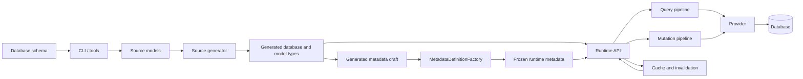
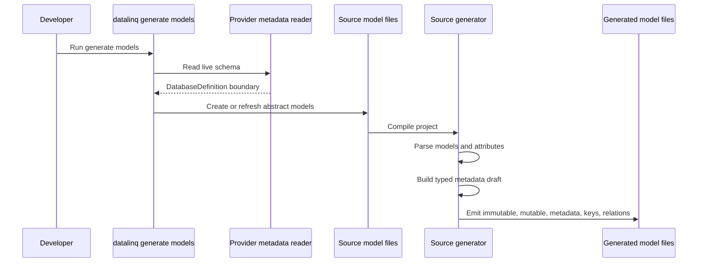
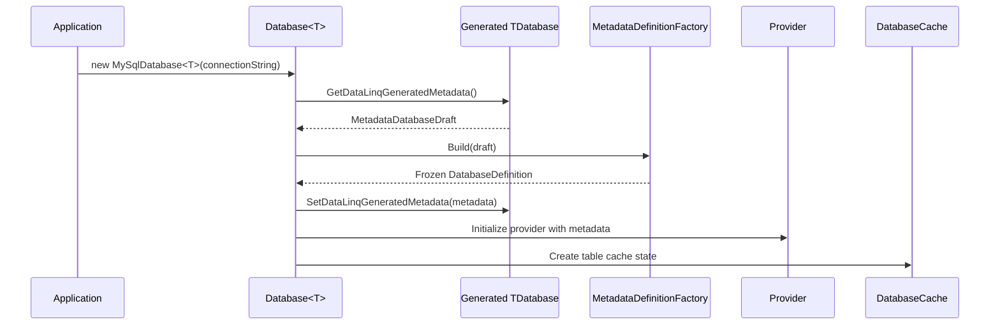
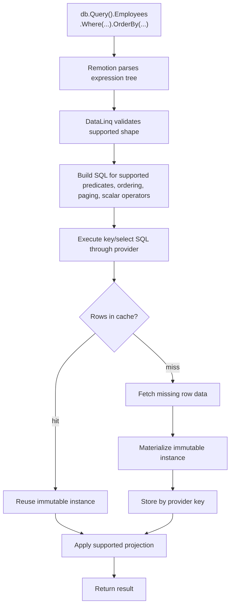
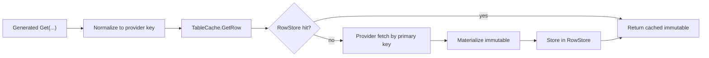
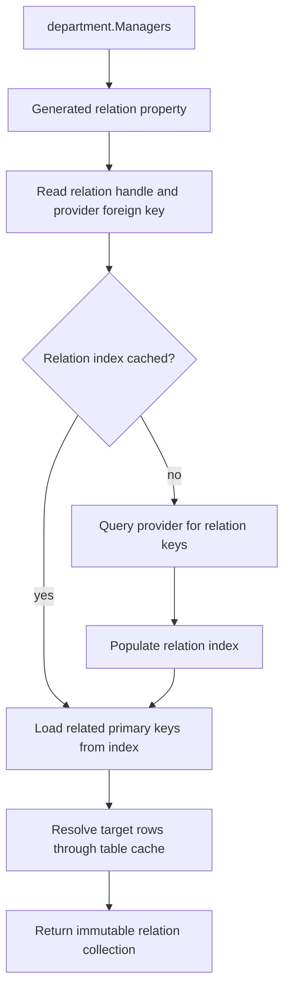
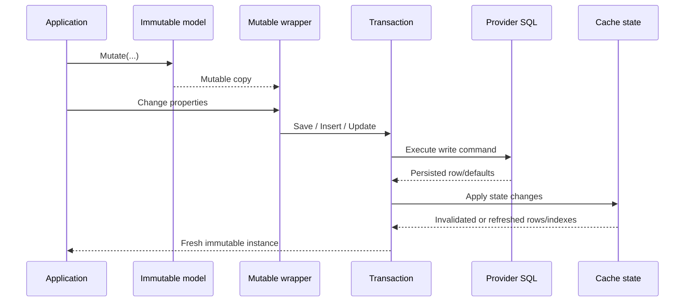
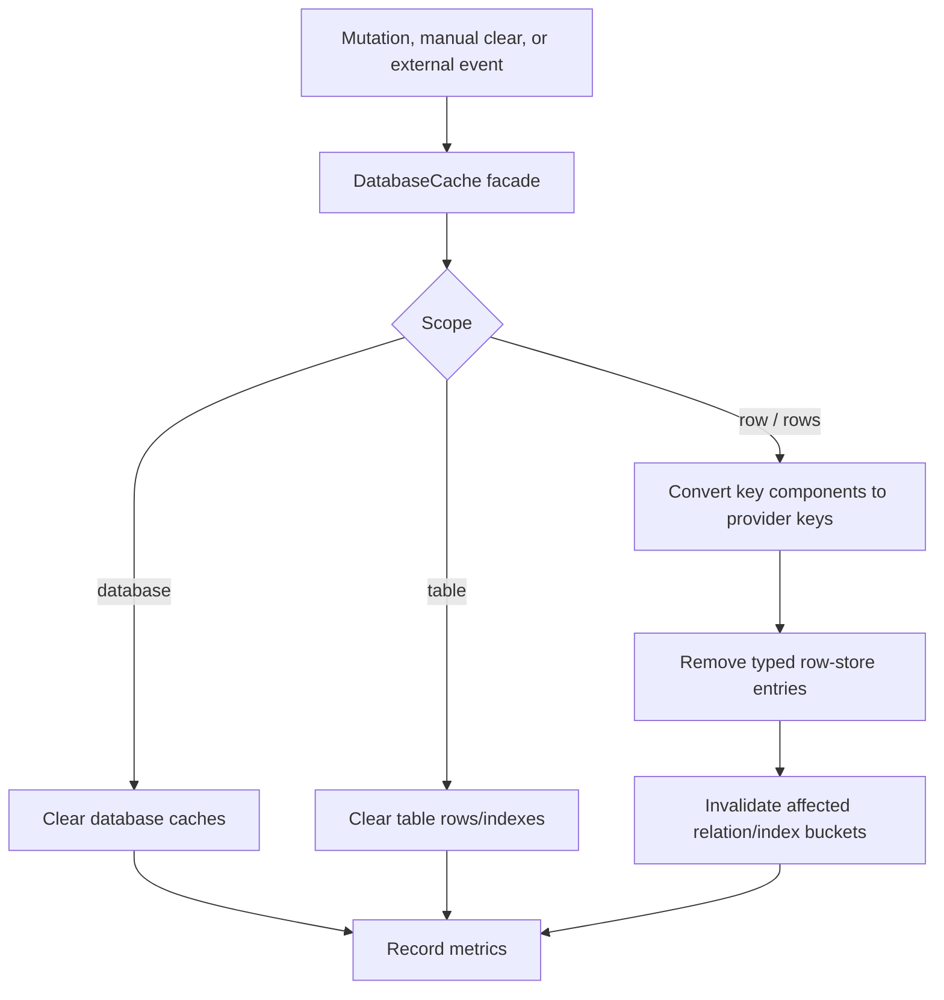
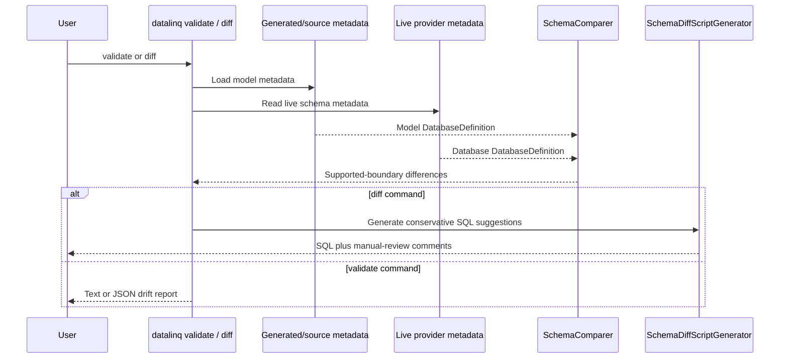
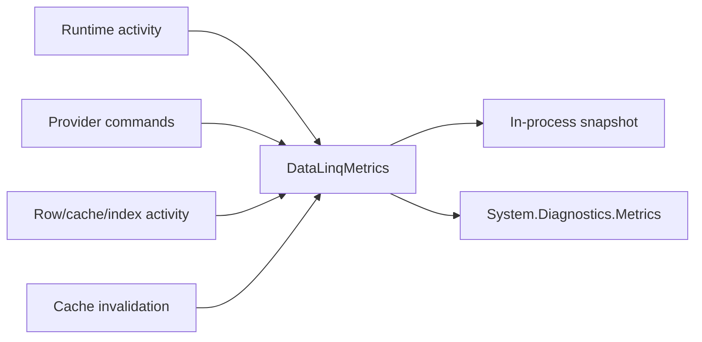

# Data Flow

This page follows the main paths through DataLinq. It is intentionally higher-level than the source code, but it names the real subsystems so you can map the diagrams back to the implementation.

## One-Page Mental Model

The core loop is:

1. generate a strong model surface
2. build finalized metadata
3. execute reads and writes through that metadata
4. keep caches coherent around provider-key identity
5. report behavior through diagnostics

## Model Generation Flow

Generation is not only a convenience step. The generated output carries runtime hooks that providers now require during normal startup.

## Provider Startup Flow

If the generated metadata hook is missing or invalid, startup should fail loudly. That failure is better than silently running with stale model assumptions.

## Query Execution Flow

The query pipeline is intentionally bounded. It supports documented predicates, ordering, paging, projections, scalar aggregates, one explicit inner join shape, and relation-backed existence predicates. Unsupported expression shapes are rejected rather than guessed.

## Direct Primary-Key Lookup

Generated scalar keys use provider CLR values directly. Generated composite keys use generated `DataLinqPrimaryKey` structs. Dynamic `DataLinqKey` is a bridge for metadata-driven paths, not the preferred generated row-cache key.

## Relation Traversal Flow

Relation traversal is lazy and cache-aware. That is why relation/index invalidation is part of the cache design, not an afterthought.

## Mutation And Transaction Flow

DataLinq does not rely on invisible dirty tracking. The mutation object is the write surface, and the transaction owns when changes become durable.

## Cache Invalidation Flow

Precise invalidation uses provider-key values. When a signal cannot provide enough detail, DataLinq falls back to a conservative table/database clear.

## Schema Validation And Diff Flow

Validation and diffing are schema trust tools. They depend on the provider metadata support matrix and intentionally avoid pretending to be full migration execution.

## Diagnostics Flow

The metrics model is hierarchical:

- runtime totals
- provider-instance metrics
- table-level cache and relation metrics

That shape avoids flattening different provider instances or table caches into one misleading number.
