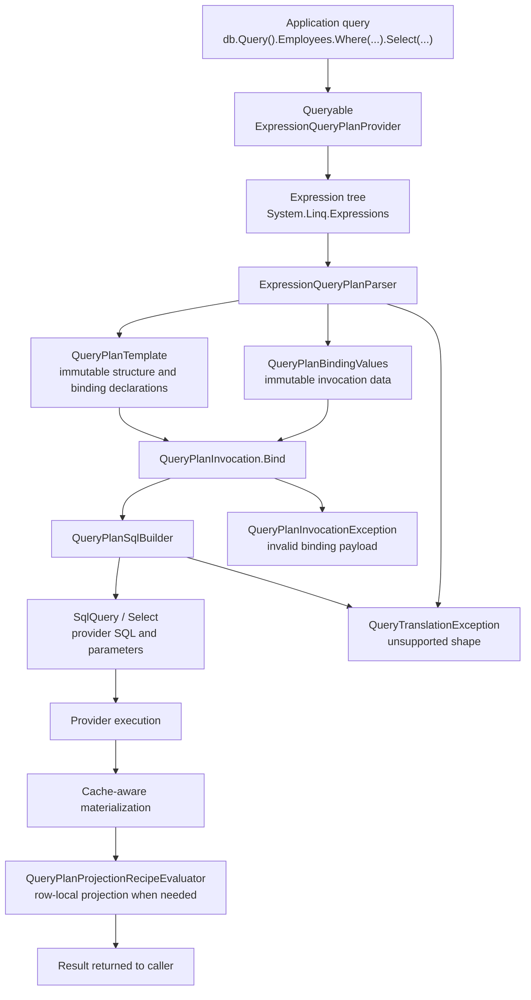
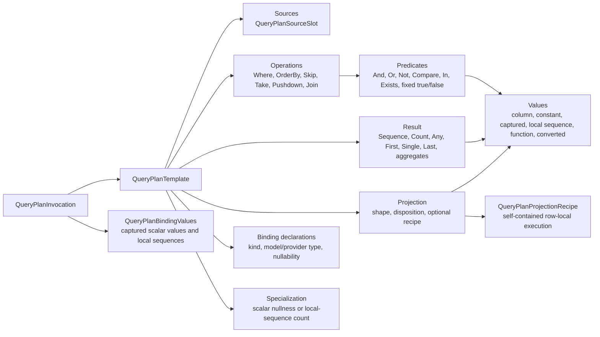
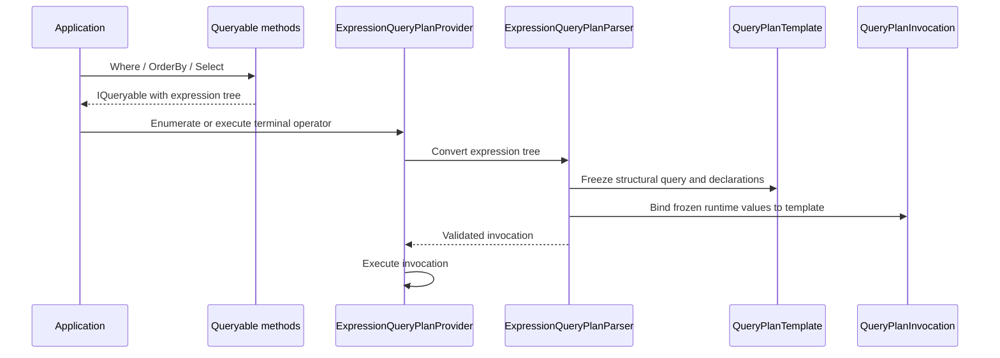
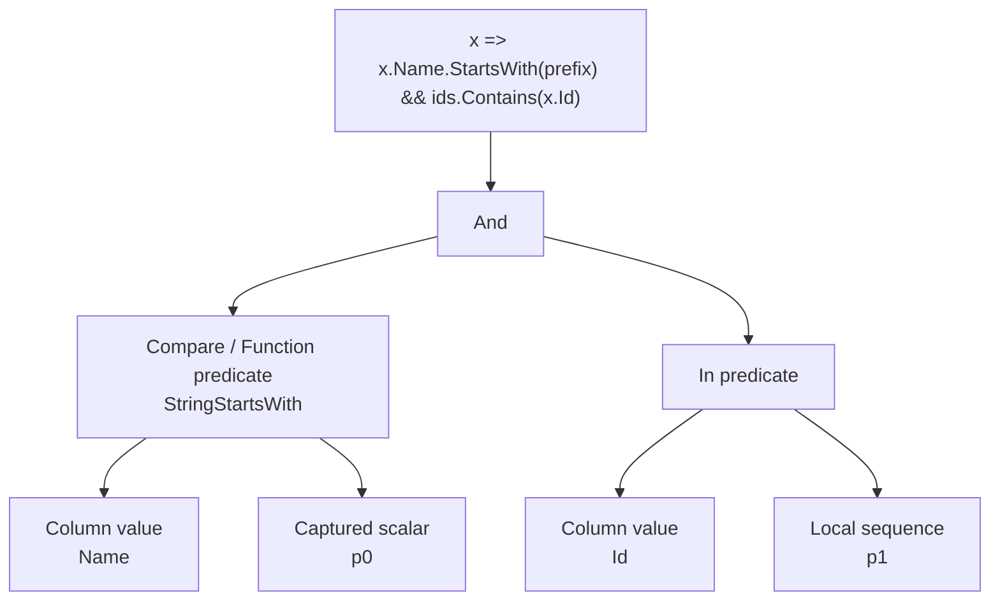
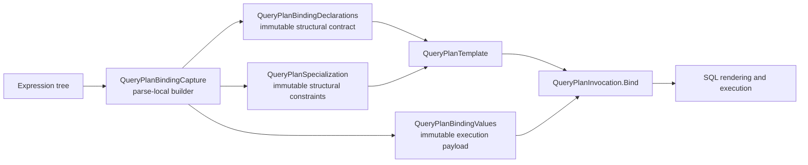
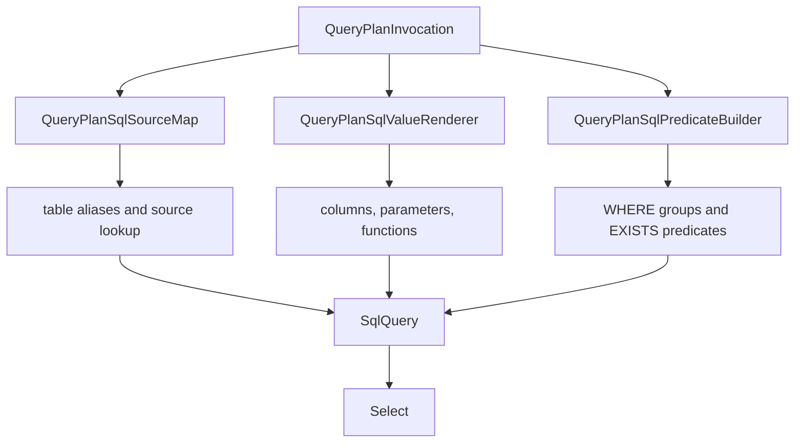
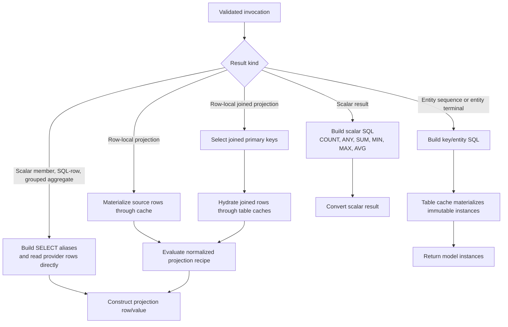

# LINQ Parser Architecture

DataLinq's LINQ parser is a deliberately small expression-tree parser for the documented query subset. It is not a general LINQ provider and it should not become one by accident.

For the public support contract, start with [Supported LINQ Queries](../Supported%20LINQ%20Queries.md). This page explains how the current parser is built, why it is shaped this way, what is already implemented, and what tradeoffs come with the design.

## Design Goals

The parser has a few hard goals:

- own DataLinq query semantics instead of inheriting them from a third-party query model
- keep `Remotion.Linq` out of the production runtime package and constrained-platform smoke paths
- translate only the query shapes DataLinq can prove with tests
- fail unsupported provider-query shapes with `QueryTranslationException`
- keep SQL generation behind a DataLinq-owned query plan
- preserve cache-aware materialization instead of turning every query into direct row construction
- separate SQL-backed filtering from row-local projection
- keep AOT-sensitive paths free of dynamic code and arbitrary local method invocation
- make the parsed template and invocation sufficient for execution, without retaining or recovering the original expression tree

The blunt version: DataLinq should be boringly correct for a known subset, not mysteriously permissive for every expression tree C# can produce.

## Pipeline Overview



The key boundary is `QueryPlanInvocation`: an immutable `QueryPlanTemplate` paired with immutable `QueryPlanBindingValues`. SQL rendering, execution, and projection consume that boundary to decide whether a query can run directly, needs row-local recipe evaluation after materialization, or must be rejected. The original expression is parse input only; it is not retained in the template and is not recovered as a selector lambda during execution.

## The Core Plan Model



The plan records query intent, not SQL text. That distinction matters:

- source slots give each table-like source a stable identity
- operations preserve the accepted LINQ operator order
- predicates model boolean logic explicitly
- values distinguish mapped columns from constants, captured values, local sequences, and supported functions
- binding declarations keep runtime values out of the structural query shape, while invocation values supply one execution's frozen payload
- explicit specializations record value-sensitive structural assumptions such as scalar nullness and local-sequence cardinality
- projections carry a disposition and, for row-local execution, a normalized recipe, so SQL projection and client-side row-local work are not confused

That gives DataLinq a contract between parsing and execution. SQL is one consumer of the invocation, not the invocation itself.

## Query Roots And Provider Ownership

`db.Query()` exposes generated table properties as `IQueryable<T>`. Those queryables are rooted in `ExpressionQueryPlanProvider`, a DataLinq-owned `IQueryProvider`.

When normal LINQ operators run, the .NET `Queryable` methods build expression trees. DataLinq receives those trees at enumeration or terminal execution time.



Owning the provider is the important 0.8 shift. DataLinq no longer asks another library to parse the expression tree into a third-party query model and then adapts that model afterward.

## Parsing Strategy

The parser is recursive and conservative.

For sequence queries it recognizes supported `Queryable` method calls:

- `Where`
- `OrderBy`, `OrderByDescending`, `ThenBy`, `ThenByDescending`
- `Skip`
- `Take`
- `Select`
- the current narrow `Join`

For terminal queries it recognizes supported result operators:

- `Count`
- `Any`
- `Single`, `SingleOrDefault`
- `First`, `FirstOrDefault`
- `Last`, `LastOrDefault`
- `Sum`, `Min`, `Max`, `Average`

Each method parser first parses the source expression, then adds its operation or result. That makes a chain such as this:

```csharp
db.Query().Employees
    .Where(x => x.emp_no > 10000)
    .OrderBy(x => x.birth_date)
    .Take(10)
```

become a plan with these operations:

```text
Where(emp_no > captured p0)
OrderBy(birth_date ascending)
Take(captured p1)
```

The parser intentionally rejects several shapes even when they are legal LINQ-to-objects:

- unsupported nested-source shapes where the current single-source pushdown boundary is not enough
- joined-row composition when the projected members cannot bind to source-slot or SQL-row values
- row-local joined composition after paging
- non-direct join sources
- composite anonymous-object join keys
- unsupported aggregate selectors
- arbitrary local method calls inside provider predicates
- relation traversal inside relation predicates

Rejecting those shapes is not a lack of ambition. It is a correctness choice. Silent translation of the wrong SQL is worse than a clear exception.

## Source Slots

Source slots are the parser's way of naming the rows a query can read from.

| Source kind | Current role |
| --- | --- |
| `RootTable` | The main table source for ordinary queries. |
| `ExplicitJoin` | The right-side table source for a supported explicit inner join. |
| `ImplicitJoin` | A singular relation source rendered as an inner join for supported predicates, ordering, and direct member projection. |
| `RelationSubquery` | A related table source used inside relation-backed `EXISTS` predicates. |

Every source slot records:

- a stable id
- a SQL alias
- table metadata
- CLR element type
- source kind
- cardinality
- nullability

This is the foundation for future join work. It is also why broad join expansion should be built on the current plan instead of trying to patch query behavior directly into SQL string builders.

## Predicates And Values

The parser converts supported predicate expressions into explicit predicate nodes.



Supported value nodes include:

- mapped table columns
- constants
- captured scalar values
- captured local sequences
- supported string and date/time function shapes
- simple conversions

Local values are evaluated by `ExpressionLocalValueEvaluator`. It allows practical local constants, captured values, list/array indexing, empty collection factories, and deterministic string operations. It does not compile expression trees or invoke arbitrary user methods to make a predicate "work".

That design avoids a nasty class of bugs where query translation accidentally runs application code while trying to build SQL.

## Bindings And Invocations

Bindings separate query shape from runtime values.



A captured scalar creates a scalar declaration, a `QueryPlanInvocationValue.Scalar` such as `p0`, and a scalar-nullness specialization. A local `IN (...)` list creates a local-sequence declaration, a `QueryPlanInvocationValue.LocalSequence`, and an exact-count specialization. Empty local collections are not rendered as invalid `IN ()` SQL; they collapse to fixed true or false predicates.

The mutable `QueryPlanBindingCapture` is parser-time builder state only. `QueryPlanTemplate` owns frozen `QueryPlanBindingDeclarations` and `QueryPlanSpecialization`; `QueryPlanInvocation` owns frozen `QueryPlanBindingValues`. Local sequences and array-valued scalars are copied so later caller mutation cannot alter the bound execution. Binding validates missing, duplicate, undeclared, wrong-kind, wrong-type, invalid-null, and specialization-mismatched values before rendering.

This is also the necessary seam for plan caching. Structural templates and runtime values are different products, and neither boundary exposes mutable capture state by convention.

## SQL Rendering

`QueryPlanSqlBuilder` consumes a validated `QueryPlanInvocation` and builds the lower-level `SqlQuery<T>` / `Select<T>` objects. Structural decisions come from its template; SQL parameters and local sequences come from its binding values.



The renderer currently handles:

- `Where` predicates
- grouped boolean logic
- local collection membership
- relation-backed `EXISTS`
- singular implicit relation joins for documented member access
- ordering
- paging
- single-source subquery pushdown for post-paging filters, orderings, and scalar reductions
- scalar result shapes such as `Count` and `Any`
- direct numeric aggregates
- scalar member and direct source-slot SQL-row projection selectors
- grouped aggregate selectors and `GROUP BY`
- the supported explicit inner join and single query-syntax inner join shapes
- joined SQL-row derived-source pushdown after paging

The SQL renderer is intentionally not allowed to depend on parser-specific expression nodes. If rendering needs `Expression`, a recovered selector lambda, `QueryModel`, or query-source identities from another parser, the invocation boundary has failed.

## Execution Paths

Execution has a few routes.



Entity queries usually flow through cache-aware table access. Projection queries deliberately split SQL-backed result work from row-local projection:

- SQL handles filtering, relation-existence predicates, joins, ordering, paging, aggregate selectors, grouped aggregate rows, and direct source-slot projection aliases.
- DataLinq materializes rows through table caches when the result is an entity or a row-local projection over entity instances.
- Direct scalar member, SQL-row, grouped aggregate, and supported joined projection rows read SQL aliases directly.
- Supported row-local projections run as normalized `QueryPlanProjectionRecipe` trees over materialized rows and immutable invocation values.

For row-local explicit joins, SQL selects primary keys for both joined sources. DataLinq then buffers the joined primary-key values, materializes each row through the relevant table cache, and evaluates the retained recipe over the row objects. Buffering the keys before row hydration avoids nested reader use on transaction connections.

For SQL-backed explicit joins, direct source-slot result members are selected as aliases and read from `IDataLinqDataReader` without hydrating joined entity rows. Post-paging joined composition stays supported only when the projected row is SQL-backed, because the derived-source boundary needs stable projection aliases.

## Projection Model

The current projection model is intentionally split into plan shape, disposition, and optional row-local execution recipe.

| Projection kind | Meaning |
| --- | --- |
| `Entity` | Return the model instance for a source slot. |
| `ScalarMember` | Return one mapped member through the direct scalar path. |
| `Anonymous` | Return a structured row-local projection from a normalized compatibility recipe. |
| `ComputedRowLocalExpression` | Evaluate a normalized computed recipe after row materialization. The enum name is historical; the retained projection contains no expression tree. |
| `JoinedRowLocal` | Evaluate a normalized recipe over joined materialized rows. The projection remains SQL-only even when its inner scalar recipe is AOT-safe. |
| `SqlRow` | Read direct source-slot projection members from SQL aliases. |
| `TransparentIdentifier` | Bind compiler-generated query-syntax carriers during parsing; it is not a valid retained executable projection. |
| `GroupedAggregate` | Return SQL grouped aggregate rows for supported key and aggregate projection shapes. |

Every projection has an explicit `QueryPlanProjectionDisposition`:

| Disposition | Execution contract |
| --- | --- |
| `Direct` | No row-local recipe is required. Used by entity and scalar-member projections. |
| `AotSafe` | The normalized recipe uses only the constrained evaluator surface and may run with `ProjectionEvaluationOptions.AotStrict`. |
| `SqlOnlyCompatibility` | The projection requires an explicitly fenced compatibility operation or SQL-owned joined-row materialization; AOT-strict execution rejects it before evaluation. |
| `Unsupported` | Parser-only shape. `QueryPlanTemplateValidator` prevents it from entering an executable template. |

`QueryPlanProjectionRecipe` is a closed, immutable tree. It models source rows and columns, scalar binding references, null/Boolean intrinsics, supported conversions and operators, supported members and functions, conditionals, supported arrays, and explicitly marked compatibility constructor/member nodes. `QueryPlanTemplateValidator` recursively checks recipe types, source and binding references, operator shapes, constructors, members, and disposition compatibility. A projection kind may impose a stricter SQL-only fence than its inner recipe, but an AOT-safe projection cannot contain a SQL-only recipe.

`QueryPlanProjectionRecipeEvaluator` evaluates the recipe with materialized source values and `QueryPlanBindingValues`. It has no API for the original `Expression`, does not call `Expression.Compile()`, and does not recover or reconstruct a projection lambda. Compatibility construction and member access are explicit recipe nodes controlled by `ProjectionEvaluationOptions`, not a catch-all client-expression fallback.

This keeps hidden I/O out of projection. A mapped member reached through a supported singular relation becomes an explicit implicit-join source slot and may participate in a direct SQL projection or a SQL-only joined row-local recipe. Projecting relation objects or collections is rejected because that would hide lazy relation loading behind what looks like one provider query.

Grouped aggregate projection is the exception to the row-local projection rule because aggregate rows are not entity rows. The parser records a `GroupBy` operation, a group-key value, and grouped aggregate projection members; SQL renders `GROUP BY`, and execution reads the aggregate row aliases directly from `IDataLinqDataReader`.

## AOT And Dynamic-Code Boundary

The parser still inspects expression trees, and expression trees contain reflection metadata such as `MemberInfo` and `MethodInfo`. So the honest goal is not "no reflection exists".

The practical goal is narrower and more useful:

- no `Expression.Compile()` in supported query execution
- no arbitrary local method invocation during parser local-value evaluation
- self-contained row-local projection recipes with explicit AOT-safe and compatibility dispositions
- no original-expression retention or selector-lambda recovery after parsing
- generated metadata and generated access paths where DataLinq can avoid runtime discovery
- compatibility fallbacks isolated from the supported constrained-platform path

`ExpressionQueryPlanParserOptions.AotStrict`, `ProjectionEvaluationOptions.AotStrict`, and the disposition checks keep that boundary testable. A SQL-only projection can run only through the normal SQL execution path with the required compatibility permissions or joined-row materialization support.

## Current Progress

Implemented in 0.8 and later:

- `Database.Query()` roots execute through the DataLinq expression parser provider.
- `Remotion.Linq` is not part of the active production query provider or public runtime package dependency graph.
- SQL generation and execution consume `QueryPlanInvocation`; the original expression tree is not retained as an execution input.
- Active SQL inspection helpers use `ExpressionQueryPlanParser` and `QueryPlanSqlBuilder`.
- Architecture tests guard plan/parser/SQL renderer types against Remotion type exposure.
- The support matrix is backed by active compliance tests for the documented query subset.
- Trimmed compatibility reporting is no longer blocked by a Remotion dependency.
- Query structure is frozen into `QueryPlanTemplate`, while binding declarations and invocation values are immutable, separately owned contracts validated by `QueryPlanInvocation.Bind(...)`.
- Row-local projections are normalized into self-contained `QueryPlanProjectionRecipe` trees with explicit dispositions and execute through `QueryPlanProjectionRecipeEvaluator` without selector-lambda recovery.

Supported parser areas include:

- single-source filters, ordering, paging, and row-local projections
- single-source post-paging filters/orderings through explicit query-plan pushdown
- scalar result operators and direct numeric aggregates
- grouped aggregate projection for direct, composite, and SQL-renderable computed keys; grouped `Count`, direct numeric grouped aggregates, narrow `HAVING`, and grouped-row composition
- explicit two-source inner join composition for predicates, ordering, paging, `Any`, and `Count` over projected source-slot members, including supported post-paging joined pushdown
- single C# query-syntax inner joins whose transparent identifiers bind back to source slots
- local collection membership for documented shapes
- nullable predicate semantics covered by tests
- string and date/time member/function translations documented in the support matrix
- one-to-many relation `Any(...)` and existence-equivalent `Count()` predicates
- one narrow explicit inner `Join(...)` shape
- singular implicit relation predicates, orderings, direct projection, and supported computed row-local recipes rendered through inner joins

Still deliberately outside the current support boundary:

- arbitrary LINQ
- broad `GroupBy(...)` beyond the documented SQL-backed grouped aggregate projection shapes
- `GroupJoin(...)`
- outer joins
- multiple explicit joins
- composite anonymous-object join keys
- multi-join query syntax and opaque transparent-identifier joins
- fluent `JoinBy(...)`, `JoinMany(...)`, and left-join APIs
- left-join null-preserving relation traversal
- arbitrary nested database subqueries beyond the supported single-source pushdown boundary
- SQL-backed projection lists as a broad feature beyond direct source-slot rows
- relation object and collection relation projections inside provider `Select(...)`
- arbitrary local method calls inside provider predicates
- nested database subqueries
- non-SQL query executors

Some of those are natural future work. They should still enter through the plan model and tests, not through special-case SQL string handling.

## Pros And Cons

| Choice | Upside | Cost |
| --- | --- | --- |
| DataLinq-owned parser | DataLinq controls diagnostics, support boundaries, AOT behavior, and package dependencies. | DataLinq must implement and maintain the supported subset itself. |
| Query plan before SQL | SQL rendering is not coupled to expression-tree parser details. | Every supported shape needs a plan representation before it can run. |
| Template/invocation split | Structural query shape and binding declarations can be reasoned about independently from one execution's values. | Value-sensitive assumptions must be modeled and validated as explicit specializations. |
| Normalized projection recipes | Row-local execution no longer depends on the original expression or runtime compilation, and AOT compatibility is explicit. | Every supported operator, member, function, conversion, or construction shape needs a recipe node and evaluator semantics. |
| Conservative support matrix | Users get fewer fake promises and clearer failures. | Some LINQ-to-objects shapes that look natural are rejected. |
| Row-local projection after materialization | Projection semantics stay close to normal .NET over generated model instances. | Wide-row reads can be less efficient than SQL `SELECT`-list projection. |
| Primary-key and cache-aware execution | Repeated reads can reuse immutable instances and provider-key row caches. | Some query paths are more complex than direct SQL row materialization. |
| Explicit source slots | Joins, relation subqueries, and future relation-aware APIs have a real identity model. | Source-slot modeling adds upfront complexity. |
| No silent client-side predicate fallback | Correctness failures are visible. | Users must rewrite unsupported predicates instead of relying on best-effort behavior. |

## Why Not Translate Everything?

LINQ is not one feature. It is a language-shaped surface over arbitrary method calls, closures, provider-specific SQL semantics, nullable behavior, relation traversal, projection construction, local collection evaluation, and execution timing.

Trying to support "all LINQ" usually means one of three bad outcomes:

- silently evaluating too much on the client
- generating SQL that is almost right until edge cases appear
- exposing diagnostics that mention internal parser accidents instead of user query shapes

DataLinq's parser is intentionally less magical. It should translate known shapes, reject unknown shapes, and grow only when tests and docs grow with it.

## Implementation Map

Key implementation files:

| Area | File |
| --- | --- |
| Queryable provider and execution route | `src/DataLinq/Linq/Planning/Expressions/ExpressionPlanQueryable.cs` |
| Expression parser | `src/DataLinq/Linq/Planning/Expressions/ExpressionQueryPlanParser.cs` |
| Local value evaluation | `src/DataLinq/Linq/Planning/Expressions/ExpressionLocalValueEvaluator.cs` |
| Structural query template | `src/DataLinq/Linq/Planning/QueryPlanTemplate.cs` |
| Bound query invocation | `src/DataLinq/Linq/Planning/QueryPlanInvocation.cs` |
| Binding declarations, values, and specialization contracts | `src/DataLinq/Linq/Planning/QueryPlanBindingContracts.cs` |
| Parse-local binding capture | `src/DataLinq/Linq/Planning/QueryPlanBindingCapture.cs` |
| Source slots | `src/DataLinq/Linq/Planning/QueryPlanSourceSlot.cs` |
| Operations and joins | `src/DataLinq/Linq/Planning/QueryPlanOperation.cs` |
| Predicates | `src/DataLinq/Linq/Planning/QueryPlanPredicate.cs` |
| Query values and binding references | `src/DataLinq/Linq/Planning/QueryPlanValue.cs` |
| Projections and results | `src/DataLinq/Linq/Planning/QueryPlanProjection.cs`, `src/DataLinq/Linq/Planning/QueryPlanResult.cs` |
| Normalized projection recipes | `src/DataLinq/Linq/Planning/QueryPlanProjectionRecipe.cs` |
| SQL rendering | `src/DataLinq/Linq/Planning/Sql/QueryPlanSqlBuilder.cs` |
| Projection evaluation | `src/DataLinq/Linq/Planning/QueryPlanProjectionRecipeEvaluator.cs`, `src/DataLinq/Linq/ProjectionEvaluationOptions.cs` |
| Compliance evidence | `src/DataLinq.Tests.Compliance/Translation/` |

## Maintenance Rule

Parser documentation should move in this order:

1. Add or update tests for the query shape.
2. Implement parser, plan, SQL rendering, and execution support.
3. Update the [LINQ Translation Support Matrix](../support-matrices/LINQ%20Translation%20Support%20Matrix.md).
4. Update [Supported LINQ Queries](../Supported%20LINQ%20Queries.md) only for behavior that is actually supported.
5. Update this architecture page when the design boundary changes.

That order is intentionally strict. Documentation should describe the parser DataLinq has, not the parser we wish we had.
