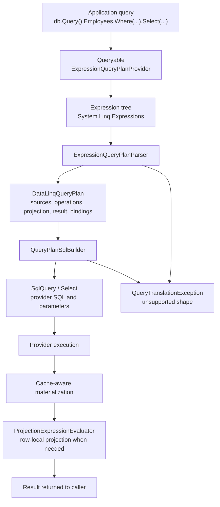
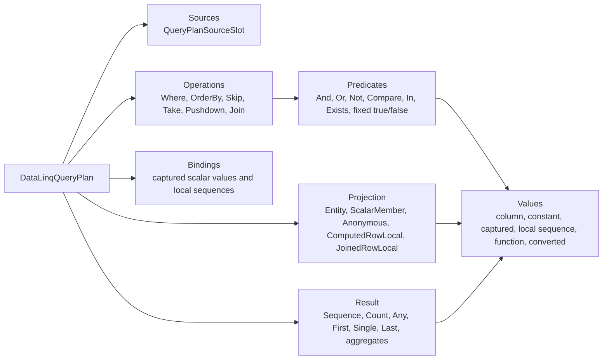
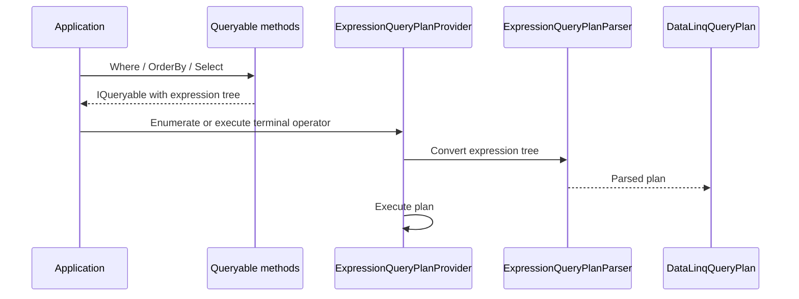
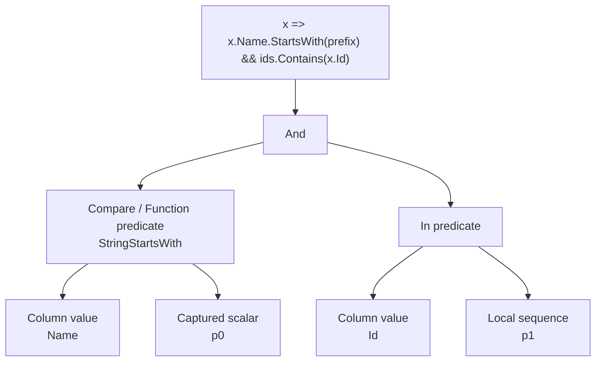
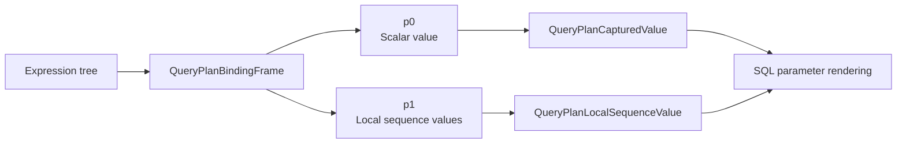
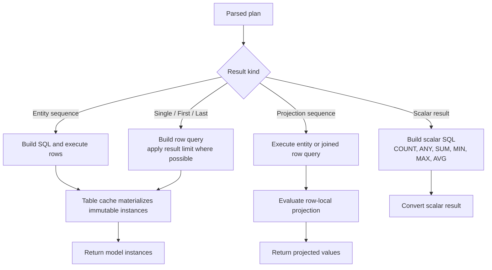

# LINQ Parser Architecture

DataLinq's LINQ parser is a deliberately small expression-tree parser for the documented query subset. It is not a general LINQ provider and it should not become one by accident.

For the public support contract, start with [Supported LINQ Queries](../Supported%20LINQ%20Queries.md). This page explains how the current parser is built, why it is shaped this way, what is already implemented, and what tradeoffs come with the design.

## Design Goals

The parser has a few hard goals:

- own DataLinq query semantics instead of inheriting them from a third-party query model
- keep `Remotion.Linq` out of the production runtime package and constrained-platform smoke paths
- translate only the query shapes DataLinq can prove with tests
- fail unsupported provider-query shapes with `QueryTranslationException`
- keep SQL generation behind a DataLinq-owned query plan
- preserve cache-aware materialization instead of turning every query into direct row construction
- separate SQL-backed filtering from row-local projection
- keep AOT-sensitive paths free of dynamic code and arbitrary local method invocation

The blunt version: DataLinq should be boringly correct for a known subset, not mysteriously permissive for every expression tree C# can produce.

## Pipeline Overview



The key boundary is `DataLinqQueryPlan`. The parser emits it. SQL rendering consumes it. Execution and projection use it to decide whether a query can run as SQL, needs row-local projection after materialization, or must be rejected.

## The Core Plan Model



The plan records query intent, not SQL text. That distinction matters:

- source slots give each table-like source a stable identity
- operations preserve the accepted LINQ operator order
- predicates model boolean logic explicitly
- values distinguish mapped columns from constants, captured values, local sequences, and supported functions
- bindings keep runtime values out of the structural query shape
- projections are explicit, so SQL projection and row-local projection are not confused

That gives DataLinq a contract between parsing and execution. SQL is one consumer of the plan, not the plan itself.

## Query Roots And Provider Ownership

`db.Query()` exposes generated table properties as `IQueryable<T>`. Those queryables are rooted in `ExpressionQueryPlanProvider`, a DataLinq-owned `IQueryProvider`.

When normal LINQ operators run, the .NET `Queryable` methods build expression trees. DataLinq receives those trees at enumeration or terminal execution time.



Owning the provider is the important 0.8 shift. DataLinq no longer asks another library to parse the expression tree into a third-party query model and then adapts that model afterward.

## Parsing Strategy

The parser is recursive and conservative.

For sequence queries it recognizes supported `Queryable` method calls:

- `Where`
- `OrderBy`, `OrderByDescending`, `ThenBy`, `ThenByDescending`
- `Skip`
- `Take`
- `Select`
- the current narrow `Join`

For terminal queries it recognizes supported result operators:

- `Count`
- `Any`
- `Single`, `SingleOrDefault`
- `First`, `FirstOrDefault`
- `Last`, `LastOrDefault`
- `Sum`, `Min`, `Max`, `Average`

Each method parser first parses the source expression, then adds its operation or result. That makes a chain such as this:

```csharp
db.Query().Employees
    .Where(x => x.emp_no > 10000)
    .OrderBy(x => x.birth_date)
    .Take(10)
```

become a plan with these operations:

```text
Where(emp_no > captured p0)
OrderBy(birth_date ascending)
Take(captured p1)
```

The parser intentionally rejects several shapes even when they are legal LINQ-to-objects:

- unsupported nested-source shapes where the current single-source pushdown boundary is not enough
- filtering, ordering, paging, or terminal operators over explicit joined rows
- non-direct join sources
- composite anonymous-object join keys
- unsupported aggregate selectors
- arbitrary local method calls inside provider predicates
- relation traversal inside relation predicates

Rejecting those shapes is not a lack of ambition. It is a correctness choice. Silent translation of the wrong SQL is worse than a clear exception.

## Source Slots

Source slots are the parser's way of naming the rows a query can read from.

| Source kind | Current role |
| --- | --- |
| `RootTable` | The main table source for ordinary queries. |
| `ExplicitJoin` | The right-side table source for the current explicit inner join baseline. |
| `RelationSubquery` | A related table source used inside relation-backed `EXISTS` predicates. |

Every source slot records:

- a stable id
- a SQL alias
- table metadata
- CLR element type
- source kind
- cardinality
- nullability

This is the foundation for future join work. It is also why broad join expansion should be built on the current plan instead of trying to patch query behavior directly into SQL string builders.

## Predicates And Values

The parser converts supported predicate expressions into explicit predicate nodes.



Supported value nodes include:

- mapped table columns
- constants
- captured scalar values
- captured local sequences
- supported string and date/time function shapes
- simple conversions

Local values are evaluated by `ExpressionLocalValueEvaluator`. It allows practical local constants, captured values, list/array indexing, empty collection factories, and deterministic string operations. It does not compile expression trees or invoke arbitrary user methods to make a predicate "work".

That design avoids a nasty class of bugs where query translation accidentally runs application code while trying to build SQL.

## Bindings

Bindings separate query shape from runtime values.



A captured scalar becomes a `QueryPlanCapturedValue` such as `p0`. A local `IN (...)` list becomes a `QueryPlanLocalSequenceValue`. Empty local collections are not rendered as invalid `IN ()` SQL; they collapse to fixed true or false predicates.

This is also a useful future seam for plan caching. The structural plan and the captured values are not the same thing.

## SQL Rendering

`QueryPlanSqlBuilder` consumes `DataLinqQueryPlan` and builds the lower-level `SqlQuery<T>` / `Select<T>` objects.


The renderer currently handles:

- `Where` predicates
- grouped boolean logic
- local collection membership
- relation-backed `EXISTS`
- ordering
- paging
- single-source subquery pushdown for post-paging filters, orderings, and scalar reductions
- scalar result shapes such as `Count` and `Any`
- direct numeric aggregates
- the narrow explicit inner join baseline

The SQL renderer is intentionally not allowed to depend on parser-specific expression nodes. If rendering needs `Expression`, `QueryModel`, or query-source identities from another parser, the plan boundary has failed.

## Execution Paths

Execution has a few routes.



Entity queries usually flow through cache-aware table access. Projection queries deliberately split SQL-backed query work from row-local projection:

- SQL handles filtering, relation-existence predicates, ordering, paging, aggregate selectors, and join key selection.
- DataLinq materializes rows through table caches.
- Supported projection expressions run over materialized rows.

For explicit joins, SQL selects primary keys for both joined sources. DataLinq then materializes each row through the relevant table cache and evaluates the result selector over the row objects.

That is less ambitious than a full SQL `SELECT` projection engine. It is also much easier to keep correct with the existing cache and generated-instance model.

## Projection Model

The current projection model is intentionally split into plan shape and execution behavior.

| Projection kind | Meaning |
| --- | --- |
| `Entity` | Return the model instance for a source slot. |
| `ScalarMember` | Return one mapped member from a materialized source. |
| `Anonymous` | Return a structured row-local projection. |
| `ComputedRowLocalExpression` | Evaluate a supported computed expression after row materialization. |
| `JoinedRowLocal` | Evaluate a supported projection over joined materialized rows. |
| `GroupedAggregate` | Return SQL grouped aggregate rows for the narrow direct-key `group.Key` plus `group.Count()` shape. |

This keeps hidden I/O out of projection. Relation-property projection inside provider `Select(...)` is rejected because it would make a provider query look like one SQL operation while hiding relation traversal behind the projection.

Grouped aggregate projection is the exception to the row-local projection rule because aggregate rows are not entity rows. The parser records a `GroupBy` operation, a group-key value, and grouped aggregate projection members; SQL renders `GROUP BY`, and execution reads the aggregate row aliases directly from `IDataLinqDataReader`.

## AOT And Dynamic-Code Boundary

The parser still inspects expression trees, and expression trees contain reflection metadata such as `MemberInfo` and `MethodInfo`. So the honest goal is not "no reflection exists".

The practical goal is narrower and more useful:

- no `Expression.Compile()` in supported query execution
- no arbitrary local method invocation during parser local-value evaluation
- row-local projection paths that can be checked under strict AOT-sensitive modes
- generated metadata and generated access paths where DataLinq can avoid runtime discovery
- compatibility fallbacks isolated from the supported constrained-platform path

`ExpressionQueryPlanParserOptions.AotStrict` and related strict projection/local-evaluation options exist to keep that boundary testable.

## Current Progress

Implemented in the current 0.8 branch:

- `Database.Query()` roots execute through the DataLinq expression parser provider.
- `Remotion.Linq` is not part of the active production query provider or public runtime package dependency graph.
- SQL generation consumes `DataLinqQueryPlan`.
- Active SQL inspection helpers use `ExpressionQueryPlanParser` and `QueryPlanSqlBuilder`.
- Architecture tests guard plan/parser/SQL renderer types against Remotion type exposure.
- The support matrix is backed by active compliance tests for the documented query subset.
- Trimmed compatibility reporting is no longer blocked by a Remotion dependency.

Supported parser areas include:

- single-source filters, ordering, paging, and row-local projections
- single-source post-paging filters/orderings through explicit query-plan pushdown
- scalar result operators and direct numeric aggregates
- single-source grouped aggregate projection for a direct mapped key plus `group.Key` and `group.Count()`
- local collection membership for documented shapes
- nullable predicate semantics covered by tests
- string and date/time member/function translations documented in the support matrix
- one-to-many relation `Any(...)` and existence-equivalent `Count()` predicates
- one narrow explicit inner `Join(...)` shape

Still deliberately outside the current support boundary:

- arbitrary LINQ
- broad `GroupBy(...)` beyond the documented grouped `Count()` projection
- `GroupJoin(...)`
- outer joins
- multiple explicit joins
- composite anonymous-object join keys
- filtering, ordering, paging, or terminal operators over joined row shapes
- arbitrary nested database subqueries beyond the supported single-source pushdown boundary
- SQL-backed projection lists as a broad feature
- relation-property projections inside provider `Select(...)`
- arbitrary local method calls inside provider predicates
- nested database subqueries
- non-SQL query executors

Some of those are natural future work. They should still enter through the plan model and tests, not through special-case SQL string handling.

## Pros And Cons

| Choice | Upside | Cost |
| --- | --- | --- |
| DataLinq-owned parser | DataLinq controls diagnostics, support boundaries, AOT behavior, and package dependencies. | DataLinq must implement and maintain the supported subset itself. |
| Query plan before SQL | SQL rendering is not coupled to expression-tree parser details. | Every supported shape needs a plan representation before it can run. |
| Conservative support matrix | Users get fewer fake promises and clearer failures. | Some LINQ-to-objects shapes that look natural are rejected. |
| Row-local projection after materialization | Projection semantics stay close to normal .NET over generated model instances. | Wide-row reads can be less efficient than SQL `SELECT`-list projection. |
| Primary-key and cache-aware execution | Repeated reads can reuse immutable instances and provider-key row caches. | Some query paths are more complex than direct SQL row materialization. |
| Explicit source slots | Joins, relation subqueries, and future relation-aware APIs have a real identity model. | Source-slot modeling adds upfront complexity. |
| No silent client-side predicate fallback | Correctness failures are visible. | Users must rewrite unsupported predicates instead of relying on best-effort behavior. |

## Why Not Translate Everything?

LINQ is not one feature. It is a language-shaped surface over arbitrary method calls, closures, provider-specific SQL semantics, nullable behavior, relation traversal, projection construction, local collection evaluation, and execution timing.

Trying to support "all LINQ" usually means one of three bad outcomes:

- silently evaluating too much on the client
- generating SQL that is almost right until edge cases appear
- exposing diagnostics that mention internal parser accidents instead of user query shapes

DataLinq's parser is intentionally less magical. It should translate known shapes, reject unknown shapes, and grow only when tests and docs grow with it.

## Implementation Map

Key implementation files:

| Area | File |
| --- | --- |
| Queryable provider and execution route | `src/DataLinq/Linq/Planning/Expressions/ExpressionPlanQueryable.cs` |
| Expression parser | `src/DataLinq/Linq/Planning/Expressions/ExpressionQueryPlanParser.cs` |
| Local value evaluation | `src/DataLinq/Linq/Planning/Expressions/ExpressionLocalValueEvaluator.cs` |
| Query plan root | `src/DataLinq/Linq/Planning/DataLinqQueryPlan.cs` |
| Source slots | `src/DataLinq/Linq/Planning/QueryPlanSourceSlot.cs` |
| Operations and joins | `src/DataLinq/Linq/Planning/QueryPlanOperation.cs` |
| Predicates | `src/DataLinq/Linq/Planning/QueryPlanPredicate.cs` |
| Values and bindings | `src/DataLinq/Linq/Planning/QueryPlanValue.cs`, `src/DataLinq/Linq/Planning/QueryPlanBindingFrame.cs` |
| Projections and results | `src/DataLinq/Linq/Planning/QueryPlanProjection.cs`, `src/DataLinq/Linq/Planning/QueryPlanResult.cs` |
| SQL rendering | `src/DataLinq/Linq/Planning/Sql/QueryPlanSqlBuilder.cs` |
| Projection evaluation | `src/DataLinq/Linq/ProjectionExpressionEvaluator.cs` |
| Compliance evidence | `src/DataLinq.Tests.Compliance/Translation/` |

## Maintenance Rule

Parser documentation should move in this order:

1. Add or update tests for the query shape.
2. Implement parser, plan, SQL rendering, and execution support.
3. Update the [LINQ Translation Support Matrix](../support-matrices/LINQ%20Translation%20Support%20Matrix.md).
4. Update [Supported LINQ Queries](../Supported%20LINQ%20Queries.md) only for behavior that is actually supported.
5. Update this architecture page when the design boundary changes.

That order is intentionally strict. Documentation should describe the parser DataLinq has, not the parser we wish we had.
