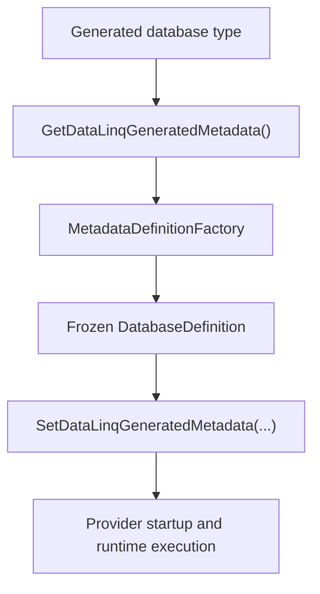

# Source Generator

DataLinq's source generator is not only a boilerplate reducer. In current DataLinq it is part of the runtime contract.

Generated database models implement `IDataLinqGeneratedDatabaseModel<TDatabase>`, provide complete generated metadata, install generated metadata back into the database type, and generate table/model helpers that the runtime expects to exist. Stale generated output should fail early rather than silently falling back to reflection-heavy startup.

## Generated Surface

For a configured database, the generator produces:

- a partial database model implementing `IDataLinqGeneratedDatabaseModel<TDatabase>`
- `GetDataLinqGeneratedMetadata()` returning a generated metadata draft
- `SetDataLinqGeneratedMetadata(...)` for binding finalized runtime metadata back to the generated type
- immutable model classes
- mutable model classes
- relation accessors and mutation helpers
- generated static primary-key lookup helpers
- provider-key row-store accessors for scalar and composite primary keys
- generated `DataLinqPrimaryKey` structs for composite primary-key shapes
- indexed value, mutable, and relation handles where those avoid runtime lookup

The practical result is simple: normal runtime startup should consume generated metadata, not rediscover model shape from ordinary runtime reflection.

## Runtime Startup Contract

Provider construction calls the generated metadata hook, builds a finalized `DatabaseDefinition` through `MetadataDefinitionFactory`, and binds that finalized metadata back to the generated database model.

If the generated type is missing the complete metadata hook, returns invalid metadata, or cannot bind the finalized metadata, DataLinq reports a model failure. That behavior is intentional. Hiding stale generated output behind a compatibility fallback makes package upgrades and AOT/trimming claims much harder to trust.

## Generation Workflow

### 1. Model Discovery

The generator uses Roslyn to find candidate model declarations. DataLinq models are source-defined abstract types that describe tables and views through model interfaces and attributes.

The generator collects:

- database model declarations
- table and view model declarations
- scalar value properties
- relation properties
- attributes such as table names, column names, keys, defaults, comments, checks, cache settings, and relations
- using directives and C# type information needed to emit valid generated code

### 2. Metadata Construction

Source metadata is converted into typed metadata drafts and then validated through `MetadataDefinitionFactory`.

That factory boundary matters. It centralizes construction, validation, finalization, and freezing of runtime metadata instead of letting scattered mutable metadata objects become the source of truth.

The finalized metadata model carries:

- database, table, view, column, index, relation, and cache policy metadata
- provider/model key shape details
- frozen lookup maps for common table and column resolution
- generated declaration metadata
- provider-key row-store accessor hooks
- scalar-converter slots reserved for future converter work

### 3. Source Emission

After metadata construction, the generator emits the database file and one generated file per table/view model.

Generated model code is responsible for the repetitive but important parts:

- immutable and mutable property surfaces
- constructor and factory paths
- relation properties
- `Mutate`, `Save`, `Insert`, and `Update` helper methods
- generated direct `Get(...)` methods for primary-key lookup
- provider-key extraction from row data, readers, dynamic keys, and model instances
- generated metadata drafts for runtime startup

### 4. Runtime Use

Runtime systems use generated hooks instead of guessing:

- providers build metadata through the generated database contract
- `InstanceFactory` uses generated metadata and instance hooks
- row caches use generated provider-key accessors where available
- relation traversal uses generated relation/key handles
- query materialization reads provider primary-key values and asks the relevant table cache for rows

## Platform Boundary

Roslyn and source parsing belong at build time. Runtime packages should not carry compiler assemblies as runtime dependencies. Current public compatibility wording depends on that split.

This does not make every DataLinq query AOT-safe. The query pipeline still uses `Remotion.Linq`, and the public AOT/WebAssembly claim remains the narrow generated SQLite smoke boundary described in [Platform Compatibility](../Platform%20Compatibility.md).

## Maintenance Rule

When a runtime feature needs model shape, prefer a generated hook or finalized metadata handle over new runtime reflection. Reflection-heavy discovery in normal provider startup is a regression unless it is explicitly a diagnostic or tooling-only path.
