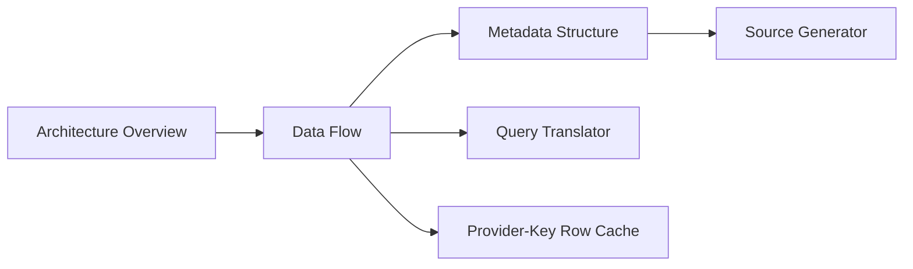

# Internals

This section explains how DataLinq is put together and how data moves through the library.

It is written for maintainers, contributors, and advanced users who want the mental model behind the public API. It is not a replacement for the user-facing usage docs, and it should not expand support claims beyond the tested boundaries.

## Start Here

Read these in order:

1. [Architecture Overview](Architecture%20Overview.md)
2. [Data Flow](Data%20Flow.md)
3. [Metadata Structure](Metadata%20Structure.md)
4. [Source Generator](Source%20Generator.md)
5. [Query Translator](Query%20Translator.md)
6. [Provider-Key Row Cache Architecture](Provider-Key%20Row%20Cache%20Architecture.md)

## The Short Version

DataLinq is organized around a few hard boundaries:

- generated code is part of the runtime contract
- metadata is built through drafts and finalized snapshots
- reads expose immutable instances
- writes go through mutable wrappers and transactions
- row-cache identity is provider-key identity
- LINQ support is a documented subset, backed by tests
- provider metadata support is explicit and intentionally scoped

The pay-off is a runtime that can be faster and easier to reason about than a more permissive ORM. The cost is that unsupported shapes should fail clearly instead of being guessed.

## Map To Public Docs

Use the internals pages together with:

- [Querying](../Querying.md)
- [Caching and Mutation](../Caching%20and%20Mutation.md)
- [Supported LINQ Queries](../Supported%20LINQ%20Queries.md)
- [Provider Metadata Support Matrix](../support-matrices/Provider%20Metadata%20Support%20Matrix.md)
- [Platform Compatibility](../Platform%20Compatibility.md)
