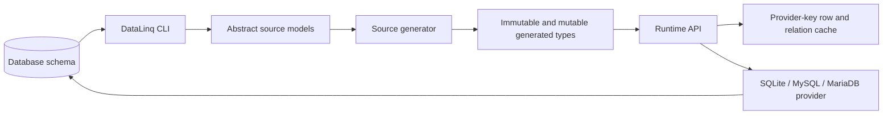

# DataLinq

DataLinq is an immutable-first, source-generated ORM for .NET. It is designed around a narrow but useful idea: push model shape and metadata into generated code so runtime reads, relations, mutations, validation, and caching can be explicit and predictable.

It is a strong fit when you want:

- immutable models instead of ambient mutable state
- generated types instead of reflection-heavy runtime mapping
- aggressive row and relation caching
- a query surface that is grounded in tests instead of ORM wishful thinking
- schema validation and conservative diff tooling without committing to automatic migrations

## Why It Exists

Most ORMs optimize for convenience first and clarity second. DataLinq makes a different trade.

It pushes more work to code generation and metadata so the runtime can stay simpler:

- reads return immutable instances
- relations are cache-aware and lazy
- writes go through explicit mutation objects and transactions
- supported LINQ is deliberately narrower than "all of LINQ", which keeps the behavior easier to reason about

That trade is especially useful in read-heavy applications where object identity, predictable behavior, and low repeated allocation matter.

## The Mental Model



The key is that generated code is not decoration. It is part of the runtime contract: generated metadata, generated factories, generated relation handles, and generated key accessors all help keep runtime behavior boring in the best possible way.

## What It Is Not

DataLinq is not trying to be a universal EF replacement, a full migration engine, or an arbitrary LINQ translator. The public docs describe the supported boundaries because those boundaries matter.

## Start Here

If you are new to DataLinq, this is the shortest sensible path:

1. [Docs Intro](docs/index.md)
2. [Installation](docs/getting-started/Installation.md)
3. [Configuration and Model Generation](docs/getting-started/Configuration%20and%20Model%20Generation.md)
4. [Your First Query and Update](docs/getting-started/Your%20First%20Query%20and%20Update.md)

## What Makes It Different

- **Immutable by default:** query results are immutable model instances.
- **Source-generated model surface:** DataLinq generates the concrete immutable and mutable types from model metadata.
- **Cache-aware runtime:** repeated reads and relation traversal can reuse cached rows instead of rebuilding objects over and over.
- **Explicit mutation workflow:** updates happen through mutable wrappers and transactions rather than hidden dirty tracking.
- **Conservative query support:** the docs only promise the LINQ shapes that are actually covered by tests.

## Small Example

```csharp
using DataLinq;
using DataLinq.MySql;
using MyApp.Models;

var db = new MySqlDatabase<AppDb>(connectionString);

var activeUsers = db.Query().Users
    .Where(x => x.IsActive)
    .OrderBy(x => x.UserId)
    .ToList();

var user = db.Query().Users.Single(x => x.UserId == userId);
var updatedUser = user.Mutate(x => x.DisplayName = "Updated").Save();
```

That is the core DataLinq shape:

- query through generated table properties
- mutate through a mutable wrapper
- save to get back a fresh immutable instance

## Documentation

Once you are through the onboarding flow, the docs split into the main working areas:

- [Intro](docs/index.md)
- [Getting Started](docs/getting-started/Installation.md)
- [Usage](docs/Querying.md)
- [Diagnostics and Metrics](docs/Diagnostics%20and%20Metrics.md)
- [Platform Compatibility](docs/Platform%20Compatibility.md)
- [Changelog](CHANGELOG.md)
- [Roadmap](docs/Roadmap.md)
- [Providers](docs/backends/MySQL-MariaDB.md)
- [Internals](docs/internals/index.md)
- [Contributing](docs/Contributing.md)

## GitHub

If you are browsing from the repository, the [README](README.md) stays focused on the GitHub experience. This page is the website-first landing page.
